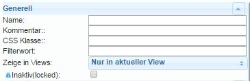
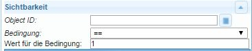
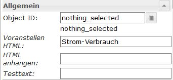
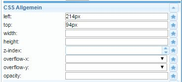
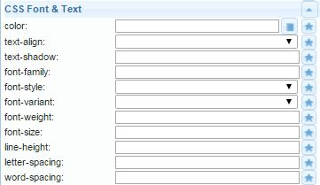
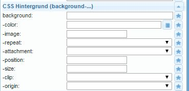
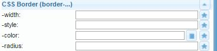
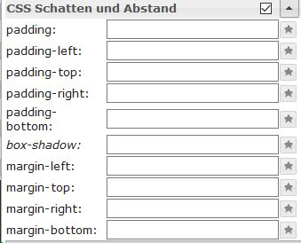

# Общие настройки виджета

**Виджет** — это строительный блок визуализации: он отображает значение, представляет изображение или диаграмму, либо принимает ввод. Виджеты используются для создания пользовательского интерфейса.

Доступные виджеты зависят от установленных **наборов виджетов** . Полный обзор можно найти в разделе [«Наборы виджетов»](/docs/viz/widgetsets.md) . На этой странице описаны настройки **каждого** виджета, независимо от того, к какому набору он принадлежит.

На изображениях показан редактор vis. В **vis-2** поля имеют в основном те же названия, но интерфейс выглядит иначе. Для новых проектов vis-2 — правильный выбор; см. [vis](/docs/viz/vis.md) .

## В целом

| атрибут                   | Описание                                                                                                                    |
| ------------------------- | --------------------------------------------------------------------------------------------------------------------------- |
| имя                       | Здесь вы можете ввести уникальное имя для этого виджета.                                                                    |
| комментарий               | Здесь можно ввести краткое описание.                                                                                        |
| CSS-класс                 | Пользовательский CSS-класс для стилизации виджета с помощью таблицы стилей представления.                                   |
| Фильтр слов               | Ключевое слово, позволяющее отображать и скрывать виджеты группами.                                                         |
| Показать в представлениях | Здесь вы можете выбрать, должен ли этот виджет отображаться только в текущем представлении или в нескольких представлениях. |
| Неактивно (заблокировано) | Блокирует виджет в редакторе, чтобы предотвратить его случайное перемещение.                                                |

## видимость

Видимость виджета может зависеть от состояния точки данных.

| атрибут                        | Описание                                                                                                                                       |
| ------------------------------ | ---------------------------------------------------------------------------------------------------------------------------------------------- |
| `Object ID`                    | Здесь вы вводите идентификатор точки данных, которая будет управлять видимостью выбранного виджета. Точку данных можно найти с помощью кнопки. |
| Состояние                      | Виджет станет видимым, когда будет выполнено условие, указанное здесь для вышеупомянутой точки данных...                                       |
| Значение для данного состояния | ...соответствует значению, введенному здесь.                                                                                                   |

## Собственные настройки виджета

Этот раздел выглядит по-разному для каждого виджета и описан в описании каждого виджета отдельно. Поле **«Идентификатор объекта»** всегда присутствует: оно используется для присвоения точки данных, которую виджет должен отображать или контролировать.

Следующие разделы относятся ко всем виджетам. Для определения внешнего вида виджета используются CSS.

## CSS в целом

| атрибут      | Описание                                                                                                                                                                                                                                                                      |
| ------------ | ----------------------------------------------------------------------------------------------------------------------------------------------------------------------------------------------------------------------------------------------------------------------------- |
| `left`       | Расстояние от левого края поля зрения                                                                                                                                                                                                                                         |
| `top`        | Расстояние от верхнего края поля зрения                                                                                                                                                                                                                                       |
| `width`      | ширина виджета                                                                                                                                                                                                                                                                |
| `height`     | высота виджета                                                                                                                                                                                                                                                                |
| `z-index`    | Укажите слой, на котором расположен виджет (0 = на фоне, положительные значения = чем выше значение, тем дальше вперед).                                                                                                                                                      |
| `overflow-x` | Свойство overflow определяет, что должно произойти, если содержимое выходит за пределы блока элемента. Это свойство указывает, следует ли обрезать содержимое или добавлять полосы прокрутки, если содержимое элемента слишком велико, чтобы поместиться в указанной области. |
| `overflow-y` |                                                                                                                                                                                                                                                                               |
| `opacity`    | Прозрачность (0 = непрозрачное изображение, невидимое; 1 = прозрачное изображение, видимое).                                                                                                                                                                                  |

## CSS-шрифт и текст

\| Атрибут|Описание| |-----|----| |`color` |Цвет шрифта (через диалоговое окно выбора или цветовой код) |`text-align` |Выравнивание текста (слева, справа, по центру) |`text-shadow` |Цвет тени текста|`font-family` |Шрифт |`font-style` |Тип набора символов (обычный, курсив, наклонный, начальный, наследуемый) |`font-variant` |Варианты набора символов (обычный, малый регистр, ...) |`font-weight` Сила набора характеристик |`font-size` |Размер шрифта |`line-height` |Межстрочный интервал|`letter-spacing` |Интервал между символами |`word-spacing` |Интервал между словами

## CSS фон

| атрибут        | Описание                                                                                            |
| -------------- | --------------------------------------------------------------------------------------------------- |
| `background`   | Здесь можно одновременно указать несколько из следующих свойств.                                    |
| `-color`       | Цвет фона                                                                                           |
| `-image`       | Фоновое изображение                                                                                 |
| `-repeat`      | Определяет, будет ли фон повторяться по всей ширине и/или высоте элемента.                          |
| `-attachement` | Определяет, будет ли фоновое изображение фиксированным или перемещаться при прокрутке.              |
| `-position`    | Выравнивание фонового изображения ( <https://www.w3schools.com/cssref/pr_background-position.asp> ) |
| `-size`        | Размер фонового изображения                                                                         |
| `-clip`        | Он контролирует перекрытие с краем.                                                                 |
| `-origin`      | Начало координат системы координат для координат изображения                                        |

## CSS-фреймворк

| атрибут   | Описание                                                                                   |
| --------- | ------------------------------------------------------------------------------------------ |
| `-width`  | Толщина кромки                                                                             |
| `-style`  | Тип линии границы                                                                          |
| `-color`  | Цвет границы                                                                               |
| `-radius` | Радиус скругления углов границы; может составлять не более половины меньшей длины виджета. |

| атрибут   | Описание                                                                                   |
| --------- | ------------------------------------------------------------------------------------------ |
| `-width`  | Толщина кромки                                                                             |
| `-style`  | Тип линии границы                                                                          |
| `-color`  | Цвет границы                                                                               |
| `-radius` | Радиус скругления углов границы; может составлять не более половины меньшей длины виджета. |

## CSS тени и отступы

| атрибут          | Описание                                            |
| ---------------- | --------------------------------------------------- |
| `padding`        | Смещено от края блока виджета                       |
| `padding-left`   | Смещение с левой стороны                            |
| `padding-top`    | Смещение с верхней стороны                          |
| `padding-right`  | Смещение с правой стороны                           |
| `padding-bottom` | Смещение в нижней части                             |
| `box-shadow`     | цвет тени блока виджета                             |
| `margin-top`     | Верхний отступ вокруг виджета (авто, %, px, pt, cm) |
| `margin-right`   | Правый край вокруг виджета                          |
| `margin-bottom`  | Нижний край вокруг виджета                          |
| `margin-left`    | Левый край вокруг виджета                           |

| атрибут          | Описание                                            |
| ---------------- | --------------------------------------------------- |
| `padding`        | Смещено от края блока виджета                       |
| `padding-left`   | Смещение с левой стороны                            |
| `padding-top`    | Смещение с верхней стороны                          |
| `padding-right`  | Смещение с правой стороны                           |
| `padding-bottom` | Смещение в нижней части                             |
| `box-shadow`     | цвет тени блока виджета                             |
| `margin-top`     | Верхний отступ вокруг виджета (авто, %, px, pt, cm) |
| `margin-right`   | Правый край вокруг виджета                          |
| `margin-bottom`  | Нижний край вокруг виджета                          |
| `margin-left`    | Левый край вокруг виджета                           |