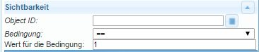

# Виджеты
## Как общее правило
В этом контексте виджеты («устройство, вещь») — это элементы отображения, которые отображают числа, текст, изображения или диаграммы различными способами и предлагают варианты взаимодействия.

## IoBroker.vis Виджеты
Существуют разные наборы виджетов для визуализации в ioBroker с vis.

-------------------------------------------------------------------------------
-------------------------------------------------------------------------------

### Основные настройки виджетов
#### Как общее правило

| атрибут|описание|
|-----|----|

| Имя|Здесь можно ввести уникальное имя для этого виджета | Комментарий|Вы можете ввести краткое описание здесь | Класс CSS|:конструкция: | слово фильтра|:конструкция: | Показать в видах|Здесь вы можете выбрать, должен ли этот виджет отображаться только в текущем представлении или в нескольких.
| Неактивен (заблокирован)|:конструкция:

#### **Видимость**
Видимость виджета можно сделать зависимой от состояния точки данных.

| атрибут|описание|
|----|----|

| `Object ID`|Здесь вводится идентификатор точки данных, которая должна контролировать видимость выбранного виджета. Точку данных можно найти с помощью кнопки .
| Условие|Виджет отображается, если введенное здесь условие для указанной выше точки данных...
| Значение для условия|... равно введенному здесь значению.

#### **Общий**
 Раздел «Общие» относится к каждому виджету и подробно описан для каждого виджета.
В этом разделе желаемая точка данных назначается виджету в поле Object ID.

*** **Настройки CSS** виджета находятся в следующих пунктах меню и могут быть изменены в соответствии с вашими требованиями:

#### **Общий CSS**

| атрибут|описание|
|-----|----|

| `left`|Расстояние от левого края изображения | `top`|Расстояние от верхней точки обзора | `width`|Ширина виджета | `height`|Высота виджета | `z-index`|Указание уровня, на котором находится виджет (0= на заднем плане, положительные значения= чем выше значение, тем дальше впереди) | `overflow-y`|

| `переполнение-у`|
| `opacity`|Прозрачность (0=непрозрачный ->изображение невидимое .. 1=прозрачный ->изображение видимое) |

#### CSS-шрифт и текст

| атрибут|описание|
|-----|----|

| `color`|Цвет шрифта (через диалоговое окно выбора или цветовой код) | `text-align`|выравнивание текста (слева, справа, по центру) | `text-shadow`|Цвет тени текста | `font-family`|Шрифт | `font-style`|Тип набора символов (обычный, курсив, наклонный, начальный, наследуемый) | `font-variant`|Вариант набора символов (обычный, маленькие заглавные, ...) | `font-weight`|Надежность шрифта | `font-size`|Размер шрифта | `line-height`|Интервал между строками | `letter-spacing`|Интервал между символами | `word-spacing`|Интервал между словами

#### **Фон CSS**

| атрибут | Описание |
|-----|-----|

| `background` |Здесь можно указать несколько из следующих свойств | `-color` |Цвет фона | `-image` |Фоновое изображение | `-repeat` |Определяет, повторяется ли фон по всей ширине и/или высоте элемента.
| `-attachement` |Определяет, будет ли фоновое изображение фиксированным или будет перемещаться при прокрутке | `-position` | Ориентация фонового изображения (https://www.w3schools.com/cssref/pr_background-position.asp) | `-size` |Размер фонового изображения | `-clip` |Контролирует пересечение с границей | `-origin` |Начало системы координат для координат изображения

#### **Граница CSS**

|Атрибут|Описание|
|----|----|
|`-width`|Толщина границы| |
|`-color`|Цвет границы|
|`-radius`|угловой радиус границы; может составлять не более половины меньшего расстояния виджета|
|`-radius`|угловой радиус границы; может составлять не более половины меньшего расстояния виджета|

| атрибут|описание|
|-----|----|

| `-width`|Толщина границы | `-style`|Стиль линии границы | `-color`|Цвет границы | `-radius`|угловой радиус границы; может составлять не более половины меньшего расстояния виджета

#### Тень и интервал CSS

|Атрибут|Описание|
|----|----|
|`padding`|Смещение от края окна виджета|
|`padding-top`|Смещение сверху|
|`padding-right`|Смещение справа|
|`padding-bottom`|Смещение в нижней части|
|`box-shadow`|Цвет тени окна виджета|
|`margin-top`|Верхнее поле вокруг виджета (авто, %, px, pt, cm)|
|`margin-right`|Правая граница вокруг виджета|
|`margin-bottom`|Нижняя граница вокруг виджета|
|`margin-left`|Левая граница вокруг виджета|
|`margin-left`|Левое поле вокруг виджета|

| атрибут|описание|
|-----|----|

| `padding`|Смещение от края поля виджета | `padding-left`|Смещение слева | `padding-top`|Смещение сверху | `padding-right`|Смещение справа | `padding-bottom`|Смещение по нижней стороне | `box-shadow`|Цвет тени окна виджета | `margin-top`|Верхнее поле вокруг виджета (авто, %, px, pt, cm) | `margin-right`|Правая граница вокруг виджета | `margin-bottom`|Нижняя граница вокруг виджета | `margin-left`|Левая граница вокруг виджета
