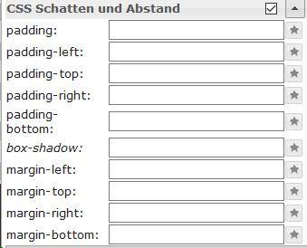

# Виджеты
## В целом
В этом контексте виджеты («устройство, вещь») представляют собой элементы отображения, которые различными способами отображают числа, текст, изображения или диаграммы и предлагают варианты взаимодействия.

## Виджеты ioBroker.vis
Существуют разные наборы виджетов для визуализации в ioBroker с помощью vis.

-------------------------------------------------------------------------------
-------------------------------------------------------------------------------

### Базовые настройки виджетов
#### В целом

| Атрибут|Описание|
|-----|----|

| Имя|Здесь можно ввести уникальное имя для этого виджета | Комментарий|Здесь можно ввести краткое описание | Класс CSS|:конструкция: | Фильтровать слово|:конструкция: | Показать в представлениях|Здесь вы можете выбрать, будет ли этот виджет отображаться только в текущем представлении или в нескольких.
| Неактивно (заблокировано)|:construction:

#### **Видимость**
Видимость виджета может зависеть от состояния точки данных.

| Атрибут|Описание|
|----|----|

| `Object ID`|Здесь вводится идентификатор точки данных, которая должна контролировать видимость выбранного виджета. Точку данных можно найти с помощью кнопки.
| Условие|Виджет становится видимым, если введенное здесь условие для приведенной выше точки данных...
| Значение условия|...соответствует введенному здесь значению.

#### **В целом**
 Раздел «Общие» специфичен для каждого виджета и описан более подробно для каждого виджета.
В этом разделе желаемая точка данных назначается виджету в поле «Идентификатор объекта».

*** **Настройки CSS** виджета находятся в следующих пунктах меню и могут быть адаптированы по вашему желанию:

#### **Общие сведения о CSS**

| Атрибут|Описание|
|-----|----|

| `left`|Расстояние от левого края изображения | `top`|Расстояние от верхнего края изображения | `width`|ширина виджета | `height`|Высота виджета | `z-index`|Укажите уровень, на котором находится виджет (0= на фоне, положительные значения= чем выше значение, тем дальше вперед) | `overflow-y`|

| `переполнение-y`|
| `opacity`|Прозрачность (0=непрозрачный -> изображение невидимое .. 1=прозрачный -> изображение видимое) |

#### Шрифт и текст CSS

| Атрибут|Описание|
|-----|----|

| `color`|Цвет шрифта (через диалог выбора или через цветовой код) | `text-align`|Выравнивание текста (слева, справа, по центру) | `text-shadow`|Цвет тени текста | `font-family`|Шрифт | `font-style`|Тип набора символов (обычный, курсив, наклонный, начальный, наследуемый) | `font-variant`|Вариант набора символов (обычный, прописные, ...) | `font-weight`|Набор символов | `font-size`|Размер шрифта | `line-height`|Междусловный интервал | `letter-spacing`|Интервал между символами | `word-spacing`|Интервал между словами

#### **Фон CSS**

| Атрибут | Описание |
|-----|-----|

| `background` |Здесь можно указать вместе несколько следующих свойств | `-color` |Цвет фона | `-image` |Фоновое изображение | `-repeat` |Определяет, повторяется ли фон по всей ширине и/или высоте элемента.
| `-attachement` |Определяет, является ли фоновое изображение фиксированным или перемещается при прокрутке | `-position` |Ориентация фонового изображения (https://www.w3schools.com/cssref/pr_background-position.asp) | `-size` |Размер фонового изображения | `-clip` |Регулирует перекрытие с краем | `-origin` |Начало системы координат для координат изображения

#### **Граница CSS**

|Атрибут|Описание|
|----|----|
|`-width`|Толщина границы|  |
|`-color`|Цвет границы|
|`-radius`|Угловой радиус границы; может составлять не более половины более короткого маршрута виджета |
|`-radius`|Угловой радиус границы; может составлять не более половины более короткого маршрута виджета |

| Атрибут|Описание|
|-----|----|

| `-width`|Толщина границы | `-style`|Стиль линии границы | `-color`|Цвет границы | `-radius`|Угловой радиус границы; может составлять не более половины более короткого маршрута виджета

#### CSS-тени и интервалы

|Атрибут|Описание|
|----|----|
|`padding`|Смещение от края поля виджета|
|`padding-top`|Смещение сверху|
|`padding-right`|Смещение справа|
|`padding-bottom`|Смещение по нижней стороне|
|`box-shadow`|Цвет тени окна виджета|
|`margin-top`|Верхнее поле вокруг виджета (авто, %, px, pt, см)|
|`margin-right`|Правая рамка вокруг виджета|
|`margin-bottom`|Нижняя граница виджета|
|`margin-left`|Левая рамка вокруг виджета|
|`margin-left`|Левое поле вокруг виджета|

| Атрибут|Описание|
|-----|----|

| `padding`|Смещение от края поля виджета | `padding-left`|Смещение слева | `padding-top`|Смещение верхней стороны | `padding-right`|Смещение справа | `padding-bottom`|Смещение нижней стороны | `box-shadow`|Цвет тени окна виджета | `margin-top`|Верхнее поле вокруг виджета (авто, %, px, pt, см) | `margin-right`|Правая рамка вокруг виджета | `margin-bottom`|Нижняя граница виджета | `margin-left`|Левая рамка вокруг виджета