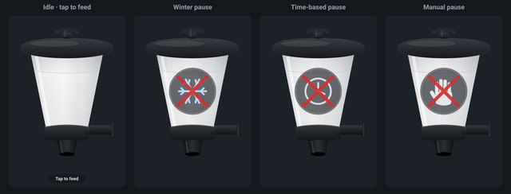

# Наборы виджетов

Виджет — это строительный блок на странице визуализации: переключатель, диаграмма, часы, плитка. Доступные строительные блоки зависят от того, какие **наборы виджетов** установлены. Каждый набор представляет собой отдельный адаптер. После установки его строительные блоки автоматически появляются в палитре редактора, отсортированные по названию набора.

Виджеты **доступны только для vis и vis-2** . Другие интерфейсы формируются на основе устройств и категорий и не имеют опций выбора: [адаптер устройств](/docs/viz/devices.md) и [Lovelace](/docs/viz/lovelace.md) . Пользователям одного из этих интерфейсов эта страница не нужна. **webui** имеет свои собственные строительные блоки, но в этом смысле наборы виджетов отсутствуют.

На этой странице описано **расположение всех наборов виджетов.** Полный и всегда актуальный список можно найти в [обзоре адаптера](/adapters) в группе **«Виджеты визуализации»** ; кроме того, есть группа **«Визуализация»** для самих пользовательских интерфейсов и группа **«Значки визуализации»** для коллекций значков. Каждая запись содержит ссылку на страницу адаптера с указанием его версии, автора и инструкций.

Наборы виджетов не создают точки данных и не работают непрерывно. Они лишь предоставляют файлы, которые загружаются при открытии страницы. Поэтому создавать экземпляр не нужно: установите, перезагрузите редактор, и всё готово.

Изображения на этой странице взяты непосредственно из самих адаптеров. Это те же самые изображения предварительного просмотра, которые также отображаются в палитре редактора.

Будьте экономичны! Каждый установленный набор загружается при открытии страницы. Дюжина наборов всего для трех используемых строительных блоков заметно замедлит визуализацию, особенно на планшете, закрепленном на стене.

## Что уже предлагает vis-2

vis-2 поставляется с пятью комплектами, которые не требуют отдельной установки:

| Предложение | За что                                                                                                      |
| ----------- | ----------------------------------------------------------------------------------------------------------- |
| `basic`     | Текст, цифры, изображения, рамки, переключатели, навигация: основные строительные блоки. Около 40 виджетов. |
| `jqui`      | Кнопки, ползунки, поля ввода и диалоговые окна в стиле jQuery UI.                                           |
| `jqplot`    | Простые диаграммы, составленные на основе записанных значений.                                              |
| `swipe`     | Страницы, которые можно переключать пальцем.                                                                |
| `tabs`      | Вкладки внутри представления.                                                                               |

Это позволяет создать полноценную страницу без каких-либо дополнительных адаптеров. Отдельные компоненты описаны в разделе [«Включенные виджеты»](/docs/viz/basic.md) .

## Предложения для vis-2

### материал

Универсальный набор для vis-2: выключатели, термостат, жалюзи, камера, дверной замок, исторические данные измерений, музыкальный плеер, пылесос. Компоненты скоординированы и адаптируются как к светлой, так и к темной теме оформления. Это идеальная отправная точка для тех, кто только начинает работать с vis-2.

19 виджетов · bluefox · последнее обновление 05/2026 · [подробное описание](/docs/viz/widgets-material.md) ·[`vis-2-widgets-material`](/adapters/vis-2-widgets-material)

### Коллекция

Разнообразная и постоянно пополняющаяся коллекция от сообщества: группы кнопок, поля выбора, ползунки, таблицы JSON, цветовые круги, указатели, диалоговые окна. Полезное дополнение к материалам, когда отсутствует элемент управления.

13 виджетов · Steiger04 · последнее обновление 07/2026 · [подробное описание](/docs/viz/widgets-collection.md) ·[`vis-2-widgets-collection`](/adapters/vis-2-widgets-collection)

### Материальный дизайн для vis-2

Переработанные виджеты Material Design, на этот раз созданные непосредственно для vis-2, а не с помощью старых строительных блоков vis. Они основаны на работе Scrounger и в основном охватывают его набор: плитки, списки, таблицы, диаграммы, ползунки и выбор иконок.

49 виджетов · typhosj · с сентября 2026 г. · [Material Design](/docs/viz/widgets-materialdesign.md) ·[`vis2-materialdesign`](/adapters/vis2-materialdesign)

### JägerDesign

Предварительно разработанные блоки для освещения, отопления, жалюзи, камер и сообщений, а также виджет компоновки, который преобразует их в полноценную страницу с боковой панелью. Полностью разработанный общий макет вместо отдельных элементов.

**Единственный платный набор виджетов в каталоге.** Это не система собственной разработки, а дизайн, созданный дизайн-студией; лицензия распространяется на эту работу. Она действительна пожизненно и привязана к UUID установки. Вы можете попробовать его без лицензии: виджеты будут отображаться в редакторе, но исчезнут после запуска визуализации. Цены и условия указаны в [обзоре продукта](/productoverview) .

9 виджетов · bluefox · последнее обновление 04/2026 · [подробное описание](/docs/viz/widgets-jaeger.md) ·[`vis-2-widgets-jaeger-design`](/adapters/vis-2-widgets-jaeger-design)

### inventwo for vis-2

Календарь, список встреч, списки значений, универсальная плитка, радиальный контроллер и другие строительные блоки в дизайне inventwo. Аналог более старого [дизайна inventwo](#inventwo-design) для vis 1.

11 виджетов · jkvarel · последнее обновление 09/2026 · [подробное описание](/docs/viz/widgets-inventwo.md) ·[`vis-2-widgets-inventwo`](/adapters/vis-2-widgets-inventwo)

### Технологии

Окна, ставни, выключатели и диммеры: немногочисленные, но четко прорисованные элементы с множеством промежуточных состояний.

3 виджета · Sefina-DS · с июня 2026 г. ·[`vis-2-widgets-technic`](/adapters/vis-2-widgets-technic)

### Приборы

Указательные индикаторы: уровень заряда батареи, уровень заполнения, цветовая шкала.

3 виджета · bluefox · последнее обновление 08/2025 ·[`vis-2-widgets-gauges`](/adapters/vis-2-widgets-gauges)

### энергия

Поток энергии между сетью, фотоэлектрическими системами, накопителями энергии, тепловым насосом и автомобилем, включая сравнение потребления за выбираемый период. Требуются записанные значения от адаптера тренда.

4 виджета · bluefox · последнее обновление 08/2026 ·[`vis-2-widgets-energy`](/adapters/vis-2-widgets-energy)

### Погода и отопление

Прогноз погоды и полное управление отоплением: обзор помещения, временные профили, состояние окон, оценка последних недель.

11 виджетов · rg-engineering · последнее обновление 07/2026 ·[`vis-2-widgets-weather-and-heating`](/adapters/vis-2-widgets-weather-and-heating)

### RSS-лента

Новости и ленты в пользовательском интерфейсе, по желанию в виде списка, бегущей строки или отдельных сообщений.

5 виджетов · oweitman · последнее обновление 07/2026 ·[`vis-2-widgets-rssfeed`](/adapters/vis-2-widgets-rssfeed)

### яичник

Единый виджет, позволяющий свободно форматировать содержимое точки данных, предназначенный в качестве инструмента для создания пользовательских решений.

1 Виджет · oweitman · последнее обновление 10/2025 ·[`vis-2-widgets-ovarious`](/adapters/vis-2-widgets-ovarious)

### Sweet Home 3D

Отображает план помещения, созданный с помощью SweetHome 3D, в качестве пространственной модели и управляет освещением и устройствами в нем.

1 виджет · bluefox · последнее обновление 07/2024 ·[`vis-2-widgets-sweethome3d`](/adapters/vis-2-widgets-sweethome3d)

### Предложения, относящиеся к конкретному адаптеру.

Эти предложения имеют смысл только в сочетании с одноименным адаптером; они представляют собой его данные и не служат никакой другой цели.

| Предложение                                                                                                                                            | Принадлежит к                                                                      | Статус  |
| ------------------------------------------------------------------------------------------------------------------------------------------------------ | ---------------------------------------------------------------------------------- | ------- |
| [`vis-2-widgets-sigenergy`](../../de/viz/adapters/vis-2-widgets-sigenergy)                                  | Инверторы и системы хранения энергии Sigenergy                                     | 09/2026 |
| [`vis-2-widgets-radar-trap`](../../de/viz/adapters/vis-2-widgets-radar-trap)                        | Предупреждения о камерах контроля скорости и нарушениях на маршруте от`radar-trap` | 12/2024 |
| [`vis-2-widgets-automatic-feeder`](../../de/viz/adapters/vis-2-widgets-automatic-feeder) | Автоматическая подача`automatic-feeder`                                            | 09/2026 |
| [`vis-2-widgets-tibberlink`](/adapters/vis-2-widgets-tibberlink)                                                                                       | Цены на электроэнергию от`tibberlink`                                              | 07/2026 |

## Предложения из vis 1

Эти предложения относятся ко времени vis 1. Большинство из них можно использовать и в vis-2, поскольку vis-2 по-прежнему может отображать старые элементы. Однако они будут выглядеть так же, как и в vis 1, и не будут соответствовать тематике vis-2.

Для создания новой страницы в Vis-2 стоит сначала взглянуть на приведенные выше предложения. Более старые предложения в основном актуальны для уже существующих проектов.

### Материальный дизайн

Согласно Material Design от Google, наиболее распространенный набор правил для визуализации 1 включает в себя плитки, списки, таблицы, диаграммы, ползунки, пользовательский набор значков и единую цветовую схему. Последняя версия датируется 2021 годом.

Дальнейшая разработка была выпущена в виде отдельного адаптера для vis-2, см. [Material Design для vis-2](#material-design-für-vis-2) .

46 виджетов · Scrounger · Последнее обновление 06/2021 · [Подробное описание](/docs/viz/widgets-materialdesign.md) ·[`vis-materialdesign`](/adapters/vis-materialdesign)

### Материалы продвинутые

Стандартизированные строительные блоки для окон, дверей, освещения, отопления и рольставней, все они построены по одному шаблону и настраиваются с помощью общего списка свойств.

26 виджетов · EdgarM73 · последнее обновление 09/2023 ·[`vis-material-advanced`](/adapters/vis-material-advanced)

### HQ виджеты

Плитка в стиле диспетчерской: лампы, ставни, двери, индикаторы температуры, каждый элемент имеет свой цвет, указывающий на его состояние. Один из старейших комплектов, который до сих пор находится в хорошем состоянии.

20 виджетов · bluefox · последнее обновление 04/2026 ·[`vis-hqwidgets`](/adapters/vis-hqwidgets)

### inventtwo Design

Полностью разработанный пакет со своим собственным визуальным языком, на основе которого можно создать полноценный темный интерфейс. Он продолжает поддерживаться и теперь также включает компоненты для vis-2.

jkvarel · Последнее обновление 06/2026 · [Подробное описание](/docs/viz/widgets-inventwo.md) ·[`vis-inventwo`](/adapters/vis-inventwo)

### плитки HomeKit

Плитки в стиле Apple HomeKit, с цветами и символами, обычно используемыми в этой системе.

19 виджетов · Для обычного пользователя · Последнее обновление 01/2026 ·[`vis-homekittiles`](/adapters/vis-homekittiles)

### метро

Крупные цветные плитки в стиле Metro, представленном в Windows 8.

28 виджетов · hobbyquaker · последнее обновление 02/2022 ·[`vis-metro`](/adapters/vis-metro)

### JQui MFD

Переключатели, индикаторы и символы созданы на основе чертежей проекта OpenAutomationProject. Классический макет для создания лаконичных, технически выглядящих страниц.

29 виджетов · hobbyquaker · последнее обновление 01/2026 ·[`vis-jqui-mfd`](/adapters/vis-jqui-mfd)

### ЛКАРС

Интерфейс из «Звездного пути», для тех, кому он нравится: полосы, кнопки и варп-ядро в качестве индикатора прогресса.

21 виджет · hobbyquaker · последнее обновление 06/2023 ·[`vis-lcars`](/adapters/vis-lcars)

### материал

Семь элементов для отображения света, окон, жалюзи и температуры, каждый со своим дизайном. Не путать с **Material Design** или **Material** для vis-2.

7 виджетов · nisiode · последнее обновление 01/2025 ·[`vis-material`](/adapters/vis-material)

### Отвес

Трубы, насосы, клапаны и соединительные линии. Предназначены для схематических чертежей системы отопления, цистерны или системы полива сада.

19 виджетов · smiling\_Jack · последнее обновление 03/2019 ·[`vis-plumb`](/adapters/vis-plumb)

### Время и погода

Аналоговые и цифровые часы, дата, время восхода и захода солнца, а также многодневный прогноз погоды с меняющимся фоновым изображением. Требуется, например, метеорологический адаптер.`daswetter` или`weatherunderground` .

8 виджетов · bluefox · последнее обновление 07/2022 ·[`vis-timeandweather`](/adapters/vis-timeandweather)

### Погода

Более подробное представление данных о погоде с графиками тренда, также основанное на`daswetter` или`weatherunderground` .

1 виджет · Рене Г. · последний 10/2025 ·[`vis-weather`](/adapters/vis-weather)

### Выбор цвета

Выбор цвета для RGB-светильников в нескольких вариантах исполнения: цветовой круг, цветовое поле, регулировка оттенка, баланс белого.

9 виджетов · bluefox · последнее обновление 11/2025 ·[`vis-colorpicker`](/adapters/vis-colorpicker)

### Указательные инструменты

Три предложения со схожей целью. Какое из них подойдет — это, прежде всего, вопрос вкуса.

| Предложение                                        |                                                                          | Статус  |
| -------------------------------------------------- | ------------------------------------------------------------------------ | ------- |
| [`vis-justgage`](/adapters/vis-justgage)           |                               | 03/2024 |
| [`vis-canvas-gauges`](/adapters/vis-canvas-gauges) |  | 09/2022 |
| [`vis-rgraph`](/adapters/vis-rgraph)               |                                   | 10/2015 |

### Диаграммы и тенденции

| Предложение                                                                                       |                                           | Статус  |
| ------------------------------------------------------------------------------------------------- | ----------------------------------------- | ------- |
| [`vis-history`](/adapters/vis-history) Таблица и столбчатая диаграмма зарегистрированных значений |  | 10/2019 |
| [`vis-bars`](/adapters/vis-bars) простые столбчатые диаграммы                                     |        | 05/2017 |

Для корректного отображения схем необходимы адаптеры.`echarts` или`flot` лучший выбор; оба варианта предоставляют свои собственные строительные блоки для визуализации.

### карты

| Предложение                                                                                        |                                     | Статус  |
| -------------------------------------------------------------------------------------------------- | ----------------------------------- | ------- |
| [`vis-map`](/adapters/vis-map) Места на карте, например, полученные с помощью адаптера. `radar`    |  | 07/2024 |
| [`vis-mapwidgets`](/adapters/vis-mapwidgets) : более новые компоненты карты, в том числе для vis-2 |                                     | 08/2026 |

### Более

| Предложение                                      | За что                                                                        |                                                   | Статус  |
| ------------------------------------------------ | ----------------------------------------------------------------------------- | ------------------------------------------------- | ------- |
| [`vis-players`](/adapters/vis-players)           | Элементы управления для Sonos, Winamp и других плееров.                       |           | 05/2020 |
| [`vis-keyboard`](/adapters/vis-keyboard)         | Экранная клавиатура и цифровая клавиатура для планшетов, крепящихся на стену. |      | 10/2025 |
| [`vis-fancyswitch`](/adapters/vis-fancyswitch)   | Переключатели и тумблерные переключатели с анимацией                          |  | 10/2017 |
| [`vis-jsontemplate`](/adapters/vis-jsontemplate) | Таблицы и списки на основе данных JSON, в том числе для vis-2.                |                                                   | 07/2026 |
| [`vis-3dmodel`](/adapters/vis-3dmodel)           | демонстрирует 3D-модель, созданную в Blender.                                 |                                                   | 04/2021 |

## Сочинения

Два адаптера не предоставляют готовых компонентов, а лишь шрифты, которые затем можно выбрать в каждом виджете.

[`vis-google-fonts`](/adapters/vis-google-fonts) включает в себя шрифты Google.[`vis-material-webfont`](/adapters/vis-material-webfont) Символический шрифт Material Design.

## Наборы символов

Символы — это не строительные блоки, а изображения, которые можно выбирать во многих виджетах. После установки коллекция становится доступной в диалоговом окне выбора символов.

[MFD в формате PNG](/adapters/icons-mfd-png) и [SVG](/adapters/icons-mfd-svg) · [Material в формате PNG](/adapters/icons-material-png) и [SVG](/adapters/icons-material-svg) · [Ultimate](/adapters/icons-ultimate-png) · [Smarthome](/adapters/icons-smarthome) · [Eclipse SmartHome Classic](/adapters/icons-eclipse-smarthome-classic) · [Open Icon Library](/adapters/icons-open-icon-library-png) · [FatCow](/adapters/icons-fatcow-hosting) · [Freepic](/adapters/icons-freepic) · [icons8](/adapters/icons-icons8) · [Addictive Flavor](/adapters/icons-addictive-flavour-png) · [Icontwo](/adapters/vis-icontwo)

## Выберите и установите

Все наборы находятся на вкладке [«Адаптер»](/docs/admin/adapter.md) в разделе **«Виджеты визуализации»** , а коллекции символов — в разделе **«Символы визуализации»** . После установки перезагрузите редактор; новый набор появится в палитре.

В поле **«Статус»** указан месяц последней публикации в каталоге адаптера. Оно ничего не говорит о том, работает ли предложение; многие старые предложения надежно работают уже много лет. Оно лишь указывает на вероятность получения помощи при возникновении проблемы.