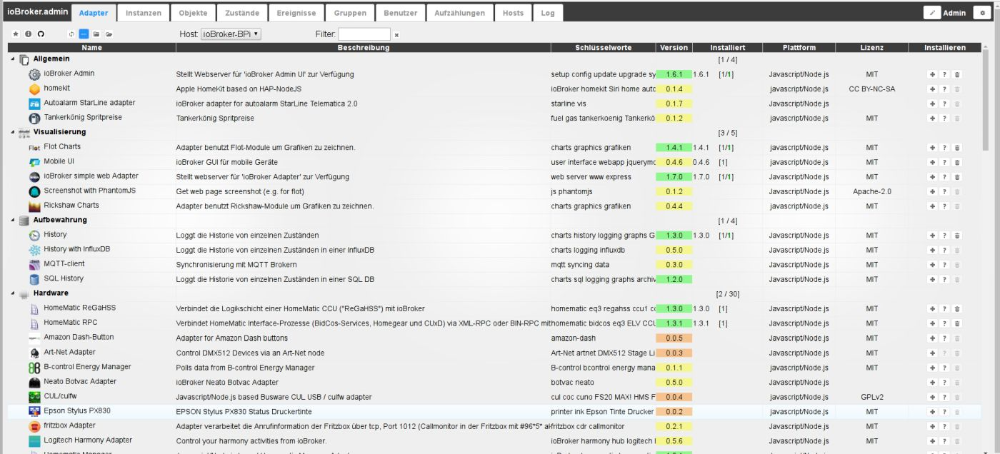
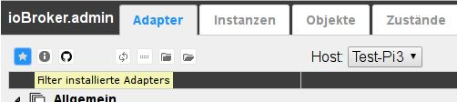
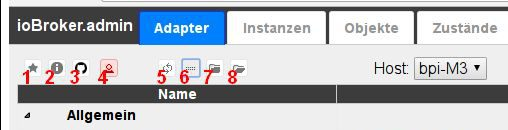
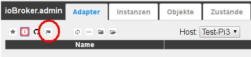
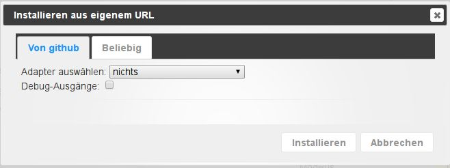
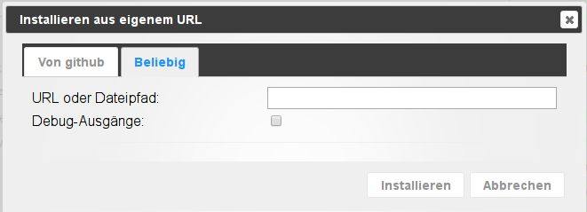
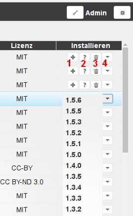
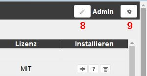
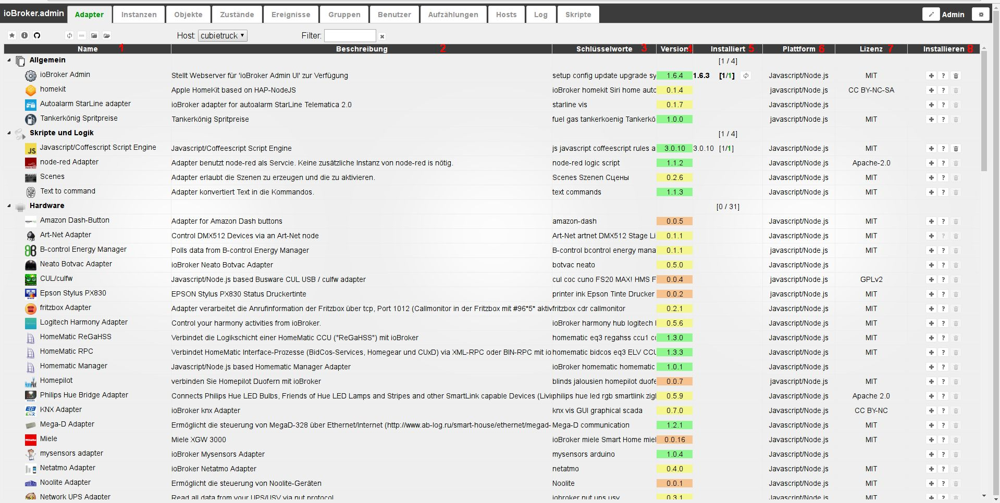

# 适配器选项卡
可用和已安装的适配器在此处显示和管理。

## 标题行
标题栏包含最重要进程的图标。
每个图标都有上下文帮助。只需将鼠标放在图标上一会儿。

### **详细图标：**

### **1.) 仅显示已安装的适配器**
选择此图标时，仅显示已安装的适配器（切换功能）

### **2.) 查看带有更新的适配器**
选择此图标时，仅显示有可用更新的适配器（切换功能）

在可更新适配器后面的 **_installed_** 列中有一个更新图标。
通过单击此按钮，相应的适配器将更新到最新版本。

此外，标题栏中还会出现另一个图标：

单击此图标将更新所有可用的适配器。

### **3.) 从自己的 URL 安装适配器**
可以使用 Octocat 图标从它们自己的路径（URL 或文件路径）或 GitHub 的预发布版本安装适配器。

单击此图标后，将打开一个相应的选择窗口：

在 **_From github_** 选项卡下，只需从下拉菜单中选择所需的适配器，即可安装最新的预发布版本。

如果您选择任何选项卡，您可以在字段中输入任何文件路径或任何 URL（例如，外部适配器开发人员的 URL），并且可以安装相应的适配器。

### **4.) 开启专家模式**
专家模式还可以安装旧版本的适配器。
如果选择此按钮，则每个适配器的最右侧会出现一个下拉菜单 (4)，通过该菜单可以安装早期版本。

### **5.) 检查更新**
每次重新启动时，它都会自动检查更新。您可以使用此按钮手动开始搜索。

如果在 [系统设置](#Systemeinstellungen) 下设置的存储库中有可用更新，则 **_Adapter_** 选项卡的字体显示为绿色。

### **5.) 更改排序**
此按钮更改此页面上适配器的排序。

当按钮处于活动状态时，所有适配器都按字母顺序排序，首先显示一个带有已安装适配器的块，然后是一个带有尚未安装的适配器的块。这两个块中的每一个都按字母顺序排序。

如果此按钮未激活，适配器将按主题排序。

然后接下来的两个图标也可见。

### **6.) 关闭所有主题**
### **7.) 展开所有主题**
右侧还有两个按钮

### **8.) 编辑选项卡**
此按钮可用于隐藏不需要的选项卡并显示不可见的选项卡。

### ** 9.) 系统设置**
ioBroker 的基本参数设置在这里。

##页面内容
 适配器在页面上以表格形式显示。该表由以下列组成：

### **1.) 姓名**
此列中列出了带有相关图标的适配器名称。
如果通过标题栏中的图标 (5) 选择了适配器分组，组名也会出现在此处。

### **2.) 说明**
下面简单介绍一下适配器的功能

### **3.) 关键字**
以下是与适配器相关的一些搜索词。

### **第四版**
可用版本显示在这里。适配器的开发状态以颜色突出显示以提供概览。 （红色 = 计划中；黄色 = beta；橙色 = alpha；绿色 = 最终）。

### **5.) 已安装**
此列提供有关此适配器安装状态的各种信息。
一方面是已安装适配器的版本号。如果以粗体显示，则表示有更新。之后，方括号中是此适配器安装的实例数、启用的实例数以及它们的状态。 [2/1] 表示此适配器有两个实例，其中一个已激活并正常运行（后者可以通过第二个数字的绿色识别）。如果此适配器有更新，则右侧有一个更新图标。单击此图标将启动更新过程。

### **6.) 平台**
此处指定了此适配器所基于的软件平台。通常这是nodejs下的javascript。

### **7.) 许可证**
这是适配器可用的许可证。许可条件通常可以在自述文件中找到。如果许可需要最终用户接受，则在创建实例时会出现许可条款窗口。

### **8.) 安装**
此列包含用于安装和帮助的各种按钮。

1. (+) 这添加了一个适配器实例。这仍然必须在“实例”选项卡中配置和激活。对于大多数适配器，可以安装任意数量的实例，例如用于处理不同的硬件。如果无法做到这一点，则会打开一个带有相应错误消息的窗口。
2. (?) 当此按钮处于活动状态时，它会链接到适配器的帮助页面。这通常位于 GitHub 上，其中也维护了适配器。
3.（垃圾桶）此按钮删除适配器和所有已安装的实例
4.（下拉菜单）可以通过此菜单安装相应适配器的先前版本。此下拉菜单仅在专家模式下可见。