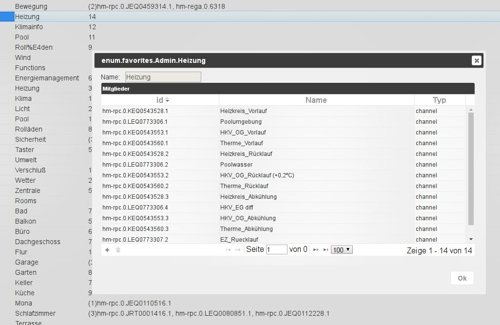

# 枚举选项卡
此处列出了 Homematic CCU 的收藏夹、交易和房间。
例如，您还可以创建自己的列表，然后可以在脚本中使用该列表。

## 标题行
标题栏包含最重要进程的图标。
每个图标都有上下文帮助。为此，只需将鼠标放在图标上一段时间即可。

### **图标详细说明：**
### **1.) 更新视图**
如果刚刚创建的列表不可见，单击此图标将有助于使页面状态保持最新。

### **2.) 更改排序**
此按钮更改此页面上对象的排序。

当该按钮处于活动状态时，所有对象均按字母顺序排序。
如果此按钮未激活，则对象将以树结构分层显示。

然后接下来的两个图标也将可见。

### **3.) 折叠所有子文件夹**
### **4.) 展开所有子文件夹**
### **5.) 添加**
选择此图标后，可以将更多列表添加到基本结构中。
文件夹结构中的元素是使用右侧的 (+) 图标创建的 (#10)。
配置窗口打开：

现在必须在此处选择新枚举的名称；生成的 ID 将自动调整。

### 页面内容

该页面以表格形式显示现有枚举及其成员。

该表由以下列组成（列标题 6、7 和 8 下的字段用作过滤条件）。图中的表格按照层次结构排列，所有子项（节点）都已展开：

### **6.) ID**
此处列出了列表中的所有成员及其 ID。可以通过双击或单击关联的铅笔图标 (#9) 来更改此名称。
下级结构的完整ID还包括其前面的更高级别的级别。

### **7.) 姓名**
此栏显示成员的姓名。 可以通过双击或单击关联的铅笔图标 (#9) 来更改此名称。

### **8.) 成员**
该列显示列表的成员；如果太多，则仅显示数量。
如果将鼠标移到该字段上，所有成员都会显示在气泡信息中。
可以通过最右侧的信息图标获取更多信息 (#12)

### **9.) 编辑标签**
单击此图标后，您可以编辑 ID 和名称列中的名称。
此时会出现复选标记形式的确定按钮和 (x) 形式的取消图标。

### **10.) 添加结构元素**
单击此图标后，将打开一个对话框窗口，可以在其中在相应的结构中创建新成员。

在这里，名称也可以单独选择。关联的ID是根据结构和选择的名称自动生成的。

### **11.) 删除项目**
垃圾桶图标删除该行中的元素

### **12.) 信息**
单击此图标后，将显示另一个窗口，其中包含有关所选元素的扩展信息。

