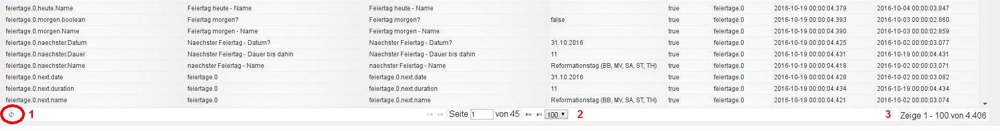

# 活动选项卡
所有数据点的当前状态都显示在此选项卡中。值也可以更改。

## 页面内容
现有对象显示在页面上的表格中。通过根据相应列的内容单击列标题，可以按字母升序或降序对列进行排序（切换功能）。以下字段用于根据您自己的标准过滤数据点。

该表由以下列组成：

### **1.) ID**
这是相应数据点的唯一名称，根据结构组成，例如适配器名称.实例编号.设备名称.通道名称.数据点名称。

### **2.) 父母姓名**
与第 3 栏名称中的内容相同。

### **3.) 姓名**
数据点的名称。这可以是自动生成的名称，也可以是手动分配的更容易理解的名称。该名称不必是唯一的。

### **4.) 价值**
数据点的当前值在此处指定。

该值是可编辑的

### **5.) 已确认**
如果该值已更改并且已被系统采用，则该值为_true_，否则为_false。_

### **6.) 来源**
这指示哪个实例对数据点进行了最后的更改。

### **7.) 时间**
这是数据点上次更新的时间戳。

### **8.) 已更改**
这是数据点的值上次更改的时间戳。

## 页脚
页脚中有更多信息

### **1.) 重新加载**
单击此图标可以更新表。

### **2.) 页面信息**
页脚中间的信息块提供了使用下拉菜单设置每页行数的选项。每页可显示 20、100、200、500 和 1000 行。这里还有关于总共有多少页的信息，以及使用箭头图标向前或向后滚动页面的选项。

### **3.) 数据点信息**
此信息指示当前页面上显示的现有数据点的总数及其范围。