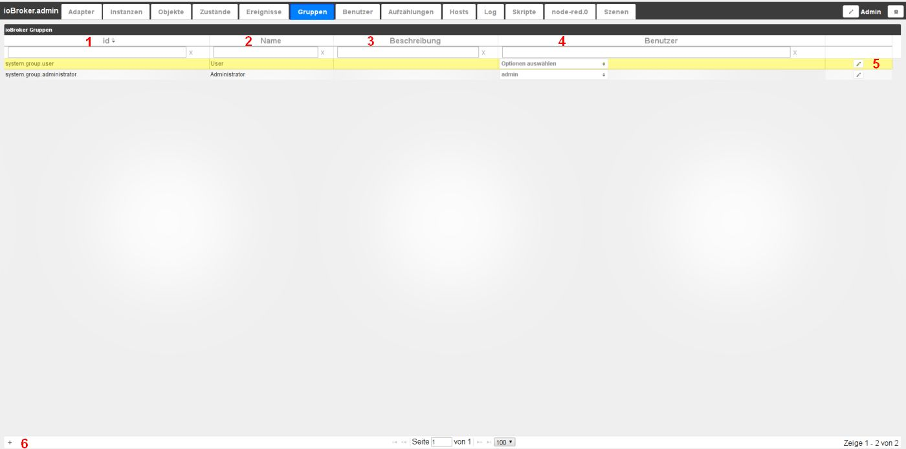
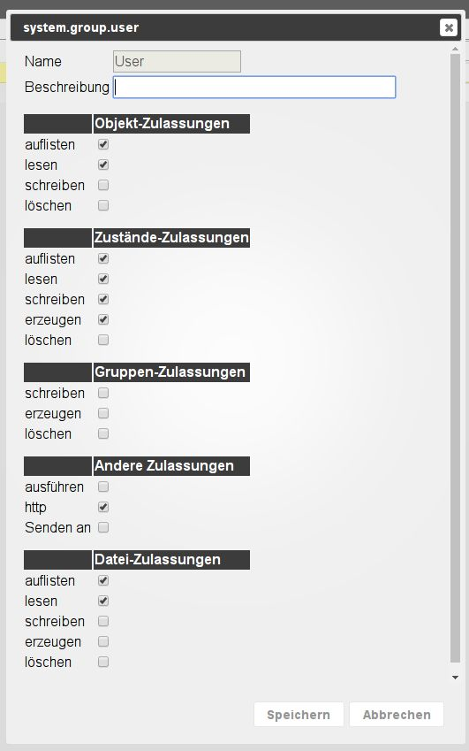

# 组选项卡
单击屏幕左下方的 (+) 可以在此处创建具有不同权限的用户组。

##页面内容
现有组在页面上以表格形式显示。列标题中的字段用于根据您自己的条件过滤表。

该表由以下列组成：

### **1.) ID**
这是每个组的唯一名称，根据由 system.group.groupname 组成的结构。

### **2.) 姓名**
组的名称。此名称可自由选择。此名称必须是唯一的。

### **3.) 说明**
可以在此处添加描述，例如引用该组中的权限。

### **4.) 用户**
在 **_User_** 选项卡中创建的用户显示在此处，并且可以通过复选框分配给选定的组。

### **5.) 调整权限**
单击铅笔符号会打开另一个窗口，可以在其中调整该组的权限。

### **6.) 创建新组**
可以使用此图标创建一个新组，该图标使用之前的项目进行配置。