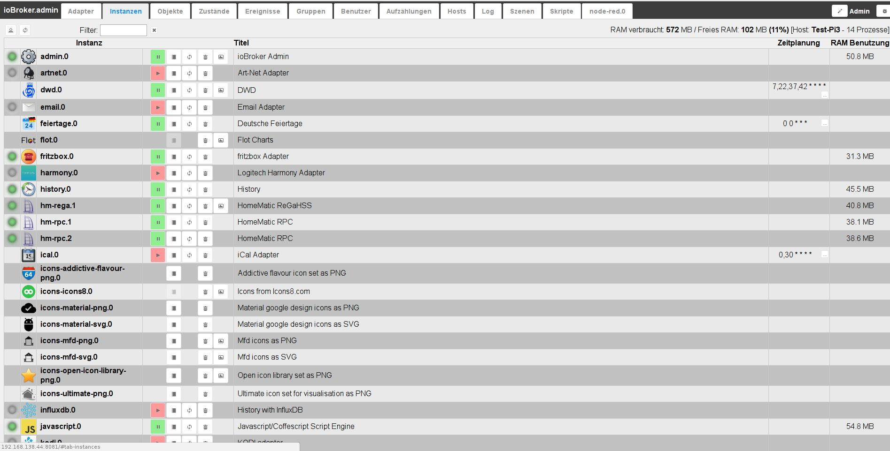
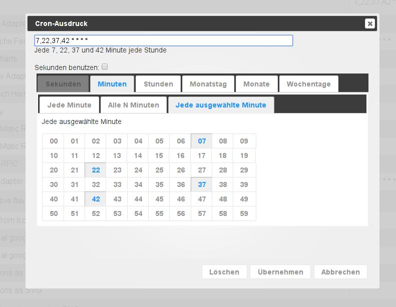

# 实例选项卡
已通过“适配器”选项卡安装的实例在此处列出，并且可以进行相应配置。

## 标题行
标题栏包含最重要进程的图标。每个图标都有上下文帮助。
只需将鼠标放在图标上一会儿。还有关于服务器负载的信息

### **详细图标：**
### **1.) 开启管理员模式**
当您选择此图标时，将显示用于配置实例的附加列（切换功能）。
这方面的信息可以在页面内容部分找到。

### **2.) 刷新视图**
如果刚刚创建的实例不可见，单击此图标将有助于更新页面的状态。

### **3.) 服务器的状态信息**
在标题栏的右侧，有关于实例活动和 ioBroker 服务器利用率的信息。

第一个数字表示到目前为止实例使用的内存和剩余的可用内存（以 MB 为单位）。之后以 % 为单位的空闲内存。方括号中是 ioBroker 服务器的名称和正在运行的进程数。

##页面内容

该页面以表格形式列出了已安装的适配器实例。

该表由以下列组成：

### **1.) 状态**
实例的状态在此处通过红绿灯显示。将鼠标悬停在信号上可以获得更多信息。

并非所有实例都有此红绿灯。但这不是恐慌的理由。这些要么是时间控制的实例，仅短暂连接到控制器，然后立即再次关闭，要么继续在后台运行，例如 vis。

### **2.) 图标**
此适配器在整个 ioBroker 中使用的图标显示在此处

### **3.) 实例**
此列包含实例的名称。它由适配器的名称和按实例安装顺序连续编号的编号组成。第一个实例获得 0。
该名称是 ioBroker 中数据点名称的基础。

### 4.) 激活
这是实例启动或停止的地方。绿色的暂停标志表示适配器正在运行，点击即可暂停，红色的播放标志表示已停止的实例，点击即可启动。

### **5.) 配置**
单击此图标可打开特定于适配器的配置菜单。相应的菜单在相应的[适配器](http://www.iobroker.net/?page_id=2236&lang=de)中进行了描述。

### **6.) 重启**
当你点击这个图标时，对应的实例会重启

### **7.) 垃圾桶**
使用此图标删除相应的实例。相同适配器的其他实例仍然存在。
适配器本身也保留了下来。

### **8.) 网页链接**
在此图标后面有一个指向此实例网站的链接。要么是因为此适配器带来了自己的 Web 界面（具有不同的端口），要么只是不同的路径。在某些情况下，此链接还指向帮助页面。

### **9.) 标题**
实例的名称在此处指定。您可以根据自己的意愿或需要更改此名称。如果有多个适配器实例（否则具有相同的名称），这将特别有用。例如，如果 RF、Wired 和 CuxD 各有一个实例，则 hm-rpc 就是这种情况。

### **10.) 调度**
对于在时间控制的基础上启动的适配器，在此输入该适配器的启动时间。
该时间表的格式为[cron 工作](https://de.wikipedia.org/wiki/Cron#Beispiele)。
要更改它，请单击带有三个点的按钮。将打开一个输入窗口，其中包含许多附加信息和帮助。

### **11.) 重新启动**
如果选中此复选框，则还可以在此处创建计划，何时应重新启动此实例。

### **12.) 日志级别**
在此列中，可以调整实例的相应日志级别。调试、信息、警告和错误可用。默认情况下，此值设置为 info。如果您觉得某些东西运行不顺畅，您可以将其设置为调试。然后此实例的日志选项卡还会显示有助于查找错误的调试信息。相反，您也可以将此值设置得更高，以使日志不那么广泛。

### **13.) RAM 限制**
您可以在此处指定应为实例提供多少内存作为预防措施。
然后，此内存量不再可用于其他任务，并且不应选择太高，尤其是在主内存很少的系统中。如果实例暂时需要更多内存，系统当然会分配给你，但随后会立即再次为系统释放。在实例需要的内存超过预留的内存期间，所需内存以红色显示。

### 14.) 内存使用情况
此处显示实例实际使用的内存。这些值会定期更新。更新后，这些值会以绿色文字短暂出现。