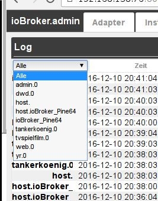

# 日志选项卡
系统消息在此连续输出。
最新消息在顶部。

## 标题行
标题栏包含最重要进程的图标。
每个图标都有上下文帮助。只需将鼠标放在图标上一会儿。

### **详细图标：**
### **1.) 停止更新**
如果单击此按钮，将停止列表的持续更新。
现在出现的不是暂停图标，而是新的未显示消息的数量。

### **2.) 更新日志**
此按钮更新列表。

### **3.) 复制日志**
单击此图标后，列表将显示为文本。使用 CTRL-A 选择整个文本，使用 CTRL-C 将其粘贴到剪贴板中以供进一步编辑。

### **4.) 删除列表**
单击此图标只会删除屏幕上的列表

### **5.) 删除日志**
单击此图标将永久删除主机上的整个日志。

### 下拉菜单
### **实例过滤器**

可以使用此下拉菜单根据日志记录实例过滤消息。
只有那些在页面上有条目的实例才会显示在菜单中。

### **显示的日志级别**

此菜单可用于设置要显示的消息的严重性。
但是，这只是现有列表的过滤器。为了在实例的特定级别定义日志记录，必须在 _**Instances**_ 选项卡中进行设置。