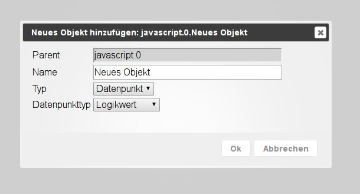
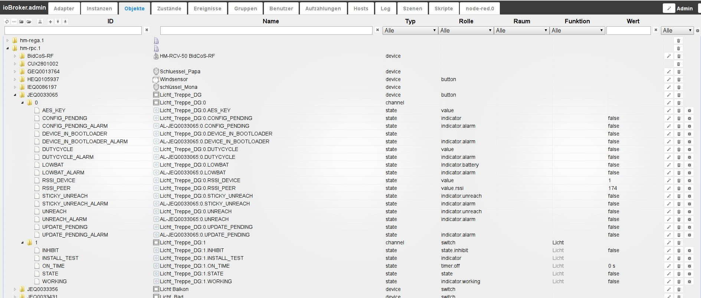
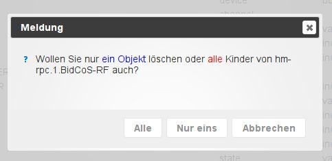

# 对象选项卡
所有托管对象都位于此选项卡下。为每个实例创建一个文件夹，其中创建的数据点位于分层结构中。也可以在这里手动创建和删除对象。可以上传或下载整个对象结构。另一个按钮可以显示专家视图。

## 标题行
标题栏包含最重要进程的图标。每个图标都有上下文帮助。只需将鼠标放在图标上一会儿。

### **详细图标：**
### **1.) 刷新视图**
如果刚刚创建的对象不可见，单击此图标将有助于更新页面的状态。

### **2.) 更改排序**
此按钮更改此页面上对象的排序。

当按钮处于活动状态时，所有对象都按字母顺序排序。如果此按钮未激活，则对象将根据实例分层排序。

然后接下来的两个图标也可见。

### **3.) 关闭所有主题**
### **4.) 展开所有主题**
### **5.) 管理员模式**
当您选择此图标时，将显示更多对象（切换功能）。这些是系统的数据点。

### **6.) 添加**
选择此图标后，可以添加更多对象。
如果选择了一个文件夹，则将其作为对象结构中的_Parent_。
配置窗口打开：

现在必须在此处选择新对象的名称，从而根据层次结构将设备、通道或数据点作为类型提供。
逻辑值、开关、字符串、数字、值列表、字段、对象和混合可用作数据点类型。

一旦您用 ok 确认输入窗口，就会打开另一个窗口：

一些数据仍然可以在这里输入。可以向对象添加角色和图标。

其他选项卡包含对象的更多属性。
每个对象都有这样的信息。

### **7.) 上传**
使用此按钮，将完整的对象结构作为 json 文件上传到 ioBroker 服务器

### **8.) 下载**
使用此按钮，选定的对象结构将从 ioBroker 服务器下载为 json 文件并可以保存。

##页面内容

现有对象以表格形式显示在页面上。

该表由以下列组成（列标题 1 和 2 下的字段以及其他列的下拉菜单用作过滤条件）。
图中的表格按层次排列，所有子项（节点）都展开了：

### **1.) ID**
这些是对象层次结构的顶层。在这里，例如
实例的名称，包括数据的相应结构。

### **2.) 姓名**
对象的名称在此栏中指定。此外，前面的图标显示所涉及的层次结构级别（设备、通道或数据点）

此列的值可以编辑。

### **3.) 类型**
层次结构级别中的类型在前面图标的_Name_ 列中已经很明显，在这里再次显式命名。例如，您可以使用列标题中的下拉菜单来过滤这些类型，从而仅显示所有数据点。

### 4.) 角色
该角色指定 .vis 和 mobile 等用户界面应如何处理此数据点。
原则上，这是使用术语简要描述的该对象的功能。
然后，您可以再次过滤。此列的值可以编辑。

### **5.) 房间**
如果该对象已分配给房间，则会在此处显示。
除其他外，这也用于在搜索对象时进行过滤。
此列的值可以编辑。通过这种方式，可以在以后将对象分配到房间。
如果您单击该字段，则会打开一个弹出窗口，其中包含先前创建的房间。

### **6.) 功能**
此列包含分配了相应对象的交易。

此列的值可以编辑。通过这种方式，可以在以后将对象分配给交易。如果您单击该字段，则会打开一个弹出窗口，其中包含迄今为止创建的交易。

### **7.) 价值**
如果对象是数据点，则此处显示该数据点的当前值。

### **8.) 其他**
如果单击铅笔图标，则会打开一个包含该对象属性的窗口。
它与上面创建新对象时出现的窗口相同。
可以在此处更改对象的属性。使用此功能时应格外小心，并且只有在您确切知道自己在做什么的情况下才能使用。

单击垃圾桶图标会删除该对象以及层次结构中其下方的**所有**对象。为了安全起见，会出现一个窗口，必须在其中再次确认删除。

仅当安装了至少一个历史实例（History、InfluxDB 或 SQL）时，才会出现齿轮图标。
可在此处配置记录历史数据的数据点。更多信息可以在[历史适配器](http://www.iobroker.net/?page_id=144&lang=de)的描述中找到。

可以使用标题栏中的齿轮对与当前过滤条件匹配的所有数据点同时执行此操作。因此，重要的是要仔细检查此页面上的过滤条件是否以仅包含所需数据点的方式选择。

用于过滤此列的下拉菜单与记录数据的数据点相关。
_with_、_without_ 和 _all_ 以及已安装的历史实例都可以在此处获得。