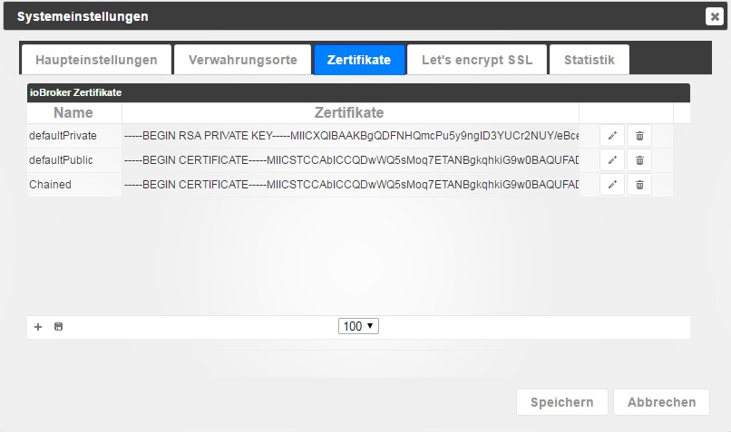

# 系统设置
ioBroker的基本参数在这里设置。

## 主要设置
### 系统语言
这允许您选择系统语言：德语、英语、俄语

### 单位温度
某些适配器使用此值。 °C 或 °F 是可能的。

＃＃＃ 货币
目前没有适配器使用此功能

### 日期格式
选择日期在 admin 和 vis 中的显示方式。

### 分隔符
浮点值的逗号或句点

### 默认历史实例
默认情况下，此 SQL/History/InfluxDB 适配器实例用于车队和人力车（图表）。

## 存储库或存储库

ioBroker可以从不同的来源获取适配器列表。安装期间输入以下源：

* **默认** - http://download.iobroker.net/sources-dist.json - 每天 01:00 在服务器上生成。

	访问速度非常快，但版本信息可能长达 24 小时。

* **在线** - https://raw.githubusercontent.com/ioBroker/ioBroker.js-controller/master/conf/sources-dist.json - 存储库

	是从在线来源生成的。  访问可能需要很长时间，这是最新的来源

* **来源 - conf/sources-dist.json** - 也是自动生成的，也需要很长时间，但链接可能已过时（某些适配器可能丢失）

## 证书

这是用于 SSL/HTTPS 通信的证书的中心位置。这些证书由 admin、web、simple-api、socketio 使用。默认情况下安装标准证书。你无法用这个验证任何东西。它们仅用于 SSL 通信。由于证书是开放的，因此您应该使用自己的（自签名）证书、购买真正的证书或切换到 Let's Encrypt。使用默认证书的通信并不安全，如果有人想要读取流量，则可以这样做。请务必安装您自己的证书。例如。根据[操作系统](http://guides.intertech.de/ssl_certificate_self.html)。

## 让我们加密

Let’s Encrypt 是来自独立互联网安全研究小组 (ISRG) 的免费、自动化和开源_证书颁发机构_。

有关 Let’s Encrypt 的更多信息，请参阅[这里](https://letsencrypt.org/)。

某些安装使用动态 DNS 或类似的方式通过分配的地址到达您自己的域。 ioBroker 支持自动请求和续订 Let’s Encrypt 组织的证书。

几乎每个可以启动 Web 服务器并支持 HTTPS 的适配器中都存在使用 Let’s Encrypt 免费证书的选项。

如果您激活使用证书的选项，但未激活自动更新，则相应的实例会尝试使用已保存的证书。

如果激活自动更新，实例会尝试向 Let's Encrypt 请求证书并自动更新它们。

第一次调用相应地址时，将首次请求证书。这意味着，例如，如果您将“sub.domain.com”配置为地址，然后调用 [https://sub.domain.com](https://sub.domain.com/)，则将首次请求证书，这可能需要一段时间才能得到答复。

颁发证书是一个复杂的过程，但如果您按照下面的说明操作，应该很容易获得免费证书。

**程序：**

1. 必须使用输入的电子邮件地址创建一个新帐户（在系统设置中进行设置）
2. 生成一个随机密钥作为帐户的密码。
3. 创建帐户后，系统会在端口 80 上打开一个小网站以确认地址。
4. 让我们加密**始终**使用端口**80**来检查地址。
5. 如果端口 80 已被其他服务使用，则第 4 点将发挥作用 - 即为其他服务分配不同的端口！
6. 当小型 Web 服务器启动时，系统设置中指定的地址的证书请求将发送到 Let's encrypt 服务器。
7. Let's Encrypt 服务器发回一个质询短语来响应请求，并在一段时间后尝试在地址“http://yourdomain:80/.well-known/acme-challenge/”处读取该质询短语。
8. 当服务器收到我们这边发回的质询短语时，Let's Encrypt 服务器会发送证书。它们保存在系统设置中输入的目录中。

这听起来很复杂，但您所要做的就是激活几个复选框并在系统设置中输入电子邮件地址和网址。

收到的证书的有效期约为 90 天。首次颁发这些证书后，将启动另一个任务，自动延长其有效期。

这个话题非常复杂，有成千上万的事情可能会出错。如果这不起作用，我们建议在旅途中使用云适配器进行访问。

**Let's Encrypt 仅适用于 Node.js 版本 >=4.5**

＃＃ 统计数据

ioBroker 管理员将以下信息发送到 download.iobroker.net：

<pre> { “uuid”：“56cf0d20-XXXX-YYYY-BBBB-66eec47ZZZZZ”，“语言”：“de”，“主机”：[ { “版本”：“0.15.1”，“平台”：“Javascript/Node. js&quot;, &quot;类型&quot;: &quot;win32&quot; } ], &quot;适配器&quot;: { &quot;管理&quot;: { &quot;版本&quot;: &quot;1.0.2&quot;, &quot;平台&quot;: &quot;Javascript/Node.js&quot; }, &quot;hm-rpc&quot;: { &quot;版本&quot;: &quot;1.1.2&quot;, &quot;平台&quot;: &quot;Javascript/Node.js&quot; } } }</pre>

可以通过将统计信息设置为“**无**”来禁用此功能。

但是，开发人员要求提供以下信息：

<pre> 为了使这个项目落地，我们付出了巨大的努力。
作为回报，我们要求您向我们发送使用情况统计数据。
不会将任何私人信息发送至 ioBroker.org。
每次更新适配器列表时，也会发送匿名统计信息。
谢谢你！</pre>