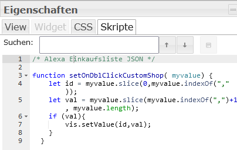

# IoBroker.alexa-shoppingList
**测试：** 

**此适配器使用 Sentry 库自动向开发者报告异常和代码错误。** 有关禁用错误报告的更多详细信息和说明，请参阅 [Sentry插件文档](https://github.com/ioBroker/plugin-sentry#plugin-sentry)！Sentry 报告功能从 js-controller 3.0 开始使用。

## 适用于 ioBroker 的 Alexa 购物清单适配器
通过 Alexa 生成购物清单。

您还可以使用 Alexa 中的其他列表——请在管理设置中进行配置。

使用全新的管理界面可以大大简化这一操作。

插入新项目的操作很简单：只需输入文本并按回车键即可。

您可以删除活动列表和非活动列表。

您还可以将单个项目向任意方向移动。

希望你喜欢

如果您喜欢，请考虑捐赠：

[](https://www.paypal.com/donate/?hosted_button_id=7QGL5CXJCUSCE)

## 数据点
| DP名称 | 类型 | 描述 |
|---------------------|--------|-----------------------------------------------------------------------------------------------------|
| add_position | 字符串 | 输入要插入到列表中的文本 |
| delete_activ_list | 按钮 | 清除活动列表并将其移至非活动列表 |
| delete_inactiv_list | 按钮 | 清除非活动列表 |
| 位置移动 | 数字 | 您可以输入项目移动的位置编号，然后点击“激活列表”或“非激活列表”按钮 |
| list_active | JSON | 活动列表（JSON 格式） |
| list_active_sort | 开关 | 您可以按名称或插入时间对活动列表进行排序 |
| list_inactive | JSON | 非活动列表（JSON 格式） |
| list_inactive_sort | 开关 | 您可以按名称或插入时间对非活动列表进行排序 |
| to_activ_list | 按钮 | 首先插入 position_to_shift，然后按下按钮移动到 activ_list |
| 移至非活动列表 | 按钮 | 首先插入位置到移位，然后按下按钮移至非活动列表 |

| JSON 中的属性 | 描述 |
|-------------------|-------------------------------------------|
| 名称 | 物品名称 |
| 时间 | 插入时间戳 |
| id | Alexa2 适配器中的 id |
| pos | 在列表中的位置 |
| buttonmove | 用于移动到活动列表或非活动列表的按钮 |
| 删除按钮 | 用于彻底删除项目的按钮 |

JSON 文件中现在包含两个按钮，分别用于移动和删除项目。

为此，您需要在 VIS 编辑器的 Skript 下插入代码，内容如下：

```
 /* Alexa Einkaufsliste JSON */

function setOnDblClickCustomShop( myvalue) {
    let id = myvalue.slice(0,myvalue.indexOf(","));
    let val = myvalue.slice(myvalue.indexOf(",")+1, myvalue.length);
    if (val=== "true"){
      vis.setValue(id,true);
      return
    }
    vis.setValue(id,false);
  }
```



## Changelog

<!--
	Placeholder for the next version (at the beginning of the line):
	### **WORK IN PROGRESS**
-->
### 1.1.5 (2026-06-04)

- CHORE: Update dependencies

### 1.1.4 (2026-06-04)

- CHORE: Add unit tests
- (copilot) Adapter requires node.js >= 22 now
- CHORE: Update dependencies
- CHORE: #203 Issues reported by repository checker
- CHORE: #193-Repository-Checker

### 1.1.3 (2025-11-29)

- CHORE: Update dependencies
- FIX: Error reported by sentry

### 1.1.2 (2025-09-20)

- CHORE: #145 Update dependencies

### 1.1.1 (2025-08-13)

- FIX: Error reported by sentry

## License

## License

MIT License

Copyright (c) 2021-2026 MiRo1310 <michael.roling@gmx.de>

Permission is hereby granted, free of charge, to any person obtaining a copy
of this software and associated documentation files (the "Software"), to deal
in the Software without restriction, including without limitation the rights
to use, copy, modify, merge, publish, distribute, sublicense, and/or sell
copies of the Software, and to permit persons to whom the Software is
furnished to do so, subject to the following conditions:

The above copyright notice and this permission notice shall be included in all
copies or substantial portions of the Software.

THE SOFTWARE IS PROVIDED "AS IS", WITHOUT WARRANTY OF ANY KIND, EXPRESS OR
IMPLIED, INCLUDING BUT NOT LIMITED TO THE WARRANTIES OF MERCHANTABILITY,
FITNESS FOR A PARTICULAR PURPOSE AND NONINFRINGEMENT. IN NO EVENT SHALL THE
AUTHORS OR COPYRIGHT HOLDERS BE LIABLE FOR ANY CLAIM, DAMAGES OR OTHER
LIABILITY, WHETHER IN AN ACTION OF CONTRACT, TORT OR OTHERWISE, ARISING FROM,
OUT OF OR IN CONNECTION WITH THE SOFTWARE OR THE USE OR OTHER DEALINGS IN THE
SOFTWARE.