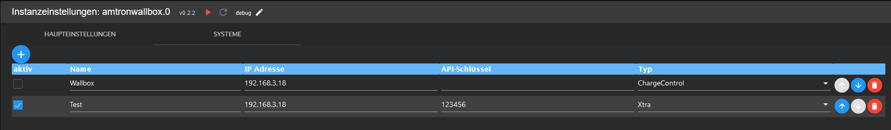

# IoBroker.amtronwallbox

**此适配器使用 Sentry 库自动向开发人员报告异常和代码错误。** 有关更多详细信息以及如何禁用错误报告的信息，请参阅[Sentry-插件文档](https://github.com/ioBroker/plugin-sentry#plugin-sentry)!从 js-controller 3.0 开始使用 Sentry 报告。

**如果您喜欢，请考虑捐赠：**

该适配器充当各种[Amtron 壁箱](https://www.mennekes.de/emobility/produkte/amtron-wallboxen/)的接口。盒子提供的数据被读出并作为适配器中的数据点使用。
数据仅在本地处理，不需要云连接。对于也支持写访问的墙盒，适配器可以写入数据（例如充电电流）。
支持以下 Amtron 墙盒：

* 安创 Xtra
* Amtron 充电控制
* Amtron 紧凑型

该适配器可以管理多个盒子。

＃＃ 配置
只需要配置盒子的类型、IP 地址以及 API 密钥（如有必要）。

注意：由于盒子有不同的接口，因此可能并非所有接口都可以直接工作。在这种情况下，请联系开发商。

＃＃ 已知的问题
* 如果您发现错误或希望有新功能，请在 [github](https://github.com/rg-engineering/ioBroker.amtronwallbox/issues) 上创建问题。

## Changelog

<!--
  Placeholder for the next version (at the beginning of the line):
  ### **WORK IN PROGRESS**
-->
### 0.2.8 (2023-11-26)
* (René) role of states overworked

### 0.2.7 (2023-11-19)
* (René) dependencies updated

### 0.2.6 (2023-09-23)
* (René) bug fix for reported exceptions by sentry

### 0.2.5 (2023-08-27)
* (René) smaller bug fixes, see issue #59

### 0.2.4 (2023-07-30)
* (René) dependencies updated

### 0.2.3 (2023-06-01)
* (René) some changes to fullfill requirements to bring the adapter to latest

### 0.2.2 (2023-04-07)
* (René) dependencies updated

### 0.2.0 (2023-01-31)
* (René) see issue #1: write data to XTRA wallbox (experimentel)

### 0.1.0 (2022-12-18)
* (René) see issue #1: support of XTRA

### 0.0.3 (2022-08-18)
* (René) some bug fixes
* (René) change to cron
* (René) update of dependencies

### 0.0.1 (2022-05-19)
* (René) initial release

## License
MIT License

Copyright (c) 2022-2023 rg-engineering info@rg-engineering.eu

Permission is hereby granted, free of charge, to any person obtaining a copy
of this software and associated documentation files (the "Software"), to deal
in the Software without restriction, including without limitation the rights
to use, copy, modify, merge, publish, distribute, sublicense, and/or sell
copies of the Software, and to permit persons to whom the Software is
furnished to do so, subject to the following conditions:

The above copyright notice and this permission notice shall be included in all
copies or substantial portions of the Software.

THE SOFTWARE IS PROVIDED "AS IS", WITHOUT WARRANTY OF ANY KIND, EXPRESS OR
IMPLIED, INCLUDING BUT NOT LIMITED TO THE WARRANTIES OF MERCHANTABILITY,
FITNESS FOR A PARTICULAR PURPOSE AND NONINFRINGEMENT. IN NO EVENT SHALL THE
AUTHORS OR COPYRIGHT HOLDERS BE LIABLE FOR ANY CLAIM, DAMAGES OR OTHER
LIABILITY, WHETHER IN AN ACTION OF CONTRACT, TORT OR OTHERWISE, ARISING FROM,
OUT OF OR IN CONNECTION WITH THE SOFTWARE OR THE USE OR OTHER DEALINGS IN THE
SOFTWARE.