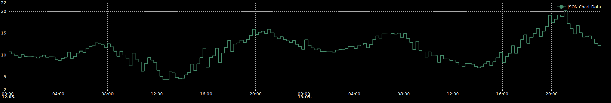

# IoBroker.apg-info
 

## IoBroker 的 apg-info 适配器
此适配器提供奥地利电网的用电高峰时段（仅限奥地利数据！），建议避开高峰时段用电。此外，该适配器还提供奥地利、瑞士和德国的PHELIX日前（EPEX现货）电价（可在适配器设置中配置）。供应商费用、税费和电网成本可在配置中选择性添加（在“计算”选项卡中）。

标准配置下，适配器会在 00:00、13:00 和 15:00 运行。强烈建议不要移除 00:00 的运行，否则日期变更（明天到今天）将无法正常工作。

**此适配器使用 Sentry 库自动向开发人员报告异常和代码错误。** 有关更多详细信息以及如何禁用错误报告的信息，请参阅 [Sentry插件文档](https://github.com/ioBroker/plugin-sentry#plugin-sentry)！

## 需要
* Node.js 22 或更高版本
* ioBroker 主机（js-controller）6.0.11 或更高版本

每刻钟市场价格
这些市场价格由 Exaa 收集，并由 Entsoe 和 Energy Charts 作为备份。因此，如果配置了每刻钟一次的价格，建议*申请 Entsoe 代币*。

瑞士市场
对于瑞士市场，需要来自 entsoe.eu 的代币。

如何获得 Entsoe 代币
请在 https://transparency.entsoe.eu/ 页面注册，然后发送电子邮件至 transparency@entsoe.eu，请求授予您注册的电子邮件地址 RESTFUL API 访问权限。 更多详情请查看 https://transparency.entsoe.eu/content/static_content/Static%20content/web%20api/Guide.html#_authentication_and_authorisation

## 基于时间的电网成本计算
在像奥地利这样电网成本随时间变化的市场（例如，夏季中午时段电价降低），现在可以通过表格配置相关参数。参考表格展示了所需的数据输入格式。该功能位于适配器配置的“计算”选项卡中。

**重要提示：**表格视图适用于 Admin 7.7.23 或更高版本。在旧版本中，日期字段显示不正确（https://github.com/ioBroker/ioBroker.admin/issues/3344）。

图表
使用此适配器提供的数据可以轻松创建图表。根据您使用的可视化适配器，您有多种选择。以下列出一些常见示例：

### Vis-1 `[..].marketprice.today.jsonChart` 和 `[..].marketprice.tomorrow.jsonChart` 可与 https://github.com/Scrounger/ioBroker.vis-materialdesign#json-chart 一起使用。

遗憾的是，vis-materialdesign 不受 vis-2 适配器支持（参见：https://github.com/Scrounger/ioBroker.vis-materialdesign/issues/227，https://github.com/Scrounger/ioBroker.vis-materialdesign/pull/224）。

此外，新的 vis-2-widgets-material 适配器不再包含“jsonChart”。
### Vis-2 作为一种替代方案，您可以使用 [echarts适配器](https://github.com/ioBroker/ioBroker.echarts)，并将“JSON”作为数据源（https://github.com/ioBroker/ioBroker.echarts#data-from-json）。为此，apg-info 适配器还提供了其他对象中的完整数据：
- `[..].marketprice.today.jsonChartData` 和 `[..].marketprice.tomorrow.jsonChartData` 仅包含图表数据数组。
- `[..].marketprice.jsonChartData` 将今天和明天的图表数据合并到一个数组中。
- `[..].marketprice_quarter_hourly.jsonChartData` 提供每刻钟价格的相同组合图表数据。

用这个工具你可以创建像这样的漂亮图表（使用 echarts 适配器和组合的季度小时图表数据创建）：

## Changelog
<!--
    Placeholder for the next version (at the beginning of the line):
    ### __WORK IN PROGRESS__
-->
### 0.1.33-alpha.0 (2026-05-17)
* (HGlab01) Bump axios to 1.16.0
* (SimonFischer04) support echarts (vis-2)

### 0.1.32 (2026-05-02)
* (HGlab01) Adapter requires node.js >= 22 now
* (HGlab01) fix 'DE' is not the code for an available bidding zone
* (HGlab01) Bump axios to 1.15.2

### 0.1.30 (2026-02-24)
* (HGlab01) finetune timeout management

### 0.1.29 (2026-02-14)
* (HGlab01) add time based grid costs calculation (see above)
* (HGlab01) Bump axios to 1.13.5

### 0.1.28 (2025-12-11)
* (HGlab01) add Energy-Charts as third data provider

## License
MIT License

Copyright (c) 2023-2026 HGlab01 <myiobrokeradapters@gmail.com>

Permission is hereby granted, free of charge, to any person obtaining a copy
of this software and associated documentation files (the "Software"), to deal
in the Software without restriction, including without limitation the rights
to use, copy, modify, merge, publish, distribute, sublicense, and/or sell
copies of the Software, and to permit persons to whom the Software is
furnished to do so, subject to the following conditions:

The above copyright notice and this permission notice shall be included in all
copies or substantial portions of the Software.

THE SOFTWARE IS PROVIDED "AS IS", WITHOUT WARRANTY OF ANY KIND, EXPRESS OR
IMPLIED, INCLUDING BUT NOT LIMITED TO THE WARRANTIES OF MERCHANTABILITY,
FITNESS FOR A PARTICULAR PURPOSE AND NONINFRINGEMENT. IN NO EVENT SHALL THE
AUTHORS OR COPYRIGHT HOLDERS BE LIABLE FOR ANY CLAIM, DAMAGES OR OTHER
LIABILITY, WHETHER IN AN ACTION OF CONTRACT, TORT OR OTHERWISE, ARISING FROM,
OUT OF OR IN CONNECTION WITH THE SOFTWARE OR THE USE OR OTHER DEALINGS IN THE
SOFTWARE.

#### Disclaimer apg-powermonitor
More about the security of supply & all data, facts and figures regarding the world of electricity and the energy transition can be found at www.apg-powermonitor.at.

#### Disclaimer data providers
Four data providers are used for this adapter
* Exaa (https://www.exaa.at/)
* Entso-e (https://www.entsoe.eu/data/transparency-platform/)
* Energy Charts (https://api.energy-charts.info/) licensed under the CC BY 4.0 license
* aWATTar (https://www.awattar.at/services/api and https://www.awattar.de/services/api)

