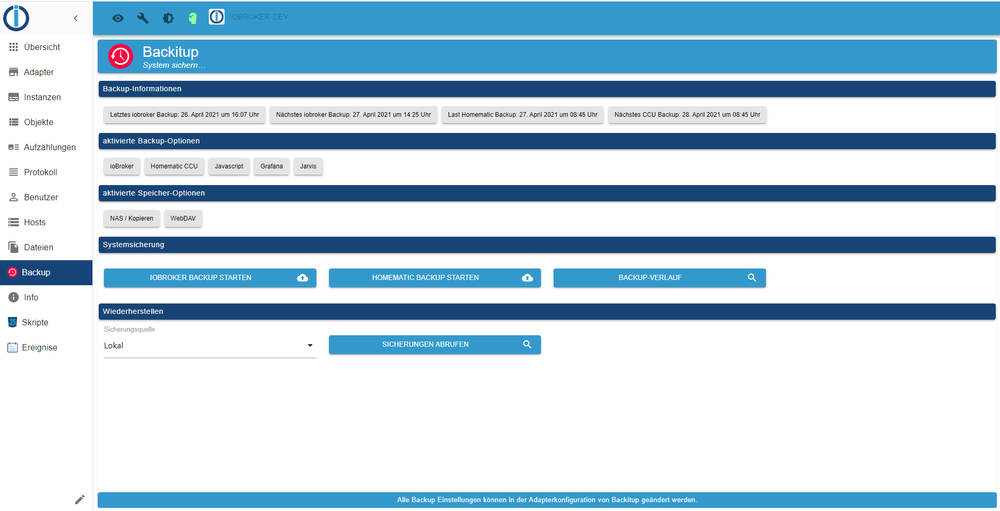
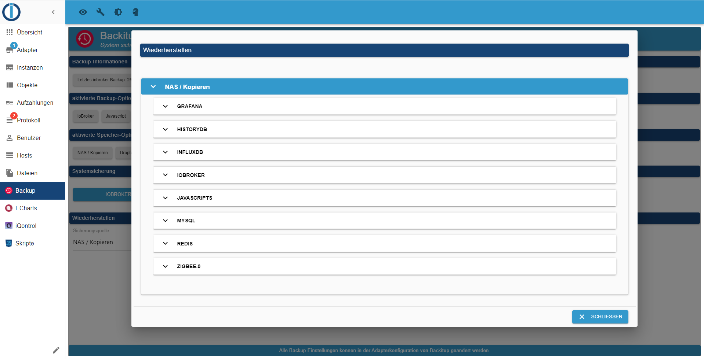

# IoBroker.backitup


**如果您喜欢Backitup，请考虑捐款：**

[](https://www.paypal.com/cgi-bin/webscr?cmd=_s-xclick&hosted_button_id=Q4EEXQ6U96ZTQ&source=url)

**************************************************************************************************************

＃ 内容
* [基本](#basic)
* [依赖项](#dependencies)
* [用法和操作](#usage-and-operation)
* [备份类型](#备份类型)
* [ioBroker 备份](#ioBroker 备份)
* [CCU 备份 (Homematic)](#CCU-Backup-(Homematic))
* [mysql备份](#mysql备份)
    * [redis 备份](#redis 备份)
* [InfluxDB 备份](#InfluxDB 备份)
    * [PostgreSQL 备份](#PostgreSQL 备份)
    * [javascript 备份](#javascript 备份)
    * [jarvis 备份](#jarvis 备份)
    * [Zigbee 备份](#Zigbee 备份)
    * [grafana 备份](#grafana 备份)
    * [Yahka 备份](#Yahka 备份)
* [存储选项]（#存储选项）
    * [CIFS](#CIFS)
    * [NFS](#NFS)
    * [FTP](#FTP)
    * [复制](#复制)
    * [投递箱](#投递箱)
    * [谷歌驱动器](#谷歌驱动器)
    * [WebDAV](#WebDAV)
* [多主机支持]（#多主机支持）
* [Docker 支持](#Docker 支持)
* [用法]（#用法）
* [通知](#Notifications)
* [恢复](#恢复)
* [疑难解答]（#疑难解答）
* [遇到的错误/解决方案](#遇到的错误-/-解决方案)

---

＃ 基本
Backitup 是一种备份解决方案，通过它可以对 ioBroker 安装和 Homematic CCU 进行循环备份。

该适配器适用于多平台，可用于 Linux 安装以及 Windows 和 Mac 安装。

此外，还可以保存各种可选备份，例如 SQL 数据库、Influx 数据库以及一些适配器和设备设置。

Backitup 与 js-controller 密切合作，并创建与 CLI 命令 `iobroker backup` 相同的 iobroker 备份。

所有状态和对象，以及 VIS 等用户文件都在这里备份，与 js-controller 的标准备份相同。

恢复也与 js-controller 的 CLI 命令`iobroker restore <backupname>`完全相同。

通过恢复，备份恢复所有状态、对象和用户数据。
恢复后，您的 iobroker 将重新启动，并且 js-controller 从那里再次接管丢失的适配器的安装。

iobroker 启动后，备份对恢复没有任何影响。这一切都发生在后台，js 控制器根据状态和对象中恢复的信息接管。

### [背部](#Inhalt)
---

# 依赖
* 必须为 CIFS 挂载安装 cifs-utils。
    -`sudo apt-get install cifs-utils`

* 必须为 NFS 挂载安装 nfs-common。
    -`sudo apt-get install nfs-common`

* 使用MySql备份，系统必须安装mysqldump
    - `sudo apt-get install mysql-client` 或在 Debian 上`sudo apt-get install default-mysql-client`

* 要使用 PostgreSQL 备份，必须在系统上安装 mysqldump
    - [PostgreSQL 安装指南](https://www.postgresql.org/download/linux/debian/)

* 必须安装 Influxd 才能使用 InfluxDB 备份
    - [安装指南 InfluxDB 1.x](https://docs.influxdata.com/influxdb/v1.8/introduction/install/)
    - [安装指南 InfluxDB 2.x](https://docs.influxdata.com/influxdb/v2.1/install/)
    - [Influx-CLI for 2.x 安装指南](https://docs.influxdata.com/influxdb/v2.1/tools/influx-cli/?t=Linux)

### [背部](#Inhalt)
---

# 使用与操作
可以在适配器实例中配置备份。那里提供以下所有设置选项。<br><br>管理选项卡中提供了一个选项卡，用于备份的日常工作和操作。<br>如果该选项卡在管理界面的选项卡菜单中处于活动状态，则可以通过iobroker左侧选项卡栏中的选项卡直接操作Backitup。<br><br>那里提供有关已创建备份的信息，可以创建备份，并且可以选择恢复备份。



### [背部](#Inhalt)
---

# 备份类型
Backitup 提供了许多选项来循环执行不同的备份类型或按下按钮。默认情况下，每个备份都存储在 /opt/iobroker/backups/ 目录中。或者，可以设置 FTP 上传，或者，可以使用 CIFS/NFS 挂载。

## IoBroker 备份
此备份对应于 ioBroker 中包含的备份，可以通过调用 `iobroker backup` 在控制台中启动该备份。仅在此处通过适配器配置或 OneClick Backup 小部件中的指定设置完成，而无需使用控制台。

## CCU 备份 (Homematic)
此备份提供了备份 Homematic 安装的 3 个不同版本（CCU-Original / pivCCU / Raspberrymatic）的可能性。也可以使用适配器配置或 OneClick Backup 小部件中指定的设置来执行此备份。<br><br>如果您不只是想备份 CCU，您可以激活“备份多个系统”选项，然后在表格中定义您的 Homematic 中心。

## Mysql备份
如果它被激活，这个可单独调整的备份与每个备份 ioBroker 一起创建，并在指定的保留时间到期后删除。如果设置为其他 ioBroker 备份类型，则 FTP 或 CIFS 对此备份也有效。<br><br>这里重要的是，即使 mysql 服务器运行在远程系统上，mysqldump 也必须运行在 ioBroker 系统上。<br>对于 Linux 系统，安装命令将是：`sudo apt-get install mysql-client`或在 Debian `sudo apt-get install default-mysql-client`。<br><br>如果您不想只备份一个数据库，您可以激活“备份多个系统”选项，然后在表中定义您的数据库。

## Redis 备份
如果它被激活，这个可单独调整的备份与每个备份 ioBroker 一起创建，并在指定的保留时间到期后删除。如果设置为其他 ioBroker 备份类型，则 FTP 或 CIFS 对此备份也有效。<br>要将 Redis 与 Backitup 一起使用，应调整 iobroker 用户的权限：<br>

```
sudo usermod -a -G redis iobroker
sudo reboot
```

从 Backitup 版本 2.3.x 开始，可以为 Redis 创建远程备份。

对于远程备份，本地 iobroker 系统上需要 redis-cli。

`sudo apt install redis-tools`

在这里，您必须输入远程 Redis 服务器的主机和端口以及系统的登录数据。

这是一个重要的特性，尤其是对于 Docker 用户。

请注意，无法通过备份 GUI 对远程系统进行 Redis 还原。
Redis 不支持这个。
此处包含在 tar.gz 存档中的 dump.rdb 必须手动恢复。

为此，必须解压缩备份存档，将文件复制到 Redis 目录并调整 dump.rdb 的权限。

这是一个例子：

```
sudo tar -xvzf <Backupdatei>.tar.gz /var/lib/redis/
sudo chown redis:redis /var/lib/redis/dump.rdb
redis-cli shutdown nosave
```

##历史数据备份
如果它被激活，这个可单独调整的备份与每个备份 ioBroker 一起创建，并在指定的保留时间到期后删除。如果设置为其他 ioBroker 备份类型，则 FTP 或 CIFS 对此备份也有效。

## InfluxDB 备份
如果它被激活，这个可单独调整的备份与每个备份 ioBroker 一起创建，并在指定的保留时间到期后删除。如果设置为其他 ioBroker 备份类型，则 FTP 或 CIFS 对此备份也有效。<br><br> **使用 InfluxDB v1.x 进行远程备份的要求：**

InfluxDB 1.x 下的远程备份需要进行一些调整。

**要运行 InfluxDB 备份，必须在 iobroker 系统上安装 Influxd。**<br> **无论数据库是在本地管理还是在另一台服务器上运行都没有关系。**<br><br>如果 InfluxDB 要由远程服务器备份，则必须在远程服务器的 influxdb.conf 中调整 RPC 服务的远程权限。

```
bind-address = "<InfluxDB-IP>:8088"
```

要么

```
bind-address = "0.0.0.0:8088"
```

**更改配置后，必须重启 InfluxDB 服务。**

有关 InfluxDB 数据备份的更多信息，请参见[这里](https://docs.influxdata.com/influxdb/v1.8/administration/backup_and_restore/#online-backup-and-restore-for-influxdb-oss)。<br><br>

**使用 InfluxDB v2.x 进行备份的要求：**

为了能够创建 InfluxDB 2.x 的备份，必须在您的系统上安装 Influx-CLI。
这对于本地和远程备份都是必需的。

对于远程备份，必须在运行 iobroker 的系统上安装 Influx-CLI。
在您的数据库正在运行的远程系统上，不需要安装备份。

在这里，您将找到有关如何在您的系统上安装 Influx-CLI 的官方说明。

[安装指南 Influx-CLI for 2.x](https://docs.influxdata.com/influxdb/v2.1/tools/influx-cli/?t=Linux)<br><br>

如果您不想只备份一个数据库，您可以激活“备份多个系统”选项，然后在表中定义您的数据库。<br>

## PostgreSQL 备份
如果它被激活，这个可单独调整的备份与每个备份 ioBroker 一起创建，并在指定的保留时间到期后删除。如果设置为其他 ioBroker 备份类型，则 FTP 或 CIFS 对此备份也有效。<br><br>这里重要的是，即使 PostgreSQL 服务器运行在远程系统上，PostgreSQL 也必须运行在 ioBroker 系统上。<br> Linux 系统有 [这里](https://www.postgresql.org/download/linux/debian/) 安装说明。<br><br>如果您不想只备份一个数据库，您可以激活“备份多个系统”选项，然后在表中定义您的数据库。

## Javascript 备份
如果它被激活，这个可单独调整的备份与每个备份 ioBroker 一起创建，并在指定的保留时间到期后删除。如果设置为其他 ioBroker 备份类型，则 FTP 或 CIFS 对此备份也有效。<br><br>从 Backitup 版本 2.2.0 开始，直接从对象备份脚本。旧备份版本的 Javascript 备份不兼容恢复！<br><br>为了能够使用 &lt; 2.2.0 Javascript 的 Backitup 版本执行备份，必须在 Javascript 适配器配置中预先指定菜单项“文件路径中的镜像脚本”和“进行镜像的实例”。<br>然后备份可以接管配置菜单中的设置。

## 贾维斯备份
如果它被激活，这个可单独调整的备份与每个备份 ioBroker 一起创建，并在指定的保留时间到期后删除。如果设置为其他 ioBroker 备份类型，则 FTP 或 CIFS 对此备份也有效。<br><br> ***可以从 Jarvis 版本 2.2.0-beta.7 备份 Jarvis 配置。***

## Zigbee 备份
如果它被激活，这个可单独调整的备份与每个备份 ioBroker 一起创建，并在指定的保留时间到期后删除。如果设置为其他 ioBroker 备份类型，则 FTP 或 CIFS 对此备份也有效。

## Grafana 备份
如果它被激活，这个可单独调整的备份与每个备份 ioBroker 一起创建，并在指定的保留时间到期后删除。如果设置为其他 ioBroker 备份类型，则 FTP 或 CIFS 对此备份也有效。<br><br> **为了创建 Grafana 备份，需要 Grafana 用户名和密码。**<br><br> **此外，必须在 Grafana Web 界面中生成 API 密钥才能访问仪表板。**<br> API密钥可以在***“配置→API密钥”***下创建。

## Yahka 备份
如果它被激活，这个可单独调整的备份与每个备份 ioBroker 一起创建，并在指定的保留时间到期后删除。如果设置为其他 ioBroker 备份类型，则 FTP 或 CIFS 对此备份也有效。<br><br>将备份所有 Homkit 系统设置和设备设置。

### [背部](#Inhalt)
---

# 存储选项
##CIFS
CIFS 挂载在 Linux 上不是问题。<br>需要注意的是安装了cifs-utils

路径规范应如下所示（例如：“/共享名称/路径规范”）<br>或者，您可以启用/禁用是否应从 NAS 中删除备份

  ## NFS
NFS 挂载在 Linux 上不是问题。<br>需要注意的是安装了nfs-common<br><br>路径规范应如下所示（例如“/共享名称/路径规范”）。<br>或者，您可以启用/禁用是否应从 NAS 中删除备份

##FTP
FTP 可在所有操作系统上使用，可作为 CIFS 挂载的替代方案<br>FTP 下的路径规范必须始终以“/”开头（例如：“/路径规范”）<br>或者，您可以启用/禁用是否应从 NAS 中删除备份

＃＃ 复制
如果不能进行 CIFS 挂载，则可以选择复制功能<br>在此，在 CIFS 设置中，必须输入要进行复制的路径。<br>复制功能的 IP 地址必须为空。

## 保管箱
要在 Dropbox 中使用备份，必须在 https://www.dropbox.com/developers/apps 创建访问令牌和 APP<br><br>

* 第 1 步：使用“创建应用程序”按钮
* 第 2 步：选择“范围访问”。
* 第 3 步：选择“应用程序文件夹”。
* 第 4 步：输入“命名您的应用程序”并选择“创建应用程序”按钮
* 第 5 步：在“权限”选项卡中，勾选“文件和文件夹”区域中的所有 4 个框
* 第 6 步：在“设置”选项卡中，将“访问令牌过期”设置为“无过期”。
* 第 7 步：按“生成的访问令牌”按钮（此生成的令牌输入到备份的设置中）<br><br>

在您的 Dropbox 中，现在有一个名为“Apps”的新文件夹

## 谷歌驱动器
为了使用 Google Drive 中的备份，您必须获得访问令牌。您可以在配置页面上执行此操作。<br> ioBroker 只对定义的区域进行攻击。 oAuth 的代码可以在[这里](https://github.com/simatec/ioBroker.backitup/blob/master/docs/oAuthService.js)中看到。<br><br>没有令牌或用户数据存储在云中。

##WebDAV
通过 WebDAV，Backitup 提供了解决多个云系统的选项。<br>这里最著名的是 NextCloud。要建立 WebDAV 连接，需要云帐户的用户名和密码。<br>与云的连接是通过加密连接进行的。<br><br>为了能够建立连接，云的主机名必须符合所有安全证书。<br><br> &gt; 示例 URL：“https://example.com/remote.php/dav/files/username/”<br><br>仅当禁用“仅允许签名证书”选项时，才能与本地 IP 地址进行连接。

### [背部](#Inhalt)
---

# 多主机支持
从Backitup 2.2.0 版开始，支持多主机备份远程系统（例如Zigbee 或远程数据库）。 Multihost for Backup 可以与不同主机上的多个 Backup 实例一起使用。<br>必须将 Backupitup 实例配置为 master 以支持它。位于远程主机上的所有其他实例都配置为从属。<br><br>主服务器管理自动备份。可以通过菜单在主实例中选择所有从实例。<br>可以为从属实例激活以下备份选项：<br>

* 雷迪斯
* 紫蜂
*贾维斯
* 历史
* 涌入数据库
* MySql
* PostgreSql
*格拉法纳
* 雅卡

由于自动备份由从属实例中的主控控制，因此无法选择 iobroker 备份、Javascript 备份和 CCU 备份。<br><br>单个备份的存储位置可以在每个从站上自由配置。所以每个人都可以独立于主人设计自己的文件存储系统。<br><br>

在 RAM 有限的系统中，备份主控可以自动启动然后停止从属实例以进行备份过程。<br>此选项可在菜单中配置。

### [背部](#Inhalt)
---

# Docker 支持
从 2.2.0 版本开始，官方 Docker 容器支持备份和恢复。<br><br>由于不应在 Docker 中安装任何数据库系统，因此不支持所有数据库的备份，并且无法为可识别的 Docker 容器选择。<br>从版本 v5.2.0-beta4 开始，官方 iobroker Docker 容器支持备份支持。

### [背部](#Inhalt)
---

＃ 采用
1.适配器创建一些数据点供Vis中使用<br>
* oneClick.ccu -> 作为 CCU 备份的触发器（可以在 Vis 中通过按钮设置为 true）
* oneClick.iobroker -&gt; 作为标准备份的触发器（可以在 Vis 中通过按钮设置为 true）<br><br>
* history.html -> 用作历史日志，可以通过 CCS 在 Vis 中自定义。
    * history.json -> 用作历史日志，可以通过 CCS 在 Vis 中自定义。
* history.ccuLastTime -> 保存上次 CCU 备份的创建日期和时间
* history.minimalLastTime -> 保存上次标准备份的创建日期和时间
    * history.ccuSuccess -> 如果备份成功，则显示状态“true”
    * history.minimalSuccess -> 如果备份成功，则显示状态“true”
    * history.iobrokerLastTime -> 显示最后一次 ioBroker 备份
    * history.ccuLastTime -> 显示最后一次 CCU 备份
    * info.ccuNextTime -> 显示CCU备份的下一次执行时间
    * info.iobrokerNextTime -> 显示ioBroker备份的下一次执行时间
    * info.latestBackup -> 以 json 格式显示启动时确定的最后一次备份

2.在Vis中显示历史记录
   - 可以在 HTML 小部件中显示历史日志，例如，通过在 HTML 中输入以下行：

```
{backitup.0.history.html}
```

语法：{BackitupInstance.history.html}

3. 历史日志的CCS格式化：

```
   .html{
       display:block;
       width:100%;
   /*    overflow-y:scroll; */
   }
   .backup-type-iobroker
       {
           float:left;
           color:white;
           font-size:20px;
       }
   .backup-type-ccu
       {
           float:left;
           color:red;
           font-size:20px;
    }
   ```

4. 带有状态文本的 OneClick 按钮
   - 如果 OneClick 数据点设置为 true，则相应的备份开始，并且在预定义的时间后，该数据点再次设置为 false，因此可以创建一个带状态的按钮，修改以下行并在 Vis 中输入为按钮文字：

```
{wert: backitup.0.oneClick.iobroker; wert === "true" || wert === true ? "Minimal Backup </br> wird erstellt" : "Minimal Backup </br> starten"}

```

语法：{值：<backitupinstance>.oneClick.<trigger>;值 === “真” ||价值 === 真？ “备份创建期间的文本”：“默认文本”}

### [背部](#Inhalt)
---

# 通知
备份成功后支持以下信使通知。
必须先安装和设置相应的适配器，然后才能使用它们。

   * 电报
   * 俯卧撑
   * 电子邮件
   * WhatsApp

### [背部](#Inhalt)
---

＃ 恢复
使用 Backitup，可以通过 ioBroker 中的配置菜单恢复所有创建的备份类型。<br><br> Backupitup 与 js-controller 密切合作，并创建一个与 CLI 命令“iobroker backup”相同的 iobroker 备份。

所有状态和对象，以及 VIS 等用户文件都在这里备份，与 js-controller 的标准备份相同。

恢复也与 js-controller 的 CLI 命令完全相同。

通过恢复，备份恢复所有状态、对象和用户数据。
恢复后，您的 iobroker 会重新启动，并且 js-controller 从那里再次接管丢失的适配器的安装。

iobroker 启动后，备份对恢复没有任何影响。这一切都发生在后台，js 控制器根据状态和对象中恢复的信息接管。

可以从所有存储介质执行恢复。<br><br> **基本上，最安全的方法是在本地运行还原。**<br><br>如果您选择最安全的方式并希望在本地执行还原，则必须将备份文件存储在 iobroker 备份文件夹中。在 Linux 系统上，此文件夹位于以下路径下：`/opt/iobroker/backups`

使用备份类型“iobroker”和“redis”，iobroker 在恢复过程中会停止，然后自动重新启动。<br>停止 iobroker 后，将打开一个新的浏览器选项卡，可以在其中查看还原进度。<br><br> ***如果此选项卡未打开，请检查浏览器设置以阻止弹出窗口。***<br><br>

**对于所有其他备份类型，iobroker 不会停止。这里只有受影响的适配器会短暂停止。**<br><br>

如果您希望手动恢复备份，您应该执行以下操作：

***恢复 ioBroker 备份：***

    - 备份必须像往常一样在 `opt/iobroker/backups` 目录中
    - 可以使用以下命令从控制台恢复它：`iobroker restore <backup file name>`。
    - 恢复后，需要`iobroker upload all`

可以在 [这里](https://forum.iobroker.net/topic/27271/howto-iobroker-restore-unter-linux-durchf%C3%BChren) 中找到使用备份恢复以及手动恢复的详细说明。

**CCU 备份仍需要通过 CCU Web 界面恢复。**

***恢复 Raspberrymatic / CCU 备份：***

    - 通过 SCP 将 *.sbk 文件复制到 Raspberrymatic 上的“/usr/local/tmp 目录”
    - 通过控制台以 root 用户身份登录 Raspberrymatic
    - 在 Raspberrymatic 上运行命令：“/bin/restoreBackup.sh /user/local/tmp/yourbackupfilename”。
    - 在 Raspberrymatic 上执行命令：“reboot”以重新启动 PI
    - 或者，当然也可以通过 Web 界面照常恢复备份。

### [背部](#Inhalt)
---

＃ 故障排除
    为了记录错误，Backitup 必须在 ioBroker Instances 选项卡下设置为“调试”日志级别。

### [背部](#Inhalt)
---

# 出现的错误/解决方法：
以下是迄今为止发生的问题及其解决方案（如果有）的列表。

1. Olifall（来自论坛）有一个问题，在恢复后 ioBroker 的 Web 界面不再可访问，他能够通过控制台通过以下步骤解决此问题：
    - sudo iobroker 状态
    - 消息 =“没有连接到状态 127.0.0.0:6379[redis]”
    - sudo apt-get install redis-server

2.如果不能通过IP地址挂载CIFS，请使用NAS的主机名
3. 如果您在 cifs-mount 中使用带有特殊字符的密码，用户已经注意到密码必须用引号括起来存储在配置中。
4. 根据一些用户的说法，cifs-mount 不能处理很长的密码。如果挂载不起作用，请稍微缩短密码（我可以使用 12 个字符）。
5.如果无法安装适配器，请检查您的node和nodejs版本。适配器不支持版本 < 节点 8。
6. 如果您的 iobroker 系统是使用新的安装程序脚本安装的，您可能没有新用户 iobroker 的所有权限。

    不幸的是，这也会影响备份，因为备份使用一些与系统相关的命令。

为了解决缺少权限的问题，现在对 iobroker 安装程序脚本进行了修复。
请在控制台的 iobroker 环境中运行以下命令：

```
iobroker stop
iobroker fix
sudo reboot
```

7、如果在创建Redis数据库的时候报错，请检查你的用户iobroker是否有权限，是否在Redis用户组中。

    如果不是这种情况，您可以在控制台中使用以下命令修复它。

```
sudo usermod -a -G redis iobroker
sudo reboot
```

    如果您尚未使用安装程序脚本设置 iobroker 安装并且您的用户具有不同的名称，请在命令中将“iobroker”替换为您的用户。

8. 如果 Fritzbox 用作固件 >= 7.21 的 NAS，则应在 Backitup 中将 SMB 设置设置为“3.1.1”并激活“noserverino”选项。

### [背部](#Inhalt)
---

## Changelog
<!-- ### __WORK IN PROGRESS__ -->
### 2.3.5 (2022-02-26)
* (simatec) fix Redis Config

### 2.3.4 (2022-02-26)
* (simatec) Redis Remote Backup for Docker added
* (simatec) Docu updated

### 2.3.3 (2022-02-17)
* (simatec) small GUI fixes
* (simatec) Docker restore tunning

### 2.3.2 (2022-02-13)
* (simatec) Bugfix Restore Interface for http
* (simatec) Fix json history

### 2.3.1 (2022-02-12)
* (simatec) Bugfix Grafana
* (simatec) Bugfix Restore for Docker System
* (simatec) Restore Interface with https Support
* (simatec) use iobroker SSL Certificates for https

### 2.3.0 (2022-02-11)
* (simatec) Influxdb2 Backup added
* (simatec) Influxdb2 Restore added
* (simatec) Bugfix Grafana Backup
* (simatec) Bugfix GUI
* (simatec) Bugfix Redis Restore
* (simatec) New Restore WebIf added
* (simatec) dependencies updated
* (simatec) Bugfix start after Restore
* (simatec) redis remote Backup added
* (simatec) Error messages configurable
* (simatec) Translations added
* (simatec) Adjustments to js-controller 4

### 2.2.4 (2022-01-27)
* (simatec) Restore backup of different controller version added
* (simatec) Fix YAHKA Backup for more Instances

### 2.2.3 (2022-01-10)
* (simatec) Bugfix Error Message
* (simatec) dependencies updated

### 2.2.2 (06.11.2021)
* (simatec) Fix CCU option to use self-signed certificates
* (simatec) Fix Config Menu
* (simatec) dependabot added
* (simatec) small Bugfixes

### 2.2.1 (08.10.2021)
* (simatec) CCU option to use self-signed certificates
* (simatec) small fix for Javascript Message

### 2.2.0 (06.10.2021)
* (simatec) multihost function for master/slave systems added
* (simatec) Multi CCU Backup added
* (simatec) Multi InfluxDB Backup added
* (simatec) Multi MySql Backup added
* (simatec) Multi PGSql Backup added
* (simatec) Yahka backup added
* (simatec) Yahka Restore added
* (simatec) new Restore Interface added
* (simatec) new Tab-Menu added
* (simatec) Docker Support added
* (simatec) delete option for temp-directory added
* (simatec) breaking changes!! Javascript Backup from Objects added
* (simatec) breaking changes!! Javascript Restore from Objects added
* (simatec) WebDav option to use self-signed certificates

### 2.1.17 (15.08.2021)
* (simatec) dependencies updated
* (simatec) Preparation for dark design by Admin 5

### 2.1.16 (12.08.2021)
* (simatec) dependencies updated
* (simatec) https support for ccu backup
* (simatec) sentry Bugfixes

### 2.1.15 (05.08.2021)
* (simatec) Bugfix Google Drive
* (simatec) memory optimization
* (simatec) fix Zigbee Restore
* (simatec) Grafana Protocol selection added
* (simatec) translations updated

### 2.1.14 (04.08.2021)
* (simatec) dependencies updated
* (simatec) RAM memory optimization
* (simatec) googleapis deleted
* (simatec) @googleapis/drive added

### 2.1.13 (14.06.2021)
* (simatec) ready for Grafana 8.x
* (simatec) BugFix PostgreSQL
* (simatec) dependencies updated
* (simatec) Name-Sufix for Messages added

### 2.1.12 (01.06.2021)
* (simatec) adminTab edited
* (simatec) translation changed
* (simatec) dependencies updated
* (simatec) more debug for mount added
* (simatec) Bugfix history json

### 2.1.11 (19.05.2021)
* (simatec) adminTab edited
* (simatec) translation changed

### 2.1.10 (16.05.2021)
* (simatec) Bugfix adminTab

### 2.1.9 (15.05.2021)
* (simatec) adminTab for admin 5 changed

### 2.1.8 (14.05.2021)
* (simatec) adminTab for admin 5 changed

### 2.1.7 (14.05.2021)
* (simatec) Bugfix mysql Restore
* (simatec) Bugfix pgsql Restore
* (simatec) small Bugfix
* (simatec) dependencies updated
* (simatec) node 16 support added

### 2.1.6 (01.05.2021)
* (simatec) Bugfix for js-controller 3.3.x
* (simatec) small Bugfix Dropbox Log
* (simatec) small Bugfix for History Config reading

### 2.1.5 (29.04.2021)
* (simatec) Bugfix AdminTab
* (simatec) small Bugfix

### 2.1.4 (26.04.2021)
* (simatec) Redesign Restore GUI
* (simatec) small GUI Bugfix

### 2.1.3 (22.04.2021)
* (simatec) Admin-Tab changed
* (simatec) Javascript Restore changed
* (simatec) Redesign Admin-Tab
* (simatec) Redesign Config
* (simatec) Preparation for admin 5

### 2.1.2 (13.04.2021)
* (simatec) Creation of temporary folders changed
* (simatec) Filter for redis rdb files changed
* (simatec) automatic deletion of old influx databases added
* (simatec) noserverino option for CIFS mount added
* (simatec) dependencies updated

### 2.1.1 (11.04.2021)
* (simatec) Bugfix redis
* (simatec) debug Log for Restore request added
* (simatec) Bugfix influxdb
* (simatec) ignore Filenames for javascript-Backup added

### 2.1.0 (24.03.2021)
* (simatec) Admin-Tab added
* (simatec) dependencies targz removed
* (simatec) dependencies tar-fs added
* (simatec) dependencies updated
* (simatec) small Bugfixes

### 2.0.5 (14.03.2021)
* (simatec) error handling for redis backup added
* (simatec) error handling for history backup added
* (simatec) BugFix Grafana backup

### 2.0.4 (10.03.2021)
* (simatec) Bugfix history json
* (simatec) BugFix Redis backup
* (simatec) chmod for backup directory added
* (simatec) error handling for Grafana backup added

### 2.0.3 (04.03.2021)
* (simatec) Promise for redis aof added
* (simatec) BugFix Grafana restore
* (simatec) small BugFix umount

### 2.0.2 (03.03.2021)
* (simatec) BugFix redis backup
* (simatec) aof for redis added

### 2.0.1 (23.02.2021)
* (simatec) BugFix redis backup/restore
* (simatec) dependencies node-tar added
* (simatec) BugFix Notification
* (simatec) BugFix Grafana backup

### 2.0.0 (31.01.2021)
* (simatec) BugFix detect last backup
* (simatec) WebDAV added
* (simatec) BugFix Zigbee
* (simatec) stop/start Instances on restore
* (simatec) Download Icon for Cloud Restore added
* (simatec) javscript Backup added
* (simatec) Grafana Backup added
* (simatec) Restore added for some types without restart
* (simatec) timestamp for history-json added
* (simatec) Source code rewritten
* (simatec) Restore revised
* (simatec) fixed many small bugs
* (simatec) Added warning messages
* (simatec) Fixed cloud restore

### 1.8.5 (11.01.2021)
* (simatec) Bugfix Jarvis Backup
* (simatec) Bugfix GUI

### 1.8.4 (09.01.2021)
* (simatec) Bugfix influxDB Backup
* (simatec) Bugfix influxDB Restore
* (simatec) Jarvis Backup added
* (simatec) Jarvis Restore added
* (simatec) Bugfix mysql Backup
* (simatec) Bugfix pgsql Backup
* (simatec) small Bugfixes
* (simatec) Info-Message for storage added

### 1.8.3 (22.12.2020)
* (simatec) Bugfix iobroker start after restore on Windows
* (simatec) changed webui-port for restore
* (simatec) Bugfix influxDB Restore
* (simatec) dependencies updated

### 1.8.2 (09.12.2020)
* (simatec) code cleaned
* (simatec) code for history.html object revised
* (simatec) code for history.json object revised

### 1.8.1 (07.12.2020)
* (simatec) influxDB Backup added
* (simatec) influxDB Restore added
* (simatec) Postgresql Backup added
* (simatec) Postgresql Restore added
* (simatec) translation added
* (simatec) new zigbee Restore added
* (simatec) dependencies updated
* (simatec) many small bugfixes
* (simatec) new redis Restore added
* (simatec) enable/disable option for Sentry Plugin
* (simatec) smb 3.02 support added
* (simatec) smb 3.1.1 support added

### 1.7.0 (26.10.2020)
* (simatec) small Bugfix for umount on cifs/nfs mount
* (simatec) Dev-Dependencies updated
* (simatec) Dependencies updated

### 1.6.9 (30.09.2020)
* (simatec) Timeout fix for backup process

### 1.6.8 (24.09.2020)
* (simatec) Translations update for Weblate
* (simatec) dependencies updated
* (simatec) devdependencies updated
* (weblate) translation updated

### 1.6.7 (09.09.2020)
* (simatec) Bugfix error on GoogleDrive

### 1.6.6 (08.09.2020)
* (simatec) Bugfix clean local backups
* (simatec) Bugfix mount and umount for sentry.io

### 1.6.5 (07.09.2020)
* (simatec) Bugfix GoogleDrive Rate Limit errors 
* (simatec) small fixes on zigbee backup

### 1.6.4 (04.09.2020)
* (simatec) small fixes for sentry.io
* (simatec) small fixes on zigbee backup

### 1.6.3 (01.09.2020)
* (simatec) dependencies for googleapis updated
* (simatec) dependencies for dropbox-v2-api updated
* (simatec) devdependencies updated

### 1.6.2 (31.08.2020)
* (simatec) added whatsapp-cmb support for notifications

### 1.6.1 (24.08.2020)
* (Apollon77) several fixes and optimizations

### 1.6.0 (03.08.2020)
* (Jey-Cee/simatec) adapter configuration revised

### 1.5.9 (21.07.2020)
* (simatec) small fixes on mysql backup
* (simatec) next bugfixs errorhandling sentry.io
* (simatec) updated dependencies

### 1.5.8 (20.05.2020)
* (simatec) small fixes on zigbee backup
* (simatec) added log for zigbee Instances
* (simatec) next bugfix errorhandling sentry.io

### 1.5.7 (11.05.2020)
* (simatec) bugfix errorhandling sentry.io
* (simatec) updated dependencies
* (simatec) added node14 support

### 1.5.6 (02.05.2020)
* (simatec) Bugfix reading restore list

### 1.5.5 (01.05.2020)
* (simatec) bugfix errorhandling sentry.io

### 1.5.4 (29.04.2020)
* (simatec) added osDependencies for nfs and cifs
* (simatec) Bugfixes for errorhandling telegram, pushover, e-mail, ftp list and create backup folder

### 1.5.3 (28.04.2020)
* (simatec) many smal Bugfixes for errorhandling sentry.io

### 1.5.2 (24.04.2020)
* (simatec) errorhandling sentry.io
* (AlCalzone) docu updated

### 1.5.1 (23.04.2020)
* (simatec) Bugfix list from nas
* (simatec) Bugfix sentry errors

### 1.5.0 (21.04.2020)
* (simatec) revised error handling
* (simatec) revised mount process
* (simatec) revised umount process
* (simatec) added log for last backup file
* (simatec) updated dependencies
* (simatec) added sentry.io support

### 1.4.5 (23.03.2020)
* (simatec) Bugfix CIFS Domain

### 1.4.4 (23.03.2020)
* (simatec) Fix history error

### 1.4.3 (21.03.2020)
* (simatec) Fix for autochecker

### 1.4.2 (21.03.2020)
* (simatec) Fix start after restore
* (simatec) update dependencies

### 1.4.1 (02.03.2020)
* (simatec) json historystate with more options

### 1.4.0 (27.02.2020)
* (simatec) added next Backup Time
* (simatec) added Name Suffix for mysql Backup
* (simatec) added more Options for mysql
* (simatec) added domain support for cifs
* (simatec) added json historystate

### 1.3.6 (18.12.2019)
* (simatec) Fix historyList for compact-mode
* (simatec) Added ack for history states

### 1.3.5 (17.12.2019)
* (simatec) Fix compact-mode for history

### 1.3.4 (15.12.2019)
* (simatec) Fix hide passwords

### 1.3.3 (14.12.2019)
* (simatec) Fix Webinterface for Restore
* (simatec) Fix MySql Backup
* (simatec) Added some debug logs for Restore
* (simatec) some Bug Fix
* (simatec) Messagebox for restore list
* (simatec) hide password on log
* (simatec) Added password hiding
* (simatec) Clean Code
* (simatec) detected history path
* (simatec) Fix deteced

### 1.3.2 (04.12.2019)
* (simatec) Add Webinterface for Restore
* (simatec) Bug fix

### 1.3.1 (02.12.2019)
* (bluefox) Added information about latest backup
* (simatec) some Bug fix
* (simatec) add new translation
* (simatec) Fix translation
* (simatec) Default backup renamed to ioBroker backup
* (simatec) delete old objects

### 1.3.0 (22.11.2019)
* (simatec) support end for the total backup
* (simatec) Added backup of history data path
* (simatec) Added startup of all adapters after restore
* (simatec) Revision of the restoration for Redis
* (simatec) revision of log issues
* (simatec) Rebuild the start / stop processes under Unix
* (simatec) Rebuilding the start / stop processes under Windows
* (simatec) new translations
* (simatec) adjustments to the new Windows Installer
* (simatec) adjustments to the new Linux installer
* (simatec) fixed some small bugs

### 1.2.2 (20.10.2019)
* (simatec) Fix update process

### 1.2.1 (19.10.2019)
* (simatec) Fix CIFS password with special characters

### 1.2.0 (02.07.2019)
* (bluefox) Google Drive was added
* (simatec) Support for node 6 ended

### 1.1.4 (08.04.2019)
* (simatec) Support for SMB3
* (simatec) Backup for Zigbee Database
* (simatec) Restore for Zigbee Database

### 1.1.3 (12.03.2019)
* (simatec) Timeout for email sending
* (simatec) Timeout for pushover sending
* (simatec) Timeout for telegram sending
* (simatec) Code cleaned up

### 1.1.2 (21.02.2019)
* (simatec) exec Start for iobroker
* (simatec) Fix umount before Restore

### 1.1.1 (12.02.2019)
* (simatec) Fix iobroker-stop for total backup

### 1.1.0 (10.02.2019)
* (simatec) stable Release

### 1.0.9 (02.02.2019)
* (simatec) Add New umount query
* (simatec) Add Umount wait by device busy
* (simatec) Add Timeout for History settings
* (simatec) Add Notification only on error

### 1.0.8 (26.01.2019)
* (simatec) modification for new installer
* (simatec) WOL-waittime adjustable
* (simatec) Fix History settings

### 1.0.7 (17.01.2019)
* (simatec) better start/stop Handling for backup and restore

### 1.0.6 (16.01.2019)
* (simatec) Fix Start/Stop for new iobroker-installer

### 1.0.5 (14.01.2019)
* (simatec) Fix compact mode
* (simatec) Fix total backup
* (simatec) better history handling for html
* (simatec) better history handling
* (simatec) error Message for telegram
* (simatec) error Message for E-Mail
* (simatec) error Message for pushover

### 1.0.4 (08.01.2019)
* (simatec) support for compact mode

### 1.0.3 (06.01.2019)
* (simatec) Bugfix

### 1.0.2 (05.01.2019)
* (simatec) Fix start/stop for new iobroker-Installer

### 1.0.1 (30.12.2018)
* (simatec) Fix delete old Files
* (simatec) Add wake on LAN for CIFS and NFS

### 1.0.0 (24.12.2018)
* (simatec) Stable Release

### 0.4.4 (19.12.2018)
* (simatec) Fix cifs-mount User

### 0.4.3 (17.12.2018)
* (simatec) Add device ID for pushover

### 0.4.2 (10.12.2018)
* (simatec) Fix mount / umount
* (simatec) Fix Readme

### 0.4.1 (07.12.2018)
* (simatec) Added boolean for backup Success
* (simatec) Added Selection menu SMB type (CIFS)
* (simatec) Added Checkbox for mount as root (sudo)

### 0.4.0 (04.12.2018)
* (simatec) Added Pushover Notification

### 0.3.9 (03.12.2018)
* (simatec) Fix cifs/nfs mount and umount

### 0.3.8 (08.11.2018)
* (simatec) Fix notifications format
* (simatec) Fix Telegram User

### 0.3.7 (07.11.2018)
* (simatec) Added e-mail notification
* (simatec) Create backup directory on first boot
* (simatec) many small changes
* (peoples) Fix Telegram SilentNotice
* (peoples) Added Possibility to select a Telegram Receiver
* (peoples) Added Possibility to select a Telegram Notification length
* (peoples) Some Translations

### 0.3.6 (16.10.2018)
* (simatec) Fix Dropbox Backup
* (simatec) Fix Restore path for ownDir
* (simatec) Fix FTP and NAS path
* (simatec) Fix Access Token for dropbox

### 0.3.5 (03.10.2018)
* (simatec) Fix Translation
* (simatec) Fix Filename Suffix for Restore
* (peoples) Bugfix Title for Backup deletion

### 0.3.4 (01.10.2018)
* (simatec) Fix Restart after total-backup

### 0.3.3 (27.09.2018)
* (simatec) Fix Backup-Directoy for dropbox
* (simatec) Fix Restart after total-backup
* (simatec) Fix error Log on cifs

### 0.3.2 (25.09.2018)
* (simatec) Fix Filename for ccu backup

### 0.3.1 (25.09.2018)
* (simatec) Fix FTP Directory
* (simatec) delete old Files

### 0.3.0 (24.09.2018)
* (bluefox/simatec) Add Multiplatform (Windows/Linux/Mac)
* (bluefox/simatec) Backitup switched to Javascript
* (bluefox/simatec) shell support removed
* (bluefox/simatec) Deleting old backups up to the last X backups added
* (bluefox/simatec) restore feature added (beta)
* (bluefox/simatec) Restore added via NAS/FTP/Local/Dropbox (Beta)
* (simatec) NFS support added
* (bluefox) Dropbox Support added
* (bluefox) Fix History
* (peoples) Added silent mode for telegram
* (simatec) Redis/mysql added with standard backup
* (simatec) translations added
* (simatec) Docs adapted

### 0.2.7 (29.07.2018)
* (simatec) Fix Delete old Files

### 0.2.6 (27.07.2018)
* (bluefox) Configurable redis path was added
* (simatec) Translations Script
* (simatec) Fix FTP Upload

### 0.2.5 (26.07.2018)
* (simatec) Check for dependencies
* (simatec) Delete older files if number of files greater than X
* (simatec) Check for Backup Dir
* (simatec) Translations added

### 0.2.4 (23.07.2018)
 * (peoples) Some Bugfixes
 * (peoples) Added translations in words.js

### 0.2.3 (19.07.2018)
 * (bluefox) The backup buttons in configuration dialog were added
 * (bluefox) Show bash output text
 * (peoples) Bug Fix Mysql-Login Error

### 0.2.2 (17.07.2018)
 * (peoples/simatec/bluefox) Bug Fix Code

### 0.2.1 (15.07.2018)
 * (peoples/simatec) Bug Fix

### 0.2.0 (14.07.2018)
 * (blufox) Code formatting

### 0.1.8 (11.07.2018)
 * (darkiop) MySQL-Sicherung um Host- und Portabfrage erweitert
 * (peoples) Versendende Telegram-Instanz wählbar
 * (peoples) Telegram-Nachrichten angepasst an Verbindungstyp
 * (peoples) History-Log angepasst an Verbindungstyp
 * (simatec) Komprimierung der MySQL-Datenbank-Sicherung eingebaut
 * (simatec) Anpassung der Konfigoberfläche an Telegram-Instanz Auswahl

### 0.1.7 (05.07.2018)
 * (peoples) Datenpunkte in io-package definiert

### 0.1.6 (04.07.2018)
 * (simatec/peoples) Beta Version

### 0.1.5 (03.07.2018)
 * (peoples) Log Einträge neu formatiert

### 0.1.4 (02.07.2018)
 * (simatec/peoples) diverse Anpassungen

### 0.1.3 (01.07.2018)
 * (simatec/peoples) Sprachen hinzugefügt

### 0.1.2 (30.06.2018)
 * (simatec/peoples) Erste Beta-Version

### 0.1.0 (25.06.2018)
 * (simatec/peoples) Erste Git-Adapter-Version

## License

The MIT License (MIT)

Copyright (c) 2018 - 2022 simatec

Permission is hereby granted, free of charge, to any person obtaining a copy
of this software and associated documentation files (the "Software"), to deal
in the Software without restriction, including without limitation the rights
to use, copy, modify, merge, publish, distribute, sublicense, and/or sell
copies of the Software, and to permit persons to whom the Software is
furnished to do so, subject to the following conditions:

The above copyright notice and this permission notice shall be included in
all copies or substantial portions of the Software.

THE SOFTWARE IS PROVIDED "AS IS", WITHOUT WARRANTY OF ANY KIND, EXPRESS OR
IMPLIED, INCLUDING BUT NOT LIMITED TO THE WARRANTIES OF MERCHANTABILITY,
FITNESS FOR A PARTICULAR PURPOSE AND NONINFRINGEMENT. IN NO EVENT SHALL THE
AUTHORS OR COPYRIGHT HOLDERS BE LIABLE FOR ANY CLAIM, DAMAGES OR OTHER
LIABILITY, WHETHER IN AN ACTION OF CONTRACT, TORT OR OTHERWISE, ARISING FROM,
OUT OF OR IN CONNECTION WITH THE SOFTWARE OR THE USE OR OTHER DEALINGS IN
THE SOFTWARE.