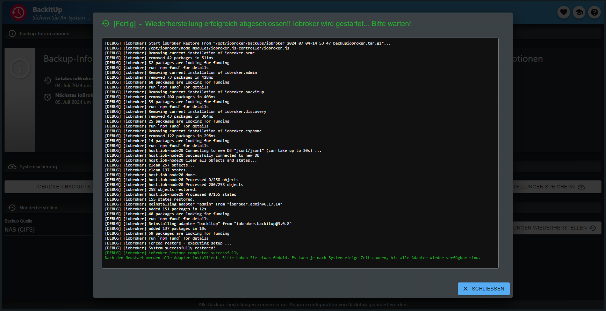

# IoBroker.backitup 的文档和说明


**************************************************************************************************************

## 支持适配器开发
**如果您喜欢`ioBroker.backitup`，请考虑捐赠：**

[](https://paypal.me/mk1676)

**************************************************************************************************************

## 免责声明
**`ioBroker.backitup` 是仅适用于智能家居软件 ioBroker 的备份插件。**

**它与[Nero BackItUp](https://www.nero.com/deu/products/nero-backitup/?vlang=de)（Windows 系统上的数据备份工具）没有任何关联或支持。**

**************************************************************************************************************

## 基础知识
`ioBroker.backitup` 是一种备份解决方案，可以实现 ioBroker 安装和 Homematic CCU 的循环备份。

该适配器是多平台的，除了 Linux 安装外，还可以在 Windows 和 Mac 安装上使用。

此外，还可以备份各种可选备份，例如 SQL 数据库、Influx 数据库以及一些适配器和设备设置。

`ioBroker.backitup` 与 js-controller 紧密合作，并创建与 CLI 命令 `iobroker backup` 相同的 ioBroker 备份。

这里与 js-controller 的标准备份相同，所有状态和对象以及 VIS 等用户文件都被备份。

恢复也与 js-controller 的 CLI 命令`iobroker restore <backupname>`完全相同。

还原操作将从`ioBroker.backitup`恢复所有状态、对象和用户数据。
还原完成后，您的 iobroker 将重新启动，然后 js-controller 将接管所有缺失适配器的安装。

`ioBroker.backitup` 对 iobroker 启动后的恢复没有影响。这一切都在后台进行，并由 js 控制器根据状态和对象中恢复的信息进行处理。

与 CLI 命令不同，`ioBroker.backitup` 还可以恢复各种可选备份。
这无法通过 CLI 实现。

_[返回顶部](#dokumentation-und-anleitung-für-iobrokerbackitup)_

---

依赖项
* 对于 CIFS 挂载，必须安装 cifs-utils。
-`sudo apt install cifs-utils`

* NFS 挂载需要安装 nfs-common。
-`sudo apt install nfs-common`

* 要使用 MySql 系统的 MySql 备份，必须在系统上安装 mysqldump
- `sudo apt install mysql-client` 或者在 Debian 上 `sudo apt install default-mysql-client`

* 要使用 MariaDB 系统的 MySql 备份，必须在系统上安装 mysqldump
-`sudo apt install mariadb-client`

* 要使用 Sqlite3 备份，必须在系统上安装 sqlite3
-`sudo apt install sqlite3`

* 要使用 PostgreSQL 备份，必须在系统上安装 mysqldump
- [PostgreSQL 安装指南](https://www.postgresql.org/download/linux/debian/)

* 要使用 InfluxDB 备份，必须安装 influxd
- [InfluxDB 1.x 安装指南](https://docs.influxdata.com/influxdb/v1.8/introduction/install/)
- [InfluxDB 2.x 安装指南](https://docs.influxdata.com/influxdb/v2.1/install/)
- [Influx CLI 2.x 安装指南](https://docs.influxdata.com/influxdb/v2.1/tools/influx-cli/?t=Linux)

_[返回顶部](#dokumentation-und-anleitung-für-iobrokerbackitup)_

---

## 使用与操作
`ioBroker.backitup` 可在适配器实例中配置。以下所有设置选项均可在此处使用。

对于`ioBroker.backitup`的日常工作和操作，在管理选项卡中有一个可用的选项卡。

如果此选项卡在管理界面的选项卡菜单中处于活动状态，则可以通过 ioBroker 左侧选项卡栏中的选项卡直接操作`ioBroker.backitup`。

那里提供有关所创建备份的信息，可以创建备份，也可以恢复备份。


以下是标签菜单中选项的简要说明

| 编号 | 描述 |
|-----|---------------------------------------------------------------------------------------------------------------------------------------------------------------------------------------------------------------------|
| 1. | 有关上次和下次备份的信息。|
| 2. | 有关备份存储位置的信息。|
| 3. | 有关哪些备份类型处于活动状态且正在备份的信息。|
| 4.| 手动启动 iobroker 备份。|
| 5.| 手动启动 Homematic 备份。|
| 6. | 打开一个新窗口并显示历史记录中的所有备份。|
| 7. | 此按钮允许您保存`ioBroker.backitup`的设置。这在更换系统时非常有用。设置以 JSON 格式输出。|
| 8. | 在此选项中，您可以选择要从中执行还原的存储。|
| 9. | 单击“检索备份”按钮将打开一个新窗口，列出所选存储中所有现有的备份。|
| 11. | 此按钮用于恢复适配器中已保存的`ioBroker.backitup`设置。它并非ioBroker的恢复，并且此处只能上传JSON格式的文件！|
| 12. | 打开新标签页并显示`ioBroker.backitup`的文档。|
| 13. | 打开新选项卡并显示`ioBroker.backitup`的自述文件。|
| 13. | 打开一个新选项卡并显示“ioBroker.backitup”的自述文件。|


恢复选项卡的操作如下。

| 编号 | 描述 |
|-----|------------------------------------------------|
| 1. | 将选定的备份下载到您的电脑。|
| 2. | 开始恢复选定的备份。|
| 3. | 备份信息。|
| 4. | 有关备份类型的信息。|


_[返回顶部](#dokumentation-und-anleitung-für-iobrokerbackitup)_

---

## 备份类型
`ioBroker.backitup` 提供多种选项，可循环执行各种备份类型，或一键执行。默认情况下，每个备份都存储在 /opt/iobroker/backups 目录中。您也可以选择配置 FTP 上传，或者使用 CIFS/NFS 挂载。

### IoBroker 备份
此备份与 ioBroker 附带的备份类似，后者可在控制台中使用命令 `iobroker backup` 启动。但此处的备份使用适配器配置或 OneClick Backup 小部件中指定的设置执行，无需使用控制台。

### CCU 备份 (Homematic)
此备份功能支持备份 Homematic 安装的三个不同版本（CCU Original / pivCCU / RaspberryMatic）。此备份功能也可使用适配器配置或 OneClick Backup 小部件中定义的设置来执行。

如果您想备份多个 CCU，您可以激活“备份多个系统”选项，然后在表中定义您的 Homematic 中央单元。

> [!IMPORTANT] > 仅可由 CCU 用户`Admin`! 执行 CCU 备份！

### MySQL 备份
此可单独配置的备份（如果启用）会随每次 ioBroker 备份一起创建，并在指定的保留期后删除。FTP 或 CIFS 也适用于此备份，前提是它们已针对其他 ioBroker 备份类型进行了配置。

需要注意的是，即使 MySQL 服务器在远程系统上运行，mysqldump 也必须在 ioBroker 系统上运行。
对于 Linux 系统，安装命令为：`sudo apt install mysql-client`；对于 Debian，安装命令为 `sudo apt install default-mysql-client`；对于 MariaDB 系统，安装命令为 `sudo apt install mariadb-client`。

如果您想备份多个数据库，您可以激活“备份多个系统”选项，然后在表中定义您的数据库。

### Sqlite3 备份
此可单独配置的备份（如果启用）会随每次 ioBroker 备份一起创建，并在指定的保留期后删除。FTP 或 CIFS 也适用于此备份，前提是它们已针对其他 ioBroker 备份类型进行了配置。

必须在主机系统上安装 Sqlite3 (`sudo apt install sqlite3`)。

### Redis 备份
此可单独配置的备份（如果启用）会随每次 ioBroker 备份一起创建，并在指定的保留期后删除。FTP 或 CIFS 也适用于此备份，前提是它们已针对其他 ioBroker 备份类型进行了配置。

要将 Redis 与 `ioBroker.backitup` 一起使用，应调整 iobroker 用户的权限：

```
sudo usermod -a -G redis iobroker
sudo reboot
```

对于远程备份，本地 ioBroker 系统上需要 redis-cli。

`sudo apt install redis-tools`

在这里您必须指定远程 Redis 服务器的主机和端口以及系统的登录数据。

对于 Docker 用户来说，这是一个重要的功能。

请注意，Redis 不支持通过 `ioBroker.backitup` GUI 恢复远程系统的 Redis 数据。
在这种情况下，必须手动恢复 tar.gz 存档中包含的 dump.rdb，方法是解压备份存档并将文件复制到 Redis 目录，同时调整 dump.rdb 的权限。

以下是一个例子：

```
sudo tar -xvzf <Backupdatei>.tar.gz /var/lib/redis/
sudo chown redis:redis /var/lib/redis/dump.rdb
redis-cli shutdown nosave
```

### 历史数据备份
此可单独配置的备份（如果启用）会随每次 ioBroker 备份一起创建，并在指定的保留期后删除。FTP 或 CIFS 也适用于此备份，前提是它们已针对其他 ioBroker 备份类型进行了配置。

### InfluxDB 备份
此可单独配置的备份（如果启用）会随每次 ioBroker 备份一起创建，并在指定的保留期后删除。FTP 或 CIFS 也适用于此备份，前提是它们已针对其他 ioBroker 备份类型进行了配置。

**使用 InfluxDB v1.x 进行远程备份的要求：**

InfluxDB 1.x 下的远程备份需要进行一些调整。

**要执行 InfluxDB 备份，必须在 iobroker 系统上安装 InfluxDB。**

**数据库是在本地管理还是在另一台服务器上运行并不重要。**

如果要从远程服务器备份 InfluxDB，则必须在远程服务器上的 influxdb.conf 中调整 RPC 服务的远程权限。

```
bind-address = "<InfluxDB-IP>:8088"
```

或者

```
bind-address = "0.0.0.0:8088"
```

**更改配置后，必须重新启动 InfluxDB 服务。**

有关 InfluxDB 数据备份的更多信息，请参阅[这里](https://docs.influxdata.com/influxdb/v1.8/administration/backup_and_restore/#online-backup-and-restore-for-influxdb-oss)。

**使用 InfluxDB v2.x 进行备份的要求：**

要创建 InfluxDB 2.x 的备份，必须在您的系统上安装 Influx-CLI。
本地备份和远程备份都需要安装此工具。

对于远程备份，必须在运行 ioBroker 的系统上安装 Influx-CLI。
无需在运行数据库的远程系统上进行安装即可进行备份。

您可以在此处找到有关如何在系统上安装 Influx-CLI 的官方说明。

[Influx-CLI 2.x 安装说明](https://docs.influxdata.com/influxdb/v2.1/tools/influx-cli/?t=Linux)

如果您想备份多个数据库，您可以激活“备份多个系统”选项，然后在表中定义您的数据库。

> [!IMPORTANT] > 要创建和恢复 InfluxDB2 备份，需要操作员令牌！

### PostgreSQL 备份
此可单独配置的备份（如果启用）会随每次 ioBroker 备份一起创建，并在指定的保留期后删除。FTP 或 CIFS 也适用于此备份，前提是它们已针对其他 ioBroker 备份类型进行了配置。

需要注意的是，即使 PostgreSQL 服务器在远程系统上运行，PostgreSQL 也必须在 ioBroker 系统上运行。
对于 Linux 系统，请参阅[这里](https://www.postgresql.org/download/linux/debian/) 中的安装说明。

如果您想备份多个数据库，您可以激活“备份多个系统”选项，然后在表中定义您的数据库。

### Javascript 备份
此可单独配置的备份（如果启用）会随每次 ioBroker 备份一起创建，并在指定的保留期后删除。FTP 或 CIFS 也适用于此备份，前提是它们已针对其他 ioBroker 备份类型进行了配置。

从`ioBroker.backitup` 2.2.0版本开始，脚本将直接从对象备份。旧版`ioBroker.backitup`的 JavaScript 备份不兼容恢复！

为了能够使用 `ioBroker.backitup` 版本 < 2.2.0 执行 JavaScript 备份，必须在 JavaScript 适配器配置中提前定义菜单项“将脚本镜像到文件路径”和“执行镜像的实例”。

`ioBroker.backitup` 随后可以采用配置菜单中的设置。

### Jarvis 备份
此可单独配置的备份（如果启用）会随每次 ioBroker 备份一起创建，并在指定的保留期后删除。FTP 或 CIFS 也适用于此备份，前提是它们已针对其他 ioBroker 备份类型进行了配置。

### Zigbee 备份
此可单独配置的备份（如果启用）会随每次 ioBroker 备份一起创建，并在指定的保留期后删除。FTP 或 CIFS 也适用于此备份，前提是它们已针对其他 ioBroker 备份类型进行了配置。

### Zigbee2MQTT 备份
此可单独配置的备份（如果启用）会随每次 ioBroker 备份一起创建，并在指定的保留期后删除。FTP 或 CIFS 也适用于此备份，前提是它们已针对其他 ioBroker 备份类型进行了配置。

#### 本地 Zigbee2MQTT 备份
`ioBroker.backitup` 适配器中的路径应始终直接指向 zigbee2mqtt 的“数据”路径。
例如：`/opt/zigbee2mqtt/data` 或直接指向 zigbee2mqtt Docker 安装中的卷

同样重要的是，授予用户“iobroker”对数据文件夹的权限以便能够读取和写入文件。

群组权限可以设置如下：

```
sudo usermod -a -G <zigbee2mqtt User> iobroker
sudo reboot
```

#### 远程 Zigbee2MQTT 备份
可以创建位于另一个系统上的 Zigbee2MQTT 备份。

为此，必须在 Backitup 中配置 Zigbee2MQTT 的 MQTT 服务器的 IP 地址（而不是 Zigbee2MQTT 的 IP 地址）、MQTT 端口和 Zigbee2MQTT 的基本主题。

如果 MQTT 服务器已激活身份验证，则还需要用户名和密码。

> [!IMPORTANT] > 远程备份直接通过 Zigbee2MQTT 恢复，而不是通过 Backitup 恢复。

### Node-Red 备份
此可单独配置的备份（如果启用）会随每次 ioBroker 备份一起创建，并在指定的保留期后删除。FTP 或 CIFS 也适用于此备份，前提是它们已针对其他 ioBroker 备份类型进行了配置。

### Grafana 备份
此可单独配置的备份（如果启用）会随每次 ioBroker 备份一起创建，并在指定的保留期后删除。FTP 或 CIFS 也适用于此备份，前提是它们已针对其他 ioBroker 备份类型进行了配置。

> [!IMPORTANT] > 要创建 Grafana 备份，必须在 Grafana Web 界面中生成 API 密钥或服务令牌才能访问仪表板和数据源。

直到 Grafana 版本 8.x，API 密钥可以在***“配置 → API 密钥或服务令牌”***下创建，并且必须具有完全的管理员权限。

从 9.0 版本开始，首先在“配置 → 管理用户和访问 → 服务帐户”***下创建服务帐户。创建帐户后，可以使用“添加服务帐户令牌”***添加令牌。

### Yahka 备份
此可单独配置的备份（如果启用）会随每次 ioBroker 备份一起创建，并在指定的保留期后删除。FTP 或 CIFS 也适用于此备份，前提是它们已针对其他 ioBroker 备份类型进行了配置。

所有 Homekit 系统设置和设备设置都已备份。

_[返回顶部](#dokumentation-und-anleitung-für-iobrokerbackitup)_

---

## 存储选项
＃＃＃ 当地的
ioBroker 中的默认备份位置为 `/opt/iobroker/backups`。
此位置由系统预定义，无法更改。
如果下方列出的 CIFS 或 NFS 挂载均未处于活动状态，则所有备份都将保存到默认路径，并存储在主机系统本地。

云或 FTP 等其他存储选项只需在主机系统外部选定的位置创建备份的副本。

### CIFS
在 Linux 下，CIFS 安装不是问题。

需要注意的是cifs-utils已经安装。

该路径应如下所示（例如“/sharename/path”）

或者，您可以启用/禁用是否从 NAS 中删除备份。

### NFS
在 Linux 下，NFS 挂载不是问题。

需要注意的是nfs-common已经安装。

路径应如下所示（例如：“/sharename/path”）。

或者，您可以启用/禁用是否从 NAS 中删除备份。

### FTP
FTP 可在所有操作系统上使用，并可作为 CIFS 安装的替代方案。

FTP 下的路径规范必须始终以“/”开头（例如“/path 规范”）

或者，您可以启用/禁用是否从 NAS 中删除备份。

＃＃＃ 复制
如果无法进行 CIFS 挂载，则还有另一种选择，即使用复制功能。

您必须在此处输入 CIFS 设置中应将数据复制到的路径。

要使用复制功能，IP 地址必须留空。

### 专家坐骑
在“专家”部分，您可以创建自己的挂载命令，适配器随后将使用该命令进行备份和恢复。
在这里，您可以单独操作，例如集成 fstab 或凭据。

> [!WARNING] > 请注意，此选项仅适用于专家。

### Dropbox
要使用 Dropbox 备份，您需要获取访问令牌。您可以在 `ioBroker.backitup` 配置页面上获取此令牌。

ioBroker 仅访问定义的区域；云中不存储任何令牌或用户数据。

如果您想创建自己的 Dropbox API 应用程序，您可以在`ioBroker.backitup` 的设置中选择它，然后按照以下步骤操作。

> 注意：自定义应用仅包含“short_live”令牌，有效期仅为 4 小时。我们建议使用 iobroker 标准应用。

要在 Dropbox 中使用备份，必须在 https://www.dropbox.com/developers/apps 创建访问令牌和 APP：

* 步骤 1：使用“创建应用”按钮
* 第 2 步：选择“范围访问”
* 步骤 3：选择“应用程序文件夹”
* 步骤 4：输入“应用程序名称”并选择“创建应用程序”按钮
* 步骤 5：在“权限”选项卡中，选中“文件和文件夹”部分中的所有 4 个框
* 步骤 6：在“设置”选项卡中，将“访问令牌过期时间”设置为“无过期时间”
* 步骤 7：按“生成访问令牌”按钮（此生成的令牌将输入到 `ioBroker.backitup` 的设置中）

您的 Dropbox 中现在有一个名为“Apps”的新文件夹。

### Google 云端硬盘
要使用 Google Drive 备份，您需要获取访问令牌。您可以在配置页面上获取此令牌。

ioBroker 仅访问已定义的区域。oAuth 的代码可在[这里](https://github.com/simatec/ioBroker.backitup/blob/master/docs/oAuthService.js) 中找到。

云中不存储任何令牌或用户数据。

### Onedrive
要使用 OneDrive 备份，您需要获取访问令牌。您可以在 `ioBroker.backitup` 配置页面上获取此令牌。

ioBroker 仅访问定义的区域；云中不存储任何令牌或用户数据。

### WebDAV
`ioBroker.backitup` 借助 WebDAV，可以访问多个云系统，其中最受欢迎的是 NextCloud。
要建立 WebDAV 连接，需要云帐户的用户名和密码。

与云的连接是通过加密连接。

要建立连接，云主机名必须满足所有安全证书。

> 示例 URL：“https://example.com/remote.php/dav/files/username/”

仅当禁用“仅允许签名的证书”选项时，才可以与本地 IP 地址建立连接。

_[返回顶部](#dokumentation-und-anleitung-für-iobrokerbackitup)_

---

## 删除旧备份
`ioBroker.backitup` 可以自动删除旧备份。您可以在 `ioBroker.backitup` 的配置中指定要保留的备份数量。
仅当适配器执行自动计划备份时，才会删除旧备份。

> [!NOTE] > 手动备份不会删除旧的备份文件。

> [!IMPORTANT] > 如果备份过程中发生错误，出于安全原因，不会删除旧备份。

哪些备份被删除以及可能的删除错误都输出在调试日志中。

_[返回顶部](#dokumentation-und-anleitung-für-iobrokerbackitup)_

---

## 多主机支持
`ioBroker.backitup` 的多主机可以与不同主机上的 `ioBroker.backitup` 的多个实例一起工作。

必须将 `ioBroker.backitup` 的一个实例配置为主实例才能支持它。位于远程主机上的所有其他实例均配置为从实例。

主服务器管理自动备份。所有从属实例均可通过主服务器的菜单选择。

可以为从属实例启用以下备份选项：

* Redis
* Zigbee
* 贾维斯
* 历史
* InfluxDB
* MySQL
* SQLite3
* PostgreSQL
*格拉法纳
* 雅卡
* 节点红色
* Zigbee2MQTT

由于从属实例中的自动备份由主实例控制，因此无法选择 iobroker 备份、JavaScript 备份和 CCU 备份。

每个从服务器可以自由配置各个备份的存储位置。这使得每个从服务器可以独立于主服务器设计自己的文件存储系统。

在 RAM 有限的系统上，`ioBroker.backitup` 主服务器可以自动启动然后停止从属实例以进行备份过程。

此选项可在菜单中配置。

_[返回顶部](#dokumentation-und-anleitung-für-iobrokerbackitup)_

---

Docker 支持
由于 Docker 容器中不应安装任何数据库系统，因此不支持备份所有数据库，并且默认情况下，对于检测到的 Docker 容器，备份不可用。为了仍然能够备份外部数据库，必须设置两个容器环境变量：

* IOB_BACKITUP_EXTDB=真
* 套餐

“PACKAGES”环境变量的内容取决于访问相应数据库所需的待安装软件包。例如“mysql-client”或“redis-tools”。更多详情请参阅[这里](https://docs.buanet.de/iobroker-docker-image/docs_backitup/)。

为了在 Docker 中充分使用`ioBroker.backitup`，仍然需要映射一些端口。

* 端口 8091 - 恢复 Web 界面
* 端口 9081 - 通过 `ioBroker.backitup` 的 Web 界面下载备份的文件服务器
* 端口 9082 - 用于通过 `ioBroker.backitup` 的 Web 界面上传备份的文件服务器

_[返回顶部](#dokumentation-und-anleitung-für-iobrokerbackitup)_

---

＃＃ 用法
1. 适配器创建一些用于 Vis 的数据点

* oneClick.ccu -> 作为 CCU 备份的触发器（可以通过按钮在 Vis 中设置为 true）
* oneClick.iobroker -> 作为标准备份的触发器（可以在 Vis 中使用按钮设置为 true）

* history.html -> 作为历史记录日志，可通过 CCS 在 Vis 中自定义。
* history.json -> 作为历史记录日志，可通过 CCS 在 Vis 中自定义。
* history.ccuLastTime -> 保存上次 CCU 备份的创建日期和时间
* history.minimalLastTime -> 存储上次标准备份的创建日期和时间
* history.ccuSuccess -> 如果备份成功则显示状态“true”
* history.minimalSuccess -> 如果备份成功则显示状态“true”
* history.iobrokerLastTime -> 显示最后的 ioBroker 备份
* history.ccuLastTime -> 显示最后一次 CCU 备份
* info.ccuNextTime -> 显示下次执行 CCU 备份的时间
* info.iobrokerNextTime -> 显示 ioBroker 备份的下一次执行时间
* info.latestBackup -> 显示启动时确定的最后一个备份，以 json 格式

2.在Vis中查看备份历史日志
- 备份历史记录显示最后 x 个备份
- 可以在附加设置中设置要显示的历史记录条目数。
- 可以显示历史记录日志，例如，在 HTML 小部件中通过在 HTML 中输入以下行：

```
{backitup.0.history.html}
```

语法：{BackitupInstanz.history.html}

3.历史日志的CCS格式：

```
   .html{
       display:block;
       width:100%;
   /*    overflow-y:scroll; */
   }
   .backup-type-iobroker
       {
           float:left;
           color:white;
           font-size:20px;
       }
   .backup-type-ccu
       {
           float:left;
           color:red;
           font-size:20px;
    }
   ```

4. 带有状态文本的 OneClick 按钮
- 当 OneClick 数据点设置为 true 时，相应的备份将启动；在预定时间后，该数据点将重新设置为 false。这样就可以创建一个带有状态的按钮。为此，请修改以下行并将其作为按钮文本输入到 Vis 中：

```
{wert: backitup.0.oneClick.iobroker; wert === "true" || wert === true ? "Minimal Backup </br> wird erstellt" : "Minimal Backup </br> starten"}
```

语法：{value: <BackupInstance>.oneClick.<Trigger>; value === "true" || value === true ? "备份创建期间的文本" : "默认文本"}

_[返回顶部](#dokumentation-und-anleitung-für-iobrokerbackitup)_

---

## 通知
`ioBroker.backitup` 支持以下 Messenger，用于在备份成功后发送通知。
必须安装并配置相应的适配器才能使用它们。

* 电报
* 容易被欺负的人
* 电子邮件
* WhatsApp
* 信号
* 矩阵
* 不和谐

_[返回顶部](#dokumentation-und-anleitung-für-iobrokerbackitup)_

---

＃＃ 恢复
使用`ioBroker.backitup`可以通过 ioBroker 中的配置菜单恢复所有创建的备份类型。

`ioBroker.backitup` 与 js-controller 紧密合作，并创建与 CLI 命令“iobroker backup”相同的 iobroker 备份。

这里与 js-controller 的标准备份相同，所有状态和对象以及 VIS 等用户文件都被备份。

恢复也与 js-controller 的 CLI 命令完全相同。

在恢复期间，将恢复来自`ioBroker.backitup` 的所有状态、对象和用户数据。


恢复后，您的 ioBroker 将重新启动，从那时起 js-controller 将接管丢失的适配器的安装。



`ioBroker.backitup` 对 iobroker 启动后的恢复没有影响。js 控制器会根据状态和对象中恢复的信息在后台处理此问题。

可以从所有存储介质执行恢复。

> [!NOTE] > 一般来说，最安全的方法是在本地执行还原。

如果您选择最安全的路径并希望在本地执行恢复，则必须将备份文件保存在 ioBroker 备份文件夹中。
在 Linux 系统上，此文件夹位于以下路径：`/opt/iobroker/backups`

对于备份类型“ioBroker”和“redis”，ioBroker 在恢复期间停止，然后自动重新启动。

**对于所有其他备份类型，ioBroker 不会停止。在这种情况下，只有受影响的适配器会暂时停止。**

如果您希望手动恢复备份，请按照以下步骤操作：

***恢复 ioBroker 备份：***

- 备份必须像往常一样位于目录“opt/iobroker/backups”中
- 可以使用命令“iobroker restore <备份文件名>”通过控制台进行恢复。
- 恢复后需要“iobroker upload all”

有关使用`ioBroker.backitup`进行恢复以及手动恢复的详细说明，请参阅[这里](https://github.com/simatec/ioBroker.backitup/wiki/%5BHowTo%5D-Restore-auf-Linux-Distributionen)。

**CCU 备份仍然必须通过 CCU 网络界面恢复。**

***恢复 Raspberrymatic / CCU 备份：***

- 通过 SCP 将 *.sbk 文件复制到 Raspberrymatic 上的目录“/usr/local/tmp 目录”
- 通过控制台以 root 用户身份登录 Raspberrymatic
- 在 Raspberrymatic 上运行命令：“/bin/restoreBackup.sh /user/local/tmp/YourBackupFilename”。
- 在 Raspberrymatic 上运行“reboot”命令来重启 PI
- 或者，当然也可以像往常一样通过 Web 界面恢复备份。

### 恢复 InfluxDB 数据库
恢复 InfluxDB 备份时，请注意必须事先停止 InfluxDB 适配器并且数据库不能存在。

> [!NOTE] > 如果数据库存在，则必须在还原之前将其删除。

InfluxDB 适配器在恢复之后才可以重新启动，因为它将始终尝试创建数据库。

此外，要恢复 InfluxDB 2.x 数据库，必须在恢复之前在 ioBroker.backitup 菜单中配置操作员令牌。

> [!NOTE] > 如果没有正确的操作员令牌，则无法进行还原。

_[返回顶部](#dokumentation-und-anleitung-für-iobrokerbackitup)_

---

故障排除
要记录错误，必须在 ioBroker“实例”选项卡下将`ioBroker.backitup`设置为日志级别“调试”。

_[返回顶部](#dokumentation-und-anleitung-für-iobrokerbackitup)_

---

## 遇到的错误/解决方案
这是迄今为止遇到的问题及其解决方案的列表（如果有）。

1. Olifall（来自论坛）遇到了ioBroker网页界面在恢复后无法访问的问题。他通过控制台执行以下步骤解决了这个问题：
-sudo iobroker状态
- 消息 = “未连接到状态 127.0.0.0:6379[redis]”
- sudo apt 安装 redis 服务器

2. 如果无法使用 IP 地址进行 CIFS 挂载，则应使用 NAS 的主机名
3. 如果对 CIFS 挂载使用带有特殊字符的密码，用户发现该密码必须存储在配置中的引号中。
4. 一些用户反映，CIFS 挂载无法处理很长的密码。如果挂载失败，请将密码缩短一点（我建议 12 个字符）。
5. 如果适配器安装失败，请检查您的 Node 和 NodeJS 版本。该适配器不支持 Node 8 以下的版本。
6. 如果您的 ioBroker 系统是使用新的安装程序脚本安装的，则可能会出现您不具备新用户 iobroker 的所有权限的情况。

不幸的是，这也会影响 backitup，因为 backitup 使用了一些与系统相关的命令。

为了解决缺少权限的问题，ioBroker 安装程序脚本有一个修复程序。
请在控制台中的 ioBroker 环境中运行以下命令：

```
iobroker stop
iobroker fix
sudo reboot
```

7、如果在创建Redis数据库时收到错误信息，请检查您的用户iobroker是否具备必要的权限，以及是否在Redis用户组中。

如果不是这种情况，您可以使用控制台中的以下命令进行修复。

```
sudo usermod -a -G redis iobroker
sudo reboot
```

如果您没有使用安装程序脚本设置 ioBroker 安装，并且您的用户有不同的名称，请在命令中将“iobroker”替换为您的用户名。

8. 如果将 Fritzbox 用作固件 >= 7.21 的 NAS，则应将 `ioBroker.backitup` 中的 SMB 设置设置为“3.1.1”，并启用选项“noserverino”。

_[返回顶部](#dokumentation-und-anleitung-für-iobrokerbackitup)_

---

## Changelog
### **WORK IN PROGRESS**
* (simatec) dependencies updated

### 3.3.6 (2025-08-31)
* (simatec) dependencies updated

### 3.3.5 (2025-07-05)
* (simatec) Fix Dropbox Token Check
* (simatec) dependencies updated

### 3.3.4 (2025-06-26)
* (simatec) Fix Grafana Backup & Restore

### 3.3.3 (2025-06-24)
* (simatec) Translation updated
* (simatec) Fix Grafana Backup & Restore
* (simatec) Docu updated
* (simatec) dependencies updated

### 3.3.2 (2025-06-19)
* (simatec) Base Topic for z2m Remote Backup added

### 3.3.1 (2025-06-18)
* (simatec) Fix z2m Remote Backup

### 3.3.0 (2025-06-15)
* (simatec) local onedrive api added
* (simatec) dependencies updated
* (simatec) z2m Remote Backup added
* (simatec) Fix Zigbee Backup

### 3.2.2 (2025-05-16)
* (simatec) Grafana Folder added to Restore
* (simatec) Grafanfa Folder uid added
* (simatec) dependencies updated
* (simatec) Fix Mail Subject on Error

### 3.2.1 (2025-04-25)
* (simatec) Fix Onedrive download
* (simatec) Fix Onedrive Restore

### 3.2.0 (2025-04-04)
* (Bluefox/DileSoft) json custom typescript added
* (Bluefox/simatec) Dropbox OAuth updated
* (simatec) Fix Webdav Certificates
* (simatec) Dependencies updated

### 3.1.0 (2025-03-02)
* (Bluefox) Dependencies updated
* (Bluefox) Vite added
* (simatec) jsonConfig updated
* (simatec) Fix month for history

### 3.0.37 (2025-02-28)
* (simatec) Fix CronJob

### 3.0.36 (2025-02-26)
* (simatec) Fix src-admin

### 3.0.35 (2025-02-26)
* (simatec) Fix src-admin

### 3.0.34 (2025-02-26)
* (simatec) Fix src-admin

### 3.0.33 (2025-02-25)
* (simatec) Fix cronjob
* (simatec) Fix Backup Console

### 3.0.32 (2025-02-24)
* (simatec) Error handling for GoogleDrive fix
* (simatec) globalDependencies updated
* (simatec) Dependencies updated
* (simatec) Design Fix

### 3.0.31 (2024-11-30)
* (simatec) Fix Tab Menu

### 3.0.30 (2024-11-29)
* (simatec) Fix Tab Menu

### 3.0.29 (2024-11-29)
* (simatec) Fix Tab Menu

### 3.0.28 (2024-11-27)
* (simatec) Dependencies updated
* (simatec) eslint-config added
* (bluefox) Allow to store files for up to ca 3 years
* (Marc-Berg) Grafana Docu updated

### 3.0.27 (2024-11-12)
* (simatec) dependencies updated
* (simatec) Design Fix

### 3.0.26 (2024-10-16)
* (simatec) Fix FTP Connections
* (simatec) dependencies updated
* (simatec) Issue Workflow added

### 3.0.25 (2024-09-26)
* (bluefox) Improvement of Google Drive authentication workflow
* (bluefox) Removed gulp from a build process
* (simatec) small Design Fix
* (simatec) Fix for Admin 7.1.5
* (simatec) Fix Test & Release
* (simatec) Fix ESlint errors

### 3.0.22 (2024-09-03)
* (simatec) Fix Notification Instance
* (simatec) Fix Notification Design
* (simatec) Fix Default Settings

### 3.0.21 (2024-09-01)
* (simatec) Fix Onedrive Notification
* (simatec) Fix Zigbee2MQTT Backup
* (simatec) dependencies updated

### 3.0.20 (2024-08-22)
* (simatec) Responsive Design for Tab added
* (simatec) Responsive Design for jsonConfig added
* (simatec) dependencies updated

### 3.0.19 (2024-08-15)
* (simatec) Fix CCU Backup
* (simatec) Fix InfluxDB Backup Config
* (simatec) Fix Backup-Log for Slave Instanz

### 3.0.18 (2024-08-14)
* (simatec) Package optimisation
* (simatec) Fix the warning when opening the configuration
* (simatec) dependencies updated

### 3.0.17 (2024-08-12)
* (simatec) Fix io-package for Release
* (simatec) manual-review added
* (simatec) Fix Slave Backup
* (simatec) dependencies updated

### 3.0.16 (2024-08-05)
* (bluefox) dependencies updated
* (simatec) Rename json5 Files

### 3.0.15 (2024-08-03)
* (simatec) fix dependencies

### 3.0.14 (2024-08-02)
* (simatec) dependencies updated
* (simatec) Improved log outputs

### 3.0.12 (2024-08-01)
* (simatec) Backup Log for History added
* (simatec) Added separate selection for deleting FTP backups
* (simatec) Added separate selection for deleting Onedrive backups
* (simatec) Added separate selection for deleting Webdav backups
* (simatec) Added separate selection for deleting Dropbox backups
* (simatec) Added separate selection for deleting Googledrive backups
* (simatec) Improved log outputs
* (simatec) Source code cleaned up
* (simatec) dependencies updated

### 3.0.11 (2024-07-28)
* (simatec) Design Fix
* (simatec) dependencies updated

### 3.0.10 (2024-07-22)
* (simatec) Design Fix for Dark Mode
* (bluefox) dependencies updated

### 3.0.9 (2024-07-11)
* (simatec) Tab Icons added
* (simatec) small fix
* (simatec) Docu updated

### 3.0.8 (2024-07-01)
* (Grothesk242/simatec) forceuid and forcegid added
* (simatec) dependencies updated
* (simatec) small fix

### 3.0.7 (2024-06-26)
* (simatec) Restore Information added
* (simatec) Fix Formaterrors
* (bluefox) Fixing the problems with styles
* (simatec) Fix iobroker Backup Error

### 3.0.6 (2024-06-26)
* (simatec) Restore Information added
* (simatec) Fix Formaterrors
* (bluefox) Fixing the problems with styles
* (simatec) Fix iobroker Backup Error

### 3.0.5 (2024-06-18)
* (simatec) Fix Build

### 3.0.4 (2024-06-18)
* (simatec) History Gui Fix
* (simatec) Tab GUI modified
* (bluefox) Added support for Admin 7
* (simatec) Onedrive ready for School/Business Accounts

### 3.0.3 (2024-06-10)
* (simatec) Fixed WebDav
* (simatec) Admin Notification for Backup errors added
* (simatec) Remove Sentry Config
* (simatec) Translations updated
* (simatec) Error handling optimized
* (simatec) dependencies updated

### 3.0.2 (2024-06-06)
* (simatec) Fixed Google Drive
* (simatec) Fixed Translations
* (simatec) Fixed Onedrive
* (simatec) Fixed MySql Backup
* (simatec) Fixed Translation added
* (simatec) Design Fix
* (simatec) new notifications content added

### 3.0.1 (2024-05-29)
* (simatec) Fixed umount callback
* (simatec) Fixed Backup Message
* (simatec) Translations updated
* (simatec) Fixed InfluxDB Multi Backup
* (simatec) Fixed Restore Console
* (simatec) Fixed Backup Console

### 3.0.0 (2024-05-28)
* (simatec) jsonConfig added
* (bluefox) Conversion to React
* (bluefox) Added react components
* (bluefox/simatec) Working on React GUI
* (simatec) dependencies updated
* (simatec) Fixed Yahka Backup
* (simatec) Fixed Nodered Backup
* (simatec) some bugs fixed
* (bluefox/simatec) New Restore-Interface
* (simatec) Translation updated

### 2.11.0 (2024-03-04)
* (simatec) Fixed Sqlite3 Path

### 2.10.11 (2024-02-14)
* (simatec) Design Fix
* (simatec) dependencies updated

### 2.10.10 (2024-02-04)
* (simatec) small Design Fix

### 2.10.9 (2024-02-01)
* (simatec) Fixed Translation

### 2.10.8 (2024-01-30)
* (simatec) Fixed Expert Mount
* (simatec) Docu updated
* (simatec) dependencies updated

### 2.10.7 (2024-01-29)
* (simatec) small fixes
* (simatec) small Design Fix
* (simatec) Translation updated
* (simatec) Expert Mount added

### 2.10.6 (2024-01-27)
* (simatec) Gulp deleted
* (simatec) adapter-dev added
* (simatec) Translation added
* (simatec) Customised design
* (simatec) Hover info added to the Restore tab
* (simatec) Improved mobile view
* (simatec) dependencies updated

### 2.10.5 (2024-01-22)
* (simatec) Fixed CCU Backup with selfsigned Certificates

### 2.10.4 (2024-01-21)
* (simatec) Fixed CCU Backup

### 2.10.3 (2024-01-19)
* (simatec) CCU backup switched from request to axios
* (simatec) Sentry fix

### 2.10.2 (2024-01-14)
* (simatec) Cronjob for Expert Settings added
* (simatec) Code restructured
* (simatec) Translation added

### 2.10.1 (2024-01-09)
* (simatec) small Fixes
* (simatec) Code restructured

### 2.10.0 (2024-01-06)
* (simatec) File server improved
* (simatec) Restore Tab improved
* (simatec) Design improved
* (simatec) Docu updated
* (simatec) Breaking Changes for Docker mapping ports

### 2.9.10 (2023-12-29)
* (simatec) Fixed node-red restore
* (simatec) auto install after restore for node-red added

### 2.9.9 (2023-12-29)
* (simatec) dependencies updated
* (simatec) Default storage path for history adapter added
* (simatec) Added check of the storage path from the History Adapter

### 2.9.8 (2023-12-14)
* (simatec) Sentry fix

### 2.9.7 (2023-12-12)
* (simatec) URL Update
* (simatec) Fixed redis Password

### 2.9.6 (2023-12-10)
* (simatec) Gotify Notication added
* (simatec) dependencies updated
* (simatec) Copypath check added

### 2.9.5 (2023-11-29)
* (simatec) dependencies updated
* (simatec) Fixed redis Password

### 2.9.4 (2023-11-20)
* (simatec) dependencies updated
* (simatec) Fixed CIFS Password
* (simatec) Fixed mySql Password
* (simatec) Fixed pgSql Password
* (simatec) Fixed redis Password

### 2.9.3 (2023-11-11)
* (simatec) Fixed Port for Filerserver
* (simatec) Docu updated

### 2.9.2 (2023-11-10)
* (simatec) dependencies updated
* (simatec) Design fix
* (simatec) Backup File upload added
* (simatec) Uploadserver added
* (simatec) Translation updated

### 2.9.1 (2023-11-02)
* (simatec) ignore Build directory for ESPHome added

### 2.9.0 (2023-11-01)
* (simatec) mount option "Cache Loose" added
* (simatec) ESPHome Backup added
* (simatec) dependencies updated

### 2.8.7 (2023-10-19)
* (buanet) fix restore in docker v9

### 2.8.6 (2023-10-13)
* (simatec) Fixed node-red restore
* (simatec) dependencies updated

### 2.8.5 (2023-10-13)
* (simatec) Fixed mount errors

### 2.8.4 (2023-10-11)
* (simatec) Fixed mysql Backup
* (simatec) Fixed pgsql Backup
* (simatec) Fixed InfluxDB Backup

### 2.8.3 (2023-10-10)
* (simatec) Wake on LAN Advanced Settings added
* (simatec) dependencies updated

### 2.8.2 (2023-09-28)
* (simatec) Fixed redis backup

### 2.8.1 (2023-09-12)
* (simatec) Fixed roles
* (simatec) help-links added

### 2.8.0 (2023-09-11)
* (simatec) small Sentry fixes
* (simatec) Bugfix System-Message
* (simatec) Docu & Wiki updated
* (simatec) Translation updated
* (simatec) dependencies updated
* (simatec) Fixed Webdav
* (simatec) WOL Address & Port added
* (simatec) Restore for Backitup Config added

### 2.7.0 (2023-08-14)
* (simatec) dependencies updated
* (simatec) Fixed error Messages
* (simatec) edit automatic name addition added
* (simatec) Docu & Wiki updated
* (simatec) small bug fixes
* (simatec) Translation updated
* (crycode-de) Add support for sending notifications via discord (requires ioBroker.discord >= 2.1)

### 2.6.23 (2023-05-25)
* (simatec) Fixed Influx Restore for MultiDB
* (simatec) Token renew for Onedrive added
* (simatec) Fixed PSQL Restore

### 2.6.22 (2023-05-24)
* (simatec) Fixed Influx Restore for MultiDB
* (simatec) Default Ports for InfluxDB added

### 2.6.21 (2023-05-19)
* (simatec) small Sentry fixes
* (simatec) Fixed Influx Restore
* (simatec) Fixed Onedrive Download
* (simatec) dependencies updated

### 2.6.20 (2023-05-02)
* (simatec) FTP self signed Certificates added
* (simatec) dependencies updated

### 2.6.19 (2023-04-20)
* (simatec) small fix for js-controller 5

### 2.6.18 (2023-04-19)
* (simatec) dependencies updated
* (simatec) small Sentry fixes
* (simatec) Error notifications optimized

### 2.6.17 (2023-04-13)
* (simatec) Fixed delete InfluxDB tmp dir
* (simatec) small Sentry fixes

### 2.6.16 (2023-03-30)
* (simatec) small fix for js-controller 5

### 2.6.15 (2023-03-27)
* (simatec) Node-Red Backup optimized
* (simatec) Grafana Backup optimized
* (simatec) Zigbee2mqtt Backup optimized
* (simatec) skip-verify for influxdb 2.x

### 2.6.14 (2023-03-22)
* (simatec) Bug Fix History JSON

### 2.6.13 (2023-03-22)
* (simatec) Fixed Zigbee2mqtt Restore
* (simatec) Fixed Grafana Backup
* (simatec) Backup notifications optimized
* (simatec) Error notifications optimized
* (simatec) history data optimized
* (simatec) small bug fixes

### 2.6.12 (2023-03-16)
* (simatec) Fixed Zigbee2mqtt Backup & Restore
* (simatec) Node-Red Backup optimized
* (simatec) Grafana Backup optimized
* (simatec) InfluxDB Backup optimized
* (simatec) Docu & Wiki updated

### 2.6.11 (2023-03-11)
* (simatec) Fixed Zigbee2mqtt Backup & Restore

### 2.6.10 (2023-03-10)
* (simatec) Design Fix
* (simatec) node 14 set as minimum requirement
* (simatec) cleaning status log added
* (simatec) Fixed Node-Red Backup & Restore

### 2.6.9 (2023-03-08)
* (simatec) Dropbox session upload optimized
* (simatec) Error handling optimized

### 2.6.8 (2023-03-07)
* (simatec) Fixed Dropbox session upload

### 2.6.7 (2023-03-06)
* (simatec) Dropbox session upload optimized

### 2.6.6 (2023-03-05)
* (simatec) Dropbox file upload up to 350 GB added

### 2.6.5 (2023-03-03)
* (simatec) Fixed cifs Password
* (simatec) Fixed InfluxDB-Backup

### 2.6.4 (2023-02-26)
* (simatec) Design optimized
* (simatec) Onedrive Upload Session added

### 2.6.3 (2023-02-24)
* (simatec) Fixed SQLite3 Backup
* (simatec) Fixed Matrix Message

### 2.6.2 (2023-02-23)
* (simatec) Fixed SQLite3 Backup

### 2.6.1 (2023-02-20)
* (simatec) igonore temp-files for redis added

### 2.6.0 (2023-02-16)
* (simatec) Onedrive-Api added
* (simatec) Matrix Messenger added
* (simatec) TLS for FTP added
* (simatec) Tab Extra-Settings added
* (simatec) Node-Red Backup added
* (simatec) SQLLite Backup added
* (simatec) Zigbee2MQTT Backup added
* (simatec) Local-Storage check added
* (simatec) System-Message added
* (simatec) Jarvis Backup updated
* (simatec) many small Fixes

### 2.5.12 (2023-01-19)
* (simatec) Fixed Windows ioBroker-Restore

### 2.5.11 (2023-01-18)
* (simatec) Fixed Windows ioBroker-Restore

### 2.5.10 (2023-01-03)
* (simatec) Fixed Docker Restore
* (simatec) Fixed Link Design
* (simatec) dependencies updated
* (Grothesk242) Fixed CIFS Mount

### 2.5.9 (2022-12-05)
* (simatec) dependencies dropbox-v2-api updated
* (simatec) Fixed Zigbee Restore
* (simatec) Fixed Yahka Restore
* (simatec) Fixed Javascript Restore
* (simatec) Fixed Dropbox Error Messages

### 2.5.8 (2022-12-03)
* (simatec) Fixed iobroker Backup
* (simatec) dependencies updated

### 2.5.7 (2022-11-27)
* (simatec) Axios 1.1.3 added
* (bluefox) Added ukrainian language

### 2.5.6 (2022-11-14)
* (simatec) Fixed Grafana Backup
* (simatec) Fixed Downloadserver
* (simatec) Translation updated

### 2.5.5 (2022-11-13)
* (simatec) Design Fix
* (simatec) Docker DB Support added

### 2.5.4 (2022-11-02)
* (simatec) Fixed maxBuffer for DB-Backups
* (simatec) Docu updated
* (simatec) Fixed Dropbox error messages
* (simatec) Grafana self signed Certificates added

### 2.5.3 (2022-11-01)
* (simatec) dependencies updated

### 2.5.2 (2022-10-26)
* (simatec) Bugfix Google Drive

### 2.5.1 (2022-10-26)
* (simatec) Bugfix Google Drive

### 2.5.0 (2022-10-18)
* (bluefox) Google Drive authentication was fixed
* (simatec) small Bugfix

### 2.4.16 (2022-10-04)
* (simatec) small Bugfix

### 2.4.15 (2022-10-03)
* (simatec) adapter-core updated
* (simatec) path fix

### 2.4.14 (2022-09-29)
* (simatec) small Bugfix

### 2.4.13 (2022-09-28)
* (simatec) dependencies updated
* (simatec) Fixed Grafana Backup
* (simatec) Appveyor testing removed
* (simatec) Fixed Test & Release

### 2.4.12 (2022-08-11)
* (simatec) Fixed WebDav Error Handling

### 2.4.11 (2022-08-10)
* (simatec) Filesize Check added
* (simatec) dependencies updated
* (simatec) Fixed mySql Backup
* (simatec) Fixed pgSql Backup

### 2.4.10 (2022-07-05)
* (simatec) Code cleaning
* (simatec) dependencies updated
* (simatec) Disclaimer added
* (simatec) Travis Support removed
* (simatec) Fixed backup-download with ssl

### 2.4.9 (2022-05-25)
* (simatec) German Wiki added
* (simatec) English Wiki added
* (simatec) ignore .tar.gz files for zigbee Backups

### 2.4.8 (2022-05-18)
* (simatec) Fixed restore from local Mount path

### 2.4.7 (2022-05-16)
* (simatec) dependencies updated
* (simatec) many small bugfixes
* (simatec) Fixed Sentry Error Messages
* (simatec) Default SMB Version 3.1.1

### 2.4.6 (2022-04-06)
* (simatec) https support for Download added

### 2.4.5 (2022-04-04)
* (simatec) Download-Server close added

### 2.4.4 (2022-04-02)
* (simatec) try/catch GoogleDrive added
* (Bluefox/simatec) Backup Download added

### 2.4.3 (2022-03-29)
* (simatec) Bugfixes Dropbox
* (simatec) try/catch options added
* (simatec) code verifier check for Dropbox oAuth

### 2.4.2 (2022-03-29)
* (simatec) Bugfixes Dropbox

### 2.4.1 (2022-03-29)
* (simatec) small Bugfixes
* (simatec) try/catch Dropbox Api
* (simatec) Debug Log Dropbox Api

### 2.4.0 (2022-03-28)
* (simatec) Default History path added
* (simatec) dependencies updated
* (simatec) Dropbox default APP added
* (simatec) Bugfix Info Messages
* (simatec) Info Message for Script-Backup added
* (simatec) Signal-cmb added
* (simatec) many small Bugfixes
* (simatec) Documentation updated

### 2.3.5 (2022-02-26)
* (simatec) fix Redis Config

### 2.3.4 (2022-02-26)
* (simatec) Redis Remote Backup for Docker added
* (simatec) Docu updated

### 2.3.3 (2022-02-17)
* (simatec) small GUI fixes
* (simatec) Docker restore tunning

### 2.3.2 (2022-02-13)
* (simatec) Bugfix Restore Interface for http
* (simatec) Fixed json history

### 2.3.1 (2022-02-12)
* (simatec) Bugfix Grafana
* (simatec) Bugfix Restore for Docker System
* (simatec) Restore Interface with https Support
* (simatec) use iobroker SSL Certificates for https

### 2.3.0 (2022-02-11)
* (simatec) Influxdb2 Backup added
* (simatec) Influxdb2 Restore added
* (simatec) Bugfix Grafana Backup
* (simatec) Bugfix GUI
* (simatec) Bugfix Redis Restore
* (simatec) New Restore WebIf added
* (simatec) dependencies updated
* (simatec) Bugfix start after Restore
* (simatec) redis remote Backup added
* (simatec) Error messages configurable
* (simatec) Translations added
* (simatec) Adjustments to js-controller 4

### 2.2.4 (2022-01-27)
* (simatec) Restore backup of different controller version added
* (simatec) Fixed YAHKA Backup for more Instances

### 2.2.3 (2022-01-10)
* (simatec) Bugfix Error Message
* (simatec) dependencies updated

### 2.2.2 (06.11.2021)
* (simatec) Fixed CCU option to use self-signed certificates
* (simatec) Fixed Config Menu
* (simatec) dependabot added
* (simatec) small Bugfixes

### 2.2.1 (08.10.2021)
* (simatec) CCU option to use self-signed certificates
* (simatec) small fix for Javascript Message

### 2.2.0 (06.10.2021)
* (simatec) multihost function for master/slave systems added
* (simatec) Multi CCU Backup added
* (simatec) Multi InfluxDB Backup added
* (simatec) Multi MySql Backup added
* (simatec) Multi PGSql Backup added
* (simatec) Yahka backup added
* (simatec) Yahka Restore added
* (simatec) new Restore Interface added
* (simatec) new Tab-Menu added
* (simatec) Docker Support added
* (simatec) delete option for temp-directory added
* (simatec) breaking changes!! Javascript Backup from Objects added
* (simatec) breaking changes!! Javascript Restore from Objects added
* (simatec) WebDav option to use self-signed certificates

### 2.1.17 (15.08.2021)
* (simatec) dependencies updated
* (simatec) Preparation for dark design by Admin 5

### 2.1.16 (12.08.2021)
* (simatec) dependencies updated
* (simatec) https support for ccu backup
* (simatec) sentry Bugfixes

### 2.1.15 (05.08.2021)
* (simatec) Bugfix Google Drive
* (simatec) memory optimization
* (simatec) fix Zigbee Restore
* (simatec) Grafana Protocol selection added
* (simatec) translations updated

### 2.1.14 (04.08.2021)
* (simatec) dependencies updated
* (simatec) RAM memory optimization
* (simatec) googleapis deleted
* (simatec) @googleapis/drive added

### 2.1.13 (14.06.2021)
* (simatec) ready for Grafana 8.x
* (simatec) BugFix PostgreSQL
* (simatec) dependencies updated
* (simatec) Name-Sufix for Messages added

### 2.1.12 (01.06.2021)
* (simatec) adminTab edited
* (simatec) translation changed
* (simatec) dependencies updated
* (simatec) more debug for mount added
* (simatec) Bugfix history json

### 2.1.11 (19.05.2021)
* (simatec) adminTab edited
* (simatec) translation changed

### 2.1.10 (16.05.2021)
* (simatec) Bugfix adminTab

### 2.1.9 (15.05.2021)
* (simatec) adminTab for admin 5 changed

### 2.1.8 (14.05.2021)
* (simatec) adminTab for admin 5 changed

### 2.1.7 (14.05.2021)
* (simatec) Bugfix mysql Restore
* (simatec) Bugfix pgsql Restore
* (simatec) small Bugfix
* (simatec) dependencies updated
* (simatec) node 16 support added

### 2.1.6 (01.05.2021)
* (simatec) Bugfix for js-controller 3.3.x
* (simatec) small Bugfix Dropbox Log
* (simatec) small Bugfix for History Config reading

### 2.1.5 (29.04.2021)
* (simatec) Bugfix AdminTab
* (simatec) small Bugfix

### 2.1.4 (26.04.2021)
* (simatec) Redesign Restore GUI
* (simatec) small GUI Bugfix

### 2.1.3 (22.04.2021)
* (simatec) Admin-Tab changed
* (simatec) Javascript Restore changed
* (simatec) Redesign Admin-Tab
* (simatec) Redesign Config
* (simatec) Preparation for admin 5

### 2.1.2 (13.04.2021)
* (simatec) Creation of temporary folders changed
* (simatec) Filter for redis rdb files changed
* (simatec) automatic deletion of old influx databases added
* (simatec) noserverino option for CIFS mount added
* (simatec) dependencies updated

### 2.1.1 (11.04.2021)
* (simatec) Bugfix redis
* (simatec) debug Log for Restore request added
* (simatec) Bugfix influxdb
* (simatec) ignore Filenames for javascript-Backup added

### 2.1.0 (24.03.2021)
* (simatec) Admin-Tab added
* (simatec) dependencies targz removed
* (simatec) dependencies tar-fs added
* (simatec) dependencies updated
* (simatec) small Bugfixes

### 2.0.5 (14.03.2021)
* (simatec) error handling for redis backup added
* (simatec) error handling for history backup added
* (simatec) BugFix Grafana backup

### 2.0.4 (10.03.2021)
* (simatec) Bugfix history json
* (simatec) BugFix Redis backup
* (simatec) chmod for backup directory added
* (simatec) error handling for Grafana backup added

### 2.0.3 (04.03.2021)
* (simatec) Promise for redis aof added
* (simatec) BugFix Grafana restore
* (simatec) small BugFix umount

### 2.0.2 (03.03.2021)
* (simatec) BugFix redis backup
* (simatec) aof for redis added

### 2.0.1 (23.02.2021)
* (simatec) BugFix redis backup/restore
* (simatec) dependencies node-tar added
* (simatec) BugFix Notification
* (simatec) BugFix Grafana backup

### 2.0.0 (31.01.2021)
* (simatec) BugFix detect last backup
* (simatec) WebDAV added
* (simatec) BugFix Zigbee
* (simatec) stop/start Instances on restore
* (simatec) Download Icon for Cloud Restore added
* (simatec) javscript Backup added
* (simatec) Grafana Backup added
* (simatec) Restore added for some types without restart
* (simatec) timestamp for history-json added
* (simatec) Source code rewritten
* (simatec) Restore revised
* (simatec) fixed many small bugs
* (simatec) Added warning messages
* (simatec) Fixed cloud restore

### 1.8.5 (11.01.2021)
* (simatec) Bugfix Jarvis Backup
* (simatec) Bugfix GUI

### 1.8.4 (09.01.2021)
* (simatec) Bugfix influxDB Backup
* (simatec) Bugfix influxDB Restore
* (simatec) Jarvis Backup added
* (simatec) Jarvis Restore added
* (simatec) Bugfix mysql Backup
* (simatec) Bugfix pgsql Backup
* (simatec) small Bugfixes
* (simatec) Info-Message for storage added

### 1.8.3 (22.12.2020)
* (simatec) Bugfix iobroker start after restore on Windows
* (simatec) changed webui-port for restore
* (simatec) Bugfix influxDB Restore
* (simatec) dependencies updated

### 1.8.2 (09.12.2020)
* (simatec) code cleaned
* (simatec) code for history.html object revised
* (simatec) code for history.json object revised

### 1.8.1 (07.12.2020)
* (simatec) influxDB Backup added
* (simatec) influxDB Restore added
* (simatec) Postgresql Backup added
* (simatec) Postgresql Restore added
* (simatec) translation added
* (simatec) new zigbee Restore added
* (simatec) dependencies updated
* (simatec) many small bugfixes
* (simatec) new redis Restore added
* (simatec) enable/disable option for Sentry Plugin
* (simatec) smb 3.02 support added
* (simatec) smb 3.1.1 support added

### 1.7.0 (26.10.2020)
* (simatec) small Bugfix for umount on cifs/nfs mount
* (simatec) Dev-Dependencies updated
* (simatec) Dependencies updated

### 1.6.9 (30.09.2020)
* (simatec) Timeout fix for backup process

### 1.6.8 (24.09.2020)
* (simatec) Translations update for Weblate
* (simatec) dependencies updated
* (simatec) devdependencies updated
* (weblate) translation updated

### 1.6.7 (09.09.2020)
* (simatec) Bugfix error on GoogleDrive

### 1.6.6 (08.09.2020)
* (simatec) Bugfix clean local backups
* (simatec) Bugfix mount and umount for sentry.io

### 1.6.5 (07.09.2020)
* (simatec) Bugfix GoogleDrive Rate Limit errors 
* (simatec) small fixes on zigbee backup

### 1.6.4 (04.09.2020)
* (simatec) small fixes for sentry.io
* (simatec) small fixes on zigbee backup

### 1.6.3 (01.09.2020)
* (simatec) dependencies for googleapis updated
* (simatec) dependencies for dropbox-v2-api updated
* (simatec) devdependencies updated

### 1.6.2 (31.08.2020)
* (simatec) added whatsapp-cmb support for notifications

### 1.6.1 (24.08.2020)
* (Apollon77) several fixes and optimizations

### 1.6.0 (03.08.2020)
* (Jey-Cee/simatec) adapter configuration revised

### 1.5.9 (21.07.2020)
* (simatec) small fixes on mysql backup
* (simatec) next bugfixs error handling sentry.io
* (simatec) updated dependencies

### 1.5.8 (20.05.2020)
* (simatec) small fixes on zigbee backup
* (simatec) added log for zigbee Instances
* (simatec) next bugfix error handling sentry.io

### 1.5.7 (11.05.2020)
* (simatec) bugfix error handling sentry.io
* (simatec) updated dependencies
* (simatec) added node14 support

### 1.5.6 (02.05.2020)
* (simatec) Bugfix reading restore list

### 1.5.5 (01.05.2020)
* (simatec) bugfix error handling sentry.io

### 1.5.4 (29.04.2020)
* (simatec) added osDependencies for nfs and cifs
* (simatec) Bugfixes for error handling telegram, pushover, e-mail, ftp list and create backup folder

### 1.5.3 (28.04.2020)
* (simatec) many smal Bugfixes for error handling sentry.io

### 1.5.2 (24.04.2020)
* (simatec) error handling sentry.io
* (AlCalzone) docu updated

### 1.5.1 (23.04.2020)
* (simatec) Bugfix list from nas
* (simatec) Bugfix sentry errors

### 1.5.0 (21.04.2020)
* (simatec) revised error handling
* (simatec) revised mount process
* (simatec) revised umount process
* (simatec) added log for last backup file
* (simatec) updated dependencies
* (simatec) added sentry.io support

### 1.4.5 (23.03.2020)
* (simatec) Bugfix CIFS Domain

### 1.4.4 (23.03.2020)
* (simatec) Fixed history error

### 1.4.3 (21.03.2020)
* (simatec) Fixed for autochecker

### 1.4.2 (21.03.2020)
* (simatec) Fixed start after restore
* (simatec) update dependencies

### 1.4.1 (02.03.2020)
* (simatec) json historystate with more options

### 1.4.0 (27.02.2020)
* (simatec) added next Backup Time
* (simatec) added Name Suffix for mysql Backup
* (simatec) added more Options for mysql
* (simatec) added domain support for cifs
* (simatec) added json history state

### 1.3.6 (18.12.2019)
* (simatec) Fixed historyList for compact-mode
* (simatec) Added ack for history states

### 1.3.5 (17.12.2019)
* (simatec) Fixed compact-mode for history

### 1.3.4 (15.12.2019)
* (simatec) Fixed hide passwords

### 1.3.3 (14.12.2019)
* (simatec) Fixed Webinterface for Restore
* (simatec) Fixed MySql Backup
* (simatec) Added some debug logs for Restore
* (simatec) some Bug Fix
* (simatec) Messagebox for restore list
* (simatec) hide password on log
* (simatec) Added password hiding
* (simatec) Clean Code
* (simatec) detected history path
* (simatec) Fix detected

### 1.3.2 (04.12.2019)
* (simatec) Add Webinterface for Restore
* (simatec) Bug fix

### 1.3.1 (02.12.2019)
* (bluefox) Added information about the latest backup
* (simatec) some Bug fix
* (simatec) add new translation
* (simatec) Fixed translation
* (simatec) Default backup renamed to ioBroker backup
* (simatec) delete old objects

### 1.3.0 (22.11.2019)
* (simatec) support end for the total backup
* (simatec) Added backup of a history data path
* (simatec) Added startup of all adapters after restore
* (simatec) Revision of the restoration for Redis
* (simatec) revision of log issues
* (simatec) Rebuild the start / stop processes under Unix
* (simatec) Rebuilding the start / stop processes under Windows
* (simatec) new translations
* (simatec) adjustments to the new Windows Installer
* (simatec) adjustments to the new Linux installer
* (simatec) fixed some small bugs

### 1.2.2 (20.10.2019)
* (simatec) Fixed update process

### 1.2.1 (19.10.2019)
* (simatec) Fixed CIFS password with special characters

### 1.2.0 (02.07.2019)
* (bluefox) Google Drive was added
* (simatec) Support for node 6 ended

### 1.1.4 (08.04.2019)
* (simatec) Support for SMB3
* (simatec) Backup for Zigbee Database
* (simatec) Restore for Zigbee Database

### 1.1.3 (12.03.2019)
* (simatec) Timeout for email sending
* (simatec) Timeout for pushover sending
* (simatec) Timeout for telegram sending
* (simatec) Code cleaned up

### 1.1.2 (21.02.2019)
* (simatec) exec Start for iobroker
* (simatec) Fixed umount before Restore

### 1.1.1 (12.02.2019)
* (simatec) Fixed iobroker-stop for total backup

### 1.1.0 (10.02.2019)
* (simatec) stable Release

### 1.0.9 (02.02.2019)
* (simatec) Add New umount query
* (simatec) Add Umount wait by device busy
* (simatec) Add Timeout for History settings
* (simatec) Add Notification only on error

### 1.0.8 (26.01.2019)
* (simatec) modification for new installer
* (simatec) WOL-wait time adjustable
* (simatec) Fixed History settings

### 1.0.7 (17.01.2019)
* (simatec) better start/stop Handling for backup and restore

### 1.0.6 (16.01.2019)
* (simatec) Fixed Start/Stop for new iobroker-installer

### 1.0.5 (14.01.2019)
* (simatec) Fixed compact mode
* (simatec) Fixed total backup
* (simatec) better history handling for html
* (simatec) better history handling
* (simatec) error Message for telegram
* (simatec) error Message for E-Mail
* (simatec) error Message for pushover

### 1.0.4 (08.01.2019)
* (simatec) support for compact mode

### 1.0.3 (06.01.2019)
* (simatec) Bugfix

### 1.0.2 (05.01.2019)
* (simatec) Fixed start/stop for new iobroker-Installer

### 1.0.1 (30.12.2018)
* (simatec) Fixed delete old Files
* (simatec) Add a wake on LAN for CIFS and NFS

### 1.0.0 (24.12.2018)
* (simatec) Stable Release

### 0.4.4 (19.12.2018)
* (simatec) Fixed cifs-mount User

### 0.4.3 (17.12.2018)
* (simatec) Add device ID for pushover

### 0.4.2 (10.12.2018)
* (simatec) Fixed mount / umount
* (simatec) Fixed Readme

### 0.4.1 (07.12.2018)
* (simatec) Added boolean for backup Success
* (simatec) Added Selection menu SMB type (CIFS)
* (simatec) Added Checkbox for mount as root (sudo)

### 0.4.0 (04.12.2018)
* (simatec) Added Pushover Notification

### 0.3.9 (03.12.2018)
* (simatec) Fixed cifs/nfs mount and umount

### 0.3.8 (08.11.2018)
* (simatec) Fixed notifications format
* (simatec) Fixed Telegram User

### 0.3.7 (07.11.2018)
* (simatec) Added e-mail notification
* (simatec) Create backup directory on first boot
* (simatec) many small changes
* (peoples) Fixed Telegram SilentNotice
* (peoples) Added Possibility to select a Telegram Receiver
* (peoples) Added Possibility to select a Telegram Notification length
* (peoples) Some Translations

### 0.3.6 (16.10.2018)
* (simatec) Fixed Dropbox Backup
* (simatec) Fixed Restore path for ownDir
* (simatec) Fixed FTP and NAS path
* (simatec) Fixed Access Token for dropbox

### 0.3.5 (03.10.2018)
* (simatec) Fixed Translation
* (simatec) Fixed Filename Suffix for Restore
* (peoples) Bugfix Title for Backup deletion

### 0.3.4 (01.10.2018)
* (simatec) Fixed Restart after total-backup

### 0.3.3 (27.09.2018)
* (simatec) Fixed Backup-Directory for dropbox
* (simatec) Fixed Restart after total-backup
* (simatec) Fixed error Log on cifs

### 0.3.2 (25.09.2018)
* (simatec) Fixed Filename for ccu backup

### 0.3.1 (25.09.2018)
* (simatec) Fixed FTP Directory
* (simatec) delete old Files

### 0.3.0 (24.09.2018)
* (bluefox/simatec) Add Multiplatform (Windows/Linux/Mac)
* (bluefox/simatec) ioBroker.backitup switched to Javascript
* (bluefox/simatec) shell support removed
* (bluefox/simatec) Deleting old backups up to the last X backups added
* (bluefox/simatec) restore feature added (beta)
* (bluefox/simatec) Restore added via NAS/FTP/Local/Dropbox (Beta)
* (simatec) NFS support added
* (bluefox) Dropbox Support added
* (bluefox) Fixed History
* (peoples) Added silent mode for telegram
* (simatec) Redis/mysql added with standard backup
* (simatec) translations added
* (simatec) Docs adapted

### 0.2.7 (29.07.2018)
* (simatec) Fixed Delete old Files

### 0.2.6 (27.07.2018)
* (bluefox) Configurable redis path was added
* (simatec) Translations Script
* (simatec) Fixed FTP Upload

### 0.2.5 (26.07.2018)
* (simatec) Check for dependencies
* (simatec) Delete older files if the number of files is greater than X
* (simatec) Check for Backup Dir
* (simatec) Translations added

### 0.2.4 (23.07.2018)
 * (peoples) Some Bugfixes
 * (peoples) Added translations in words.js

### 0.2.3 (19.07.2018)
 * (bluefox) The backup buttons in the configuration dialog were added
 * (bluefox) Show bash output text
 * (peoples) Bug Fix Mysql-Login Error

### 0.2.2 (17.07.2018)
 * (peoples/simatec/bluefox) Bug Fix Code

### 0.2.1 (15.07.2018)
 * (peoples/simatec) Bug Fix

### 0.2.0 (14.07.2018)
 * (blufox) Code formatting

### 0.1.8 (11.07.2018)
 * (darkiop) MySQL-Sicherung um Host- und Portabfrage erweitert
 * (peoples) Versendende Telegram-Instanz wählbar
 * (peoples) Telegram-Nachrichten angepasst an Verbindungstyp
 * (peoples) History-Log angepasst an Verbindungstyp
 * (simatec) Komprimierung der MySQL-Datenbank-Sicherung eingebaut
 * (simatec) Anpassung der Konfigoberfläche an Telegram-Instanz Auswahl

### 0.1.7 (05.07.2018)
 * (peoples) Datenpunkte in io-package definiert

### 0.1.6 (04.07.2018)
 * (simatec/peoples) Beta Version

### 0.1.5 (03.07.2018)
 * (peoples) Log Einträge neu formatiert

### 0.1.4 (02.07.2018)
 * (simatec/peoples) diverse Anpassungen

### 0.1.3 (01.07.2018)
 * (simatec/peoples) Sprachen hinzugefügt

### 0.1.2 (30.06.2018)
 * (simatec/peoples) Erste Beta-Version

### 0.1.0 (25.06.2018)
 * (simatec/peoples) Erste Git-Adapter-Version

## License

The MIT License (MIT)

Copyright (c) 2018-2025 simatec

Permission is hereby granted, free of charge, to any person obtaining a copy
of this software and associated documentation files (the "Software"), to deal
in the Software without restriction, including without limitation the rights
to use, copy, modify, merge, publish, distribute, sublicense, and/or sell
copies of the Software, and to permit persons to whom the Software is
furnished to do so, subject to the following conditions:

The above copyright notice and this permission notice shall be included in
all copies or substantial portions of the Software.

THE SOFTWARE IS PROVIDED "AS IS", WITHOUT WARRANTY OF ANY KIND, EXPRESS OR
IMPLIED, INCLUDING BUT NOT LIMITED TO THE WARRANTIES OF MERCHANTABILITY,
FITNESS FOR A PARTICULAR PURPOSE AND NONINFRINGEMENT. IN NO EVENT SHALL THE
AUTHORS OR COPYRIGHT HOLDERS BE LIABLE FOR ANY CLAIM, DAMAGES OR OTHER
LIABILITY, WHETHER IN AN ACTION OF CONTRACT, TORT OR OTHERWISE, ARISING FROM,
OUT OF OR IN CONNECTION WITH THE SOFTWARE OR THE USE OR OTHER DEALINGS IN
THE SOFTWARE.