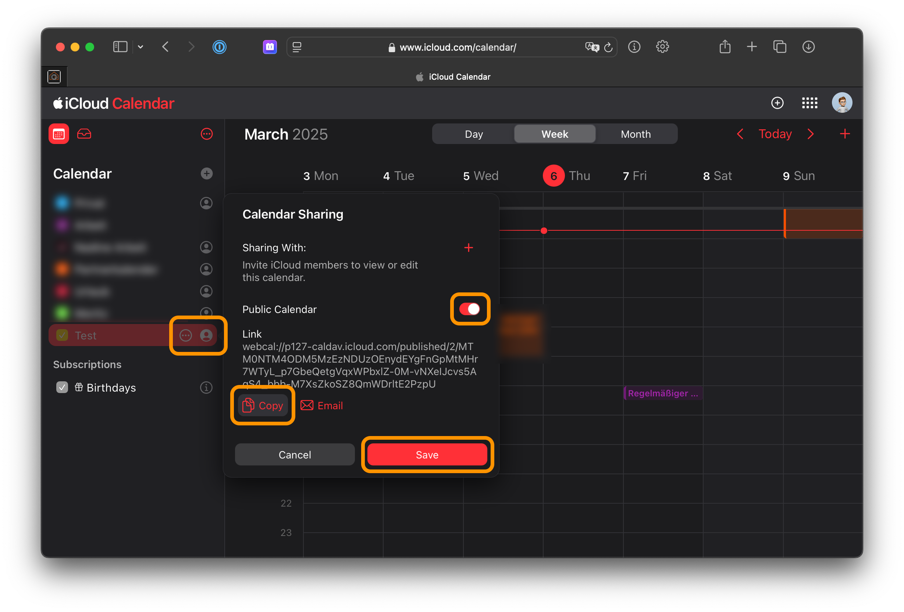

# IoBroker.生日
## 日历
您可以使用包含所有生日的 iCal 文件（HTTP URL 或本地文件的路径）。适配器搜索此文件中的所有约会。

自适配器版本 2.0.0 起支持本地文件

您的预约

1. 必须在描述中包含出生年份（例如 1987 年）
2. 一整天
3. 设置为“每年重复”

不强制使用 iCal 选项。您还可以使用其他来源来获取生日信息。 _如果您使用多个选项，信息将被合并。_

### 谷歌日历
前往 [Google 日历](http://calendar.google.com/) 并创建一个新日历。然后您输入符合条件的新约会（见上文）。然后可以在适配器中使用私有日历 URL 来访问约会。

### Synology 日历

### 苹果 iCloud 备份

