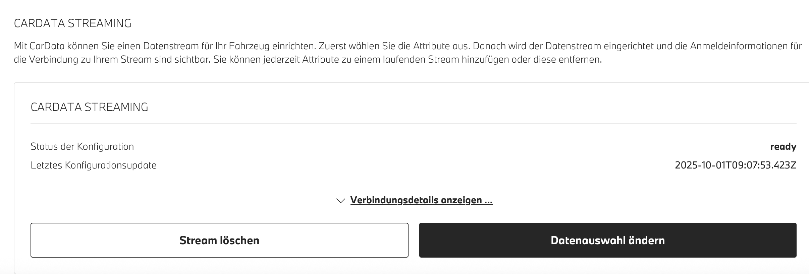

# IoBroker.bmw
## 版本
# BMW ioBroker 适配器
该适配器使用全新的 BMW CarData API，通过 OAuth2 身份验证和实时 MQTT 数据流，将 BMW 车辆集成到 ioBroker。它能为关联到您 BMW 账户的所有 BMW 车型提供全面的车辆数据监控。

## 充电时数据更新
充电时，由于车辆处于睡眠/待机状态，电池电量可能无法通过数据流更新。车辆启动后，数据将更新。您可以通过 API `bmw.0.vin.remote.fetchViaAPI` 触发更新。

## 数据点描述
您可以在此处找到详细的数据点描述[远程信息处理.json](telematic.json)

## 设置说明
### 1. BMW ConnectedDrive 门户设置
1. 访问 BMW ConnectedDrive 门户：**https://www.bmw.de/de-de/mybmw/vehicle-overview**
2. 导航至 **BMW CarData** 部分（您将看到各种服务类别）

3. 点击“创建 CarData 客户端”按钮
4.复制client_id
5.等待30秒
6. 点击 CarData API
7.等待30秒
8. 点击 CarData Streaming

# **关键**：点击一项服务，如果出现错误信息，请等待 30 秒，然后再次点击。不要点击“Gerät Authentifizieren/Devict authentication”（执行身份验证/取消身份验证）。请在 iobroker 设置中输入 client_id。
### 2. CarData 流配置
**您必须配置 CARDATA STREAMING 并选择所有 244 个数据点**

创建客户端 ID 后，配置流式传输：

1. 在 CarData 部分，查找“CARDATA STREAMING”
2. 您应该看到配置状态为**“就绪”**
3. 注意 **“Letztes Konfigurationsupdate”**（上次配置更新）时间戳

4. 单击 **“Datanauswahl ändern”**（更改数据选择）按钮
5. **选择所有类别**（车辆状态、充电、行程数据等）
6. **手动检查所有 244 个单独的数据点**
7. 或者在 Google 开发者控制台中输入此内容按 F12 `document.querySelectorAll('label.chakra-checkbox:not([data-checked])').forEach(l => l.click());`
8. 如果需要重置，请点击“Stream löschen”**保存配置，然后重新配置

**如果不选择所有数据点，MQTT 流将不会提供完整的数据！**

### 3. 适配器配置
1. 在适配器设置中输入您的**客户端 ID**
2. 输入您的**CarData Streaming 用户名**（可在 BMW 门户的 CarData > Streaming 部分找到）
3. 选择您的车辆**品牌**（宝马、Mini、丰田 Supra）
4. 设置**更新间隔**（由于 API 配额，最少 10 分钟）
5. 如果需要，配置**VIN忽略列表**

### 4. 认证流程
1.启动适配器
2.检查日志中的 OAuth2 授权 URL
3. 访问该网址并使用您的 BMW 帐户登录
4.授权应用程序
5. 授权后适配器将自动继续

数据结构
车辆数据按`bmw.0.VIN.*` 进行组织，其中`VIN` 代表您的车辆识别号码：

### 主文件夹结构
- **`bmw.0.VIN.api.*`** - API 数据（定期更新）
- 通过 .remote 通过 BMW CarData REST API 获取数据。
- 使用 API 配额（每 24 小时 50 次调用）

- **`bmw.0.VIN.stream.*`** - 流数据（实时 MQTT）
- 通过实时 MQTT 流或 remote.fetchViaAPI 接收数据
- 车辆数据发生变化时立即更新
- 包括所有 244 个配置数据点

### 可用的 API 端点（可配置）
您可以在适配器设置（BMW CarData API v1）中启用/禁用这些端点：

- `bmw.0.VIN.api.basicData.*` - 车辆信息、型号、品牌、系列✅ **（默认：启用）**
- `bmw.0.VIN.api.chargingHistory.*` - 充电会话和历史记录✅ **（默认：启用）**
- `bmw.0.VIN.api.image.*` - 用于显示的车辆图像
- `bmw.0.VIN.api.locationBasedChargingSettings.*` - 特定位置的充电偏好和设置
- `bmw.0.VIN.api.smartMaintenanceTyreDiagnosis.*` - 智能维护系统轮胎状况和诊断

### 元数据
- `bmw.0.VIN.lastStreamViaAPIUpdate` - 上次数据更新的时间戳（API）
- `bmw.0.VIN.lastStreamUpdate` - 上次 MQTT 流更新的时间戳

## 实时更新
当出现以下情况时，适配器通过 MQTT 流接收实时更新：

- 汽车未处于睡眠/待机状态
- 车辆状态变化（车门、车窗、车灯）
- 充电状态更新
- 驾驶过程中位置发生变化
- 气候控制激活
- 服务通知

## 远程命令
**可用的遥控器：**

BMW CarData API 为只读，因此此适配器不提供车辆命令功能。如需远程控制功能，请使用：

**官方宝马解决方案：**

- **MyBMW 手机应用程序** - 完整的远程控制功能
- **BMW ConnectedDrive 门户** - 基于 Web 的车辆管理
- **BMW Alexa Skill** - 与 Amazon Alexa 的语音控制集成，可执行以下命令：
- “Alexa，让宝马锁我的车”
- “Alexa，让宝马启动气候控制”
- “Alexa，让宝马闪我的车灯”

**此适配器中可用的遥控器：**

- `fetchViaAPI` - 通过容器 API 获取最新的远程信息数据
- `basicData` - 刷新车辆基本信息（型号、品牌、系列）
- `chargingHistory` - 获取过去 30 天的充电会话
- `image` - 检索当前车辆图像
- `locationBasedChargingSettings` - 获取基于位置的充电偏好
- `smartMaintenanceTyreDiagnosis` - 获取轮胎诊断数据

_注意：这些只是数据检索命令 - BMW CarData API 不支持任何车辆控制命令。_

故障排除
### 身份验证问题（400 错误请求）
如果遇到身份验证错误：

1. 验证您的客户端 ID 是否已激活 CarData API
2. 确保 CarData Streaming 已启用
3. 检查是否选择了所有 244 个数据点
4.考虑重新生成您的客户端ID

### 无 MQTT 数据
如果您没有收到实时更新：

1. 确认 CarData Streaming 已订阅并处于活动状态
2. 确保选择了所有数据描述符（244 个点）
3. 检查您的车辆是否支持 CarData 流媒体
4. 描述符配置更改后重新启动适配器

### API 配额已超出
适配器自动管理每 24 小时 50 次 API 调用的限制：

- 在适配器设置中禁用不必要的 API 端点以减少配额使用
- 如果频繁达到配额限制，请增加更新间隔
- MQTT 流不计入 API 配额并提供实时数据
- 每个启用的 API 端点每个更新间隔使用一次配额调用

### API 文件夹中缺少数据
如果您在`VIN.api.*`中没有看到预期的数据：

1.检查适配器设置中是否启用了相应的端点
2. 确认您没有超出 API 配额（检查适配器日志）
3. 某些端点可能不适用于所有车辆类型
4. 检查适配器日志中是否存在特定端点错误（404、403 等）

### 了解数据源
-**`VIN.api.*`** - 根据间隔和启用的端点定期更新
- **`VIN.stream.*`** - 当车辆数据发生变化时通过 MQTT 实时更新
- **`VIN.lastUpdate`** - 最近数据更新的时间戳（API 或 MQTT）
- **`VIN.lastStreamUpdate`** - 最近 MQTT 流更新的时间戳

＃＃ 来源
此适配器可在以下位置获取：[https://github.com/TA2k/ioBroker.bmw](https://github.com/TA2k/ioBroker.bmw)

## Changelog
### 4.3.1 (2025-10-11)

- fix gps coordinate parsing

### 4.3.0 (2025-10-09)

- improve logs
- add autocast
- add descriptions

### 4.2.0 (2025-10-04)

- improve token refresh
- fix image fetching

### 4.1.1 (2025-10-03)

- Add API fetching via Container and move other apis to manually fetching

### 4.0.5 (2025-10-01)

- **BREAKING:** Complete migration to BMW CarData API with OAuth2 Device Flow authentication
- **BREAKING:** Removed username/password authentication (deprecated by BMW)
- **BREAKING:** Removed all remote control functionality (CarData API is read-only)
- **BREAKING:** Removed second user support and CAPTCHA requirements
- **NEW:** Real-time MQTT streaming for instant vehicle data updates
- **NEW:** OAuth2 Device Code Flow authentication with PKCE
- **NEW:** API quota management system (50 calls per 24 hours)
- **NEW:** Configurable API endpoint selection to manage quota usage
- **NEW:** Organized folder structure: api/ for periodic updates, stream/ for real-time data
- **NEW:** Enhanced state management with proper object creation
- **NEW:** Modern JSON-based configuration interface (jsonConfig.json)
- **NEW:** Comprehensive setup documentation with BMW portal integration
- **FIXED:** MQTT message processing logic for correct data validation
- **FIXED:** State creation issues preventing "no existing object" errors
- **IMPROVED:** Removed unused dependencies (cookie handling, legacy auth)
- **IMPROVED:** Enhanced error handling with specific guidance for common issues

### 3.0.1 (2025-09-27)

- (hombach) change to recommended stable admin 7.6.17 (#159)
- (hombach) migrate to iobroker/eslint-config (#146)
- (hombach) fix form-data vulnerability
- (hombach) code cleanups
- (hombach) update axios
- (hombach) bump adapter-core
- (hombach) fix issues detected by repository checker (#170)
- (hombach) bump dependencies

### 3.0.0 (2025-06-10)

- BREAKING: Dropped support for Node.js 18 (#88)
- (hombach) BREAKING: Dropped support for js-controller 5 (#111)
- (hombach) BREAKING: change to admin 7.4.10 as recommended by ioBroker (#111)
- (hombach) encrypt and protect second user password - has to be reentered (#111)
- (hombach) bump dependencies

### 2.9.5 (2025-05-18)

- (hombach) update axios
- (hombach) fixing issues detected by repository checker (#88)
- (hombach) some small code cleanups/modernisations
- (hombach) add/translate description
- (hombach) update logo

### 2.9.4 (2025-02-26)

- fix for Mitbenutzer Feature

### 2.9.3 (2025-01-29)

- fix remote controls
- add Mitbenutzer Login for remote controls

### 2.9.0 (2024-11-28)

- added new remotes as switch and updated values
- added retry logic for remotes

### 2.8.4 (2024-11-21)

- improved charging session parsing
- added remote to fetch charging session from a specific month
- added raw JSON of charging session for export

### 2.8.3 (2024-11-18)

- login fixed

### 2.8.2 (2024-10-05)

- fix error getvehicles v2 failed

### 2.8.1 (2024-09-30)

- fix remote commands

### 2.7.1

- Bugfixes

### 2.5.5

- Fix login

### 2.5.0

- Fix login

### 2.4.1

- Add support for MINI and force refresh remote

### 2.3.0

- Disable v1 Endpoints

### 2.1.1

- Upgrade to statusV2 and remoteV2

### 2.0.0

- (TA2k) initial release

## License

MIT License

Copyright (c) 2021-2025 TA2k <tombox2020@gmail.com>

Permission is hereby granted, free of charge, to any person obtaining a copy
of this software and associated documentation files (the "Software"), to deal
in the Software without restriction, including without limitation the rights
to use, copy, modify, merge, publish, distribute, sublicense, and/or sell
copies of the Software, and to permit persons to whom the Software is
furnished to do so, subject to the following conditions:

The above copyright notice and this permission notice shall be included in all
copies or substantial portions of the Software.

THE SOFTWARE IS PROVIDED "AS IS", WITHOUT WARRANTY OF ANY KIND, EXPRESS OR
IMPLIED, INCLUDING BUT NOT LIMITED TO THE WARRANTIES OF MERCHANTABILITY,
FITNESS FOR A PARTICULAR PURPOSE AND NONINFRINGEMENT. IN NO EVENT SHALL THE
AUTHORS OR COPYRIGHT HOLDERS BE LIABLE FOR ANY CLAIM, DAMAGES OR OTHER
LIABILITY, WHETHER IN AN ACTION OF CONTRACT, TORT OR OTHERWISE, ARISING FROM,
OUT OF OR IN CONNECTION WITH THE SOFTWARE OR THE USE OR OTHER DEALINGS IN THE
SOFTWARE.