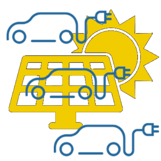

# IoBroker.chargemaster
[](https://github.com/hombach/ioBroker.chargemaster/actions/workflows/codeql-analysis.yml)

## 版本
## 哨兵
**此适配器使用 Sentry 库自动向开发人员报告异常和代码错误。** 有关更多详细信息以及如何禁用错误报告的信息，请参阅<a href="https://github.com/ioBroker/plugin-sentry#plugin-sentry">Sentry 插件文档</a>！

用于管理一个或多个使用光伏能源的电动汽车充电器的适配器
**！！！此适配器仍代表发展中状态！！！**

ChargeMaster 管理一个或多个电动汽车充电器（壁挂式充电桩），并根据您家中可用的光伏剩余能量控制其充电电流。它与壁挂式充电桩供应商无关：它不直接与硬件通信，而是读取和写入现有壁挂式充电桩适配器（例如 go-e，但任何公开所需状态的适配器均可）的 ioBroker 状态。

＃＃＃ 特征
- 可同时控制多个墙盒，同时遵守全局最大总电流限制（例如，房屋连接或墙盒供电线路的限制）。
- 每个壁挂式充电桩的**ChargeNOW**模式：以用户自定义电流立即充电，不受光伏发电量影响
- 每个壁挂式充电桩的**ChargeManager**模式：根据家庭用电量和家用电池电量，利用光伏发电盈余自动充电。
- 可配置的家用电池优先级：只有当家用电池达到可配置的充电状态时，才会开始为电动汽车充电；如果电量超过该状态，则会使用一部分家用电池电量来支持电动汽车充电。
- 平滑调节：充电电流在每个控制周期内以 1 A 的增量递增/递减，并具有滞后和延迟关断功能，以保护车辆充电器免受快速切换的影响。
- 事件驱动：立即响应用户输入（例如启用 ChargeNOW），并通过状态订阅而非轮询接收能量数据

### 工作原理
适配器运行一个控制周期（默认每 10 秒一次）。对于每个已配置的壁挂式电源插座，它会根据其模式规划一个目标电流：

1. **ChargeNOW 已启用** → 壁挂式充电桩计划使用用户自定义的 `ChargeCurrent`。
2. **启用充电管理器** → 如果家用电池的 SoC 已达到设定值（`Settings.Setpoint_HomeBatSoC`），则会根据光伏剩余电量计算最佳电流（参见[充电管理器算法](#charge-manager-algorithm)）。否则，充电桩将保持关闭状态，直到电池充满电。
3. **均未启用** → 墙盒已关闭。

之后，全局限流器会分配可用总电流（`maximum total current` 设置）：首先为 ChargeNOW 模式的壁挂式充电桩充电，剩余电流分配给 ChargeManager 模式的壁挂式充电桩。如果某个壁挂式充电桩的剩余电流低于其最小电流，则会将其完全关闭。最后，将最终电流值和充电启用命令写入已配置的壁挂式充电桩状态。

＃＃ 要求
- node.js 版本 >= 22.18，js-controller 版本 >= 6.0.11，admin 版本 >= 7.6.20
- 适用于您的壁挂式充电桩的 ioBroker 适配器，提供以下状态：设置充电电流、允许/禁止充电、当前充电功率、当前充电电流
- ioBroker 会显示您的光伏发电量（瓦）、房屋用电量（瓦）以及（如有）家用电池的荷电状态（%），例如，数据来自您的逆变器适配器。

＃＃ 配置
### 基本设置
| 设置 | 描述 |
| -------------------------------------- | ---------------------------------------------------------------------------------------------- |
| `cycle time` | 控制周期间隔，单位为毫秒（默认值为 10000）。不建议使用低于 5000 的值。 |
| `state of solar power` | 当前光伏发电量（单位：瓦特）的外国 |
| `state of home power consumption` | 当前家庭用电量（不含壁挂式充电桩功率）的国外州/省。 |
| `state of home battery state of charge`| 当前家用电池 SoC 的国外状态（以百分比表示） |
| `家庭电池电量状态`| 当前家庭电池电量（SoC）的外部状态（以百分比表示）|

### Wallbox 列表
每个墙盒增加一行：

| 栏目 | 描述 |
| ----------------------- | ------------------------------------------------------------------------ |
| `state charge current` | 外部状态，用于**写入**充电电流设定值（A）。 |
| `state active power` | 读取当前充电功率（瓦）。 |
| `state active current` | 外部状态，**读取**当前充电电流（A）。 |
| `min current` | 此壁挂式充电桩的最小充电电流（单位：安培，通常为 6 安培）。 |
| `max current` | 此壁挂式充电桩的最大充电电流，单位为安培（例如 16 安培）。 |
| `最大电流` | 此壁挂式充电桩的最大充电电流，单位为安培（例如 16 安培）。 |

适配器启动时会验证所有已配置的状态——如果某个状态不存在，适配器将记录错误并停止运行。

## 适配器创建的状态
| 状态 | 描述 |
| ---------------------------------- | ----------------------------------------------------------------------------------------------- |
| `Settings.Setpoint_HomeBatSoC` | 光伏剩余电量开始充电前的最低家用电池荷电状态百分比（可写，默认值 80）。 |
| `Settings.WB_<x>.ChargeCurrent` | ChargeNOW 模式下的充电电流（单位：安培，可写）。 |
| `Settings.WB_<x>.ChargeManager` | 启用壁挂式充电桩 `<x>`（可写）的光伏剩余电量充电功能。 |
| `Power.Charge` | 所有壁挂式充电桩的总测量充电功率（单位：瓦特）。 |
| `info.connection` | 当所有已配置的外部状态均已验证且适配器正在运行时，此值为真。 |
| `info.connection` | 当所有已配置的外部状态都已验证且适配器正在运行时，返回值为 True。 |

## 充电管理器算法
ChargeManager 模式下壁挂式充电桩的最佳充电电流计算如下：

```
batteryShare = up to 2000 W, scaling linearly from 0 at Setpoint_HomeBatSoC to 2000 W at 100% SoC
optimalCurrent = (solarPower - houseConsumption + 100 W reserve + batteryShare) / 230 V
```

计划电流随后以每个周期 1 安培的速度接近该最佳值。当计划电流超过壁挂式充电桩的最小电流加上 3 安培的滞后电流时，充电才会启用；只有当计划电流连续 15 个周期以上保持在最小电流以下时，充电才会禁用（延迟关闭，避免短时开启）。

## 注释和限制
- 功率到电流的转换假设单相充电电压为 230V。对于三相充电桩，目前计算出的剩余电流不会除以相数——可配置相数已列入计划。
- 房屋用电量不得包含壁挂式充电桩本身的电量，否则控制回路会发生振荡。
- 适配器每个周期都会将状态写入您的壁挂式充电桩 - 请确保配置的“状态充电电流”/“状态充电允许值”确实是您的壁挂式充电桩适配器的可写控制状态。

捐赠
<a href="https://www.paypal.com/donate/?hosted_button_id=H5PMQ8JKQL7SL"></a>如果你喜欢这个项目——或者只是想慷慨解囊，不妨请我喝杯啤酒。干杯！🍻

## 已测试
- 3x go-E 充电器和 Kostal PikoBA

## Changelog

<!--
  Placeholder for the next version (at the beginning of the line):
  ### **WORK IN PROGRESS**
-->
### 0.16.0 (2026-07-05)

- (HombachC) switched data acquisition from polling to event driven foreign state subscriptions, react immediately to user input
- (HombachC) fixed warnings of adapter checker
- (HombachC) repository cleanup
- (HombachC) removed unused chai/sinon-chai/chai-as-promised/proxyquire devDependencies and switch tests to node:assert
- (HombachC) fixed race condition at first start
- (HombachC) fixed wrong config default keys in io-package.json and added guard for missing maxAmpTotal
- (HombachC) moved module-global variables into adapter class to fix possible conflicts in compact mode
- (HombachC) stop state machine and reset info.connection on adapter unload
- (HombachC) await wallbox state writes with proper error handling and throttle/switch off boxes exceeding the measured total current limit
- (HombachC) fixed lost min/max/step value of 0 and duplicated unit handling in projectUtils
- (HombachC) charge manager: clamp optimal current at zero and fix division by zero with home battery setpoint of 100%
- (HombachC) validate and clamp Setpoint_HomeBatSoC state changes (NaN guard, 0-100%)
- (HombachC) improved typing: typed state getters in projectUtils instead of any, fixed wallBoxList tuple type
- (HombachC) removed yarn devDependency and switched release build hook to npm
- (HombachC) extracted charge planning and limiting algorithms into testable module and added 18 unit tests
- (HombachC) improved README with feature overview, configuration, states and algorithm documentation

### 0.15.1 (2026-06-04)

- (HombachC) fix warnings of adapter checker
- (HombachC) upgraded typescript to 6.x.x
- (HombachC) updated projectUtils
- (HombachC) updated dependencies

### 0.15.0 (2026-05-09)

- (copilot) BREAKING: adapter requires node.js >= 22 now
- (HombachC) update dependencies

### 0.14.7 (2026-04-16)

- (HombachC) min admin 7.6.20 as recommended (#762)
- (HombachC) switch to ES2023 code
- (HombachC) update dependencies

### 0.14.6 (2026-02-27)

- (HombachC) update dependencies

### Old Changes see [CHANGELOG OLD](CHANGELOG_OLD.md)

## License

MIT License

Copyright (c) 2021-2026 Christian Hombach

Permission is hereby granted, free of charge, to any person obtaining a copy
of this software and associated documentation files (the "Software"), to deal
in the Software without restriction, including without limitation the rights
to use, copy, modify, merge, publish, distribute, sublicense, and/or sell
copies of the Software, and to permit persons to whom the Software is
furnished to do so, subject to the following conditions:

The above copyright notice and this permission notice shall be included in all
copies or substantial portions of the Software.

THE SOFTWARE IS PROVIDED "AS IS", WITHOUT WARRANTY OF ANY KIND, EXPRESS OR
IMPLIED, INCLUDING BUT NOT LIMITED TO THE WARRANTIES OF MERCHANTABILITY,
FITNESS FOR A PARTICULAR PURPOSE AND NONINFRINGEMENT. IN NO EVENT SHALL THE
AUTHORS OR COPYRIGHT HOLDERS BE LIABLE FOR ANY CLAIM, DAMAGES OR OTHER
LIABILITY, WHETHER IN AN ACTION OF CONTRACT, TORT OR OTHERWISE, ARISING FROM,
OUT OF OR IN CONNECTION WITH THE SOFTWARE OR THE USE OR OTHER DEALINGS IN THE

SOFTWARE.