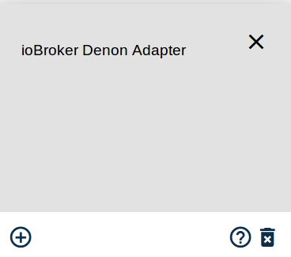
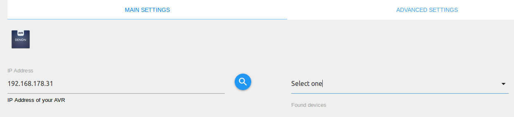
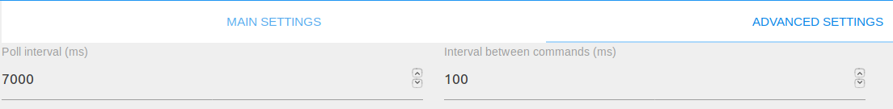

# IoBroker.denon
===========================


## 免责声明
DENON 和 Marantz 是 D&M Holdings Inc. 的商标。
本模块的开发者不受 D&M Holdings Inc. 或其任何关联子公司、徽标或商标的认可或附属。

＃＃ 安装
您可以通过 ioBroker Web 界面或通过 npm 在本地计算机上安装适配器。

### 基于浏览器
1. 在浏览器中打开您的 ioBroker 网页界面（例如：192.168.30.70:8081）
2. 单击“适配器”选项卡
3. 在过滤器中输入“天龙”
4. 单击三个点，然后单击 DENON AVR 适配器的“+”符号



###本地机器
导航到您的 iobroker 文件夹并执行以下命令：

```bash
npm i iobroker.denon
```

＃＃ 设置
除了适配器安装之外，您还必须确保正确配置了 AVR。

### IoBroker
1.在浏览器中打开你的ioBroker界面（例如：192.168.1.33:8081）
2.导航到标签“适配器”
3. 单击三个点，然后单击 DENON AVR 适配器的“+”符号


4. 现在您可以看到适配器配置页面 --> 输入您的 DENON AVR 的 ip 地址或单击搜索

图标以在您的网络中查找 AVR（通过 UPnP）

5. 如果您还想调整请求/轮询间隔，请确保单击“高级设置”选项卡。

通过减少轮询间隔，适配器将减少更新显示内容之间的时间。
通过减少请求间隔，发送命令之间的时间将减少。
默认设置应该适合大多数用户。


6. 单击保存并关闭

### AV 接收器的网络设置
1. 按 SETUP 按钮，然后菜单出现在 FL 显示器（和 GUI）上
2. 选择“网络”-->“设置”
3. 设置如下参数

   *DHCP：“ON”（当 DHCP 服务器在本地网络上时使用此设置。）*

   *IP 地址：当 <DHCP> 设置为“关闭”时，请设置 IP 地址。*

   *子网掩码：当<DHCP>设置为“关闭”时，请设置子网掩码。*

   *网关：设置网关在本地网络时的网关地址。*

   *主DNS：请勿设置此参数。*

   *第二个DNS：不要设置这个参数。*

   *代理：将此参数设置为“关闭”。*

4. 按 SETUP 按钮，然后菜单出现在 FL 显示器（和 GUI）上
5.选择“网络”-->网络控制/IP控制
6. 将此参数设置为“始终开启”。

＃＃ 用法
请注意，AVR 只能管理单个 telnet 连接。如果您有一个活动的 telnet 连接 e. G。使用 javascript 适配器，AVR 将拒绝此适配器的连接。
在这里您可以找到状态的描述以及如何使用它们。

＃＃＃ 纽扣
适配器创建以下按钮：

#### 频道：zoneMain / zone2 / zone3
* zoneMain.playPause

   *播放和暂停来自蓝牙、在线、USB/iPod 来源的音乐。*

* zoneMain.play

   *播放来自蓝牙、在线、USB/iPod 来源的音乐。*

* zoneMain.pause

   *暂停来自蓝牙、在线、USB/iPod 来源的音乐。*

* zoneMain.skipMinus

   *跳到上一个标题。*

   *不完全支持 HEOS AVR*

* zoneMain.skipPlus

   *跳到下一个标题。*

   *不完全支持 HEOS AVR*

* zoneMain.volumeDown / zone2.volumeDown / zone3.volumeDown

   *降低主区/Zone2/Zone3的音量。*

* zoneMain.volumeUp / zone2.volumeUp / zone3.volumeUp

   *增加主区/Zone2/Zone3的音量。*

* zoneMain.equalizerBassUp / zone2.equalizerBassUp / zone3.equalizerBassUp

   *增加区域低音水平的按钮。*

   *当 Dyn EQ 设置为 OFF 并且音调控制打开时，可以调整低音和高音设置*

* zoneMain.equalizerBassDown / zone2.equalizerBassDown / zone3.equalizerBassDown

   *降低区域低音电平的按钮。*

   *当 Dyn EQ 设置为 OFF 并且音调控制打开时，可以调整低音和高音设置*

* zoneMain.equalizerTrebleUp / zone2.equalizerTrebleUp / zone3.equalizerTrebleUp

   *增加区域高音水平的按钮。*

   *当 Dyn EQ 设置为 OFF 并且音调控制打开时，可以调整低音和高音设置*

* zoneMain.equalizerTrebleDown / zone2.equalizerTrebleDown / zone3.equalizerTrebleDown

   *降低区域高音电平的按钮。*

   *当 Dyn EQ 设置为 OFF 并且音调控制打开时，可以调整低音和高音设置*

#### 频道：设置
* settings.subwooferLevelDown / settings.subwooferTwoLevelDown

   *按下按钮降低低音炮音量。*

* settings.subwooferLevelUp / settings.subwooferTwoLevelUp

   *按按钮增加低音炮音量。*

* settings.containmentAmountDown

   *减少 Audyssey LFC 数量。仅当您的 AVR 支持该按钮时，才会创建该按钮。*

* settings.containmentAmountUp

   *增加 Audyssey LFC 数量。仅当您的 AVR 支持该按钮时，才会创建该按钮。*

* settings.cursorUp / settings.cursorDown / settings.cursorLeft / settings.cursorRight

   *模拟遥控器的光标按钮*

* settings.enter

   *模拟遥控器的回车键*

* settings.return

   *模拟遥控器的返回/返回按钮*

* settings.option

   *模拟遥控器的选项按钮*

* settings.info

   *模拟遥控器的信息按钮*

＃＃＃ 状态
适配器将创建以下状态：

#### 频道：信息
* info.connection

    |数据类型|权限|
    |:---:|:---:|
    |布尔值|R|

   *只读布尔指标。如果您的经纪人连接到您的 DENON AVR，则状态为真，否则为假。*

* info.friendlyName

    |数据类型|权限|
    |:---:|:---:|
    |字符串|R|

   *只读字符串。包含已连接 AVR 的友好名称。*

* info.onlinePresets

    |数据类型|权限|
    |:---:|:---:|
    |字符串|R|

*JSON 数组格式的字符串，通过 id 和频道表示当前保存的收藏夹。
每个通道的名称限制为 20 位数字。您可以通过设置 settings.savePreset 将当前频道保存到一个 id 并通过将 settings.loadPreset 设置为相关 id 来加载一个。*

#### 频道：zoneMain / zone2 / zone3
* zoneMain.volume / zone2.volume / zone3.volume

    |数据类型|权限|
    |:---:|:---:|
    |编号|读/写|

*代表 AVR 的当前主区/Zone2/Zone 3 音量的数值。您也可以在此处设置音量。
在不同的状态下，音量也以 dB 表示，例如。 G。主卷数据库*

   *范围是从 0 到 98（由于最大音量可能会更低），其中 80 = 0 dB*

   *例子：*

```javascript
setState('denon.0.zoneMain.volume', 45.5); // Sets volume of Main Zone to 45.5
```

* zoneMain.maximumVolume

    |数据类型|权限|
    |:---:|:---:|
    |编号|R|

   *代表最大可能音量的只读数字，其中 80 = 0 dB。在maximumVolumeDB 状态下，音量也以dB 为单位设置。*

* zoneMain.muteIndicator / zone2.muteIndicator / zone3.muteIndicator

    |数据类型|权限|
    |:---:|:---:|
    |布尔值|读/写|

   *布尔值，如果 Main Zone/Zone2/Zone3 静音则为真，否则为假。您可以在此状态下将 AVR 静音。*

   *例子：*

```javascript
setState('denon.0.zoneMain.muteIndicator', true); // Mutes the Main Zone of your AVR
```

* zoneMain.powerZone / zone2.powerZone / zone3.powerZone

    |数据类型|权限|
    |:---:|:---:|
    |布尔值|读/写|

   *布尔值，如果Zone打开则为真，否则为假。您可以在此状态下打开和关闭 AVR/Zone。*

* zoneMain.selectInput / zone2.selectInput / zone3.selectInput

    |数据类型|权限|
    |:---:|:---:|
    |字符串|读/写|

   *字符串值包含当前输入源。您还可以使用以下编码设置输入源：*

   *0：唱机*

   *1：CD*

   *2：调谐器*

   *3：DVD*

   *4：BD*

   *5：电视*

   *6：SAT/CBL*

   *7：播放*

   *8：游戏*

   *9：网络*

   *10: 斑点*

   *11：LASTFM*

   *12：无线电*

   *13：服务器*

   *14：收藏夹*

   *15：AUX1*

   *16：AUX2*

   *17：AUX3*

   *18：AUX4*

   *19：AUX5*

   *20：AUX6*

   *21：AUX7*

   *22：BT*

   *23：USB*

*请注意，并非每个 AVR 型号都提供所有输入源。如果您的 AVR 有其他输入，一旦检测到它们，它们将被附加到列表中。*

   *例子：*

```javascript
 setState('denon.0.zoneMain.selectInput', '5'); // Selects TV as input for Main Zone
```

* zoneMain.quickSelect / zone2.quickSelect / zone3.quickSelect

   |数据类型|权限|
   |:---:|:---:|
   |编号|读/写|

   *模拟遥控器的快速选择按钮，主区域/区域 2/区域 3 的数字从 1 到 5。*

* zoneMain.sleepTimer / zone2.sleepTimer / zone3.sleepTimer

    |数据类型|权限|
    |:---:|:---:|
    |编号|读/写|

   *数值读取和设置所选区域的睡眠定时器。该值将在 10 秒内更新。*

* zoneMain.iconURL

    |数据类型|权限|
    |:---:|:---:|
    |字符串|R|

   *包含一个链接，您可以在其中找到当前播放的频道/歌曲的封面。*

   *不支持 HEOS AVR*

* zoneMain.equalizerBass / zone2.equalizerBass / zone3.equalizerBass

    |数据类型|权限|
    |:---:|:---:|
    |编号|读/写|

   *代表区域低音电平的数值。值范围为 -6 至 +6 dB。*

   *当 Dyn EQ 设置为 OFF 并且音调控制打开时，可以调整低音和高音设置*

* zoneMain.equalizerTreble / zone2.equalizerTreble / zone3.equalizerTreble

    |数据类型|权限|
    |:---:|:---:|
    |编号|读/写|

   *代表区域高音级别的数字值。值范围为 -6 至 +6 dB。*

   *当 Dyn EQ 设置为 OFF 并且音调控制打开时，可以调整低音和高音设置*

* zoneMain.channelVolumeFrontLeft / zone2.channelVolumeFrontLeft / zone3.channelVolumeFrontLeft / ...

   |数据类型|权限|
   |:---:|:---:|
   |编号|读/写|

*代表每个扬声器当前声道音量的数值。每个扬声器都有一个单独的状态。这些设置会影响当前的选择输入模式。状态可在 -12 dB 至 +12 dB 之间调整。*

#### 频道：显示
* display.displayContent

    |数据类型|权限|
    |:---:|:---:|
    |字符串|R|

   *包含 AVR 显示内容的只读字符串。它有九个状态 0 - 9.*

   *HEOS AVR 不支持显示内容*

* 显示亮度

    |数据类型|权限|
    |:---:|:---:|
    |字符串|读/写|

   *代表显示亮度的字符串值。该值还可以通过以下编码设置显示亮度：*

   *0：关闭 --> 关闭显示*

   *1: 暗 --> 显示暗*

   *2: 变暗 --> 显示变暗*

   *3: 亮 --> 显示亮*

   *例子：*

```javascript
setState('denon.0.display.brightness', '3'); // Sets display brightness to "Bright"
```

#### 频道：设置
* settings.powerSystem

    |数据类型|权限|
    |:---:|:---:|
    |布尔值|读/写|

   *布尔值，如果 AVR 开启，则为真，否则为假。您还可以在此状态下打开和关闭 AVR。*

* settings.surroundMode

    |数据类型|权限|
    |:---:|:---:|
    |字符串|读/写|

   *字符串值包含当前的环绕声模式。您还可以使用以下编码更改源：*

   *0：立体声*

   *1：虚拟*

   *2：视频游戏*

   *3：MCH立体声*

   *4：DTS环绕*

   *5：杜比数字*

   *6：电影*

   *7：音乐*

   *8：直接*

   *9：纯直接*

   *10：自动*

   *11：游戏*

   *12：AURO3D*

   *13：AURO2DSURR*

   *14：宽屏*

   *15：超级体育场*

   *16：摇滚竞技场*

   *17：爵士俱乐部*

   *18：经典音乐会*

   *19：单声道电影*

   *20：矩阵*

   *请注意，并非所有环绕声模式都适用于每个 AVR 型号。*

   *例子：*

```javascript
setState('denon.0.settings.surroundMode', '3'); // Sets Multi Channel Stereo as surround mode
```

* settings.lfeAmount

    |数据类型|权限|
    |:---:|:---:|
    |编号|读/写|

*附加到扬声器的低音炮信号量（以 dB 为单位）。
范围从 0 dB 到 -10 dB。其中 10 = -10 dB。*

* settings.expert 命令

    |数据类型|权限|
    |:---:|:---:|
    |字符串|读/写|

   *您可以在此状态下发送您自己的自定义命令。您可以在 [AVR-Control-Protocol.pdf](docs/AVR-Control-Protocol.pdf)* 中找到有关现有命令的概述

   *例子：*

```javascript
setState('denon.0.settings.expertCommand', 'ECOON'); // Turns Main Zone ECO mode on
```

* settings.expertReadingPattern

    |数据类型|权限|
    |:---:|:---:|
    |字符串|读/写|

*如果您想获得存储在 `settings.expertReadingResult` 中的特定答案，您必须将 RegEx 设置为此状态。
必须设置 RegEx，以便 RegEx 构造函数可以使用它。建议使用 [正则表达式测试器](https://regexr.com/)。
不要在 RegEx 的开头或结尾设置 `/`。*

    *例子：*

```javascript
setState('denon.0.settings.expertReadingPattern', '(MV.+)|(SSINFAISFSV.+)');

ttings.expertReadingResult

|Data type|Permission|
|:---:|:---:|
|string|R|

*Incoming data, which matches the RegEx of `settings.expertReadingPattern` will be set to this state.*


ttings.dialogControl

|Data type|Permission|
|:---:|:---:|
|number|R/W|

*The dialog control, which can be operated from 0 dB to 6 dB.*

ttings.dialogLevelAdjust

|Data type|Permission|
|:---:|:---:|
|boolean|R/W|

*Turns the dialog level adjustment on, which allows to modify the dialog volume of DTS content.*

ttings.dialogLevel

|Data type|Permission|
|:---:|:---:|
|boolean|R/W|

*If dialog level adjustment is turned on you can modify the dialog volume of DTS content between -12 dB and +12 dB.*

ttings.outputMonitor

|Data type|Permission|
|:---:|:---:|
|string|R/W|

Select the output monitor of your AVR. This state will only be created if your AVR supports two HDMI outputs. You can switch the state between:*

0: AUTO --> Auto detection of monitor*

1: 1 --> Outputs signal to monitor 1*

2: 2 --> Outputs signal to monitor 2*

Example:*

``javascript
etState('denon.0.settings.outputMonitor', '2'); // Sets monitor 2 as active monitor
``

* settings.videoProcessingMode

    |数据类型|权限|
    |:---:|:---:|
    |字符串|读/写|

   *选择您的 AVR 的视频处理模式。只有在您的 AVR 支持时才会创建此状态。您可以在以下状态之间切换：*

   *0：自动*

   *1：游戏*

   *2：电影*

   *例子：*

```javascript
setState('denon.0.settings.videoProcessingMode', '2'); // Sets Video Processing Mode to "MOVIE"
```

* settings.centerSpread

    |数据类型|权限|
    |:---:|:---:|
    |布尔值|读/写|

   *布尔值，如果中心展开被调整为真，否则为假。您还可以在此状态下打开/关闭中心传播。*

* settings.dynamicEq

    |数据类型|权限|
    |:---:|:---:|
    |布尔值|读/写|

   *代表动态均衡器状态的布尔值。您还可以在此状态下打开和关闭动态均衡器。*

* settings.subwooferLevelState

    |数据类型|权限|
    |:---:|:---:|
    |布尔值|读/写|

   *布尔值，如果为真，您可以在低音炮级别上进行更改。*

* settings.subwooferLevel / settings.subwooferTwoLevel

    |数据类型|权限|
    |:---:|:---:|
    |编号|读/写|

*表示当前低音炮电平的数值。该值的范围从 -12 到 12（-12 dB 到 +12 dB）。
只有在您的 AVR 支持时才会创建 SubwooferTwoLevel 状态。*

* settings.audysseyLfc

    |数据类型|权限|
    |:---:|:---:|
    |布尔值|读/写|

*布尔值，包含并能够控制 Audyssey 低频遏制状态（开/关）。
只有在您的 AVR 支持的情况下才会创建状态。*

* settings.containmentAmount

    |数据类型|权限|
    |:---:|:---:|
    |编号|读/写|

*用于设置低频抑制量的数值。该值可以在 1 到 7 之间。只有在您的 AVR 支持时才会创建状态。*

* settings.multEq

    |数据类型|权限|
    |:---:|:---:|
    |字符串|读/写|

   *字符串值，使用以下编码设置您的AVR的MultEQ功能：*

   *0：关闭*

   *1：奥德赛*

   *2：BYP.LR*

   *3：平面*

   *4：手册*

* settings.dynamicVolume

    |数据类型|权限|
    |:---:|:---:|
    |字符串|读/写|

   *通过以下编码选择动态音量的字符串值：*

   *0：关闭 --> 关闭动态音量*

   *1: LIT --> 将动态音量调亮*

   *2: MED --> 将动态音量调至中等*

   *3：HEV --> 将动态音量调大*

* settings.referenceLevelOffset

    |数据类型|权限|
    |:---:|:---:|
    |字符串|读/写|

   *通过以下编码选择参考电平偏移的字符串值：*

   *0：0 分贝*

   *5：5 分贝*

   *10：10 分贝*

   *15：15 分贝*

   *例子：*

```javascript
setState('denon.0.settings.referenceLevelOffset', '5'); // Sets Reference Level Offset to 5 dB
```

* settings.pictureMode

    |数据类型|权限|
    |:---:|:---:|
    |字符串|读/写|

   *用于设置图片模式直接更改的字符串值。仅当您的 AVR 支持时才会创建此状态*

   *您可以将以下值设置为字符串：*

   *'离开'*

   *'标准'*

   *'电影'*

   *'生动'*

   *'溪流'*

   *'风俗'*

   *'ISF 日'*

   *'ISF 之夜'*

   *例子：*

```javascript
setState('denon.0.settings.pictureMode', 'Standard'); // Set Picture Mode Direct Change to Standard
```

* settings.toneControl

    |数据类型|权限|
    |:---:|:---:|
    |布尔值|读/写|

   *布尔值，表示音调控制状态。您可以在此状态下关闭/打开它。*

   *音调控制只能在 Dyn EQ 设置为 OFF 时打开*

* settings.setupMenu

    |数据类型|权限|
    |:---:|:---:|
    |布尔值|读/写|

   *布尔指示器，指示设置菜单当前是打开还是关闭。您可以在此状态下打开和关闭它。 *

* settings.savePreset

    |数据类型|权限|
    |:---:|:---:|
    |编号|读/写|

*数字值，可以设置为 info.onlinePresets 的值。然后当前频道将保存为给定编号的预设。
只能使用 info.onlinePresets 中包含的数字。无论命令是否成功，状态都不会得到确认。您可以检查 info.onlinePresets 以检查该命令是否按方面运行。*

* settings.loadPreset

    |数据类型|权限|
    |:---:|:---:|
    |编号|读/写|

*数字值，可以设置为 info.onlinePresets 的值。这将加载相关频道。
无论命令是否成功，此状态都不会得到确认。 *

### 其他州
由于某些 AVR（如 DENON POA-3012CI）使用另一种逻辑，因此状态存在一些差异。
与上面列出的状态相同的状态是：settings.powerSystem、settings.expertCommand、display.brightness 和 info.connection。为每个区域 2-12（偶数）创建了以下附加状态：

* zoneX.speakerOneVolume / zoneX.speakerTwoVolume

    |数据类型|权限|
    |:---:|:---:|
    |编号|读/写|

*数值，代表AVR扬声器的音量。如果 operationMode 设置为“BRIDGED”，则扬声器无法独立控制，一个的控制也会控制另一个的音量。 *

* zoneX.selectInputOne / zoneX.selectInputTwo

    |数据类型|权限|
    |:---:|:---:|
    |字符串|读/写|

*键值对，代表AVR扬声器的选定输入。如果 operationMode 设置为“BRIDGED”，则扬声器不能独立控制，一个的控制也控制另一个的输入。 *

    *以下值是可能的：*

    *'0': 'BUS L'*

    *'1': 'BUS R'*

    *'2': 'BUS M'*

    *'3'：'辅助'*

* zoneX.operationMode

    |数据类型|权限|
    |:---:|:---:|
    |字符串|读/写|

*键值对，代表AVR的操作模式。如果 operationMode 设置为“BRIDGED”，则扬声器无法独立控制，控制扬声器一也控制扬声器二。 *

    *以下值是可能的：*

    *'0'：'正常'*

    *'1'：'桥接'*

* zoneX.lowCutFilterSpeakerOne / zoneX.lowCutFilterSpeakerTwo

    |数据类型|权限|
    |:---:|:---:|
    |布尔值|读/写|

*布尔值，指示扬声器的低切滤波器是启用还是禁用。在桥接模式下，两个扬声器将相互依赖。*

* zoneX.zoneTurnOnModeChange

    |数据类型|权限|
    |:---:|:---:|
    |字符串|读/写|

*键值对，代表该区域的区域开启模式变化。您还可以在此状态下控制您的 AVR。*

    *以下值是可能的：*

    *'0'：'常数'*

    *'1': '触发'*

    *'2': '音频信号'*

    *'3'：'关闭'*

* zoneX.triggerInput

    |数据类型|权限|
    |:---:|:---:|
    |布尔值|读/写|

    *使用此布尔值打开或关闭触发器输入。*

* zoneX.audioSignalInput

    |数据类型|权限|
    |:---:|:---:|
    |布尔值|读/写|

    *指示和控制 AVR 音频信号输入的布尔值。*

## 缺少功能和错误
如果您缺少任何功能或检测到错误，请打开 [问题](https://github.com/foxriver76/ioBroker.denon/issues)。

该适配器使用 DENON AVR-X1200W 和 Marantz SR5009 进行测试。

## Changelog
<!--
	Placeholder for the next version (at the beginning of the line):
	### __WORK IN PROGRESS__
-->

### 1.11.0 (2021-06-06)
* (foxriver76) implemented dialog level adjustment for DTS content (closes #143)
* (foxriver76) new datapoints are `settings.dialogLevelAdjust`, `settings.dialogLevel`, `settings.dialogControl`

### 1.10.7 (2021-05-12)
* (foxriver76) fix missing conversion to db on equalizer states for additional zones (fixes #137)

### 1.10.6 (2021-05-03)
* (foxriver76) we fixed some more types

### 1.10.5 (2021-05-02)
* (foxriver76) we fixed some datapoints having wrong types or wrong state values set (fixes #130)

### 1.10.4 (2021-02-20)
* (foxriver76) if an older model (e.g. AVR 3808) just sends `NSE`, we do not set displayContent state anymore (fixes #112)

### 1.10.3 (2021-01-28)
* (foxriver76) don't poll whole online presets after change, it is unnecessary load

### 1.10.2 (2021-01-28)
* (foxriver76) return after detecting NSH command
* (foxriver76) use release script

### 1.10.0 (2021-01-17)
* (foxriver76) auto-detect selectInput of all zones

### 1.9.4 (2021-01-03)
* (foxriver76) added missing rear height speaker states
* (foxriver76) revert the last added options because they are not working as intended
* (foxriver76) no longer remove digits and spaces from surroundMode response

### 1.9.2 (2021-01-03)
* (foxriver76) added some missing options for surroundMode

### 1.9.1 (2020-12-03)
* (foxriver76) prevent writing in destroyed socket on adapter unload
* (foxriver76) add subwoofer states for main zone
* (foxriver76) internal optimizations

### 1.8.1 (2020-11-29)
* (foxriver76) added states for atmos speakers `channelVolumeSurroundDolbyRight/Left` and `channelVolumeFrontDolbyLeft/Right`
* (foxriver76) fixed bug with setting channelVolume of other zones than main
* (foxriver76) added states `channelVolumeFrontHeightRight/Left` and `channelVolumeSurroundHeightLeft/Right`

### 1.7.7 (2020-04-28)
* (foxriver76) fixed timing issue which could lead to state creation procedure triggered more than once

### 1.7.5 (2020-04-21)
* (foxriver76) better error handling

### 1.7.4 (2020-04-01)
* (foxriver76) fix potential timeout issues

### 1.7.2 (2020-01-08)
* (foxriver76) another fix for DENON Picool to keep connection alive when turned off

### 1.7.1 (2019-11-19)
* (foxriver76) added ability to read desired data by expertReading states

### 1.6.1 (2019-10-08)
* (foxriver76) fixed bug with selectInput for zone2 and 3

### 1.6.0
* (foxriver76) added new state settings.lfeAmount

### 1.5.1
* (foxriver76) fix to detect DENON Ceol

### 1.5.0
* (foxriver76) added channel volumes for zone2 + 3
* (foxriver76) other optimizations
* (foxriver76) support of DENON POA-3012CI and similar AVRs
* (foxriver76) create db volumes everytime

### 1.3.2
* (foxriver76) compact mode compatibility added

### 1.2.7
* (foxriver76) make sure states are never set before creation
* (foxriver76) minor fixes and improvements

### 1.2.6
* (foxriver76) only updating sleep timer and quick select on change
* (foxriver76) using promises wherever possible
* (foxriver76) minor improvements

### 1.2.4
* (foxriver76) fix verbose logging on network issues
* (foxriver76) as long as connection error stays the same, logging happens on debug

### 1.2.3
* (foxriver76) add missing usb to selectInput for all zones

### 1.2.2
* (foxriver76) use adapter core

### 1.2.1
* (foxriver76) info.onlinePresets converted to JSON array to work properly with widgets

### 1.2.0
* (foxriver76) added info.onlinePresets which is a JSON string containing all presets
* (foxriver76) settings.savePreset and loadPreset to save and load presets according to the info.onlinePresets

### 1.1.0
* (foxriver76) added Bluetooth as select input (BT)

### 1.0.0
* (foxriver76) formal version increment

### 0.6.0
* (foxriver76) fix that enables Marantz receiver to use the quickSelect functionality
* (foxriver76) quick select is now acknoledged
* (foxriver76) remove old quick select buttons

### 0.5.0
* (foxriver76) added possibility to control channelVolume per speaker for Main Zone
* (foxriver76) new states added to readme and documentation

### 0.4.4
* (foxriver76) fix bug where picture mode command was sent as undefined

### 0.4.3
* (foxriver76) fallback for advanced settings
* (foxriver76) fix double reconnection when AVR closes the socket
* (foxriver76) fix a problem where callback for pictureMode is called to early

### 0.4.2
* (foxriver76) pictureMode role fixed

### 0.4.1
* (foxriver76) added picture mode direct change

### 0.3.9
* (foxriver76) only create containment amount, audyssey lfc, subwoofer two level if supproted
* (foxriver76) readme updated

### 0.3.8
* (foxriver76) add state to control center spread
* (foxriver76) readme updated
* (foxriver76) addded video processing mode control
* (foxriver76) optimizations and minor fixes

### 0.3.7
* (foxriver76) minor code optimization
* (foxriver76) fixes on readme
* (foxriver76) logging undhandled commands on debug

### 0.3.6
* (foxriver76) fixed displayState non-readable chars for old AVRs
* (foxriver76) fixes on readme
* (foxriver76) capital chars in mainZone volumeUp/down names, are now lowercase

### 0.3.5
* (foxriver76) removed isPlaying state, because not working properly
* (foxriver76) update readme

### 0.3.4
* (foxriver76) fix that HEOS does not create http and display content related states

### 0.3.3
* (foxriver76) added state for setup button
* (foxriver76) added cursors and remote control buttons
* (foxriver76) readme update

### 0.3.2
* (foxriver76) Added isPlaying state for non-HEOS AVR's, thanks to bluefox
* (foxriver76) Added link to cover for non-HEOS AVR's
* (foxriver76) displayContent, isPlaying, coverURL will only be generated for non-HEOS
* (foxriver76) Updated readme

### 0.3.1
* (foxriver76) Added placeholder ip in config gui
* (foxriver76) fixed volume in db for main zone

### 0.3.0
* (bluefox & foxriver76) Names and roles were refactored
* (bluefox) Discovery added
* (foxriver76) Update Readme
* (foxriver76) Implemented separate Play & Pause button
* (bluefox & foxriver76) Internal improvements

### 0.2.4
* (foxriver76) prevent adapter from doing more than one reconnect attempt at the same time
* (foxriver76) improved stability
* (foxriver76) update readme

### 0.2.3
* (foxriver76) added possibility to handle states in dB additional
* (foxriver76) minor changes

### 0.2.2
* (foxriver76) removed unneeded files
* (foxriver76) state lists are now of type string due to better compatibility
* (foxriver76) optimized matching for state lists
* (foxriver76) some state lists can be set by the value additionaly to the key

### 0.2.1
* (foxriver76) small bug fixes on connection error handling
* (foxriver76) improvements on module size

### 0.2.0
* (foxriver76) preparations for offical repository

### 0.1.9
* (foxriver76) improved stability
* (foxriver76) improved fault tolerance on volume (e. g. for use as smart device)

### 0.1.8
* (foxriver76) adapter sepcific connection error handling
* (foxriver76) minor reconnect fix

### 0.1.7
* (foxriver76) subwoofer level is now in dB
* (foxriver76) added control of treble, bass and tone control state
* (foxriver76) readme updated

### 0.1.6
* (foxriver76) connection stability improvements
* (foxriver76) some parameter settings added
* (foxriver76) readme updated

### 0.1.5
* (foxriver76) sleep timer for every zone
* (foxriver76) admin2 compatibility
* (foxriver76) minor fixes

### 0.1.4
* (foxriver76) HEOS bug fix (timeout)
* (foxriver76) new state for custom commands (expertCommand)
* (foxriver76) enhanced readme

### 0.1.3
* (foxriver76) bug fixes for Zone3
* (foxriver76) new state for main zone power
* (foxriver76) minor other improvements

### 0.1.2
* (foxriver76) Performance optimization
* (foxriver76) Faster display update
* (foxriver76) More appropriate reconnect intervall

### 0.1.1
* (foxriver76) new readme for npm

### 0.1.0
* (foxriver76) handling up to three zones
* (foxriver76) handling display content
* (foxriver76) setting display brightness

### 0.0.1
* (foxriver76) initial release

## License
The MIT License (MIT)

Copyright (c) 2018-2021 Moritz Heusinger <moritz.heusinger@gmail.com>

Permission is hereby granted, free of charge, to any person obtaining a copy
of this software and associated documentation files (the "Software"), to deal
in the Software without restriction, including without limitation the rights
to use, copy, modify, merge, publish, distribute, sublicense, and/or sell
copies of the Software, and to permit persons to whom the Software is
furnished to do so, subject to the following conditions:

The above copyright notice and this permission notice shall be included in
all copies or substantial portions of the Software.

THE SOFTWARE IS PROVIDED "AS IS", WITHOUT WARRANTY OF ANY KIND, EXPRESS OR
IMPLIED, INCLUDING BUT NOT LIMITED TO THE WARRANTIES OF MERCHANTABILITY,
FITNESS FOR A PARTICULAR PURPOSE AND NONINFRINGEMENT. IN NO EVENT SHALL THE
AUTHORS OR COPYRIGHT HOLDERS BE LIABLE FOR ANY CLAIM, DAMAGES OR OTHER
LIABILITY, WHETHER IN AN ACTION OF CONTRACT, TORT OR OTHERWISE, ARISING FROM,
OUT OF OR IN CONNECTION WITH THE SOFTWARE OR THE USE OR OTHER DEALINGS IN
THE SOFTWARE.