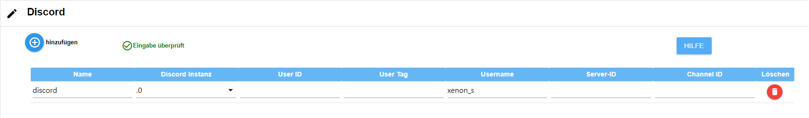

# IoBroker.设备提醒

## 需要德语自述文件吗？  [德语自述](https://github.com/Xenon-s/ioBroker.device-reminder/blob/master/README_GER.md)
 

# 监控设备状态的适配器版本
该适配器可以通过测量插座检测设备是否处于开启、运行或关闭状态，并做出反应。然后，可以通过 Telegram、Whatsapp、Alexa、Sayit、Pushover 和电子邮件自动发送消息（每个设备可多选）。该适配器还可以在处理完成后自动关闭插座（也可延时关闭）。在给定的运行时间内，可以为每个数据点输出警报（使用外部脚本，数据点仅提供 true/false 或以 vis 中的显示形式显示）。为此，只需在数据点“device-reminder.X.XXX.config.runtime max”中输入以分钟为单位的预门控时间即可。

# 应该考虑什么？
大多数设备的“实时功耗值（称为“能量”）”的刷新间隔不应超过 10 秒，否则会导致消息延迟。适配器本身每 10 秒轮询一次这些值，并根据事件使用新值。这可以节省系统 Tasmota 控制台中的命令：TelePeriod 10

# 每台设备可以实现什么功能？
- 设备启动时通知
- 相应设备运行结束时的通知
- 电报通知（可以使用多个 ID）
- Alexa 通知（可以使用多个 ID）
- WhatsApp 通知（可以使用多个 ID）
- Pushover 通知（可以使用多个 ID）
- 电子邮件通知（可以使用多个 ID）
- 信号通知（可以使用多个ID）
- 矩阵通知（可能有多个 ID）
- 通知可以自由创建，也可以由外部脚本指定
- 具有当前状态、实时消耗和最后发送的状态消息的数据点，以便在其他脚本中使用此适配器的值
- 如果检测到过程完成，设备可以按需关闭（也可以延时关闭）
- 语音助手可以根据数据点暂时禁用
- 以分钟为单位的运行时监控：如果超出时间，则会向所有选定的信使发送警报

＃ 操作说明
## 提前了解一些基本事项
每组设备（例如 Alexa）都有一个“检查输入”按钮。点击此按钮后，系统会检查现有条目的合理性，并立即显示所有条目是否正确。如果您进行了更改，请务必点击此按钮！此按钮出现时，请务必点击！   第 1 节

## 创建设备

- **设备名称**：可自由选择的名称
- **设备类型**：在这里您必须选择它是哪种设备，以便适配器中的计算能够正确执行
- **消耗**：点击带有三个白点的按钮，即可打开对象管理。您需要选择显示**当前实时消耗**的数据点。
- **开关**：点击带有三个白点的按钮即可打开对象管理。您必须选择用于开关**插座**的数据点（非强制）。如果未选择，则无法自动关闭。
- **启动文本**：设备启动时应发送的通知（也可以是特殊字符）
- 结束文本\*\*：设备完成操作时发送的通知（也可以是特殊字符）

在**Starttext**和**Endtext**处，您还可以从外部数据点获取消息。该消息在设备状态发生变化后，从数据点延迟1秒读取。因此，您可以从外部脚本获取消息。适配器会自动检测消息是来自数据点还是手动输入的。要选择数据点，只需点击带有三个白点的按钮，然后选择相应的数据点即可。**请注意**：只能使用数据点**或**手动输入的消息！ 

# 配置设备

- **active**：默认启用。您可以在此处暂时停用设备，使其不再发送通知。
- 设备\*\*：将自动创建
- **Alexa**：所有之前创建的 Alexa 都列在这里，可以通过点击添加
- **sayit**：所有之前创建的 sayit 设备都列在这里，可以通过点击添加
- **telegram**：所有之前创建的电报用户都列在这里，可以通过点击添加
- **whatsapp**：所有之前创建的 whatsapp 用户都将列在这里，点击即可添加
- **pushover**：所有之前创建的 pushover 用户都列在这里，可以通过点击添加
- **电子邮件**：所有之前创建的电子邮件用户都将列在这里，可以通过单击来添加
- **信号**：所有之前创建的信号用户都列在这里，可以通过点击添加
- **矩阵**：所有先前创建的矩阵用户都列在这里，可以通过单击来添加
- **关闭延迟**：您可以在此处选择输入以**分钟**为单位的超时时间。超时后，插座将关闭（如果已激活自动关闭功能）。设备的结束通知不受超时影响！仅当“设备”下也已设置关闭数据点时才可使用。
- **取消检测**：如果激活，适配器会尝试检测设备是否在通知之前已经手动关闭，然后不再通知。

单击“保存并关闭”后，现在将在“对象”->“设备提醒”下为每个新创建的设备创建一个文件夹，其中

- 请勿打扰（如果激活，则不会通过**语音提醒**发送任何消息）
- 最大运行时间
- 设备的当前状态
- 运行时警报
- 平均消耗量（可用作确定您自己的阈值的辅助手段）
- 最后以 JSON 格式运行
- 上次运行时间（hh:mm:ss）
- 当前直播消费
- 给信使的信息
- 当前运行时间（hh:mm:ss）
- 当前运行时间（以毫秒为单位）

将显示。 

## 测试按钮

每个 Messenger 中都有一个测试按钮。点击此按钮后，会向相应的 Messenger 发送一条测试消息。如果没有收到消息，请检查配置。适配器本身不会检查消息是否已到达！

## 如果未自动显示保存按钮，则显示保存按钮

由于保存按钮偶尔会不显示，因此我们添加了一个按钮来强制显示。点击后，保存按钮就会显示。但是，由于适配器不会检查输入，因此保存操作的风险由您自行承担！适配器可能会崩溃或配置数据丢失。

## 创建 Alexa

- **名称**：可自由选择的名称，也可以使用特殊字符。
- alexa2/../announcement'/'speak'\*\*：在这里，您需要选择允许 Alexa 发声的数据点。要选择数据点，只需点击带有三个小白点的按钮即可。
- **音量 0-100**：Alexa 说话的音量（从 0 到 100%）。

最后两个字段可用于设置允许 Alexa 进行语音输出的时间段。默认情况下，该时间段有效时间为 00:00 - 23:59。

- **生效时间**：通知期的开始时间
- **有效期至**：通知期的结束时间

## 创建 SayIt 设备

- **名称**：可自由选择的名称，也可以使用特殊字符。
- **'sayit/../text'**：在相应的 sayIt 设备文件夹中选择数据点“text”。文本输出将在此处发送。
- **volume 0-100**：您的 sayit 设备应发出的音量（从 0 到 100%）
- **生效时间**：通知期的开始时间
- **非活跃时间**：通知期的结束时间

## 创建 pushover 用户

- **名称**：可自由选择的名称，也可以使用特殊字符。
- **Pushover 实例**：要发送消息的实例
- **主题**：邮件的可选主题
- **设备 ID**：可选，消息应发送到该设备 ID
- **优先级**：发送的优先级
- **声音**：Pushover 收到消息时播放的声音
- **TTL**：删除消息的持续时间（秒）

## 创建电子邮件用户

- **名称**：可自由选择的名称，也可以使用特殊字符。
- **发件人地址**：发送电子邮件的电子邮件地址
- **接收者地址**：接收邮件的邮箱地址

## 创建信号用户

- **名称**：可自由选择的名称，也可以使用特殊字符。
- **信号实例**：要发送到的已安装实例

## 创建电报用户

- **名称**：可自由选择的名称，也可以使用特殊字符。
- **Telegram 实例**：要发送到的已安装实例
- **选择用户名/名字/聊天ID**：选择发送消息给用户名、名字还是聊天ID（推荐）。数据存储在Telegram实例中。如果输入了错误的聊天ID，则消息将发送到群组。
- **输入用户名或名字或聊天ID**：根据选择的内容输入用户名、名字或聊天ID

## 创建 whatsapp 用户

- **名称**：可自由选择的名称，也可以使用特殊字符。
- **'whatsapp-cmb/../sendMessage'**：应向其发送消息的 Whatsapp 适配器的数据点。

## 创建 discord 用户

- **名称**：可自由选择的名称，也可以使用特殊字符。
- **Discord 实例**：要发送到的已安装实例。
- **用户 ID**: Discord 用户 ID
- **聊天标签**：Discord 用户标签
- **聊天名称**：Discord 用户名（**必填字段**）
- **服务器 ID**：Discord 服务器 ID
- **频道 ID**：Discord 频道 ID

# 默认设备
 这些数值是在数月的时间里，在众多测试人员的帮助下确定的。数值的变更可能会导致设备无法正确记录，从而产生错误的报告。

# 自定义设备
 这些值可以由用户自定义并使用。具体解释如下：

- **阈值“启动”（瓦特）**：设备被识别为启动时必须超过的瓦特启动值。
- **阈值‘结束’（瓦特）**：必须低于该值（以瓦特为单位）才能将设备识别为终止。
- **待机阈值（瓦特）**：指示设备处于“关闭”或“待机”状态的阈值。如果当前计算值低于**待机**阈值，则设备被识别为已关闭。
- **起始值数量**：指定“起始值”必须**连续**超过的次数。低于此值一次将导致启动中止。这些值的平均值必须高于起始值，设备才能被识别为已启动。 

_示例：该值应为 10W，并连续 3 次超过该值。1. 15W、2. 1W、15W => 启动阶段被中止，因为第二个值低于 10。_。

- **最终值数量**：指定在计算设备是否准备就绪之前需要记录多少个值。此处的值越少，结果越不准确，误报的风险也越大。值越高，记录越准确。缺点是完成消息的发送延迟较大。仅当达到“最终值数量”且平均功耗低于“‘结束’阈值（瓦特）”时，才会检测到结束。

_简短示例计算：_每 10 秒获取一次功耗值。**阈值“结束”（瓦特）**设置为 50，**结束值数量**设置为 100。设备被识别为启动后，将记录 100 个值（_耗时 100 个值 x 10 秒 = 1000 秒_），然后计算平均值。如果平均值低于 50，则在约 16.5 分钟后（我们记住**结束值数量** = 100 个值）会识别为**已完成**，并发出一条消息（如果已配置）。如果值高于 50，则不会发生任何反应，因为设备仍在运行。现在，每个新增值都会替换最旧的值，并且每个新值之后都会计算一个新的平均值。 

＃ 支持
**如果你喜欢我的作品：** 

  

## Changelog

<!--
	Placeholder for the next version (at the beginning of the line):
    ### __WORK IN PROGRESS__
-->

### 4.x

- (xenon-s) new Admin UI in jsonConfig

### 3.1.2 (2024-01-22)

- (xenon-s) bugfix: [issue #381](https://github.com/Xenon-s/ioBroker.device-reminder/issues/381)
- (xenon-s) bugfix: [issue #382](https://github.com/Xenon-s/ioBroker.device-reminder/issues/382)

### 3.1.1 (2024-01-20)

- (xenon-s) bugfix: [issue #380](https://github.com/Xenon-s/ioBroker.device-reminder/issues/380)

### 3.1.0 (2024-01-19)

**Attention! Check the Telegram settings after the update! You must now enter either the username, firstname or the ChatID!**

- (xenon-s) enhancement "Add comment field "Default / Custom values": [issue #337](https://github.com/Xenon-s/ioBroker.device-reminder/issues/337)
- (xenon-s) enhancement "Integrate Discord": [issue #341](https://github.com/Xenon-s/ioBroker.device-reminder/issues/341)
- (xenon-s) enhancement "Integrate Pushover TTL": [issue #342](https://github.com/Xenon-s/ioBroker.device-reminder/issues/342)
- (xenon-s) enhancement "Button to check the messenger configuration": [issue #379](https://github.com/Xenon-s/ioBroker.device-reminder/issues/379)
- (xenon-s) bugfix: [issue #344](https://github.com/Xenon-s/ioBroker.device-reminder/issues/344)
- (xenon-s) bugfix: [issue #345](https://github.com/Xenon-s/ioBroker.device-reminder/issues/345)
- (xenon-s) bugfix: [issue #346](https://github.com/Xenon-s/ioBroker.device-reminder/issues/346)
- (xenon-s) bugfix: [issue #363](https://github.com/Xenon-s/ioBroker.device-reminder/issues/363)
- (xenon-s) Optimization : MessageHandler revised

### 3.0.1 (2023-10-18)

- (xenon-s) Update testing: [issue #325](https://github.com/Xenon-s/ioBroker.device-reminder/issues/325)
- (xenon-s) bugfix: [issue #327](https://github.com/Xenon-s/ioBroker.device-reminder/issues/327)
- (xenon-s) bugfix: [issue #328](https://github.com/Xenon-s/ioBroker.device-reminder/issues/328)
- (xenon-s) bugfix: [issue #329](https://github.com/Xenon-s/ioBroker.device-reminder/issues/329)
- (xenon-s) bugfix: [issue #344](https://github.com/Xenon-s/ioBroker.device-reminder/issues/344)
- (xenon-s) bugfix: [issue #346](https://github.com/Xenon-s/ioBroker.device-reminder/issues/346)

### 3.0.0 (2023-10-18)

**Breaking Changes**

- Made basic changes to the adapter structure, because there were numerous problems with the new "js-Controller 5.x". It is mandatory to reinstall the adapter!
- Numerous bug fixes
- New messengers added
- Admin GUI fundamentally reworked
- Whatsapp and Telegram must now be created manually
- (xenon-s) Fixes for js-controller 5.\*
- (xenon-s) bugfix: [issue #278](https://github.com/Xenon-s/ioBroker.device-reminder/issues/278)
- (xenon-s) bugfix: [issue #273](https://github.com/Xenon-s/ioBroker.device-reminder/issues/273)
- (xenon-s) bugfix: [issue #267](https://github.com/Xenon-s/ioBroker.device-reminder/issues/267)
- (xenon-s) bugfix: [issue #218](https://github.com/Xenon-s/ioBroker.device-reminder/issues/218)
- (xenon-s) bugfix: [issue #207](https://github.com/Xenon-s/ioBroker.device-reminder/issues/207)
- (xenon-s) GUI Fixes "devices" : switch may be empty, but then no longer selectable
- (xenon-s) add: [issue #258: Signal Messenger added](https://github.com/Xenon-s/ioBroker.device-reminder/issues/258)
- (xenon-s) add: [issue #245: Matrix added](https://github.com/Xenon-s/ioBroker.device-reminder/issues/245)
- (xenon-s) add: [issue #185: pushover device id added](https://github.com/Xenon-s/ioBroker.device-reminder/issues/185)
- (xenon-s) bugfix [issue #210](https://github.com/Xenon-s/ioBroker.device-reminder/issues/210)
- (xenon-s) bugfix [issue #169](https://github.com/Xenon-s/ioBroker.device-reminder/issues/169)
- (xenon-s) bugfix [issue #297](https://github.com/Xenon-s/ioBroker.device-reminder/issues/297)

### 1.2.9 (2021-06-22)

- (xenon-s) bugfix: error catching JSON last operations doesn't work

### 1.2.4 (2021-06-13)

- (xenon-s) bugfix: incorrect JSON format

### 1.2.3 (2021-06-13)

- (xenon-s) bugfix: [issue #76](https://github.com/Xenon-s/ioBroker.device-reminder/issues/76) messages from datapoint were not displayed
- (xenon-s) bugfix: [issue #75](https://github.com/Xenon-s/ioBroker.device-reminder/issues/75) "undefined is not a valid state"

### 1.2.1 (2021-05-01)

- (xenon-s) Adapter structure redesigned to classes
- (xenon-s) Admin UI design and inputs made more user friendly
- (xenon-s) Telegram bug fixed
- (xenon-s) Fix for js-controller 3.3.\*
- (xenon-s) new datapoints added (runtime max, last runs as JSON, last runtime, runtime max, runtime alert)
- (xenon-s) add: runtime-alert

### 1.0.0 (2021-01-05)

- (xenon-s) initial commit version 1.0

## License

MIT License

Copyright (c) 2024 xenon-s <ente_s@hotmail.de>

Permission is hereby granted, free of charge, to any person obtaining a copy
of this software and associated documentation files (the "Software"), to deal
in the Software without restriction, including without limitation the rights
to use, copy, modify, merge, publish, distribute, sublicense, and/or sell
copies of the Software, and to permit persons to whom the Software is
furnished to do so, subject to the following conditions:

The above copyright notice and this permission notice shall be included in all
copies or substantial portions of the Software.

THE SOFTWARE IS PROVIDED "AS IS", WITHOUT WARRANTY OF ANY KIND, EXPRESS OR
IMPLIED, INCLUDING BUT NOT LIMITED TO THE WARRANTIES OF MERCHANTABILITY,
FITNESS FOR A PARTICULAR PURPOSE AND NONINFRINGEMENT. IN NO EVENT SHALL THE
AUTHORS OR COPYRIGHT HOLDERS BE LIABLE FOR ANY CLAIM, DAMAGES OR OTHER
LIABILITY, WHETHER IN AN ACTION OF CONTRACT, TORT OR OTHERWISE, ARISING FROM,
OUT OF OR IN CONNECTION WITH THE SOFTWARE OR THE USE OR OTHER DEALINGS IN THE
SOFTWARE.