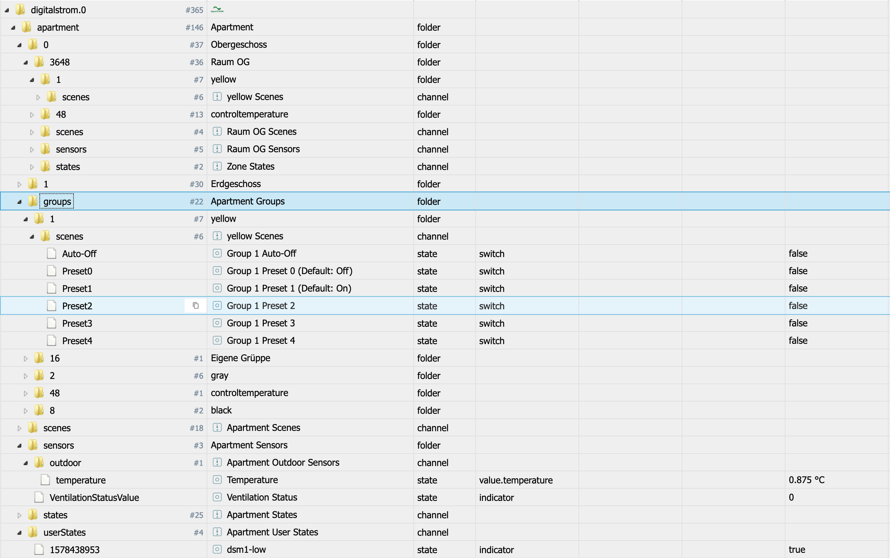
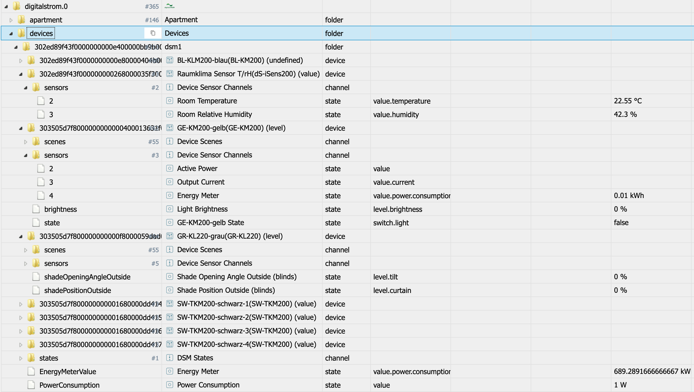

# IoBroker.digitalstrom
 

**此适配器使用 Sentry 库自动向开发人员报告异常和代码错误。** 有关更多详细信息以及如何禁用错误报告的信息，请参阅 [Sentry-插件文档](https://github.com/ioBroker/plugin-sentry#plugin-sentry)!从 js-controller 3.0 开始使用哨兵报告。

## IoBroker 的 Digitalstrom 适配器
通过 DSS 支持 Digitalstrom 设备

＃＃ 安装
请像往常一样通过管理用户界面安装适配器。

一旦适配器正式发布，他就会出现在 repo 中并且可以简单地选择。

在测试阶段，或为了测试新版本（参见相关论坛主题），您还可以使用 https://github.com/ioBroker/ioBroker.digitalstrom 作为 URL 直接从 GitHub 安装适配器。请为此使用管理员“自定义安装”选项。

＃＃ 用法
安装适配器并创建实例后，将出现管理对话框。
首先，您需要输入您的 DSS IP/主机名。然后您可以选择是否已经在 DSS Web 界面中手动创建了应用程序令牌。
如果您没有应用程序令牌，只需输入您的用户名和密码即可自动检索应用程序令牌。

除了身份验证设置（见上文），您还可以根据需要编辑以下设置：

* **数据轮询间隔**：这是从 DSM 设备请求“能量计”数据的间隔。默认 60 秒。如果您不想轮询 Engerymeter 数据，则可以设置为 0。
* **使用场景预设值**：Digitalstrom 系统并非真正设计为始终提供设备的真实输出值，并且最适用于场景。对于灯光和着色器/百叶窗，为许多可用场景定义了一些输出值。适配器知道它们，当此设置处于活动状态时，适配器将尝试在场景被触发时查找这些值并将这些值直接设置为状态。延迟请求实际值。当设置/使用本地优先级时，此方法可能会提供错误的值！
* **主动请求设备输出值**：适配器在启动时以及在对设备有效的场景之后初始化所有设备输出值。有延迟，但实际上所有这些消息都将通过 Digitalstrom 总线。如果这对您来说有问题，您可以尝试停用此功能。

提供应用程序令牌并保存设置后，适配器将自动重启。

当数据正确时，适配器读出单元和设备结构并将它们创建为 ioBroker 对象。这可能需要一些时间（取决于设备和楼层/区域/组的数量以及几秒钟的系统性能）。请耐心等待。而且我真的是这个意思......在这里很容易到达数千个物体！请给适配器时间！

在此之后，适配器订阅多个 DSS 事件以获取有关系统中操作的通知。

适配器状态指示灯将变为绿色，您将看到“订阅状态...”作为信息日志。在此之后一切准备就绪，您可以例如：

* 为公寓、区域、组或设备设置/撤消场景
* 读取状态和传感器值；对于区域，也可以推送传感器值
* 请参阅二进制输入、传感器、按钮和输出的值

## 状态和对象结构
适配器提供两种数据结构。带有楼层、区域（房间）和组的公寓结构，以及电路/dSM 和连接设备及其详细数据的结构。

在结构中包括了几种“类型”的数据：

* 场景：场景实现为开关。设置值 tro “true” 将为此场景发送“callScene”命令。值为“false”将为此场景发送“undoScene”命令 - 由 DSS 服务器决定“undo”是否为有效命令！当 callScene 或 undoScene 作为来自 DSS 服务器的事件被触发时，相关场景设置为“true”或“false”，ack=true
* 状态：显示来自系统的状态和用户通过插件定义的状态并且是只读的
* 传感器值在由事件触发时更新，也可以部分下注 - 更改会向服务器发送“pushSensorValue”，如果该值被接受，则由服务器决定！这主要与温度或湿度值相关

*

### 公寓对象和状态

对于公寓，创建了一个带有 "floor"."zone" 的结构，其中包含以下子结构：

* 每个设备组创建一个子文件夹，包括可用的组场景
* 该区域的场景
* 此区域的状态
* 该区域的传感器值

在公寓级别，所有设备组都可用于其场景。

在公寓级别还包括传感器（也包括室外值）、状态和用户状态。

### 设备对象和状态

设备结构为“电路/dSM”.“设备ID”，里面的子结构包括：

* 设备场景，仅针对该设备触发
* 设备传感器，当系统报告时。所以值可能为空
* 输出值（例如灯光的状态/亮度和阴影/百叶窗的位置/角度）直接位于设备下方。目前只有灯光和阴影/百叶窗将具有定义的功能。
* 按钮和二进制输入也将由状态表示并且是只读的

## 已知问题/系统设计效果
* DSS系统主要是使用场景而不是通过真实的设备值工作，而且获得真实值也很慢，因为需要通过总线获取。
* 系统未报告的值可能为空
* 二进制输入被实现“盲”正确知道，因为我没有这样的设备。所以我很高兴得到一些带有二进制输入设备的日志/报告:-)
* 有意义的输出值读取和写入仅适用于浅色（黄色）和阴影/盲色（灰色）设备。
* 到目前为止，我还没有机会检查系统在 vDC 上的表现。所以我需要在这里添加日志和详细信息
* 通风和温度管理/设备也没有完全实施......这里有什么意义？

## 如何报告问题和功能请求
请为此使用 GitHub 问题。

最好是将适配器设置为调试日志模式（实例 -> 专家模式 -> 列日志级别）。然后请从磁盘获取日志文件（ioBroker 安装目录中的子目录“log”，而不是从 Admin 获取，因为 Admin 截断了行）。如果您不喜欢在 GitHub 问题中提供它，您也可以通过电子邮件 (iobroker@fischer-ka.de) 将其发送给我。请添加对相关 GitHub 问题的引用，并描述我当时在日志中看到的内容。

## Changelog

### __WORK IN PROGRESS__
* (Apollon77) Optimize for js-controller 3.3
* (Apollon77) Optimize get/set Value handling for new devices

### 2.2.0 (2021-04-16)
* (Apollon77) Add support for integrated (IC) devices (SW, GE, GR)

### 2.1.0 (2021-04-13)
* (Apollon77) prevent crashes (Sentry IOBROKER-DIGITALSTROM-5)
* (Apollon77) Fix EnergyMeterValue
* (Apollon77) further optimizations and adding new outout channel types

### 2.0.5 (2020-03-14)
* (Apollon77) BREAKING: binaryInput are now numbers intead of booleans because it can have values other then true/false
* (Apollon77) BREAKING: Some states are converted to strings to allow all values to be passed
* (Apollon77) Fixes on some outputValues 
* (Apollon77) add new sunelevation and sunazimuth values 

### 1.0.2 (2020-02-10)
* (Apollon77) trigger buttons on scene calls also if scene is normally not allowed but came from the device
* (Apollon77) fix button logic
* (Apollon77) also add sensor type 255, but without name and unit because unknown
* (Apollon77) Switch Sentry to iobroker own instance hosted in germany
* (Apollon77) user states are optional now
* (Apollon77) add button states for devices wth more then 1 button

### 1.0.0 (2020-01-31)
* (Apollon77) bump version to 1.0.0
* (Apollon77) update dependecies
* (Apollon77) change default loglevel to info

### 0.5.5 (2020-01-29)
* (Apollon77) fix smaller errors
* (Apollon77) send Sentry reports to own server

### 0.5.0 (2020-01-19)
* (Apollon77) add buttons for more device types (also vDC) and try to detect button triggers

### 0.4.10 (2020-01-19)
* (Apollon77) state changes added
* (Apollon77) Fixed shade position control

### 0.4.9 (2020-01-18)
* (Apollon77) add unknown weather sensor "windgust"
* (Apollon77) change handling of Input types
* (Apollon77) Fix controlling of shaders 

### 0.4.7 (2020-01-17)
* (Apollon77) fix error when writing vdc output values

### 0.4.6 (2020-01-17)
* (Apollon77) fix missing datatypes for some states (mainly sensors and output values)

### 0.4.5 (2020-01-17)
* (Apollon77) fix error in sentry reporting

### 0.4.4 (2020-01-17)
* (Apollon77) fix error (Sentry IOBROKER-DIGITALSTROM-7)

### 0.4.2 (2020-01-16)
* (Apollon77) fix wrong scene state updates if same scene is triggered twice
* (Apollon77) also trigger scene update for all groups if scene was called on zone or to all zones and groups when done on apartment

### 0.4.1 (2020-01-16)
* (Apollon77) also add basic scenes to room groups

### 0.4.0 (2020-01-15)
* (Apollon77) add userActions as states and allow to trigger the actions

### 0.3.3 (2020-01-15)
* (Apollon77) fixes for scene lists
* (Apollon77) add some special szenes to more groups 

### 0.3.2 (2020-01-14)
* (Apollon77) fixes for adapter start

### 0.3.1 (2020-01-14)
* (Apollon77) fixes
* (Apollon77) make sure to initialize scenes, states and sensors really on startup - values will be overwritten if delivered with ack=true!
* (Apollon77) add all Presets (0-44) to Room/Zone and Group states 
* (Apollon77) also for unknown device types try to initialize output value IF only one is there (assuming it is offset/index 0!) Please check and report back!
* (Apollon77) make some initial processing async to block eventLoop less

### 0.3.0 (2020-01-14)
* (Apollon77) further optimize (lower) delays and timeouts, please give feedback!
* (Apollon77) add "stateId" State for each scenes folder with the scene number. This is updated with the scenes and also controllable.
* (Apollon77) scenes will not be cleared at the beginning and initialized with the "lastSceneId" returned from DSS; initialization may take some seconds longer!
* (Apollon77) update dependencies
* (Apollon77) increase loglevel of some "invalid cases" to warn to better see if they happen
* (Apollon77) fix handling of binaryInput events

### 0.2.2 (2020-01-13)
* (Apollon77) optimize event subscription logic and timeouts (should prevent "error 500 cases", now tries to resubscribe)

### 0.2.1 (2020-01-13)
* (Apollon77) optimize brightness handling
* (Apollon77) optimize error and reconnection handling

### 0.2.0 (2020-01-12)
* (Apollon77) initial official testing release (still GitHub)

### 0.1.x
* (Apollon77) initial release and finalization

## License
MIT License

Copyright (c) 2020-2021 Apollon77 <iobroker@fischer-ka.de>

Permission is hereby granted, free of charge, to any person obtaining a copy
of this software and associated documentation files (the "Software"), to deal
in the Software without restriction, including without limitation the rights
to use, copy, modify, merge, publish, distribute, sublicense, and/or sell
copies of the Software, and to permit persons to whom the Software is
furnished to do so, subject to the following conditions:

The above copyright notice and this permission notice shall be included in all
copies or substantial portions of the Software.

THE SOFTWARE IS PROVIDED "AS IS", WITHOUT WARRANTY OF ANY KIND, EXPRESS OR
IMPLIED, INCLUDING BUT NOT LIMITED TO THE WARRANTIES OF MERCHANTABILITY,
FITNESS FOR A PARTICULAR PURPOSE AND NONINFRINGEMENT. IN NO EVENT SHALL THE
AUTHORS OR COPYRIGHT HOLDERS BE LIABLE FOR ANY CLAIM, DAMAGES OR OTHER
LIABILITY, WHETHER IN AN ACTION OF CONTRACT, TORT OR OTHERWISE, ARISING FROM,
OUT OF OR IN CONNECTION WITH THE SOFTWARE OR THE USE OR OTHER DEALINGS IN THE
SOFTWARE.