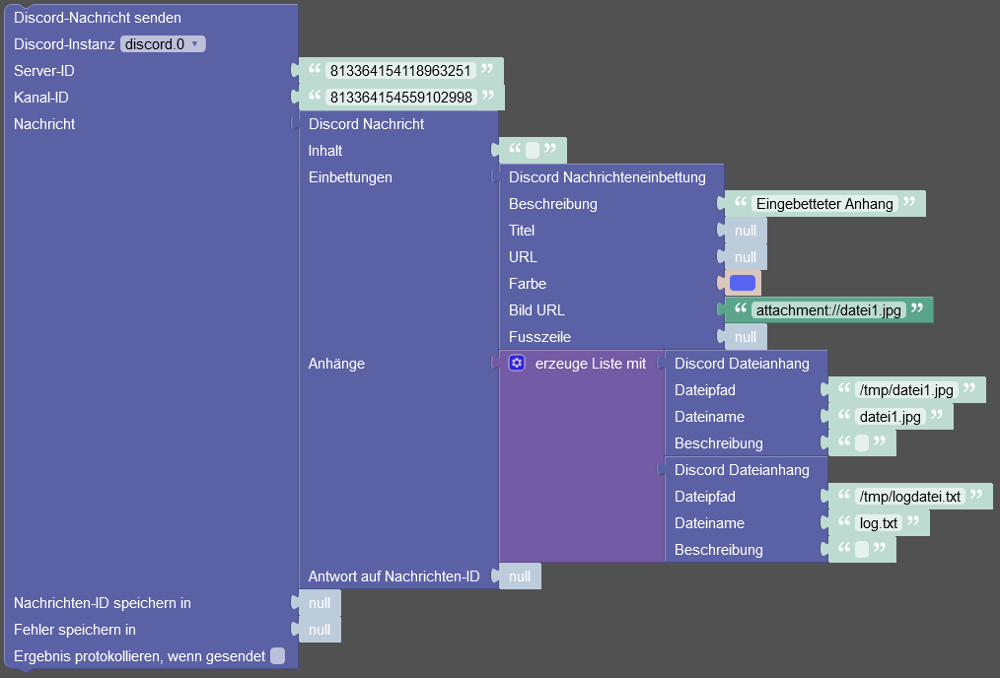
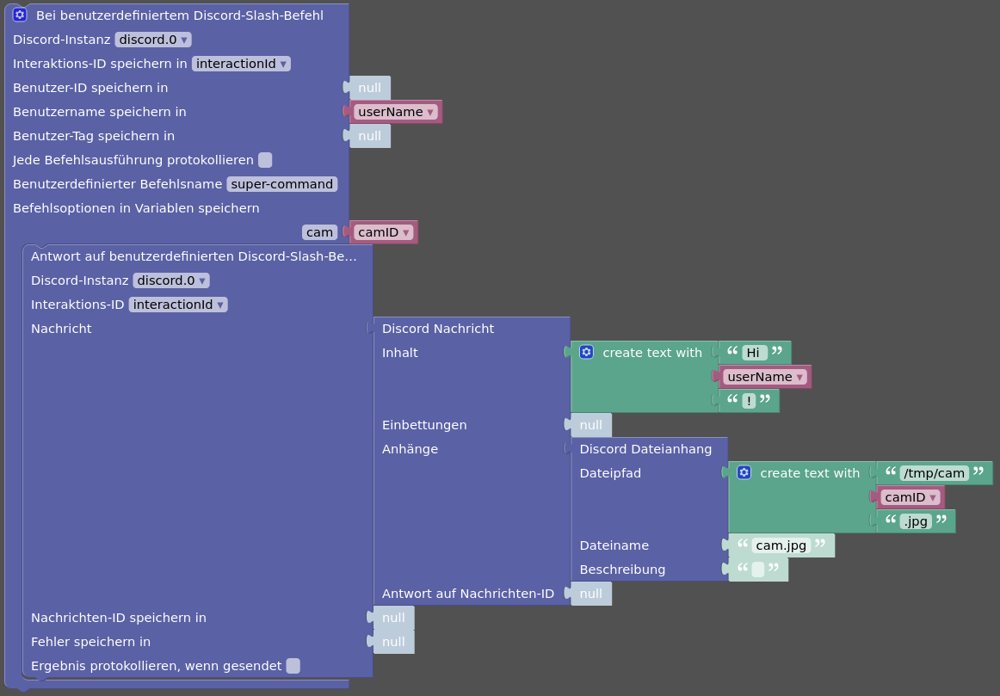

# IoBroker.discord


此 [ioBroker] 适配器将 [Discord] 机器人集成到 ioBroker 中。

适配器创建一个对象树，其中包含代表机器人的服务器和通道的对象和状态。
还为机器人看到的所有用户创建对象树。
使用这些状态，就可以通过 Discord 接收消息并发送消息和文件。

此外，适配器可以注册 Discord 斜线命令。
这样就可以查询或设置 ioBroker 状态。

- [ioBroker.discord](#iobrokerdiscord)
  - [函数](#函数)
  - [创建一个 Discord 机器人](#creating-a-discord-bot)
  - [将机器人添加到服务器](#add-the-bot-to-a-server)
    - [从服务器中删除机器人](#remove-the-bot-from-a-server)
  - [州](#states-states)
    - [discord.0.bot.\*](#discord0bot)
    - [discord.0.servers.\<服务器 ID\>.\*](#discord0servers 服务器 ID)
    - [discord.0.servers.\<server-id\>.channels.\<channel-id\>.\*](#discord0serversserver-idchannelschannel-id)
    - [discord.0.servers.\<server-id\>.members.\<user-id\>.\*](#discord0serversserver-idmembersuser-id)
    - [discord.0.users.\<用户 ID\>.\*](#discord0users 用户 ID)
    - [discord.0.slashCommands.\<命令名称\>.\*](#discord0slashcommands命令名称)
    - [discord.0.raw.\*](#discord0raw)
  - [授权](#授权)
  - [新闻](#news)
    - [接收消息](#receive-messages)
      - [使用text2command](#using-text2command)
    - [发送消息](#send-messages)
      - [发送简单文本](#sending-simple-texts)
      - [发送文件](#sending-files)
      - [发送反应](#sending-reactions)
      - [发送回复](#sending-reply)
      - [发送特殊自定义消息](#sending-special-custom-messages)
  - [斜线命令](#斜线命令)
    - [配置斜杠命令的状态](#configure-states-for-slash-commands)
    - [查询状态](#query-states)
    - [设置状态](#set-states)
    - [获取带有斜线命令配置的状态概述](#get-an-overview-of-states-with-configurations-for-slash-commands)
    - [自定义斜杠命令](#custom-slash-commands)
      - [自定义斜杠命令的 json 状态结构](#struct-of-a-json-state-of-custom-slash-commands)
  - [Blockly](#blockly)
    - [Blockly 示例：向用户发送消息并在三秒后对其进行编辑](#blockly-example-sending-a-message-to-a-user-and-editing-it-after-third-seconds)
    - [Blockly 示例：发送带有嵌入和两个文件附件的复合消息](#blockly-example-sending-a-compound-message-with-an-embed-and-two-file-attachments)
    - [Blockly 示例：响应自定义斜杠命令并发送请求的 IP 摄像机的图像](#blockly-example-respond-to-custom-slash-command-and-send-image-of-requested-ip-cam)
  - [在脚本中使用](#use-in-scripts)
    - [在脚本中发送消息](#sending-a-message-in-a-script)
    - [在脚本中编辑消息](#editing-a-message-in-a-script)
    - [删除脚本中的消息](#delete-a-message-in-a-script)
    - [将反应表情符号添加到脚本中的消息](#addreaction-emoji-to-a-message-in-a-script)
    - [等待脚本中消息的反应](#waiting-for-reactions-to-a-message-in-a-script)
    - [响应脚本中的自定义斜杠命令](#响应脚本中的自定义斜杠命令)
    - [在脚本中查询有关服务器的信息](#query-information-about-a-server-in-a-script)
    - [在脚本中查询服务器通道信息](#query-information-about-a-server-channel-in-a-script)
    - [在脚本中查询有关用户的信息](#query-information-about-a-user-in-a-script)
    - [在脚本中查询有关服务器成员的信息](#query-information-about-a-server-member-in-a-script)
    - [查询脚本中前一条消息的信息](#Query-information-about-a-previous-message-in-a-script)

＃＃ 特征
* ioBroker 状态用于机器人接收和发送消息的所有服务器
* ioBroker 规定机器人看到的所有用户都可以接收和发送直接消息
* 简化了机器人加入和离开 Discord 服务器的过程
* 设置机器人状态，包括操作
* 可选择监控用户存在状态
* 可选择监控用户的语音状态
* 服务器成员的语音操作（静音、聋哑、断开连接）
* 处理所有消息，或仅处理服务器通道中提及机器人的消息
* 直接消息处理
* 可选择使用表情符号自动回复提及机器人
* 通道、用户和消息数据的`.json`状态
* 使用 JSON 格式发送消息、文件、反应（表情符号）、回复或自定义消息内容
* 服务器和频道成员列表，包括分配的角色
* 支持Discord斜杠命令查询和设置状态值
* 支持自定义 Discord 斜线命令，可以在自定义脚本（包括 Blockly）中响应。
* 支持 [text2command]（必须为每个 `.message` 状态单独启用）
* 发送、编辑和删除消息，发送并等待自定义脚本中消息的反应
* 可选的原始状态可让您自己的脚本更加灵活
* 支持带有自定义块的 Blockly，用于发送和编辑消息以及处理自定义斜线命令

*不*支持和*不*预期的内容：

* 线程中的消息
* 发送和接收语音消息

是否缺少某个功能？只需在 [GitHub][GitHub New Issue] 上创建功能请求即可。

## 创建一个 Discord 机器人
要使用此适配器，必须创建 Discord Bot 应用程序。

1. 前往 [Discord 开发者门户]，如果您尚未登录，请使用您的 Discord 帐户登录。
2. 在_应用程序_视图中，单击右上角的_新建应用程序_按钮。

[](../../../de/adapterref/en/media/bot-creation-1.png)

3. 为应用程序选择一个名称（这将是机器人的名称），然后单击_创建_。

[](../../../de/adapterref/en/media/bot-creation-2.png)

4.（可选）上传_应用程序图标_，更改名称 (_Name_)，更改说明 (_Description_)，添加一些_标签_并保存更改 (_保存更改_)。

[](../../../de/adapterref/en/media/bot-creation-3.png)

5. 导航至左侧菜单中的_机器人_，然后单击_添加机器人_按钮。

[](../../../de/adapterref/en/media/bot-creation-4.png) 在以下对话框中单击_是，执行！_ 确认机器人的创建。

6. 创建机器人后，您必须单击一次_重置令牌_按钮才能获取机器人令牌。

[](../../../de/adapterref/en/media/bot-creation-5.png) 由于这会使之前的所有令牌失效，因此您必须使用弹出的对话框中的 _Yes, do it!_ 按钮确认这一点。
之后，机器人令牌将显示**一次**，您应该将其复制到安全位置（例如适配器实例的配置）。

7. 在_Bot_页面上，向下滚动到_Privileged Gateway Intent_并激活_Presence Intent_、_Server Members Intent_和_Message Content Intent_。不要忘记保存更改（_保存更改_）。

[](../../../de/adapterref/en/media/bot-creation-6.png)注意：一旦机器人出现在超过 100 个服务器上，这些意图将需要来自 Discord 的验证和批准。

8. 现在一切准备就绪，可以启动适配器实例，然后将机器人添加到 Discord 服务器。

## 将机器人添加到服务器
要将机器人添加到服务器，可以在适配器实例的配置中使用_将机器人添加到服务器_选项卡。
那里将显示一个链接，通过该链接可以将机器人添加到服务器，并正确设置所有必要的权限和应用程序区域。

[](../../../de/adapterref/iobroker.discord/media/bot-zu-server-hinzufuegen.png)

适配器需要以下机器人权限：

* 更改昵称
* 阅读新闻/查看频道
* 中等会员
* 发送信息
* 嵌入链接
* 附加文件
* 读取消息历史记录
* 提及所有人
* 添加反应
* 将成员静音
* 让成员充耳不闻
* 移动成员

还需要以下应用领域：

*机器人
* 应用程序.命令

如果缺少权限或范围，适配器的某些功能将无法工作。

### 从服务器中删除机器人
要从服务器中删除机器人，在适配器实例配置的同一页面上，可以选择选择服务器，然后单击 _离开服务器！_ 按钮告诉机器人离开服务器。

＃＃ 状态
每个服务器、通道和用户都由其唯一的数字 ID 来标识。
由于名称可以更改，因此适配器创建的对象树使用这些 ID 来创建可靠的结构。

整个对象树是根据机器人可以看到的内容生成的。
因此，例如，服务器上的频道可能比显示的频道多。

###不和谐.0.bot.*
|名称 |描述 |
|---|---|
| `activityType` |机器人活动的类型。可能的值为 `Playing`、`Streaming`、`Listening`、`Watching`、`Competing`、`Custom` 或空字符串。 |
| `status` |机器人的存在状态。可能的值为`online`、`idle`、`dnd` 和`invisible`。 |
| `状态` |机器人的存在状态。可能的值为“online”、“idle”、“dnd”和“invisible”。 |

这些状态用于设置机器人的存在状态和活动，因为它应该显示给用户。

### Discord.0.servers.\<服务器 ID\>.*
|名称 |描述 |
|---|---|
| `channels.*` |服务器通道。 |
| `成员。*` |服务器成员。 |

### Discord.0.servers.\<server-id\>.channels.\<channel-id\>.*
|名称 |描述 |
|---|---|
| `channels.*` |仅当频道是类别时才出现。其结构与服务器通道相同。 |
| `members` |频道成员（显示名称）的逗号分隔列表。 |
| `message` |该频道收到的最后一条消息。 |
| `messageId` |最后收到的消息的 ID。 |
| `messageAuthor` |最后收到的消息的作者（唯一的用户名或用户标签）。 |
| `messageTimestamp` |最后收到的消息的时间戳。 |
| `messageJson` |最后收到的消息的 JSON 数据。 |
| `send` |发送文本或 JSON 格式的消息。 |
| `sendFile` |发送文件。 |
| `sendReply` |发送消息回复。 |
| `sendReaction` |发送对消息的反应（表情符号）。 |
| `json` |频道信息的JSON数据。 |
| `json` |频道信息的JSON数据。 |

对于所有 `message*` 和 `send*` 状态，请参阅下面的_消息_部分。

### Discord.0.servers.\<服务器 ID\>.members.\<用户 ID\>.*
|名称 |描述 |
|---|---|
| `tag` |用户在 Discord 中的唯一标签。 |
| `displayName` |用户在服务器上的显示名称。 |
| `roles` |用户在服务器上的角色的逗号分隔列表。 |
| `joinedAt` |用户加入服务器的时间戳。 |
| `voiceChannel` |用户当前连接的语音通道，如果未连接则为空字符串。 |
| `voiceDisconnect` |用于断开用户与语音通道的按钮。 |
| `voiceSelfDeaf` |指示用户是否自己聋了。 |
| `voiceSelfMute` |指示用户是否已将自己静音。 |
| `voiceServerDeaf` |指示用户是否已被服务器震耳欲聋。也可用于更改此状态。 |
| `voiceServerMute` |指示用户是否已被服务器静音。也可用于更改此状态。 |
| `json` |用户信息 JSON 数据。 |
| `json` |用户信息 JSON 数据。 |

为了使 `voice*` 状态保持最新状态，必须在实例配置中启用_监视用户的语音聊天状态_选项。
要使用操作`voiceDisconnect`、`voiceServerDeaf`和`voiceServerMute`，机器人必须在服务器上拥有相应的权限。

### Discord.0.users.\<用户 ID\>.*
|名称 |描述 |
|---|---|
| `tag` |用户在 Discord 中的唯一标签。 |
| `status` |用户的存在状态。 `online`、`offline`、`idle`、`dnd` 之一 |
| `activityType` |用户当前活动的类型。 `Playing`、`Streaming`、`Listening`、`Watching`、`Competing`、`Custom` 之一或空字符串。 |
| `activityName` |用户当前活动的名称。例如，`Playing`期间的游戏名称。 |
| `avatarUrl` |用户头像的 URL。 |
| `bot` |指示用户是否是机器人。 |
| `message` |从用户收到的最后一条直接消息。 |
| `messageId` |用户最后收到的直接消息的 ID。 |
| `messageTimestamp` |用户最后收到的直接消息的时间戳。 |
| `messageJson` |用户最后收到的直接消息的 JSON 数据。 |
| `send` |发送文本或 JSON 格式的消息。 |
| `sendFile` |发送文件。 |
| `sendReply` |发送消息回复。 |
| `sendReaction` |发送对消息的反应（表情符号）。 |
| `json` |用户信息 JSON 数据。 |
| `json` |用户信息 JSON 数据。 |

为了使 `status` 和 `activity*` 状态保持当前状态，必须在实例配置中激活_观察用户状态_选项。

对于所有 `message*` 和 `send*` 状态，请参阅下面的_消息_部分。

### Discord.0.slashCommands.\<命令名称\>.*
此外，当在适配器的实例配置中启用自定义命令时，会存在以下状态。

每次调用自定义命令时，所有这些状态都会更新。

|名称 |描述 |
|---|---|
| `json` |该命令最后一次使用的 JSON 数据。包含一些未包含在各个状态中的附加信息。 |
| `userId` |调用该命令的用户的 ID。 |
| `userTag` |调用该命令的用户的唯一标记。 |
| `userName` |调用该命令的用户的名称。 （如果 `userTag` 以 `#0` 结尾，则一次）|
| `channelId` |调用该命令的通道ID。 |
| `serverId` |调用命令的服务器的 ID，或者 `null`（如果在直接消息中调用命令）。 |
| `timestamp` |上次使用该命令的时间戳。 |
| `option-*` |为命令指定的选项。为每个配置的选项创建一个单独的状态。如果调用命令时未指定选项，则关联状态将设置为`null`。 |
| `option-*.value` |调用命令时为选项指定的最后一个值。如果未指定选项，则关联状态将设置为`null`。 |
| `option-*.choices` | JSON 数组，包含此选项的预定义选项。仅适用于文本类型选项。示例：`["Wert 1", "Wert 2", { "name": "Wert 3", "value": "w3" }]` |
| `sendReply` |发送对调用的命令的响应。与通道或用户的`.send`状态一样，这可以是字符串或 JSON 对象。请参阅下面的_新闻_部分。 |
| `发送回复` |发送对调用的命令的响应。与通道或用户“.send”状态一样，这可以是字符串或 JSON 对象。请参阅下面的_新闻_部分。 |

**注意：** 建议在您自己的脚本中使用`json`状态以避免重叠。
示例：当用户再次调用命令时，自定义脚本会读取各个 `option-*` 状态，并且命令的第一次和第二次调用中的选项会混淆。

###不和谐.0.raw.*
此外，当在适配器的实例配置中启用原始状态时，会存在以下状态。

**注意：** 这些状态包括未经过适配器任何检查、过滤或修改的原始数据。服务器被称为公会。

|名称 |描述 |
|---|---|
| `messageJson` |最后收到的消息的原始 JSON 数据。 （频道消息和直接消息） |
| `interactionJson` |收到的最后一次交互的原始 JSON 数据。 （例如斜杠命令）|

＃＃ 授权
默认情况下，授权已启用，只有授权用户才能与适配器交互。

授权用户和服务器角色可以在适配器的实例配置中设置，包括每个用户/角色权限。
对于服务器角色，权限仅应用于相应的服务器，而不应用于其他服务器或直接消息中。
如果已为每个用户和服务器角色分配权限，则这些权限将合并到相应的服务器。

用户和角色通过其内部 ID 进行识别，因此即使更改用户标签、用户名或角色名称也不会影响授权。

也可以取消授权。但是，只有当机器人的所有服务器上的所有用户都可以信任时才应该这样做！

＃＃ 消息
该适配器能够从 Discord 文本通道和用户接收和发送消息。

默认情况下，通道仅处理提及机器人的消息。
为了确保未提及的消息也得到处理，必须在实例配置中激活_处理服务器通道中的所有消息_选项。

当收到提及机器人的消息时，适配器会使用表情符号响应该消息。
这可以在适配器的实例配置中进行调整。
如果启用授权，则机器人将仅响应授权用户的提及。

### 接收消息
接收到的消息存储在相应通道对象（对于通道消息）或用户对象（对于直接消息）的`.message*`状态中。

默认情况下，启用授权后，仅归档来自授权用户的消息。
可以使用适配器实例配置中的“处理来自未经授权的用户的消息”选项对此进行调整，以便也存储来自未经授权的用户的消息。

每个通道/用户收到的最后一条消息始终存储在`.message`状态中。
最后收到的消息的时间戳、作者和 ID 存储在关联的状态中。
此外，所有这些信息也以 JSON 格式存储在 `.messageJson` 状态中。

#### 使用text2命令
要使用text2command，必须在适配器的实例配置中选择text2command 实例。

对于每个 `.message` 状态，可以启用自定义设置_为此状态启用 text2command_。
如果启用，收到的消息将发送到选定的 text2command 实例。

来自 text2command 的响应由适配器作为回复、作为普通消息发送，或者根本不发送，具体取决于适配器的实例配置。

＃＃＃ 发送信息
要发送消息，可以将内容写入通道或用户的`.send*`状态。

#### 发送简单文本
要发送简单文本，只需在所需目的地的 `.send` 状态中写入文本即可。
[Discord Markdown] 可用于格式化文本，就像在 Discord 客户端中一样。

要提及用户，可以使用 `<@Benutzer-ID>` 形式的用户 ID。
`<@&Gruppen-ID>` 可用于提及组，`<#Kanal-ID>` 可用于频道。

示例：`Dies ist meine Nachricht.`、`Dies ist _meine_ **formatierte** Nachricht.`、`Hey <@490222742801481728>!`

#### 发送文件
要将文件作为附件发送，请在所需目的地的 `.sendFile` 状态中写入文件的位置。

文件的位置可以是...

* 本地文件的绝对或相对路径。

相对路径是相对于 ioBroker 安装的适配器目录的。
该路径可以选择以 `file://` 为前缀。
示例：`/home/user/image.png`、`../../iobroker-data/files/myfile.txt`、`file:///tmp/image.jpg`

* 远程文件的 URL。

  示例：`https://www.iobroker.dev/images/iobroker.png`

* Base64编码的文件内容。

  示例：`data:image/png;base64,iVBORw0KGgoAAAANSUhEUgAAABAAAAAQCAYAAAAf8/9hAAACzklEQVQ4y3WTy2tcdRTHP+d3753HncncmbaJiYvEhZrU+ii2urJgFCyCLnykpbQrsbR/gRQaXPUPUHBlH4ogUsRSqq7qLtlZrQpKg6Uu1OCkSWZ65859zfzucTExsYLf3Tl8zznf85JHZ5+cVuGcMebg0YXXHN/3UVVAqfk1VJV+HCMiAKRpyuXPr1hrixsCZ10VzgEnXMeRF+afJwgaFIUC0Go1UYVOp4OYUYIoivjiyjWszecUMMaYAyXPk7m5R8jznCjqk2YpjuMQhj1AcT2XLM3oR30GgyFB0KDkeWKMOeAeP7ZgDh16jizNeO/9Dwh7PR7ft5ejRxa49tXXvPnG6yRJzNWrX/LDjz8xMTHOu4tnKJXLLC0tG1OtViVoNKhWK9wLQ9pr6yRJwtTUJC/Oz3P9+jckccrk5APcXd+g3V6jUqkwiqmKKwKIMBrbCKpw585vvHNmkT17dvHQzAylUhkjZocnggi4I0+BAML9sEXBX+27XLj0MXGSMLR2h6cFKLh+zSdoNlHYXtW/oaq019a3bRGhPlYnaDbxaz5GVflHV7lcYlcrYJRH+V9s8VUVN4r6bG5ugginT52k2+ny/c2bADjGMDG+m073HlmWbyvq9XoURUEU9TGO4+C4DsPBgI31DZIkwVqLAs8+8zQnjh/j1Vdevq84Iriei+M4GABByLKMTz+7zMWPPuHBqSkGgwGdbpeZ6WmiXu+/g9nu0E2SRMMwJMty6rUa+596gsOHX+L8hUvEcUyp5PH7H38yMb4bgMbYGFmWE4YhSZKozO3b/7PruI/Nzj7MybffotVqYYwhjmPq9TpBo8Hq6iqFjkpmWcaH5y+ysnKboR3+4lpbfGdtvvfWrV+lUi5T8jyKoqBeq9FqBqiC7/sYM7qAnggrK7fJ8lyBG67AWQWstQeXlpd33lmhVt96535/60aENE0YWmuBbwUW/wZQx0cNXLu4ygAAAABJRU5ErkJggg==`

此外，还可以将文本消息添加到文件中。为此，只需写入文件的位置，后跟管道字符`|`和`.sendFile`状态中的消息。
示例：`/tmp/image.png|Dies ist meine Datei`、`https://www.iobroker.dev/images/iobroker.png|Das ioBroker Logo`

#### 发送反应
`.sendReaction`状态可用于通过表情符号对之前的消息做出反应。为此，只需在状态中写入表情符号即可。

默认情况下，响应将发送至 ID 当前包含在关联的 `.messageId` 状态中的消息。

如果要响应特定消息，则可以将消息 ID 后跟管道字符`|` 和表情符号写入`.sendReaction` 状态。

示例：`👍`、`971032590515568660|👍`

#### 发送回复
`.sendReply`状态可用于回复先前的消息。
为此，只需将答案写在状态中即可。

默认情况下，响应将发送至 ID 当前包含在关联的 `.messageId` 状态中的消息。

如果要回复特定消息，则可以将消息 ID 后跟管道字符`|` 和回复写入`.sendReply` 状态。

示例：`Dies ist eine Antwort.`、`971032590515568660|Dies ist eine Antwort.`

#### 发送特殊的自定义消息
还可以通过将 JSON 消息对象写入 `.send` 或 `.sendReply` 状态来发送特殊自定义消息。

JSON 对象的类型必须为`MessageOptions`。
有关更多信息，请参阅 [discord.js MessageOptions 文档][MessageOptions]。

例子：

发送图片：

```json
{
  "files": [
    {
      "attachment": "/tmp/image.jpg",
      "name": "image.jpg",
      "description": "Mein tolles Bild"
    }
  ]
}
```

发送嵌入内容：

```json
{
  "content": "Verwende das:",
  "embeds": [
    {
      "title": "ioBorker.discord",
      "description": "Discord Adapter für ioBroker",
      "color": "#5865f2",
      "url": "https://github.com/crycode-de/ioBroker.discord",
      "author": {
        "name": "Peter Müller",
        "url": "https://github.com/crycode-de"
      },
      "image": {
        "url": "https://github.com/crycode-de/ioBroker.discord/raw/main/admin/discord.png"
      },
      "footer": {
        "text": "❤👍"
      }
    }
  ]
}
```

从本地源发送嵌入图像：

```json
{
  "embeds": [
    {
      "title": "IP-Cam Alarm",
      "description": "Schau dir das an:",
      "color": "#ff0000",
      "image": {
        "url": "attachment://cam.jpg"
      }
    }
  ],
  "files": [
    {
      "attachment": "http://192.168.1.50:8080/ip-cam.jpg",
      "name": "cam.jpg"
    }
  ]
}
```

## 斜线命令
如果在适配器的实例配置中启用，则适配器可以使用 Discord 斜线命令。这些命令可用于查询或设置 ioBroker 状态。

**注意：** Discord 斜杠命令可用的状态必须单独配置。进一步参见下文。

适配器可以将 Discord 斜线命令注册为服务器命令（默认）或全局命令。这可以在适配器的实例配置中设置。
使用服务器命令的优点是对命令的更改（例如添加状态）会立即应用且不会延迟。
但是，服务器命令不能在用户和机器人之间的直接消息中使用。
全局命令也可以在直接消息中使用，但对命令的任何更改最多可能需要一个小时才能反映在 Discord 中。这是 Discord 的限制，而不是适配器的限制。

默认斜杠命令为`/iob-get` 和`/iob-set`。
命令的名称和描述可以在适配器的实例配置中自定义。

### 配置斜线命令的状态
对于您希望通过 Discord 斜杠命令可用的任何状态，必须在该状态的自定义设置中启用此功能。
为此，只需单击管理中_对象_视图中的_自定义设置_齿轮图标，启用适配器实例的设置并选中_为此状态启用Discord命令_选项。

[](../../../de/adapterref/iobroker.discord/media/slash-befehl-konfiguration-1.png)

[](../../../de/adapterref/iobroker.discord/media/slash-befehl-konfiguration-2.png)

可以为每个状态定义_Name_和_Alias_以在Discord中使用。
_Name_ 用于命令自动完成，_Alias_ 用作内部标识符。两者的长度不得超过 100 个字符。

对于每个状态，可以单独确定其是否可用于查询和/或设置。
另外，可以激活在查询时是否未确认相应状态时显示信息，或者设置时应始终设置为确认。

对于数据类型`string`的状态，可以选择将该值视为文件（文件的位置）。
如果激活此功能，则状态的当前值将与 `.sendFile` 状态一样发送。
例如，这使得可以使用查询命令请求图像。

对于数据类型`number`的状态，可以指定用于对查询命令中的值进行四舍五入的小数位数。

对于数据类型`boolean`的状态，可以为`true`和`false`定义用户定义的值，然后用于在查询命令中显示和在设置命令中检测。

### 查询状态
要查询状态，只需在 Discord 客户端中调用 `/iob-get Zustandsalias` 即可。
对于`Zustandsalias`，键入命令时会显示自动完成功能。

每个值都按照状态对象及其自定义设置中指定的格式进行输出。
可选地，如果状态未被确认，则添加信息。

### 设置状态
要查询状态，只需在 Discord 客户端中调用 `/iob-set Zustandsalias Neuer-Wert` 即可。
对于`Zustandsalias`，键入命令时会显示自动完成功能。
如果状态的数据类型为 `boolean` 或 `number`，则适配器会解析`Neuer-Wert`。

对于每个状态，您可以单独配置是否应在确认的情况下设置该值。

对于数据类型`boolean`的状态，值`true`、`on`、`yes`、`1`及其相关翻译（`wahr`、§§ §SSSSS_6§ §、`ja`)，以及为状态配置的_True Value_被解释为`true`。
任何其他值均被解释为`false`。

对于数据类型`number`的状态，指定的值被解释为十进制数。
如果 ioBroker 安装配置为使用逗号作为小数分隔符，则可以使用逗号或句点作为小数分隔符指定数字。否则，仅允许点作为小数点分隔符。
如果在状态对象中为`min`和`max`指定了值，那么也会检查这些值。

### 获取斜线命令配置的状态概述
要获取斜杠命令的活动配置的所有状态的概述，您可以单击适配器实例配置中的_记录为命令配置的状态对象_按钮。然后输出将出现在 ioBroker 安装的日志中。

### 自定义斜杠命令
您可以在适配器的实例配置中激活和配置您自己的斜线命令。
然后将配置的自定义命令与标准 get 和 set 命令一起注册到 Discord。

可以将选项添加到每个自定义命令中。
这些选项随后将出现在该命令的 Discord 客户端中。
如果调用命令时未指定选项，则该选项包含值`null`。
对于 _Text_ 类型的选项，可以在关联的 `option-*.choices` 状态中将预定义选项动态指定为 JSON 数组。

当调用用户定义的命令时，该命令的数据将写入关联的状态。请参阅上面_States_ 部分中的状态描述。

包括选项在内的所有信息均写入命令的`.json`状态。
这种状态主要用于保存脚本中的命令数据，因为所有必要的信息都存储在一个地方，即使在短时间内调用多个命令，也不会混淆任何内容。
对于_User_、_Role_、_Channel_ 或_Mentionable_ 类型的选项，选项对象中会填充其他字段。

**注意：** 必须评估命令本身，然后必须发送对该命令的响应。例如，可以使用您自己的脚本来完成此操作。
必须在 15 分钟内通过 `.sendReply` 状态或相关的 `sendTo(...)` 操作发送响应。
如果在规定时间内没有发送响应，Discord 客户端将显示错误_应用程序没有响应_。

**注意：** 对命令调用的响应可以多次发送。
答案将被编辑并用新内容覆盖。

#### 自定义斜杠命令的 json 状态结构
```js
{
  interactionId: string,
  commandName: string,
  user: {
    id: string,
    tag: string,
    name: string,
    displayName: string,
  },
  channelId: string,
  serverId: string | null,
  timestamp: number,
  options: {
    [string]: {
      value: string | number | boolean | null,
      type: 'String' | 'Number' | 'Boolean' | 'User' | 'Role' | 'Channel' | 'Mentionable' | null,
      user?: { // wenn type USER oder MENIONABLE ist
        id: string,
        tag: string,
        name: string,
        bot: boolean,
      },
      member?: { // wenn type USER oder MENIONABLE ist und der Befehl auf einem Server aufgerufen wurde
        id: string,
        tag: string,
        name: string,
        displayName: string,
        roles: { id: string, name: string }[],
      },
      role?: { // wenn type ROLE oder MENTIONABLE ist
        id: string,
        name: string,
      },
      channel?: { // wenn type CHANNEL ist
        id: string,
        name: string,
        type: 'GuildCategory' | 'GuildNews' | 'GuildStageVoice' | 'GuildStore' | 'GuildText' | 'GuildVoice',
        lastMessageId: string | null,
      },
    },
    // ...
  }
}
```

## 块状
该适配器带有自己的 Blockly 块，用于...

* 向用户或服务器通道发送消息
* 在私信或服务器频道中编辑消息
* 在消息中添加表情符号反应
* 具有可选嵌入、附件和回复参考的复合消息内容
* 撰写消息嵌入
* 撰写邮件附件
* 响应自定义斜杠命令
* 响应自定义斜杠命令

### Blockly 示例：向用户发送消息并在三秒后对其进行编辑
[](../../../de/adapterref/iobroker.discord/media/blockly-1.png)

<details><summary>块代码</summary>

```xml
<xml xmlns="https://developers.google.com/blockly/xml">
  <variables>
    <variable id="KIILW$,(eB?pT`;GDuMF">messageId</variable>
  </variables>
  <block type="discord_send_message_user" id="?xkCV};-Lk_-|Q`]%(Gt" x="163" y="38">
    <field name="instance">.0</field>
    <field name="logResultOk">FALSE</field>
    <value name="user">
      <shadow type="text" id="jXN@CluUy_M/ig@4[(Uk">
        <field name="TEXT">crycode</field>
      </shadow>
    </value>
    <value name="content">
      <shadow type="text" id="uLWu1CJ$;k}|VTyw1-8}">
        <field name="TEXT">Hallo!</field>
      </shadow>
    </value>
    <value name="varMessageId">
      <shadow type="logic_null" id="bJ2lJW0qOa@Zjv%(]mFU"></shadow>
      <block type="variables_get" id="xkJ(vH/;@7%)cDo0HU/~">
        <field name="VAR" id="KIILW$,(eB?pT`;GDuMF">messageId</field>
      </block>
    </value>
    <value name="varError">
      <shadow type="logic_null" id="H:f+1-:p9-YkmpehJoco"></shadow>
    </value>
    <next>
      <block type="timeouts_wait" id="OM8gv}Pl#_mHQ|)([mUe">
        <field name="DELAY">3</field>
        <field name="UNIT">sec</field>
        <next>
          <block type="discord_edit_message_user" id="|L3A+9{s_H8j`AF@,*VF">
            <field name="instance">.0</field>
            <field name="logResultOk">FALSE</field>
            <value name="user">
              <shadow type="text" id="voJ:{uuYtbBZ!Xe,rtV|">
                <field name="TEXT">crycode</field>
              </shadow>
            </value>
            <value name="messageId">
              <shadow type="text" id="64L=tOKvKwoqGHadRgDm">
                <field name="TEXT"></field>
              </shadow>
              <block type="variables_get" id="(M^6xk74LUEsPdH=LagL">
                <field name="VAR" id="KIILW$,(eB?pT`;GDuMF">messageId</field>
              </block>
            </value>
            <value name="content">
              <shadow type="text" id="rvnV^RF,g$M/3+(npHNC">
                <field name="TEXT">Moin!</field>
              </shadow>
            </value>
            <value name="varError">
              <shadow type="logic_null" id="{H4Q^vl400kxRKrffDz)"></shadow>
            </value>
          </block>
        </next>
      </block>
    </next>
  </block>
</xml>
```

</详情>

### Blockly 示例：发送带有嵌入内容和两个文件附件的复合消息
[](../../../de/adapterref/iobroker.discord/media/blockly-2.png)

<details><summary>块代码</summary>

```xml
<xml xmlns="https://developers.google.com/blockly/xml">
  <block type="discord_send_message_server_channel" id="Mnc=pB-8%Dr/nsen|SC`" x="63" y="38">
    <field name="instance">.0</field>
    <field name="logResultOk">FALSE</field>
    <value name="serverId">
      <shadow type="text" id="PA4]t;7CuDrKtwa|oB?L">
        <field name="TEXT">813364154118963251</field>
      </shadow>
    </value>
    <value name="channelId">
      <shadow type="text" id="x^vm,CRT`z2AhDT#ZcUC">
        <field name="TEXT">813364154559102998</field>
      </shadow>
    </value>
    <value name="content">
      <shadow type="text" id="ebdEp~G?:_gInjN47g@f">
        <field name="TEXT"></field>
      </shadow>
      <block type="discord_create_content" id="kY,/zwmwkjo:U;cT?eN*">
        <value name="content">
          <shadow type="text" id="D|y(g`oE@H#gu+deGbv2">
            <field name="TEXT"></field>
          </shadow>
        </value>
        <value name="embeds">
          <shadow type="logic_null" id="Qt[pG25wLoI8+3/jN66C"></shadow>
          <block type="discord_create_embed" id="cXAWtP-36uYlAxLhIBhN">
            <value name="description">
              <shadow type="text" id="^D%m:ic9]AcUUQP8~U#6">
                <field name="TEXT">Eingebetteter Anhang</field>
              </shadow>
            </value>
            <value name="title">
              <shadow type="logic_null" id="_Wm.(^Ff6^u%K+gVz$^Z"></shadow>
            </value>
            <value name="url">
              <shadow type="logic_null" id="0,08A!7[kJ-nJPnPH$L5"></shadow>
            </value>
            <value name="color">
              <shadow type="colour_picker" id="V0}MlQJvN._LHFhG2K%@">
                <field name="COLOUR">#5865f2</field>
              </shadow>
            </value>
            <value name="imageUrl">
              <shadow type="logic_null" id="xXr:E++u0;@2#e]r;_`]"></shadow>
              <block type="text" id="76;;p-5{pls%KmrI!ar{">
                <field name="TEXT">attachment://datei1.jpg</field>
              </block>
            </value>
            <value name="footerText">
              <shadow type="logic_null" id="#BS`MgkNWbrQ@*m/kNdw"></shadow>
            </value>
          </block>
        </value>
        <value name="files">
          <shadow type="logic_null" id="4u@7^DXCI~J$r{Qx}1Ql"></shadow>
          <block type="lists_create_with" id="42g8r-+[xWw`|^.qOF!*">
            <mutation items="2"></mutation>
            <value name="ADD0">
              <block type="discord_create_file" id="EzK4NA^+bu4vChH/vj-b">
                <value name="attachment">
                  <shadow type="text" id="=OEkBZ:LFXvT2$S++21(">
                    <field name="TEXT">/tmp/datei1.jpg</field>
                  </shadow>
                </value>
                <value name="name">
                  <shadow type="text" id="zum#q*|`aD%A2s/N@/Ow">
                    <field name="TEXT">datei1.jpg</field>
                  </shadow>
                </value>
                <value name="description">
                  <shadow type="text" id="#ZZOq%3EHO/_GC+w.,-^">
                    <field name="TEXT"></field>
                  </shadow>
                </value>
              </block>
            </value>
            <value name="ADD1">
              <block type="discord_create_file" id="wIKo-2??SX@WcYc7e/5s">
                <value name="attachment">
                  <shadow type="text" id=")4lvYv.)IhU/p+~KUDym">
                    <field name="TEXT">/tmp/logdatei.txt</field>
                  </shadow>
                </value>
                <value name="name">
                  <shadow type="text" id="#)t#lK6{$RuZt34O;@Ag">
                    <field name="TEXT">log.txt</field>
                  </shadow>
                </value>
                <value name="description">
                  <shadow type="text" id="^UKzs+$TQ!tiE:`(=%}}">
                    <field name="TEXT"></field>
                  </shadow>
                </value>
              </block>
            </value>
          </block>
        </value>
        <value name="replyToId">
          <shadow type="logic_null" id="#1:[?d^x=)ZH.!uyxRI:"></shadow>
        </value>
      </block>
    </value>
    <value name="varMessageId">
      <shadow type="logic_null" id="@D^#9^84UknOfV|c$NK~"></shadow>
    </value>
    <value name="varError">
      <shadow type="logic_null" id="mJu{Fa9+]+Ml,{_OqIOh"></shadow>
    </value>
  </block>
</xml>
```

</详情>

### Blockly 示例：响应自定义斜杠命令并发送请求的 IP 摄像头图像
[](../../../de/adapterref/iobroker.discord/media/blockly-3.png)

<details><summary>块代码</summary>

```xml
<xml xmlns="https://developers.google.com/blockly/xml">
  <variables>
    <variable id="Wcj[Gmy,vX]b,)s,O)`U">interactionId</variable>
    <variable id="{sXn[Mn@ZN#fWtTV6O^;">userName</variable>
    <variable id="ULmVI=-QcXLnD!e60KTV">camID</variable>
  </variables>
  <block type="discord_on_custom_cmd" id="GE,i32wKhz%KGlBhV$j=" x="63" y="13">
    <mutation xmlns="http://www.w3.org/1999/xhtml" options="cam"></mutation>
    <field name="instance">.0</field>
    <field name="varInteractionId" id="Wcj[Gmy,vX]b,)s,O)`U">interactionId</field>
    <field name="log">FALSE</field>
    <field name="commandName">super-command</field>
    <value name="varUserId">
      <shadow type="logic_null" id="/}0,E!Gq=C2U]C^.8m1@"></shadow>
    </value>
    <value name="varUserName">
      <block type="variables_get" id="Q=v?u?yU}Tw*@FH*|x7.">
        <field name="VAR" id="{sXn[Mn@ZN#fWtTV6O^;">userName</field>
      </block>
    </value>
    <value name="varUserTag">
      <shadow type="logic_null" id="+r2I4SpfhuW%9DE21,[c"></shadow>
    </value>
    <value name="option0">
      <shadow type="logic_null" id="hL^g}gJg-b.+SOH0s9m1"></shadow>
      <block type="variables_get" id="z/Lf|chD)~Ge0N~@EWG%">
        <field name="VAR" id="ULmVI=-QcXLnD!e60KTV">camID</field>
      </block>
    </value>
    <statement name="STATEMENT">
      <block type="discord_send_custom_command_reply" id="zJXF!F=|Xt4.kG/6ctl(">
        <field name="instance">.0</field>
        <field name="interactionId" id="Wcj[Gmy,vX]b,)s,O)`U">interactionId</field>
        <field name="logResultOk">FALSE</field>
        <value name="content">
          <shadow type="text" id="bdVm59S9_U*GFB(IBO6x">
            <field name="TEXT"></field>
          </shadow>
          <block type="discord_create_content" id="6m8gBtp;K@t8}{`9gPd1">
            <value name="content">
              <shadow type="text" id=".c}Z71nQ8LlQ@h}_Z?qR">
                <field name="TEXT"></field>
              </shadow>
              <block type="text_join" id="Z{wQ$[1g7z?KPMSHB],Y">
                <mutation items="3"></mutation>
                <value name="ADD0">
                  <block type="text" id="cuzUE7GB$#gC*;nOQ|Ke">
                    <field name="TEXT">Hi </field>
                  </block>
                </value>
                <value name="ADD1">
                  <block type="variables_get" id="|[[T@|n1Ro{EU56/jJ@P">
                    <field name="VAR" id="{sXn[Mn@ZN#fWtTV6O^;">userName</field>
                  </block>
                </value>
                <value name="ADD2">
                  <block type="text" id="LV$kS:Gzv#cJ#gXe/{4a">
                    <field name="TEXT">!</field>
                  </block>
                </value>
              </block>
            </value>
            <value name="embeds">
              <shadow type="logic_null" id="p8S?*FLv4a6aIJogCKU;"></shadow>
            </value>
            <value name="files">
              <shadow type="logic_null" id="y#a8q/mr^)Ymt*j)S:H/"></shadow>
              <block type="discord_create_file" id="vN%eoP74=*)f63CQiJ__">
                <value name="attachment">
                  <shadow type="text" id="2$9y5yj3.GHx.ms*:Ce2">
                    <field name="TEXT"></field>
                  </shadow>
                  <block type="text_join" id="K9zuKTz?-b8VT$8XUVQ8">
                    <mutation items="3"></mutation>
                    <value name="ADD0">
                      <block type="text" id="p3f^[{6t+UuDJN=49+#Z">
                        <field name="TEXT">/tmp/cam</field>
                      </block>
                    </value>
                    <value name="ADD1">
                      <block type="variables_get" id="oVmVHEX[iT(-X#]m=[U@">
                        <field name="VAR" id="ULmVI=-QcXLnD!e60KTV">camID</field>
                      </block>
                    </value>
                    <value name="ADD2">
                      <block type="text" id="wUXx)@u6*2,+9!q{W`n`">
                        <field name="TEXT">.jpg</field>
                      </block>
                    </value>
                  </block>
                </value>
                <value name="name">
                  <shadow type="text" id="L5fO_+by.^Z:se~6|xCj">
                    <field name="TEXT">cam.jpg</field>
                  </shadow>
                </value>
                <value name="description">
                  <shadow type="text" id="ku}h+v)9oY;1`[9Rr)w%">
                    <field name="TEXT"></field>
                  </shadow>
                </value>
              </block>
            </value>
            <value name="replyToId">
              <shadow type="logic_null" id="Ou%Gd6C*+2OaIPUxPp}t"></shadow>
            </value>
          </block>
        </value>
        <value name="varMessageId">
          <shadow type="logic_null" id="RUb!i][5`[t0*mzLwBvN"></shadow>
        </value>
        <value name="varError">
          <shadow type="logic_null" id="SLsj^+8=[Bp%/X8n]$?Z"></shadow>
        </value>
      </block>
    </statement>
  </block>
</xml>
```

</详情>

## 在脚本中使用
在脚本中，函数`sendTo(...)`可用于与适配器实例交互。

_注意：_ 使用的所有 ID 都是字符串。

### 在脚本中发送消息
要发送消息，可以使用`send` 或`sendMessage` 命令。它们都是相同的。

`sendTo(...)` 的 `message` 部分必须是具有要发送的 `content` 的对象以及以下参数之一以标识目的地：

* `用户ID`
* `用户标签`
* `用户名`
* `serverId` 和 `channelId`

`content` 可以是一个简单的字符串或一个 [MessageOptions] 对象。

`sendTo(...)`回调中的返回值是一个对象，包含消息参数和`result`字符串，以及发送的Discord消息的`messageId`（如果成功）或§§SSSSS_3§ § 发生错误时的消息。

例子：

```js
// Senden einer Nachricht zu einem Benutzer bei Verwendung des einmaligen Benutzernamens
sendTo('discord.0', 'sendMessage', {
  userName: 'crycode',
  content: 'Hi!',
}, (ret) => {
  log(ret);
  // {'result':'Message sent to user crycode','userName':'crycode','content':'Hi!','messageId':'971779972052155891'}

  if (ret.error) {
    log(ret.error, 'error');
    return;
  }
  log(`Nachricht gesendet mit ID ${ret.messageId}`);
});

// Senden einer Nachricht zu einem Benutzer bei Verwendung des Benutzer-Tags
// (für Bots und Benutzer, die noch nicht zu einem einmaligen Benutzernamen migriert sind)
sendTo('discord.0', 'sendMessage', {
  userTag: 'cryCode#9911',
  content: 'Hi!',
}, (ret) => {
  log(ret);
  // {'result':'Message sent to user cryCode#9911','userTag':'cryCode#9911','content':'Hi!','messageId':'971779972052160552'}

  if (ret.error) {
    log(ret.error, 'error');
    return;
  }
  log(`Nachricht gesendet mit ID ${ret.messageId}`);
});

// Senden einer Antwort zu einem Benutzer
sendTo('discord.0', 'sendMessage', {
  userId: '490222742801481728',
  content: {
    content: 'Ok!',
    reply: {
      messageReference: '971779972052160552', // ID der Nachricht, auf die geantwortet werden soll
    },
  },
}, (ret) => {
  log(ret);
  // {'result':'Message sent to user crycode','userId':'490222742801481728','content':{'content':'Ok!','reply':{'messageReference':'971779972052160552'}},'messageId':'971786369401761832'}
});

// Senden einer Datei an einen Serverkanal
sendTo('discord.0', 'sendMessage', {
  serverId: '813364154118963251',
  channelId: '813364154559102998',
  content: {
    content: 'Schau dir das an:',
    files: [
      {
        attachment: "/tmp/image.jpg",
        name: "image.jpg",
        description: "Mein tolles Bild"
      },
    ],
  },
}, (ret) => {
  log(ret);
  // {'result':'Message sent to channel Allgemein','serverId':'813364154118963251','channelId':'813364154559102998','content':{'content':'Schau dir das an:','files':[{'attachment':'/tmp/image.jpg','name':'image.jpg','description':'Mein tolles Bild'}]},'messageId':'971780152759558234'}
});
```

### 在脚本中编辑消息
可以使用`editMessage`命令编辑以前的消息。
当然，只能编辑机器人发送的消息。

`sendTo(...)` 的`message` 部分与`sendMessage` 相同（见上文），但添加了要处理的消息的`messageId`。

返回值与`sendMessage`相同。

例子：

```js
// Eine Nachricht bearbeiten
sendTo('discord.0', 'editMessage', {
  userName: 'crycode',
  content: 'Hallo!',
  messageId: '971495175367049276',
}, (ret) => {
  log(ret);
  // {'result':'Message edited','userName':'crycode','content':'Hallo!','messageId':'971495175367049276'}
});

// Nachricht senden und nach fünf Sekunden bearbeiten
sendTo('discord.0', 'sendMessage', {
    userName: 'crycode',
    content: 'Es ist jetzt: ' + new Date().toLocaleString(),
}, (ret) => {
  if (ret.error) {
    log(ret.error, 'error');
    return;
  }
  setTimeout(() => {
    sendTo('discord.0', 'editMessage', {
      userName: 'crycode',
      content:  'Es ist jetzt: ' + new Date().toLocaleString(),
      messageId: ret.messageId,
    }, (ret2) => {
      log(ret2);
      // {'result':'Message edited','userName':'crycode','content':'Es ist jetzt: 5.5.2022, 16:25:38','messageId':'971779692166266920'}
    });
  }, 5000);
});
```

### 删除脚本中的消息
可以使用`deleteMessage`命令删除先前的消息。
当然，只能删除机器人发送的消息。

`sendTo(...)`的`message`部分与`sendMessage`相同（见上文），但没有`content`，但附加了消息的`messageId`，其中应该删除。

返回值与`sendMessage`相同。

例子：

```js
// Löschen einer Nachricht
sendTo('discord.0', 'deleteMessage', {
  userName: 'crycode',
  messageId: '971495175367049276',
}, (ret) => {
  log(ret);
  // {'result':'Message deleted','userName':'crycode','messageId':'971495175367049276'}
});
```

### 将反应表情符号添加到脚本中的消息中
可以使用`addReaction`命令将反应（表情符号）添加到之前的消息中。

`sendTo(...)`的`message`部分与`sendMessage`相同（见上文），但没有`content`，但附加了消息的`messageId`，其中应予以回应，以及`emoji`。

返回值与`sendMessage`相同。

例子：

```js
// Hinzufügen einer Reaktion auf eine Nachricht
sendTo('discord.0', 'addReaction', {
  userName: 'crycode',
  messageId: '971786369401761832',
  emoji: '😎',
}, (ret) => {
  log(ret);
  // {'result':'Reaction added to message','userName':'crycode','messageId':'971786369401761832','emoji':'😎'}
});
```

### 等待对脚本中的消息的反应
可以使用 `awaitMessageReaction` 命令等待对上一条消息的反应（表情符号）。

`sendTo(...)`的`message`部分与`editMessage`相同（见上文），但没有`content`，但另外还有`timeout`和§§SSSSS_5 §§ 数字。

`timeout` 是收集响应的最大等待时间，范围为 100 到 60000 毫秒。

`max` 数字决定了要收集的最大反应数。
如果未指定，则默认为 1。

当达到最大等待时间或指定的反应次数时，将调用`sendTo(...)`的回调。
返回值是一个带有消息参数和`reactions`数组的对象。每个反应都是`emoji`、`emojiId`和`users`的对象，其中`users`是包含`id`和`tag`的对象数组。
如果反应是正常表情符号，则反应为 `emojiId` `null`。
对于自定义表情符号，`emoji` 包含名称，`emojiId` 包含表情符号的 ID。

```js
sendTo('discord.0', 'awaitMessageReaction', {
  serverId: '813364154118963251',
  channelId: '813364154559102998',
  messageId: '970754574879162458',
  timeout: 10000,
  max: 3,
}, (ret) => {
  log(ret);
  // {'reactions':[{'emoji':'👍','emojiId':null,'users':[{'id':'490222742801481728', 'name': 'crycode','tag':'crycode#0'}]}],'serverId':'813364154118963251','channelId':'813364154559102998','messageId':'970754574879162458','timeout':10000,'max':3}
});
```

### 响应脚本中的自定义斜杠命令
命令`sendCustomCommandReply`可用于发送对自定义命令调用的响应。

`sendTo(...)` 的 `message` 部分必须是具有要发送的 `content` 和命令调用的 `interactionId` 的对象。

`content` 可以是一个简单的字符串或一个 [MessageOptions] 对象（与`sendMessage` 一样）。

```js
on({ id: 'discord.0.slashCommands.iob-test.json', change: 'any', ack: true }, (obj) => {
  log(`Benutzerdefinierter Slash-Befehl ${obj.state.val}`);
  // Benutzerdefinierter Slash-Befehl {"interactionId":"977265764136517725","commandName":"iob-test","channelId":"813364154559102998","serverId":"813364154118963251","user":{"id":"490222742801481728", "name":"crycode","tag":"crycode#0","displayName":"Peter"},"timestamp":1653068714890,"options":{"myopt":{"value":"test","type":"String"}}}

  const data = JSON.parse(obj.state.val);

  let reply;
  if (data.options.myopt.value) {
    reply = {
      content: `Du hast mir "${data.options.myopt.value}" gegeben.`,
      embeds: [
        {
          title: 'Das ist großartig!',
          color: '#00AA00',
        },
      ],
    };
  } else {
    reply = `Du hast mir nichts gegeben. 🤨`;
  }

  sendTo('discord.0', 'sendCustomCommandReply', {
    interactionId: data.interactionId,
    content: reply,
  }, (ret) => {
    log(ret);
    // {'result':'Reply sent','interactionId':'977265764136517725','content':{'content':'Du hast mir \'test\' gegeben.','embeds':[{'title':'Das ist großartig!','color':'#00AA00'}]},'messageId':'977265765122183248'}
  });
});
```

### 在脚本中查询服务器信息
```js
sendTo('discord.0', 'getServerInfo', {
  serverId: '813364154118963251',
}, (ret) => {
  log(ret);
});
```

### 在脚本中查询服务器通道信息
```js
sendTo('discord.0', 'getChannelInfo', {
  serverId: '813364154118963251',
  channelId: '813364154559102998',
}, (ret) => {
  log(ret);
});
```

### 在脚本中查询用户信息
```js
sendTo('discord.0', 'getUserInfo', {
  userId: '490222742801481728',
}, (ret) => {
  log(ret);
});
```

```js
sendTo('discord.0', 'getUserInfo', {
  userTag: 'cryCode#9911',
}, (ret) => {
  log(ret);
});
```

### 在脚本中查询服务器成员信息
```js
sendTo('discord.0', 'getServerMemberInfo', {
  serverId: '813364154118963251',
  userId: '490222742801481728',
}, (ret) => {
  log(ret);
});
```

```js
sendTo('discord.0', 'getServerMemberInfo', {
  serverId: '813364154118963251',
  userTag: 'cryCode#9911',
}, (ret) => {
  log(ret);
});
```

### 查询脚本中前一条消息的信息
```js
sendTo('discord.0', 'getMessageInfo', {
  serverId: '813364154118963251',
  channelId: '813364154559102998',
  messageId: '978252795763359794',
}, (ret) => {
  log(ret);
});
```

```js
sendTo('discord.0', 'getMessageInfo', {
  userId: '490222742801481728',
  messageId: '976090572760694814',
}, (ret) => {
  log(ret);
});
```

```js
sendTo('discord.0', 'getMessageInfo', {
  userTag: 'cryCode#9911',
  messageId: '976090572760694814',
}, (ret) => {
  log(ret);
});
```

[ioBroker]: https://www.iobroker.net

[Discord]: https://discord.com

[text2command]: https://github.com/ioBroker/ioBroker.text2command

[GitHub New Issue]: https://github.com/crycode-de/ioBroker.discord/issues/new/choose

[Discord Developer Portal]: https://discord.com/developers/applications

[Discord Markdown]: https://support.discord.com/hc/en-us/articles/210298617-Markdown-Text-101-Chat-Formatting-Bold-Italic-Underline-

[MessageOptions]: https://discord.js.org/#/docs/discord.js/stable/typedef/MessageOptions

## Changelog

<!--
    Placeholder for the next version (at the beginning of the line):
    ### **WORK IN PROGRESS**
-->
### 2.3.0 (2024-05-14)

* (crycode-de) 💥 Node.js 18+ is now required!
* (crycode-de) Added support for custom bot activities
* (crycode-de) Fixed Issue with embed colors not accepting hex color codes
* (crycode-de) Fixed user activities for users with custom activities (see [#60](https://github.com/crycode-de/ioBroker.discord/issues/60))
* (crycode-de) Updated dependencies

### 2.2.1 (2024-04-13)

* (crycode-de) Fixed blockly target detection if user is provided by a variable (You may need to move a block to update the generated code)
* (crycode-de) Updated dependencies

### 2.2.0 (2023-11-07)

* (crycode-de) Optimized error handling - Network related errors should now be handled completely without adapter restarts and better logging
* (crycode-de) Fixed small issues in config UI
* (crycode-de) Updated dependencies

### 2.1.2 (2023-09-04)

* (crycode-de) Fixed response to notification-manager adapter

### 2.1.1 (2023-08-27)

* (crycode-de) Updated dependencies
* Updated translations

### 2.1.0 (2023-07-12)

* (crycode-de) Added support for unique user names
* (crycode-de) Detect possible DNS errors during login to prevent restart loops
* (crycode-de) Better handling for login errors, first 4 errors are now logged just as info

### 2.0.0 (2023-06-11)

* (crycode-de) Updated discord.js to v14
* (crycode-de) 💥 **Breaking:** Activity types and channel types are now in title case. Example: `PLAYING` is now `Playing`, `GUILD_TEXT` is now `GuildText`.
* (crycode-de) 💥 **Breaking:** In raw states all `type` field values are now numbers representing the internal enum values of the types.
* (crycode-de) Add support for messages from the notification-manager adapter
* (crycode-de) Updated dependencies
* (crycode-de) Added Ukrainian translations
* Updated translations

### 1.1.6 (2022-07-28)

* (crycode-de) Fixed voice channel member count/list

### 1.1.5 (2022-07-27)

* (crycode-de) Made token validation less strict

### 1.1.4 (2022-07-14)

* (crycode-de) Fixed crash if custom command choices name was empty

### 1.1.3 (2022-07-01)

* (crycode-de) Dependency updates

### 1.1.2 (2022-06-23)

* (crycode-de) Fixed adapter termination on discord errors to let the js-controller restart the adapter

### 1.1.1 (2022-06-08)

* (crycode-de) Added support for text messages in voice channels
* (crycode-de) Added support for custom slash commands
* (crycode-de) Added Blockly support with special custom blocks
* (crycode-de) Send error replies on slash commands as ephemeral
* (crycode-de) Added config option to send all slash command replies as ephemeral
* (crycode-de) Register get/set commands only if states are configured for this
* (crycode-de) Choices for commands are now handled as autocomplete which allows more choices, is more dynamic and shows the choices only to authorized users
* (crycode-de) Added command options to `raw.interactionJson` json content
* (crycode-de) Fixed command name checks
* (crycode-de) Fixed some crashes / stuck conditions when network is not available
* (crycode-de) Fixed several small bugs

### 1.0.2 (2022-05-16)

* (crycode-de) Fixed some small issues found on adapter review

### 1.0.1 (2022-05-15)

* (crycode-de) Added possibility to let the bot leave a Discord server
* (crycode-de) Fixed crash on server updates

### 1.0.0 (2022-05-13)

* (crycode-de) First release

## License

MIT License

Copyright (c) 2022-2024 Peter Müller <peter@crycode.de>

Permission is hereby granted, free of charge, to any person obtaining a copy
of this software and associated documentation files (the "Software"), to deal
in the Software without restriction, including without limitation the rights
to use, copy, modify, merge, publish, distribute, sublicense, and/or sell
copies of the Software, and to permit persons to whom the Software is
furnished to do so, subject to the following conditions:

The above copyright notice and this permission notice shall be included in all
copies or substantial portions of the Software.

THE SOFTWARE IS PROVIDED "AS IS", WITHOUT WARRANTY OF ANY KIND, EXPRESS OR
IMPLIED, INCLUDING BUT NOT LIMITED TO THE WARRANTIES OF MERCHANTABILITY,
FITNESS FOR A PARTICULAR PURPOSE AND NONINFRINGEMENT. IN NO EVENT SHALL THE
AUTHORS OR COPYRIGHT HOLDERS BE LIABLE FOR ANY CLAIM, DAMAGES OR OTHER
LIABILITY, WHETHER IN AN ACTION OF CONTRACT, TORT OR OTHERWISE, ARISING FROM,
OUT OF OR IN CONNECTION WITH THE SOFTWARE OR THE USE OR OTHER DEALINGS IN THE
SOFTWARE.