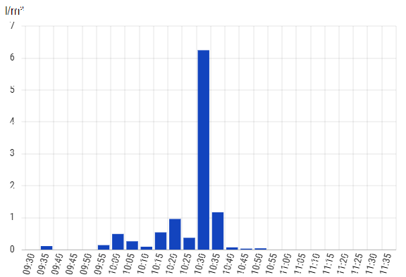

# IoBroker.drops-天气

## 用于 ioBroker 的 drops-weather 适配器
此适配器提供来自 https://www.drops.live 的降雨数据

＃＃ 特征
此适配器每隔 5 分钟从网站读取一次降雨数据。
它有一个图表数据点，可直接供 Material Design 小部件中的 BarChart 小部件使用。

5分钟和1小时的数据以不同的状态存储。

＃＃ 配置
drops.live 网站上不再提供 GPS 定位。

您需要知道您所在位置或城市的城市代码。要获取此代码，只需在 https://www.drops.live 上输入您的城市名称（或使用您的位置）。

您可以在 URL 中找到您的城市代码：

在此示例中，您将找到柏林的 6573。

## 使用 arm 架构（例如 raspberry pi）的用户须知
此适配器尝试在 Linux/ARM 架构上安装“chromium-browser”软件包。这是必需的，因为 Puppeteer 的标准安装不提供在此架构上可用的无头浏览器。如果安装失败，您可以安装任何兼容的浏览器，并在实例配置中指定浏览器的路径。

## 致谢
如果没有@inbux（https://github.com/inbux）的出色工作，这个适配器是不可能实现的，他创建了此适配器的 V1.x.x 之前的版本。

## Changelog

<!--
	Placeholder for the next version (at the beginning of the line):
	### **WORK IN PROGRESS**
-->
### 1.2.4 (2025-06-04)
- (mcm1957) fix language default.
- (mcm1957) dependencies have been updated

### 1.2.3 (2025-03-29)
- (arteck) Text is now deleted if no text is available

### 1.2.2 (2025-03-29)
- (arteck) Puppeteer-extra and puppeteer-extra-plugin-stealth have been added

### 1.2.1 (2025-03-25)
- (arteck) Language support has been added.
- (mcm1957) Unused dependencies have been removed.

### 1.2.0 (2025-03-24)
- (mcm1957) Timeout has been encreased to 15s.
- (mcm1957) Logging has been reduced.
- (arteck) Adapter has been converted to scheduled operation. 
- (mcm1957) A spelling error blocking chromium-browser manual selection has been corrected.

## License

MIT License

Copyright (c) 2025, iobroker-community-adapters <iobroker-community-adapters@gmx.de>  
Copyright (c) 2024 inbux <inbux.development@gmail.com>

Permission is hereby granted, free of charge, to any person obtaining a copy
of this software and associated documentation files (the "Software"), to deal
in the Software without restriction, including without limitation the rights
to use, copy, modify, merge, publish, distribute, sublicense, and/or sell
copies of the Software, and to permit persons to whom the Software is
furnished to do so, subject to the following conditions:

The above copyright notice and this permission notice shall be included in all
copies or substantial portions of the Software.

THE SOFTWARE IS PROVIDED "AS IS", WITHOUT WARRANTY OF ANY KIND, EXPRESS OR
IMPLIED, INCLUDING BUT NOT LIMITED TO THE WARRANTIES OF MERCHANTABILITY,
FITNESS FOR A PARTICULAR PURPOSE AND NONINFRINGEMENT. IN NO EVENT SHALL THE
AUTHORS OR COPYRIGHT HOLDERS BE LIABLE FOR ANY CLAIM, DAMAGES OR OTHER
LIABILITY, WHETHER IN AN ACTION OF CONTRACT, TORT OR OTHERWISE, ARISING FROM,
OUT OF OR IN CONNECTION WITH THE SOFTWARE OR THE USE OR OTHER DEALINGS IN THE
SOFTWARE.