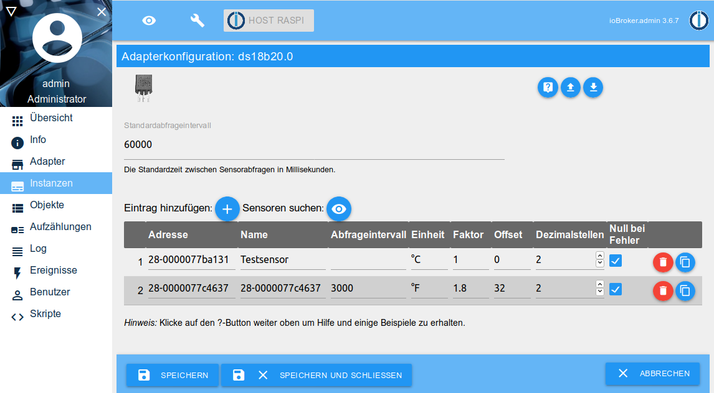

# IoBroker.ds18b20
适配器`ds18b20`可将 DS18B20 型 1-Wire 温度传感器直接集成到 ioBroker。

需要支持 1-Wire 总线的适当硬件（例如 Raspberry Pi），并且必须设置 1-Wire 总线才能在系统上工作（传感器列于 `/sys/bus/w1/devices/`）。

下面是一个将 DS18B20 传感器连接到 Raspberry Pi 的示例。

＃＃ 特征
* 读取当前温度值
* 自动检测连接的传感器
* 查询传感器时的错误检测（校验和、通信错误、设备断开连接）
* 每个传感器的轮询间隔可调
*可以禁用单个传感器
* 每个传感器测量值的四舍五入和转换可调
*通过_Remote Client_支持远程系统上的传感器

＃＃ 安装
该适配器可从稳定和最新的存储库中获得。

最新的开发版本也可以通过 GitHub URL `https://github.com/crycode-de/ioBroker.ds18b20.git` 安装。
但是，仅在极少数情况下才建议这样做！

＃＃ 配置
在适配器配置中，可以为所有传感器设置**默认轮询间隔**（以毫秒为单位）。最低为 500。

此外，如有必要，可以调整**1-Wire 器件的路径**。
这里的标准是`/sys/bus/w1/devices`，这意味着找到所有现有总线主控的传感器。
或者，可以指定到总线主控器的直接路径，例如`/sys/bus/w1/devices/w1_bus_master1`，从而仅找到该总线主控器的传感器。

为了将传感器集成到远程系统中，也可以激活和配置为此集成的服务器。

可以手动或通过**搜索传感器**将单个传感器添加到表格中。



**address** 是传感器的 1-Wire 地址/ID，同时确定对象 ID。
例如，地址为 `28-0000077ba131` 的传感器获取对象 ID `ds18b20.0.sensors.28-0000077ba131`。

对于直接连接的传感器，**Remote System ID** 未设置（空白），对于远程系统上的传感器，未设置相应远程系统的 ID。

**名称**可以自由选择以识别传感器。

可以为每个传感器指定额外的**查询间隔**（以毫秒为单位）。
如果该字段留空，则应用标准轮询间隔。
最低为 500。

**unit** 确定存储在 ioBroker 对象中的值的单位。
默认情况下，这是`°C`。

通过 **Factor** 和 **Offset** 可以根据公式`Wert = (Wert * Faktor) + Offset`调整传感器读取的值。

**小数位**表示该值四舍五入到小数位数。
在使用因子和偏移量计算之后进行舍入。

**错误归零**定义了在读取传感器时如何处理错误。
如果设置了该选项，则`null`值会在发生错误时写入传感器状态。
如果没有此选项，则在发生错误时不会更新状态。

使用 **Activated** 复选标记可以单独禁用各个传感器。

### 从 `°C` 转换为 `°F`
为了让适配器在 `°F` 中返回测量的温度，必须使用 `1.8` 作为因子，并使用 `32` 作为偏移量。

## 动作
通过写入 `ds18b20.0.actions.readNow` 状态，可以触发立即读取所有或特定传感器。

为了触发立即读取所有传感器，必须在状态中写入关键字`all`。

如果只读取特定的传感器，则必须将传感器的地址或 ioBroker 对象 ID 写入状态。

## 在脚本中使用
可以向适配器发送命令以读取传感器数据或搜索传感器。

### `readNow`
`readNow` 命令启动立即轮询所有或特定传感器。
要查询所有传感器，可以将消息部分留空，或者可以使用字符串 `all`。
要读取特定传感器，消息部分必须设置为传感器的地址或 ioBroker ID。

`readNow` 命令不返回任何数据。它只会触发传感器的即时读数。

```js
sendTo('ds18b20.0', 'readNow');
sendTo('ds18b20.0', 'readNow', '28-0000077ba131');
```

### `read`
可以通过 `read` 命令读取单个传感器。
要读取的传感器的地址或 ioBroker 对象 ID 必须指定为消息部分。
可以使用回调函数进一步处理读取的值。

```js
sendTo('ds18b20.0', 'read', '28-0000077ba131', (ret) => {
    log('ret: ' + JSON.stringify(ret));
    if (ret.err) {
        log(ret.err, 'warn');
    }
});
```

### `search`
`search`命令搜索当前连接的 1-Wire 传感器，并通过回调函数返回找到的传感器地址。

```js
sendTo('ds18b20.0', 'search', {}, (ret) => {
    log('ret: ' + JSON.stringify(ret));
    if (ret.err) {
        log(ret.err, 'warn');
    } else {
        for (let s of ret.sensors) {
            if (s.remoteSystemId) {
                log('Sensor: ' + s.address + '@' + s.remoteSystemId);
            } else {
                log('Sensor: ' + s.address);
            }
        }
    }
});
```

### `getRemoteSystems`
当前连接的远程系统的系统ID可以通过`getRemoteSystems`查询。

```js
sendTo('ds18b20.0', 'getRemoteSystems', {}, (ret) => {
    log('ret: ' + JSON.stringify(ret));
    log('Verbundene Systeme: ' + ret.join(', '));
});
```

##适配器信息
每个适配器实例通过 `ds18b20.*.info.connection` 状态提供有关所有已配置传感器是否都在提供数据的信息。
如果所有传感器的最后一次读取成功，则此状态为`true`。
一旦其中一个传感器显示错误，该状态即为`false`。

## 树莓派上的 DS18B20
DS18B20 温度传感器连接到 Raspberry Pi，如下图所示。
需要注意的是，上拉电阻必须接+3.3V而不是+5V，否则会损坏GPIO。
在本例中，使用了 GPIO.04 (BCM)。


要激活 Raspberry Pi 上的 1-Wire 总线，必须在 `/boot/config.txt` 文件中添加以下行，然后必须重新启动 Raspberry Pi。

```
dtoverlay=w1-gpio,gpiopin=4
```

如果一切正常，则连接的传感器将在 `/sys/bus/w1/devices/` 下可见。

```
$ ls -l /sys/bus/w1/devices/
insgesamt 0
lrwxrwxrwx 1 root root 0 Nov  2 11:18 28-0000077b4592 -> ../../../devices/w1_bus_master1/28-0000077b4592
lrwxrwxrwx 1 root root 0 Nov  2 11:18 28-0000077b9fea -> ../../../devices/w1_bus_master1/28-0000077b9fea
lrwxrwxrwx 1 root root 0 Nov  2 10:49 w1_bus_master1 -> ../../../devices/w1_bus_master1
```

### 在 Raspberry Pi 上使用许多传感器
在 Raspberry Pi 上可以在一条线上无差错运行的传感器数量是有限的，并且取决于某些技术条件（例如电缆长度）。
第一个（有时是随机的）故障通常来自大约 10 个传感器。

为了能够操作更多的传感器，可以将它们分成几条线（即几个GPIO）。
然后，每条线都需要自己的上拉电阻。

要激活它，只需在 `/boot/config.txt` 文件中添加几个具有相应 GPIO 编号的条目：

```
dtoverlay=w1-gpio,gpiopin=4
dtoverlay=w1-gpio,gpiopin=17
```

然后每个条目在系统中生成自己的`w1_bus_masterX`。

### 负温度下的内核错误
在 Raspberry Pi 的 5.10.y 内核中，从 2020 年 11 月中旬开始存在一个错误，例如，将负温度读取为 4092 °C。 （参见 [GitHub问题](https://github.com/raspberrypi/linux/issues/4124)）此错误已于 2021 年 2 月 8 日在内核 5.10.14 中修复。 （见[GitHub 提交](https://github.com/Hexxeh/rpi-firmware/commit/115e3a5f77488d9ee30a33bcb5ac31eb587f60a8)）`rpi-update`应该可以解决问题。

对于 v1.2.2 及以下的适配器版本，这些明显不正确的值会转移到 ioBroker 状态。
从 v1.2.3 开始，适配器还会检查读取值是否合理（介于 -80 和 +150 °C 之间）并丢弃不合理的值。

## 在远程系统中集成传感器
从 _ioBroker.ds18b20_ 的 1.4.0 版本开始，远程系统上的传感器可以通过您自己的 _ioBroker.ds18b20 Remote Client_ 直接集成。这只需要远程系统上的 Node.js。

**启用远程传感器** 必须在适配器配置中选中。然后适配器在指定端口上启动 TCP 服务器并接受来自客户端的连接。

服务器和客户端之间的连接使用`aes-256-cbc`算法加密。
为此，必须在客户端上设置适配器配置中显示的加密密钥。

_ioBroker.ds18b20 Remote Client_ 然后建立到适配器的 TCP 连接，并显示在 **Connected remote systems** 下的适配器配置中。

### IoBroker.ds18b20 远程客户端的安装
_ioBroker.ds18b20 Remote Client_ 的设置通过适配器提供。

有关设置说明，请参阅适配器配置。

## Changelog

### 1.6.0 (2022-01-29)
* (crycode-de) Added sorting of sensors in admin and keep the sort order
* (crycode-de) Allow usage of w1_bus_masterX directly as w1DevicesPath
* (crycode-de) Fixed display of errors in admin
### 1.5.4 (2022-01-06)
* (crycode-de) Catch errors while sending request to remote client (IOBROKER-DS18B20-C)

### 1.5.3 (2021-12-28)
* (crycode-de) Increased remote client protocol version to inform users that they should update their remote clients

### 1.5.2 (2021-12-19)
* (ghecker1) Fix remote client reconnect after multiple failed attempts
  * **Reinstall of remote client needed to apply this fix!**

### 1.5.1 (2021-12-12)
* (crycode-de) Fix crash on undefined obj.native
* (crycode-de) Updated remote-client-setup info in admin if https is used

### 1.5.0 (2021-12-11)
* (crycode-de) Add setting to disable specific sensors

### 1.4.2 (2021-11-22)
* (crycode-de) Added some instructions for installing remote client in admin

### 1.4.1 (2021-04-20)
* (crycode-de) Fixed bug if multiple remote sensors are used

### 1.4.0 (2021-02-21)
* (crycode-de) Support for remote sensors using an own tiny daemon and encrypted TCP sockets
* (crycode-de) Set `q` flag to `0x81` (general problem by sensor) if a sensor reported a `null` value

### 1.3.0 (2021-02-11)
* (crycode-de) Searching for sensors now works for multiple 1-wire masters

### 1.2.3 (2021-02-11)
* (crycode-de) Added check of temperatures higher/lower than possible sensor values

### 1.2.2 (2021-02-06)
* (crycode-de) Fixed crash if settings are malformed (IOBROKER-DS18B20-3)

### 1.2.1 (2021-01-09)
* (crycode-de) Small fixes
* (crycode-de) Updated dependencies

### 1.2.0 (2020-12-21)
* (crycode-de) Added Sentry error reporting
* (crycode-de) Updated dependencies
* (crycode-de) Optimized npm package

### 1.1.5 (2020-10-14)
* (crycode-de) Fixed incorrect data type of object
* (crycode-de) Updated dependencies

### 1.1.4 (2020-02-03)
* (crycode-de) Updated connectionType and dataSource in io-package.json.

### 1.1.3 (2020-01-23)
* (crycode-de) Added `connectionType` in `io-package.json` and updated dependencies.

### 1.1.2 (2020-01-22)
* (crycode-de) Better handling of changed objects in admin.

### 1.1.1 (2020-01-09)
* (crycode-de) Fixed wrong communication errror detection on some sensors.

### 1.1.0 (2019-11-11)
* (crycode-de) Own implementation of reading the sensor data.
* (crycode-de) Fixed bug on decimals rounding.
* (crycode-de) 1-wire devices path is now configurable.

### 1.0.3 (2019-11-03)
* (crycode-de) Added documentation about DS18B20 at a Raspberry Pi; Dependencies updated

### 1.0.2 (2019-10-07)
* (crycode-de) Display error message when tried to search for sensors without adapter running.

### 1.0.1 (2019-10-01)
* (crycode-de) Type changed to hardware, Renamed command, Added missing documentation

### 1.0.0 (2019-09-09)
* (crycode-de) initial release

## License

Copyright (c) 2019-2022 Peter Müller <peter@crycode.de>

### MIT License

Permission is hereby granted, free of charge, to any person obtaining
a copy of this software and associated documentation files (the
"Software"), to deal in the Software without restriction, including
without limitation the rights to use, copy, modify, merge, publish,
distribute, sublicense, and/or sell copies of the Software, and to
permit persons to whom the Software is furnished to do so, subject to
the following conditions:

The above copyright notice and this permission notice shall be
included in all copies or substantial portions of the Software.

THE SOFTWARE IS PROVIDED "AS IS", WITHOUT WARRANTY OF ANY KIND,
EXPRESS OR IMPLIED, INCLUDING BUT NOT LIMITED TO THE WARRANTIES OF
MERCHANTABILITY, FITNESS FOR A PARTICULAR PURPOSE AND
NONINFRINGEMENT. IN NO EVENT SHALL THE AUTHORS OR COPYRIGHT HOLDERS BE
LIABLE FOR ANY CLAIM, DAMAGES OR OTHER LIABILITY, WHETHER IN AN ACTION
OF CONTRACT, TORT OR OTHERWISE, ARISING FROM, OUT OF OR IN CONNECTION
WITH THE SOFTWARE OR THE USE OR OTHER DEALINGS IN THE SOFTWARE.