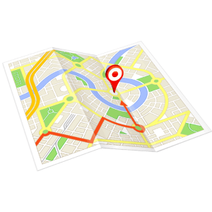

## IoBroker.egigeozone2
[![测试与发布]（https://github.com/obakuhl/ioBroker.egigeozone2/actions/workflows/test-and-release.yml/badge.svg）](https://github.com/obakuhl/ioBroker.egigeozone2/actions/workflows/test-and-release.yml) 

**此适配器使用 Sentry 库自动向开发人员报告异常和代码错误。** 有关更多详细信息以及如何禁用错误报告的信息，请参阅[Sentry-插件文档](https://github.com/ioBroker/plugin-sentry#plugin-sentry)！从 js-controller 3.0 开始使用 Sentry 报告。

＃＃ 描述
这是适用于 Android 地理围栏应用“EgiGeoZone”（[网站](https://egigeozone.de/)）的 ioBroker 适配器。当您使用移动设备进入或离开指定区域时，它可以接收地理围栏事件作为 HTTP 请求。

## 安全建议
不建议将此适配器暴露给公共互联网（例如，通过打开路由器中配置的端口）。这意味着对此端口的任何请求都将转发到适配器正在运行的 ioBroker 实例。有多种方法可以提高访问此适配器的安全性：

* 始终使用 VPN 连接来处理请求或
* 集成代理服务器（例如 nginx）用于过滤传入的请求。

＃＃ 配置
在 EgiGeoZone 中，应使用以下语法定义 URL：

协议://地址:端口/人

* **协议**可以是 **http** 或 **https**。
* **address** 应该是适配器实例可访问的地址。
* **port** 应该是适配器正在监听的端口。
* **person** 是将用于在 atHome 数组中列出的人。

### 示例
* https://my-domain:7654/John 或
* http://我的域名:7654/Paul

## 致谢
该实现主要基于 dschaedl 的 [ioBroker.geofency](https://github.com/ioBroker/ioBroker.geofency) 和 BasGo 的 [ioBroker.egigeozone](https://github.com/BasGo/ioBroker.egigeozone) 适配器。

## Changelog

### 1.0.6
* (obakuhl) Improved object definition
* (obakuhl) New icon

### 1.0.5
* (obakuhl) use `@iobroker/webserver`

### 1.0.4
* (obakuhl) Password encryption active, minor code improvements

### 1.0.3
* (obakuhl) Updating dependencies

### 1.0.2
* (obakuhl) Updating dependencies

### 1.0.1
* (obakuhl) Resolved minor issue when leaving location 
* (obakuhl) Raised minimum version of adapter-core to 3.1.4 and node >= 18

### 1.0.0
* (obakuhl) Refactoring
* (obakuhl) New name (ioBroker.egigeozone -> ioBroker.egigeozone2) necessary due to npm collaborators settings of [previous adapter ioBroker.egigeozone](https://github.com/BasGo/ioBroker.egigeozone)

## License
This adapter is licensed under the [MIT license](../blob/master/LICENSE) which is part of this repository.

Copyright (c) 2024 obakuhl <hello@obakuhl.com>

Permission is hereby granted, free of charge, to any person obtaining a copy
of this software and associated documentation files (the "Software"), to deal
in the Software without restriction, including without limitation the rights
to use, copy, modify, merge, publish, distribute, sublicense, and/or sell
copies of the Software, and to permit persons to whom the Software is
furnished to do so, subject to the following conditions:

The above copyright notice and this permission notice shall be included in all
copies or substantial portions of the Software.

THE SOFTWARE IS PROVIDED "AS IS", WITHOUT WARRANTY OF ANY KIND, EXPRESS OR
IMPLIED, INCLUDING BUT NOT LIMITED TO THE WARRANTIES OF MERCHANTABILITY,
FITNESS FOR A PARTICULAR PURPOSE AND NONINFRINGEMENT. IN NO EVENT SHALL THE
AUTHORS OR COPYRIGHT HOLDERS BE LIABLE FOR ANY CLAIM, DAMAGES OR OTHER
LIABILITY, WHETHER IN AN ACTION OF CONTRACT, TORT OR OTHERWISE, ARISING FROM,
OUT OF OR IN CONNECTION WITH THE SOFTWARE OR THE USE OR OTHER DEALINGS IN THE
SOFTWARE.