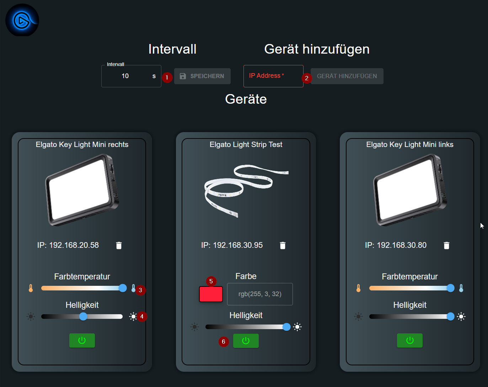
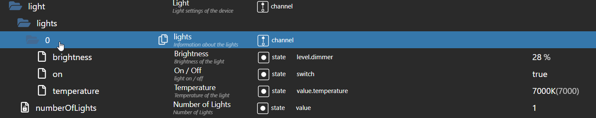
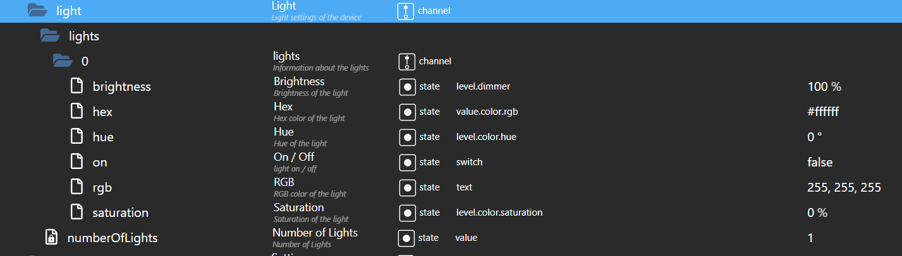

# IoBroker.elgato-key-light
**测试：** 

## IoBroker 的 elgato-key-light 适配器
### 免责声明
所有产品和公司名称或徽标均为其各自所有者的 Trademarks™ 或 Registered® 商标。它们的使用并不意味着它们或关联附属公司有任何从属关系或认可！这个个人项目是出于娱乐目的而进行的，没有商业目标。 **Elgato** 是 **Corsair GmbH** 的商标。

### 哨兵
**此适配器使用 Sentry 库自动向开发人员报告异常和代码错误。**\ 有关更多详细信息以及有关如何禁用错误报告的信息，请参阅。
[Sentry 插件文档](https://github.com/ioBroker/plugin-sentry#plugin-sentry)! Sentry 报告从 js-controller 3.0 开始使用。

### 制作人员
如果没有 @xXBJXx (https://github.com/xXBJXx) 的伟大工作，这个适配器就不可能实现，他创建了这个适配器，并希望将来再次维护它。

＃＃＃ 描述
该适配器允许您通过 ioBroker 控制[埃尔加托主灯](https://www.elgato.com/de/key-light)。该适配器支持以下功能：

* 电源开/关。
* 亮度 ð （适用于所有主灯）。
* 色温 ð （仅适用于 [Elgato Key Light](https://www.elgato.com/de/key-light)、[Elgato Key Light Air](https://www.elgato.com/de/键-光-空气），

[埃尔加托环形灯](https://www.elgato.com/de/ring-light) 和 [Elgato Key Light 迷你](https://www.elgato.com/de/key-light-mini) 可用）

* 颜色 ⇒（仅适用于 [Elgato 灯带](https://www.elgato.com/de/light-strip)）

### 适配器用户界面
实例下不存在经典适配器 UI。\  

在 UI 中可以做什么？

* No. 1 设置适配器的轮询间隔（默认值：60 秒）。

  更改间隔后，必须重新启动适配器，这是使用“保存”按钮完成的。

* No.2 添加一个新设备到适配器。
* No.3 设置所有关键灯的色温（2900K 至 7000K）
* No. 4 设置所有主灯的亮度（0% 到 100%）
* No. 5 设置灯带的颜色\

  

* 6号开关灯

**更改3号、4号、5号时，1.5秒后执行更改。**

＃＃＃ 警告
**请不要过于频繁地访问数据点，否则设备将在几秒钟内无法访问。**

＃＃＃ 数据点
发现新设备时会自动创建数据点。

#### 所有主灯/灯带的数据点
\ 数据点分为：

* **信息** ⇒ 有关设备的信息\。

  

* **灯** ® 用于控制设备的数据点，这里有两种不同类型的数据点：
  * 用于控制亮度和色温。

    

  * 用于控制颜色

    

* **设置** ® 设备设置信息的数据点

  

### 注释
* 颜色数据点仅适用于灯带。
* 色温数据点仅适用于主灯。
* 亮度数据点适用于所有主灯和灯带。
* 不支持灯带场景。因为它们无法通过 API 访问。

## Changelog
<!--
    Placeholder for the next version (at the beginning of the line):
    ### **WORK IN PROGRESS**
-->
### 1.0.1 (2024-01-18)
* (mcm1957) Writing states now requires ack flag to be false.
* (mcm1957) Small adaptions to solve review issues have been applied.

### 1.0.0 (2024-01-18)
* (mcm1957) Adapter requires node.js 18 or newer now
* (mcm1957) Adapter has been moved into iobroker-community-adapters area
* (mcm1957) Dependencies have been updated

### 0.2.0 (2023-02-26)
* (xXBJXx) updated dependencies
* (xXBJXx) Updating the UI to the new functions of the iobroker-react library

### 0.1.0 (2023-02-06)
* (xXBJXx) removed the Bonjour search, because it did not work properly
* (xXBJXx) Adding a delete function for devices
* (xXBJXx) Dependency updates
* (xXBJXx) feature request [#2](https://github.com/xXBJXx/ioBroker.elgato-key-light/issues/2) added

### 0.0.3 (2023-01-22)
* (xXBJXx) changed all images to png

## License
MIT License

Copyright (c) 2024 iobroker-community-adapters <mcm57@gmx.at>
Copyright (c) 2023 xXBJXx <issi.dev.iobroker@gmail.com>

Permission is hereby granted, free of charge, to any person obtaining a copy
of this software and associated documentation files (the "Software"), to deal
in the Software without restriction, including without limitation the rights
to use, copy, modify, merge, publish, distribute, sublicense, and/or sell
copies of the Software, and to permit persons to whom the Software is
furnished to do so, subject to the following conditions:

The above copyright notice and this permission notice shall be included in all
copies or substantial portions of the Software.

THE SOFTWARE IS PROVIDED "AS IS", WITHOUT WARRANTY OF ANY KIND, EXPRESS OR
IMPLIED, INCLUDING BUT NOT LIMITED TO THE WARRANTIES OF MERCHANTABILITY,
FITNESS FOR A PARTICULAR PURPOSE AND NONINFRINGEMENT. IN NO EVENT SHALL THE
AUTHORS OR COPYRIGHT HOLDERS BE LIABLE FOR ANY CLAIM, DAMAGES OR OTHER
LIABILITY, WHETHER IN AN ACTION OF CONTRACT, TORT OR OTHERWISE, ARISING FROM,
OUT OF OR IN CONNECTION WITH THE SOFTWARE OR THE USE OR OTHER DEALINGS IN THE
SOFTWARE.