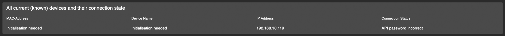

# IoBroker.esphome
[](https://weblate.iobroker.net/engage/adapters/?utm_source=widget)

**测试：**

**此适配器使用 Sentry 库自动向开发人员报告异常和代码错误。**有关更多详细信息以及如何禁用错误报告的信息，请参阅[Sentry-Plugin 文档](https://github.com/ioBroker/plugin-sentry#plugin-sentry)！从 js-controller 3.0 开始使用 Sentry 报告。

## ESPHome ioBroker 适配器
使用 ESPHome 创建和管理的简单而强大的配置文件控制您的 ESP8266/ESP32。
ESPHome 管理设备（包括仪表盘）通过其原生 API 进行原生集成，并确保所有数据同步（实时事件处理，无需数据轮询！:)


**快速链接：**

- 📋 [常见问题 - 常见问题](#frequently-asked-questions-faq)
- ⚙️ [先决条件和设置](#prerequisites)
-🎛️[仪表板集成](#esphome-dashboard-integration-optional)
- 📱 [设备管理](#device-management)
- 🔧 [配置示例](#example-config)

此适配器使用[esphome-native-api](https://github.com/Nafaya/esphome-native-api#readme) 感谢 @Nafaya 与 [ESPHome API] 交互](https://esphome.io/components/api.html?highlight=api)！

## 常见问题 (FAQ)
### IoBroker ESPHome 适配器和 ESPHome 仪表板有什么区别？
**ioBroker ESPHome 适配器：**

- 将您的 ESPHome 设备集成到 ioBroker 中，实现家庭自动化控制
- 通过 ESPHome 的原生 API 直接与 ESP 设备通信
- 创建 ioBroker 状态/对象用于设备控制和监控
- 处理实时设备状态更新（无需轮询）
- 在 ioBroker 中管理设备配置

**ESPHome 仪表板：**

- 用于创建、编辑和管理 ESPHome 设备配置的 Web 界面
- 用于编写 YAML 配置、编译固件和刷新设备
- 可以作为可选功能集成到 ioBroker 的管理界面中
- 可以与此适配器集成运行，也可以作为外部安装运行（Docker，独立）

**总结：**适配器在 ioBroker 内控制您的设备，而仪表板管理设备配置和固件。

### 如何配置仪表板 IP 选择器？
适配器配置中的仪表板 IP 设置有不同的用途：

**对于 ioBroker Admin 中的集成仪表板选项卡：**

1. 输入 ESPHome Dashboard 运行的 IP 地址和端口
2. **内置仪表板**：使用 `127.0.0.1:6052`（集成仪表板的默认值）
3. **外部仪表板**：使用外部 ESPHome 安装的 IP:端口（例如，Docker 容器）
4. **HTTPS 设置**：对于 HTTPS 环境，请参阅下面的详细 HTTPS 配置部分

**仪表板 IP 示例：**

- 内置：`127.0.0.1:6052`
- 外部 Docker：`192.168.1.100:6052`
- 外部主机：`esphome.local:6052`
- HTTPS 代理：`https://192.168.1.50:8082/proxy.0/esphome/`


**注意：**您可以使用此适配器控制 ESPHome 设备，而无需配置仪表板 IP。仅当您想将 ESPHome 仪表板界面集成到 ioBroker 的管理面板中时，才需要仪表板 IP。

### 我需要 ESPHome 仪表板才能使用此适配器吗？
**不，仪表板是可选的。**您可以通过多种方式使用此适配器：

1. **仅限适配器**：无需任何仪表板集成即可控制预配置的 ESPHome 设备
2. **适配器 + 外部仪表板**：使用您现有的 ESPHome 安装（Docker，独立），并可选择将其集成到 ioBroker 的界面中
3. **适配器 + 内置仪表板**：启用集成的 ESPHome 仪表板功能，获得完整的解决方案

该适配器独立工作，只需要在配置中启用 ESPHome API 的设备。

### 如何向适配器添加设备？
1. **确保设备的 YAML 配置中已启用 ESPHome API**（请参阅先决条件部分）
2. 在 ioBroker Admin 中**打开适配器的设备选项卡**（适配器必须正在运行）
3. **手动添加设备**：输入设备 IP 地址和身份验证凭据
4. **自动发现**：当前已禁用（参见问题 #175）

适配器将建立连接并创建设备控制所需的所有必要 ioBroker 对象。

## [文档](https://DrozmotiX.github.io/languages/en/Adapter/ESPHome/)

## [文档](https://DrozmotiX.github.io/languages/en/Adapter/ESPHome/)
我们所有的适配器文档都可以在[DrozmotiX 文档页面](https://DrozmotiX.github.io/languages/en/Adapter/ESPHome/) --> 找到

## 先决条件
* NodeJS >= 18.x
* API 在 YAML 中激活
* 对于管理选项卡（可选）
* ESPHome Dashboard IP 在实例设置中提供

## ESPHome 仪表板集成（可选）
此适配器可以选择将 ESPHome Dashboard 集成到 ioBroker 的管理界面。您有以下几种选择：

**选项 1：内置仪表板（推荐给初学者）**

- 在适配器设置中启用“ESPHome 仪表板的本机集成”
- 使用集成 Python 环境（无需外部设置）
- 仪表板默认在端口 6052 上运行
- 将仪表板 IP 设置为“127.0.0.1:6052”以进行管理员集成

**选项 2：外部仪表板**

- 使用现有的 ESPHome 安装（Docker、独立等）
- 在适配器设置中输入外部仪表板的 IP：端口
- 例如：Docker 容器的“192.168.1.100:6052”

**选项 3：无仪表板集成**

- 完全跳过仪表板配置
- 使用外部 ESPHome 工具进行设备配置
- 适配器仍正常控制设备


> **💡 请参阅上面的常见问题解答**，了解有关仪表板 IP 配置以及适配器与仪表板差异的详细说明。

### 使用 HTTPS
使用 HTTPS 的一个原因是能够直接刷新到插入您电脑的设备，因为 esphome 不允许使用 http 进行此操作（可能是 WebSerial 的浏览器限制）。


当 iobroker 使用 https 时使用集成仪表板目前需要更多步骤：

1. 安装 - 如果您还没有安装 - Web 适配器并配置 https。有关更多信息，请参阅 Web 文档：[ioBroker.web](https://github.com/ioBroker/ioBroker.web)
2. 安装 [proxy](https://github.com/ioBroker/ioBroker.proxy) 适配器
3.在代理适配器设置中配置路径：
1. 上下文：`esphome/`
2. 网址：`http://localhost:6052`


4. 在 esphome 适配器设置 - esphome 仪表板的高级部分中配置完整的仪表板 URL：
1. 例如：`https://<iobrokerIP>:<webAdapterPort>/proxy.0/esphome/`
2. 其中 `<iobrokerIP>` 是运行 iobroker 的主机的 IP（与上面相同）
3. `<webAdapterPort>` 是 Web 适配器的端口（默认为 8082）
4. 它看起来应该是这样的：

   

5. 如果您在外部主机上运行仪表板，您也可以在此处使用外部仪表板实例的 URL

## 如何使用此适配器
### 在 YAML 中激活 API
> [!IMPORTANT] > ioBroker ESPHome 允许通过加密密钥（推荐）或 API 密码（旧版）集成设备， > 您必须相应地指定身份验证设置， > 请参阅[ESPHome 文档](https://esphome.io/components/api.html?highlight=api) > 请仅配置加密密钥（首选）或 API 密码（旧版）

#### 示例加密密钥配置条目
```
api:
  encryption:
    key: "DyDfEgDzmA9GlK6ZuLkj3qgFcjXiZUzUf4chnIcjQto="
```

#### 示例 API 配置条目
```
api:
  password: 'MyPassword'
```

## 设备管理
### 添加/修改/删除 ESPHome 设备到 ioBroker
> [!IMPORTANT] > 此适配器集成了与支持 ESPHome 的设备的通信，以及（如果已激活）集成版本的 ESPHome Dashboard。
> 您必须自行配置和上传您的 ESP 配置，可以使用集成的 Dashboard 或外部替代方案（如 Docker），然后才能将它们集成到 ioBroker

> **💡 请参阅上面的常见问题解答**，获取有关向适配器添加设备的分步指导。

设备选项卡将显示所有当前已知的设备；您可以等待设备自动检测（当前已禁用，请参阅#175）或通过提供其 IP 地址和凭据手动添加它们


> [!NOTE] > 仅当适配器正在运行时，添加/修改/删除设备和加载设备表的按钮才可用！ > 您必须通过按“刷新设备概览”手动刷新设备表，所有设备及其连接状态将显示

请输入 IP 地址（如果已知设备，您可以从下拉列表中选择它）并选择适当的操作：

- 添加/修改设备
- 将发送 IP 地址和凭证到后端并尝试建立连接
- 当提供加密密钥时，API 密码将被忽略，请确保 YAML 配置正确！

- 删除设备
- 将向后端发送一条消息以删除此设备

> [!WARNING] > 此操作将从 ioBroker 中删除选定的设备及其所有相关状态！

> [!NOTE] > 添加设备后，将显示一条消息指示成功或错误， > 您可以刷新表格以显示当前设备及其连接状态

 

如果连接成功，设备将启动，并创建所有相关状态来控制其属性。
对 YAML 配置进行任何更改时，重新启动 ESP 将断开连接并启动新的连接。
在此过程中，不再属于 YAML 配置的状态将被自动删除。


### 示例配置
示例配置，更多示例请参见[DrozmotiX 文档页面](https://DrozmotiX.github.io) 或 [ESPHome 文档](https://esphome.io/index.html)

<details><summary>显示示例配置</summary>

esphome：名称：sensor_badkamer 平台：ESP32 开发板：esp-wrover-kit

wifi：使用地址：192.168.10.122 ssid：“xxxxx” 密码：“xxxxxx”

# 启用 ESPHome API
api：密码：'我的密码'

# 激活 i2c 总线 i2c: sda: 21 scl: 22 scan: True id: bus_a
# Bh1750 的示例配置
    传感器：

平台：bh1750

名称：“Hal_Illuminance” 地址：0x23 测量时间：69 更新间隔：10s

# GPIO 输出的示例配置
    输出：

平台：gpio

引脚：12 反转：真 id：gpio_12

# 将交换机链接到先前定义的输出的示例配置
    转变：

- 平台：输出

名称：“通用输出”输出：“gpio_12”</details>

## Tasmota / ESPEasy 迁移
从之前的 Sonoff Tasmota 或 ESPEasy 设置迁移非常简单。您只需让 ESPHome 为您创建一个二进制文件，然后将其上传到 Web 界面即可。
更多详情，请参阅我们的[文档页面](https://DrozmotiX.github.io/languages/en/Adapter/ESPHome/06.migration.html)

**_注意：_** 生成的 yaml 文件存储在 ```/opt/iobroker/iobroker-data/iobroker.esphome.>instance</>device<.yaml

## 支持我
如果您喜欢我的作品，请考虑个人捐赠（这是 DutchmanNL 的个人捐赠链接，与 ioBroker 项目无关！）[![捐赠]（https://raw.githubusercontent.com/DrozmotiX/ioBroker.sourceanalytix/main/admin/button.png）](http://paypal.me/DutchmanNL)

## Changelog

<!--
    Placeholder for the next version (at the beginning of the line):
    ### __WORK IN PROGRESS__
    * (DutchmanNL) 
-->
### 0.6.3 (2025-09-16)
* (@DutchmanNL) Fixed an admin error related to `jsonConfig` validation. #287
* (@DutchmanNL) Various general fixes and dependency updates to improve stability.
* (@DutchmanNL) Improved responsive design for better usability across devices. #284
* (@DutchmanNL) Introduced GitHub Actions to automatically verify the ESPHome Dashboard. #290
* (@DutchmanNL) Added a comprehensive FAQ section to the README to help users with common questions. #286
* (@DutchmanNL) Updated the `esphome-native-api` library to V1.3.3, which may resolve connection issues. #201

### 0.6.2 (2025-08-08)
* (@SimonFischer04) add support for text device type #141, displays #103
* (@SimonFischer04) fix cover device type #156
* (@SimonFischer04) workaround: downgrade python for now. fixes #259

### 0.6.1 (2025-05-24)
* (@SimonFischer04) Update esphome
* (@ticaki) Optimize admin configuration interface
* (@DutchmanNL) Optimize backend handling of device discovery
* (@DutchmanNL) Capability to select ESPHome Dashboard version added, resolves #118

### 0.5.0-beta.8 (2023-11-24)
* (DutchmanNL) Capability to automatically detect new devices added
* (DutchmanNL) Ensures a compatible pillow version is used (10.0.1)
* (SimonFischer04) Add pillow python package by default, resolves #188

### 0.5.0-beta.4 (2023-11-15)
* (DutchmanNL) Refactor memory caching of device data, resolves #189

## License
MIT License

Copyright (c) 2023-2025 DutchmanNL <rdrozda86@gmail.com>

Permission is hereby granted, free of charge, to any person obtaining a copy
of this software and associated documentation files (the "Software"), to deal
in the Software without restriction, including without limitation the rights
to use, copy, modify, merge, publish, distribute, sublicense, and/or sell
copies of the Software, and to permit persons to whom the Software is
furnished to do so, subject to the following conditions:

The above copyright notice and this permission notice shall be included in all
copies or substantial portions of the Software.

THE SOFTWARE IS PROVIDED "AS IS", WITHOUT WARRANTY OF ANY KIND, EXPRESS OR
IMPLIED, INCLUDING BUT NOT LIMITED TO THE WARRANTIES OF MERCHANTABILITY,
FITNESS FOR A PARTICULAR PURPOSE AND NONINFRINGEMENT. IN NO EVENT SHALL THE
AUTHORS OR COPYRIGHT HOLDERS BE LIABLE FOR ANY CLAIM, DAMAGES OR OTHER
LIABILITY, WHETHER IN AN ACTION OF CONTRACT, TORT OR OTHERWISE, ARISING FROM,
OUT OF OR IN CONNECTION WITH THE SOFTWARE OR THE USE OR OTHER DEALINGS IN THE
SOFTWARE.