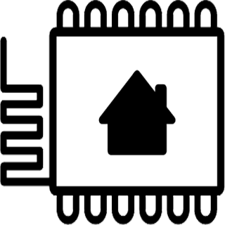

# IoBroker.esphome
[](https://weblate.iobroker.net/engage/adapters/?utm_source=widget)

**测试：** 

**此适配器使用 Sentry 库自动向开发者报告异常和代码错误。** 更多详情以及如何禁用错误报告，请参阅 [Sentry插件文档](https://github.com/ioBroker/plugin-sentry#plugin-sentry)！Sentry 报告功能从 js-controller 3.0 开始使用。

## 适用于 ioBroker 的 ESPHome 适配器
使用 ESPHome 创建和管理的简单而强大的配置文件，即可控制您的 ESP8266/ESP32。

通过其原生 API 实现与 ESPHome 管理设备（包括仪表盘）的本地集成，并确保所有数据同步（实时事件处理，无需数据轮询！）。


**快速链接：**

- 📋 [常见问题解答](#frequently-asked-questions-faq)
- ⚙️ [先决条件和设置](#prerequisites)
- 🎛️ [仪表盘集成](#esphome-dashboard-integration-optional)
- 📱 [设备管理](#device-management)
- 🔧 [配置示例](#example-config)

此适配器使用 [esphome-native-api](https://github.com/twocolors/esphome-native-api#readme)，感谢 @twocolors 为与 [ESPHome API] 交互所做的贡献](https://esphome.io/components/api.html?highlight=api)！

常见问题解答 (FAQ)
### IoBroker ESPHome Adapter 和 ESPHome Dashboard 有什么区别？
**ioBroker ESPHome 适配器：**

- 将您的 ESPHome 设备集成到 ioBroker 中，以实现家庭自动化控制
- 通过 ESPHome 的原生 API 直接与 ESP 设备通信
- 创建用于设备控制和监控的 ioBroker 状态/对象
- 处理实时设备状态更新（无需轮询）
- 管理 ioBroker 中的设备配置

**ESPHome 控制面板：**

- 用于创建、编辑和管理 ESPHome 设备配置的 Web 界面
用于编写 YAML 配置、编译固件和烧录设备
- 可作为可选功能集成到 ioBroker 的管理界面中
- 既可以与此适配器集成运行，也可以作为外部安装（Docker、独立运行）运行。

**总结：** 适配器控制 ioBroker 中的设备，而控制面板管理设备配置和固件。

### 如何配置仪表盘 IP 选择器？
适配器配置中的仪表盘 IP 设置有不同的用途：

**ioBroker 管理后台集成仪表盘选项卡：**

1. 输入 ESPHome 控制面板运行所在的 IP 地址和端口。
2. **内置仪表盘：** 使用您的 ioBroker 主机的 IP 地址（例如，`192.168.1.10:6052`）
- **重要提示：** 如果您从其他设备访问 ioBroker，请勿使用 `127.0.0.1:6052`（或 `localhost:6052`）——因为 iframe 会尝试从客户端浏览器访问 127.0.0.1，而不是 ioBroker 服务器。
- 仅当您仅从运行 ioBroker 的同一台机器访问 ioBroker 管理后台时，才使用 `127.0.0.1:6052`。
3. **外部控制面板：** 使用外部 ESPHome 安装的 IP:端口（例如，`192.168.1.100:6052`）
4. **HTTPS 设置：** 有关 HTTPS 环境的详细配置，请参阅下面的 HTTPS 配置部分。

**仪表盘 IP 示例：**

- 内置（可通过网络访问）：`192.168.1.10:6052`（请替换为您的 ioBroker 主机 IP 地址）
- 内置（仅限本地）：`127.0.0.1:6052`（仅当管理员在同一台机器上访问时才可用）
- 外部主机：`esphome.local:6052` 或 `192.168.1.100:6052`
- HTTPS 代理：`https://192.168.1.50:8082/proxy.0/esphome/`


**注意：**您可以使用此适配器控制 ESPHome 设备，而无需配置仪表盘 IP 地址。只有当您想将 ESPHome 仪表盘界面集成到 ioBroker 管理面板中时，才需要配置仪表盘 IP 地址。

### 我需要 ESPHome Dashboard 才能使用此适配器吗？
**不，仪表盘是可选的。** 您可以通过多种方式使用此适配器：

1. **仅适配器：** 控制预配置的 ESPHome 设备，无需任何仪表盘集成
2. **适配器 + 外部控制面板：** 使用您现有的 ESPHome 安装（Docker 或独立版本），并可选择将其集成到 ioBroker 的界面中。
3. **适配器 + 内置仪表盘：**启用集成的 ESPHome 仪表盘功能，即可获得完整的解决方案

该适配器可独立工作，仅需在配置中启用 ESPHome API 的设备即可。

### 如何将设备添加到适配器？
1. **请确保已在设备的 YAML 配置中启用 ESPHome API**（请参阅“前提条件”部分）。
2. 在 ioBroker 管理后台中打开适配器的设备选项卡（适配器必须正在运行）。
3. **手动添加设备：** 输入设备 IP 地址和身份验证凭据
4. **自动发现：** 如果适配器设置中启用了自动发现功能，请使用该功能。

适配器将建立连接并创建设备控制所需的所有 ioBroker 对象。

我在 ESPHome 控制面板中配置了一个设备，但它没有显示在适配器中。
**重要提示：**适配器和控制面板是完全独立的组件，彼此之间没有自动集成。适配器可以出于方便起见，选择性地为您安装（并启动）控制面板。再次强调，这并不意味着它们之间存在任何集成。

- **控制面板：**用于创建/编辑 YAML 配置、编译固件和刷写设备
- **适配器：**用于控制设备并将其状态与 ioBroker 同步。

**要使通过仪表板配置的设备与适配器配合使用：**

1. 使用控制面板中的配置刷写设备（确保在 YAML 中启用 ESPHome API）
2. 在适配器设置（设备选项卡）中手动添加设备。输入 IP 地址/主机名和加密密钥（推荐）或密码（旧版）。
3. 然后，适配器将通过 ESPHome 的原生 API 连接到设备。

**注意：**未来可能会实现仪表板和适配器之间更紧密的集成（参见问题 #228），但目前它们是独立运行的。

我在适配器中配置了一个设备，但它没有显示在仪表板中。
**这是预期行为** - 适配器和仪表板不会自动同步设备配置。

- 该**适配器**通过ESPHome的原生API连接到设备，用于控制/监控。
- **控制面板**用于管理 YAML 配置和固件编译

**如果您想将设备安装在仪表盘上：**

**选项 1：**

1. ESPHome 控制面板可以自动发现同一网络中的设备。
2. 在控制面板中，已发现的设备将显示“采用”按钮。
3. 点击“采用”按钮，将其添加到您的仪表板以进行配置管理。

**方案二：**

- 在控制面板中创建一个新设备，并将您现有的 yaml 文件复制到该设备中。

**注意：**如果您只想通过ioBroker控制设备，则无需在控制面板中添加设备。控制面板仅用于创建/修改设备配置。

### 如何安装/更新 Python
简而言之：你不需要！

该适配器不关心您系统上已安装的 Python 版本。它会自动安装并创建自己的 Python 环境，并确保版本正确。因此，如果您不了解自己在做什么，请不要随意修改系统上的 Python 命令。

## [文档](https://DrozmotiX.github.io/languages/en/Adapter/ESPHome/)

## [文档](https://DrozmotiX.github.io/languages/en/Adapter/ESPHome/)
我们所有的适配器文档都可以在 [DrozmotiX 文档页面](https://DrozmotiX.github.io/languages/en/Adapter/ESPHome/) --> 找到。

## 先决条件
* NodeJS >= 20.x
* API 已在 YAML 中激活
* 管理员标签页（可选）
* ESPHome 控制面板 IP 地址在实例设置中提供

## ESPHome 控制面板集成（可选）
此适配器可选择将 ESPHome 控制面板集成到 ioBroker 的管理界面中。您有以下几种选择：

**选项 1：内置仪表盘（推荐给初学者）**

- 在适配器设置中启用“ESPHome Dashboard 原生集成”
- 使用集成的 Python 环境（无需外部设置）
- 控制面板默认运行在 6052 端口。
- 将控制面板 IP 设置为 `127.0.0.1:6052` 以进行管理员集成

**选项 2：外部控制面板**

- 使用现有的 ESPHome 安装（Docker、独立版本等）
- 在适配器设置中输入外部控制面板的 IP 地址和端口号
例如：Docker 容器的 `192.168.1.100:6052`

**选项 3：不集成仪表盘**

- 完全跳过仪表盘配置
- 使用外部 ESPHome 工具进行设备配置
适配器仍能正常控制设备。


> **💡 请参阅上面的常见问题解答**，了解有关仪表板 IP 配置和适配器与仪表板差异的详细说明。

### 使用 HTTPS
使用 HTTPS 的一个原因是能够直接将固件刷入插入电脑的设备，因为 esphome 不允许使用 http 进行此操作（可能是浏览器对 WebSerial 的限制）。


目前，当 iobroker 使用 https 时，使用集成仪表板需要更多步骤：

1. 如果尚未安装，请安装 Web 适配器并配置 HTTPS。更多信息请参阅 Web 文档：[ioBroker.web](https://github.com/ioBroker/ioBroker.web)
2. 安装 [proxy](https://github.com/ioBroker/ioBroker.proxy) 适配器
3. 在代理适配器设置中配置路径：
1. 上下文：`esphome/`
2. 网址：`http://localhost:6052`


4. 在 esphome 适配器设置的高级部分配置完整的仪表板 URL - esphome 仪表板：
1. 例如：`https://<iobrokerIP>:<webAdapterPort>/proxy.0/esphome/`
2. 其中 `<iobrokerIP>` 是运行 iobroker 的主机的 IP 地址（与上面相同）
3. `<webAdapterPort>` 是 Web 适配器的端口（默认为 8082）。
4. 它应该看起来像这样：

   

5. 如果您在外部主机上运行仪表板，也可以在此处使用外部仪表板实例的 URL。

## 如何使用此适配器
### 在 YAML 中激活 API
[重要提示] ioBroker ESPHome 允许通过加密密钥（推荐）或 API 密码（旧版）集成设备，您必须相应地指定身份验证设置，请参阅 [ESPHome 文档](https://esphome.io/components/api.html?highlight=api)。请仅配置加密密钥（推荐）或 API 密码（旧版）。

#### 加密密钥配置示例条目
```
api:
  encryption:
    key: "DyDfEgDzmA9GlK6ZuLkj3qgFcjXiZUzUf4chnIcjQto="
```

#### API 配置示例条目
```
api:
  password: 'MyPassword'
```

## 设备管理
### 向 ioBroker 添加/修改/移除 ESPHome 设备
【重要提示】此适配器集成了与支持 ESPHome 的设备的通信，并且（如果已激活）集成了 ESPHome 控制面板。

您必须自行配置并上传 ESP 配置，可以使用集成控制面板或外部替代方案（例如 Docker），然后才能将其集成到 ioBroker 中。

> **💡请参阅上面的常见问题解答**，了解如何将设备添加到适配器的分步指南。

设备选项卡将显示所有当前已知的设备；您可以等待设备自动检测（目前已禁用，请参阅 #175），也可以手动添加设备，方法是提供设备的 IP 地址和凭据。


【注意】只有在适配器运行时，添加/修改/移除设备和加载设备列表的按钮才可用！您必须手动刷新设备列表，方法是按下“刷新设备概览”按钮，所有设备及其连接状态都将显示出来。

请输入 IP 地址（如果已知设备，可以从下拉菜单中选择），然后选择相应的操作：

- 添加/修改设备
- 将IP地址和凭据发送到后端，并尝试建立连接
- 当提供加密密钥时，API密码将被忽略，请确保YAML配置正确！

- 删除设备
- 将向后端发送消息以移除此设备

> [!警告] > 此操作将从 ioBroker 中删除选定的设备及其所有相关状态！

【注意】添加设备后，会显示成功或失败的消息，您可以刷新表格以显示当前设备及其连接状态。

 

如果连接成功，设备将被初始化，并创建所有相关状态以控制其属性。

当您更改 YAML 配置时，ESP 设备重启后将断开连接并重新建立连接。

在此过程中，不再属于 YAML 配置的状态将被自动删除。


### YAML 文件管理
该适配器提供了一个便捷的界面，可以直接从管理界面管理 YAML 配置文件。此功能允许您上传、下载和管理存储在 ESPHome 目录中的 YAML 文件，这些文件可供 ESPHome 控制面板使用。

＃＃＃＃ 特征
- **上传 YAML 文件**：将您的 YAML 配置内容直接粘贴到管理界面，并将其上传到 ESPHome 目录。
- **查看文件列表**：查看当前存储在 ESPHome 目录中的所有 YAML 文件，包括文件大小和修改日期。
- **下载文件**：检索任何 YAML 文件的内容以进行编辑或备份
- **删除文件**：删除不再需要的 YAML 文件

#### 使用方法
1. **导航至适配器配置中的“YAML 文件”选项卡**
2. **上传新文件**：
- 输入文件名（必须以 .yaml 或 .yml 结尾）
- 粘贴您的 YAML 配置内容
点击“上传文件”
3. **刷新文件列表**以查看所有可用的 YAML 文件
4. **下载或删除文件**：
- 在“选择文件”字段中输入文件名
点击“下载文件”查看内容，或点击“删除文件”将其删除。

> [!NOTE] > 文件存储在 ESPHome 目录中：`/opt/iobroker/iobroker-data/esphome.<instance>/` > > 这与 ESPHome 控制面板使用的目录相同，因此通过适配器上传的文件 > 可以立即在控制面板中使用，反之亦然。

> [!TIP] > 此功能在以下情况下特别有用： > - 您想快速编辑配置而无需访问服务器文件系统 > - 您需要备份或共享设备配置 > - 您想管理 YAML 文件而无需运行完整的 ESPHome 控制面板

### 示例配置
示例配置，更多示例请参见[DrozmotiX 文档页面](https://DrozmotiX.github.io) 或 [ESPHome 文档](https://DrozmotiX.github.io)](https://esphome.io/index.html)

<details><summary>显示示例配置</summary>

esphome：名称：sensor_badkamer 平台：ESP32 开发板：esp-wrover-kit

wifi: use_address: 192.168.10.122 ssid: "xxxxx" password: "xxxxxx"

# 启用 ESPHome API
api: password: 'MyPassword'

# 激活 i2c 总线 i2c: sda: 21 scl: 22 scan: True id: bus_a
# Bh1750 的示例配置
    传感器：

- 平台：bh1750

名称："Hal_Illuminance" 地址：0x23 测量时间：69 更新间隔：10秒

# GPIO 输出的示例配置
    输出：

- 平台：gpio

引脚：12 反转：是 ID：gpio_12

# 将交换机连接到先前定义的输出的示例配置
    转变：

- 平台：输出

名称："通用输出" 输出：'gpio_12' </details>

## 控制 RGBW 灯
### RGB 与 RGBW — 有什么区别？
**RGB灯**使用红、绿、蓝三个通道来产生颜色，包括白色，它是通过将这三个通道混合至最大亮度而产生的。**RGBW灯**增加了一个专用的第四个白色通道（`white`），可以提供比RGB混合更纯净、更明亮的白色。

### 轻实体的可用状态
| 状态 | 描述 |
|---|---|
| `colorHEX` | 可写的十六进制颜色字符串，例如 `#ff6600`。在此处写入会更新红色/绿色/蓝色并发送命令。 |
| `white` | 专用白色通道（0 – 255）。仅存在于支持 RGBW 的灯具上。 |
| `brightness` | 整体亮度（0 – 255）。 |
| `config.rgbAutoWhite` | **仅限RGBW** — 当设置为 `true` 时，写入 `#ffffff` 至 `colorHEX` 会自动激活白色通道并将 RGB 值设置为零。写入任何其他颜色都会禁用白色通道并使用 RGB 值。 |
| `config.rgbAutoWhite` | **仅限 RGBW** — 设置为 `true` 时，向 `colorHEX` 写入 `#ffffff` 会自动激活白色通道并将 RGB 值设置为零。写入任何其他颜色都会禁用白色通道并使用 RGB 模式。 |

### 自动白频道切换 (`rgbAutoWhite`)
当检测到支持 RGBW 的灯（即，它暴露 `white` 状态）时，适配器会自动为该实体创建一个可写的 `config.rgbAutoWhite` 切换状态。其默认值为 `false`（禁用）。

**启用方式：**

1. 打开 ioBroker **对象** 视图，并导航到您的灯光实体，例如 `esphome.0.MyLight.Light.1.config.rgbAutoWhite`。
2. 将值设置为“true”。

启用后的行为：

| `colorHEX` 输入 | 结果 |
| `#ffffff` | `white` → 1（完整），`red` / `green` / `blue` → 0 |
| 任何其他颜色 | `white` → 0，RGB 通道设置为颜色值 |
| 其他任何颜色 | `白色` → 0，RGB 通道设置为颜色值 |

**禁用时的行为（默认）：** `white` 通道永远不会自动被触碰；用户独立控制它。

## Tasmota / ESPEasy 迁移
从之前的 Sonoff Tasmota 或 ESPEasy 设置迁移非常简单。您只需让 ESPHome 为您创建一个二进制文件，然后将其上传到 Web 界面即可。

更多详情请参阅我们的 [文档页面](https://DrozmotiX.github.io/languages/en/Adapter/ESPHome/06.migration.html)

**_注意：_** 生成的 YAML 文件存储在 ```/opt/iobroker/iobroker-data/iobroker.esphome.>instance</>device<.yaml

## 支持我
如果您喜欢我的作品，请考虑捐赠（这是 DutchmanNL 的个人捐赠链接，与 ioBroker 项目无关！）[](http://paypal.me/DutchmanNL)

## Changelog

<!--
    Placeholder for the next version (at the beginning of the line):
    ### __WORK IN PROGRESS__
    * (DutchmanNL) 
-->
### __WORK IN PROGRESS__
* (@copilot) **NEW**: Add `lib/dashboardApi.js` module exposing all ESPHome Dashboard API endpoints (`getDevices`, `getConfig`, `getEncryptionKey`, `compile`, `upload`) for tighter dashboard integration
* (@copilot) **FIXED**: Invalid jsonConfig warning on adapter install caused by `multiline` property not being allowed on `text` type; changed `uploadContent` to use `textarea` type (fixes #426)

### 0.7.0-beta.4 (2026-02-21)
* (DutchmanNL) **FIXED**: ESLint errors by code refactoring
* (@copilot) **FIXED**: Restore missing `configStates` option in admin UI to allow configuring whether configuration states are shown per entity
* (@copilot) **NEW**: Per-device `rgbAutoWhite` toggle in the light config channel for automatic white-channel routing on RGBW lights (see [Controlling RGBW Lights](#controlling-rgbw-lights))

### 0.7.0-beta.3 (2026-02-20)
* (@copilot) **NEW**: Added support for `colorBrightness`, `coldWhite`, `warmWhite`, and `colorMode` states for lights using the new ESPHome color mode API
* (@copilot) **FIXED**: RGB light control (brightness, color, white, colorTemperature) not working with newer ESPHome firmware that uses `supportedColorModesList` instead of deprecated legacy flags (#338)

### 0.7.0-beta.2 (2026-02-20) - add capability for fans & Lock entity
* (@SimonFischer04) improve README
* (@SimonFischer04) fix #394, actually fix #340, #356
* (DutchmanNL) **FIXED**: Fan component not working #205
* (@copilot) **NEW**: Allow customization of Pillow version used by ESPHome Dashboard, similar to ESPHome version selector
* (@copilot) **NEW**: Add "Clear Autopy Cache" button in ESPHome Dashboard configuration tab to resolve dashboard loading issues (#209)

### 0.7.0-beta.1 (2026-02-16) - Add support for Lock entity & improve dashboard testing
* (@copilot) **NEW**: Add support for Lock entity type - Lock devices now properly display state and control options #353
* (@copilot) **NEW**: YAML file management interface in admin UI for upload/download/delete operations (#369)
* (@SimonFischer04) improve dashboard testing
* (@SimonFischer04) improve logging for #201
* (@SimonFischer04) update pillow
* (@SimonFischer04) fix readme link to lib
* (@SimonFischer04) fix connection status #311
* (@SimonFischer04) remove unneeded node-fetch dependency
* (@SimonFischer04) automatic migration from versions prior to ESPHomeDashboardUrl introduction (pre v0.6.1)
* (@copilot) **FIXED**: Invalid jsonConfig schema - removed unsupported `doNotSave` property from table elements

### 0.6.3 (2025-09-16)
* (@DutchmanNL) Fixed an admin error related to `jsonConfig` validation. #287
* (@DutchmanNL) Various general fixes and dependency updates to improve stability.
* (@DutchmanNL) Improved responsive design for better usability across devices. #284
* (@DutchmanNL) Introduced GitHub Actions to automatically verify the ESPHome Dashboard. #290
* (@DutchmanNL) Added a comprehensive FAQ section to the README to help users with common questions. #286
* (@DutchmanNL) Updated the `esphome-native-api` library to V1.3.3, which may resolve connection issues. #201

## License
MIT License

Copyright (c) 2023-2026 DutchmanNL <rdrozda86@gmail.com>

Permission is hereby granted, free of charge, to any person obtaining a copy
of this software and associated documentation files (the "Software"), to deal
in the Software without restriction, including without limitation the rights
to use, copy, modify, merge, publish, distribute, sublicense, and/or sell
copies of the Software, and to permit persons to whom the Software is
furnished to do so, subject to the following conditions:

The above copyright notice and this permission notice shall be included in all
copies or substantial portions of the Software.

THE SOFTWARE IS PROVIDED "AS IS", WITHOUT WARRANTY OF ANY KIND, EXPRESS OR
IMPLIED, INCLUDING BUT NOT LIMITED TO THE WARRANTIES OF MERCHANTABILITY,
FITNESS FOR A PARTICULAR PURPOSE AND NONINFRINGEMENT. IN NO EVENT SHALL THE
AUTHORS OR COPYRIGHT HOLDERS BE LIABLE FOR ANY CLAIM, DAMAGES OR OTHER
LIABILITY, WHETHER IN AN ACTION OF CONTRACT, TORT OR OTHERWISE, ARISING FROM,
OUT OF OR IN CONNECTION WITH THE SOFTWARE OR THE USE OR OTHER DEALINGS IN THE
SOFTWARE.