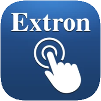

＃ioBroker.extron
##用于ioBroker的extron适配器
Extron SIS适配器

Extron的控制设备。
该适配器旨在通过** S **简单** I **指令** S ** et协议控制某些Extron音频视频产品。
设备的功能范围非常广泛。并非所有功能都需要适配器以及与iobroker的交互支持。

**注意：**在适配器配置中选择设备类型后，以后将无法更改！

在iobroker安装中，可能有更多来自此适配器的不同或相同类型的实例。对于将来的版本，您必须为每个实例的适配器配置添加有效的许可证。
如果您是非商业组织或将其私人使用，则可以免费获得许可证。请联系作者。

###支持的设备
-8x2演示矩阵切换器（DTP2 CrossPoint 82）
-H.264流媒体播放器和解码器（SMD 202）
-流媒体编码器（SME 211）
-带Dante的12x8 ProDSP处理器（DMP 128 Plus AT）
-带AEC，VoIP和Dante的12x8 ProDSP处理器（DMP 128 Plus C V AT）

＃＃ 去做
-在对话开始时检查设备类型。有时会失败。必须更改为更可靠的机制。
-对使用的输入和输出进行更精细的选择，以减小DSP设备上的数据库大小
-在数据库端添加更多命令及其实现
-向SMD 202添加媒体播放支持

## Changelog

### 0.0.1
* (Bannsaenger) initial release

### 0.0.2
* (Bannsaenger) prepared for checkin to iobroker.latest

### 0.0.3
* (Bannsaenger) fix dependencies for integration test

### 0.1.0
* (mschlgl) extend device/database structure to cover all controllable elements

## License
Attribution-NonCommercial 4.0 International (CC BY-NC 4.0)

Copyright (c) 2021 Bannsaenger, https://github.com/bannsaenger <bannsaenger@gmx.de>

This work is licensed under a Creative Commons Attribution-NonCommercial 4.0 International License
http://creativecommons.org/licenses/by-nc/4.0/

Short content:
This is a human-readable summary of (and not a substitute for) the license. Disclaimer.
You are free to:

Share — copy and redistribute the material in any medium or format
Adapt — remix, transform, and build upon the material

The licensor cannot revoke these freedoms as long as you follow the license terms.

Under the following terms:

Attribution — You must give appropriate credit, provide a link to the license, and indicate if changes were made. You may do so in any reasonable manner, but not in any way that suggests the licensor endorses you or your use.

NonCommercial — You may not use the material for commercial purposes.

No additional restrictions — You may not apply legal terms or technological measures that legally restrict others from doing anything the license permits.