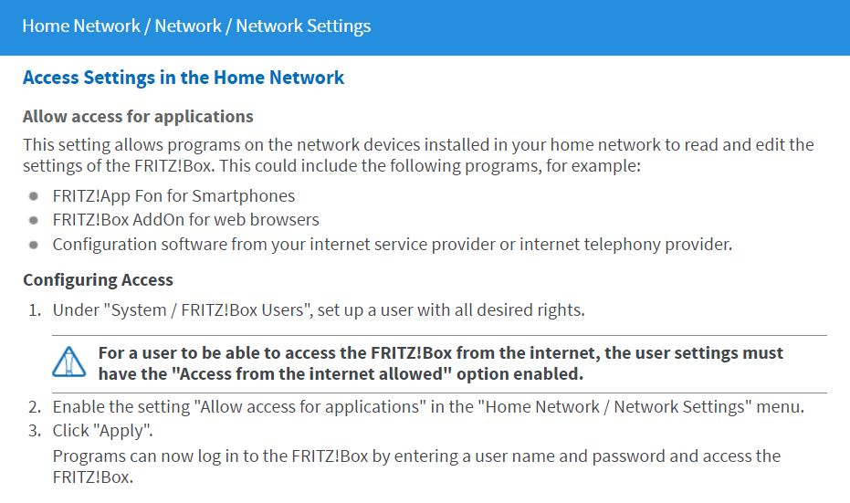

# IoBroker.fb-checkpresence
**测试：** 

## IoBroker 的 fb-checkpresence 适配器
适配器通过 fritzbox 检查家庭成员的存在。
您必须填写家庭成员的姓名和所用设备的mac-address（或ip-address）。
注释是可选的，您可以启用或禁用家庭成员。
数据点基于成员名称。

### 适配器前置条件
为了获得正确的功能，您必须安装一个历史适配器。您可以选择以下适配器之一：

* 历史
* SQL
* 流入数据库

## 使用过的设备
对于此适配器，使用 AVM Fritzbox。在这里您可以找到有关 Fritzbox 的信息 https://avm.de/produkte/fritzbox/。
fritzbox 服务通过 TR-064 协议使用。

### Fritzbox 条件
此处描述了 fritzbox 中使用的 TR-064 接口：https://avm.de/service/schnittstellen/。
使用以下 TR-064 服务和操作：

* 主机：1 - X_AVM-DE_GetHostListPath（自 2017-01-09 起支持）
* 主机：1 - X_AVM-DE_GetMeshListPath
* 主机：1 - GetSpecificHostEntry
* 主机：1 - X_AVM-DE_GetSpecificHostEntryByIP（自 2016-05-18 起支持）
* DeviceInfo:1 - GetSecurityPort
* 设备信息：1 - 获取信息
* WANPPPConnection:1 - GetInfo
* WANIPConnection:1 - 获取信息
* WLANConfiguration3 - 设置启用
* WLANConfiguration3 - GetInfo
* WLANConfiguration3 - GetSecurityKeys
* X_AVM-DE_HostFilter - DisallowWANAccessByIP
* X_AVM-DE_HostFilter - GetWANAccessByIP
* DeviceConfig:1 - 重启
* LANConfigSecurity1 - X_AVM-DE_GetCurrentUser

默认情况下，TR-064 接口未激活。但是，这可以通过 FritzBox 网络界面轻松更改。为此，请登录您的 FritzBox 并确保激活专家视图。
然后您会在“家庭网络»家庭网络概览»网络设置”下方找到“允许应用程序访问”点。在那里您必须激活复选框，然后重新启动 FritzBox 一次。

提示：更改选项后，不要忘记重新启动 Fritzbox！

## 配置对话框
＃＃＃ 一般的
配置值经过验证，并且只能保存正确的值。否则，保存按钮将被禁用。

### Fritzbox IP 地址、用户和密码
ip-address、user 和 password 的配置是从 fritzbox 获取设备数据所必需的。
因此，必须在 fritzbox 中创建用户。这是 fritzbox 的较新固件版本 (>= 7.25) 所必需的。请参阅此处了解信息：https://avm.de/fileadmin/user_upload/Global/Service/Schnittstellen/Empfehlungen%20zur%20Benutzerfu%CC%88hrung%20bei%20der%20Anmeldung%20an%20einer%20FRITZ%21pdf_v1.1.1密码已加密且未以明文形式保存。用户名和密码最多可包含 32 个字符。有关信息，请参阅：https://service.avm.de/help/de/FRITZ-Box-Fon-WLAN-7490/014/hilfe_zeichen_fuer_kennwoerter#:~:text=Namen%20f%C3%BCr%20Benutzer,Kennwortfeld%20darf %20nicht%20leer%20sein。
提示：在某些情况下，如果密码未正确插入，则可能是 fritzbox 阻止了用户。
日志中经常会出现超时消息。请检查您是否输入了正确的用户名和密码。然后您必须重新启动fritzbox。

### Ssl 选项
在某些情况下，适配器无法连接到 Fritzbox。禁用此选项可能会有所帮助。
在这种情况下，适配器尝试在没有 https 的情况下进行连接。

＃＃＃ 间隔
您对家庭成员和 Fritzbox 设备有不同的间隔。
Fritzbox 设备的间隔可以配置为 1 到 59 分钟。通常 1 到 5 分钟之间的值是读取 fritzbox 数据的最佳间隔。家庭成员可以配置从 10 到 600。如果前一个周期完成，则每个新周期开始。

###过滤时间
如果过滤时间大于 0 秒，如果状态更改为 false，则会检查家庭成员的状态两次（在过滤时间之后）。如果状态为真，则立即设置状态。

###历史适配器
通过历史适配器计算一些值。您可以选择，如果历史、sql 或 influxdb 适配器用于此计算。历史适配器必须预先安装，然后可以在配置对话框中选择。
如果禁用历史配置，则无法实现某些值的计算。

＃＃＃ 日期格式
此网页上描述了日期格式掩码选项：https://www.npmjs.com/package/dateformat。
格式掩码用于格式化 html 和 json 表对象。

### 创建 FB 设备
如果选中此选项，则会为 Fritzbox 设备列表中的每个设备创建对象。
如果禁用此选项，则网格信息也将被禁用。

### FB 设备对象的重新同步
如果选中此选项，则 FB 设备对象将与来自 Fritzbox 的设备列表重新同步。

###创建网格信息
如果允许创建 FB 设备，则可以选中此选项。如果选中此选项，则会为 Fritzbox 设备列表中的每个设备创建网格对象。

###客人信息
如果选中此选项，则会创建来宾状态。

### 二维码生成
如果选中此选项，则会生成来自访客 wlan 的二维码。

###家庭成员设置
对于已配置的家庭成员，您应该输入成员名称、主机名、mac 地址和 ip 地址、注释，然后您可以启用或禁用该成员。一个组是可选的。
如果将组留空并将兼容性标志设置为 true，则行为就像旧版本的适配器。您可以使用来自家庭成员的在线状态或直接映射到家庭成员姓名的状态。在未来的版本中，您必须使用在线状态。可以使用兼容性复选框打开/关闭此行为：-> 兼容性 = true：作为具有空组的旧版本的行为。
-> 兼容性 = 真且组不为空：新行为。 familymembers 文件夹下的所有状态。
-> 兼容性 = false：新行为。 familymembers 文件夹下的所有状态。

适配器为每个成员创建一个存在状态并检查该成员是否存在。如果在线状态改变，则状态改变。
您还可以为成员启用过滤。如果状态为真，则状态立即变为真。如果为 false，则将在过滤时间后再次检查该值。
如果状态在两种情况下都为假，则状态更改为假。否则它不会改变。

要获取对象中的速度信息，您必须选择 fb-devices 选项。

###白名单设置
在白名单中，您可以插入所有已知设备。任何未知设备都列在黑名单对象中。
如果您选中表格标题中的复选框，则会选择所有设备。

＃＃ 特征
### AVM 支持检查
该函数检查使用的 fritzbox 功能的可用性。可用性记录为信息。如果您有问题，请查看这些功能是否都设置为 true。此外，还会检查用户的访问权限，如果访问权限不正确，则该功能将设置为 false。

### 开启/关闭访客无线网络
在文件夹来宾下，您可以将状态 wlan 设置为 true 或 false，然后来宾 wlan 打开或关闭。

###访客WLAN二维码
访客wlan的二维码保存在guest文件夹中的状态wlanQR中。二维码可以在基本 - Bool SVG 小部件中显示在 vis 中。

### 打开/关闭 Fritzbox 设备的互联网访问
在文件夹 FB-devices 下，您可以将禁用状态设置为 true 或 false，并且该设备的互联网访问在 Fritzbox 中被阻止。

###获取客人，黑名单
在此功能中，检查是否有任何用户以访客身份登录。还会检查是否有任何设备不在列出的白名单中。
该设备被加入黑名单。

### 活跃起来
如果选择了历史适配器，则会计算每个家庭成员的存在、来往日期和其他一些信息并将其保存在成员对象中。

### 主机号，活动设备
从 fritzbox 获取设备的数量和活动的数量。

## 对象
### 对象存在所有
如果所有家庭成员都在场，则对象为真。

### 对象存在
如果有一位家庭成员在场，则该对象为真。

### 对象设备
这些都是在 fritzbox 中列出的设备

### 对象 activeDevices
这些是 fritzbox 中所有活动设备的数量

### 对象 html、json
这些对象是包含所有家庭成员来往信息的表格（json 和 html）。

### 对象信息
以下列出了有关上次更新和适配器连接状态的信息。

### 对象来宾
下面列出了有关活动来宾和包含设备信息的表对象数量的信息。

### 对象黑名单
下面列出了有关未知设备数量和包含未知设备信息的表对象的信息。

### 对象 member.present
在这里，您将找到有关成员在当天的状态以及自上次更改以来成员状态为 true 的时间的信息。

### 对象 member.absent
在这里，您将找到有关成员当天缺席的信息，以及自上次更改以来该成员的状态为 false 的时间。

### 对象 member.comming，member.going
当家庭成员到达或离开家时，您会在此处找到相关信息。

### 对象 member.history, member.historyHtml
在这里您可以找到有关当天历史的信息。

## Changelog
<!--
    Placeholder for the next version (at the beginning of the line):
    ## __WORK IN PROGRESS__
    * Did some changes
    * Did some more changes
-->
### __WORK IN PROGRESS__
* (afuerhoff) html input pattern fixed for password and user
* (afuerhoff) dependencies updated

### 1.1.5 (2021-06-03)
* (afuerhoff) dependencies updated
* (afuerhoff) checkservice fixed

### 1.1.4 (2021-05-11)
* (afuerhoff) family groups implemented
* (afuerhoff) compatability mode implemented
* (afuerhoff) dependencies updated
* (afuerhoff) configuration options added
* (afuerhoff) dialogboxes optimized
* (afuerhoff) translations updated
* (afuerhoff) general program structure optimized
* (afuerhoff) filter for family members implemeted
* (afuerhoff) password handling updated
* (afuerhoff) documentation updated
* (afuerhoff) QR-Code implemented
* (afuerhoff) setState presence only if changed
* (afuerhoff) access rights implemented
* (afuerhoff) use name for presence
* (afuerhoff) active / inactive devices
* (afuerhoff) interval 10s bug fixed
* (afuerhoff) Bugfix dateformat pattern
* (afuerhoff) SSL (https) workaround implemented
* (afuerhoff) Connection check optimized
* (afuerhoff) Mesh handling optimized 

### 1.1.3 (2021-03-31)
* (afuerhoff) family groups implemented
* (afuerhoff) compatability mode implemented
* (afuerhoff) dependencies updated
* (afuerhoff) configuration options added
* (afuerhoff) dialogboxes optimized
* (afuerhoff) translations updated
* (afuerhoff) general program structure optimized
* (afuerhoff) filter for family members implemeted
* (afuerhoff) password handling updated
* (afuerhoff) documentation updated

### 1.1.2 (2021-01-13)
* (afuerhoff) QR-Code implemented
* (afuerhoff) setState presence only if changed
* (afuerhoff) access rights implemented
* (afuerhoff) use name for presence
* (afuerhoff) active / inactive devices
* (afuerhoff) interval 10s bug fixed
* (afuerhoff) documentation edited 

### 1.1.1 (2020-12-27)
* (afuerhoff) Configuration optimized
* (afuerhoff) Bugfix dateformat pattern
* (afuerhoff) SSL (https) workaround implemented
* (afuerhoff) Connection check optimized
* (afuerhoff) Documentation added
* (afuerhoff) Mesh handling optimized

## License
MIT License

Copyright (c) 2019-2021 Achim Fürhoff <achim.fuerhoff@outlook.de>

Permission is hereby granted, free of charge, to any person obtaining a copy
of this software and associated documentation files (the "Software"), to deal
in the Software without restriction, including without limitation the rights
to use, copy, modify, merge, publish, distribute, sublicense, and/or sell
copies of the Software, and to permit persons to whom the Software is
furnished to do so, subject to the following conditions:

The above copyright notice and this permission notice shall be included in all
copies or substantial portions of the Software.

THE SOFTWARE IS PROVIDED "AS IS", WITHOUT WARRANTY OF ANY KIND, EXPRESS OR
IMPLIED, INCLUDING BUT NOT LIMITED TO THE WARRANTIES OF MERCHANTABILITY,
FITNESS FOR A PARTICULAR PURPOSE AND NONINFRINGEMENT. IN NO EVENT SHALL THE
AUTHORS OR COPYRIGHT HOLDERS BE LIABLE FOR ANY CLAIM, DAMAGES OR OTHER
LIABILITY, WHETHER IN AN ACTION OF CONTRACT, TORT OR OTHERWISE, ARISING FROM,
OUT OF OR IN CONNECTION WITH THE SOFTWARE OR THE USE OR OTHER DEALINGS IN THE
SOFTWARE.