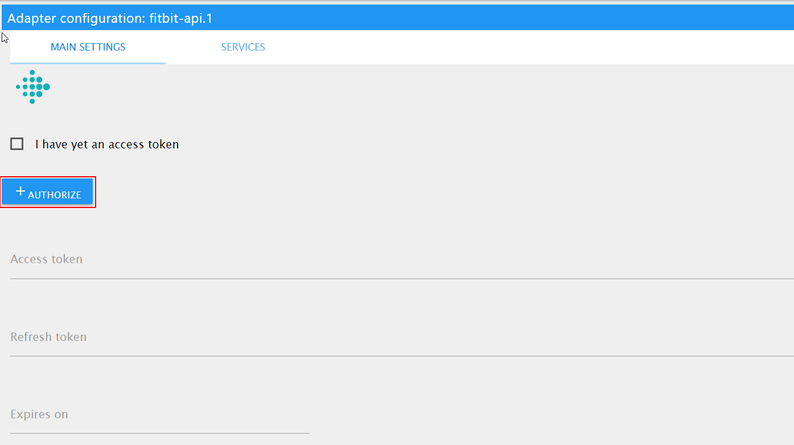

# IoBroker.fitbit

**此适配器使用 Sentry 库自动向开发人员报告异常和代码错误。**有关更多详细信息以及如何禁用错误报告的信息，请参阅[Sentry 插件文档](https://github.com/ioBroker/plugin-sentry#plugin-sentry)！从 js-controller 3.0 开始使用哨兵报告。

该适配器从 fitbit API 中提取数据！

＃＃ 配置

按“授权”按钮。

之后，可能会要求您再次输入凭据，或者如果浏览器缓存仍然包含 cookie，则可以自动完成。

然后 `access token` 和 `refresh token` 将出现。它们是只读的。

如果该过程对您不起作用，您可以尝试手动获取访问令牌：https://dev.fitbit.com/apps/oauthinteractivetutorial

## 多个用户
要读取多个用户（例如家庭成员）的数据，您必须清除浏览器中的 cookie 并创建此适配器的附加实例。

重要提示：如果您不清除浏览器 cookie，您将使用最后一个有效用户登录。

＃＃ 发展
该 API 是根据 https://dev.fitbit.com/build/reference/web-api/basics/ 实现的

## Changelog

### 0.1.1 (2019-11-06)
* (bluefox) initial release

## License
The MIT License (MIT)

Copyright 2019-2022, bluefox <dogafox@gmail.com>

Permission is hereby granted, free of charge, to any person obtaining a copy
of this software and associated documentation files (the "Software"), to deal
in the Software without restriction, including without limitation the rights
to use, copy, modify, merge, publish, distribute, sublicense, and/or sell
copies of the Software, and to permit persons to whom the Software is
furnished to do so, subject to the following conditions:

The above copyright notice and this permission notice shall be included in
all copies or substantial portions of the Software.

THE SOFTWARE IS PROVIDED "AS IS", WITHOUT WARRANTY OF ANY KIND, EXPRESS OR
IMPLIED, INCLUDING BUT NOT LIMITED TO THE WARRANTIES OF MERCHANTABILITY,
FITNESS FOR A PARTICULAR PURPOSE AND NONINFRINGEMENT. IN NO EVENT SHALL THE
AUTHORS OR COPYRIGHT HOLDERS BE LIABLE FOR ANY CLAIM, DAMAGES OR OTHER
LIABILITY, WHETHER IN AN ACTION OF CONTRACT, TORT OR OTHERWISE, ARISING FROM,
OUT OF OR IN CONNECTION WITH THE SOFTWARE OR THE USE OR OTHER DEALINGS IN
THE SOFTWARE.