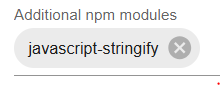

# IoBroker.flexcharts
**测试：**

## IoBroker 的 flexcharts 适配器
# 基本概念
ioBroker 中有多种适配器可用于查看图表。据我所知，它们都使用 UI 来配置图表的内容和选项。通常，并非所有使用的图形子系统的功能都可以以这种方式使用。例如，无法使用 eChart-Adapter 查看功能齐全的堆叠图表。

此适配器使用不同的方法。它几乎带来了[Apache ECharts](https://echarts.apache.org/en/index.html) 到 ioBroker。查看 [演示图表](https://echarts.apache.org/examples/en/index.html) 的完整功能集。

备注：适配器尚未在 MacOS 上测试。

**没有 UI 可以配置任何图表。**您必须自己定义图表，适配器负责可视化。您必须通过提供内容作为 json 对象来提供图表的定义和内容 - 在 eCharts 示例中，它对应于变量 `option` 的内容。这里有一个例子来说明。要创建堆叠图表，请将其定义存储在 ioBroker 状态（json 格式）中：

```
{ "tooltip": {"trigger": "axis","axisPointer": {"type": "shadow"}},
  "legend": {},
  "xAxis": [{"type": "category","data": ["Mon","Tue","Wed","Thu","Fri","Sat","Sun"]}],
  "yAxis": [{"type": "value"}],
  "dataZoom": [{"show": true,"start": 0, "end": 100}],
  "series": [
    { "name": "Grid", "type": "bar", "color": "#a30000", "stack": "Supply",
      "data": [8,19,21,50,26,0,36]},
    { "name": "PV", "type": "bar", "color": "#00a300", "stack": "Supply",
      "data": [30,32,20,8,33,21,36]},
    { "name": "Household", "type": "bar", "color": "#0000a3", "stack": "Consumption",
      "data": [16,12,11,13,14,9,12]},
    { "name": "Heat pump", "type": "bar", "color": "#0000ff", "stack": "Consumption",
      "data": [22,24,30,20,22,12,25]},
    { "name": "Wallbox", "type": "bar", "color": "#00a3a3", "stack": "Consumption",
      "data": [0,15,0,25,23,0,35]}
  ]
}
```

flexchart 适配器将显示此图表：


通常您将使用 Blockly 或 javascript 来创建和更新此状态的内容。

还有另一种可能性，即通过 javascript 中的回调函数直接传递 eCharts 数据。详情见下文。

需要明确的是：这种方法不适用于快速创建简单图表。
但如果您对更复杂的图表有特定的想法，flexcharts 可以为您提供实现它的可能性。

＃ 入门
### 使用适配器
此适配器将其功能作为 Web 扩展。因此，必须安装并运行 [网络适配器](https://www.iobroker.net/#en/adapters/adapterref/iobroker.ws/README.md) (`web.0`)。在此自述文件中，假定您使用标准端口 8082 作为 Web 适配器。

当 flexcharts 适配器处于活动状态时，您可以通过 http://localhost:8082/flexcharts/echarts.html 访问它（将`localhost` 替换为您的 ioBroker 服务器的地址）。

您可以在 vis 或 jarvis 或其他可视化的 iFrame 小部件中使用此地址。当然，您也可以直接在浏览器选项卡中使用它。

为了使其工作，您必须提供其他参数来告知适配器数据源。有两个选项可用：

* `source=state` => 您以 ioBroker 状态 (json) 提供图表数据
* `source=script` => 您通过脚本（javascript 或 blockly）提供图表数据

还有其他可用选项，请参阅[参考部分](#reference)

要检查适配器是否正确安装，请使用内置演示图表：http://localhost:8082/flexcharts/echarts.html?source=state&id=flexcharts.0.info.chart1

### 使用 ioBroker 状态作为 eChart 的来源
例如：`http://localhost:8082/flexcharts/echarts.html?source=state&id=0_userdata.0.echarts.chart1`

<!-- Would this be better to read: Example: http://localhost:8082/flexcharts/echarts.html?<mark style="background-color: #ffff00">source=state</mark>&<mark style="background-color: #00c000">&id=0_userdata.0.echarts.chart1</mark> -->

Flexcharts 会将状态 `0_userdata.0.echarts.chart1` 评估为 eChart 的数据。尝试一下：创建这样的状态并复制上面示例的 json 数据（`{ "tooltip": { ...`）作为状态内容，然后使用浏览器访问给定的地址。

不允许在州 ID 中使用以下字符：`: / ? # [ ] @ ! $ & ' ( ) * + , ; = %`

### 使用 javascript 作为 eChart 的源代码
这有点复杂，但效率更高，也更灵活。您可以直接通过 JS 脚本提供图表数据，该脚本由 flexcharts 适配器动态调用。您可以通过向 http 地址添加参数来将其他参数传递给脚本，例如 `&chart=chart1`。所有 http 参数都可以在脚本中的对象 `httpParams` 中使用（见下面的示例）。

再次强调，最好使用示例进行解释。创建一个包含以下内容的脚本（仅支持第一个 JS 实例 (**javascript.0**)，脚本名称无关紧要）：

```
onMessage('flexcharts', (httpParams, callback) => {
    const myJsonParams  = (httpParams.myjsonparams ? JSON.parse(httpParams.myjsonparams) : {} );
    console.log(`httpParams = ${JSON.stringify(httpParams)}`);
    console.log(`myJsonParams = ${JSON.stringify(myJsonParams)}`);
    chart1(result => callback(result));
});

function chart1(callback) {
    const option = {
        tooltip: {trigger: "axis", axisPointer: {type: "shadow"}},
        legend: {},
        xAxis: [{type: "category", data: ["Mon","Tue","Wed","Thu","Fri","Sat","Sun"]}],
        yAxis: [{type: "value"}],
        dataZoom: [{show: true, start: 0, end: 100}],
        series: [
            { name: "Grid", type: "bar", color: "#a30000", stack: "Supply",
              data: [8,19,21,50,26,0,36]},
            { name: "PV", type: "bar", color: "#00a300", stack: "Supply",
            data: [30,32,20,8,33,21,36]},
            { name: "Household", type: "bar", color: "#0000a3", stack: "Consumption",
            data: [16,12,11,13,14,9,12]},
            { name: "Heat pump", type: "bar", color: "#0000ff", stack: "Consumption",
            data: [22,24,30,20,22,12,25]},
            { name: "Wallbox", type: "bar", color: "#00a3a3", stack: "Consumption",
            data: [0,15,0,25,23,0,35]}
        ]
    };
    callback(option);
}
```

启动脚本并在浏览器中访问此地址：`http://localhost:8082/flexcharts/echarts.html?source=script`

<!-- Would this be better to read: Start the script and access this in a browser: http://localhost:8082/flexcharts/echarts.html?<mark style="background-color: #ffff00">source=script</mark> -->

应显示与前面的示例相同的图表。

您应该获得示例脚本的两个日志条目：

```
httpParams = {"message":"mylinechart","source":"script"}
myJsonParams = {}
```

可以将其他参数转发到脚本，并在脚本中的变量`httpParams`中提供。尝试以下命令：`http://localhost:8082/flexcharts/echarts.html?source=script&chart=chart1&myjsonparams={"period":"daily"}`

日志条目现在应如下所示：

```
httpParams = {"source":"script","chart":"chart1","myjsonparams":"{\"period\":\"daily\"}"}`
myJsonParams = {"period":"daily"}
```

请注意，**您必须使用 `onMessage()` 功能从适配器接收触发器**。如上例所示，消息的默认值为 `flexcharts`。您可以通过提供附加参数来使用不同的消息，例如，要使用消息 `mycharts`，请将 `&message=mycharts` 添加到 http 地址：`http://localhost:8082/flexcharts/echarts.html?source=script&message=mycharts`

### 在图表定义中使用函数
不幸的是，图表定义中的函数定义通常不起作用，因为它在使用`JSON.stringify(option)` 或`callback(option)` 时被过滤。

但是，从 flexcharts V0.3.0 开始，就可以使用它了。需要付出更多努力：

* 将 npm 模块 `javascript-stringify` 添加到 javascript 适配器的实例 0。为此，请将 `javascript-stringify` 添加到适配器配置中的“附加 npm 模块”：



* 在脚本开头添加 `var strify = require('javascript-stringify');`
* 当使用脚本作为数据源时：在您的`onMessage()`功能中，将`callback(option);`替换为`callback(strify.stringify(option));`（假设`option`包含您的图表定义）。
* 然后使用状态作为数据源：创建状态时，将 `setState('my_chart_id', JSON.stringify(option), true);` 替换为 `setState('my_chart_id', strify.stringify(option), true);`
* 就是这样。现在图表定义中的函数将正确转发到 flexcharts。

只需使用[模板3](templates/flexchartsTemplate3.js) 尝试一下。有一个函数用于显示带有 2 个小数的工具提示数据：`tooltip: {trigger: "axis", valueFormatter: (value) => '。 + value.toFixed(2)}`。

`flexcharts.0.info.chart2` 中给出了通过状态使用图表定义的示例。这将显示与模板 3 相同的图表。

备注：安装 npm 模块 `javascript-stringify` 后，其功能也可能被恶意代码（跨站点脚本）利用。因此，使用此模块时，ioBroker 不应通过互联网访问。

## 模板
Javascript 模板可用于以下几种用例：

* 使用历史适配器数据的图表：[template1](templates/flexchartsTemplate1.js)
* 热曲线的简单图表：[template2](templates/flexchartsTemplate2.js)
* 使用图表定义中的函数创建简单的堆积条形图：[template3](templates/flexchartsTemplate3.js)
* **tibberLink 适配器** 的数据图表：请参阅 [此处](https://github.com/MyHomeMyData/ioBroker.flexcharts/discussions/67) 和 [此处](https://github.com/MyHomeMyData/ioBroker.flexcharts/discussions/66) 的讨论
* Viessmann E3 系列设备有一个非常具体的用例，例如热泵 Vitocal 250。请参阅 https://github.com/MyHomeMyData/ioBroker.e3oncan/discussions/35
* 适配器 [tibberLink](https://github.com/hombach/ioBroker.tibberlink) 使用 flexcharts 作为数据图形处理选项。目前可在 ioBroker 的 Beta Repo 中使用。请查看 [文档](https://github.com/hombach/ioBroker.tibberlink?tab=readme-ov-file#2-using-the-flexcharts-or-fully-featured-echarts-adapter-with-json)。

＃＃ 参考
使用**ioBroker 状态**作为数据源：`http://localhost:8082/flexcharts/echarts.html?source=state&id=my_state_id`

使用**javascript**作为数据源：`http://localhost:8082/flexcharts/echarts.html?source=script`

### 可选参数
* `&message=my_message` - 将“my_message”发送到 javascript。使用 `onMessage('my_message', (httpParams, callback) => { callback(mychart); })` 提供图表数据。默认为 `flexcharts`。
* `&darkmode` - 激活 ECharts 的暗模式可视化。
* `&refresh=number` - 每“number”秒刷新一次图表。默认为 60 秒。允许的最小值为 5 秒。
* `&user_defined_arguments` - 根据需要添加更多参数。所有参数均可在对象 `httpParams` 中的函数 `onMessage()` 中使用。有关更多详细信息，请参阅上述示例和模板。

### 在图表定义中使用函数
适用于 0.3.0 或更新版本。请参阅上一个[章](#using-functions-within-definition-of-chart)

### 内置演示图表
有一个内置的演示图表可用：http://localhost:8082/flexcharts/echarts.html?source=state&id=flexcharts.0.info.chart1

当 flexcharts 和 web-adapter 运行时，这将弹出一个演示图表。

**注意：**将`localhost`替换为您的ioBroker服务器的地址。将`8082`替换为您的Web适配器使用的端口号。

## 捐赠
<a href="https://www.paypal.com/donate/?hosted_button_id=WKY6JPYJNCCCQ"></a>如果你喜欢这个项目 — — 或者只是觉得慷慨，可以考虑给我买杯啤酒。干杯！:beers:

## Changelog
<!--
	Placeholder for the next version (at the beginning of the line):
	### **WORK IN PROGRESS**
-->
### 0.3.2 (2025-02-09)
* (MyHomeMyData) Added hint for use of flexcharts by adapter tibberLink

### 0.3.1 (2025-02-02)
* (MyHomeMyData) Updated Apache ECharts to version 5.6.0
* (MyHomeMyData) Added support for 3D charts using extension echarts-gl, see issue #68
* (MyHomeMyData) Added templates for tibberLink Adapter

### 0.3.0 (2025-01-08)
* (MyHomeMyData) Enhancement for usage of functions within echart definitions.
* (MyHomeMyData) Fix for issue #56 (findings of repository checker)

### 0.2.0 (2024-11-06)
* (MyHomeMyData) Updated readme. Added sections Templates and Reference.
* (MyHomeMyData) Fix for issue #41 (findings of repository checker)
* (MyHomeMyData) Updated ECharts to version 5.5.1, see issue #40
* (MyHomeMyData) Fix for issue #39 (html warnings)
* (MyHomeMyData) Added option 'refresh' to enable auto update of chart

### 0.1.6 (2024-10-19)
* (MyHomeMyData) Fix for issue #37

### 0.1.5 (2024-10-11)
* (MyHomeMyData) Fixes for issue #36

### 0.1.4 (2024-10-06)
* (MyHomeMyData) Fixes for issue #34
* (MyHomeMyData) Fixes for issue #33

### 0.1.3 (2024-10-05)
* (MyHomeMyData) Fixed issue on windows systems (handling of file path)

### 0.1.2 (2024-10-01)
* (MyHomeMyData) Adapted adapter configurations

### 0.1.1 (2024-10-01)
* (MyHomeMyData) Removed main.js from package.json since it's obsolete

### 0.1.0 (2024-10-01)
* (MyHomeMyData) Use web extension instead of creating own web server. Use http://localhost:8082/flexcharts/echarts.html instead of http://localhost:3100/echarts.html

### 0.0.4 (2024-09-13)
* (MyHomeMyData) Changed default port to 3100 to avoid conflict with camera adapter
* (MyHomeMyData) Check for conflicting port usage during start of instance
* (MyHomeMyData) Added option to select dark mode
* (MyHomeMyData) Fixed missing 404-page

### 0.0.3 (2024-08-25)
* (MyHomeMyData) Disabled sinon should interface
* (MyHomeMyData) Update of npm dependencies

### 0.0.2 (2024-08-05)
* (MyHomeMyData) initial release

## License
MIT License

Copyright (c) 2025 MyHomeMyData <juergen.bonfert@gmail.com>

Permission is hereby granted, free of charge, to any person obtaining a copy
of this software and associated documentation files (the "Software"), to deal
in the Software without restriction, including without limitation the rights
to use, copy, modify, merge, publish, distribute, sublicense, and/or sell
copies of the Software, and to permit persons to whom the Software is
furnished to do so, subject to the following conditions:

The above copyright notice and this permission notice shall be included in all
copies or substantial portions of the Software.

THE SOFTWARE IS PROVIDED "AS IS", WITHOUT WARRANTY OF ANY KIND, EXPRESS OR
IMPLIED, INCLUDING BUT NOT LIMITED TO THE WARRANTIES OF MERCHANTABILITY,
FITNESS FOR A PARTICULAR PURPOSE AND NONINFRINGEMENT. IN NO EVENT SHALL THE
AUTHORS OR COPYRIGHT HOLDERS BE LIABLE FOR ANY CLAIM, DAMAGES OR OTHER
LIABILITY, WHETHER IN AN ACTION OF CONTRACT, TORT OR OTHERWISE, ARISING FROM,
OUT OF OR IN CONNECTION WITH THE SOFTWARE OR THE USE OR OTHER DEALINGS IN THE
SOFTWARE.

Additional remark:
Source code of [Apache ECharts](https://echarts.apache.org/en/index.html) is used according to [Apache License, Version 2.0](https://www.apache.org/licenses/LICENSE-2.0)