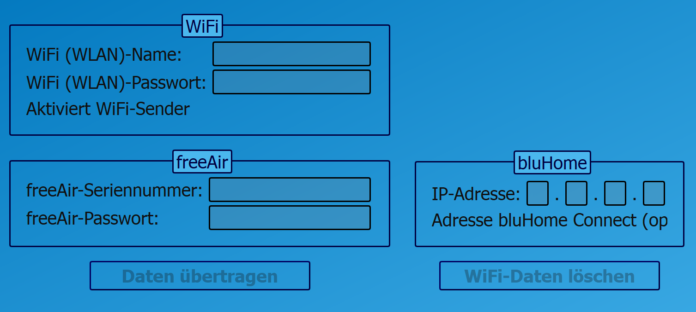
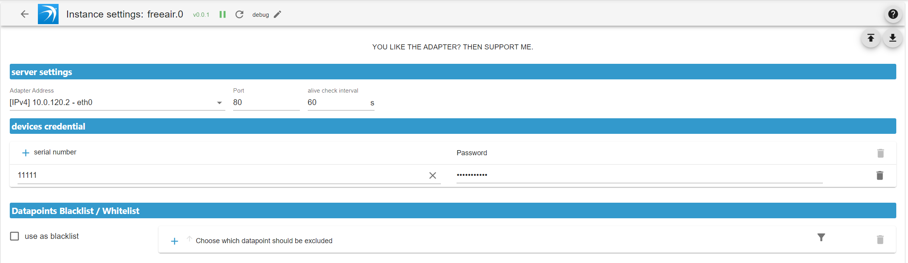

# IoBroker.freeair
**测试：**

## IoBroker 的 freeair 适配器
与您的[BluMartin FreeAir 100](https://blumartin.de/wohnraumlueftung-freeair-dezentral-mit-waermerueckgewinnung/)通风系统进行本地连接

＃＃ 设置
### FreeAir 100

- 在“bluHome”下添加你的ioBroker的IP地址

＃＃＃ 适配器

#### 服务器设置
- 适配器地址：您的 ioBroker 的 IP 地址
- 端口：默认端口为 80，因为 FreeAir 100 设备将其数据发送到端口 80  **_注意：_**您可以更改端口，例如在网关中配置 DNAT 规则
- 活动检查间隔：如果在此间隔内未收到数据，设备将显示为离线

#### 设备凭证
- 添加您的 FreeAir 100 设备的序列号
- 添加您在 FreeAir 100 设备中设置的密码

#### 数据点黑名单/白名单
- 黑名单或白名单数据点。

## Changelog

<!--
	Placeholder for the next version (at the beginning of the line):
	### **WORK IN PROGRESS**
-->
### 1.0.6 (2025-10-19)

- (Scrounger) auto translation bug fix
- (Scrounger) bug fixes

### 1.0.5 (2025-09-30)

- (Scrounger) dependencies updated
- (Scrounger) bug fixes

### 1.0.4 (2025-09-27)

- (Scrounger) bug fixes

### 1.0.3 (2025-09-21)

- (Scrounger) if only one devices is configured, show device online status as adapter status
- (Scrounger) dependencies updated
- (Scrounger) bug fixes

### 1.0.2 (2025-09-11)

- (Scrounger) automatic role assignment implemented
- (Scrounger) code optimizations
- (Scrounger) bug fixes

### 1.0.1 (2025-09-06)

- (Scrounger) bug fixes

### 1.0.0 (2025-09-03)

- (Scrounger) latest fun

### 1.0.0-beta.1 (2025-08-31)

- (Scrounger) i18n translation
- (Scrounger) dependencies updated

### 1.0.0-beta.0 (2025-08-31)

- (Scrounger) initial release

## License

MIT License

Copyright (c) 2025 Scrounger <scrounger@gmx.net>

Permission is hereby granted, free of charge, to any person obtaining a copy
of this software and associated documentation files (the "Software"), to deal
in the Software without restriction, including without limitation the rights
to use, copy, modify, merge, publish, distribute, sublicense, and/or sell
copies of the Software, and to permit persons to whom the Software is
furnished to do so, subject to the following conditions:

The above copyright notice and this permission notice shall be included in all
copies or substantial portions of the Software.

THE SOFTWARE IS PROVIDED "AS IS", WITHOUT WARRANTY OF ANY KIND, EXPRESS OR
IMPLIED, INCLUDING BUT NOT LIMITED TO THE WARRANTIES OF MERCHANTABILITY,
FITNESS FOR A PARTICULAR PURPOSE AND NONINFRINGEMENT. IN NO EVENT SHALL THE
AUTHORS OR COPYRIGHT HOLDERS BE LIABLE FOR ANY CLAIM, DAMAGES OR OTHER
LIABILITY, WHETHER IN AN ACTION OF CONTRACT, TORT OR OTHERWISE, ARISING FROM,
OUT OF OR IN CONNECTION WITH THE SOFTWARE OR THE USE OR OTHER DEALINGS IN THE
SOFTWARE.