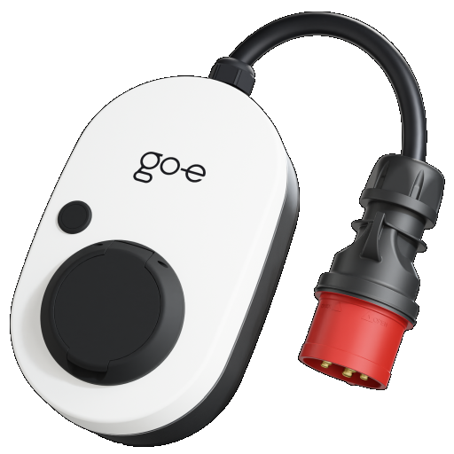

# IoBroker.go-eCharger
[](https://github.com/hombach/ioBroker.go-e-charger/actions/workflows/codeql-analysis.yml)

## 版本
## IoBroker 适配器，适用于 go-e Charger 电动汽车壁挂式充电桩
该适配器可将一个或多个 go-e Charger 壁挂式充电桩集成到您的 ioBroker 家庭自动化系统中。它会通过本地 HTTP API 周期性地轮询每个壁挂式充电桩，提供 ioBroker 声明的所有相关数据，并允许您直接从智能家居控制充电。

有关 go-e 充电器硬件的更多信息，请访问制造商的网站：[go-e GmbH](https://go-e.com)。

＃＃＃ 特征
- 支持在单个适配器实例中使用多个 go-e 充电器
- 监测车辆状态、充电功率、充电电流、电网相位和能量统计数据
- **ChargeNOW** – 立即以可配置的电流开始充电
- **充电管理器** – 自动光伏剩余电量充电：充电电流会根据可用的太阳能功率持续调整，同时考虑家庭用电量和家用电池的电量。电动汽车的充电可以延迟，直到家用电池达到可设置的最低电量。

> **注意：** 光伏剩余充电功能目前仅设计用于控制**单个**充电器。当多个充电器同时启用 ChargeManager 时，它们之间的充电电流无法协调，导致太阳能剩余电量的计算结果不准确。我们将很快推出支持多充电器负载协调管理的扩展功能。

- 在单相和三相充电之间切换（硬件第三代及更新版本）
- 每张RFID卡的能源统计数据（卡名、ID和充电能量）
- 每个壁挂式充电桩的只读模式——仅监控充电桩，不向其发送**任何**控制指令（不释放电量、不控制充电电流、不进行相位切换），例如，当充电由其他地方控制或通过RFID标签管理访问权限时。

已使用固件版本 V033、V040.0、V041.0、V054.7、V054.11、V055.5、V055.7、V055.8、V56.1、V56.2、V56.8、V56.9、V56.11、V57.0、V57.1、V59.4、V60.0、V60.1、V60.2、V60.5、V60.6 进行测试，并可同时使用最多 3 个充电器。

＃＃＃ 要求
- 对于第 3 代和第 4 代硬件，您必须在 go-e 应用中启用“HTTP API v1”。
- 对于相位切换，您还需要在 go-e 应用中启用“HTTP API v2”（硬件第 3 代及更新版本）。

＃＃ 配置
在墙装式充电器列表中为每个 go-e 充电器添加一个条目，并输入其 IP 地址。您也可以选择为每个充电器指定一个名称。

如果适配器仅需读取充电器的数据而不写入数据，请启用充电器的**只读模式**。在只读模式下，适配器不会发送任何控制命令——无论是释放充电、充电电流还是相位切换。ChargeNOW 和 ChargeManager 状态仍然可以切换，但它们对只读充电器无效。当壁挂式充电桩的充电由其他系统控制或通过 RFID 标签进行本地管理时，请使用此模式。

轮询周期时间定义了适配器从充电器读取数据并调整充电电流的频率（最短 3 秒，默认 10 秒）。

### 使用 ChargeManager 进行光伏剩余电量充电
ChargeManager 根据能源管理系统、逆变器、电表或用户创建的数据源提供的 ioBroker 数值状态计算充电电流。它不依赖于特定供应商，但所选状态必须代表下述数值。

配置以下状态的对象 ID：

- 目前可用的太阳能发电量 [W]
- 当前家庭用电量 [W]
- 家用电池当前电量百分比

#### 输入要求
| 输入 | 期望值 | 单位 | 符号 |
| ---------------------------- | ------------------------------ | ---- | -------------------- |
| 太阳能发电 | 当前光伏发电总量 | 瓦 | 正发电量 |
| 家庭用电量 | 家庭总用电量 | 瓦 | 正耗电量 |
| 家用电池电量状态 | 当前电池电量 | % | 0 至 100 |

这三种状态都必须包含数值。功率值（单位为千瓦 (kW)）必须先转换为瓦 (W) 才能被选中。电网导入/导出状态不能直接使用，因为 ChargeManager 目前需要单独的发电量和用电量值。

如果没有安装家用电池，请创建一个数值辅助状态并将其设置为电池充电状态。将此辅助状态设置为与 `Settings.Setpoint_HomeBatSoC` 相同的常量值（例如，两者都设置为 `70`）。这样可以保持电池偏移量为零，从而使 ChargeManager 完全使用可用的光伏剩余电量进行充电。

#### 壁挂式充电桩在家庭消费价值中的消耗量
启用“充电器耗电量计入家庭耗电量”功能后，当选定的家庭耗电量状态在充电开始后上升的功率大致等于充电功率时，ChargeManager 会将测得的充电桩功率加回家庭耗电量，然后再计算可用剩余电量。这样可以防止控制器将自身的充电负载误判为额外的家庭用电需求。

如果所选状态已排除墙装式电源消耗，则保持此选项禁用状态。

＃＃＃＃ 计算
ChargeManager 每个轮询周期使用以下计算：

```text
available power =
    solar power
  - home power consumption
  + wallbox power, if it is included in home power consumption
  - 100 W reserve
  + battery SoC offset

target current = floor(available power / 230 V / active phases)
```

当电池电量正好处于设定的最小充电状态时，电池偏移量为零；随着电池电量接近 100%，偏移量会增加到 2,000 瓦。在 `Settings.Setpoint_HomeBatSoC` 以下，电动汽车充电功能被禁用，以便优先使用家用电池。

计算出的电流最大限制为 16 A。内部电流目标值在每个轮询周期内最多变化 1 A，以减少突变。

#### 启用 ChargeManager
适配器启动后，请使用以下可写状态。必要时，请替换实例 `0` 和墙盒编号 `0`。

| 状态 | 目的 |
| ------------------------------------------------- | --------------------------------------------------------------- |
| `go-e-charger.0.Settings.Setpoint_HomeBatSoC` | 允许过度充电前的最低家用电池荷电状态 |
| `go-e-charger.0.Wallbox_0.Settings.ChargeNOW` | 重写 ChargeManager 并强制充电 |
| `go-e-charger.0.Wallbox_0.Settings.ChargeCurrent` | ChargeNOW 使用的电流 |
| `go-e-charger.0.Wallbox_0.Settings.Charge3Phase` | 在支持的硬件上选择单相或三相充电 |
| `go-e-charger.0.Wallbox_0.Settings.Charge3Phase` | 在支持的硬件上选择单相或三相充电 |

对于剩余电量充电，请将 `ChargeNOW` 设置为 `false`，将 `ChargeManager` 设置为 `true`。当两者都启用时，ChargeNOW 将优先使用配置的 `ChargeCurrent`，而不考虑可用剩余电量。

单相和三相充电
ChargeManager 不会根据可用剩余电量自动在单相和三相之间切换。在第三代及更新的硬件上，`Charge3Phase` 用于选择相模式：

- `false`：单相充电
- `true`：三相充电

由于目前的实现方式是在其内部目标电流超过 9 A 时才开始充电，因此实际起始电流为 10 A。在进行备用功率和电池调整后，这在单相模式下大约需要 2.3 kW 的功率，在三相模式下大约需要 6.9 kW 的功率。因此，单相模式为小型光伏系统或多变的天气条件提供了更宽的运行范围。

#### 操作模式
| ChargeNOW | ChargeManager | 结果 |
| --------- | ------------- | ------------------------------------------ |
| `false` | `false` | 充电已禁用 |
| `true` | `false` | 在 `ChargeCurrent` 处强制充电 |
| `true` | `true` | ChargeNOW 优先 |
| `true` | `true` | ChargeNOW 优先 |

在只读模式下，这些状态仍然可以更改，但不会向充电器发送任何控制命令。

#### 验证和故障排除
在启用自动充电之前，请在ioBroker对象视图中验证所选的输入状态：

1. 夜间太阳能发电量接近于零，白天则与电流发电量持平。
2. 家庭用电量保持正值，并且在开启家用电器时反应正常。
3. 电池电量保持在 0 到 100 之间。
4. 所有功率值均以瓦特 (W) 而非千瓦 (kW) 表示。
5. 壁挂式充电桩消耗选项与所选家庭消耗值中是否包含充电功率相匹配。
6. `Wallbox_0.info.connection` 为 `true`。
7. `Wallbox_0.Power.Charge`、`Wallbox_0.Power.GridPhases` 以及在支持的硬件上，`Wallbox_0.Power.EnabledPhases` 包含合理的值。

充电可能需要几个轮询周期才能开始，因为内部目标电流每个周期仅增加 1 安培。默认的 10 秒周期和初始目标电流为 0 安培时，达到 10 安培的起始电流大约需要 100 秒。

ChargeManager 目前仅设计用于控制单个充电器。如果同时将其用于多个充电器，则每个充电器都会独立使用相同的剩余电量，从而可能导致电量分配错误。

## 哨兵
此适配器使用 Sentry 库自动向开发人员报告异常和代码错误。有关更多详细信息以及如何禁用错误报告，请参阅 [Sentry插件文档](https://github.com/ioBroker/plugin-sentry#plugin-sentry)！

捐赠
<a href="https://www.paypal.com/donate/?hosted_button_id=76GBRV9BX5US8"></a>如果你喜欢这个项目——或者只是想慷慨解囊——不妨请我喝杯啤酒。干杯！🍻

## Changelog

<!--
  Placeholder for the next version (at the beginning of the line):
  ### **WORK IN PROGRESS**
-->
### 1.3.0 (2026-08-04)

- (hombach) added info.accessControlState (go-e access_state: 0 = open, 1 = RFID/App required, 2 = price/automatic) (#634)
- (hombach) tightened TypeScript types for go-e API response fields (removed any)
- (hombach) updated dependencies

### 1.2.1 (2026-07-31)

- (typhosj) made ChargeManager surplus control more fail-safe: input validation, current clamped to 0-16 A, resilience of state-machine loop (#841)
- (hombach) added support for firmware V60.5 (#800) and V60.6 (#844)
- (typhosj) added ChargeManager PV surplus configuration guide (#842)
- (hombach) corrected no-battery helper-state recommendation for ChargeManager
- (hombach) updated dependencies

### 1.2.0 (2026-07-12)

- (hombach) added statisticsGlobal.chargePower state with the current total charging power of all chargers
- (hombach) removed chai-based unit test dependencies; modernized test harness to Node.js assert (fixes Appveyor, #836)

### 1.1.0 (2026-07-05)

- (hombach) fixed reading of "unlocked by RFID" (uby) on gen 3+ chargers via API V2
- (hombach) read-only mode now suppresses all control commands (charge release, charging current, phase switching)
- (ioBroker-Bot) Adapter requires admin >= 7.8.23 now.

### 1.0.4 (2026-07-04)

- (hombach) harmonized i18n files
- (hombach) improved README and English texts
- (hombach) reworked translations in all languages
- (hombach) added 5s timeout to all HTTP requests to chargers
- (hombach) fixed adapter stop when no charger is reachable at startup; warn per unreachable charger
- (hombach) fixed German fallback text for RFID card channel names
- (hombach) added upper bound validation for cycle time
- (hombach) added link to manufacturer's website
- (hombach) code optimizations

[Older changelogs can be found there](CHANGELOG_OLD.md)

## License

MIT License

Copyright (c) 2020-2026 C.Hombach

Permission is hereby granted, free of charge, to any person obtaining a copy
of this software and associated documentation files (the "Software"), to deal
in the Software without restriction, including without limitation the rights
to use, copy, modify, merge, publish, distribute, sublicense, and/or sell
copies of the Software, and to permit persons to whom the Software is
furnished to do so, subject to the following conditions:

The above copyright notice and this permission notice shall be included in all
copies or substantial portions of the Software.

THE SOFTWARE IS PROVIDED "AS IS", WITHOUT WARRANTY OF ANY KIND, EXPRESS OR
IMPLIED, INCLUDING BUT NOT LIMITED TO THE WARRANTIES OF MERCHANTABILITY,
FITNESS FOR A PARTICULAR PURPOSE AND NONINFRINGEMENT. IN NO EVENT SHALL THE
AUTHORS OR COPYRIGHT HOLDERS BE LIABLE FOR ANY CLAIM, DAMAGES OR OTHER
LIABILITY, WHETHER IN AN ACTION OF CONTRACT, TORT OR OTHERWISE, ARISING FROM,
OUT OF OR IN CONNECTION WITH THE SOFTWARE OR THE USE OR OTHER DEALINGS IN THE
SOFTWARE.