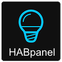
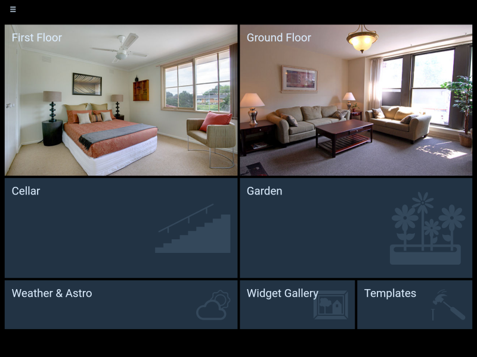
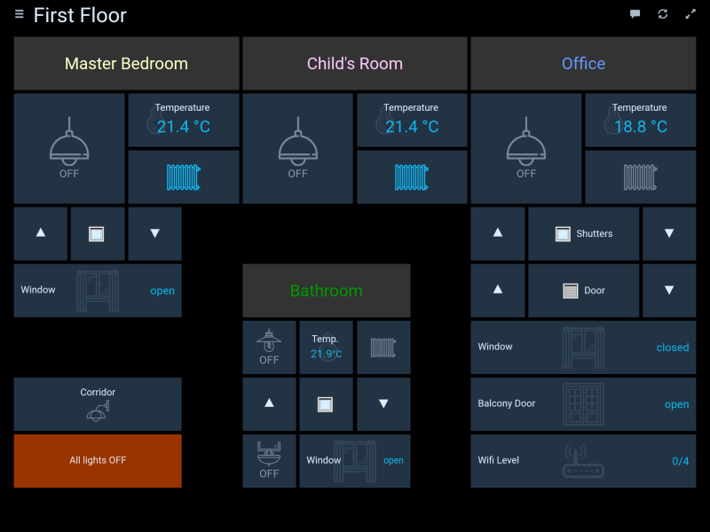
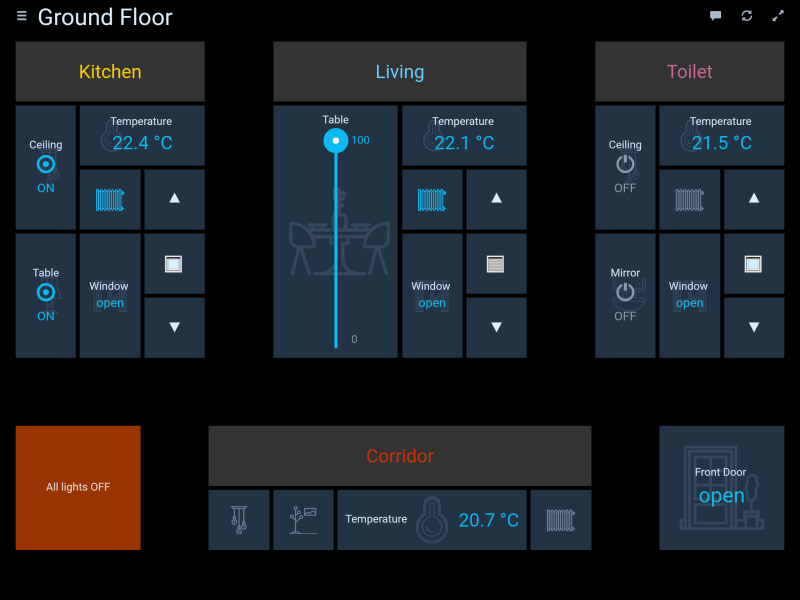
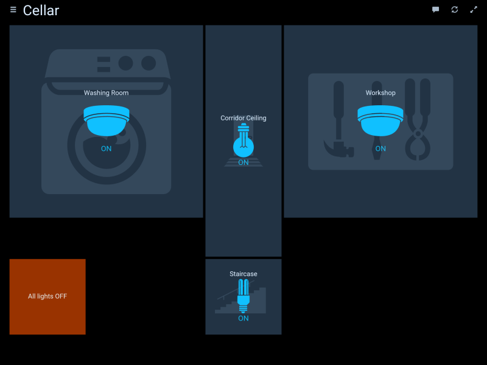
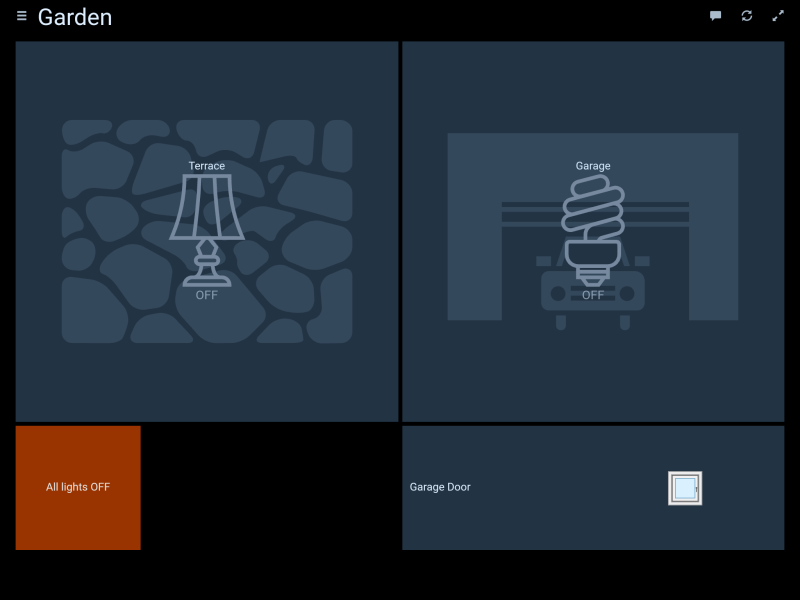
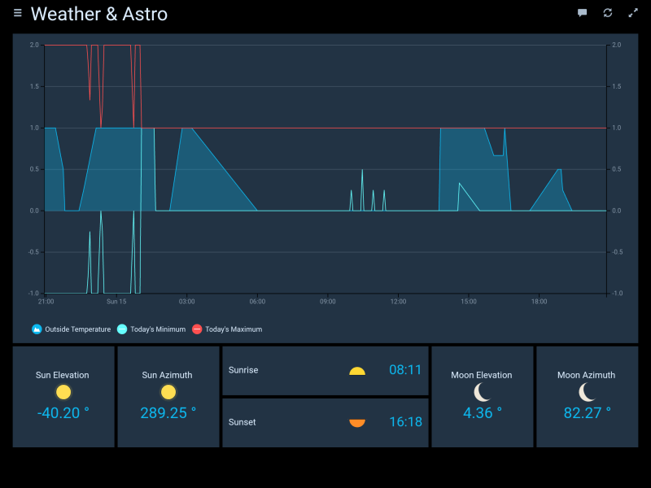
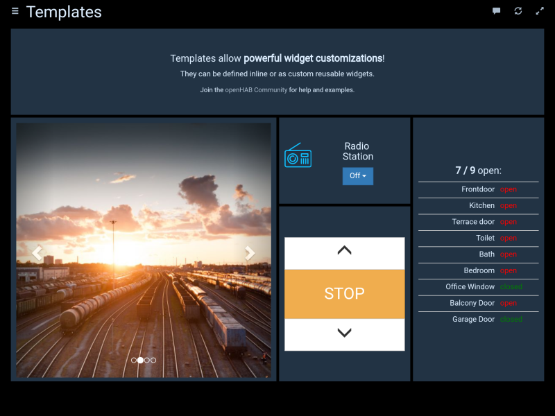

# IoBroker.habpanel
HABPanel 是基于 OpenHAB HABpanel 的 ioBroker 轻量级仪表板界面。

其显著特点是嵌入式仪表板设计器，允许在目标设备上轻松构建界面。

＃＃ 安装
**重要！** 此适配器不能直接从 GitHub 安装。只能从 npm 安装。

＃＃ 入门
- 首次在新浏览器或设备上访问 HABPanel 时，您应该看到一个相当空白的屏幕 - 按照教程并首先单击（或点击）右上角的图标。
- 您现在处于编辑模式，出现一个链接（“添加新仪表板”）以及一个“高级设置”链接。
- 如果您之前使用过 HABPanel 并在服务器上存储了一些面板配置，请转到“高级设置”并单击您之前的配置 - 它将立即恢复。或者，创建您的第一个仪表板：单击/点击“添加新仪表板”链接并为其命名。
- 单击/点击仪表板图块以进入仪表板编辑器
- 添加您的第一个小部件：选择“添加小部件”菜单并选择一个小部件类型（比如说“虚拟”——一个显示项目状态的简单小部件）
- 通过拖放移动小部件，并使用白色 V 形图标调整其大小 - 单击小部件时会出现该图标
- 点击小部件右上角的三个点以调出其上下文菜单并选择“编辑...”
- 调整一些设置（名称、openHAB 项目等）并确认您的更改
- 点击/轻触“保存”按钮保存您的配置
- 单击/点击“运行”即可查看仪表板的运行情况 - 使用浏览器的后退按钮或箭头返回绘图板
- 对仪表板设置满意后，返回“高级设置”，然后单击/点击“将当前配置保存到新面板配置”；这会将其存储在如上所述的 openHAB 2 服务器上，并可供重复使用。

## 截图

## Changelog
<!--
	Placeholder for the next version (at the beginning of the line):
	### __WORK IN PROGRESS__
-->
### __WORK IN PROGRESS__
-   (mcm1957) Adapter requires nodeJS >=18 and js-controller >= 5 now.
-   (mcm1957) Dependencies have been updated.

### 0.5.0 (2022-02-16)
* (jogibear9988) added on support for new websockets

### 0.4.3 (2020-08-22)
* (bluefox) The compatibility to socket.io 3.0.13 provided

### 0.4.1 (2020-02-10)
* (Apollon77) compatibility to web 3.0

### 0.3.5 (2019-04-15)
* (yaming116) bugfix i18n

### 0.3.4 (2019-02-04)
* (janfromberlin) button widget did not handle primitive boolean commands
* (matthiasgasser) fix time series query start date, adapted end date

### 0.3.3 (2019-02-02)
* (janfromberlin) fix button toggle functionality for true/false

### 0.3.2 (2019-01-30)
* (foxthefox) chart and timeline functionality fixed

### 0.3.1 (2019-01-27)
* (foxthefox) chart and timeline functionality added

### 0.2.6 (2019-01-14)
* (jogibear9988) bugfix selection element

### 0.2.5 (2019-01-14)
* (jogibear9988) bugfix format strings

### 0.2.4 (2019-01-13)
* (jogibear9988) bugfix template widget

### 0.2.3 (2019-01-11)
* (jogibear9988) upgrade to current openhab version

### 0.1.7 (2017-05-20)
* (bluefox) add to welcome screen

### 0.1.6 (2017-05-15)
* (bluefox) initial commit

## License
Copyright (c) 2024 iobroker-community-adapters <iobroker-community-adapters@gmx.de>
Copyright 2017-2022 bluefox <dogafox@gmail.com>

Eclipse Public License