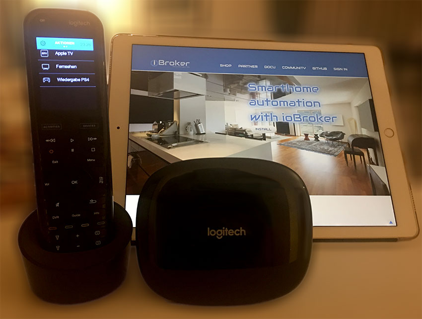
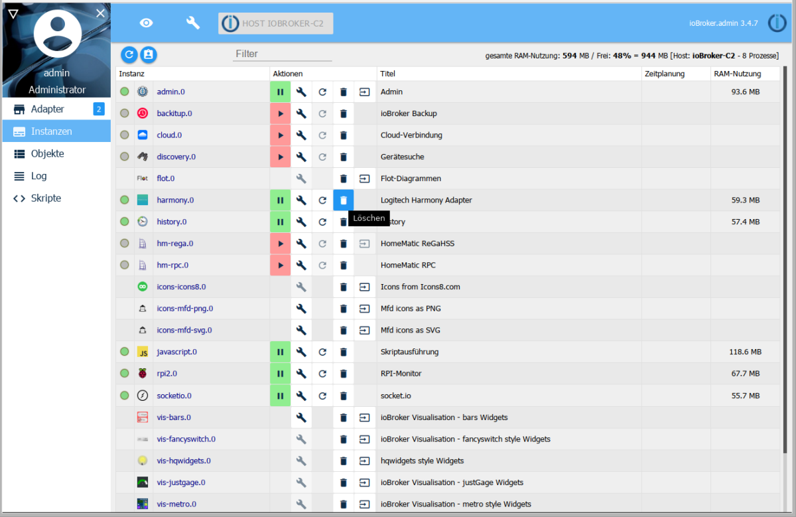

＃罗技和谐
Logitech Harmony适配器允许您轻松地将一个或多个Logitech Harmony Hub集成到ioBroker系统中。

Logitech Harmony Hub可以控制各种娱乐和智能家居设备。使用ioBroker，可以通过集线器启动和停止活动，可以查询活动状态，还可以通过虚拟按键远程控制设备。



##概述
###罗技和谐
罗技Harmony与270,000多种娱乐和智能家居设备兼容。这些包括电视和有线电视盒，光盘播放器和游戏机，AV接收器和流媒体播放器，以及智能照明，锁，恒温器等。

使用Logitech Harmony，您可以切换程序，调整音量，设置收藏夹以及控制照明和其他智能设备。系统的亮点是通过按下按钮创建控制多个设备的操作。

1. Logitech Harmony Hub通过Wi-Fi连接到家庭网络。
2.和谐集线器没有以太网端口。
3.集线器仅支持WLAN 2.4 GHz频段。 5 GHz频段将是

   不支持。

4.应使用802.11 g / n路由器。不支持802.11 a / b。
5. WEP 64/128，WPA Personal和WEP用作WLAN的加密

   支持WPA2-AES。

6.对于Harmony应用程序，不需要为Harmony启用UPnP

认识Hub并与他沟通。另一方面，必须启用它才能使集线器发现并使用网络上的其他设备。
例如，这适用于飞利浦hue，Sonos，Nest，Roku或智能电视等设备。

7.每个行程的最大设备数量是8个设备。如果是，可以使用15个设备

   远程至少一个Harmony Touch或Ultimate one在集线器上注册。

8.每个移动设备的最大信道数为50。

###罗技Harmony适配器
Logitech Harmony适配器通过与ioBroker服务器的Wi-Fi连接自动查找位于同一网络子网上的所有Logitech Harmony集线器。

用于触发函数和活动的对象（=命令宏）由ioBroker中的适配器自动创建。集线器的当前状态也可用。通过指定或读取创建的对象，可以更改其状态，从而可以触发或查询操作。

##安装前的先决条件
Logitech Harmony系统的ioBroker适配器不允许您创建或修改设备或活动。因此，在使用适配器之前，必须按照Logitech手册中的说明设置远程控制系统并使用受控设备。

##安装
通过ioBroker Admin界面安装适配器的实例。有关必要安装步骤的详细说明，请参见** **。

完成适配器实例的安装后，将自动打开配置窗口。

##配置
适配器自动查找ioBroker服务器子网中的所有Harmony集线器。

###“Logitech Harmony适配器设置”窗口


|领域|说明|
|:-------------|:-------------|
| ** Hub用户** |如果使用用户和密码提供对Harmony Hub配置的访问，则必须在此处输入用户名。它区分大小写。|
| **集线器密码** |如果使用用户和密码提供对Harmony Hub配置的访问，则必须在此处输入密码。它区分大小写。|

只有在使用用户名和密码保护集线器时，才需要完成这两个字段。

完成配置后，将使用`SPEICHERN UND SCHLIEßEN`退出配置对话框。这将导致随后重新启动适配器。

##实例
适配器的安装在`Objekte`部分中创建了Logitech Harmony Hub适配器的活动实例。


在ioBroker服务器上，只能安装一个Logitech Harmony适配器实例。

是否已启用适配器或连接到Logitech Harmony Hub，实例的状态字段的颜色表示。如果鼠标指针指向符号，则显示更详细的信息。

##适配器的对象
在`Objekte`部分中，集线器中适配器识别的所有设备和活动都以树结构列出。另外，还提供关于与集线器的通信是否顺利进行的信息。


每个数据点都与其关联的数据类型和权限相关联。
权限可以是读（R）和写（W）。每个数据点至少可以被读取（R），而其他数据点也可以被描述。要查找特定数据点，建议使用组合键“CTRL + F”进行搜索。

|对象|访问| Bescheibung |
|------|-------|-----------|
| **harmony.0** | R | Logitech Harmony适配器的第一个*实例*的名称
|＆＃; **Harmony Hub** | R | *Hub* 名称
|＆mp; **Apple TV Generation 3** | R | *device* 名称，包含设备功能|
|＆emsp; ** ** Denon AV接收器** | R | *device* 名称，包含设备功能|
|＆EMSP;＆EMSP; **：** | R |其他*设备* |
|＆EMSP;＆EMSP; **活动** | R |在Harmony Hub中编程的所有*活动*的列表
|＆EMSP;＆EMSP; ****** hubBlocked | R |指示集线器是否忙碌
|＆EMSP;＆EMSP; ****** hubConnected | R |适配器和集线器之间的连接状态|

###设备功能
如果您打开设备，您将获得一个列表，其中包含属于该设备的所有功能。这些设备功能是特定于设备的，因此不同类型的设备不同。


####触发设备功能
每个设备功能`{Instanz}.{Hub Name}.{Gerät}.{Gerätefunktion}`触发所寻址设备的相应反应。可以读取和写入设备功能的值。可以使用鼠标指针激活功能右侧的铃声来测试触发。或者，您也可以使用铅笔符号在那里输入值。
值具有单位`Millisekunden`。如果输入1到250毫秒之间的值，Harmony Hub通常会输出指定长度的单键按下。大于250ms的值可能导致设备多次运行。
触发设备功能后，该值将更改回0。

###活动
在`activities`下面列出了在Harmony Hub上编程的所有活动。


####开始活动
如果为活动`{Instanz}.{Hub Name}.activities.{Aktivität}`输入大于0的数字，则会启动活动。
在执行活动期间，此值首先更改为1（=开始），然后更改为2（=活动）。

####结束活动
可以通过将其值设置为0来停止运行活动。
或者，您可以输入任何数字来终止对象`{Instanz}.{Hub Name}.activities.currentStatus`中的活动。
在活动终止期间，`{Instanz}.{Hub Name}.activities.currentStatus`从3（=终止）变为0（=不活动）。

####其他状态值
`{Instanz}.{Hub Name}.activities.currentActivity`以字符串形式返回当前正在运行的活动。

`{Instanz}.{Hub Name}.activities.currentStatus`表示Harmony Hub的状态。价值观意味着

 -  0 =无效
 -  1 =开始
 -  2 =有效
 -  3 =完成

`{Instanz}.{Hub Name}.activities.{Aktivität}`表示活动的状态。
值的含义类似于`{Instanz}.{Hub Name}.activities.currentStatus`。

##卸载
> T：我认为在中央文章中标准安装了适配器的详细信息。适配器将（始终）引用此中心文章。此处仅记录与标准程序的偏差。

如果要再次删除该实例，则将通过Instances列中指定的垃圾桶图标将其删除



出现确认提示，必须用*** OK ***确认


然后会再次出现一个窗口，显示卸载命令的处理


此卸载将完全删除属于该实例的所有对象。

如果安装文件已从主机中完全删除，则必须通过适配器部分中Harmony适配器磁贴中的垃圾箱图标来完成。

##特价
备用

多主机

历史

性能

##常见问题
！>在论坛中搜索常见问题，并在此处给出参考答案

1. **与集线器的连接一次又一次地中断。**

Harmony Hub需要出色的无线通信才能与适配器通信。建议使用靠近集线器的无线LAN接入点。

2. **如何通过ioBroker实现“alles aus”按钮？**

   将`{Instanz}.{Hub Name}.activities.currentStatus`设置为0。

3. **在Windows下，安装适配器时会显示该消息

   `ERR! code ENOGIT`并且适配器不起作用。**

在安装Harmony适配器之前，请从网站https://git-scm.com/download/win下载并安装GIT。

4. **在Linux下，安装适配器时会显示该消息

   `ERR! code ENOGIT`并且适配器不起作用。**

在安装Harmony适配器之前，使用命令行和`sudo apt install git`安装GIT。

6. **脚本不再适用于较新版本的适配器。**

从适配器的0.9.1版开始，对象的命名方式不同。从旧的`harmony.0.Harmony_Hub`例如新的`harmony.0.Harmony Hub`。请检查对象并向其添加组件，例如自定义脚本。

7. ** Wi-Fi在夜间自动禁用。适配器调整为

   重启WLAN不会自动连接到HUB。**

在WiFi路由器启动后约5-10分钟插入和声实例（专家模式）的自动重启。

8. **找不到HUB。**

检查集线器是否与ioBroker服务器实际上是相同的网络子网和VLAN。是允许多播还是由路由器过滤？集线器上的状态LED是否亮起绿色？是否可以通过Logitech应用程序访问集线器？按照Logitech的说明解决连接问题。

9. **只能安装一个适配器实例。**

在ioBroker服务器上，只能安装一个Logitech Harmony适配器实例。

##例子
### JavaScript
触发设备功能。这里，当另一个数据点的值改变时，Denon AV接收器打开或关闭。

```
if (getState("hm-rpc.0.MEQ01234567.2.STATE").val == true) {
  setState("harmony.0.Harmony Hub.Denon AV-Empfänger.PowerOn"/*Denon AV-Empfänger:PowerOn*/, '1', true);
  // Bei Kontrolle Schalter == AN keine Verzögerung Schalter
} else if (getState("hm-rpc.0.MEQ01234567.2.STATE").val == false) {
  // Bei Kontrolle Schalter == AUS schalte mit Verzögerung
  var timeout = setTimeout(function () {
    setState("harmony.0.Harmony Hub.Denon AV-Empfänger.PowerOn"/*Denon AV-Empfängerr:PowerOn*/, '1', true);
  }, 1000);
}
```

### Blockly
触发设备功能。这里，当另一个数据点的值改变时，Denon AV接收器打开或关闭。


[源](media/a_harmony_blockly.xml)

### Node-Red
>关联节点 - 红色元素

>例子

>出口以供再利用

### Vis
>相关的vis元素

>例子

>出口以供再利用

>代码片段

##链接
>引用ioBroker门户中的其他文档

>网络链接，例如给制造商

> GitHub链接

*制造商方[https://www.logitech.com/de-de/product/harmony-hub](https://www.logitech.com/de-de/product/harmony-hub)

## Changelog
<!--
    Placeholder for the next version (at the beginning of the line):
    ### **WORK IN PROGRESS**
-->
### 1.5.0 (2024-06-02)
* (WolfspiritM) Multiple subnets can be entered as comma seperated list now. (#147)
* (mcm1957) Testing for node.js 22 has been added.
* (mcm1957) Dependencies have been updated.

### 1.4.0 (2024-04-11)
* (mcm1957) Adapter requires node.js 18 and js-controller >= 5 now
* (mcm1957) Translations have been updated
* (mcm1957) Dependencies have been updated

### 1.3.0 (2023-11-08)
* (mcm1957) Adapter requires nodejs 16 now.
* (mcm1957) Adapter has been moved to iobroker-community-adapters organisation.
* (mcm1957) Dependencies have been updated.

### 1.2.2 (2019-03-11)
* (foxriver76) reduce discover interval and only log newly discovered hubs

### 1.2.1 (2019-02-21)
* (foxriver76) use at least 1.0.5 of harmonyhubws

### 1.2.0 (2019-01-06)
* (foxriver76) compact mode compatibility added

### 1.1.5 (2018-12-28)
* (Pmant) fix hold key (for values > 250ms)

### 1.1.4 (2018-12-25)
* (Pmant) fix single key presses

### 1.1.2
* (Pmant) reduce log spam
* (Pmant) fix multiple instances of one hub

### 1.1.1
* (Pmant) switch to api module

### 1.1.0
* (Pmant) switch to websocket client

### 1.0.0
* (foxriver76) replace blanks by underscores
* (foxriver76) minor readme adjustments
* (foxriver76) discover interval 1000 ms by default again

### 0.10.2
* (foxriver76) added discover interval and port to code
* (foxriver76) discover interval is now 300 ms instead of 1000 ms

### 0.10.0
* (foxriver76) added possibility to specify subnet for discovery
* (foxriver76) fix translations
* (foxriver76) Logging improved
* (foxriver76) materialized index.html for admin v3
* (foxriver76) make sure callback in unload is called

### 0.9.6
* (foxriver76) updating code to es6
* (foxriver76) using maintained harmony libs for discover and client
* (foxriver76) possibility to only add whitelisted hubs
* (foxriver76) MAX_CLIENTS = 6 error fixed
* (foxriver76) enhanced logging
* (foxriver76) changes for new libs

### 0.9.3
* (justr1) fix error with hubname

### 0.9.1
please delete all harmony.x objects once
* (Pmant) fix problematic chars

### 0.7.0
* (Pmant) support multiple hubs
* (Pmant) removed hub config from admin
* (Pmant) find free Port for Hub-Discovery

### 0.6.2
* (Pmant) fix wrong port

### 0.6.1
* (Pmant) reduce logging

### 0.6.0
* (Pmant) fix admin in firefox
* (Pmant) improve connection stability (needs testing)

### 0.5.6
* (PArns) update harmony lib
* (PArns) removed unneeded functions due to lib update
* (Pmant) fix bug with blocked state

### 0.5.5
* (Pmant) fix hub lifecycle

### 0.5.4
* (Pmant) fix node 5.0.0

### 0.5.3
* (Pmant) fix node-xmpp-client version

### 0.5.2
* (Pmant) change: add instance after installation
* (Pmant) fix: deletes history settings

### 0.5.1
* (Pmant) fix: bug with wrong states

### 0.5.0
* (Pmant) change: object structure (delete instance once if had 0.2.1 or lower installed!)
* (Pmant) add: send commands for x milliseconds
* (Pmant) add: delete unused activities and devices
* (Pmant) add: delay commands when hub is busy

### 0.2.1
* (bluefox) change logo

### 0.2.0
* (Pmant) switch activity on state change
* (Pmant) stop current activity on hub status change
* (Pmant) move activities to activity channel
* (Pmant) add devices channel
* (Pmant) add device control

### 0.1.2
* (Pmant) hub discovery

### 0.1.1
* (Pmant) fixes

### 0.1.0
* (Pmant) keep alive connection to hub
* (Pmant) create/update objects and states
* (Pmant) update current activity status

### 0.0.1
* (Pmant) connect to hub
* (Pmant) listen for activies

## License
The MIT License (MIT)

Copyright (c) 2023-2024 iobroker-community-adapters <iobroker-community-adapters@gmx.de>
Copyright (c) 2015-2019 Pmant <patrickmo@gmx.de>

Permission is hereby granted, free of charge, to any person obtaining a copy
of this software and associated documentation files (the "Software"), to deal
in the Software without restriction, including without limitation the rights
to use, copy, modify, merge, publish, distribute, sublicense, and/or sell
copies of the Software, and to permit persons to whom the Software is
furnished to do so, subject to the following conditions:

The above copyright notice and this permission notice shall be included in
all copies or substantial portions of the Software.

THE SOFTWARE IS PROVIDED "AS IS", WITHOUT WARRANTY OF ANY KIND, EXPRESS OR
IMPLIED, INCLUDING BUT NOT LIMITED TO THE WARRANTIES OF MERCHANTABILITY,
FITNESS FOR A PARTICULAR PURPOSE AND NONINFRINGEMENT. IN NO EVENT SHALL THE
AUTHORS OR COPYRIGHT HOLDERS BE LIABLE FOR ANY CLAIM, DAMAGES OR OTHER
LIABILITY, WHETHER IN AN ACTION OF CONTRACT, TORT OR OTHERWISE, ARISING FROM,
OUT OF OR IN CONNECTION WITH THE SOFTWARE OR THE USE OR OTHER DEALINGS IN
THE SOFTWARE.