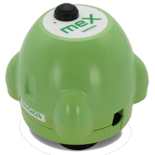

# IoBroker.heizoel24-mex
**测试：**

## Heizoel24-mex 适配器用于 ioBroker
MEX 是一种加热油位测量装置。此适配器从 Heizoel24 服务器读取 MEX 数据。

请参阅：https://www.heizoel24.de/mex

＃＃ 使用：
只需输入 Heizoel24 帐户的登录数据（电子邮件和密码）。
MEX 数据存储在数据点 heizoel24-mex 中。
适配器默认每 3 小时启动一次。这完全足够了，因为 MEX 每天只发送一次数据。
数据点 CalculatedRemaining/JsonForEcharts（计算的剩余数量）可以直接使用 eCharts 打开。

## Changelog

<!--
    Placeholder for the next version (at the beginning of the line):
    ### **WORK IN PROGRESS**
-->
### 1.3.1 (2024-03-24)

- CalculatedRemaining json data point for eCharts added

### 1.3.0 (2024-03-24)

- New README.md
- CalculatedRemaining data points removed

### 1.2.0 (2024-03-16)

- CalculatedRemaining data points renamed to "Today+XXXX Days"
- Limited to 52 data points
- Option for save CalculatedRemaining json

### 1.1.0 (2024-03-09)

- Superfluous logging function removed

### 1.0.1-alpha.0 (2024-03-08)

- Repo new triggering

### 1.0.0 (2024-03-08)

- Initial release for tests

## License
MIT License

Copyright (c) 2024 Daniel Luginbühl <webmaster@ltspiceusers.ch>

Permission is hereby granted, free of charge, to any person obtaining a copy
of this software and associated documentation files (the "Software"), to deal
in the Software without restriction, including without limitation the rights
to use, copy, modify, merge, publish, distribute, sublicense, and/or sell
copies of the Software, and to permit persons to whom the Software is
furnished to do so, subject to the following conditions:

The above copyright notice and this permission notice shall be included in all
copies or substantial portions of the Software.

THE SOFTWARE IS PROVIDED "AS IS", WITHOUT WARRANTY OF ANY KIND, EXPRESS OR
IMPLIED, INCLUDING BUT NOT LIMITED TO THE WARRANTIES OF MERCHANTABILITY,
FITNESS FOR A PARTICULAR PURPOSE AND NONINFRINGEMENT. IN NO EVENT SHALL THE
AUTHORS OR COPYRIGHT HOLDERS BE LIABLE FOR ANY CLAIM, DAMAGES OR OTHER
LIABILITY, WHETHER IN AN ACTION OF CONTRACT, TORT OR OTHERWISE, ARISING FROM,
OUT OF OR IN CONNECTION WITH THE SOFTWARE OR THE USE OR OTHER DEALINGS IN THE
SOFTWARE.