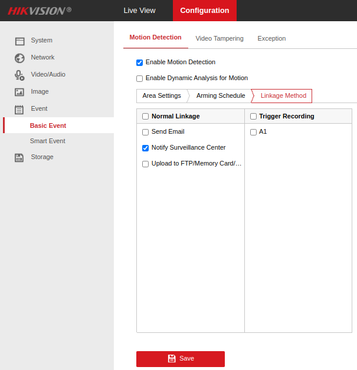

# IoBroker.hikvision-alarmserver
**测试：** 

## IoBroker 的海康威视警报服务器适配器
用于接收海康威视摄像机发送的警报/事件的适配器。

海康威视机型测试：

- DS-2CD2043G2-I
- DS-2CD2143G2-I
- DS-2DE2A404IW-DE3
- DS-2DE3A404IW-DE/W

如果您的模型不在此列表中，欢迎提交成功/失败/错误报告。

＃＃ 用法
适配器实例为报告的每个摄像机/事件类型组合创建一个布尔状态。摄像头由 MAC 地址标识（受摄像头提供的信息限制）。

似乎当这些事件仍然有效但没有发送消息来清除它们时，摄像机每秒都会重复发出事件。为此，适配器会自动清除超过 5 秒未重新报告的事件。

＃＃ 配置
### IoBroker
在适配器配置中，选择一个空闲端口供适配器侦听（默认为 8089）。

### 在相机上
访问您的摄像机的配置页面并定义 ioBroker IP/主机和端口设置：

确保在您要报告给 ioBroker 的事件中链接包括“通知监控中心”。例如：

## Changelog

<!--
  Placeholder for the next version (at the beginning of the line):
  ### **WORK IN PROGRESS**
-->
### 0.0.7 (2022-12-29)
-   (Robin Rainton) Add bind address option ([#9](https://github.com/iobroker-community-adapters/ioBroker.hikvision-alarmserver/issues/9)).
-   (Robin Rainton) Try to derive device names from net-tools. Optionally use channelName from devices ([#10](https://github.com/iobroker-community-adapters/ioBroker.hikvision-alarmserver/issues/10)).

### 0.0.6 (2022-12-13)
-   (Robin Rainton) Handle multipart message payload ([#5](https://github.com/iobroker-community-adapters/ioBroker.hikvision-alarmserver/issues/5)).
-   (Robin Rainton) Handle payloads without XML declaration ([#7](https://github.com/iobroker-community-adapters/ioBroker.hikvision-alarmserver/issues/7).)

### 0.0.5 (2022-12-10)
-   (Robin Rainton) Drop colons from device IDs.

### 0.0.2
-   (Robin Rainton) initial release.

## License
MIT License

Copyright (c) 2022 Robin Rainton <robin@rainton.com>

Permission is hereby granted, free of charge, to any person obtaining a copy
of this software and associated documentation files (the "Software"), to deal
in the Software without restriction, including without limitation the rights
to use, copy, modify, merge, publish, distribute, sublicense, and/or sell
copies of the Software, and to permit persons to whom the Software is
furnished to do so, subject to the following conditions:

The above copyright notice and this permission notice shall be included in all
copies or substantial portions of the Software.

THE SOFTWARE IS PROVIDED "AS IS", WITHOUT WARRANTY OF ANY KIND, EXPRESS OR
IMPLIED, INCLUDING BUT NOT LIMITED TO THE WARRANTIES OF MERCHANTABILITY,
FITNESS FOR A PARTICULAR PURPOSE AND NONINFRINGEMENT. IN NO EVENT SHALL THE
AUTHORS OR COPYRIGHT HOLDERS BE LIABLE FOR ANY CLAIM, DAMAGES OR OTHER
LIABILITY, WHETHER IN AN ACTION OF CONTRACT, TORT OR OTHERWISE, ARISING FROM,
OUT OF OR IN CONNECTION WITH THE SOFTWARE OR THE USE OR OTHER DEALINGS IN THE
SOFTWARE.