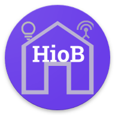

# IoBroker.hiob
**信息：**  

**版本：**  

**测试：**   [![测试与发布]（https://github.com/moba15/ioBroker.hiob/actions/workflows/test-and-release.yml/badge.svg）](https://github.com/moba15/ioBroker.hiob/actions/workflows/test-and-release.yml)

## IoBroker 的 HioB 适配器
此应用程序允许您通过 hiob 应用程序控制 ioBroker Smarthome 系统。与配置可能性较少的同类项目相比，它是一种更简单、更快速的替代方案。它主要用于 Android 设备，但也适用于 Windows 和 Linux 桌面。

＃＃ 要求
- 节点 >= 18
- Android 手机

## 测试
- 三星 Android 手机
- Google Pixel Android 手机
- 索尼 Pixel Android 手机
- 小米手机
- Android 10/11/13

## 应用代码
[APP 代码](https://github.com/moba15/hiob_app)

＃＃ 描述
🇬🇧[描述](/docs/en/README.md) 🇩🇪[文档](/docs/de/README.md)

＃＃ 例子
🇬🇧[例子](/docs/en/example.md) 🇩🇪[示例](/docs/de/example.md)

＃＃ 问题
🇩🇪 [问题](https://forum.iobroker.net/topic/55250/neuer-adapter-hiob-handy-app)

＃＃ 已知的问题
- 0.1.4：blockly 元素不应该出现在这个版本中。它目前不起作用

## Changelog

<!--
    Placeholder for the next version (at the beginning of the line):
    ### **WORK IN PROGRESS**
-->
### 0.1.4 (2024-04-24)
- (Lucky-Esa) added docs and more examples
- (moba15) Implement suggestions for latest release

### 0.1.3 (2024-03-29)
- (Lucky-ESA) fixed common.keywords
- (mob15) updated dependencies

### 0.1.2 (2024-03-27)
- (Lucky-ESA) changed license Information

### 0.1.1 (2024-03-27)
- (moba15) fixed package.json

### 0.1.0 (2024-03-27)
- (Lucky-ESA) added more docs
- (moba15) fixed backlog warning
- (moba15) changed node version to min. 18

### 0.0.67 (2024-03-25)
 - (moba15) fixed icon
 - (moba15) added notifications backlog, if client is not connected (up to 250 messages)
 - (moba15) fixed login

### 0.0.67-beta.1 (2024-03-25)
 - (moba15) Fixed missing io-package config due to missing commit

### 0.0.67-beta.0 (2024-03-25)
 - (moba15) Fixed #25
 - (moba15) sendTo support for notifications
 - (Lucky-ESA) Handling sensitive data & timeouts #22

### 0.0.66 (2024-03-23)
- Added some docs

### 0.0.66-beta.0 (2024-03-22)
- First implementation of notifications

### 0.0.65 (2024-03-15)
 - (moba15) fixed linter

### 0.0.64 (2024-03-15) 
- (moba15) changed icon
- fixed code linter problems

### 0.0.62 (2024-03-04)
- (moba15) fixed bug, where broadcasted messages where sent without type

### 0.0.62 (2024-03-04)
- (moba15) fixed bug, where broadcasted messages where sent without type

### 0.0.61 (2024-03-04)
- (moba15) fixed secure connection bug (#20)

### 0.0.61-beta.0 (2024-03-01)
- (Lucky-ESA) Preperation of lastest request
- (moba15) fixed some smaller issues

### 0.0.60 (2024-02-25)

-   (Lucky-ESA) Added simple AES encryption
-   (Lucky-ESA) Preperation for latest request
-   (moba15) Fixed login errors if AES encryption is disabled

### 0.0.55 (2023-02-11)

-   (moba15) Fixed Adapter crash if data point does not exist
-   (moba15) Fixed some login errors

### 0.0.54 (2023-12-31)

-   (moba15) Added secure login
-   (moba15) Added secure connetion
-   (moba15) Automatic acceptance of incoming connections for 60 seconds

### 0.0.1 (2023-03-26)

-   (moba15) initial release

## License

MIT License

Copyright (c) 2023-2024 mor15Euro [hiob@bachmaiers.de](http://localhost:5000/u/bh3bIYvKVLQXD837pc8JlAJHx3Z2)

Permission is hereby granted, free of charge, to any person obtaining a copy
of this software and associated documentation files (the "Software"), to deal
in the Software without restriction, including without limitation the rights
to use, copy, modify, merge, publish, distribute, sublicense, and/or sell
copies of the Software, and to permit persons to whom the Software is
furnished to do so, subject to the following conditions:

The above copyright notice and this permission notice shall be included in all
copies or substantial portions of the Software.

THE SOFTWARE IS PROVIDED "AS IS", WITHOUT WARRANTY OF ANY KIND, EXPRESS OR
IMPLIED, INCLUDING BUT NOT LIMITED TO THE WARRANTIES OF MERCHANTABILITY,
FITNESS FOR A PARTICULAR PURPOSE AND NONINFRINGEMENT. IN NO EVENT SHALL THE
AUTHORS OR COPYRIGHT HOLDERS BE LIABLE FOR ANY CLAIM, DAMAGES OR OTHER
LIABILITY, WHETHER IN AN ACTION OF CONTRACT, TORT OR OTHERWISE, ARISING FROM,
OUT OF OR IN CONNECTION WITH THE SOFTWARE OR THE USE OR OTHER DEALINGS IN THE
SOFTWARE.