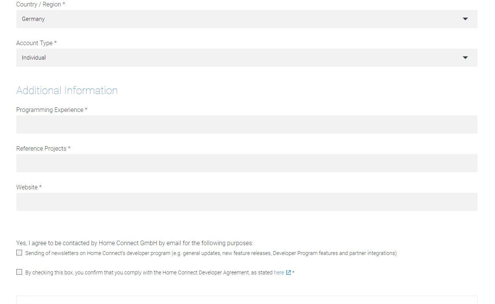

# IoBroker.homeconnect
## 安装前的 Voraussetzungen
这是 Node.js 版本 8 安装过程！！

Für den Adapter wrd eine ClientID benötigt。 Nutze die Einstellungen um jeden Schritt der Registrierung zu erreichen。

## 安装前的要求
至少必须安装 Node.js 版本 8！

适配器需要 ClientID。使用每个步骤的设置进行注册。

<https://developer.home-connect.com>

Bei **用于测试的默认 Home Connect 用户帐户** 已注册电子邮件地址，请注册 Home-Connect-App，然后再注册授权过程。

对于 **用于测试的默认 Home Connect 用户帐户**，指定用于发送 Home Connect 应用程序的电子邮件地址。
已注册，稍后在授权过程中也需要这样做。

Bei **账户类型** 个人 auswählen。 Die restlichen Daten sofern vorhanden ergänzen (keine Ahnung, ob das geprüft wrd)。

对于**帐户类型**，选择个人。添加剩余数据（如果可用）（不知道是否会检查）。

Dann auf **应用程序** 和 anschließend auf **注册应用程序** gehen。

然后转到**应用程序**，然后转到**注册应用程序**。

Bei **应用程序 ID** einen Namen für die 应用程序 eintragen，z.B. ioBroker。 Bei **OAuth Flow** 设备流程选择。
**用于测试的 Home Connect 用户帐户** kann leer bleiben。 Bei **成功重定向** eine URI eintragen，z.B. https://example.com。
Dann Speichern 和 dann hat man die benötigte ClientID。

对于**应用程序 ID**，输入应用程序的名称，例如ioBroker。使用 **OAuth Flow** 设备流选择。
**用于测试的 Home Connect 用户帐户**可以保留为空。对于 **成功重定向** 输入 URI，例如https://example.com。
然后保存，您就有了所需的 ClientID。

## 配置
在 Adapter-Config 中，输入 Homeconnect 应用程序的名称、密码和 ClientID 即可。

## 贝努宗
Mit den 在命令中声明 kannst du das Programm stoppen, pausieren oder fortführen。

Mit den 的设置为 kannst du das Gerät ein oder ausschalten。

在状态programs.active.BSH_Common_Root_ActiveProgram 中启动程序更新iQ300：这是一个非常好的程序。 Wenn manprograms.selected.BSH_Common_Root_SelectedProgram ausliest und einträgt, hat der User die Möglichkeit am Gerät des gewünschte Programm auszuwählen, welches dann per ioBroker gestartet wird.

在 Statesprograms.selected.BSH_Common_Root_SelectedProgram 中包含 Programms oder Optionen

Wenn man checken möchte, ob ein Programm fertig ist muss

状态.BSH_Common_Status_OperationState

auf den kompleten 状态名称 übrprüft werden:

BSH.Common.EnumType.OperationState.Finished

Weitere Zustände sind noch：

"BSH.Common.EnumType.OperationState.Inactive": "非活动", "BSH.Common.EnumType.OperationState.Ready": "就绪", "BSH.Common.EnumType.OperationState.Run": "运行", "BSH .Common.EnumType.OperationState.ActionRequired": "ActionRequired", "BSH.Common.EnumType.OperationState.Finished": "已完成"

Oder ob ein Gerät geoffnet ist

"BSH.Common.EnumType.DoorState.Open": "打开", "BSH.Common.EnumType.DoorState.Closed": "关闭"

＃＃ 用法
通过命令中的状态，您可以停止、暂停和恢复程序。
通过设置中的状态，您可以关闭或打开设备。更改programs.active.BSH_Common_Root_ActiveProgram 的值将导致启动程序更新iQ300：您需要在此变量中设置程序名称。如果复制programs.selected.BSH_Common_Root_SelectedProgram，机器用户可以在机器上预定义所需的程序，并将通过ioBroker启动该程序。更改programs.selected.BSH_Common_Root_SelectedProgram的值导致选择程序或选项

## Changelog
<!--
    Placeholder for the next version (at the beginning of the line):
    ### **WORK IN PROGRESS**
-->
### **WORK IN PROGRESS**
-   (mcm1957) changed: Testing has been changed to support node 16, 18 and 20
-   (mcm1957) changed: Dependencies have been updated
-   (ta2k) restart adapter instead of relogin

### 1.1.1 

- Fix auto login for SingleKey User

### 1.1.0

- Add auto login for SingleKey User

### 1.0.3

- Add manually login for SingleKey User
  
### 1.0.2

- Adapter complete rewriten. Includes a lot of Bugfixes

### 0.0.36

- fix for js.controller 3.3. Please delete the device in Objects manually

### 0.0.32 (29.12.2020)

- (Morluktom) bugfix for devices that are completely switched off (e.g. washing machine, dryer)

### 0.0.31

- (ta2k) fix pause start command

### 0.0.30 (10.05.2020)

- (ta2k) fix js controller 3 issues

### 0.0.27 (13.11.2019)

- (ta2k) improve option selecting

### 0.0.26 (04.11.2019)

- (ta2k) fix boolean settings

### 0.0.25 (08.09.2019)

- (ta2k) fix compact mode
- (ta2k) reduce query per minute to prevent too much request error

### 0.0.24 (08.09.2019)

- (ta2k) improve error messaging

### 0.0.22 (08.09.2019)

- (ta2k) improve error messaging

### 0.0.22 (26.07.2019)

- (ta2k) bugfixing

### 0.0.21 (12.07.2019)

- (ta2k) bugfixing

### 0.0.19 (30.06.2019)

- (ta2k) improve displaying long states, options and events

### 0.0.18 (26.06.2019)

- (ta2k) add error handling for stoping

### 0.0.17 (26.06.2019)

- (ta2k) make commands writeable

### 0.0.16 (26.06.2019)

- (ta2k) cleanup states after update

### 0.0.15 (24.06.2019)

- (ta2k) reconnect after token refresh

### 0.0.14 (18.06.2019)

- (ta2k) check for keep alive events

### 0.0.13 (18.06.2019)

- (ta2k) close event stream before reconnect

### 0.0.12 (18.06.2019)

- (ta2k) fix events lost after 12hr

### 0.0.11 (09.06.2019)

- (ta2k) fix set values and refresh available options after program select

### 0.0.10 (04.06.2019)

- (ta2k) add settings and commands, add options to available and fix bugs

### 0.0.9 (29.05.2019)

- (ta2k) clean up code and receive event notifications

### 0.0.8 (10.04.2019)

- (dna909) increase refreshTokenInterval

### 0.0.7 (03.04.2019)

- (TA2k) Improve refreshToken and add Register process in instance option

### 0.0.6 (09.01.2019)

- (dna909) Oven: add Option.FastPreHeat, Logging, query stream.type DISCONNECTED
- (tFaster) code format and cleanups,fixed devices data structure,renamed deviceArray to devices,
    added startInRelative for Oven

### 0.0.5 (28.11.2018)

- (dna909) add eventstream handling

### 0.0.4 (23.11.2018)

- (dna909) add event-listener

### 0.0.3 (14.11.2018)

- (dna909) query States and available programs

### 0.0.2 (08.11.2018)

- (dna909) OAuth2 Deviceflow-Authorization, enumerate connected appliances

### 0.0.1 (09.10.2018)

- (dna909) initial release

## License

The MIT License (MIT)

Copyright (c) 2020 dna909 <dna909@googlemail.com>, TA2k

Permission is hereby granted, free of charge, to any person obtaining a copy
of this software and associated documentation files (the "Software"), to deal
in the Software without restriction, including without limitation the rights
to use, copy, modify, merge, publish, distribute, sublicense, and/or sell
copies of the Software, and to permit persons to whom the Software is
furnished to do so, subject to the following conditions:

The above copyright notice and this permission notice shall be included in
all copies or substantial portions of the Software.

THE SOFTWARE IS PROVIDED "AS IS", WITHOUT WARRANTY OF ANY KIND, EXPRESS OR
IMPLIED, INCLUDING BUT NOT LIMITED TO THE WARRANTIES OF MERCHANTABILITY,
FITNESS FOR A PARTICULAR PURPOSE AND NONINFRINGEMENT. IN NO EVENT SHALL THE
AUTHORS OR COPYRIGHT HOLDERS BE LIABLE FOR ANY CLAIM, DAMAGES OR OTHER
LIABILITY, WHETHER IN AN ACTION OF CONTRACT, TORT OR OTHERWISE, ARISING FROM,
OUT OF OR IN CONNECTION WITH THE SOFTWARE OR THE USE OR OTHER DEALINGS IN
THE SOFTWARE.