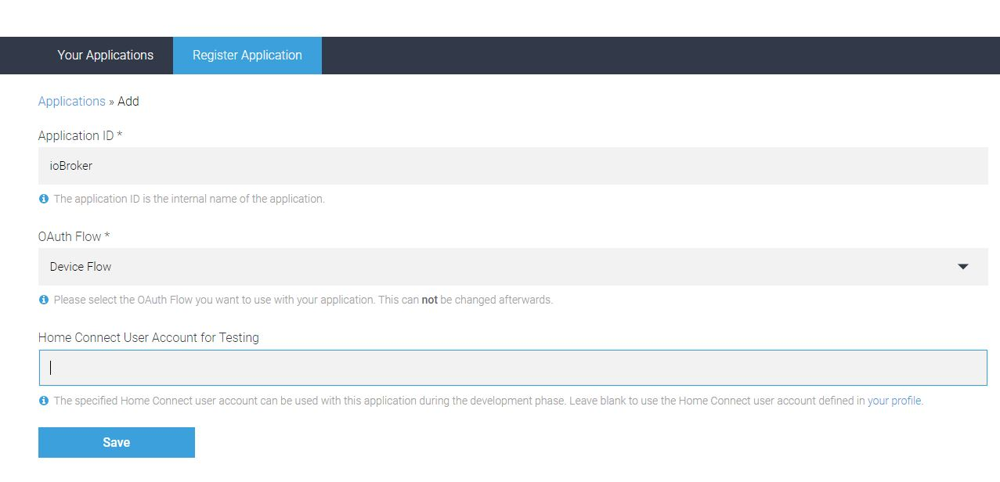

# IoBroker.homeconnect
    **版本：**     **测试：**    [![CodeQL]（https://github.com/iobroker-community-adapters/ioBroker.homeconnect/actions/workflows/codeql.yml/badge.svg）](https://github.com/iobroker-community-adapters/ioBroker.homeconnect/actions/workflows/codeql.yml)

哨兵
**此适配器使用 Sentry 库自动向开发人员报告异常和代码错误。** 有关更多详细信息以及如何禁用错误报告的信息，请参阅[Sentry-插件文档](https://github.com/ioBroker/plugin-sentry#plugin-sentry)！从 js-controller 3.0 开始使用 Sentry 报告。

## IoBroker 的 Homeconnect 适配器
## 安装前要求
至少必须安装 Node.js 18 版本！

适配器需要 ClientID。使用每个步骤的设置进行注册。

<https://developer.home-connect.com>

对于**用于测试的默认 Home Connect 用户帐户**，请指定用于发送 Home Connect 应用程序的电子邮件地址。
已注册，这在后续授权过程中也是必需的。

对于**帐户类型**，选择个人。如果可用，请添加其余数据（不知道是否会检查）。

然后转到**应用程序**，然后转到**注册应用程序**。

对于 **应用程序 ID**，请输入应用程序的名称，例如 ioBroker。使用 **OAuth Flow** 设备流进行选择。
**Home Connect 测试用户帐户** 可以保留为空。对于 **成功重定向**，请输入 URI，例如 https://example.com。
然后保存，您便获得了所需的 ClientID。

＃＃ 配置
请将 Homeconnect App 用户名、密码和生成的 cleintId 添加到适配器配置中。

＃＃ 用法
使用命令中的状态，您可以停止、暂停和恢复程序。
使用设置中的状态，您可以关闭或打开设备 更改 programs.active.BSH_Common_Root_ActiveProgram 的值会导致启动程序 更新 iQ300：您需要在此变量中设置程序名称。如果复制了 programs.selected.BSH_Common_Root_SelectedProgram，机器用户可以在机器上预定义所需的程序，它将通过 ioBroker 启动 更改 programs.selected.BSH_Common_Root_SelectedProgram 的值会导致选择程序或选项

## Changelog

<!--
    Placeholder for the next version (at the beginning of the line):
    ### **WORK IN PROGRESS**
-->
### 1.4.0 (2024-04-18)
- (mcm1957) Adapter requires node.js >= 18 and js-controller >= 5 now
- (mcm1957) Dependencies have been updated

### 1.3.0 (2023-12-15)

- fix login

### 1.2.2 (2023-12-02)

- bump version

### 1.2.1 (2023-12-02)

- bump version

### 1.2.0 (2023-12-02)

- fix login flow
- (mcm1957) changed: Testing has been changed to support node 16, 18 and 20
- (mcm1957) changed: Dependencies have been updated
- (ta2k) restart adapter instead of relogin

### 1.1.1

- Fix auto login for SingleKey User

### 1.1.0

- Add auto login for SingleKey User

### 1.0.3

- Add manually login for SingleKey User

### 1.0.2

- Adapter complete rewriten. Includes a lot of Bugfixes

### 0.0.36

- fix for js.controller 3.3. Please delete the device in Objects manually

### 0.0.32 (29.12.2020)

- (Morluktom) bugfix for devices that are completely switched off (e.g. washing machine, dryer)

### 0.0.31

- (ta2k) fix pause start command

### 0.0.30 (10.05.2020)

- (ta2k) fix js controller 3 issues

### 0.0.27 (13.11.2019)

- (ta2k) improve option selecting

### 0.0.26 (04.11.2019)

- (ta2k) fix boolean settings

### 0.0.25 (08.09.2019)

- (ta2k) fix compact mode
- (ta2k) reduce query per minute to prevent too much request error

### 0.0.24 (08.09.2019)

- (ta2k) improve error messaging

### 0.0.22 (08.09.2019)

- (ta2k) improve error messaging

### 0.0.22 (26.07.2019)

- (ta2k) bugfixing

### 0.0.21 (12.07.2019)

- (ta2k) bugfixing

### 0.0.19 (30.06.2019)

- (ta2k) improve displaying long states, options and events

### 0.0.18 (26.06.2019)

- (ta2k) add error handling for stoping

### 0.0.17 (26.06.2019)

- (ta2k) make commands writeable

### 0.0.16 (26.06.2019)

- (ta2k) cleanup states after update

### 0.0.15 (24.06.2019)

- (ta2k) reconnect after token refresh

### 0.0.14 (18.06.2019)

- (ta2k) check for keep alive events

### 0.0.13 (18.06.2019)

- (ta2k) close event stream before reconnect

### 0.0.12 (18.06.2019)

- (ta2k) fix events lost after 12hr

### 0.0.11 (09.06.2019)

- (ta2k) fix set values and refresh available options after program select

### 0.0.10 (04.06.2019)

- (ta2k) add settings and commands, add options to available and fix bugs

### 0.0.9 (29.05.2019)

- (ta2k) clean up code and receive event notifications

### 0.0.8 (10.04.2019)

- (dna909) increase refreshTokenInterval

### 0.0.7 (03.04.2019)

- (TA2k) Improve refreshToken and add Register process in instance option

### 0.0.6 (09.01.2019)

- (dna909) Oven: add Option.FastPreHeat, Logging, query stream.type DISCONNECTED
- (tFaster) code format and cleanups,fixed devices data structure,renamed deviceArray to devices,
  added startInRelative for Oven

### 0.0.5 (28.11.2018)

- (dna909) add eventstream handling

### 0.0.4 (23.11.2018)

- (dna909) add event-listener

### 0.0.3 (14.11.2018)

- (dna909) query States and available programs

### 0.0.2 (08.11.2018)

- (dna909) OAuth2 Deviceflow-Authorization, enumerate connected appliances

### 0.0.1 (09.10.2018)

- (dna909) initial release

## License

The MIT License (MIT)

Copyright (c) 2024 iobroker-community-adapters <iobroker-community-adapters@gmx.de>
Copyright (c) 2023 dna909 <dna909@googlemail.com>, TA2k

Permission is hereby granted, free of charge, to any person obtaining a copy
of this software and associated documentation files (the "Software"), to deal
in the Software without restriction, including without limitation the rights
to use, copy, modify, merge, publish, distribute, sublicense, and/or sell
copies of the Software, and to permit persons to whom the Software is
furnished to do so, subject to the following conditions:

The above copyright notice and this permission notice shall be included in
all copies or substantial portions of the Software.

THE SOFTWARE IS PROVIDED "AS IS", WITHOUT WARRANTY OF ANY KIND, EXPRESS OR
IMPLIED, INCLUDING BUT NOT LIMITED TO THE WARRANTIES OF MERCHANTABILITY,
FITNESS FOR A PARTICULAR PURPOSE AND NONINFRINGEMENT. IN NO EVENT SHALL THE
AUTHORS OR COPYRIGHT HOLDERS BE LIABLE FOR ANY CLAIM, DAMAGES OR OTHER
LIABILITY, WHETHER IN AN ACTION OF CONTRACT, TORT OR OTHERWISE, ARISING FROM,
OUT OF OR IN CONNECTION WITH THE SOFTWARE OR THE USE OR OTHER DEALINGS IN
THE SOFTWARE.