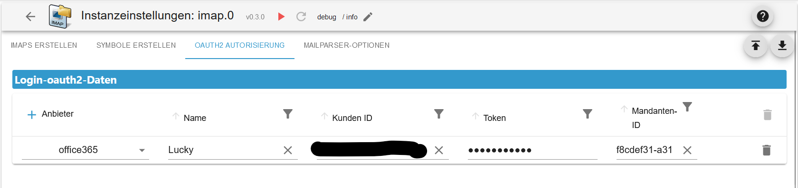
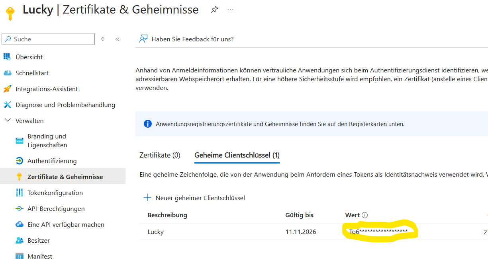
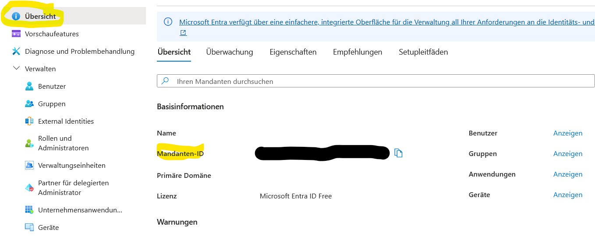

# IoBroker.imap
```:warning:
 ⚠ Dieser Adapter kann mit dem Blockly (Eigene Abfrage) das System sehr schnell zum Absturz bringen.
 ⚠ Daher bitte diese Beschreibung aufmerksam durchlesen.
```

[返回自述文件](/README.md)

＃ 概括
- [实例设置](#instance-settings)
- [设置 TAB IMAP](#instance-configuration-tab-imap-create)
- [设置 TAB 符号](#instance-configuration-tab-symbols-create)
- [设置选项卡 Oauth2](#instance-configuration-tab-oauth2-create)
- [设置 TAB 邮件解析器](#instance-configuration-tab-mailparser-options-create)
- [数据点](#states-objects)
- [数据点 imap.0](#states-imap0)
- [数据点 imap.0.用户名](#states-imap0username)
- [数据点 imap.0.username.email.emails_xx](#states-imap0usernameemailemail_xx)
- [数据点 imap.0.username.infos](#states-imap0usernameinfos)
- [数据点 imap.0.username.remote](#states-imap0usernameremote)
- [数据点 imap.0.username.remote.copy](#states-imap0usernameremotecopy)
- [数据点 imap.0.username.remote.flag](#states-imap0usernameremoteflag)
- [数据点 imap.0.username.remote.html](#states-imap0usernameremotehtml)
- [数据点 imap.0.username.remote.move](#states-imap0usernameremotemove)
- [Blocklys](#blocklys)
- [更改 Blockly 实例设置](#blockly-imap-query-with-instance-settings)
- [创建您自己的查询]（#blockly-imap-change-query）
- [使用实例设置进行查询](#blockly-imap-custom-query)
- [设置标志](#blockly-imap-flags-setzen)
- [数组 JSON](#array-json)
- [imap.0.xxx.email.email_xx.attach_json](#array-json-imap0xxxemailemail_xxattach_json)
- [imap.0.xxx.json](#array-json-imap0xxxjson)
-[imap.0.xxx.last_activity_json](#json-imap0xxxlast_activity_json)
- [imap.0.xxx.quality](#json-imap0xxxquality)
- [imap.0.xxx.状态](#json-imap0xxxstatus)
-[imap.0.online_history](#array-json-imap0online_history)
- [Javascript 和 Blocklys 示例](/docs/de/EXAMPLE.md)

# 实例设置
### 实例配置 TAB IMAP 创建
[概括](#zusammenfassung)

```:warning:
 ⚠ Die Instanz muss aktiviert sein!!!!
```

- `Active`: 激活 IMAP 连接
- `主机`：例如 imap.gmail.com
- `收件箱`：标准收件箱 - 需要监控的收件箱 - 可能的选择请参见 imap.0.xxx.remote.change_folder

例如：INBOX.subfolder（点作为分隔符）

- `端口`：默认 993
- `用户名`：用户名 - 实例必须激活！！！
- `Password`: 密码 - 必须启用实例!!! - [gmail 登录](https://support.google.com/mail/answer/185833?hl=de) - [outlook Oauth2 身份验证](https://learn.microsoft.com/en-us/entra/identity-platform/quickstart-register-app?tabs=certificate)

  

- `max.`：系统最大数据点 email_01...email_02... (1-99)
- `max. HTML`：HTML 格式电子邮件的最大数量。必须大于最大数据点数 (1-99)
- `TLS`: 使用 TLS 连接 - 默认为 true
- `Flags`：IMAP 查询的标志。可能的标志包括：

```
ALL - alle – Alle Nachrichten.
ANSWERED - geantwortet – Nachrichten mit gesetzter Beantwortet-Flagge.
DELETED - gelöscht – Nachrichten mit gesetzter Gelöscht-Flagge.
DRAFT - Entwurf – Nachrichten mit gesetzter Entwurfsflagge.
FLAGGED - gekennzeichnet – Nachrichten mit gesetzter Flagge.
NEW - neu – Nachrichten, bei denen das Flag „Zuletzt verwendet“ gesetzt ist, aber nicht das Flag „Gesehen“.
SEEN - gesehen – Nachrichten, bei denen das Flag „Gesehen“ gesetzt ist.
RECENT - jüngste – Nachrichten, bei denen das Flag „Zuletzt verwendet“ gesetzt ist.
OLD - alt – Nachrichten, für die das Flag „Zuletzt verwendet“ nicht gesetzt ist. Dies entspricht funktional !RECENT (im Gegensatz zu „!NEW“).
UNANSWERED - unbeantwortet – Nachrichten, bei denen das Flag „Beantwortet“ nicht gesetzt ist.
UNDELETED - ungelöscht – Nachrichten, für die das Flag „Gelöscht“ nicht gesetzt ist.
UNDRAFT - kein Entwurf – Nachrichten, bei denen das Draft-Flag nicht gesetzt ist.
UNFLAGGED - ungekennzeichnet – Nachrichten, für die das Flag „Markiert“ nicht gesetzt ist.
UNSEEN - ungesehen – Nachrichten, bei denen das Flag „Gesehen“ nicht gesetzt ist.
```

- `选择图标`：文件夹的图标（在 TAB `创建图标` 下上传）


- `tls-option`：默认为 {"rejectUnauthorized": false}
- `Auto-TLS`：可选选项包括 `always`、`required` 和 `never`。默认为 `never`。

**更多信息请阅读[这里](https://www.npmjs.com/package/node-imap)。**


- `Att.`：要填充 HTML 字段，必须加载附件。这会占用大量 RAM！因此，默认值为 `false`。
-`Mailparser-Option`：Mailparser 选项（首先在 TAB`MAILPARSER-OPTIONS` 下创建）
- `Token`: Token [先在此处创建](#instance-configuration-tab-oauth2-create)


- `最大 MEMRSS 限制：`从触发以下操作时开始。
- `重启`：如果达到 MEMRSS 限制，适配器将重启。但是，此检查每 24 小时仅执行一次。


- `对象 ID：` 如果达到 MEMRSS 限制，则所选数据点将设置为 `true`。必须手动重置此设置。不过，它每 24 小时仅检查一次。


- `发送`：如果达到 MEMRSS 限制，则会发送一条消息。之后每次 `MEMRSS` 更新时都会发送一条消息。
-`实例：`示例：telegram.0、telegram.1、pushover.0
- `实例用户：`示例：Peter、Olaf、Thomas


### 实例配置 TAB 创建符号
[概括](#zusammenfassung)

- `符号名称：` 符号的名称。请勿使用重复的名称。这将在适配器启动时在日志中生成错误。
- `上传：`上传图标。


### 创建实例配置TAB oauth2
[概括](#zusammenfassung)

- `姓名` 姓名
- `客户 ID` 客户端 ID
-`令牌`令牌
- `客户端 ID` 客户端 ID

</br> </br> </br> 

### 实例配置 TAB Mailparser 选项创建
[概括](#zusammenfassung)

- `Name`：邮件解析器的名称。请勿使用重复的名称。否则，适配器启动时会在日志中生成错误。详细说明请参见[此处](https://nodemailer.com/extras/mailparser/)。
- `跳过 HTML 到文本：` 不会从 HTML 生成纯文本
- `要解析的最大 HTML 长度：` 需要解析的 HTML 的最大长度（以字节为单位）。如果超过此限制，则仅生成标头数据。
- `跳过图片链接：` 跳过将 CID 附件转换为数据 URL 图片的步骤。图片不会转换为 base64，从而节省 `大量的 RAM 消耗`。
- `跳过 HTML 中的文本：` 不会从纯文本消息生成 HTML
- `跳过文本链接：`不要在纯文本内容中链接


# 状态（对象）
### 条件`imap.0`
[概括](#zusammenfassung)

| 对象 | 描述 |
| --------------------- | ----------------------------------------------------------------------------------------------- |
| imap.0.json_imap | 具有最近活动的 IMAP 连接的名称。用于触发传入电子邮件或更新。|
| imap.0.json_table | IMAP 连接作为 VIS 的 JSON 表的最后更新。|
| imap.0.online_counter | 活动 IMAP 连接数。|
| imap.0.online_history | 连接活动历史记录（JSON 格式）- [例子](#array-json-imap0online_history)。|


### 条件`imap.0.benutzername`
[概括](#zusammenfassung)

| 对象 | 描述 |
| ---------------------------------- | --------------------------------------------------------------------------------------------------- |
| imap.0.xxx.active_inbox | 活动收件箱 |
| imap.0.xxx.host | 主机名 |
| imap.0.xxx.html | VIS 的 HTML 代码 |
| imap.0.xxx.json | VIS 的 JSON 表 - [例子](#array-json) |
| imap.0.xxx.last_activity_json | 哪个活动作为数组 JSON - [例子](#json-imap0xxxlast_activity_json) |
| imap.0.xxx.last_activity_json | 哪个活动作为数组 JSON - [示例](#json-imap0xxxlast_activity_json) |
| imap.0.xxx.last_activity_timestamp | 上次活动的时间戳 |
| imap.0.xxx.quality | 所有数据点的质量以 JSON 格式呈现。每 24 小时更新一次 - [例子](#json-imap0xxxquality) |
| imap.0.xxx.status | 有关 IMAP 连接的信息（JSON 格式）- [例子](#json-imap0xxxstatus) |
| imap.0.xxx.status | 有关 IMAP 连接的信息（JSON） - [示例](#json-imap0xxxstatus) |
| imap.0.xxx.total | 活动收件箱中的电子邮件数量 |
| imap.0.xxx.total_unread | 活动收件箱中未读电子邮件的数量 |


### 条件`imap.0.benutzername.email.email_xx`
[概括](#zusammenfassung)

| 对象 | 描述 |
| ------------------------------------- | ------------------------------------------------------------------------------------- |
| imap.0.xxx.email.email_01.attach | 正文中的附件和图像的数量 |
| imap.0.xxx.email.email_01.attach_json | 附件信息为 JSON - [例子](#array-json-imap0xxxemailemail_xxattach_json) |
| imap.0.xxx.email_01.content | 邮件内容 |
| imap.0.xxx.email.email_01.flag | 电子邮件标志 |
| imap.0.xxx.email.email_01.from | 发件人作为数组 |
| imap.0.xxx.email.email_01.receive | 收到日期 |
| imap.0.xxx.email.email_01.seq | 序列号 |
| imap.0.xxx.email.email_01.size | 电子邮件的大小（以字节为单位）|
| imap.0.xxx.email.email_01.subject | 电子邮件主题 |
| imap.0.xxx.email.email_01.texthtml | 内容为 HTML |
| imap.0.xxx.email.email_01.to | 收件人作为数组 |
| imap.0.xxx.email.email_01.uid | 唯一 UID |

 

### 条件`imap.0.benutzername.infos`
[概括](#zusammenfassung)

| 对象 | 描述 |
| -------------------------------------- | --------------------------------------------------------------------------------------------------------------------------------------------------------------------- |
| imap.0.xxx.infos.all_capability | IMAP 连接的所有功能 |
| imap.0.xxx.infos.auth_cram-md5 | 认证方法 auth_cram-md5 |
| imap.0.xxx.infos.auth_xoauth | 认证方式 xoauth |
| imap.0.xxx.infos.auth_xoauth2 | 认证方法 xoauth2 |
| imap.0.xxx.infos.condstore | MODSEQ 请求可能[看](https://datatracker.ietf.org/doc/html/rfc4551#page-18) |
| imap.0.xxx.infos.id | [看](https://www.iana.org/assignments/imap-capabilities/imap-capabilities.xhtml) |
| imap.0.xxx.infos.idle | [看](https://www.iana.org/assignments/imap-capabilities/imap-capabilities.xhtml) |
| imap.0.xxx.infos.literal\* | [看](https://www.iana.org/assignments/imap-capabilities/imap-capabilities.xhtml) |
| imap.0.xxx.infos.logindisabled | [看](https://www.iana.org/assignments/imap-capabilities/imap-capabilities.xhtml) |
| imap.0.xxx.infos.move | 电子邮件可以移动。[看](https://www.iana.org/assignments/imap-capabilities/imap-capabilities.xhtml) |
| imap.0.xxx.infos.命名空间 | [看](https://www.iana.org/assignments/imap-capabilities/imap-capabilities.xhtml) |
| imap.0.xxx.infos.quota | [看](https://www.iana.org/assignments/imap-capabilities/imap-capabilities.xhtml) |
| imap.0.xxx.infos.sasl-ir | [看](https://www.iana.org/assignments/imap-capabilities/imap-capabilities.xhtml) |
| imap.0.xxx.infos.sort | 电子邮件将按排序检索[看](https://www.iana.org/assignments/imap-capabilities/imap-capabilities.xhtml) |
| imap.0.xxx.infos.sort_display | 标头信息已排序。[看](https://www.iana.org/assignments/imap-capabilities/imap-capabilities.xhtml) |
| imap.0.xxx.infos.starttls | 支持 Starttls。之后可以在实例配置中进行配置。[看](https://www.iana.org/assignments/imap-capabilities/imap-capabilities.xhtml) |
| imap.0.xxx.infos.thread_orderedsubject | [看](https://www.iana.org/assignments/imap-capabilities/imap-capabilities.xhtml) |
| imap.0.xxx.infos.thread_references | [看](https://www.iana.org/assignments/imap-capabilities/imap-capabilities.xhtml) |
| imap.0.xxx.infos.unselect | [看](https://www.iana.org/assignments/imap-capabilities/imap-capabilities.xhtml) |
| imap.0.xxx.infos.x-gm-ext-1 | [看](https://www.iana.org/assignments/imap-capabilities/imap-capabilities.xhtml) |
| imap.0.xxx.infos.x-gm-ext-1 | [参见](https://www.iana.org/assignments/imap-capabilities/imap-capabilities.xhtml) |

 

### 条件`imap.0.benutzername.remote`
[概括](#zusammenfassung)

| 对象 | 描述 |
| -------------------------------------------- | -------------------------------------------------------------------------------------------------------------------------------------------------------------------- |
| imap.0.xxx.remote.apply_html | 从 imap.0.xxx.remote.html 应用更改。|
| imap.0.xxx.remote.change_folder | 实例配置：更改要监控和显示的邮件文件夹。重启后才会重置。|
| imap.0.xxx.remote.criteria | 实例配置：更改搜索。重启后才会重置。|
| imap.0.xxx.remote.mailbox_folder_change_name | 更改邮箱文件夹的名称。例如：[“INBOX.imap”，“INBOX.newimap”] [参见](#ordnername) |
| imap.0.xxx.remote.mailbox_folder_create | 创建邮箱文件夹 |
| imap.0.xxx.remote.mailbox_folder_delete | 删除邮箱文件夹及其内容 |
| imap.0.xxx.remote.reload_emails | 重新加载电子邮件。|
| imap.0.xxx.remote.search_start | 将更改应用于 change_folder、criteria 和 show_mails |
| imap.0.xxx.remote.show_mails | 实例配置：最多可加载的电子邮件数量（HTML 格式）。此值仅在重启后重置。当然，它应该大于最大值。|
| imap.0.xxx.remote.vis_command | 来自 VIS 的命令，用于从选择框中移动电子邮件。仅由 VIS 使用。|


### 文件夹名称
可以在对象 imap.0.xxx.remote.change_folder 中查看旧文件夹名称

### 条件`imap.0.benutzername.remote.copy`
[概括](#zusammenfassung)

| 对象 | 描述 |
| --------------------------------- | ------------------------------------------------------------------------------------------------------------------------- |
| imap.0.xxx.remote.copy.apply_copy | 将更改应用到文件夹和 uid。|
| imap.0.xxx.remote.copy.folder | 选择要将选定电子邮件复制到的文件夹。|
| imap.0.xxx.remote.copy.uid | 在此处输入要复制的电子邮件的 UID。UID 可以在 imap.0.xxx.json 或电子邮件文件夹中找到。|


### 条件`imap.0.benutzername.remote.flag`
[概括](#zusammenfassung)

| 对象 | 描述 |
| --------------------------------- | ------------------------------------------------------------------------------------------------------------------------- |
| imap.0.xxx.remote.flag.apply_flag | 将更改应用于设置、类型和 uid。|
| imap.0.xxx.remote.flag.set | 选择 setFlag 设置标志、addFlag 添加标志和 delFlag 删除标志 |
| imap.0.xxx.remote.flag.type | 选择要添加、设置或删除的标志 |
| imap.0.xxx.remote.flag.uid | 标志应更改的 UID。该 UID 可在 imap.0.xxx.json 或电子邮件文件夹中找到。|


### 条件`imap.0.benutzername.remote.html`
[概括](#zusammenfassung)

| 对象 | 描述 |
| ---------------------------------------------- | ----------------------------------------------------------------------------------------------- |
| imap.0.xxx.remote.html.body_background | 表格背景颜色 - 默认 #000000 |
| imap.0.xxx.remote.html.choose_content | 显示电子邮件中的字段。</br>可能的字段有 html、text、textAsHtml 和 html convert。|
| imap.0.xxx.remote.html.header_border | 边框厚度标题 - 默认 2 像素 |
| imap.0.xxx.remote.html.header_font | 页眉字体 - 标准 Helvetica |
| imap.0.xxx.remote.html.header_font_size | 页眉字体大小 - 默认 15 像素 |
| imap.0.xxx.remote.html.header_linear_color_1 | 渐变背景标题值 1 - 默认 #424242 |
| imap.0.xxx.remote.html.header_linear_color_2 | 渐变背景标题值 2 - 默认 #424242 |
| imap.0.xxx.remote.html.header_tag_border_color | 页眉边框颜色 - 标准 #424242 - 一切皆有可能 |
| imap.0.xxx.remote.html.header_text_color | 页眉文本颜色 - 默认 #BDBDBD |
| imap.0.xxx.remote.html.header_width | 页眉宽度 - 默认自动 - 可能为 px 或 % |
| imap.0.xxx.remote.html.headline_align_column_1 | 文本对齐标题列 1 - 默认居中 </br> 可能居中、居左、居右和自动 |


| 对象 | 描述 |
| ----------------------------------------------- | --------------------------------------------------------------------------------------------- |
| imap.0.xxx.remote.html.headline_align_column_2 | 文本对齐标题列 2 - 默认居中 </br> 可能为居中、居左、居右和自动 |
| imap.0.xxx.remote.html.headline_align_column_3 | 文本对齐标题列 3 - 默认居中 </br> 可能居中、居左、居右和自动 |
| imap.0.xxx.remote.html.headline_align_column_4 | 文本对齐标题列 4 - 默认居中 </br> 可能为居中、居左、居右和自动 |
| imap.0.xxx.remote.html.headline_align_column_5 | 文本对齐标题列 5 - 默认居中 </br> 可能居中、居左、居右和自动 |
| imap.0.xxx.remote.html.headline_align_column_6 | 文本对齐标题列 6 - 默认居中 </br> 可能为居中、居左、居右和自动 |
| imap.0.xxx.remote.html.headline_align_column_7 | 文本对齐标题列 7 - 默认居中 </br> 可能为居中、居左、居右和自动 |
| imap.0.xxx.remote.html.headline_align_column_8 | 文本对齐标题列 8 - 默认居中 </br> 可能为居中、居左、居右和自动 |
| imap.0.xxx.remote.html.headline_align_column_9 | 文本对齐标题列 9 - 默认居中 </br> 可能为居中、居左、居右和自动 |
| imap.0.xxx.remote.html.headline_align_column_10 | 文本对齐标题列 10 - 默认居中 </br> 可能居中、居左、居右和自动 |
| imap.0.xxx.remote.html.headline_color | 边框颜色主体 - 标准 #BD5A3C |
| imap.0.xxx.remote.html.headline_column_width_1 | 列宽第 1 列 - 默认自动 - 可能为 px 或 % |
| imap.0.xxx.remote.html.headline_column_width_10 | 列宽第 10 列 - 默认自动 - 可能为 px 或 % |


| 对象 | 描述 |
| ---------------------------------------------- | ------------------------------------------------------------- |
| imap.0.xxx.remote.html.headline_column_width_2 | 列宽第 2 列 - 默认自动 - 可能为 px 或 % |
| imap.0.xxx.remote.html.headline_column_width_3 | 列宽第 3 列 - 默认自动 - 可能为 px 或 % |
| imap.0.xxx.remote.html.headline_column_width_4 | 列宽第 4 列 - 默认自动 - 可能为 px 或 % |
| imap.0.xxx.remote.html.headline_column_width_5 | 列宽第 5 列 - 默认自动 - 可能为 px 或 % |
| imap.0.xxx.remote.html.headline_column_width_6 | 列宽第 6 列 - 默认自动 - 可能为 px 或 % |
| imap.0.xxx.remote.html.headline_column_width_7 | 列宽第 7 列 - 默认自动 - 可能为 px 或 % |
| imap.0.xxx.remote.html.headline_column_width_8 | 列宽第 8 列 - 默认自动 - 可能为 px 或 % |
| imap.0.xxx.remote.html.headline_column_width_9 | 列宽第 9 列 - 默认自动 - 可能为 px 或 % |
| imap.0.xxx.remote.html.headline_font_size | 文本大小（以行数计）- 默认 16 像素 |
| imap.0.xxx.remote.html.headline_height | 单元格高度 - 默认 35 像素 |
| imap.0.xxx.remote.html.headline_style | 单元格样式 - 默认正常 - 可能正常或粗体 |


| 对象 | 描述 |
| ------------------------------------------------ | ---------------------------------------------------------------------------------------------- |
| imap.0.xxx.remote.html.headline_underlined | 单元格边框 - 默认 3 像素 |
| imap.0.xxx.remote.html.headline_underlined_color | 单元格边框颜色 - 默认 #ffffff |
| imap.0.xxx.remote.html.jarvis | Jarvis 中视图的代码调整 |
| imap.0.xxx.remote.html.mails_even_color | 偶数 ID 的线条背景颜色 - 标准 #333333 |
| imap.0.xxx.remote.html.mails_nextday_color_even | 昨天偶数 ID 的线条背景颜色 - 默认 #F7FFE0 |
| imap.0.xxx.remote.html.mails_nextday_color_odd | 昨天奇数 ID 的线条背景颜色 - 默认 #F7FFE0 |
| imap.0.xxx.remote.html.mails_odd_color | 奇数 ID 的线条背景颜色 - 标准 #FFE32E |
| imap.0.xxx.remote.html.mails_today_color | 偶数 ID 当天的线条背景颜色 - 默认 #ffffff |
| imap.0.xxx.remote.html.mails_today_color_odd | 奇数 ID 当前日期的线条背景颜色 - 默认 #ffffff |
| imap.0.xxx.remote.html.p_tag_text_align | 页眉和页脚文本对齐方式 - 默认居中 </br> 可能为居中、左、右和自动 |
| imap.0.xxx.remote.html.short_content | 内容中的字符限制 - 默认 35 |
| imap.0.xxx.remote.html.short_subject | 主题字符限制 - 默认 35 |
| imap.0.xxx.remote.html.table_tag_border_color | 表格边框颜色 - 默认 #424242 |


| 对象 | 描述 |
| ------------------------------------------- | --------------------------------------------------------------------- |
| imap.0.xxx.remote.html.table_tag_cell | 单元格间距 - 默认 6 像素 |
| imap.0.xxx.remote.html.table_tag_text_align | 表格文本对齐 - 默认自动 - 可能为 px 或 % |
| imap.0.xxx.remote.html.table_tag_width | 表格大小 - 默认自动 - 可能为 px 或 % |
| imap.0.xxx.remote.html.td_tag_2_colums | 第 1 行和第 2 行的线条边框 - 默认自动 - 可能的 px 或 % |
| imap.0.xxx.remote.html.td_tag_border_bottom | 底线边距 - 默认 1 像素 |
| imap.0.xxx.remote.html.td_tag_border_color | 底线边框颜色 - 标准 #424242 |
| imap.0.xxx.remote.html.td_tag_border_right | 右边距 - 默认 1 像素 |
| imap.0.xxx.remote.html.td_tag_cell | 单元格行间距 - 默认 6 像素 |
| imap.0.xxx.remote.html.text_content | 标题文本第 5 列 - 标准内容 |
| imap.0.xxx.remote.html.text_date | 标题文本第 4 列 - 默认日期 |
| imap.0.xxx.remote.html.text_flag | 标题文本第 7 列 - 标准标志 |
| imap.0.xxx.remote.html.text_from | 标题文本第 2 列 - 默认来自 |


| 对象 | 描述 |
| ------------------------------------------ | --------------------------------------------------- |
| imap.0.xxx.remote.html.text_id | 标题文本第 1 列 - 默认 ID |
| imap.0.xxx.remote.html.text_move_or_copy | 标题文本第 9 列 - 标准复制/粘贴 |
| imap.0.xxx.remote.html.text_select_addflag | 在标志选择框中开始文本 - 默认 addFlags - |
| imap.0.xxx.remote.html.text_select_copy | 复制选择框中的起始文本 - 默认复制 |
| imap.0.xxx.remote.html.text_select_delflag | 在标志选择框中开始文本 - 默认 delFlags - |
| imap.0.xxx.remote.html.text_select_move | 将起始文本复制到选择框 - 移动默认值 |
| imap.0.xxx.remote.html.text_select_setflag | 在标志选择框中开始文本 - 标准 setFlags - |
| imap.0.xxx.remote.html.text_seq | 标题文本第 6 列 - 标准 SEQ |
| imap.0.xxx.remote.html.text_setflag | 标题文本第 10 列 - 标准标志操作 |
| imap.0.xxx.remote.html.text_subject | 标题文本第 3 列 - 默认主题 |
| imap.0.xxx.remote.html.text_uid | 标题文本第 8 列 - 默认 UID |
| imap.0.xxx.remote.html.top_font | 页眉和页脚字体 - 标准 Helvetica |


| 对象 | 描述 |
| -------------------------------------- | ---------------------------------------------------------------------------- |
| imap.0.xxx.remote.html.top_font_size | 页眉和页脚的字体大小 - 默认 20 像素 |
| imap.0.xxx.remote.html.top_font_weight | 页眉和页脚的字体粗细 - 默认正常 - 可能为正常或粗体 |
| imap.0.xxx.remote.html.top_text | 用户名的标题文本默认值 |
| imap.0.xxx.remote.html.top_text_color | 颜色标题文本 - 默认 #ffffff |


### 条件`imap.0.benutzername.remote.move`
[概括](#zusammenfassung)

| 对象 | 描述 |
| --------------------------------- | ---------------------------------------------------------------------------------------------------------------------------- |
| imap.0.xxx.remote.move.apply_move | 将更改应用到文件夹和 uid。|
| imap.0.xxx.remote.move.folder | 选择要将选定电子邮件移动到的文件夹。|
| imap.0.xxx.remote.move.uid | 在此处输入要移动的电子邮件的 UID。您可以在 imap.0.xxx.json 或电子邮件文件夹中找到 UID。|


#Blocklys
### 更改 Blockly IMAP 查询
[概括](#zusammenfassung)

- 这允许您设置这些[数据点](#states-imap0usernameremote)。
- 可以在[实例配置](#instance-configuration-tab-imap-create)中找到可能的标志。
- 可以选择 IMAP 连接或应用于所有连接。
- 最多允许 100 封电子邮件。

 

### Blockly IMAP 自己的查询
[概括](#zusammenfassung)

- 注意！所有数据（例如附件）都会发送到此处。此查询可能会将 RAM 或 CPU 推至极限。创建错误的条件可能会导致 iobroker 崩溃！
- 然后以 JSON 格式传送数据。
- 记录输出可能会导致日志文件变得非常大。因此，请稍后删除日志输出。
- 必须创建一个名为“result”的变量。
- 最多允许 100 封电子邮件。
- [示例](/docs/en/EXAMPLE.md)


### Blockly IMAP 查询与实例设置
[概括](#zusammenfassung)

- 从 IMAP 连接加载所有数据并独立处理。实例设置用作搜索条件。
- 注意！内存占用高
- 然后以 JSON 格式传送数据。
- 记录输出可能会导致日志文件变得非常大。因此，请稍后删除日志输出。
- 必须创建一个名为“result”的变量。
- [示例](/docs/en/EXAMPLE.md)


### 设置 Blockly IMAP 标志
[概括](#zusammenfassung)

- 对于电子邮件，setFlag=设置、addFlag=添加或delFlag=删除标志。
- 选择邮箱。
- 选择 setFlag=set、addFlag=add 或 delFlag=delete。
- 选择旗帜。
- [有关可能的标志，请参阅 imap.0.xxx.status](#json-imap0xxxstatus)


# 数组 JSON
### 数组 JSON imap.0.xxx.email.email_xx.attach_json
[概括](#zusammenfassung)

```json
[
    {
        "partID": "2",
        "id": "<image001.png@01D9C718.240FAD50>",
        "uid": 86,
        "size": "159762",
        "filename": "image001.png",
        "type": "inline",
        "encoding": "base64"
    },
    {
        "partID": "3",
        "id": "<image002.png@01D9C718.36F8AE30>",
        "uid": 86,
        "size": "1296247",
        "filename": "image002.png",
        "type": "inline",
        "encoding": "base64"
    }
]
```

### JSON 数组 imap.0.xxx.json
[概括](#zusammenfassung)

```json
[
    {
        "id": 1,
        "date": "15.08.2023 15:39:17",
        "from": ["test@luckyskills.de"],
        "from_name": ["Tester"],
        "attach": 0,
        "attach_info": [],
        "to": ["github@luckyskills.de"],
        "to_name": ["Lucky-ESA"],
        "subject": "Test",
        "text": "Am 2023-08-10 12:17, schrieb test@luckyskills.de:\n>>> TEST\n",
        "html": false,
        "textAsHtml": "Am 2023-08-10 12:17, schrieb <a href=\"mailto:test@luckyskills.de\">test@luckyskills.de</a>:<br/>&gt;&gt;&gt; TEST</p>",
        "seqno": 74,
        "uid": 93,
        "size": 1077,
        "flag": "unseen"
    }
]
```

### JSON imap.0.xxx.last_activity_json
[概括](#zusammenfassung)

```json
{
    "modseq": "196",
    "flags": ["\\Seen"]
}
```

### JSON imap.0.xxx.质量
[概括](#zusammenfassung)

```json
{
    "message": "No Message"
}
```

### 可能性
```
0: "0x00 - good",
1: "0x01 - general problem",
2: "0x02 - no connection problem",
16: "0x10 - substitute value from controller",
17: "0x11 - general problem by instance",
18: "0x12 - instance not connected",
32: "0x20 - substitute initial value",
64: "0x40 - substitute value from device or instance",
65: "0x41 - general problem by device",
66: "0x42 - device not connected",
68: "0x44 - device reports error",
128: "0x80 - substitute value from sensor",
129: "0x81 - general problem by sensor",
130: "0x82 - sensor not connected",
132: "0x84 - sensor reports error",
```

### JSON imap.0.xxx.状态
[概括](#zusammenfassung)

```json
{
    "name": "INBOX",
    "flags": ["\\Answered", "\\Flagged", "\\Deleted", "\\Seen", "\\Draft"],
    "readOnly": false,
    "uidvalidity": 1667682367,
    "uidnext": 94,
    "permFlags": ["\\Answered", "\\Flagged", "\\Deleted", "\\Seen", "\\Draft"],
    "keywords": [],
    "newKeywords": true,
    "persistentUIDs": true,
    "nomodseq": false,
    "seq": 0,
    "time": 0,
    "reason": "",
    "user": "github_luckyskills_de",
    "messages": {
        "total": 74,
        "new": 0
    },
    "highestmodseq": "200"
}
```

### 数组 JSON imap.0.online_history
[概括](#zusammenfassung)

```json
[
    {
        "client": "github_luckyskills_de",
        "time": 1692298599784,
        "status": "Online"
    },
    {
        "client": "github_luckyskills_de",
        "time": 1692298232899,
        "status": "Online"
    }
]
```

## Changelog

### **WORK IN PROGRESS**

- (Lucky-ESA) Description revised
- (Lucky-ESA) Admin 7.6.17 required
- (Lucky-ESA) JS-Controller 7.0.7 required
- (Lucky-ESA) Node 20 required
- (Lucky-ESA) Added meta object for attachments

### 0.3.0 (2024-12-07)

- (Lucky-ESA) Mailbox folder delete added
- (Lucky-ESA) Mailbox folder create added
- (Lucky-ESA) Change Mailbox Folder name added
- (Lucky-ESA) IMAP package changed
- (Lucky-ESA) Migration to ESLint9

### 0.2.2 (2024-11-07)

- (Lucky-ESA) New design for settings page added
- (Lucky-ESA) Crash if uid is empty for new emails

### 0.2.1 (2024-09-16)

- (Lucky-ESA) Update dependencies
- (Lucky-ESA) Changed Log info to debug
- (Lucky-ESA) Fixed blockly setFlag crash

### 0.2.0 (2024-06-15)

- (Lucky-ESA) Updated Blockly definitions
- (Lucky-ESA) JS-Controller >= 5.0.19 required
- (Lucky-ESA) Admin >=6.13.16 required

### 0.1.3 (2024-03-06)

- (Lucky-ESA) Fixed setFlag
- (Lucky-ESA) Fixed sendTo error during instance deletion ([#57](https://github.com/Lucky-ESA/ioBroker.imap/issues/57))
- (Lucky-ESA) Mass email shift intercepted

### 0.1.2 (2024-01-24)

- (Lucky-ESA) Added missing translate
- (Lucky-ESA) Updated package
- (Lucky-ESA) Bug fixes

### 0.1.1 (2023-09-11)

- (Lucky-ESA) Delete wrong error parse message

### 0.1.0 (2023-09-06)

- (Lucky-ESA) Added RAM consumption - Instance Settings
- (Lucky-ESA) Added german documention
- (Lucky-ESA) Added Mailparser options
- (Lucky-ESA) Added counter history
- (Lucky-ESA) Bug fixes

### 0.0.9 (2023-07-26)

- (Lucky-ESA) Fixed RAM consumption of new emails
- (Lucky-ESA) Added counter attachments in JSON

### 0.0.8 (2023-07-13)

- (Lucky-ESA) Fix refresh crash
- (Lucky-ESA) Added MB threshold

### 0.0.7 (2023-04-25)

- (Lucky-ESA) Fix correct counter for seen and unseen
- (Lucky-ESA) Added capabilities
- (Lucky-ESA) Criteria change without restart
- (Lucky-ESA) Added outlook.office365.com oauth2 login
- (Lucky-ESA) Added Connection.js from Module to Adapter
- (Lucky-ESA) Bug fixes

### 0.0.6 (2023-03-17)

- (Lucky-ESA) Added trigger move or copy emails
- (Lucky-ESA) Added JSON for multiple IMAP accounts
- (Lucky-ESA) Bug fixes

### 0.0.5 (2023-03-15)

- (Lucky-ESA) Added: Limited reconnected (5 max)
- (Lucky-ESA) Added: into datapoints
- (Lucky-ESA) Added: Password entry not possible without an active instance
- (Lucky-ESA) Added: Added description to readme
- (Lucky-ESA) Added: Added move or copy
- (Lucky-ESA) Added: Set flag with datapoints
- (Lucky-ESA) Fix: debug output without attachments
- (Lucky-ESA) Fix: wrong json_table
- (Lucky-ESA) Fix: value null
- (Lucky-ESA) Change: Reconnected change info level to debug level
- (Lucky-ESA) Change: correct dp roles
- (Lucky-ESA) Change: delete attachments (too much RAM usage)

### 0.0.4 (2023-03-03)

- (Lucky-ESA) Fix json_table

### 0.0.3 (2023-03-03)

- (Lucky-ESA) Beta release

### 0.0.2 (2023-03-03)

- (Lucky-ESA) initial release

## License

MIT License

Copyright (c) 2023-2025 Lucky-ESA <github@luckyskills.de>

Permission is hereby granted, free of charge, to any person obtaining a copy
of this software and associated documentation files (the "Software"), to deal
in the Software without restriction, including without limitation the rights
to use, copy, modify, merge, publish, distribute, sublicense, and/or sell
copies of the Software, and to permit persons to whom the Software is
furnished to do so, subject to the following conditions:

The above copyright notice and this permission notice shall be included in all
copies or substantial portions of the Software.

THE SOFTWARE IS PROVIDED "AS IS", WITHOUT WARRANTY OF ANY KIND, EXPRESS OR
IMPLIED, INCLUDING BUT NOT LIMITED TO THE WARRANTIES OF MERCHANTABILITY,
FITNESS FOR A PARTICULAR PURPOSE AND NONINFRINGEMENT. IN NO EVENT SHALL THE
AUTHORS OR COPYRIGHT HOLDERS BE LIABLE FOR ANY CLAIM, DAMAGES OR OTHER
LIABILITY, WHETHER IN AN ACTION OF CONTRACT, TORT OR OTHERWISE, ARISING FROM,
OUT OF OR IN CONNECTION WITH THE SOFTWARE OR THE USE OR OTHER DEALINGS IN THE
SOFTWARE.