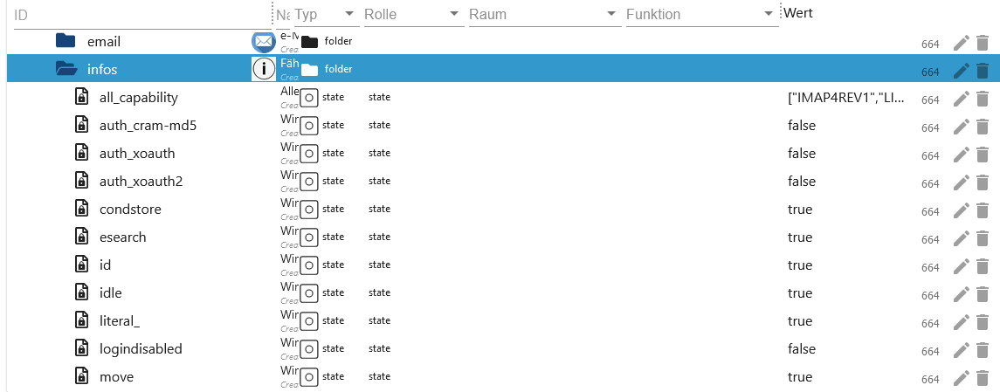

# IoBroker.imap
```:warning:
 ⚠ Dieser Adapter kann mit dem Blockly (Eigene Abfrage) das System sehr schnell zum Absturz bringen.
 ⚠ Daher bitte diese Beschreibung aufmerksam durchlesen.
```

[回到自述文件](/README.md)

＃ 概括
- [实例设置](#instance-settings)
    - [设置选项卡 IMAP](#instance-configuration-tab-imap-create)
    - [设置选项卡符号](#instance-configuration-tab-symbols-create)
    - [设置选项卡邮件解析器](#instance-configuration-tab-mailparser-options-create)
- [数据点](#数据点)
    - [数据点 imap.0](#数据点-imap0)
    - [数据点 imap.0.用户名](#datapoints-imap0用户名)
    - [数据点 imap.0.username.email.emails_xx](#datapoints-imap0usernameemailemail_xx)
    - [数据点 imap.0.username.infos](#datapoints-imap0usernameinfos)
    - [数据点 imap.0.username.remote](#datapoints-imap0usernameremote)
    - [数据点 imap.0.username.remote.copy](#datapoints-imap0usernameremotecopy)
    - [数据点 imap.0.username.remote.flag](#datapoints-imap0usernameremoteflag)
    - [数据点 imap.0.username.remote.html](#datapoints-imap0usernameremotehtml)
    - [数据点 imap.0.username.remote.move](#datapoints-imap0usernameremotemove)
- [Blocklys](#blocklys)
    - [更改 Blockly 实例设置](#blockly-imap-query-with-instance-settings)
    - [创建您自己的查询](#blockly-imap-query-change)
    - [使用实例设置查询](#blockly-imap-own-query)
    - [设置标志](设置-#blockly-imap-flags)
- [数组 JSON](#array-json)
    - [imap.0.xxx.email.email_xx.attach_json](#array-json-imap0xxxemail_xxattach_json)
    - [imap.0.xxx.json](#array-json-imap0xxxjson)
    - [imap.0.xxx.last_activity_json](#json-imap0xxxlast_activity_json)
    - [imap.0.xxx.quality](#json-imap0xxxquality)
    - [imap.0.xxx.status](#json-imap0xxxstatus)
    - [imap.0.online_history](#array-json-imap0online_history)
- [Javascript 和 Blocklys 示例](/docs/de/EXAMPLE.md)

# 实例设置
### 创建实例配置TAB IMAP
[概括](#zusammenfassung)

```:warning:
 ⚠ Die Instanz muss aktiviert sein!!!!
```

- `Active`：激活 IMAP 连接
- `主机`：例如例如 imap.gmail.com
- `收件箱`：标准收件箱 - 要监视的收件箱 - 可能的选择请参阅 imap.0.xxx.remote.change_folder
- `端口`：默认993
- `用户名`：用户名 - 实例必须激活！！！
- `密码`：密码 - 实例必须激活！！！ - [gmail 登录](https://support.google.com/mail/answer/185833?hl=de) - [outlook 2 步身份验证](https://mcuiobroker.gitbook.io/jarvis-infos/ Tips /general/microsoft-windows/双因素身份验证）

    

- `max.`：最大系统数据点 email_01...email_02... (1-99)
- `最大。 HTML`：HTML 格式的电子邮件的最大数量。必须大于最大数据点 (1-99)
- `TLS`：使用 TLS 连接 - 默认为 true
- `flags`：IMAP 查询的标志。可能的标志：

```
ALL - alle – Alle Nachrichten.
ANSWERED - geantwortet – Nachrichten mit gesetzter Beantwortet-Flagge.
DELETED - gelöscht – Nachrichten mit gesetzter Gelöscht-Flagge.
DRAFT - Entwurf – Nachrichten mit gesetzter Entwurfsflagge.
FLAGGED - gekennzeichnet – Nachrichten mit gesetzter Flagge.
NEW - neu – Nachrichten, bei denen das Flag „Zuletzt verwendet“ gesetzt ist, aber nicht das Flag „Gesehen“.
SEEN - gesehen – Nachrichten, bei denen das Flag „Gesehen“ gesetzt ist.
RECENT - jüngste – Nachrichten, bei denen das Flag „Zuletzt verwendet“ gesetzt ist.
OLD - alt – Nachrichten, für die das Flag „Zuletzt verwendet“ nicht gesetzt ist. Dies entspricht funktional !RECENT (im Gegensatz zu „!NEW“).
UNANSWERED - unbeantwortet – Nachrichten, bei denen das Flag „Beantwortet“ nicht gesetzt ist.
UNDELETED - ungelöscht – Nachrichten, für die das Flag „Gelöscht“ nicht gesetzt ist.
UNDRAFT - kein Entwurf – Nachrichten, bei denen das Draft-Flag nicht gesetzt ist.
UNFLAGGED - ungekennzeichnet – Nachrichten, für die das Flag „Markiert“ nicht gesetzt ist.
UNSEEN - ungesehen – Nachrichten, bei denen das Flag „Gesehen“ nicht gesetzt ist.
```

- `选择图标`：文件夹的图标（在选项卡`创建图标`下上传）


- `tls option`：默认为 {"rejectUnauthorized": false}
- “自动 TLS”：可能的选择是“始终”、“必需”和“从不”。默认是从不

    **请阅读[这里](https://www.npmjs.com/package/node-imap)了解更多信息。**


- `Att.`：为了填写 HTML 字段，还必须加载附件。这会占用大量内存！因此默认为“false”
- `Mailparser option`：Mailparser选项（仅在选项卡`MAILPARSER OPTIONS`下创建）


- `最大。 MEMRSS 限制：“从美国成立之日起”动作被触发。
- `重新启动：` 如果达到 MEMRSS 限制，适配器将重新启动。但是，仅每 24 小时检查一次。


- `数据点：` 如果达到 MEMRSS 限制，则所选数据点将设置为 `true`。这必须手动重置。但是，仅每 24 小时检查一次。


- `发送：` 如果达到 MEMRSS 限制，则会发送一条消息。每当“MEMRSS”更新时都会发送一条消息。
    - `实例：` 示例：telegram.0,telegram.1,pushover.0
    - `实例用户：` 示例：Peter、Olaf、Thomas


### 创建实例配置TAB符号
[概括](#zusammenfassung)

- `图标名称：` 图标的名称。请不要使用重复的名称。当适配器启动时，日志条目中会生成错误。
- `上传：` 上传图标。


### 创建实例配置选项卡 Mailparser 选项
[概括](#zusammenfassung)

- `名称：` 邮件解析器的名称。请不要使用重复的名称。当适配器启动时，日志条目中会生成错误。确切的描述可以阅读[此处](https://nodemailer.com/extras/mailparser/)。
- `Skip HTML to text:` 不要从 HTML 生成纯文本
- `要解析的最大 HTML 长度：` 要解析的 HTML 的最大数量（以字节为单位）。如果超过此值，则仅生成标头数据。
- `跳过图像链接：` 跳过 CID 附件到数据 URL 图像的转换。图像不会转换为 base64，这会节省“巨大的 RAM 使用量”。
- `跳过 HTML 中的文本：` 不要从纯文本消息生成 HTML
- `跳过文本链接：` 不要链接纯文本内容中的链接


＃ 数据点
### 数据点`imap.0`
[概括](#zusammenfassung)

|对象|描述 |
| --------------------- | ----------------------------------------------------------------------------------------------- |
| imap.0.json_imap | imap.0.json_imap |与上次活动的 IMAP 连接的名称。触发传入电子邮件或更新。 |
| imap.0.json_table | imap.0.json_table |最后将 IMAP 连接更新为 VIS 的 JSON 表。 |
| imap.0.online_counter | imap.0.online_counter |活动 IMAP 连接数。 |
| imap.0.online_history | imap.0.online_history | JSON 格式的连接活动历史记录 - [例子](#array-json-imap0online_history)。 |


### 数据点`imap.0.benutzername`
[概括](#zusammenfassung)

|对象|描述 |
| ---------------------------------- | --------------------------------------------------------------------------------------------------- |
| imap.0.xxx.active_inbox | imap.0.xxx.active_inbox |活跃收件箱 |
| imap.0.xxx.host |主机名 |
| imap.0.xxx.html | VIS 的 HTML 代码 |
| imap.0.xxx.json | VIS 的 JSON 表 - [例子](#array-json) |
| imap.0.xxx.last_activity_json | imap.0.xxx.last_activity_json |哪个活动作为数组 JSON - [例子](#json-imap0xxxlast_activity_json) |
| imap.0.xxx.last_activity_json | imap.0.xxx.last_activity_json |哪个活动作为数组 JSON - [示例](#json-imap0xxxlast_activity_json) |
| imap.0.xxx.last_activity_timestamp | imap.0.xxx.last_activity_timestamp |上次活动时间戳 |
| imap.0.xxx.quality |所有数据点的质量（JSON 格式）。每 24 小时更新一次 - [例子](#json-imap0xxxquality) |
| imap.0.xxx.status | imap.0.xxx.status | imap.0.xxx.status有关 JSON 格式的 IMAP 连接的信息 - [例子](#json-imap0xxxstatus) |
| imap.0.xxx.status |有关 JSON 格式的 IMAP 连接的信息 - [示例](#json-imap0xxxstatus) |
| imap.0.xxx.总计 |活动收件箱中的邮件数量 |
| imap.0.xxx.total_unread | imap.0.xxx.total_unread |活动收件箱中未读邮件的数量 |


### 数据点`imap.0.benutzername.email.email_xx`
[概括](#zusammenfassung)

|对象|描述 |
| ------------------------------------- | ------------------------------------------------------------------------------------- |
| imap.0.xxx.email.email_01.attach | imap.0.xxx.email.email_01.attach |正文中的附件和图像数量 |
| imap.0.xxx.email.email_01.attach_json | imap.0.xxx.email.email_01.attach_json | JSON 格式的附件信息 - [例子](#array-json-imap0xxxemailemail_xxattach_json) |
| imap.0.xxx.email_01.content |电子邮件内容 |
| imap.0.xxx.email.email_01.flag |电子邮件标志 |
| imap.0.xxx.email.email_01.from | imap.0.xxx.email.email_01.from发货人数组 |
| imap.0.xxx.email.email_01.receive | imap.0.xxx.email.email_01.receive |收到日期 |
| imap.0.xxx.email.email_01.seq |序列号|
| imap.0.xxx.email.email_01.size | imap.0.xxx.email.email_01.size电子邮件的大小（以字节为单位）|
| imap.0.xxx.email.email_01.subject | imap.0.xxx.email.email_01.subject | imap.0.xxx.email.email_01.subject电子邮件主题 |
| imap.0.xxx.email.email_01.texthtml |内容为 HTML |
| imap.0.xxx.email.email_01.to | imap.0.xxx.email.email_01.to |收件人数组 |
| imap.0.xxx.email.email_01.uid |唯一的UID |


### 数据点`imap.0.benutzername.infos`
[概括](#zusammenfassung)

|对象|描述 |
| -------------------------------------- | --------------------------------------------------------------------------------------------------------------------------------------------------------------------- |
| imap.0.xxx.infos.all_capability | imap.0.xxx.infos.all_capability | imap.0.xxx.infos.all_capability IMAP 连接的所有功能 |
| imap.0.xxx.infos.auth_cram-md5 | imap.0.xxx.infos.auth_cram-md5 | imap.0.xxx.infos.auth_cram-md5认证方式 auth_cram-md5 |
| imap.0.xxx.infos.auth_xoauth | imap.0.xxx.infos.auth_xoauth |身份验证方法 xoauth |
| imap.0.xxx.infos.auth_xoauth2 |身份验证方法 xoauth2 |
| imap.0.xxx.infos.condstore | imap.0.xxx.infos.condstore | MODSEQ 请求可能[请参考](https://datatracker.ietf.org/doc/html/rfc4551#page-18) |
| imap.0.xxx.infos.id | [请参考](https://www.iana.org/assignments/imap-capabilities/imap-capabilities.xhtml) |
| imap.0.xxx.infos.idle | imap.0.xxx.infos.idle | [请参考](https://www.iana.org/assignments/imap-capabilities/imap-capabilities.xhtml) |
| imap.0.xxx.infos.literal\* | imap.0.xxx.infos.literal\* | [请参考](https://www.iana.org/assignments/imap-capabilities/imap-capabilities.xhtml) |
| imap.0.xxx.infos.logindisabled | imap.0.xxx.infos.logindisabled | imap.0.xxx.infos.logindisabled [请参考](https://www.iana.org/assignments/imap-capabilities/imap-capabilities.xhtml) |
| imap.0.xxx.infos.move | imap.0.xxx.infos.move |电子邮件可以移动。 [请参考](https://www.iana.org/assignments/imap-capabilities/imap-capabilities.xhtml) |
| imap.0.xxx.infos.命名空间 | [请参考](https://www.iana.org/assignments/imap-capabilities/imap-capabilities.xhtml) |
| imap.0.xxx.infos.quota | [请参考](https://www.iana.org/assignments/imap-capabilities/imap-capabilities.xhtml) |
| imap.0.xxx.infos.sasl-ir | imap.0.xxx.infos.sasl-ir | [请参考](https://www.iana.org/assignments/imap-capabilities/imap-capabilities.xhtml) |
| imap.0.xxx.infos.sort | imap.0.xxx.infos.sort |电子邮件将以排序方式检索 [请参考](https://www.iana.org/assignments/imap-capabilities/imap-capabilities.xhtml) |
| imap.0.xxx.infos.sort_display | imap.0.xxx.infos.sort_display | imap.0.xxx.infos.sort_display标头信息已排序。[请参考](https://www.iana.org/assignments/imap-capabilities/imap-capabilities.xhtml) |
| imap.0.xxx.infos.starttls | imap.0.xxx.infos.starttls | imap.0.xxx.infos.starttls支持 Starttls。然后可以在实例配置中设置。 [请参考](https://www.iana.org/assignments/imap-capabilities/imap-capabilities.xhtml) |
| imap.0.xxx.infos.thread_orderedsubject | imap.0.xxx.infos.thread_orderedsubject | imap.0.xxx.infos.thread_orderedsubject [请参考](https://www.iana.org/assignments/imap-capabilities/imap-capabilities.xhtml) |
| imap.0.xxx.infos.thread_references | imap.0.xxx.infos.thread_references [请参考](https://www.iana.org/assignments/imap-capabilities/imap-capabilities.xhtml) |
| imap.0.xxx.infos.unselect | imap.0.xxx.infos.unselect | [请参考](https://www.iana.org/assignments/imap-capabilities/imap-capabilities.xhtml) |
| imap.0.xxx.infos.x-gm-ext-1 | imap.0.xxx.infos.x-gm-ext-1 | [请参考](https://www.iana.org/assignments/imap-capabilities/imap-capabilities.xhtml) |
| imap.0.xxx.infos.x-gm-ext-1 | imap.0.xxx.infos.x-gm-ext-1 | [参见](https://www.iana.org/assignments/imap-capability/imap-capability.xhtml) |



### 数据点`imap.0.benutzername.remote`
[概括](#zusammenfassung)

|对象|描述 |
| ------------------------------- | -------------------------------------------------------------------------------------------------------------------------------------------------------------------- |
| imap.0.xxx.remote.apply_html | imap.0.xxx.remote.apply_html |应用 imap.0.xxx.remote.html 的更改。 |
| imap.0.xxx.remote.change_folder | imap.0.xxx.remote.change_folder | imap.0.xxx.remote.change_folder |实例配置：更改要监视和显示的帖子文件夹。仅在重新启动后才会重置。 |
| imap.0.xxx.remote.criteria | imap.0.xxx.remote.criteria |实例配置：更改搜索。仅在重新启动后才会重置。 |
| imap.0.xxx.remote.reload_emails | imap.0.xxx.remote.reload_emails | imap.0.xxx.remote.reload_emails重新加载电子邮件。 |
| imap.0.xxx.remote.search_start | imap.0.xxx.remote.search_start | imap.0.xxx.remote.search_start | imap.0.xxx.remote.search_start应用来自change_folder、标准和show_mails 的更改 |
| imap.0.xxx.remote.show_mails | imap.0.xxx.remote.show_mails实例配置：要加载的电子邮件数量（最大 HTML）。仅在重新启动后才会重置。当然应该大于最大值。 |
| imap.0.xxx.remote.vis_command | imap.0.xxx.remote.vis_command | imap.0.xxx.remote.vis_command来自 VIS 的命令从选择框中移动邮件。仅由 VIS 使用。 |


### 数据点`imap.0.benutzername.remote.copy`
[概括](#zusammenfassung)

|对象|描述 |
| --------------------------------- | ------------------------------------------------------------------------------------------------------------------------- |
| imap.0.xxx.remote.copy.apply_copy | imap.0.xxx.remote.copy.apply_copy |应用文件夹和 uid 的更改。 |
| imap.0.xxx.remote.copy.folder | imap.0.xxx.remote.copy.folder | imap.0.xxx.remote.copy.folder |选择应在其中复制所选邮件的文件夹。 |
| imap.0.xxx.remote.copy.uid | imap.0.xxx.remote.copy.uid |在此处输入要复制的电子邮件的 UID。 UID 可以在 imap.0.xxx.json 或电子邮件文件夹中找到 |


### 数据点`imap.0.benutzername.remote.flag`
[概括](#zusammenfassung)

|对象|描述 |
| --------------------------------- | ------------------------------------------------------------------------------------------------------------------------- |
| imap.0.xxx.remote.flag.apply_flag | imap.0.xxx.remote.flag.apply_flag |应用设置、类型和 uid 的更改。 |
| imap.0.xxx.remote.flag.set | imap.0.xxx.remote.flag.set选择flag为setFlag，为flag添加addFlag，为flag删除delFlag |
| imap.0.xxx.remote.flag.type | imap.0.xxx.remote.flag.type |选择要添加、设置或删除的标志 |
| imap.0.xxx.remote.flag.uid | imap.0.xxx.remote.flag.uid |应对其进行标志更改的 UID。 UID 可以在 imap.0.xxx.json 或电子邮件文件夹中找到 |


### 数据点`imap.0.benutzername.remote.html`
[概括](#zusammenfassung)

|对象|描述 |
| ---------------------------------------------- | ----------------------------------------------------------------------------------------------- |
| imap.0.xxx.remote.html.body_background | imap.0.xxx.remote.html.body_background |表格背景颜色 - 默认#000000 |
| imap.0.xxx.remote.html.choose_content | imap.0.xxx.remote.html.choose_content |显示电子邮件中的字段。 </br>可能的字段有 html、text、textAsHtml 和 html Convert。 |
| imap.0.xxx.remote.html.header_border | imap.0.xxx.remote.html.header_border | imap.0.xxx.remote.html.header_border标题边框宽度 - 默认 2 px |
| imap.0.xxx.remote.html.header_font | imap.0.xxx.remote.html.header_font | imap.0.xxx.remote.html.header_font字体标题 - 标准 Helvetica |
| imap.0.xxx.remote.html.header_font_size | imap.0.xxx.remote.html.header_font_size | imap.0.xxx.remote.html.header_font_size标题字体大小 - 默认 15 px |
| imap.0.xxx.remote.html.header_线性_颜色_1 |渐变背景标题值 1 - 默认 #424242 |
| imap.0.xxx.remote.html.header_线性_颜色_2 |渐变背景标题值 2 - 默认 #424242 |
| imap.0.xxx.remote.html.header_tag_border_color | imap.0.xxx.remote.html.header_tag_border_color |边框颜色标题 - 默认 #424242 - 任何东西 |
| imap.0.xxx.remote.html.header_text_color | imap.0.xxx.remote.html.header_text_color |标题文本颜色 - 默认 #BDBDBD |
| imap.0.xxx.remote.html.header_width | imap.0.xxx.remote.html.header_width | imap.0.xxx.remote.html.header_width标题宽度 - 默认自动 - 可能是 px 或 % |
| imap.0.xxx.remote.html.headline_align_column_1 | imap.0.xxx.remote.html.headline_align_column_1 |文本对齐方式 标题栏 1 - 默认居中 </br> 可能居中、左对齐、右对齐和自动 |


|对象|描述 |
| ----------------------------------------------- | --------------------------------------------------------------------------------------------- |
| imap.0.xxx.remote.html.headline_align_column_2 |文本对齐标题列 2 - 默认居中 </br> 可能居中、左对齐、右对齐和自动 |
| imap.0.xxx.remote.html.headline_align_column_3 | imap.0.xxx.remote.html.headline_align_column_3文本对齐标题列 3 - 默认居中 </br> 可能居中、左对齐、右对齐和自动 |
| imap.0.xxx.remote.html.headline_align_column_4 |文本对齐标题列 4 - 默认居中 </br> 可能居中、左对齐、右对齐和自动 |
| imap.0.xxx.remote.html.headline_align_column_5 | imap.0.xxx.remote.html.headline_align_column_5文本对齐标题列 5 - 默认居中 </br> 可能居中、左对齐、右对齐和自动 |
| imap.0.xxx.remote.html.headline_align_column_6 |文本对齐标题列 6 - 默认居中 </br> 可能居中、左对齐、右对齐和自动 |
| imap.0.xxx.remote.html.headline_align_column_7 | imap.0.xxx.remote.html.headline_align_column_7 |文本对齐标题列 7 - 默认居中 </br> 可能居中、左对齐、右对齐和自动 |
| imap.0.xxx.remote.html.headline_align_column_8 |文本对齐标题列 8 - 默认居中 </br> 可能居中、左对齐、右对齐和自动 |
| imap.0.xxx.remote.html.headline_align_column_9 | imap.0.xxx.remote.html.headline_align_column_9文本对齐标题列 9 - 默认居中 </br> 可能居中、左对齐、右对齐和自动 |
| imap.0.xxx.remote.html.headline_align_column_10 | imap.0.xxx.remote.html.headline_align_column_10文本对齐标题列 10 - 默认居中 </br> 可能居中、左对齐、右对齐和自动 |
| imap.0.xxx.remote.html.headline_color | imap.0.xxx.remote.html.headline_color |轮辋颜色主体 - 默认 #BD5A3C |
| imap.0.xxx.remote.html.headline_column_width_1 | imap.0.xxx.remote.html.headline_column_width_1 |列宽 第 1 列 - 默认自动 - 可能为 px 或 % |
| imap.0.xxx.remote.html.headline_column_width_10 | imap.0.xxx.remote.html.headline_column_width_10列宽 第 10 列 - 默认自动 - 可能为 px 或 % |


|对象|描述 |
| ---------------------------------------------- | ------------------------------------------------------------- |
| imap.0.xxx.remote.html.headline_column_width_2 | imap.0.xxx.remote.html.headline_column_width_2 |列宽 第 2 列 - 默认自动 - 可能为 px 或 % |
| imap.0.xxx.remote.html.headline_column_width_3 | imap.0.xxx.remote.html.headline_column_width_3 |列宽 第 3 列 - 默认自动 - 可能为 px 或 % |
| imap.0.xxx.remote.html.headline_column_width_4 |列宽 第 4 列 - 默认自动 - 可能为 px 或 % |
| imap.0.xxx.remote.html.headline_column_width_5 | imap.0.xxx.remote.html.headline_column_width_5 |列宽第 5 列 - 默认自动 - 可能为 px 或 % |
| imap.0.xxx.remote.html.headline_column_width_6 |列宽 第 6 列 - 默认自动 - 可能为 px 或 % |
| imap.0.xxx.remote.html.headline_column_width_7 | imap.0.xxx.remote.html.headline_column_width_7 |列宽 第 7 列 - 默认自动 - 可能为 px 或 % |
| imap.0.xxx.remote.html.headline_column_width_8 | imap.0.xxx.remote.html.headline_column_width_8 |列宽 第 8 列 - 默认自动 - 可能为 px 或 % |
| imap.0.xxx.remote.html.headline_column_width_9 | imap.0.xxx.remote.html.headline_column_width_9 | imap.0.xxx.remote.html.headline_column_width_9列宽 第 9 列 - 默认自动 - 可能为 px 或 % |
| imap.0.xxx.remote.html.headline_font_size | imap.0.xxx.remote.html.headline_font_size | imap.0.xxx.remote.html.headline_font_size文本大小（以行为单位）- 默认 16 px |
| imap.0.xxx.remote.html.headline_height | imap.0.xxx.remote.html.headline_height | imap.0.xxx.remote.html.headline_height单元格高度 - 默认 35 px |
| imap.0.xxx.remote.html.headline_style | imap.0.xxx.remote.html.headline_style |单元格样式 - 默认正常 - 可能正常或粗体 |


|对象|描述 |
| ------------------------------------------------ | ---------------------------------------------------------------------------------------------- |
| imap.0.xxx.remote.html.headline_underlined | imap.0.xxx.remote.html.headline_underlined |单元格边框 - 默认 3 px |
| imap.0.xxx.remote.html.headline_underlined_color | imap.0.xxx.remote.html.headline_underlined_color |单元格边框颜色 - 默认 #ffffff |
| imap.0.xxx.remote.html.jarvis | imap.0.xxx.remote.html.jarvis | Jarvis 中 View 的代码定制 |
| imap.0.xxx.remote.html.mails_even_color | imap.0.xxx.remote.html.mails_even_color |直线 ID 的线条背景颜色 - 标准 #333333 |
| imap.0.xxx.remote.html.mails_nextday_color_even | imap.0.xxx.remote.html.mails_nextday_color_even |昨天直 ID 的线条背景颜色 - 标准 #F7FFE0 |
| imap.0.xxx.remote.html.mails_nextday_color_odd | imap.0.xxx.remote.html.mails_nextday_color_odd |昨天奇数 ID 的线条背景颜色 - 标准 #F7FFE0 |
| imap.0.xxx.remote.html.mails_odd_color | imap.0.xxx.remote.html.mails_odd_color |奇数 ID 的线条背景颜色 - 标准 #FFE32E |
| imap.0.xxx.remote.html.mails_today_color | imap.0.xxx.remote.html.mails_today_color |直线 ID 当前日期的线条背景颜色 - 标准 #ffffff |
| imap.0.xxx.remote.html.mails_today_color_odd | imap.0.xxx.remote.html.mails_today_color_odd |奇数 ID 当前日期的线条背景颜色 - 默认 #ffffff |
| imap.0.xxx.remote.html.p_tag_text_align | imap.0.xxx.remote.html.p_tag_text_align |文本对齐页眉和页脚 - 标准居中 </br> 可能居中、左对齐、右对齐和自动 |
| imap.0.xxx.remote.html.short_content | imap.0.xxx.remote.html.short_content |内容字符数限制 - 默认 35 |
| imap.0.xxx.remote.html.short_subject | imap.0.xxx.remote.html.short_subject |主题中的字符限制 - 默认 35 |
| imap.0.xxx.remote.html.table_tag_border_color | imap.0.xxx.remote.html.table_tag_border_color |表格边框颜色 - 默认#424242 |


|对象|描述 |
| ------------------------------------------- | --------------------------------------------------------------------- |
| imap.0.xxx.remote.html.table_tag_cell | imap.0.xxx.remote.html.table_tag_cell |单元格之间的间距 - 默认 6 px |
| imap.0.xxx.remote.html.table_tag_text_align | imap.0.xxx.remote.html.table_tag_text_align |表格文本对齐方式 - 默认自动 - 可能是 px 或 % |
| imap.0.xxx.remote.html.table_tag_width | imap.0.xxx.remote.html.table_tag_width | imap.0.xxx.remote.html.table_tag_width表大小 - 默认自动 - 可能是 px 或 % |
| imap.0.xxx.remote.html.td_tag_2_colums | imap.0.xxx.remote.html.td_tag_2_colums第 1 行和第 2 行的线边框 - 默认自动 - 可能为 px 或 % |
| imap.0.xxx.remote.html.td_tag_border_bottom | imap.0.xxx.remote.html.td_tag_border_bottom |下面的行边距 - 默认 1 px |
| imap.0.xxx.remote.html.td_tag_border_color | imap.0.xxx.remote.html.td_tag_border_color |线条边框颜色底部 - 默认#424242 |
| imap.0.xxx.remote.html.td_tag_border_right | imap.0.xxx.remote.html.td_tag_border_right右行边距 - 默认 1 px |
| imap.0.xxx.remote.html.td_tag_cell | imap.0.xxx.remote.html.td_tag_cell |行中的单元格间距 - 默认 6 px |
| imap.0.xxx.remote.html.text_content | imap.0.xxx.remote.html.text_content |标题文本第 5 列 - 默认内容 |
| imap.0.xxx.remote.html.text_date | imap.0.xxx.remote.html.text_date |标题文本第 4 列 - 默认日期 |
| imap.0.xxx.remote.html.text_flag | imap.0.xxx.remote.html.text_flag | imap.0.xxx.remote.html.text_flag标题文本列 7 - 标准标志 |
| imap.0.xxx.remote.html.text_from | imap.0.xxx.remote.html.text_from标题文本列 2 - 默认来自 |


|对象|描述 |
| ------------------------------------------ | --------------------------------------------------- |
| imap.0.xxx.remote.html.text_id | imap.0.xxx.remote.html.text_id |标题文本列 1 - 默认 ID |
| imap.0.xxx.remote.html.text_move_or_copy | imap.0.xxx.remote.html.text_move_or_copy |标题文本第 9 列 - 默认复制/粘贴 |
| imap.0.xxx.remote.html.text_select_addflag | imap.0.xxx.remote.html.text_select_addflag在标志选择框中开始文本 - 标准 addFlags - |
| imap.0.xxx.remote.html.text_select_copy | imap.0.xxx.remote.html.text_select_copy |在副本选择框中开始文本 - 标准副本|
| imap.0.xxx.remote.html.text_select_delflag | imap.0.xxx.remote.html.text_select_delflag在标志选择框中开始文本 - 默认 delFlags - |
| imap.0.xxx.remote.html.text_select_move | imap.0.xxx.remote.html.text_select_move |在复制选择框中开始文本 - 标准移动 |
| imap.0.xxx.remote.html.text_select_setflag | imap.0.xxx.remote.html.text_select_setflag |在标志选择框中开始文本 - 默认 setFlags - |
| imap.0.xxx.remote.html.text_seq | imap.0.xxx.remote.html.text_seq |标题文本第 6 列 - 标准 SEQ |
| imap.0.xxx.remote.html.text_setflag | imap.0.xxx.remote.html.text_setflag |标题文本第 10 列 - 默认标志操作 |
| imap.0.xxx.remote.html.text_subject | imap.0.xxx.remote.html.text_subject |标题文本列 3 - 默认主题 |
| imap.0.xxx.remote.html.text_uid | imap.0.xxx.remote.html.text_uid |标题文本列 8 - 默认 UID |
| imap.0.xxx.remote.html.top_font | imap.0.xxx.remote.html.top_font页眉和页脚字体 - 标准 Helvetica |


|对象|描述 |
| -------------------------------------- | ---------------------------------------------------------------------------- |
| imap.0.xxx.remote.html.top_font_size | imap.0.xxx.remote.html.top_font_size页眉和页脚字体大小 - 标准 20 px |
| imap.0.xxx.remote.html.top_font_weight | imap.0.xxx.remote.html.top_font_weight |页眉和页脚字体粗细 - 标准正常 - 可能正常或粗体 |
| imap.0.xxx.remote.html.top_text | imap.0.xxx.remote.html.top_text |用户名的标题文本默认 |
| imap.0.xxx.remote.html.top_text_color | imap.0.xxx.remote.html.top_text_color |颜色标题文本 - 默认 #ffffff |


### 数据点`imap.0.benutzername.remote.move`
[概括](#zusammenfassung)

|对象|描述 |
| --------------------------------- | ---------------------------------------------------------------------------------------------------------------------------- |
| imap.0.xxx.remote.move.apply_move | imap.0.xxx.remote.move.apply_move |应用文件夹和 uid 的更改。 |
| imap.0.xxx.remote.move.folder | imap.0.xxx.remote.move.folder | imap.0.xxx.remote.move.folder选择应将所选邮件移动到的文件夹。 |
| imap.0.xxx.remote.move.uid | imap.0.xxx.remote.move.uid |在此处输入要移动的电子邮件的 UID。您可以在 imap.0.xxx.json 或电子邮件文件夹中找到 UID |


# 块状
### 更改 Blockly IMAP 查询
[概括](#zusammenfassung)

- 有了这个，您可以设置这些[数据点](#数据点-imap0usernameremote)。
- 可以在[实例配置](#instance-configuration-tab-imap-create)中找到可能的标志。
- 可以选择 IMAP 连接或适用于所有连接。


### Blockly IMAP 自己的查询
[概括](#zusammenfassung)

-   危险！所有数据都这样。例如附件。此查询可能会将 RAM 或 CPU 推至极限。如果创建了不正确的标准，这可能会导致 iobroker 崩溃！
- 然后数据以 JSON 形式传送。
- 使用日志输出时，日志文件会变得非常大。因此稍后再次删除日志输出。
- 必须创建一个名为“result”的变量。
- [示例](/docs/en/EXAMPLE.md)


### 带有实例设置的块式 IMAP 查询
[概括](#zusammenfassung)

- 从 IMAP 连接加载所有数据并自行处理。实例设置用作搜索条件。
-   危险！ RAM消耗高
- 然后数据以 JSON 形式传送。
- 使用日志输出时，日志文件会变得非常大。因此稍后再次删除日志输出。
- 必须创建一个名为“result”的变量。
- [示例](/docs/en/EXAMPLE.md)


### 设置 Blockly IMAP 标志
[概括](#zusammenfassung)

- 为电子邮件设置标志 setFlag=set、addFlag=add 或 delFlag=delete。
- 选择邮箱。
- 选择setFlag=设置、addFlag=添加或delFlag=删除。
- 选择标志。
- [可能的标志请参阅 imap.0.xxx.status](#json-imap0xxxstatus)


# ArrayJSON
### 数组 JSON imap.0.xxx.email.email_xx.attach_json
[概括](#zusammenfassung)

```json
[
    {
        "partID": "2",
        "id": "<image001.png@01D9C718.240FAD50>",
        "uid": 86,
        "size": "159762",
        "filename": "image001.png",
        "type": "inline",
        "encoding": "base64"
    },
    {
        "partID": "3",
        "id": "<image002.png@01D9C718.36F8AE30>",
        "uid": 86,
        "size": "1296247",
        "filename": "image002.png",
        "type": "inline",
        "encoding": "base64"
    }
]
```

### 数组 JSON imap.0.xxx.json
[概括](#zusammenfassung)

```json
[
    {
        "id": 1,
        "date": "15.08.2023 15:39:17",
        "from": ["test@luckyskills.de"],
        "from_name": ["Tester"],
        "attach": 0,
        "attach_info": [],
        "to": ["github@luckyskills.de"],
        "to_name": ["Lucky-ESA"],
        "subject": "Test",
        "text": "Am 2023-08-10 12:17, schrieb test@luckyskills.de:\n>>> TEST\n",
        "html": false,
        "textAsHtml": "Am 2023-08-10 12:17, schrieb <a href=\"mailto:test@luckyskills.de\">test@luckyskills.de</a>:<br/>&gt;&gt;&gt; TEST</p>",
        "seqno": 74,
        "uid": 93,
        "size": 1077,
        "flag": "unseen"
    }
]
```

### JSON imap.0.xxx.last_activity_json
[概括](#zusammenfassung)

```json
{
    "modseq": "196",
    "flags": ["\\Seen"]
}
```

### JSON imap.0.xxx.quality
[概括](#zusammenfassung)

```json
{
    "message": "No Message"
}
```

### 可能性
```
0: "0x00 - good",
1: "0x01 - general problem",
2: "0x02 - no connection problem",
16: "0x10 - substitute value from controller",
17: "0x11 - general problem by instance",
18: "0x12 - instance not connected",
32: "0x20 - substitute initial value",
64: "0x40 - substitute value from device or instance",
65: "0x41 - general problem by device",
66: "0x42 - device not connected",
68: "0x44 - device reports error",
128: "0x80 - substitute value from sensor",
129: "0x81 - general problem by sensor",
130: "0x82 - sensor not connected",
132: "0x84 - sensor reports error",
```

### JSON imap.0.xxx.status
[概括](#zusammenfassung)

```json
{
    "name": "INBOX",
    "flags": ["\\Answered", "\\Flagged", "\\Deleted", "\\Seen", "\\Draft"],
    "readOnly": false,
    "uidvalidity": 1667682367,
    "uidnext": 94,
    "permFlags": ["\\Answered", "\\Flagged", "\\Deleted", "\\Seen", "\\Draft"],
    "keywords": [],
    "newKeywords": true,
    "persistentUIDs": true,
    "nomodseq": false,
    "seq": 0,
    "time": 0,
    "reason": "",
    "user": "github_luckyskills_de",
    "messages": {
        "total": 74,
        "new": 0
    },
    "highestmodseq": "200"
}
```

### 数组 JSON imap.0.online_history
[概括](#zusammenfassung)

```json
[
    {
        "client": "github_luckyskills_de",
        "time": 1692298599784,
        "status": "Online"
    },
    {
        "client": "github_luckyskills_de",
        "time": 1692298232899,
        "status": "Online"
    }
]
```

## Changelog

<!--
    Placeholder for the next version (at the beginning of the line):
    ### **WORK IN PROGRESS**
-->

### **WORK IN PROGRESS**

-   (Lucky-ESA) Added RAM consumption - Instance Settings
-   (Lucky-ESA) Added german documention
-   (Lucky-ESA) Added Mailparser options
-   (Lucky-ESA) Added counter history
-   (Lucky-ESA) Bug fixes

### 0.0.9 (2023-07-26)

-   (Lucky-ESA) Fixed RAM consumption of new emails
-   (Lucky-ESA) Added counter attachments in JSON

### 0.0.8 (2023-07-13)

-   (Lucky-ESA) Fix refresh crash
-   (Lucky-ESA) Added MB threshold

### 0.0.7 (2023-04-25)

-   (Lucky-ESA) Fix correct counter for seen and unseen
-   (Lucky-ESA) Added capabilities
-   (Lucky-ESA) Criteria change without restart
-   (Lucky-ESA) Added outlook.office365.com oauth2 login
-   (Lucky-ESA) Added Connection.js from Module to Adapter
-   (Lucky-ESA) Bug fixes

### 0.0.6 (2023-03-17)

-   (Lucky-ESA) Added trigger move or copy emails
-   (Lucky-ESA) Added JSON for multiple IMAP accounts
-   (Lucky-ESA) Bug fixes

### 0.0.5 (2023-03-15)

-   (Lucky-ESA) Added: Limited reconnected (5 max)
-   (Lucky-ESA) Added: into datapoints
-   (Lucky-ESA) Added: Password entry not possible without an active instance
-   (Lucky-ESA) Added: Added description to readme
-   (Lucky-ESA) Added: Added move or copy
-   (Lucky-ESA) Added: Set flag with datapoints
-   (Lucky-ESA) Fix: debug output without attachments
-   (Lucky-ESA) Fix: wrong json_table
-   (Lucky-ESA) Fix: value null
-   (Lucky-ESA) Change: Reconnected change info level to debug level
-   (Lucky-ESA) Change: correct dp roles
-   (Lucky-ESA) Change: delete attachments (too much RAM usage)

### 0.0.4 (2023-03-03)

-   (Lucky-ESA) Fix json_table

### 0.0.3 (2023-03-03)

-   (Lucky-ESA) Beta release

### 0.0.2 (2023-03-03)

-   (Lucky-ESA) initial release

## License

MIT License

Copyright (c) 2023 Lucky-ESA <github@luckyskills.de>

Permission is hereby granted, free of charge, to any person obtaining a copy
of this software and associated documentation files (the "Software"), to deal
in the Software without restriction, including without limitation the rights
to use, copy, modify, merge, publish, distribute, sublicense, and/or sell
copies of the Software, and to permit persons to whom the Software is
furnished to do so, subject to the following conditions:

The above copyright notice and this permission notice shall be included in all
copies or substantial portions of the Software.

THE SOFTWARE IS PROVIDED "AS IS", WITHOUT WARRANTY OF ANY KIND, EXPRESS OR
IMPLIED, INCLUDING BUT NOT LIMITED TO THE WARRANTIES OF MERCHANTABILITY,
FITNESS FOR A PARTICULAR PURPOSE AND NONINFRINGEMENT. IN NO EVENT SHALL THE
AUTHORS OR COPYRIGHT HOLDERS BE LIABLE FOR ANY CLAIM, DAMAGES OR OTHER
LIABILITY, WHETHER IN AN ACTION OF CONTRACT, TORT OR OTHERWISE, ARISING FROM,
OUT OF OR IN CONNECTION WITH THE SOFTWARE OR THE USE OR OTHER DEALINGS IN THE
SOFTWARE.