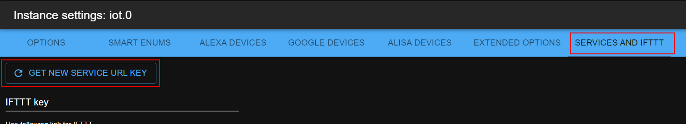

# IoBroker 物联网适配器
 [](https://weblate.iobroker.net/engage/adapters/?utm_source=widget)

此适配器仅用于与 Amazon Alexa、Google Home 和 Nightscout 通信。
它不用于远程访问您的 ioBroker 实例。请使用 ioBroker.cloud 适配器。

**此适配器使用 Sentry 库自动向开发人员报告异常和代码错误。** 有关更多详细信息以及如何禁用错误报告的信息，请参阅[Sentry-插件文档](https://github.com/ioBroker/plugin-sentry#plugin-sentry)！从 js-controller 3.0 开始使用 Sentry 报告。

＃＃ 设置
要使用物联网适配器，您应该首先在ioBroker云[https://iobroker.pro](https://iobroker.pro)上注册。

[参考google API类型设置](https://developers.google.com/actions/smarthome/guides/)


＃＃＃ 语言
如果选择“默认”语言，设备和枚举的智能名称将不会被翻译。如果指定了某种语言，所有已知名称都将翻译成这种语言。
这样做是为了在多种语言之间快速切换，以达到演示目的。

### 将函数放在名称的第一位
更改自生成名称中功能和角色的顺序：

- 如果为假：“房间功能”，例如“客厅调光器”
- 如果为真：“功能室”，例如“调光客厅”

### 连接单词
您可以定义放置在功能和房间之间的单词。例如，“in”和“客厅调光器”将是“客厅调光器”。

但不建议这样做，因为识别引擎必须多分析一个词，这会导致误解。

### 开关的 OFF 级别
一些组由混合设备组成：调光器和开关。允许使用“ON”和“OFF”命令以及百分比来控制它们。
如果命令为`Set to 30%`和`OFF level is 30%`，则开关将打开。通过命令“设置为 25%”，所有开关将关闭。

此外，如果命令为“OFF”，则当实际值大于或等于“30%”时，适配器将记住当前调光器级别。
稍后，当新的“ON”命令到来时，适配器将把调光器切换至内存中的级别，而不是 100%。

例子：

- 假设“OFF 水平”为 30%。
- 虚拟设备“灯”有两个物理设备：_开关_和_调光器_。
- 命令：“将灯光设置为 40%”。适配器将记住_调光器_的这个值，将其设置为“调光器”，然后打开_开关_。
- 命令：“关灯”。适配器会将调光器设置为 0%，并关闭开关。
- 命令：“打开灯”。_dimmer_ => 40%，_switch_ => ON。
- 命令：“将灯光设置为 20%”。_调光器_ => 20%，_开关_ => OFF。调光器的值不会被记住，因为它低于_OFF 级别_。
- 命令：“打开灯”。_dimmer_ => 40%，_switch_ => ON。

### 来自 ON
您可以选择 ON 命令将针对数字状态执行的行为。可以选择具体值，或者将使用最后一个非零值。

### 写回复至
对于每个命令，都会生成文本响应。您可以在此处定义对象 ID，此文本必须写入其中。例如 _sayit.0.tts.text_。

＃＃＃ 颜色
该渠道需要3-5个状态，具有以下角色：

- `level.color.saturation` - 检测通道所需，
- `level.color.hue`，
- `level.dimmer`，
- `switch` - 可选，
- `level.color.temperature`（可选）

```
Alexa, set the "device name" to "color"
Alexa, turn the light fuchsia
Alexa, set the bedroom light to red
Alexa, change the kitchen to the color chocolate
```

＃＃＃ 锁
为了能够锁定锁，状态必须具有角色`switch.lock`并具有`native.LOCK_VALUE`来确定锁定状态。
如果您需要单独的值来控制锁，则可以使用`native.CONTROL VALUE`。

```
Alexa, is "lock name" locked/unlocked
Alexa, lock the "lock name"
```

## 如何生成名称
适配器尝试生成用于智能家居控制的虚拟设备（例如，Amazon Alexa 或 Google Home）。

其中有两个重要的枚举：房间和功能。

房间如：客厅、浴室、卧室。
功能如：灯、窗帘、暖气。

要想获取自动生成的列表中的状态，必须满足以下条件：

— 状态必须处于某个“功能”枚举中。
- 如果状态没有直接包含在“功能”中，则必须具有角色（“状态”、“开关”或“级别。\*”，例如，level.dimmer）。

有可能频道处于“功能”中，但状态本身却不在。

- 状态必须是可写的：`common.write` = true
- 状态调光器必须将“common.type”设置为“number”
- 状态加热必须具有“common.unit”作为“°C”，“°F”或“°K”，并且“common.type”为“number”

如果该州仅存在于“功能”中而不存在于任何“房间”中，则将使用州的名称。

状态名称将根据功能和房间生成。例如，_客厅_中的所有_灯_都将收集在虚拟设备_客厅灯_中。
用户无法更改此名称，因为它是自动生成的。
但如果枚举名称发生变化，此名称也会更改。（例如，功能“灯”更改为“灯”，因此_客厅灯_将更改为_客厅灯_）

如果该州有 common.smartName，则所有规则都将被忽略。在这种情况下，只会使用智能名称。

如果`common.smartName` 是`false`，则该状态或枚举将不会包含在列表生成中。

配置对话框可让您轻松地删除和添加单个状态到虚拟组或作为单个设备。


如果组只有一个状态，则可以重命名，为此将使用状态的 smartName。
如果组有多个状态，则必须通过枚举的名称重命名该组。

为了创建自己的组，用户可以安装“场景”适配器或在 JavaScript 适配器中创建“脚本”。

### 替换
您可以指定可在设备名称中自动替换的字符串。例如，如果您将替换设置为：`.STATE,.LEVEL`，则所有`.STATE` 和`.LEVEL` 都将从名称中删除。请注意空格。
如果您设置`.STATE, .LEVEL`，则`.STATE` 和`.LEVEL` 将被替换，而不会替换`.LEVEL`。

## 辅助状态
- `smart.lastObjectID`：如果只有一个设备由家庭技能（alexa、google home）控制，则会设置此状态。
- `smart.lastFunction`：执行最后命令的函数名称（如果存在）。
- `smart.lastRoom`：执行最后命令的房间名称（如果存在）。
- `smart.lastCommand`：最后执行的命令。命令可以是：`true(ON)`、`false(OFF)`、`number(%)`、`-X(在 x 处减少)`、`+X(在 X 处增加)`
- `smart.lastResponse`：命令的文本响应。它可以发送到某些`text2speech`（`sayit`）引擎。

## 切换模式
Alexa v3 支持切换模式。
这意味着如果您说“Alexa，打开灯”，并且灯已经亮着，它将被关闭。

## IFTTT
[指示](doc/ifttt.md)

谷歌主页
如果您在日志中看到以下错误消息：`[GHOME] Invalid URL Pro key. Status auto-update is disabled you can set states but receive states only manually`。
那么您必须重新生成 URL-Key：



## 服务
有可能向云适配器发送消息。
如果您调用`[POST]https://service.iobroker.in/v1/iotService?service=custom_<NAME>&key=<XXX>&user=<USER_EMAIL>` und 值作为有效负载。

`curl --data "myString" https://service.iobroker.in/v1/iotService?service=custom_<NAME>&key=<XXX>&user=<USER_EMAIL>`

或者

`[GET]https://service.iobroker.in/v1/iotService?service=custom_<NAME>&key=<XXX>&user=<USER_EMAIL>&data=myString`

如果你在设置中将“服务白名单”字段设置为名称`custom_test`，并以“custom_test”作为服务名称进行调用，则状态**cloud.0.services.custom_test**将设置为_myString_。

您可以在白名单中写入“\*”，则所有服务都将被允许。

您可以在这里找到有关如何将其与[塔斯克](doc/tasker.md)一起使用的说明。

仅设置了 IFTTT 密钥才允许使用 IFTTT 服务。

保留名称为 `ifttt`、`text2command`、`simpleApi` 和 `swagger`。使用这些名称时必须不使用 `custom_` 前缀。

您也可以通过消息询问服务的有效网址：

```js
sendTo('iot.0', 'getServiceEndpoint', { serviceName: 'custom_myService' }, result =>
    console.log(JSON.stringify(result)),
);
// Output: {"result":
//  {"url": "https://service.iobroker.in/v1/iotService?key=xxx&user=uuu&service=custom_myService",
//   "stateID":"iot.0.services.myService",
//   "warning":"Service name is not in white list"
//  }}
```

###`text2command`
您可以在白名单中写入`text2command`，您可以向`https://service.iobroker.in/v1/iotService?service=text2command&key=<user-app-key>&user=<USER_EMAIL>`发送 POST 请求将数据写入 _text2command.X.text_ 变量。

您也可以使用 GET 方法`https://service.iobroker.in/v1/iotService?service=text2command&key=<user-app-key>&user=<USER_EMAIL>&data=<MY COMMAND>`

`X` 可以通过“使用 text2command 实例”选项在设置中定义。

## 自定义技能
自定义技能的答案可以通过两种方式处理：

-`text2command`
-`javascript`

###`text2command`
如果在配置对话框中定义了`text2command`实例，那么问题将被发送到该实例。

必须配置`text2command`，以便解析预期的短语并返回答案。

###`Javascript`
可以直接使用脚本处理问题。如果未选择`text2command`实例，则默认激活该脚本。

如果定义了`text2command`实例，那么该实例必须提供答案，并且来自_script_的答案将被忽略。

适配器将提供两种状态下不同细节级别的细节

- `smart.lastCommand` 包含收到的文本，包括有关查询类型（意图）的信息。示例：`askDevice Status Rasenmäher`
- `smart.lastCommandObj` 包含一个 JSON 字符串，可以解析为包含以下信息的对象
- `words` 包含数组中接收到的单词
- `intent` 包含查询的类型。目前可能的值有：
- v1 技能：`askDevice`、`controlDevice`、`actionStart`、`actionEnd`、`askWhen`、`askWhere`、`askWho`
- v2 技能：当捕获完整文本时使用 `queryIntent`，当仅捕获部分文本时使用 `controlDevice` 进行回退
- `deviceId` 包含一个设备 ID，用于标识发送请求的设备，由亚马逊提供，如果没有提供，则为空字符串
- `deviceRoom` 包含一个映射的房间标识符，您可以在 iot 管理 UI 中为收集的设备 ID 配置该标识符
- `sessionId` 包含技能会话的 sessionId，如果由 Amazon 发出多个命令，则应相同，如果未提供，则为空字符串
- `userId` 包含来自设备所有者（或者可能是稍后与技能交互的用户）的用户 ID，由亚马逊提供，如果没有提供，则为空字符串
- `userName` 包含一个映射的用户名，您可以在 iot 管理 UI 中为收集到的用户 ID 配置该用户名

有关如何检测单词以及 Alexa Custom Skill 区分哪些类型的查询的更多详细信息，请查看 https://forum.iobroker.net/viewtopic.php?f=37&t=17452 。

**通过smart.lastResponse状态返回结果**

响应需要在 `smart.lastResponse` 状态下 200ms 内发送，可以是简单的文本字符串或 JSON 对象。
如果是文本字符串，则此文本将作为响应发送给技能。
如果文本是 JSON 对象，则可以使用以下键：

- `responseText` 需要包含返回给亚马逊的文本
- `shouldEndSession` 是一个布尔值，控制会话在说出响应后是否关闭或保持打开以接受另一个语音输入。
- `sessionId` 需要包含响应所针对的 sessionId。理想情况下，提供它以允许并发会话。如果没有提供，则假定为第一个需要响应的会话。

**通过消息返回结果给物联网实例**

物联网实例还接受名为“alexaCustomResponse”的消息，其中包含键“response”，该对象可以包含键`responseText`和`shouldEndSession`和`sessionId`，如上所述。物联网实例不会对该消息做出任何响应！

**使用文本的脚本示例**

```js
// important, that ack=true
on({ id: 'iot.0.smart.lastCommand', ack: true, change: 'any' }, obj => {
    // you have 200ms to prepare the answer and to write it into iot.X.smart.lastResponse
    setState('iot.0.smart.lastResponse', 'Received phrase is: ' + obj.state.val); // important, that ack=false (default)
});
```

**使用 JSON 对象的脚本示例**

```js
// important, that ack=true
on({ id: 'iot.0.smart.lastCommandObj', ack: true, change: 'any' }, obj => {
    // you have 200ms to prepare the answer and to write it into iot.X.smart.lastResponse
    const request = JSON.parse(obj.state.val);
    const response = {
        responseText: 'Received phrase is: ' + request.words.join(' ') + '. Bye',
        shouldEndSession: true,
        sessionId: request.sessionId,
    };

    // Return response via state
    setState('iot.0.smart.lastResponse', JSON.stringify(response)); // important, that ack=false (default)

    // or alternatively return as message
    sendTo('iot.0', 'alexaCustomResponse', response);
});
```

### 私有云
如果您使用私人技能/动作/навык 与`Alexa/Google Home/Алиса` 进行通信，那么您可以使用 IoT 实例来处理来自它的请求。

例如对于`yandex alice`：

```js
const OBJECT_FROM_ALISA_SERVICE = {}; // object from alisa service or empty object
OBJECT_FROM_ALISA_SERVICE.alisa = '/path/v1.0/user/devices'; // called URL, 'path' could be any text, but it must be there
sendTo('iot.0', 'private', { type: 'alisa', request: OBJECT_FROM_ALISA_SERVICE }, response => {
    // Send this response back to alisa service
    console.log(JSON.stringify(response));
});
```

支持以下类型：

- `alexa` - 与 Amazon Alexa 或 Amazon Custom Skill 配合使用
- `ghome` - 通过 Google Home 使用 Google Actions
- “alisa” - 与 Yandex Алиса 合作
- `ifttt` - 类似于 IFTTT（实际上不是必需的，但用于测试目的）

## Yandex 阿利萨
[指示](doc/alisa.md)

## 发送消息到应用程序
从 1.15.x 版本开始，您可以向 `ioBroker.visu` 应用程序（Android 和 iOS）发送消息。
为此，您需要写入以下状态：

```
setState('iot.0.app.expire', 60); // optional. Time in seconds
setState('iot.0.app.priority', 'normal'); // optional. Priority: 'high' or 'normal'
setState('iot.0.app.title', 'ioBroker'); // optional. Default "ioBroker"
setState('iot.0.app.message', 'Message text'); // important, that ack=false (default)

// or just one state
// only is message is mandatory. All other are optional
setState('iot.0.app.message', JSON.stringify({
  message: 'Message text',
  title: 'ioBroker',
  expire: 60,
  priority: 'normal'
})); // important, that ack=false (default)
```

待办事项
- 智能名称必须作为组具有更高的优先级
- 设备应按智能名称分组

<!-- 下一版本的占位符（在行首）：

### **正在进行中** -->

## Changelog
### 3.4.3 (2024-11-05)

-   (@GermanBluefox) corrected the addition of the devices for Alexa
-   (@GermanBluefox) changed compilation of GUI to remove deprecated packages

### 3.4.2 (2024-09-17)

-   (@GermanBluefox) Updated GUI packages and removed `gulp`
-   (@foxriver76) do not override custom `result` attribute on `sendToAdapter` response (Visu App - only relevant for developers)

### 3.4.0 (2024-08-26)

-   (@foxriver76) added new commands for the visu app
-   (bluefox) updated packages
-   (bluefox) Migrated GUI for admin v7

### 3.3.0 (2024-05-09)

-   (foxriver76) Fix error on reconnecting
-   (foxriver76) prepared adapter for new ioBroker Visu app states
-   (bluefox) updated packages

### 3.2.2 (2024-04-11)

-   (foxriver76) remove some warnings that should only be debug log

### 3.2.1 (2024-04-11)

-   (foxriver76) fixed issue that only valid JSON could be sent to app via message state

### 3.2.0 (2024-04-10)

-   (foxriver76) implemented geofence with ioBroker Visu app

### 3.1.0 (2024-02-05)

-   (bluefox) Updated packages
-   (bluefox) Disabled the state change report for alexa v3

### 3.0.0 (2023-10-24)

-   (bluefox) Updated packages
-   (bluefox) The minimal supported node.js version is 16

### 2.0.11 (2023-06-20)

-   (bluefox) Added support for the state toggling (alexa 3)
-   (bluefox) Done small improvements for alexa 3

### 2.0.9 (2023-06-15)

-   (bluefox) Working on support for amazon alexa v3

### 2.0.2 (2023-06-05)

-   (bluefox) Added support for amazon alexa v3
-   (bluefox) Removed support for sugar blood indication

### 1.14.6 (2023-05-12)

-   (bluefox) Corrected translations

### 1.14.5 (2023-03-01)

-   (bluefox) Corrected names of enums in GUI

### 1.14.3 (2023-01-10)

-   (kirovilya) Fixed processing for lights with CT and RGB in Alisa

### 1.14.2 (2022-12-23)

-   (bluefox) Updated GUI packages

### 1.14.1 (2022-12-22)

-   (bluefox) Downgraded the axios version to 0.27.2

### 1.14.0 (2022-12-13)

-   (bluefox) Added netatmo support

### 1.13.0 (2022-12-08)

-   (Apollon77) Added support vor Custom Skill v2

### 1.12.5 (2022-11-09)

-   (bluefox) Small changes on configuration GUI

### 1.12.4 (2022-11-03)

-   (bluefox) Added ukrainian language
-   (bluefox) Corrected blockly for unknown languages

### 1.12.2 (2022-10-01)

-   (Apollon77) Fixed crash case

### 1.12.1 (2022-09-27)

-   (bluefox) Corrected error in GUI with empty password

### 1.12.0 (2022-09-27)

-   (Apollon77) Do not control saturation with a percentage request via alexa
-   (bluefox) Migrated GUI to v5

### 1.11.9 (2022-07-22)

-   (Apollon77) Fix temperature controlling for thermostats via alexa

### 1.11.8 (2022-06-24)

-   (Apollon77) Update dependencies to allow better automatic rebuild

### 1.11.7 (2022-06-13)

-   (bluefox) Tried to correct URL key creation for Google home

### 1.11.5 (2022-06-03)

-   (kirovilya) Alisa: update for binary-sensor "motion" and "contact"

### 1.11.4 (2022-03-29)

-   (Apollon77) Fix crash cases reported by Sentry

### 1.11.3 (2022-03-23)

-   (bluefox) Added the generation of URL key for services

### 1.11.2 (2022-03-20)

-   (Apollon77) Fix crash case reported by Sentry (IOBROKER-IOT-3P)

### 1.11.1 (2022-03-18)

-   (Apollon77) Optimize logging when many devices are used

### 1.11.0 (2022-03-17)

-   (Apollon77) Also support "stored" when a rgb state is turned on/off
-   (Apollon77) Fixed control percent value to respect min/max correctly
-   (bluefox) Support for response messages longer than 128k (zip)

### 1.10.0 (2022-03-09)

-   (Apollon77) Respect min/max when calculating the value for byOn with % values

### 1.9.7 (2022-02-20)

-   (Apollon77) Fix crash case reported by Sentry (IOBROKER-IOT-3C)

### 1.9.6 (2022-02-19)

-   (Apollon77) Make sure to not remember the off value when using stored values for on
-   (Apollon77) Fix crash case reported by Sentry (IOBROKER-IOT-3A)

### 1.9.5 (2022-02-08)

-   (bluefox) Fixed Google home error with color control

### 1.9.4 (2022-02-08)

-   (bluefox) Fixed error with the certificates fetching

### 1.9.3 (2022-02-03)

-   (bluefox) Removed deprecated package `request`
-   (bluefox) Refactoring and better error handling

### 1.9.2 (2022-01-26)

-   (bluefox) Added experimental support for remote access

### 1.8.25 (2021-11-18)

-   (bluefox) Corrected the enabling of the category

### 1.8.24 (2021-09-19)

-   (bluefox) Respect the min/max limits by controlling

### 1.8.23 (2021-09-18)

-   (bluefox) Fixed the response for the heating control

### 1.8.22 (2021-05-16)

-   (bluefox) Make it admin4 compatible

### 1.8.21 (2021-05-16)

-   (bluefox) Fixed the encryption of the password. Warning: if you see the message in the log, that password is invalid, please enter the password in configuration dialog one more time and save.

### 1.8.20 (2021-05-16)

-   (foxriver76) we now write data received from custom services with the acknowledge flag

### 1.8.19 (2021-05-14)

-   (bluefox) Only added one debug output

### 1.8.16 (2021-03-13)

-   (bluefox) fixed the blind functionality in alisa

### 1.8.15 (2021-03-12)

-   (bluefox) implemented the sensor functionality in alisa

### 1.8.14 (2021-03-12)

-   (bluefox) allowed the control of the blinds in alisa

### 1.8.13 (2021-02-04)

-   (Apollon77) add missing object smart.lastObjectID

### 1.8.12 (2021-02-02)

-   (bluefox) Fixed the dimmer issue with alisa.

### 1.8.11 (2021-01-20)

-   (Morluktom) Alexa - Corrected the request for percentage values

### 1.8.10 (2021-01-20)

-   (bluefox) Added the reconnection strategy if DNS address cannot be resolved

### 1.8.9 (2020-12-27)

-   (bluefox) Updated configuration GUI to the latest state

### 1.8.8 (2020-12-14)

-   (bluefox) Corrected the "Google home" error

### 1.8.6 (2020-12-13)

-   (bluefox) Try to fix google home error

### 1.8.5 (2020-11-23)

-   (bluefox) Corrected the configuration table for Google home

### 1.8.4 (2020-11-18)

-   (bluefox) Corrected the configuration table for Google home

### 1.8.3 (2020-11-16)

-   (bluefox) Trying to fix the set to false at start for Google home

### 1.8.2 (2020-11-15)

-   (bluefox) Added the debug outputs for Google home

### 1.8.1 (2020-11-13)

-   (bluefox) The deletion of google home devices was corrected

### 1.8.0 (2020-11-12)

-   (bluefox) The Google home table was rewritten

### 1.7.15 (2020-11-05)

-   (Morluktom) Corrected the request for temperature

### 1.7.14 (2020-11-05)

-   (bluefox) Updated the select ID dialog.

### 1.7.12 (2020-09-25)

-   (bluefox) Updated the select ID dialog.

### 1.7.9 (2020-09-17)

-   (bluefox) Updated GUI for config.

### 1.7.7 (2020-09-02)

-   (bluefox) Added information about changed linking process.

### 1.7.6 (2020-08-25)

-   (bluefox) Some colors were changed in the dark mode.

### 1.7.5 (2020-08-21)

-   (Apollon77) Crash prevented (Sentry IOBROKER-IOT-W)
-   (bluefox) Values for modes will be converted to number in Alisa

### 1.7.3 (2020-08-16)

-   (bluefox) Added vacuum cleaner to Alisa

### 1.7.1 (2020-08-16)

-   (bluefox) Added blinds, lock and thermostat to Alisa

### 1.6.4 (2020-08-06)

-   (Apollon77) crash prevented (Sentry IOBROKER-IOT-V)

### 1.6.3 (2020-08-04)

-   (bluefox) Added french letters to allowed symbols

### 1.6.1 (2020-07-10)

-   (bluefox) Used new SelectID Dialog in GUI

### 1.5.3 (2020-05-28)

-   (bluefox) Small change for nightscout

### 1.5.2 (2020-05-21)

-   (bluefox) Changed requirements for password
-   (bluefox) Do not try to load the "sharp" if the blood sugar not enabled

### 1.4.18 (2020-05-11)

-   (Apollon77) Make sure that invalid configured states or values without a timestamp do not crash adapter (Sentry IOBROKER-IOT-8)
-   (Apollon77) Make sure publishes after the disconnect to not break adapter (Sentry IOBROKER-IOT-A)

### 1.4.17 (2020-05-11)

-   (bluefox) Better error output is implemented

### 1.4.14 (2020-05-01)

-   (bluefox) Fixed the problem if admin is not on 8081 port

### 1.4.12 (2020-04-30)

-   (Apollon77) error case handled where system.config objects does not exist (Sentry IOBROKER-IOT-5)

### 1.4.11 (2020-04-26)

-   (bluefox) fixed IOBROKER-IOT-REACT-F

### 1.4.10 (2020-04-24)

-   (bluefox) Fixed crashes reported by sentry

### 1.4.7 (2020-04-23)

-   fixed iot crash when timeouts in communications to Google happens (Sentry IOBROKER-IOT-2)
-   fixed iot crash when google answers without customData (Sentry IOBROKER-IOT-1)

### 1.4.6 (2020-04-18)

-   (Apollon77) Add the Sentry error reporting to `React Frontend`

### 1.4.4 (2020-04-14)

-   (Apollon77) remove js-controller 3.0 warnings and replace `adapter.objects` access
-   (Apollon77) add linux dependencies for canvas library
-   (Apollon77) add sentry configuration

### 1.4.2 (2020-04-08)

-   (TA2k) Fix updateState for Google Home

### 1.4.1 (2020-04-04)

-   (bluefox) The blood glucose request supported now

### 1.3.4 (2020-02-26)

-   (TA2k) Fixed deconz issues in Google Home

### 1.3.3 (2020-02-12)

-   (Apollon77) fix alisa error with invalid smartName attributes

### 1.3.2 (2020-02-10)

-   (Apollon77) usage with all kinds of admin ports and reverse proxies optimized

### 1.3.1 (2020-02-09)

-   (Apollon77) Dependency updates
-   (Apollon77) Make compatible with Admin > 4.0 because of updated socket.io

### 1.2.1 (2020-01-18)

-   (bluefox) Fixed problem if the port of admin is not 8081

### 1.2.0 (2020-01-04)

-   (TA2k) Google Home handling and visualization improved.

### 1.1.10 (2020-01-03)

-   (bluefox) Now is allowed to select the temperature values as alexa states
-   (bluefox) Allowed the setting type immediately after insertion of new state

### 1.1.9 (2019-11-27)

-   (bluefox) Fixed: sometimes the configuration could not be loaded

### 1.1.8 (2019-09-12)

-   (bluefox) Optimization of google home communication was done

### 1.1.7 (2019-09-11)

-   (bluefox) The sending rate to google home is limited now

### 1.1.6 (2019-09-11)

-   (TA2k) Room fix for Google Home and LinkedDevices

### 1.1.4 (2019-09-10)

-   (bluefox) decreased keepalive value to fix issue with disconnect

### 1.1.3 (2019-09-09)

-   (TA2k) Google Home problem fixed with LinkedDevices

### 1.1.0 (2019-09-06)

-   (bluefox) Added support of aliases

### 1.0.8 (2019-09-03)

-   (TA2k) Improved support for Google Home
-   (TA2k) Added auto detection for RGB, RGBSingle, Hue, CT, MediaDevice, Switch, Info, Socket, Light, Dimmer, Thermostat, WindowTilt, Blinds, Slider
-   (TA2k) Added support for manually adding states as devices
-   (TA2k) Fix update state after Sync
-   (TA2k) Added typical Google Home devices and traits/actions
-   (TA2k) Fix only process update message when Alexa is checked in the options

### 1.0.4 (2019-08-01)

-   (bluefox) Fixed password encoding. Please enter password anew!

### 1.0.3 (2019-07-30)

-   (bluefox) Fixed language issues for google home and yandex alice

### 1.0.1 (2019-07-26)

-   (bluefox) Support of private skills/actions was added.

### 1.0.0 (2019-07-14)

-   (TA2k) Google Home list was added

### 0.5.0 (2019-06-29)

-   (bluefox) tried to add yandex Alisa

### 0.4.3 (2019-04-14)

-   (Apollon77) Change enable/disable of Amazon Alexa and of Google Home from configuration to be really "active if selected".

### 0.4.2 (2019-03-10)

-   (bluefox) Allowed the enablement and disable of Amazon Alexa and of Google Home from configuration.

### 0.4.1 (2019-02-19)

-   (bluefox) Add version check to google home

### 0.3.1 (2019-01-13)

-   (bluefox) Blockly was fixed

### 0.3.0 (2018-12-30)

-   (bluefox) Detection of google devices was fixed

### 0.2.2 (2018-12-21)

-   (bluefox) Generation of new URL key was added

### 0.2.0 (2018-12-18)

-   (bluefox) Change the name of adapter

### 0.1.8 (2018-10-21)

-   (bluefox) Added extended diagnostics

### 0.1.7 (2018-10-14)

-   (bluefox) The configuration dialog was corrected
-   (bluefox) The possibility to create the answer with script for the custom skill was implemented.

### 0.1.4 (2018-09-26)

-   (bluefox) Initial commit

## License

The MIT License (MIT)

Copyright (c) 2018-2024 bluefox <dogafox@gmail.com>

Permission is hereby granted, free of charge, to any person obtaining a copy
of this software and associated documentation files (the "Software"), to deal
in the Software without restriction, including without limitation the rights
to use, copy, modify, merge, publish, distribute, sublicense, and/or sell
copies of the Software, and to permit persons to whom the Software is
furnished to do so, subject to the following conditions:

The above copyright notice and this permission notice shall be included in all
copies or substantial portions of the Software.

THE SOFTWARE IS PROVIDED "AS IS", WITHOUT WARRANTY OF ANY KIND, EXPRESS OR
IMPLIED, INCLUDING BUT NOT LIMITED TO THE WARRANTIES OF MERCHANTABILITY,
FITNESS FOR A PARTICULAR PURPOSE AND NONINFRINGEMENT. IN NO EVENT SHALL THE
AUTHORS OR COPYRIGHT HOLDERS BE LIABLE FOR ANY CLAIM, DAMAGES OR OTHER
LIABILITY, WHETHER IN AN ACTION OF CONTRACT, TORT OR OTHERWISE, ARISING FROM,
OUT OF OR IN CONNECTION WITH THE SOFTWARE OR THE USE OR OTHER DEALINGS IN THE
SOFTWARE.