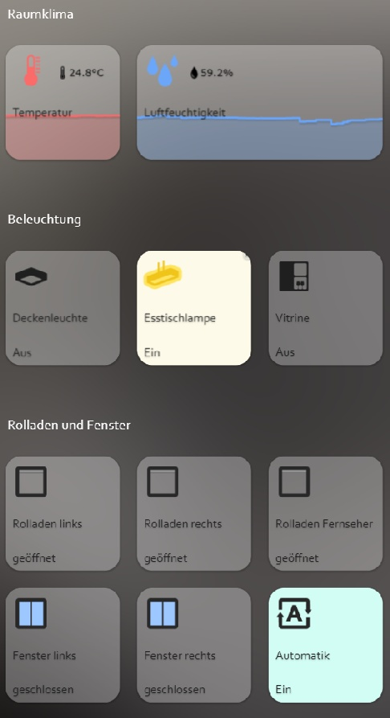

# IoBroker.iqontrol
<!-- [](https://weblate.iobroker.net/engage/adapters/?utm_source=widget) -->

**测试：**

| Linux/Mac/Windows： | 跨浏览器检查：|
|---------------------------------------------------------------------------------------------------------------------------------------| --- |

****

## IoBroker 的 iQontrol 适配器
用于可视化的快速 Web 应用程序。

    

由 dslraser 复制：


&copy; 作者 muuulle：


&copy; 来自 peks-64：



可在任何浏览器中运行。
易于设置，尽管它是完全可定制和响应的。

> **此适配器使用 Sentry 库自动向开发人员报告异常和代码错误。** 有关更多详细信息以及如何禁用错误报告的信息，请参阅[Sentry-插件文档](https://github.com/ioBroker/plugin-sentry#plugin-sentry)！从 js-controller 3.0 开始使用 Sentry 报告。

## 致谢
如果没有@o0Shojo0o (https://github.com/o0Shojo0o) 的出色工作，这个适配器就不可能实现，他开发了此适配器的早期版本。

## 如何报告问题和功能请求
理想情况下，请使用 GitHub 问题来实现这一点，最佳方法是将适配器设置为调试日志模式（实例 -> 专家模式 -> 列日志级别）。然后通过“log”ioBroker 子目录从磁盘检索日志文件，**不是**从 Admin 检索，这样会切断线路。

## 视频教程（德语）：
[](https://youtube.com/playlist?list=PL8epyNz8pGEv6-R8dnfXm-m5aBlZFKOBG)

## 添加到主屏幕
您可以将其保存为主屏幕上的 Web 应用程序，它的外观和感觉就像原生应用程序：

这也适用于装有 Chrome 的 PC：

* 在 Chrome 中打开 iQontrol
* 点击三个点菜单 - 更多工具 - 创建快捷方式
* 然后，您将在 Chrome 应用下的开始菜单中找到 iQontrol，甚至可以将其添加到任务栏

## 你需要...
* Nodejs 10 或更高版本
* Web 适配器的一个实例运行与管理适配器相同的协议（http 或 https），socket.IO 设置为“集成”，并且“强制 Web 套接字”已禁用
* 如果这与其他适配器发生冲突，只需使用上述设置添加另一个实例 - iQontrol 将搜索最合适的 Web 适配器实例并将其用于通信
* 为了通过 *iobroker.pro-Cloud* 进行连接，管理员和 Web 适配器都应设置为 http（而不是 https）

* 如果您遇到任何问题，请参阅本自述文件末尾的[故障排除]（#troubleshooting）部分

## 论坛
访问支持主题[iobroker 论坛](https://forum.iobroker.net/topic/52077)。
访问开发者主题[iobroker 论坛](https://forum.iobroker.net/topic/22039)。

## 维基
请查看 wiki [维基百科](https://github.com/sbormann/ioBroker.iqontrol/wiki)。

如何使用
**不要害怕您拥有的众多选择。**大多数东西都是开箱即用的。您可以*但不必使用 iQontrol 提供的所有配置可能性！只需按以下方式开始：

* 开始创建视图。

您可以将视图视为类似页面的东西。

* 然后在这些视图上创建设备。

设备具有角色，该角色决定了设备的功能、使用哪些图标等等。
根据该角色，您可以将多个状态链接到设备。这些将赋予设备其功能。
如果选择“链接到其他视图”作为角色，则可以创建指向其他视图的链接。我建议使用与链接视图相同的背景为其他视图添加链接皮肤。
您还可以尝试使用自动创建功能从 iobroker 对象树中选择一个现有设备。自动创建会尝试找出角色并匹配尽可能多的状态。

* 随后您可以创建一个工具栏，它显示为页脚。

工具栏条目是视图的链接。
第一个工具栏条目将是您的“主视图”，将在启动时加载。

* 为了让一切看起来更美观，您可以上传自己的图像。

您可以将图像用作视图或设备的背景图像。
文件夹 `/usericons` 中的图像可用作设备的图标。
免费内置演示壁纸来自 www.pexels.com。

### 使用自动创建
* 您会在“视图”选项卡中找到“自动创建视图”按钮
* 如果您有维护良好的 ioBroker 枚举（如 Rooms 或 Functions），则可以使用此函数自动构建包含枚举内列出的设备的视图
* 请记住，由于 ioBroker 世界中存在大量不同的适配器和设备，自动创建功能无法 100% 正确地维护所有设备。您可能需要手动重新设置一些设置才能获得最佳效果。但自动创建功能为您提供了一个良好的起点，让您在几秒钟内构建自己的可视化。

## URL 参数
* 前端通过 `http[s]://<iobroker 的 url 或 ip>:<web 适配器的端口>/iqontrol/index.html` 调用
* `<网络适配器端口>` 通常为 8082
* 要打开指定的实例，您可以添加“namespace=iqontrol.<instance-number>”作为 URL 参数
* 要打开指定的视图，您可以添加“renderView=<viewID>”作为 URL 参数。
* `<viewID>` 需要格式化为 `iqontrol.<instance-number>.Views.<view-name>`
* 注意：区分大小写！
* 要将指定视图作为主页打开，您可以添加 `home=<viewID>` 作为 URL 参数。这也会更改第一个工具栏条目的链接视图！
* `<viewID>` 需要格式化为 `iqontrol.<instance-number>.Views.<view-name>`
* 注意：区分大小写！
* 要在加载页面时打开指定的对话框，您可以添加 `openDialog=<deviceID>` 作为 URL 参数
* `<deviceID>` 需要格式化为 `iqontrol.<instance-number>.Views.<view-name>.devices.<device-number>`，其中 `<device-number>` 从 0 开始（因此视图上的第一个设备是设备编号 0）
* 注意：区分大小写！
* 要设置或覆盖返回时间设置，请使用以下参数：
    * `返回时间阈值后=<time in seconds> ` 设置时间，在此时间之后调用目标视图。使用 `0` 可禁用时间后返回功能。
* `returnAfterTimeDestiationView=<viewID>` 设置视图，在阈值后调用。如果不指定，将使用主视图。
* 如果您从壁挂式平板电脑调用 iQontrol，这些选项会很有用，使用后平板电脑会自动返回主视图
* 要加载不带工具栏的页面，您可以添加“noToolbar=true”
* 要加载不带面板的页面，您可以添加“noPanel=true”
* 要加载没有工具栏和面板的页面，禁用滑动，没有加载旋转器并且使用透明的加载屏幕，您可以添加“isBackgroundView = true”
* 通常，iQontrol 使用在 ioBroker 中设置的语言。您可以通过添加“language=<xx>”来覆盖该语言
* `<xx>` 可以是 `de`、`en`、`es`、`fr`、`it`、`nl`、`pl`、`pt`、`ru` 或 `zh-cn`
* 如果您的 iQontrol 实例受密码保护（请参阅选项 - 密码保护），您可以通过添加“passphrase=<MyPassphrase>”来提交密码

**例子：**

* `https://192.168.1.1:8082/iqontrol/index.html?namespace=iqontrol.1&home=iqontrol.1.Views.Living-Room`
* 注意大小写

字体
* 您可以将 Images/Widgets-Tab 中的自己的字体文件上传到文件夹 `/userfonts`
* 在选项选项卡中，您可以有几个地方选择这些字体
* 这取决于您服务器的 MIME 设置，如果字体在浏览器中正确显示 - 对我来说，最好的是 .ttf 和 .woff（在 raspi 4b 上测试）
* 这些 mime 设置应该可以工作：
* .otf: `应用程序/x-font-opentype`
* .ttf: `application/x-font-ttf` 或 `application/x-font-truetype`
* .woff：`应用程序/字体-woff`
* .woff2：`应用程序/字体-woff2`
* .eot: `应用程序/vnd.ms-fontobject`
* 您可以在 `fontsquirrel.com` 的生成器下将字体转换为其他格式
* 请记住 - 网络字体总是有点棘手，并不是每个服务器和浏览器上的每种字体都能正常工作

## 图标和背景图片
* 您可以使用内置图像或在图像选项卡下上传的图像或您喜欢的任何免费 URL
* 您还可以在图像 URL 中使用变量。这可能对天气预报等有用。使用以下模式：
* `路径/到/firstloaded.png|另一路径/到/{iobrokerstate|fallback}.png`
* 示例：`./../iqontrol.meta/userimages/demo/bottle.jpg|./../iqontrol.meta/userimages/demo/{javascript.0.myimage|whitestone}.jpg`
* 当您打开视图时，这将加载 `./../iqontrol.meta/userimages/demo/bottle.jpg`
* 一旦从服务器获取“javascript.0.myimage”的状态，图像将被替换为“./../iqontrol.meta/userimages/demo/XXX.jpg”，其中“XXX”是“javascript.0.myimage”的值
* 如果 `javascript.0.myimage` 没有值，则将使用后备 `whitestone`（使用后备是可选的）

### 进度条
* 可以使用 SVG 定义与变量结合来代替图像文件来显示进度条
* 有多种模板可供选择，但您也可以创建自己的 SVG


* 请参阅 [Wiki](https://github.com/sbormann/ioBroker.iqontrol/wiki/Progress-Bars) 了解更多信息

### 图表
* 您可以将 ''FLOT Chart-Widget'' 添加为任何设备的 BACKGROUND_URL，它将自动在设备图块的背景中以图表形式显示主状态
* 您需要确保状态已被 ioBroker 的一个历史适配器记录下来


## 设备名称
* 就像图像网址中的变量一样，您可以在设备名称中使用变量。语法几乎相同：
* `加载时的文本|加载后的文本 {iobrokerstate|fallback}`
* 另外，可以将 iobroker 状态放入方括号中，然后使用不带单位的纯值：`加载时的文本|加载后的文本 {[iobrokerstate]|fallback}`
* 示例：`天气正在加载|天气：{javascript.0.weather|未找到天气数据}`
* 打开视图时显示“天气正在加载”
* 一旦从服务器获取 `javascript.0.weather` 的状态，文本将被替换为 `Weather: XXX`，其中 `XXX` 是 `javascript.0.weather` 的值
* 如果 `javascript.0.weather` 没有值，则将使用后备 `未找到天气数据`（使用后备是可选的）

## 弹出消息
* 每个实例都会创建状态“iqontrol.x.Popup.Message”
* 当将值传递给此状态时，所有**当前**打开的 iQontrol 前端将显示弹出消息（或提示）
* 此外，每个实例都会创建状态“iqontrol.x.Popup.PersistentMessage”
* 当传递此状态的值时，弹出消息将被保存到PERSISTENT_MESSAGES_PENDING-Array中。
* 持久消息不仅会显示在所有当前打开的 iQontrol 前端上，还会显示在所有**未来**打开的实例上，直到它们被确认（通过点击或持续时间）或过期。
* `PersistentExpires` 定义持久消息何时以 UNIX 时间戳 (从 1970-01-01 00:00:00 开始的秒数) 过期。低于 31536000 的值被解释为从现在开始的秒数 (31536000 秒 = 1 年)。
* `PersistentUndismissible` *boolean* - 如果将其设置为 true，持久消息即使在关闭后也会保留。如果您打开新的 iQontrol 实例，它将再次显示。否则，持久消息将在弹出窗口关闭后被删除（即使通过单击或持续时间已过）。
* `PersistentId` 是一个可选的任意表达式，可用于识别消息。
* 可以通过将 id 发送到 `PERSISTENT_MESSAGES_DELETE_ID` 来使用该 id 删除相应的弹出消息。向此数据点发送 `null` 将删除所有待处理消息。
* 通过将 id 发送到“PERSISTENT_MESSAGES_SHOW_ID”，还可以使用该 id 在所有当前打开的 iQontrol-Instances 上再次显示相应的弹出消息。向此数据点发送“null”将显示所有待处理消息。
* **注意**：您只能向两个数据点“Message”或“PersistentMessage”中的一个发送消息，而不能同时向两者发送消息。
* 您可以使用 html 标签来格式化消息文本
* 有一些额外的状态可以进一步定制显示的弹出窗口（必须在设置消息数据点之前设置这些状态）：
* `持续时间`：这是消息显示的时间（以毫秒为单位）；如果设置为 0，则必须确认消息
* `ClickedValue` 和 `ClickedDestinationState`：如果用户点击了弹出窗口，则 `ClickedValue` 的值将发送到 `iqontrol.x.Popup.POPUP_CLICKED`，并且如果指定，还会发送到 `ClickedDestinationState` 中的数据点
* 如果没有指定值，则将使用 `true`
* `ClickKeepsOpen` *boolean* - 如果为真，则只能通过单击按钮来关闭弹出窗口，单击弹出窗口本身不会关闭它。因此，请确保向弹出消息添加按钮，如下所述。
* `ButtonNames`：在这里您可以指定一个以逗号分隔的按钮列表，这些按钮将显示在弹出窗口的底部（例如“OK,Abort”）
* `ButtonValues` 和 `ButtonDestinationStates`：这些是用逗号分隔的值列表，将发送到 `iqontrol.x.Popup.BUTTON_CLICKED`，并且（如果指定）如果用户单击相应的按钮，则还会发送到 `ButtonDestinationStates` 中的数据点
* 您可以使用命令 `COMMAND:renderView` 和 `COMMAND:openDialog` 作为 ButtonDestinationState，而不是数据点来呈现视图或打开对话框
* 然后，ButtonValue 指定视图和对话框，格式分别为 `iqontrol.<instance-number>.Views.<view-name>` 和 `iqontrol.<instance-number>.Views.<view-name>.devices.<device-number>`，其中 `<device-number>` 从 0 开始（因此视图上的第一个设备是设备编号 0）
* 如果您只使用一个值（而不是逗号分隔的列表），则该值将用于所有按钮
* 如果将“ButtonValues”留空，则将使用按钮的名称
* 如果您只使用一个目标状态（而不是逗号分隔的列表），则此状态将用于所有按钮
*`ButtonCloses`：这是一个以逗号分隔的布尔值列表（`true`/`false`），用于指定当按下相应按钮时是否应关闭弹出窗口
*`ButtonClears`：这是一个以逗号分隔的布尔值列表（`true`/`false`），用于指定当按下相应按钮时是否应清除弹出设置（=将所有弹出状态设置为空）
* 或者，您可以通过 sendTo 命令使用参数 `PopupMessage`、`PopupDuration`、`PopupClickedValue` 等设置这些值
* 示例：`sendTo("iqontrol", "send", {PopupMessage: '这是我的消息', PopupDuration: 2500, PopupClickedValue: 'messageConfirmed'});`
* 您还可以使用 blockly 向 iQontrol 发送消息


## 小部件
* 每个图块都有一个 BACKGROUND_URL 和一个 BACKGROUND_HTML 数据点
* 您可以在此处定义一个网站链接（通过 BACKGROUND_URL）或放置直接 HTML 代码（通过 BACKGROUND_HTML），该代码将显示为图块的背景
* 您可以将（交互式）内容放置在图块内（例如时钟、FLOT 图表、表格、天气预报等）
* 默认情况下，鼠标事件将被定向到此内容（因此您无法再单击图块本身），但您可以使用选项“将鼠标事件定向到图块而不是 BACKGROUND_VIEW/URL/HTML 的内容”禁用此功能
* iQontrol 提供设备角色“Widget”，其中包含一些预定义选项集，主要用于将网站显示为小部件。但您可以通过适当修改设备选项，使用任何其他角色实现相同的结果。


<details><summary>小部件开发（仅限专家）：（<ins>点击打开</ins>）</summary>

### JQuery
* 从技术上讲，BACKGROUND_VIEW/URL/HTML 的内容被放置在名为 iframe 的 HTML 元素中，这是一个网站内的网站
* 为了使用 jQuery，您可以使用以下代码将其从 iQontrol 传输到 iFrame：

``window.$=window.jQuery=parent.jQuery.extend(function(s){return parent.jQuery(s,document)},parent.jQuery);``

* 例子：

	```html
	<!doctype html>
	<html>
	<head>
		<meta http-equiv="Content-Type" content="text/html; charset=UTF-8"/>
		<meta name="widget-description" content="This is a demo widget-preset. It has no useful funcion. (C) by Sebastian Bormann"/>
		<meta name="widget-options" content="{'noZoomOnHover': 'true', 'hideDeviceName': 'true', 'sizeInactive': 'xwideIfInactive highIfInactive', 'iconNoPointerEventsInactive': 'true', 'hideDeviceNameIfInactive': 'true', 'hideStateIfInactive': 'true', 'sizeActive': 'fullWidthIfActive fullHeightIfActive', 'bigIconActive': 'true', 'iconNoPointerEventsActive': 'true', 'hideDeviceNameIfActive': 'true', 'hideStateIfActive': 'true', 'sizeEnlarged': 'fullWidthIfEnlarged fullHeightIfEnlarged', 'bigIconEnlarged': 'true', 'iconNoPointerEventsEnlarged': 'false', 'noOverlayEnlarged': 'true', 'hideDeviceNameIfEnlarged': 'true', 'hideStateIfEnlarged': 'true', 'popupAllowPostMessage': 'true', 'backgroundURLAllowPostMessage': 'true', 'backgroundURLNoPointerEvents': 'false'}"/>
		<title>iQontrol Widget Test</title>
	</head>
	<body>
		<div id="testDiv">Loading...</div>
		<script type="text/javascript">
			console.log("JQUERY-TEST");
			window.$=window.jQuery=parent.jQuery.extend(function(s){return parent.jQuery(s,document)},parent.jQuery);
			$(document).ready(function(){
				$('#testDiv').html("<h1>Hello World</h1)");
				console.log("jQuery works!!");
			});
		</script>
	</body>
	</html>
	```

### PostMessage 通信
* 通过启用选项“允许 BACKGROUND_VIEW/URL/HTML 的 postMessage 通信”，您可以启用其 iframe 中的小部件与 iQontrol 本身之间的 postMessage 通信
* 要向 iQontrol 发送命令，您可以使用以下 javascript 命令：`window.parent.postMessage(message, "*");`
* `message` 是一个 javascript 对象，格式为 `{ command: command, stateId: stateId, value: value }`
* 支持以下消息命令：
* `{ 命令：“setWidgetState”，stateId：<widgetStateId>，值：<value> }`
* 这会将 ioBroker 状态 `iqontrol.<instance>.Widgets.<widgetStateId>` 设置为值 `<value>`（`<value>` 可以是字符串、数字或布尔值，也可以是对象，如 `{ val: <value>, ack: true|false }`）
* `{ 命令：“getWidgetState”，stateId：<widgetStateId> }`
* 这将导致 iQontrol 发送 ioBroker 状态的值“iqontrol.<instance>.Widgets.<widgetStateId>”（请参阅下文了解如何接收应答消息）
* `{ 命令：“getWidgetStateSubscribed”，stateId：<widgetStateId> }`
* 这将导致 iQontrol 现在以及每次其值发生变化时发送 ioBroker 状态“iqontrol.<instance>.Widgets.<widgetStateId>”的值（请参阅下文如何接收应答消息）
* `{ 命令：“setWidgetDeviceState”，stateId：<widgetDeviceState>，值：<value> }`
* 这会将分配给设备 STATE `<widgetDeviceState>` 的 ioBroker 数据点（例如，分配给 LEVEL 的数据点）设置为值 `<value>`（`<value>` 可以是字符串、数字或布尔值或对象，如 `{ val: <value>, ack: true|false }`）
* `{ 命令：“getWidgetDeviceState”，stateId：<widgetDeviceState> }`
* 这将导致 iQontrol 发送分配给设备 STATE `<widgetDeviceState>` 的 ioBroker 数据点的值（例如，分配给 LEVEL 的数据点；请参阅下文如何接收应答消息）
* `{ 命令：“getWidgetDeviceStateSubscribed”，stateId：<widgetDeviceState> }`
* 这将导致 iQontrol 现在以及每次其值发生变化时发送分配给设备 STATE `<widgetDeviceState>` 的 ioBroker 数据点的值（例如，分配给 LEVEL 的数据点）（请参阅下文如何接收应答消息）
* `{ 命令：“setState”，stateId：<stateId>，值：<value> }`
* 这会将 ioBroker 状态 `<stateId>` 设置为值 `<value>` （`<value>` 可以是字符串、数字或布尔值，也可以是对象，如 `{ val: <value>, ack: true|false }`）
* `{ 命令：“getState”，stateId：<stateId> }`
* 这将导致 iQontrol 发送 ioBroker 状态的值 `<stateId>`（请参阅下文如何接收应答消息）
* `{ 命令：“getStateSubscribed”，stateId：<stateId> }`
* 这将导致 iQontrol 现在以及每次其值发生变化时发送 ioBroker 状态 `<stateId>` 的值（请参阅下文如何接收应答消息）
* `{命令：“getOptions”}`
* 这将导致 iQontrol 向用户发送已配置为对象的选项
* `{ 命令：“renderView”，值：<viewID> }`
* 这将指示 iQontrol 呈现一个视图，其中 `<viewID>` 需要格式化为 `iqontrol.<instance-number>.Views.<view-name>`（区分大小写）
* `{ 命令：“openDialog”，值：<deviceID> }`
* 这将指示 iQontrol 打开一个对话框，其中 `<deviceID>` 需要格式化为 `iqontrol.<instance-number>.Views.<view-name>.devices.<device-number>`，其中 `<device-number>` 从 0 开始（因此视图上的第一个设备是设备编号 0）
* 要从 iQontrol 接收消息，您需要使用 javascript 命令“window.addEventListener("message", acceptPostMessage, false);”向“message”事件注册一个事件监听器。
* 函数 `receivePostMessage` 接收对象 `event`
* `event.data` 包含来自 iqontrol 的消息，它将是一个类似以下的对象：
* event.data = `{ command: "getState", stateId: <stateId>, value: <stateObject> }` - 这将是 `getState` 命令或 `getStateSubscribed` 命令的答案，并为您提供 ioBroker 状态的实际 `<value>` 对象`<stateId>`
* `<stateObject>` 本身是一个对象，例如

			```
			event.data.value = {
				val: <value (rounded)>,
				unit: "<unit>",
				valFull: <value (not rounded, no javascript-injection prevention)>,
				plainText: "<clear text of val, for example taken from valuelist>",
				min: <minimum>,
				max: <maximum>,
				step: <step-width>,
				valuelist: {<object with possible values and corresponding clear text>},
				targetValues: {<target value list>},
				ack: <true|false>,
				readonly: <true|false>,
				custom: {<object with custom settings>},
				id: <id of the iobroker datapoint>,
				from: "<source of state>",
				lc: <timestamp of last change>,
				ts: <timestamp of last actualization>,
				q: <quality of signal>,
				role: "<role of state>",
				type: "<string|number|boolean>",
				name: "<name of datapoint>",
				desc: "<description of datapoint>",
				Date: <Date-object (only present, if value is regognized as a valid time or period)>
			}
			```

* 要指示 iQontrol 在“iqontrol.<instance>.Widgets”下生成 widgetState，您可以在 widget-website 的 head 部分内使用元标记：
* 语法：

```
<meta name="widget-datapoint" content="WidgetName.StateName" data-type="string" data-role="text" />
```

* 您可以使用数据类型（可以设置为字符串、数字或布尔值）、数据角色、数据名称、数据最小值、数据最大值、数据定义和数据单元属性进一步配置数据点
* 您还可以使用 URL 参数（见下文）作为变量，例如使用自己的数据点创建小部件的不同实例。
* 语法如下：

		  ```
          <meta name="widget-datapoint" content="WidgetName.StateName|WidgetName.{instance}.StateName" data-type="string" data-role="text" />
          ```

* 如果设置了变量 `instance`，则 `|` 后面的部分将用作 widgetState-Name，并且 `{instance}` 将被 `instance` 的值替换
* 如果未设置变量 `instance`，则 `|` 之前的部分将用作 `wigdetState`-Name
* 仅当小部件网站作为 URL 或 BACKGROUND_URL 添加到设备时，才会创建相应的数据点。
* 相同的概念可用于 URL/HTML 状态，用于在设备的对话框中显示网站
* 要为您的小部件创建图标，请将与小部件同名的 .png 文件放入小部件目录中
* 请参阅下面的小部件网站示例：

<details><summary>显示示例 widget-website，通过 postMessage-communication 显示为 widget: (<ins>点击打开</ins>）</summary>

* 您可以使用以下 HTML 代码并将其复制到小部件的 BACKGROUND_HTML-State（然后需要将其配置为“Constant”）
* 另外，您可以将此代码作为 html 文件上传到 `/userwidgets` 子目录，并将其引用到 BACKGROUND_URL-State（然后也需要将其配置为“常量”）
* 激活选项“允许 BACKGROUND_VIEW/URL/HTML 的 postMessage 通信”
* 它将演示如何进行网站和 iQontrol 之间的双向通信

```html
<!doctype html>
<html>
<head>
	<meta http-equiv="Content-Type" content="text/html; charset=UTF-8"/>
	<meta name="widget-datapoint" content="postMessageTest.test" data-type="string" data-role="text" />
	<meta name="widget-description" content="This is a test widget. To get the WidgetDeviceState-Functions working, please set a valid iobroker-datapoint for STATE. (C) by Sebastian Bormann"/>
	<meta name="widget-urlparameters" content="title/postMessageTest/Please enter a title">
	<meta name="widget-options" content="{'noZoomOnHover': 'true', 'hideDeviceName': 'true', 'sizeInactive': 'xwideIfInactive highIfInactive', 'iconNoPointerEventsInactive': 'true', 'hideDeviceNameIfInactive': 'true', 'hideStateIfInactive': 'true', 'sizeActive': 'xwideIfActive highIfActive', 'bigIconActive': 'true', 'iconNoPointerEventsActive': 'true', 'hideDeviceNameIfActive': 'true', 'hideStateIfActive': 'true', 'sizeEnlarged': 'fullWidthIfEnlarged fullHeightIfEnlarged', 'bigIconEnlarged': 'true', 'iconNoPointerEventsEnlarged': 'false', 'noOverlayEnlarged': 'true', 'hideDeviceNameIfEnlarged': 'true', 'hideStateIfEnlarged': 'true', 'popupAllowPostMessage': 'true', 'backgroundURLAllowPostMessage': 'true', 'backgroundURLNoPointerEvents': 'false'}"/>
 	<title>iQontrol postMessageTest</title>
</head>
<body>
	<br><br>
	<h3><span id="title">postMessageTest</span><h3>
	<button onclick="getWidgetState('postMessageTest.test')">getWidgetState postMessageTest.test</button><br>
	<button onclick="getWidgetStateSubscribed('postMessageTest.test')">getWidgetStateSubscribed postMessageTest.test</button><br>
	<button onclick="setWidgetState('postMessageTest.test', 'Hello world')">setWidgetState postMessageTest.test to 'Hello world'</button><br>
  	<br>
	<button onclick="getWidgetDeviceState('STATE')">getWidgetDeviceState STATE</button><br>
	<button onclick="getWidgetDeviceStateSubscribed('STATE')">getWidgetDeviceStateSubscribed STATE</button><br>
	<button onclick="setWidgetDeviceState('STATE', 'Hello world')">setWidgetDeviceState STATE to 'Hello world'</button><br>
  	<br>
	<button onclick="getState('system.adapter.admin.0.cpu')">getState system.adapter.admin.0.cpu</button><br>
	<button onclick="getStateSubscribed('system.adapter.admin.0.uptime')">getStateSubscribed system.adapter.admin.0.uptime</button><br>
	<button onclick="setState('iqontrol.0.Popup.Message', 'Hey, this is a test Message')">setState popup message</button><br>
  	<br>
	<button onclick="renderView('iqontrol.0.Views.Home')">renderView 'Home'</button><br>
	<button onclick="openDialog('iqontrol.0.Views.Home.devices.0')">openDialog 1st device on 'Home'</button><br>
	<br><hr>
	message sent: <span id="messageSent">-</span><br>
	<br><hr>
	message received: <span id="messageReceived">-</span><br>
	<br><hr>
	this means: <span id="thisMeans">-</span><br>
	<br><hr>
    <script type="text/javascript">
		var countSend = 0;
		var countReceived = 0;

		//Set title from UrlParameter
		document.getElementById('title').innerHTML = getUrlParameter('title') || "No Title set";

		//getWidgetState
		function getWidgetState(stateId){
			sendPostMessage("getWidgetState", stateId);
		}

		//getWidgetStateSubscribed (this means, everytime the state changes, an update will be received)
		function getWidgetStateSubscribed(stateId){
			sendPostMessage("getWidgetStateSubscribed", stateId);
		}

		//setWidgetState
		function setWidgetState(stateId, value){
			sendPostMessage("setWidgetState", stateId, value);
		}


		//getWidgetDeviceState
		function getWidgetDeviceState(stateId){
			sendPostMessage("getWidgetDeviceState", stateId);
		}

		//getWidgetDeviceStateSubscribed (this means, everytime the state changes, an update will be received)
		function getWidgetDeviceStateSubscribed(stateId){
			sendPostMessage("getWidgetDeviceStateSubscribed", stateId);
		}

		//setWidgetDeviceState
		function setWidgetDeviceState(stateId, value){
			sendPostMessage("setWidgetDeviceState", stateId, value);
		}


		//getState
		function getState(stateId){
			sendPostMessage("getState", stateId);
		}

		//getStateSubscribed (this means, everytime the state changes, an update will be received)
		function getStateSubscribed(stateId){
			sendPostMessage("getStateSubscribed", stateId);
		}

		//setState
		function setState(stateId, value){
			sendPostMessage("setState", stateId, value);
		}


		//renderView
		function renderView(viewId){
			sendPostMessage("renderView", null, viewId);
		}

		//openDialog
		function openDialog(deviceId){
			sendPostMessage("openDialog", null, deviceId);
		}

		// +++++ Default Functions +++++
		//getUrlParameter
		function getUrlParameter(name) {
			name = name.replace(/[\[]/, '\\[').replace(/[\]]/, '\\]');
			var regex = new RegExp('[\\?&]' + name + '=([^&#]*)');
			var results = regex.exec(location.search);
			return results === null ? null : decodeURIComponent(results[1].replace(/\+/g, ' '));
		};

		//send postMessages
		function sendPostMessage(command, stateId, value){
			countSend++;
			message = { command: command, stateId: stateId, value: value };
			document.getElementById('messageSent').innerHTML = countSend + " - " + JSON.stringify(message);
			window.parent.postMessage(message, "*");
		}

		//receive postMessages
		window.addEventListener("message", receivePostMessage, false);
		function receivePostMessage(event) { //event = {data: message data, origin: URL of origin, source: id of sending element}
			countReceived++;
			if(event.data) document.getElementById('messageReceived').innerHTML = countReceived + " - " + JSON.stringify(event.data);
			if(event.data && event.data.command) switch(event.data.command){
				case "getState":
				if(event.data.stateId && event.data.value && event.data.value.val){
					document.getElementById('thisMeans').innerHTML = "Got State " + event.data.stateId + " with value " + event.data.value.val;
				}
				break;
			}
		}
	</script>
</body>
</html>
```

</详情>

### 小部件的进一步配置
* 有额外的元标记，您可以在小部件网站的头部部分内使用它来配置小部件的行为：
* `小部件描述`
* 语法：

		  ```  
          <meta name="widget-description" content="Please see www.mywebsite.com for further informations. (C) by me"/>
          ```

* 当选择小部件作为 URL 或 BACKGROUND_URL 或自动创建小部件时，将显示内容
*`widget-url参数`
* 语法：

		  ```
          <meta name="widget-urlparameters" content="parameter/default value/description/type;parameter2/default value2/description2/type2"/>
          ```

* 当选择小部件作为 URL 或 BACKGROUND_URL 或自动创建小部件时，系统会要求用户输入这些参数
* `type` 是可选的，可以是 `text` (默认)、`number`、`checkbox`、`color`、`select`、`multipleSelect`、`combobox`、`historyInstance`、`datapoint`、`listJsonDatapoint`、`icon`、`fontFamily`、`fontSize`、`fontStyle`、`fontWeight`、`language`、`section`、`divider`、`info`、`link` 或 `hidden`
* 如果类型是 `select`、`multipleSelect` 或 `combobox`，那么您需要通过添加 `/<selectOptions>` 来指定可能的选项，其中 `<selectOptions>` 是格式为 `<value1>,<caption1>/<value2>,<caption2>/...` 的字符串（combobox 是一个可以输入自由文本的选择框）
* 如果类型为 `number`，则可以通过添加 `/<numberOptions>` 来指定最小值、最大值和步长，其中 `<numberOptions>` 是格式为 `<min>,<max>,<step>` 的字符串
* 类型 `section`、`divider`、`info` 和 `link` 没有其他功能，它们只是向用户显示信息。对于 `link`，值应该是 URL，但所有斜杠都必须替换为反斜杠。
* 类型“hidden”将被传递给小部件，但不显示配置对话框
* 所有这些参数都将通过 URL 参数字符串传递给 widget 网站（如 `widget.html?parameter=value&parameter2=value2`）
* 您可以通过如下函数请求 URL 参数，在小部件网站内使用这些设置：

			```
			function getUrlParameter(name) {
				name = name.replace(/[\[]/, '\\[').replace(/[\]]/, '\\]');
				var regex = new RegExp('[\\?&]' + name + '=([^&#]*)');
				var results = regex.exec(location.search);
				return results === null ? null : decodeURIComponent(results[1].replace(/\+/g, ' '));
			};
			```

* 如果您使用“icon”类型作为 URL 参数，那么您将获得相对于 iqontrol 目录的路径或图像的绝对路径。要创建指向图像的有效链接，您可以使用以下代码：

			    ```
				var iconOn = getUrlParameter('iconOn') || './images/icons/switch_on.png';
				if(iconOn.indexOf('http') != 0) iconOn = '/iqontrol/' + iconOn;
				```

* `小部件选项`
* 语法：

		  ```
          <meta name="widget-options" content="{'noZoomOnHover': 'true', 'hideDeviceName': 'true'}"/>
          ```

* 请参阅下面可扩展的部分，了解可以通过此元标记配置的可能选项

* `widget-replaceurl`
* 语法：

```
<meta name="widget-replaceurl" content="<url>" data-absolute="<true|false>"/>

* 这会重新配置此小部件使用的 URL/BACKGROUND_URL（这样您就可以定义小部件预设，用于为用户提供特殊或简化的配置。但是在调用小部件时，iQontrol 使用给定的 `<url>` 而不是原始 URL。
* 默认情况下，只替换文件名（带扩展名）。当设置 `data-absolute=`true`` 时，将替换整个 URL。

<details><summary>显示可以通过元标记“widget-options”配置的可能选项：（<ins>点击打开</ins>）</summary>

* 图标：
* `icon_on`（图标开启）：
		* 默认： ””
* `icon_off`（图标关闭）：
		* 默认： ””
* 设备特定选项：
* `showState` (显示状态) - 仅对角色按钮和程序有效：
* 可能的值：`true`|`false`
* 默认值： `false`
* `showPowerAsState: `（显示电源状态） - 仅对角色开关、灯和风扇有效：
* 可能的值：`true`|`false`
* 默认值： `false`
* `buttonCaption` (按钮标题) - 仅对角色按钮有效：
		* 默认： ””
* `returnToOffSetValueAfter`（[ms] 后返回‘OFF_SET_VALUE’）- 仅对角色按钮有效：
* 可能的值：10 到 60000 之间的数字
		* 默认： ””
* `alwaysSendTrue` (始终发送‘true’（不切换）) - 仅对角色场景有效：
* 可能的值：`true`|`false`
* 默认值： `false`
* `closeDialogAfterExecution`（执行后关闭对话框）-仅对角色按钮、程序和场景有效：
* 可能的值：`true`|`false`
* 默认值： `false`
* `invertCt` (反转 CT (使用开尔文而不是 Mired)) - 仅对角色 Light 有效：
* 可能的值：`true`|`false`
* 默认值： `false`
* `alternativeColorspace` (ALTERNATIVE_COLORSPACE_VALUE 的色彩空间) - 仅对角色 Light 有效：
* 可能的值：""|"RGB"|"#RGB"|"RGBW"|"#RGBW"|"RGBWWCW"|"#RGBWWCW"|"RGBCWWW"|"#RGBCWWW"|"RGB_HUEONLY"|"#RGB_HUEONLY"|"HUE_MILIGHT"|"HHSSBB_TUYA"
		* 默认： ””
* `linkOverlayActiveColorToHue` (使用灯的颜色作为 OVERLAY_ACTIVE_COLOR) - 仅对角色 Light 有效：
* 可能的值：`true`|`false`
* 默认值： `false`
* `linkGlowActiveColorToHue` (使用灯的颜色作为 GLOW_ACTIVE_COLOR) - 仅对角色 Light 有效：
* 可能的值：`true`|`false`
* 默认值： `false`
* `controlModeDisabledValue`（CONTROL_MODE 的值为“disabled”） - 仅对角色 Thermostat、Homematic-Thermostat 和 Homematic IP-Thermostat 有效：
		* 默认： ””
* `valveStatesSectionType`（VALVE_STATES 的外观）- 仅对角色 Thermostat、Homematic-Thermostat 和 Homematic IP-Thermostat 有效：
* 可能的值：`true`|`false` `none`|`none noCaption`|`collapsible`|`collapsible open`
* 默认值：“可折叠”
* `stateClosedValue`（STATE 的值表示为“closed”）——仅对带锁的窗口和门角色有效：
		* 默认： ””
* `stateOpenedValue` ('opened' 的状态值) - 仅对角色窗口有效：
		* 默认： ””
* `stateTiltedValue`（'倾斜' 的状态值）- 仅对角色窗口有效：
		* 默认： ””
* `lockStateLockedValue` (LOCK_STATE 的值表示为‘已锁定’) - 仅对带锁的门角色有效：
		* 默认： ””
* `lockOpenValue` (LOCK_OPEN 的值表示‘开门’) - 仅对带锁的门角色有效：
		* 默认： ””
* `invertActuatorLevel` (反转级别 (0 = 打开)) - 仅对盲人角色有效：
* 可能的值：`true`|`false`
* 默认值： `false`
* `directionOpeningValue` ('opening' 的 DIRECTION 值) - 仅对角色窗口有效：
* 默认值：“1”
* `directionClosingValue` ('closing' 的 DIRECTION 值) - 仅对角色窗口有效：
* 默认值：“2”
* `directionUncertainValue`（DIRECTION 的值‘不确定’）——仅对角色窗口有效：
* 默认值：“3”
* `favoritePositionCaption` (FAVORITE_POSITION 的标题) - 仅对角色窗口有效：
* 默认：“最喜欢的位置”
* `stopCaption` (停止标题) - 仅对角色窗口有效：
* 默认：“停止”
* `upCaption` (UP 的标题) - 仅对角色窗口有效：
* 默认值："向下"
* `downCaption` (向下的标题) - 仅对角色窗口有效：
* 默认值："向下"
* `noConfirmationForTogglingViaIcon`（通过图标切换时不要求确认） - 仅对角色车库门有效：
* 默认值："false"
* 可能的值：`true`|`false`
* `controlModeDisarmedValue`（CONTROL_MODE 的“解除武装”值）- 仅对角色警报有效：
* 默认值：“0”
* `showStateAndLevelSeparatelyInTile` (在图块中分别显示 STATE 和 LEVEL) - 仅对角色值有效：
* 可能的值：""|"devidedByComma"|"devidedByComma preceedCaptions"|"devidedBySemicolon"|"devidedBySemicolon preceedCaptions"|"devidedByHyphen"|"devidedByHyphen preceedCaptions"
		* 默认： ””
* `timeCaption` (时间标题) - 仅对角色 DateAndTime 有效：
		* 默认： ””
* `timeFormat` (TIME 格式（存储在数据点中，请参阅自述文件）) - 仅对角色 DateAndTime 有效：
* 默认值："x"
* `timeDisplayFormat`（TIME 的显示格式（如何显示，请参阅自述文件））- 仅对角色 DateAndTime 有效：
* 默认值：“dddd，DD.MM.YYYY HH:mm:ss”
* `timeDisplayDontShowDistance` (显示距离) - 仅对角色 DateAndTime 有效：
* 可能的值：""|`false`|`true`
* 默认值：“”（这意味着使用自定义数据点设置）
* `dateAndTimeTileActiveConditions`（当所有选定项都为真时，Tile 处于活动状态）- 仅对角色 DateAndTime 有效：
* 可能的值（数组）：“activeIfStateActive”、“activeIfTimeNotZero”、“activeIfTimeInFuture”、“activeIfTimeInPast”
* 默认值：“activeIfStateActive，activeIfTimeInFuture”
* `dateAndTimeTileActiveWhenRinging` (当 RINGING 处于活动状态时，Tile 始终处于活动状态) - 仅对角色 DateAndTime 有效：
* 默认值： true
* `dateAndTimeShowInState`（在状态中显示） - 仅对角色 DateAndTime 有效：
* 可能的值（数组）：“showStateIfInactive”、“showStateIfActive”、“showSubjectIfActive”、“showSubjectIfInactive”、“showTimeIfInactiveAndInPast”、“showTimeIfInactiveAndInFuture”、“showTimeIfActiveAndInPast”、“showTimeIfActiveAndInFuture”、“showTimeDistanceIfInactiveAndInPast”、“showTimeDistanceIfInactiveAndInFuture”、“showTimeDistanceIfActiveAndInPast”、“showTimeDistanceIfActiveAndInFuture”
* 默认值：“showStateIfInactive,showSubjectIfActive,showTimeDistanceIfActiveAndInFuture”
* `coverImageReloadDelay` (延迟重新加载封面图像 [ms]) - 仅对角色媒体有效：
* 可能的值：0 到 5000 之间的数字
		* 默认： ””
* `coverImageNoReloadOnTitleChange: `（改变标题时不强制重新加载封面图片） - 仅对角色媒体有效：
* 可能的值：`true`|`false`
* 默认值： `false`
* `statePlayValue` ('play' 的 STATE 值) - 仅对角色媒体有效：
* 默认：“播放”
* `statePauseValue` ('暂停' 的状态值) - 仅对角色媒体有效：
* 默认：“暂停”
* `stateStopValue` ('stop' 的 STATE 值) - 仅对角色媒体有效：
* 默认值：“停止”
* `useStateValuesForPlayPauseStop`（点击播放、暂停和停止时发送这些值（而不是 true）） - 仅对角色媒体有效：
* 可能的值：`true`|`false`
* 默认值："false"
* `hidePlayOverlay` (隐藏播放图标) - 仅对角色媒体有效：
* 可能的值：`true`|`false`
* 默认值： `false`
* `hidePauseAndStopOverlay` (隐藏暂停和停止图标) - 仅对角色媒体有效：
* 可能的值：`true`|`false`
* 默认值： `false`
* `repeatOffValue`（REPEAT 的值为 'off'）- 仅对角色媒体有效：
* 默认值： `false`
* `repeatAllValue` (REPEAT 的“重复全部”值) - 仅对角色媒体有效：
* 默认值： `true`
* `repeatOneValue` (REPEAT 的“重复一次”值) - 仅对角色媒体有效：
* 默认值：“2”
* `remoteKeepSectionsOpen` (保持部分打开) - 仅对角色媒体有效：
* 可能的值：`true`|`false`
* 默认值： `false`
* `remoteSectionsStartOpened`（从最初打开的这些部分开始） - 仅对角色媒体有效：
* 可能的值：带有“REMOTE_PAD”、“REMOTE_CONTROL”、“REMOTE_ADDITIONAL_BUTTONS”、“REMOTE_CHANNELS”、“REMOTE_NUMBERS”和/或“REMOTE_COLORS”的数组
* 默认值： `false`
* `remoteShowDirectionsInsidePad` (显示 Pad 内的 Vol 和 Ch +/-) - 仅对角色媒体有效：
* 可能的值：`true`|`false`
* 默认值： `false`
* `remoteChannelsCaption`（'频道'部分的标题）- 仅对角色媒体有效：
		* 默认： ””
* `remoteAdditionalButtonsCaption`（“附加按钮”部分的标题） - 仅对角色媒体有效：
		* 默认： ””
* `togglePowerSwitch`（切换 POWER_SWITCH 而不是 STATE（例如单击图标时））- 仅对角色媒体有效：
* 可能的值：`true`|`false`
* 默认值： `false`
* `noVirtualState`（不要对 STATE 使用虚拟数据点（如果 STATE 为空则隐藏开关））- 仅对角色 Widget 有效：
* 可能的值：`true`|`false`
* 默认值： `false`
* 一般的：
* `readonly` (只读):
* 可能的值：`true`|`false`
* 默认值： `false`
* `renderLinkedViewInParentInstance`（如果此视图用作 BACKGROUND_VIEW，则在父实例中打开链接视图）：
* 可能的值：`true`|`false`
* 默认值： `false`
* `renderLinkedViewInParentInstanceClosesPanel`（在父实例中打开链接视图后，关闭面板（如果可以关闭））：
* 可能的值：`true`|`false`
* 默认值： `false`
* Tile-Behaviour（一般）：
* `clickOnIconAction`（点击图标操作）：
* 可能的值：“toggle”|“openDialog”|“enlarge”|“openLinkToOtherView”|“openURLExternal”|`false`
* 默认值：“切换”
* `clickOnTileAction`（单击图块操作）：
* 可能的值：“toggle”|“openDialog”|“enlarge”|“openLinkToOtherView”|“openURLExternal”|`false`
* 默认值：“openDialog”
* `clickOnIconOpensDialog`（单击图标打开对话框（而不是切换））：
* *已弃用*，因为此选项现在包含在 clickOnIconAction 中
* 可能的值：`true`|`false`
* 默认值： `false`
* `clickOnTileToggles`（单击图块切换（而不是打开对话框）））：
* *已弃用*，因为此选项现在包含在 clickOnTileAction 中
* 可能的值：`true`|`false`
* 默认值： `false`
* `clickOnTileOpensDialog`（单击图块打开对话框）：
* *已弃用*，因为此选项现在包含在 clickOnTileAction 中
* 可能的值：`true`|`false`
* 默认值：`true`（适用于大多数设备）
* `noZoomOnHover`（禁用悬停时的缩放效果）：
* 可能的值：`true`|`false`
* 默认值：`false`（适用于大多数设备）
* `iconNoZoomOnHover`（禁用图标悬停时的缩放效果）：
* 可能的值：`true`|`false`
* 默认值： `false`
* `hideDeviceName`（隐藏设备名称）：
* 可能的值：`true`|`false`
* 默认值： `true`
* 活动方格的条件：
* `tileActiveStateId` (状态 ID（空 = 将使用 STATE/LEVEL）):
		* 默认： ””
* `tileActiveCondition` (条件):
		* 可能的值：“”|“at”|“af”|“eqt”|“eqf”|“eq”|“ne”|“gt”|“ge”|“lt”|“le”
		* 默认： ””
* `tileActiveConditionValue` (条件值):
		* 默认： ””
* 设备处于非活动状态时的 Tile 行为：
* `sizeInactive`（如果设备处于非活动状态，则图块的大小）：
* 可能的值：""|"narrowIfInactive shortIfInactive"|"narrowIfInactive"|"narrowIfInactive highIfInactive"|"narrowIfInactive xhighIfInactive"|"shortIfInactive"|"shortIfInactive wideIfInactive"|"shortIfInactive xwideIfInactive"|"wideIfInactive"|"xwideIfInactive"|"highIfInactive"|"xhighIfInactive"|"wideIfInactive highIfInactive"|"xwideIfInactive highIfInactive"|"wideIfInactive xhighIfInactive"|"xwideIfInactive xhighIfInactive"|"fullWidthIfInactive aspects-1-1IfInactive"|"fullWidthIfInactive aspects-4-3IfInactive"|"fullWidthIfInactive aspects-3-2IfInactive"|"fullWidthIfInactive aspects-16-9IfInactive"|"fullWidthIfInactive spect-21-9IfInactive"|"fullWidthIfInactive fullHeightIfInactive"|"
* 默认值：“xwideIfInactive highIfInactive”
* `stateHeightAdaptsContentInactive`（如果设备处于非活动状态，则将 STATE 的高度调整到其内容（如果需要，这将覆盖图块大小）：
* 可能的值：`true`|`false`
* 默认值： `false`
* `stateFillsDeviceInactive`（如果设备处于非活动状态，STATE 的大小会填满整个设备（这可能会干扰其他内容）：
* 可能的值：`true`|`false`
* 默认值： `false`
* `stateBigFontInactive`（如果设备处于非活动状态，则使用大字体表示状态）：
* 可能的值：`true`|`false`
* 默认值： `false`
* `bigIconInactive`（如果设备处于非活动状态，显示大图标）：
* 可能的值：`true`|`false`
* 默认值： `false`
* `iconNoPointerEventsInactive`（如果设备处于非活动状态，则忽略图标的鼠标事件）：
* 可能的值：`true`|`false`
* 默认值： `false`
* `transparentIfInactive`（如果设备处于非活动状态，则使背景透明）：
* 可能的值：`true`|`false`
* 默认值： `false`
* `noOverlayInactive`（如果设备处于非活动状态，则删除图块覆盖）：
* 可能的值：`true`|`false`
* 默认值： `true`
* `hideBackgroundURLInactive`（如果设备处于非活动状态，则隐藏 BACKGROUND_VIEW/URL/HTML 中的背景）：
* 可能的值：`true`|`false`
* 默认值： `false`
* `hideDeviceNameIfInactive`（如果设备处于非活动状态，则隐藏设备名称）：
* 可能的值：`true`|`false`
* 默认值： `false`
* `hideInfoAIfInactive`（如果设备处于非活动状态，则隐藏 INFO_A）：
* 可能的值：`true`|`false`
* 默认值： `false`
* `hideInfoBIfInactive`（如果设备处于非活动状态，则隐藏 INFO_B）：
* 可能的值：`true`|`false`
* 默认值： `false`
* `hideIndicatorIfInactive`（如果设备处于非活动状态，则隐藏指示器图标（ERROR、UNREACH、BATTERY）：
* 可能的值：`true`|`false`
* 默认值： `false`
* `hideStateIfInactive`（如果设备处于非活动状态，则隐藏状态）：
* 可能的值：`true`|`false`
* 默认值： `false`
* `hideDeviceIfInactive`（如果设备处于非活动状态，则隐藏设备）：
* 可能的值：`true`|`false`
* 默认值：`false` * `
* 如果设备处于活动状态，则 Tile 行为：
* `sizeActive`（如果设备处于活动状态，则图块的大小）：
* 可能的值：""|"narrowIfActive shortIfActive"|"narrowIfActive"|"narrowIfActive highIfActive"|"narrowIfActive xhighIfActive"|"shortIfActive"|"shortIfActive wideIfActive"|"shortIfActive xwideIfActive"|"wideIfActive"|"xwideIfActive"|"highIfActive"|"xhighIfActive"|"wideIfActive highIfActive"|"xwideIfActive highIfActive"|"wideIfActive xhighIfActive"|"xwideIfActive xhighIfActive"|"fullWidthIfActive aspects-1-1IfActive"|"fullWidthIfActive aspects-4-3IfActive"|"fullWidthIfActive aspects-3-2IfActive"|"fullWidthIfActive aspects-16-9IfActive"|"fullWidthIfActive方面-21-9IfActive“|”全宽IfActive全高IfActive“|”
* `stateHeightAdaptsContentActive`（如果设备处于非活动状态，则将 STATE 的高度调整到其内容（如果需要，这将覆盖图块大小）：
* 可能的值：`true`|`false`
* 默认值： `false`
* `stateFillsDeviceActive`（如果设备处于非活动状态，STATE 的大小将填满整个设备（这可能会干扰其他内容）：
* 可能的值：`true`|`false`
* 默认值： `false`
* `stateBigFontActive`（如果设备处于活动状态，则使用大字体表示 STATE）：
* 可能的值：`true`|`false`
* 默认值： `false`
* `bigIconActive`（如果设备处于活动状态，显示大图标）：
* 可能的值：`true`|`false`
* 默认值： `false`
* `iconNoPointerEventsActive`（如果设备处于活动状态，则忽略图标的鼠标事件）：
* 可能的值：`true`|`false`
* 默认值： `false`
* `transparentIfActive`（如果设备处于活动状态，则使背景透明）：
* 可能的值：`true`|`false`
* 默认值： `false`
* `noOverlayActive`（如果设备处于活动状态，则删除图块覆盖）：
* 可能的值：`true`|`false`
* 默认值： `true`
* `hideBackgroundURLActive`（如果设备处于活动状态，则隐藏来自 BACKGROUND_VIEW/URL/HTML 的背景）：
* 可能的值：`true`|`false`
* 默认值： `false`
* `hideDeviceNameIfActive`（如果设备处于活动状态，则隐藏设备名称）：
* 可能的值：`true`|`false`
* 默认值： `false`
* `hideInfoAIfActive`（如果设备处于活动状态，则隐藏INFO_A）：
* 可能的值：`true`|`false`
* 默认值： `false`
* `hideInfoBIfActive`（如果设备处于活动状态，则隐藏INFO_B）：
* 可能的值：`true`|`false`
* 默认值： `false`
* `hideIndicatorIfActive`（如果设备处于活动状态，则隐藏指示器图标（ERROR、UNREACH、BATTERY）：
* 可能的值：`true`|`false`
* 默认值： `false`
* `hideStateIfActive`（如果设备处于活动状态，则隐藏状态）：
* 可能的值：`true`|`false`
* 默认值： `false`
* `hideDeviceIfActive`（如果设备处于活动状态，则隐藏设备）：
* 可能的值：`true`|`false`
* 默认值： `false`
* 设备放大时的平铺行为：
* `sizeEnlarged`（如果设备放大，则图块的大小）：
* 可能的值：""|"narrowIfEnlarged shortIfEnlarged"|"narrowIfEnlarged"|"narrowIfEnlarged highIfEnlarged"|"narrowIfEnlarged xhighIfEnlarged"|"shortIfEnlarged"|"shortIfEnlarged wideIfEnlarged"|"shortIfEnlarged xwideIfEnlarged"|"wideIfEnlarged"|"xwideIfEnlarged"|"highIfEnlarged"|"xhighIfEnlarged"|"wideIfEnlarged highIfEnlarged"|"xwideIfEnlarged highIfEnlarged"|"wideIfEnlarged xhighIfEnlarged"|"xwideIfEnlarged xhighIfEnlarged"|"fullWidthIfEnlarged aspects-1-1IfEnlarged"|"fullWidthIfEnlarged aspects-4-3IfEnlarged"|"fullWidthIfEnlarged方面-3-2如果放大"|"全宽如果放大方面-16-9如果放大"|"全宽如果放大方面-21-9如果放大"|"全宽如果放大全高如果放大"|"
* `stateHeightAdaptsContentEnlarged`（如果设备处于非活动状态，则使 STATE 的高度适应其内容（如果需要，这将覆盖图块大小）：
* 可能的值：`true`|`false`
* 默认值： `false`
* `stateFillsDeviceInactiveEnlarged`（如果设备处于非活动状态，STATE 的大小将填满整个设备（这可能会干扰其他内容）：
* 可能的值：`true`|`false`
* 默认值： `false`
* `stateBigFontEnlarged` (如果设备放大，则对 STATE 使用大字体)：
* 可能的值：`true`|`false`
* 默认值： `false`
* `bigIconEnlarged`（如果设备放大，则显示大图标）：
* 可能的值：`true`|`false`
* 默认值： `true`
* `iconNoPointerEventsEnlarged`（如果设备被放大，则忽略图标的鼠标事件）：
* 可能的值：`true`|`false`
* 默认值： `false`
* `transparentIfEnlarged`（如果设备放大，则使背景透明）：
* 可能的值：`true`|`false`
* 默认值： `false`
* `noOverlayEnlarged`（如果设备被放大，则删除图块的覆盖）：
* 可能的值：`true`|`false`
* 默认值： `false`
* `tileEnlargeStartEnlarged`（Tile 在开始时被放大）：
* 可能的值：`true`|`false`
* 默认值： `false`
* `tileEnlargeShowButtonInactive`（如果设备处于非活动状态，则显示放大按钮）：
* 可能的值：`true`|`false`
* 默认值： `true`
* `tileEnlargeShowButtonActive`（如果设备处于活动状态，则显示放大按钮）：
* 可能的值：`true`|`false`
* 默认值： `true`
* `tileEnlargeShowInPressureMenuInactive`（如果设备处于非活动状态，则在菜单中显示放大）：
* 可能的值：`true`|`false`
* 默认值： `true`
* `tileEnlargeShowInPressureMenuActive`（如果设备处于活动状态，则在菜单中显示放大）
* 可能的值：`true`|`false`
* 默认值： `true`
* `visibilityBackgroundURLEnlarged`（如果设备放大，则从 BACKGROUND_VIEW/URL/HTML 可以看到背景）：
* 可能的值：“”|“visibleIfEnlarged”|“hideIfEnlarged”
		* 默认： ””
* `hideDeviceNameIfEnlarged`（如果设备被放大，则隐藏设备名称）：
* 可能的值：`true`|`false`
* 默认值： `false`
* `hideInfoAIfEnlarged`（如果设备被放大，则隐藏INFO_A）：
* 可能的值：`true`|`false`
* 默认值： `false`
* `hideInfoBIfEnlarged`（如果设备被放大，则隐藏INFO_B）：
* 可能的值：`true`|`false`
* 默认值： `false`
* `hideIndicatorIfEnlarged`（如果设备放大，则隐藏指示图标（ERROR、UNREACH、BATTERY）：
* 可能的值：`true`|`false`
* 默认值： `false`
* `hideStateIfEnlarged`（如果设备被放大，则隐藏状态）：
* 可能的值：`true`|`false`
* 默认值： `false`
* `hideIconEnlarged`（如果设备被放大，则隐藏图标）：
* 可能的值：`true`|`false`
* 默认值： `false`
* 时间戳：
* `stateCaption` (状态标题):
		* 默认： ””
* `levelCaption` (LEVEL 的标题):
		* 默认： ””
* `levelFavorites`（LEVEL 的喜爱值（以分号分隔的数字列表））：
		* 默认： ””
* `levelFavoritesHideSlider`（如果设置了收藏夹值，则隐藏 LEVEL 的滑块）：
* 可能的值：`true`|`false`
* 默认值： `false`
* `hideStateAndLevelInDialog`（隐藏对话框中的状态和级别）：
* 可能的值：`true`|`false`
* 默认值： `false`
* `addTimestampToState`（将时间戳添加到状态）：
		* 可能的值：“”|“SA”|“ST”|“STA”|“SE”|“SEA”|“SE。”|“SE.A”|“Se”|“SeA”|“STE”| “STEA”|“STE.”|“STE.A”|“STe”|“STeA”|“T”|“TA”|“TE”|“TEA”|“TE.”|“TE.A”| “Te”|“TeA”|“E”|“EA”|“E.”|“E.A”|“e”|“eA”|“N”
* 默认值：“N”
* `showTimestamp`（在对话框中显示时间戳）：
* 可能的值：“”|“是”|“否”|“总是”|“从不”
		* 默认： ””
* 信息 A/B：
* `infoARoundDigits`（将 INFO_A 四舍五入到以下位数）：
* 可能的值：0-10
* 默认值：“1”
* `infoBRoundDigits`（将 INFO_B 四舍五入到以下位数）：
* 可能的值：0-10
* 默认值：“1”
* `infoAShowName`（INFO_A的显示名称）：
* 可能的值：`true`|`false`
* 默认值： `false`
* `infoBShowName`（INFO_B的显示名称）：
* 可能的值：`true`|`false`
* 默认值： `false`
* 电池空图标：
* `batteryActiveCondition` (状态):
		* 可能的值：“”|“at”|“af”|“eqt”|“eqf”|“eq”|“ne”|“gt”|“ge”|“lt”|“le”
		* 默认： ””
* `batteryActiveConditionValue` (条件值):
		* 默认： ””
* 未到达图标：
* `invertUnreach` （反转 UNREACH（使用 Connected 而不是 Unreach））：
* 可能的值：`true`|`false`
* 默认值： `false`
* `hideUnreachIfInactive`（如果设备处于非活动状态，则隐藏（或忽略）UNREACH）：
* 可能的值：`true`|`false`
* 默认值： `false`
* 错误图标：
* `invertError`（反转错误（使用 ok 而不是 error））：
* 可能的值：`true`|`false`
* 默认值： `false`
* 背景视图/URL/HTML：
* `adjustHeightToBackgroundView`（将设备图块的高度调整为BACKGROUND_VIEW的大小）：
* 可能的值：`true`|`false`
* 默认值： `false`
* `backgroundURLAllowAdjustHeight`（允许 BACKGROUND_URL 中的小部件调整设备图块的高度）：
* 可能的值：`true`|`false`
* 默认值： `false`
* `backgroundLimitAdjustHeightToScreen`（限制高度调整至屏幕尺寸）：
* 可能的值：`true`|`false`
* 默认值： `false`
* `backgroundURLDynamicIframeZoom`（BACKGROUND_VIEW/URL/HTML 的动态缩放（这是所需的缩放级别，以百分比表示，以使内容适合单个 1x1 图块））：
* 可能的值：0.01 至 200 之间的数字
		* 默认： ””
* `backgroundURLPadding`（将填充应用于 BACKGROUND_VIEW/URL/HTML）：
* 可能的值：0 到 50 [像素] 之间的数字
		* 默认： ””
* `backgroundURLAllowPostMessage`（允许 BACKGROUND_VIEW/URL/HTML 的 postMessage 通信）：
* 可能的值：`true`|`false`
* 默认值： `false`
* `backgroundURLNoPointerEvents`（将鼠标事件直接指向图块而不是 BACKGROUND_VIEW/URL/HTML 的内容）：
* 可能的值：`true`|`false`
* 默认值： `false`
* `overlayAboveBackgroundURL` (将覆盖层放置在 BACKGROUND_VIEW/URL/HTML 之上)：
* 可能的值：`true`|`false`
* 默认值： `false`
* 徽章：
* `badgeWithoutUnit`（显示不带单位的徽章值）：
* 可能的值：`true`|`false`
* 默认值： `false`
* `showBadgeIfZero`（即使值为零也显示徽章）：
* 可能的值：`true`|`false`
* 默认值： `false`
* 光彩：
* `invertGlowHide` (反转 GLOW_HIDE)：
* 可能的值：`true`|`false`
* 默认值： `false`
* 网址/HTML:
* `popupWidth`（URL/HTML-Box 的宽度 [px]）：
		* 默认： ””
* `popupHeight`（URL/HTML-Box 的高度 [px]）：
		* 默认： ””
* `popupFixed` (已修复（不可调整大小）)：
* 可能的值：`true`|`false`
* 默认值： `false`
* `openURLExternal`（在新窗口中打开 URL（而不是在对话框中显示为框））：
* 可能的值：`true`|`false`
* 默认值： `false`
* `openURLExternalCaption`（在新窗口中打开 URL 的按钮标题）：
		* 默认： ””
* `popupAllowPostMessage`（允许 URL/HTML 的 postMessage 通信）：
* 可能的值：`true`|`false`
* 默认值： `false`
* 附加控制：
* `additionalControlsSectionType`（ADDITIONAL_CONTROLS 的外观）：
* 可能的值：“无”|“可折叠”|“可折叠打开”
* 默认值：“可折叠”
* `additionalControlsCaption` (ADDITIONAL_CONTROLS的标题):
* 默认：“附加控制”
* `additionalControlsHeadingType`（ADDITIONAL_CONTROLS 标题的外观）：
* 可能的值：“无”|“可折叠”|“可折叠打开”
* 默认值：“可折叠”
* `additionalControlsHideNameForButtons`（隐藏按钮的名称（带图标）（仅使用标题））：
* 可能的值：`true`|`false`
* 默认值： `false`
* 附加信息：
* `additionalInfoSectionType`（ADDITIONAL_INFO 的外观）：
* 可能的值：“无”|“可折叠”|“可折叠打开”
* 默认值：“可折叠”
* `additionalInfoCaption` (ADDITIONAL_INFO 的标题):
* 默认：“附加信息”
* `additionalInfoListType`（ADDITIONAL_INFO 的列表类型）：
* 可能的值：“”|`plain`
		* 默认： ””
* `additionalInfoListColumnCount`（将列表分成以下数量的列）：
* 可能的值：`auto`|`1`|`2`|`3`|`4`|`5`|`6`
* 默认值：`auto`
* `additionalInfoListColumnWidth`（不要低于此列宽度[px]）：
* 可能的值：0-1200
		* 默认： ””

</详情>

<details><summary>显示使用上述设置创建地图的示例小部件网站：（<ins>点击打开</ins>）</summary>

* 您可以将以下 HTML 代码作为 html 文件上传到 `/userwidgets` 子目录，并将其引用到 BACKGROUND_URL-State（然后需要将其配置为“Constant”）
* 添加小部件时会显示描述
* 然后系统会询问您是否要应用所包含的选项
* 创建三个数据点来控制地图的位置：`iqontrol.x.Widgets.Map.Posision.latitude`、`.altitude` 和 `.zoom`

```html
<!doctype html>
<html style="width: 100%; height: 100%; margin: 0;">
<head>
	<meta http-equiv="Content-Type" content="text/html; charset=UTF-8"/>
	<meta name="widget-description" content="This is a map widget, please provide coordinates at iqontrol.x.Widgets.Map.Posision. (C) by Sebastian Bormann"/>
	<meta name="widget-options" content="{'noZoomOnHover': 'true', 'hideDeviceName': 'true', 'sizeInactive': 'xwideIfInactive highIfInactive', 'iconNoPointerEventsInactive': 'true', 'hideDeviceNameIfInactive': 'true', 'hideStateIfInactive': 'true', 'sizeActive': 'fullWidthIfActive fullHeightIfActive', 'bigIconActive': 'true', 'iconNoPointerEventsActive': 'true', 'hideDeviceNameIfActive': 'true', 'hideStateIfActive': 'true', 'sizeEnlarged': 'fullWidthIfEnlarged fullHeightIfEnlarged', 'bigIconEnlarged': 'true', 'iconNoPointerEventsEnlarged': 'false', 'noOverlayEnlarged': 'true', 'hideDeviceNameIfEnlarged': 'true', 'hideStateIfEnlarged': 'true', 'popupAllowPostMessage': 'true', 'backgroundURLAllowPostMessage': 'true', 'backgroundURLNoPointerEvents': 'false'}"/>
	<meta name="widget-datapoint" content="Map.Position.latitude" data-type="number" data-role="value.gps.latitude" />
	<meta name="widget-datapoint" content="Map.Position.longitude" data-type="number" data-role="value.gps.longitude" />
	<meta name="widget-datapoint" content="Map.Position.zoom" data-type="number" data-role="value.zoom" />
	<link rel="stylesheet" href="https://unpkg.com/leaflet@1.7.1/dist/leaflet.css" integrity="sha512-xodZBNTC5n17Xt2atTPuE1HxjVMSvLVW9ocqUKLsCC5CXdbqCmblAshOMAS6/keqq/sMZMZ19scR4PsZChSR7A==" crossorigin=""/>
	<script src="https://unpkg.com/leaflet@1.7.1/dist/leaflet.js" integrity="sha512-XQoYMqMTK8LvdxXYG3nZ448hOEQiglfqkJs1NOQV44cWnUrBc8PkAOcXy20w0vlaXaVUearIOBhiXZ5V3ynxwA==" crossorigin=""></script>
	<title>Simple iQontrol Map Widget</title>
</head>
<body style="width: 100%; height: 100%; margin: 0px;">
	<div id="mapid" style="width: 100%; height: 100%; margin: 0px;"></div>
	<script type="text/javascript">
		//Declarations
		var mapPositionLatitude;
		var mapPositionLongitude;
		var mapPositionZoom;
		var mymap = false;

		//Subscribe to WidgetDatapoints now
		sendPostMessage("getWidgetStateSubscribed", "Map.Position.latitude");
		sendPostMessage("getWidgetStateSubscribed", "Map.Position.longitude");
		sendPostMessage("getWidgetStateSubscribed", "Map.Position.zoom");

		//Initialize map (if all three parameters mapPositionLatitude, mapPositionLongitude and mapPositionZoom were received)
		if(mapPositionLatitude != null && mapPositionLongitude != null && mapPositionZoom != null){
			console.log("Init map: " + mapPositionLatitude + "|" + mapPositionLongitude + "|" + mapPositionZoom);
			mymap = L.map('mapid').setView([mapPositionLatitude, mapPositionLongitude], mapPositionZoom);
			L.tileLayer('https://{s}.tile.openstreetmap.org/{z}/{x}/{y}.png', {
				'attribution':  'Kartendaten &copy; <a href="https://www.openstreetmap.org/copyright">OpenStreetMap</a> Mitwirkende',
				'useCache': true
			}).addTo(mymap);
		}

		//Reposition map
		function repositionMap(){
			console.log("Reposition map: " + mapPositionLatitude + "|" + mapPositionLongitude + "|" + mapPositionZoom);
			if(mymap) mymap.setView([mapPositionLatitude, mapPositionLongitude], mapPositionZoom); else console.log("   Abort, map not initialized yet");
		}

		//send postMessages
		function sendPostMessage(command, stateId, value){
			message = { command: command, stateId: stateId, value: value };
			window.parent.postMessage(message, "*");
		}

		//receive postMessages
		window.addEventListener("message", receivePostMessage, false);
		function receivePostMessage(event){ //event = {data: message data, origin: URL of origin, source: id of sending element}
			if(event.data && event.data.command) switch(event.data.command){
				case "getState":
				if(event.data.stateId && event.data.value) switch(event.data.stateId){
					case "Map.Position.latitude":
					console.log("Set latitude to " + event.data.value.val);
					mapPositionLatitude = parseFloat(event.data.value.val) || 0;
					if(mymap) repositionMap();
					break;

					case "Map.Position.longitude":
					console.log("Set longitude to " + event.data.value.val);
					mapPositionLongitude = parseFloat(event.data.value.val) || 0;
					if(mymap) repositionMap();
					break;

					case "Map.Position.zoom":
					console.log("Set zoom to " + event.data.value.val);
					mapPositionZoom = parseFloat(event.data.value.val) || 0;
					if(mymap) repositionMap();
					break;
				}
				break;
			}
		}
	</script>
</body>
</html>
```

</详情>

<details><summary>显示更高级的示例：（<ins>点击打开</ins>）</summary>

* 您可以将以下 HTML 代码作为 html 文件上传到 `/userwidgets` 子目录，并将其引用到 BACKGROUND_URL-State（然后需要将其配置为“Constant”）
* 添加小部件时会显示描述
* 要求提供标题和实例的 URL 参数
* 然后系统会询问您是否要应用所包含的选项
* 创建一组数据点来控制地图的位置并设置喜欢的位置

```html
<!doctype html>
<html style="width: 100%; height: 100%; margin: 0;">
<head>
	<meta http-equiv="Content-Type" content="text/html; charset=UTF-8"/>
	<meta name="widget-description" content="This is a map widget, please provide coordinates at iqontrol.x.Widgets.Map[.instance]. (C) by Sebastian Bormann"/>
	<meta name="widget-urlparameters" content="instance//Instance (create multiple instances to get multiple distinct datapoints to configure your map)/number/0,100,1;title/My Map/Title for your map">
	<meta name="widget-options" content="{'noZoomOnHover': 'true', 'hideDeviceName': 'true', 'sizeInactive': 'xwideIfInactive highIfInactive', 'iconNoPointerEventsInactive': 'true', 'hideDeviceNameIfInactive': 'true', 'hideStateIfInactive': 'true', 'sizeActive': 'fullWidthIfActive fullHeightIfActive', 'bigIconActive': 'true', 'iconNoPointerEventsActive': 'true', 'hideDeviceNameIfActive': 'true', 'hideStateIfActive': 'true', 'sizeEnlarged': 'fullWidthIfEnlarged fullHeightIfEnlarged', 'bigIconEnlarged': 'true', 'iconNoPointerEventsEnlarged': 'false', 'noOverlayEnlarged': 'true', 'hideDeviceNameIfEnlarged': 'true', 'hideStateIfEnlarged': 'true', 'popupAllowPostMessage': 'true', 'backgroundURLAllowPostMessage': 'true', 'backgroundURLNoPointerEvents': 'false'}"/>

	<meta name="widget-datapoint" content="Map.Position.latitude|Map.{instance}.Position.latitude" data-type="number" data-role="value.gps.latitude" />
	<meta name="widget-datapoint" content="Map.Position.longitude|Map.{instance}.Position.longitude" data-type="number" data-role="value.gps.longitude" />
	<meta name="widget-datapoint" content="Map.Position.zoom|Map.{instance}.Position.zoom" data-type="number" data-role="value.zoom" />

	<meta name="widget-datapoint" content="Map.Favorites.0.Position.latitude|Map.{instance}.Favorites.0.Position.latitude" data-type="number" data-role="value.gps.latitude" />
	<meta name="widget-datapoint" content="Map.Favorites.0.Position.longitude|Map.{instance}.Favorites.0.Position.longitude" data-type="number" data-role="value.gps.longitude" />
	<meta name="widget-datapoint" content="Map.Favorites.0.name|Map.{instance}.Favorites.0.name" data-type="string" data-role="text" />
	<meta name="widget-datapoint" content="Map.Favorites.0.icon-url|Map.{instance}.Favorites.0.icon-url" data-type="string" data-role="url" />

	<meta name="widget-datapoint" content="Map.Favorites.1.Position.latitude|Map.{instance}.Favorites.1.Position.latitude" data-type="number" data-role="value.gps.latitude" />
	<meta name="widget-datapoint" content="Map.Favorites.1.Position.longitude|Map.{instance}.Favorites.1.Position.longitude" data-type="number" data-role="value.gps.longitude" />
	<meta name="widget-datapoint" content="Map.Favorites.1.name|Map.{instance}.Favorites.1.name" data-type="string" data-role="text" />
	<meta name="widget-datapoint" content="Map.Favorites.1.icon-url|Map.{instance}.Favorites.1.icon-url" data-type="string" data-role="url" />

	<meta name="widget-datapoint" content="Map.Favorites.2.Position.latitude|Map.{instance}.Favorites.2.Position.latitude" data-type="number" data-role="value.gps.latitude" />
	<meta name="widget-datapoint" content="Map.Favorites.2.Position.longitude|Map.{instance}.Favorites.2.Position.longitude" data-type="number" data-role="value.gps.longitude" />
	<meta name="widget-datapoint" content="Map.Favorites.2.name|Map.{instance}.Favorites.2.name" data-type="string" data-role="text" />
	<meta name="widget-datapoint" content="Map.Favorites.2.icon-url|Map.{instance}.Favorites.2.icon-url" data-type="string" data-role="url" />

	<meta name="widget-datapoint" content="Map.Favorites.3.Position.latitude|Map.{instance}.Favorites.3.Position.latitude" data-type="number" data-role="value.gps.latitude" />
	<meta name="widget-datapoint" content="Map.Favorites.3.Position.longitude|Map.{instance}.Favorites.3.Position.longitude" data-type="number" data-role="value.gps.longitude" />
	<meta name="widget-datapoint" content="Map.Favorites.3.name|Map.{instance}.Favorites.3.name" data-type="string" data-role="text" />
	<meta name="widget-datapoint" content="Map.Favorites.3.icon-url|Map.{instance}.Favorites.3.icon-url" data-type="string" data-role="url" />

	<meta name="widget-datapoint" content="Map.Favorites.4.Position.latitude|Map.{instance}.Favorites.4.Position.latitude" data-type="number" data-role="value.gps.latitude" />
	<meta name="widget-datapoint" content="Map.Favorites.4.Position.longitude|Map.{instance}.Favorites.4.Position.longitude" data-type="number" data-role="value.gps.longitude" />
	<meta name="widget-datapoint" content="Map.Favorites.4.name|Map.{instance}.Favorites.4.name" data-type="string" data-role="text" />
	<meta name="widget-datapoint" content="Map.Favorites.4.icon-url|Map.{instance}.Favorites.4.icon-url" data-type="string" data-role="url" />

	<meta name="widget-datapoint" content="Map.Favorites.5.Position.latitude|Map.{instance}.Favorites.5.Position.latitude" data-type="number" data-role="value.gps.latitude" />
	<meta name="widget-datapoint" content="Map.Favorites.5.Position.longitude|Map.{instance}.Favorites.5.Position.longitude" data-type="number" data-role="value.gps.longitude" />
	<meta name="widget-datapoint" content="Map.Favorites.5.name|Map.{instance}.Favorites.5.name" data-type="string" data-role="text" />
	<meta name="widget-datapoint" content="Map.Favorites.5.icon-url|Map.{instance}.Favorites.5.icon-url" data-type="string" data-role="url" />

	<meta name="widget-datapoint" content="Map.Favorites.6.Position.latitude|Map.{instance}.Favorites.6.Position.latitude" data-type="number" data-role="value.gps.latitude" />
	<meta name="widget-datapoint" content="Map.Favorites.6.Position.longitude|Map.{instance}.Favorites.6.Position.longitude" data-type="number" data-role="value.gps.longitude" />
	<meta name="widget-datapoint" content="Map.Favorites.6.name|Map.{instance}.Favorites.6.name" data-type="string" data-role="text" />
	<meta name="widget-datapoint" content="Map.Favorites.6.icon-url|Map.{instance}.Favorites.6.icon-url" data-type="string" data-role="url" />

	<meta name="widget-datapoint" content="Map.Favorites.7.Position.latitude|Map.{instance}.Favorites.7.Position.latitude" data-type="number" data-role="value.gps.latitude" />
	<meta name="widget-datapoint" content="Map.Favorites.7.Position.longitude|Map.{instance}.Favorites.7.Position.longitude" data-type="number" data-role="value.gps.longitude" />
	<meta name="widget-datapoint" content="Map.Favorites.7.name|Map.{instance}.Favorites.7.name" data-type="string" data-role="text" />
	<meta name="widget-datapoint" content="Map.Favorites.7.icon-url|Map.{instance}.Favorites.7.icon-url" data-type="string" data-role="url" />

	<meta name="widget-datapoint" content="Map.Favorites.8.Position.latitude|Map.{instance}.Favorites.8.Position.latitude" data-type="number" data-role="value.gps.latitude" />
	<meta name="widget-datapoint" content="Map.Favorites.8.Position.longitude|Map.{instance}.Favorites.8.Position.longitude" data-type="number" data-role="value.gps.longitude" />
	<meta name="widget-datapoint" content="Map.Favorites.8.name|Map.{instance}.Favorites.8.name" data-type="string" data-role="text" />
	<meta name="widget-datapoint" content="Map.Favorites.8.icon-url|Map.{instance}.Favorites.8.icon-url" data-type="string" data-role="url" />

	<meta name="widget-datapoint" content="Map.Favorites.9.Position.latitude|Map.{instance}.Favorites.9.Position.latitude" data-type="number" data-role="value.gps.latitude" />
	<meta name="widget-datapoint" content="Map.Favorites.9.Position.longitude|Map.{instance}.Favorites.9.Position.longitude" data-type="number" data-role="value.gps.longitude" />
	<meta name="widget-datapoint" content="Map.Favorites.9.name|Map.{instance}.Favorites.9.name" data-type="string" data-role="text" />
	<meta name="widget-datapoint" content="Map.Favorites.9.icon-url|Map.{instance}.Favorites.9.icon-url" data-type="string" data-role="url" />

	<link rel="stylesheet" href="https://unpkg.com/leaflet@1.7.1/dist/leaflet.css" integrity="sha512-xodZBNTC5n17Xt2atTPuE1HxjVMSvLVW9ocqUKLsCC5CXdbqCmblAshOMAS6/keqq/sMZMZ19scR4PsZChSR7A==" crossorigin=""/>
	<script src="https://unpkg.com/leaflet@1.7.1/dist/leaflet.js" integrity="sha512-XQoYMqMTK8LvdxXYG3nZ448hOEQiglfqkJs1NOQV44cWnUrBc8PkAOcXy20w0vlaXaVUearIOBhiXZ5V3ynxwA==" crossorigin=""></script>
	<title>iQontrol Map Widget</title>
</head>
<body style="width: 100%; height: 100%; margin: 0px;">
	<div id="mapid" style="width: 100%; height: 100%; margin: 0px;"></div>
	<div id="title" style="position: absolute; top: 3px; right: 15px; z-index: 1000; font-size: smaller; font-family: helvetica; text-shadow: 0px 0px 3px white;"></div>
	<script type="text/javascript">
	//Declarations
	var mapPositionLatitude;
	var mapPositionLongitude;
	var mapPositionZoom;
	var mapFavorites = [];
	var mapMarkers = [];
	var mapMarkerIcons = [];
	var mymap = false;

	//Get UrlParameters
	var instance = getUrlParameter('instance');
	var widgetDatapointsRoot = (instance ? "Map." + instance : "Map");
	document.getElementById('title').innerHTML = getUrlParameter('title') || "";

	//Subscribe to WidgetDatapoints now
	console.log("Getting Map Datapoints from " + widgetDatapointsRoot);
	sendPostMessage("getWidgetStateSubscribed", widgetDatapointsRoot + ".Position.latitude");
	sendPostMessage("getWidgetStateSubscribed", widgetDatapointsRoot + ".Position.longitude");
	sendPostMessage("getWidgetStateSubscribed", widgetDatapointsRoot + ".Position.zoom");
	for(var i=0; i<10; i++){
		mapFavorites[i] = {};
		sendPostMessage("getWidgetStateSubscribed", widgetDatapointsRoot + ".Favorites." + i + ".Position.latitude");
		sendPostMessage("getWidgetStateSubscribed", widgetDatapointsRoot + ".Favorites." + i + ".Position.longitude");
		sendPostMessage("getWidgetStateSubscribed", widgetDatapointsRoot + ".Favorites." + i + ".name");
		sendPostMessage("getWidgetStateSubscribed", widgetDatapointsRoot + ".Favorites." + i + ".icon-url");
	}

	//Initialize and Reposition map
	function repositionMap(){
		console.log("Reposition map: " + mapPositionLatitude + "|" + mapPositionLongitude + "|" + mapPositionZoom);
		if(mymap){
			mymap.setView([mapPositionLatitude, mapPositionLongitude], mapPositionZoom);
		} else {
			if(mapPositionLatitude != null && mapPositionLongitude != null && mapPositionZoom != null){
			console.log("Init map: " + mapPositionLatitude + "|" + mapPositionLongitude + "|" + mapPositionZoom);
				mymap = L.map('mapid', {tap: false}).setView([mapPositionLatitude, mapPositionLongitude], mapPositionZoom);
				L.tileLayer('https://{s}.tile.openstreetmap.org/{z}/{x}/{y}.png', {
					'attribution':  'Kartendaten &copy; <a href="https://www.openstreetmap.org/copyright">OpenStreetMap</a>',
					'useCache': true
				}).addTo(mymap);
			}
		}
	}

	//Set Favorites Markers
	function favoritesMarkers(favoritesIndex){
		if(mapMarkers[favoritesIndex]){
			mapMarkers[favoritesIndex].setLatLng([mapFavorites[favoritesIndex].latitude, mapFavorites[favoritesIndex].longitude]);
		} else {
			if(mapFavorites[favoritesIndex].latitude != null && mapFavorites[favoritesIndex].longitude != null && mapFavorites[favoritesIndex].name != null && mapFavorites[favoritesIndex].iconUrl != null){
				if(mapFavorites[favoritesIndex].iconUrl != "") {
					mapMarkers[favoritesIndex] = L.marker([mapFavorites[favoritesIndex].latitude, mapFavorites[favoritesIndex].longitude], {icon: mapMarkerIcons[favoritesIndex]}).addTo(mymap).bindPopup(mapFavorites[favoritesIndex].name);
				} else {
					mapMarkers[favoritesIndex] = L.marker([mapFavorites[favoritesIndex].latitude, mapFavorites[favoritesIndex].longitude]).addTo(mymap).bindPopup(mapFavorites[favoritesIndex].name);
				}
			}
		}
	}

	//Set Favorites Markers Name
	function favoritesMarkersName(favoritesIndex){
		if(mapMarkers[favoritesIndex]) mapMarkers[favoritesIndex].setPopupContent(mapFavorites[favoritesIndex].name); else favoritesMarkers(favoritesIndex);
	}

	 //Set Farovites Markers Icon
	function favoritesMarkersIcon(favoritesIndex){
		if(mapFavorites[favoritesIndex].iconUrl != "") {
			mapMarkerIcons[favoritesIndex] = L.icon({
				iconUrl: mapFavorites[favoritesIndex].iconUrl,
				iconSize:		[32, 32], // size of the icon
				shadowSize:		[32, 32], // size of the shadow
				iconAnchor:		[16, 16], // point of the icon which will correspond to marker's location
				shadowAnchor:	[16, 16], // the same for the shadow
				popupAnchor:	[0, 0]    // point from which the popup should open relative to the iconAnchor
			});
		} else {
			mapMarkerIcons[favoritesIndex] = L.Icon.Default.prototype;
		}
		if(mapMarkers[favoritesIndex]) mapMarkers[favoritesIndex].setIcon(mapMarkerIcons[favoritesIndex]); else favoritesMarkers(favoritesIndex);
	}

	//send postMessages
	function sendPostMessage(command, stateId, value){
		message = { command: command, stateId: stateId, value: value };
		window.parent.postMessage(message, "*");
	}

	//receive postMessages
	window.addEventListener("message", receivePostMessage, false);
	function receivePostMessage(event) { //event = {data: message data, origin: URL of origin, source: id of sending element}
		if(event.data && event.data.command) switch(event.data.command){
			case "getState":
				if(event.data.stateId && event.data.value) switch(event.data.stateId){
					case widgetDatapointsRoot + ".Position.latitude":
						console.log("Set latitude to " + event.data.value.valFull);
						mapPositionLatitude = parseFloat(event.data.value.valFull) || 0;
						repositionMap();
					break;

					case widgetDatapointsRoot + ".Position.longitude":
						console.log("Set longitude to " + event.data.value.valFull);
						mapPositionLongitude = parseFloat(event.data.value.valFull) || 0;
						repositionMap();
					break;

					case widgetDatapointsRoot + ".Position.zoom":
						console.log("Set zoom to " + event.data.value.valFull);
						mapPositionZoom = parseFloat(event.data.value.valFull) || 0;
						repositionMap();
					break;

					default:
					if(event.data.stateId.substring(0, 14) == widgetDatapointsRoot + ".Favorites."){
						var favoritesIndex = parseInt(event.data.stateId.substring(14,15));
						switch(event.data.stateId.substring(16)){
							case "Position.latitude":
							console.log("Set mapFavorite " + favoritesIndex + " latitude to " + event.data.value.valFull);
							mapFavorites[favoritesIndex].latitude = parseFloat(event.data.value.valFull) || 0;
							favoritesMarkers(favoritesIndex);
							break;

							case "Position.longitude":
							console.log("Set mapFavorite " + favoritesIndex + " longitude to " + event.data.value.valFull);
							mapFavorites[favoritesIndex].longitude = parseFloat(event.data.value.valFull) || 0;
							favoritesMarkers(favoritesIndex);
							break;

							case "name":
							console.log("Set mapFavorite " + favoritesIndex + " name to " + event.data.value.val);
							mapFavorites[favoritesIndex].name = event.data.value.val || null;
							favoritesMarkersName(favoritesIndex);
							break;

							case "icon-url":
							console.log("Set mapFavorite " + favoritesIndex + " iconUrl to " + event.data.value.val);
							mapFavorites[favoritesIndex].iconUrl = event.data.value.val || "";
							favoritesMarkersIcon(favoritesIndex);
							break;
						}
					}
				}
			break;
		}
	}

	//GetUrlParameter
	function getUrlParameter(name) {
		name = name.replace(/[\[]/, '\\[').replace(/[\]]/, '\\]');
		var regex = new RegExp('[\\?&]' + name + '=([^&#]*)');
		var results = regex.exec(location.search);
		return results === null ? null : decodeURIComponent(results[1].replace(/\+/g, ' '));
	};
	</script>
</body>
</html>
```

</详细信息> </详细信息>

## 列表和计数器
iQontrol 提供了一个强大的工具来创建设备和状态的动态列表和计数器。

例如，可以自动计算所有打开的窗口，并将其显示在列表中。另一个例子是房屋内当前打开的灯。

还可以通过这种方式创建服务消息，例如通过计算无法访问的设备或电池电量耗尽的设备。然后 iQontrol 会自动更新列表。

要直观显示计数的设备，您可以使用 Device-Counter-Widget，它提供了一个简单但高度可定制的界面。专家还可以使用 JSON-Table-Widget，它提供了更多的配置可能性（Device-Counter-Widget 是 JSON-Table-Widget 的简化版本）。

### 创建列表
* 转到“列表/计数器”选项卡，创建一个列表并为其指定一个唯一名称。单击**编辑**
* 在上面部分，您必须定义**选择器**：
* 此列表将按从上到下的顺序进行处理。
* 您可以在任意位置通过定义条件添加或删除项目。这将生成您的 **TOTAL_LIST**。
* 条件由以下部分组成：
* 修改器：在列表中添加或删除项目
* 类型：选择要添加到列表中或从列表中删除的内容。类型可以是：
**全部** - 不言自明
* **枚举** - 按枚举过滤。您可以在 ioBroker 管理适配器中定义枚举，例如“房间”、“功能”或“上层窗户”
* **带子代的枚举** - 枚举通常只包含设备，而不包含其数据点。因此，您将主要使用带子代的枚举，它会自动包含数据点
* **ID** - 按数据点的 ID 进行过滤，例如删除不以 '.color' 或 '.saturation' 结尾的 ID
* **对象类型** - 按对象类型过滤，可以是设备、通道、状态或枚举
**类型** - 按数据点的 `common.type` 进行过滤，例如字符串、数字、布尔值
* **角色** - 按数据点的 `common.role` 进行过滤。这是最重要的过滤器之一，因为每个数据点都应该有一个 `common.role` 来描述它代表什么，例如 switch、`indicator.unreach` 或 level.color.rgb。ioBroker 中有很多常见角色，只需查看您的数据点，管理适配器就会提供所有角色的列表
* 比较运算符：某些类型可以与值进行比较。运算符代表进行的比较，如“大于”、“小于”或对于字符串而言为“以...开头”或“包含”：
* 它们不区分大小写（因此“Text”与“text”相同）
* 如果您提供以逗号分隔的参数列表，您还可以一次比较多个值
* 示例：`|remove|ID|doesn't end with|.error,.overheat|` 将删除所有不以 '.error' 或 '.overheat' 结尾的 ID
* 值：比较运算符比较的值
* 您还可以**过滤别名**：如果您创建一个列表来统计电池电量不足的设备，此功能非常有用。但您不希望它同时统计原始设备及其别名。因此，过滤别名可确保列表中具有别名的数据点将被删除
* 接下来您可以定义**计数器**：
* 您可以定义多个计数器，用于计算 TOTAL_LIST 中给定的条件。假设您已经创建了一个包含所有 LOW-BATTERY-Data-points 的列表。现在您想要计算其中有多少个处于活动状态，即状态为“真”。这可以通过计数器来完成
* 你必须为每个计数器指定一个名称
* 您可以为每个计数器分配一个单位
* 您需要为每个计数器定义至少一个条件。为此，请单击编辑图标：
* 根据需要添加任意数量的条件
* 条件从上到下进行处理
* 条件可以用 AND 或 OR 运算符链接，因此您可以为计数器构建复杂的条件
* 每次 TOTAL_LIST 中的数据点发生变化时，计数器都会更新
* 此外，您可以设置计数器更新的特定**时间间隔**（例如，如果您计算，有多少设备的时间戳超过 5 分钟 - 这需要定期检查）
* 接下来您可以定义**计算**：
* 计算可用于组合数字数据点并计算例如不同计数器的总和。
* 您还可以通过加法或减法来组合数组（列表）等对象。
* 然后您可以定义**组合**：
* 可以使用组合将不同的数据点与文本组合。
* “前缀”将放置在给定 ID 的值之前，“后缀”将放置在给定 ID 的值之后。
* 在‘仅当’部分，您可以定义一个条件，即是否应该放置该行。
* 如果条件匹配，通过激活“仅前缀”，仅放置前缀（而不是值或后缀）。
* 您还可以指定“Else”文本，当条件不匹配时，将会放置该文本。
* 至少你可以定义**日志**：
* 日志可用于在表中记录带有时间戳的数据点的变化。
* 每次给定 ID 之一的值发生变化时，日志就会更新。
* 通过添加防抖时间，您可以防止它频繁更新（例如，如果某些值几乎同时发生变化）。
* 日志是一个表，由任意数量的列组成。
* 您必须为列分配唯一的名称。
* 然后可以定义列的内容：条目编号，时间戳或ID的值。
* 日志结果保存为JSON-Code，可以通过JSON-Table-Widget显示。

* 带有计数器、计算、组合和日志的列表的结果保存在数据点中，您可以在 iqontrol.x.Lists 下找到这些数据点

### 示例
* 此示例显示如何创建 UNREACH 列表：

	

* 选择器首先添加所有具有共同角色“indicator.unreach”的数据点
* 但随后它会删除 ID 中带有 `STICKY_` 的所有数据点（`homematic` 提供了 `STICKY_UNREACH` 指标，我们不想计算）
* 它通过别名过滤掉重复项

	

* 最后，它会计算所有值为“true”的数据点，这些数据点的状态至少持续 15 秒
* 您可以添加一些内置默认列表，例如复杂的服务消息和适配器监视器。只需点击“添加默认列表”按钮并选择要添加的内容即可。请随意检查列表，以更好地了解它们的工作原理。

### 维基
* wiki 中 `dslraser` 对此进行了很好的解释并做了一些很好的增强：[wiki](https://github.com/sbormann/ioBroker.iqontrol/wiki/Listen-Z%C3%A4hler)
* 您可以在这里找到一些有关配置设备计数器小部件中的图标替换的提示：[wiki](https://github.com/sbormann/ioBroker.iqontrol/wiki/JSON-Table-and-Device-Counter-Widget---Icon-Replacements)

## 修改数据点配置
您可以通过设备配置对话框中或 iobroker 的对象选项卡中数据点后面的扳手图标（或者在新 react-ui 中是齿轮图标）来修改数据点的配置。


您可以在这里：

* 设置只读标志
* 设置反转标志
* 设置确认标志（强制用户在将更改写入数据点之前确认）
* 设置 PIN 码（在将更改写入数据点之前强制用户输入此 PIN 码 - 但请注意：这安全性较低，因为 PIN 码是在前端检查的！如果要求输入代码，请使用数字显示全屏密码键盘）
* 修改数据点的单位，区分零值、单数和复数
* 修改数据点的最小值和最大值
* 设置水平滑块增加/减少时所采取的步骤
* 修改数据点类型
* 修改数据点的角色
* 设置目标值 ID，即数据点 ID，目标值将写入其中（如果实际值和目标值有不同的数据点）
* 设置或修改值列表
* 可选地添加一个选项到值列表以输入自由文本
* 设置目标值列表：
* 除了target-value-id，还可以为不同的key定义不同的datapoint-id和target-values（key是原始datapoint的可能值）
* 您还可以在键和目标值中使用通配符 `*`
	* 例子：
* 键：`TuneIn-Playlist：*`，目标数据点 ID：`alexa2.0.Echo-Devices.XYZ.Music-Provider.TuneIn-Playlist`，目标值：`*`
* 如果用户输入“TuneIn-Playlist: Ambient”，则值“Ambient”将被写入“alexa2.0.Echo-Devices.XYZ.Music-Provider.TuneIn-Playlist”

        

## 角色和相关状态的描述
每个设备都有一个角色，该角色定义了设备的功能。每个角色都会生成一组状态，这些状态可以链接到相应的 iobroker 状态。
如果您使用自动创建功能，则可以从 iobroker 对象树中选择一个现有设备。自动创建会尝试找出角色并匹配尽可能多的状态。
这仅适用于已知设备。对于未知设备，并要为设备提供高级功能，您可以通过 (+) 按钮手动添加它们，或者编辑由自动创建创建的设备。
要编辑设备的角色和状态，请单击设备后面的铅笔。您将在下面找到角色和使用状态的简短描述：

### 一般规定：
#### 状态和级别
几乎所有角色都有 **STATE** 和/或 **LEVEL** 状态。在大多数情况下，这代表设备的主要功能。您可以为其分配以下类型的 iobroker 状态：

* *布尔值* - 如果可能，它将被转换为合理的文本，如“开/关”、“打开/关闭”或类似的文本。如果您单击图块的图标，它会尝试切换布尔值（例如打开或关闭灯）。如果它不是只读的，它将在对话框中生成一个翻转开关
**数字* - 将显示其对应的单位并在对话框中生成滑块
**字符串* - 要显示的文本
* *值列表* - 将显示所选值。如果没有写保护，它将在对话框中生成一个下拉菜单
* 从技术上讲，*值列表*是一个具有相应翻译列表的值，在数据点的 `common.custom.iqontrol.<instance>.states`、`native.states` 或 `common.states` 对象中定义：

```
"native": {
    "states": {`true`: "Text for true", `false`: "Text for false"},
    ...
}
```

* 您可以通过修改数据点（新 react-ui 中的扳手图标，或者更确切地说是齿轮图标，位于 iobroker 的对象选项卡中的数据点后面，参见上文）来创建自己的值列表
* 在以下情况下，iQontrol 将在对话框中将定义的 valueList 显示为下拉字段：
* 如果类型为“number”，并且 valueList 具有与数据点的最小值和最大值之间的步长完全相同的条目，或者
* 如果类型是“boolean”，但角色不是“switch”或
* 如果类型为 `string` 或
* 如果“添加输入自由文本的选项”被激活
* 设备图块是否显示为活动或非活动状态也由 STATE 或 LEVEL 数据点决定。此外，您可以在选项部分“活动图块的条件”中自由自定义行为。您甚至可以设置另一个外部数据点来确定图块的状态

但是，并非每种类型都适用于每个角色。因此，例如，开关的状态在大多数情况下将是布尔值，以便能够在开启和关闭之间切换。可能会显示字符串，但开关不起作用。

#### 进一步的一般状态：
* **INFO_A** 和 **INFO_B**：*数组* - 数据点和图标的数组，将循环显示在图块的右上方

    

* **ADDITIONAL_CONTROLS**：*array* - 数据点数组，定义将在信息对话框中显示的附加控制元素。您可以在名称和标题中使用变量（使用与普通设备名称相同的语法）
* **ADDITIONAL_INFO**：*array* - 数据点数组，将显示在信息对话框的底部
* **URL**：常量或数据点 *字符串* - 此 URL 将作为对话框内的 iframe 打开
* **HTML**: CONSTANT 或 DATAPOINT *string* - 如果未指定 URL-Datapoint，则此标记将显示在 iframe 内
* **BACKGROUND_URL**：常量或数据点 *string* - 此 URL 将显示为设备图块的背景。它位于背景图像上方，但您可以将其配置为隐藏，无论图块处于活动状态还是非活动状态。请进一步查看本手册的小部件部分
* **BACKGROUND_HTML**：CONSTANT 或 DATAPOINT *string* - 如果未指定 BACKGROUND_URL，则此标记将显示为设备图块的背景
* **电池**：*布尔值* - 为真时，或*数字* - 低于 10% 时，将显示一个小电池电量耗尽图标
* 您可以在选项部分“电池空图标”中进一步自定义电池图标的行为
* **错误**：*布尔值* - 当为真时，将显示一个小感叹号图标
* **UNREACH**：*布尔值* - 当为真时，将显示一个小的无线图标
* 可以在选项的“常规”部分中反转行为（使用“已连接”而不是“未到达”）
* **ENLARGE_TILE**：*布尔值* - 为真时，图块将被设置为放大。您可以通过单击放大/缩小按钮来覆盖该设置。但每次 ENLARGE_TILE 的状态发生变化时，它都会再次接管图块的放大状态。如果 `ENLARGE_TILE` 的角色是 `按钮`，那么每次状态变化都会切换放大状态
* **徽章**：*数字*或*字符串* - 如果存在除零/假以外的值，则左上角会显示一个带有此值的徽章。可以配置为即使值为零也会显示或忽略单位
* **BADGE_COLOR**：*字符串* - 任何有效的 html 颜色字符串（如“绿色”、“#00FF00”、“rgba(0,255,0,0.5)”等），代表徽章的颜色。如果不存在或无效，则将使用透明度为 20% 的红色。

    

* **OVERLAY_INACTIVE_COLOR** 和 **OVERLAY_ACTIVE_COLOR**：*string* - 任何有效的 html 颜色字符串（如“green”、“#00FF00”、“rgba(0,255,0,0.5)”等），表示图块覆盖层的颜色（取决于图块是处于活动状态还是非活动状态）。如果没有提供有效的颜色字符串，则使用标准覆盖层颜色（可在 iQontrol 选项中配置）。请记住，iQontrol 选项中有一个选项可以定义覆盖层的透明度，这将影响设置的覆盖层颜色的外观。
* 对于灯光，您还可以使用可以在设备特定选项中找到的选项“使用灯的颜色作为 OVERLAY_ACTIVE_COLOR”。

    

* **GLOW_INACTIVE_COLOR** 和 **GLOW_ACTIVE_COLOR**：*string* - 任何有效的 html 颜色字符串（如 `green`、`#00FF00`、`rgba(0,255,0,0.5)` 等），表示图块周围发光效果的颜色（取决于图块是处于活动状态还是非活动状态）。如果没有给出有效的颜色字符串，则禁用发光效果。
* **GLOW_HIDE**：*布尔值* - 如果为真，则隐藏发光效果（可以在选项的“常规”部分中反转）
* 对于灯光，您还可以使用可以在设备特定选项中找到的选项“使用灯的颜色作为 GLOW_ACTIVE_COLOR”。

    

### 链接到其他视图：
* 没有其他状态
* 直接打开 **linked-view-property**

###转变：
* **STATE**：*布尔值* - 显示和设置开/关状态
* **POWER**：*数字* - 右上角将以小号显示电量消耗

###按钮：
* **状态**：*任意* - 任何所需的状态类型
* **SET_VALUE**：CONSTANT *string* - 这是一个常量（不是链接的 iobroker 状态！），如果按下按钮，它将被分配给 STATE
* **OFF_SET_VALUE**：CONSTANT *string* - 这是一个常量（不是链接的 iobroker 状态！）。如果已定义，STATE 将在选项定义的时间或 100ms 后重置为此值

###光：
每个灯可能具有以下一种或两种状态：

* **STATE**：*布尔值* - 显示和设置开/关状态
* **LEVEL**：*数字* - 显示和设置灯光的级别

您可以选择定义以下状态：

* 对于彩色 LED (HSB 颜色空间)：
* **色调**：*数字* - 光的颜色从 0 到 360°（色调格式）
* **饱和度**：*数字* - 光的饱和度（从白色到纯色）
* **COLOR_BRIGHTNESS**：*数字* - 彩色 LED 的亮度（如果您有 LEVEL 状态而没有白色 LED，则会忽略这一点，因为亮度完全由 LEVEL 控制）
* 对于白色 LED：
* **CT**：*数字* - 光的色温，如果有两种白色
* **WHITE_BRIGHTNESS**：*数字* - 白色 LED 的亮度（如果您有 LEVEL 状态而没有彩色 LED，则会忽略这一点，因为亮度完全由 LEVEL 控制）
* 替代色彩空间：
* **ALTERNATIVE_COLORSPACE_VALUE**：*字符串*或*数字*（取决于所选的色彩空间） - 替代色彩空间的值

如果您的设备不支持使用 HUE、SATURATION 和 COLOR_BRIGHTNESS（HSB/HSV 色彩空间），您可以使用各种替代色彩空间。在设备选项中，您可以选择以下色彩空间之一：

* **RGB** / **#RGB**：您可以使用 RGB 格式（十六进制），而不是使用 HUE、SATURATION 和 COLOR_BRIGHTNESS，可选以“#”开头
* **RGBW** / **#RGBW**：您可以使用 RGBW 格式（十六进制），而不是使用 HUE、SATURATION、COLOR_BRIGHTNESS 和 WHITE_BRIGHTNESS，可选以“#”开头
* **RGBWWCW** / **#RGBWWCW** / **RGBCWWW** / **#RGBCWWW**：您可以使用 RGBWWCW 或 RGBCWWW 格式（十六进制，WW = 暖白色，CW = 冷白色），代替 HUE、SATURATION、COLOR_BRIGHTNESS、CT 和 WHITE_BRIGHTNESS，可选以“#”开头
* **RGB（仅色调）** / **#RGB（仅色调）**：您可以使用 RGB（仅色调）格式（十六进制）代替使用色调，可选以“#”开头。在这种特殊情况下，RGB 格式将仅接受色调色环的纯饱和色。不允许混合白色
* **Milight 的色调**：这是 Milight 设备 (v5) 的色调值，使用色调色环中的另一个起点：

```
tHue = modulo(66 - (hue / 3.60), 100) * 2.55;
modulo(-3.60 * (MilightHue/2.55 - 66), 360);
on modulo(n, m){ return ((n % m) + m) %m; }
```

* 涂鸦的 HHSSBB：12 位长的十六进制字符串，代表色调（HH = 0000-016d [0-365]）、饱和度（SS = 0000-03e8 [0-1000]）和色彩亮度（BB = 0000-03e8 [0-1000]）

请记住：转换为替代色彩空间由前端完成，因此只有在某处打开 iQontrol 时，它才会处于活动状态。因此，您不能将其用作色彩空间的转换器。为避免对话循环，建议使用原始色彩空间数据点（色调、饱和度、色彩亮度、CT、白色亮度）*或*替代色彩空间数据点来*替换*这些数据点。

* 效果模式:
* **效果**：*值列表* - 要播放的效果
* **EFFECT_NEXT**：*布尔值* - 如果设置为 true，则将播放下一个效果（作为不支持 EFFECT 值列表的设备的替代方案）
* **EFFECT_SPEED_UP** / **EFFECT_SPEED_DOWN**：*布尔值* - 如果设置为 true，效果将加速/减速
* 各种各样的：
* **POWER**：*数字* - 右上角将以小号显示电量消耗

###扇子：
* **STATE**：*布尔值* - 显示并设置开/关状态
* **级别**：*数字*或*值列表* - 风扇速度
* **POWER**：*数字* - 右上角将以小号显示电量消耗

###恒温器：
* **SET_TEMPERATURE**：*number* - 目标温度
* **温度**：*数字* - 实际温度以小数字显示在右上角
* **湿度**：*数字* - 实际湿度将以小数字显示在右上角
* **CONTROL_MODE**：*值列表* - 显示和设置恒温器的模式
* **WINDOW_OPENING_REPORTING**：*布尔值* - 如果为真，则显示一个打开的小窗口
* **VALVE_STATES**：名称和数字数组 - 显示与恒温器相关的阀门的开度

### Homematic 恒温器：
除了正常的恒温器外，您还可以定义：

* **PARTY_TEMPERATURE**：*string* - 特殊格式的字符串，用于定义 Homematic 恒温器的派对或假日模式
* **BOOST_STATE**：*number* - 显示 Homematic 恒温器的剩余增压时间

###温度传感器，湿度传感器，压力传感器：
* **STATE**：*number* - 将显示在设备下部的温度或湿度
* **温度**：*数字* - 右上角会以小尺寸显示的温度
* **湿度**：*数字* - 湿度将以小号显示在右上角
* 直接打开 **linked-view-property**

###亮度传感器：
* **STATE**：*number* - 设备下部显示的亮度
* **亮度**：*数字* - 右上角将以小尺寸显示的亮度
* 直接打开 **linked-view-property**

###运动传感器：
* **STATE**：*布尔值* - 显示是否检测到运动
* 直接打开 **linked-view-property**

###门，窗户：
* **STATE**：*布尔值* - 显示门或窗是打开还是关闭
* 或者，您可以指定一个*值列表*，以显示其他状态，如“倾斜”（在窗口选项中，您可以定义哪些文本代表打开、关闭和倾斜以显示正确的图标）
* 您还可以指定一个 *字符串* 来显示任何文本，如“3 个窗口打开”或“全部关闭”或一个 *数字*
* 直接打开 **linked-view-property**

###车库门：
* **STATE**：*布尔值* - 显示门是打开还是关闭
* 或者，您可以指定一个*值列表*，以显示其他状态，如“倾斜”
* 您还可以指定一个 *字符串* 来显示任何文本，如“3 扇门打开”或“全部关闭”
* **TOGGLE**：*boolean* - 显示“Toggle”按钮，如果按下则设置为 true

###带锁的门：
* **STATE**：*布尔值* - 显示门是打开还是关闭（门/窗接触）
* **LOCK_STATE**：*布尔值* - 显示和控制门是否锁定或解锁（如果 STATE 为真，则控制被禁用 - 因为您无法锁定门，所以门是打开的）
* **LOCK_STATE_UNCERTAIN**：*布尔值* - 如果为真，则 STATE 将以斜体显示，以表示锁的确切位置未知
* **LOCK_OPEN**：*布尔值* - 如果设置为 true，门将完全打开

###瞎的：
* **LEVEL**：*数字* - 盲注高度的百分比
* **DIRECTION**：*值列表* - 可以是 Stop、Up 和 Down。可以配置代表 Stop、Up、Down 和 Unknown 的值
* **STOP**：*boolean* - 如果按下停止按钮，则设置为 true。此外，您可以通过 **STOP_SET_VALUE** 数据点定义一个值。如果定义，则当按下停止按钮时，将发送此值而不是 true
* **UP** / **DOWN**：*布尔值* - 如果按下了向上/向下按钮，则设置为 true（对于使用 UP 和 DOWN 数据点而不是或除了 LEVEL 之外还使用数据点的设备）。此外，您可以通过 **UP_SET_VALUE** / **DOWN_SET_VALUE** 数据点定义一个值。如果已定义，则当按下向上/向下按钮时，将发送此值而不是 true
* **FAVORITE_POSITION**：*布尔值* - 可用于调用收藏位置。如果按下收藏按钮（按钮标题可在设备设置中配置），则将向此数据点发送 true。此外，您可以通过 **FAVORITE_POSITION_SET_VALUE** 数据点定义一个值。如果已定义，则按下收藏按钮时将发送此值而不是 true
* **SLATS_LEVEL**：*数字* - 板条位置的百分比

###火灾传感器：
* **STATE**：*布尔值* - 如果为真，则传感器将显示为已触发
* 或者，您可以指定一个*值列表*，以显示其他状态，例如“已篡改”
* 您还可以指定一个 *字符串* 来显示任何文本，例如“楼上起火”
* 直接打开 **linked-view-property**

###洪水传感器：
* **STATE**：*布尔值* - 如果为真，则传感器将显示为已触发
* 或者，您可以指定一个*值列表*，以显示其他状态，例如“已篡改”
* 您还可以指定一个 *字符串* 来显示任何文本，例如“楼上发生洪水”
* 直接打开 **linked-view-property**

###警报：
* **STATE**：*布尔值* - 如果为真，则传感器将显示为已触发
* 或者，您可以指定一个*值列表*，以显示其他状态，例如“已篡改”
* 您还可以指定一个 *字符串* 来显示任何文本，例如“楼上起火”
* **CONTROL_MODE**：*值列表* - 选择操作模式，如“武装”和“解除武装”
* 在设备选项中您可以定义代表解除武装的值，这样就可以显示代表的图标

###电池：
* **状态**：*数字* - 电池电量百分比
* **CHARGING**：*布尔值* - 如果为真，则显示充电图标
* **POWER**：*数字* - 右上角将以小号显示电量消耗
* **电压**：*数字* - 右上角将显示小电压

###日期和时间：
* **STATE**：*布尔值* - 如果为真，则图块将显示为活动状态
* **SUBJECT**：*string* - 设置描述
* **RINGING**：*布尔值* - 如果为真，则显示警铃
* 请记住：您可以通过 ADDITIONAL_CONTROLS 配置退出和暂停按钮
* **TIME**：*string* - 带有日期和/或时间或持续时间的字符串（您可以在设备选项中指定格式），用于第一次和第二次

<details><summary>显示可能的时间格式: (<ins>点击打开</ins>）</summary>

* 在任何数据点的自定义部分（新 react-ui 中的扳手图标或齿轮图标）中，您可以配置时间格式和时间显示格式。如果数据点包含时间信息，这两个参数指定在数据点中保存时间的格式以及 iQontrols 如何向用户显示时间。
* 对于“日期和时间”设备，这两个设置也可以在设备特定部分内的设备选项中进行。这些将覆盖在数据点的自定义部分中进行的设置。
* 您可以使用以下令牌：

| | | 令牌 | 描述/示例 | 数据点 | 显示 | 选择器 |
|----------:|-------------------------------:|----------------------|------------------------------------------------------------------------------------|-----------|----------------------------------------|-------------------------------|
| 时间戳 | Unix 时间戳 | `X` | `1410715640.579` | X | --- | --- |
| 日期 | 星期几 | `d` | `0` `1`...`5` `6` | X | --- | --- |
| | | `dd` | `Su` `Mo`...`Fr` `Sa` | X | X (已翻译) | --- |
| | | `ddd` | `Sun` `Mon`...`Fri` `Sat` | X | X (已翻译) | --- |
| | | `dddd` | `Sunday` `Monday`...`Friday` `Saturday` | X | X (已翻译) | --- |
| | | `do` | `0th` `1st`...`5th` `6th` | X | --- | --- |
| | 月份中的日期 | `D` | `1` `2`...`30` `31` | X | X | X |
| | | `DD` | `01` `02`...`30` `31` | X | X | X |
| | | `Do` | `1st` `2nd`...`30th` `31st` | X | --- (转换为 `D`) | --- (转换为 `D`) |
| | 月 | `M` | `1` `2`...`11` `12` | X | X | X |
| | | `MM` | `01` `02`...`11` `12` | X | X | X |
| | | `MMM` | `Jan` `Feb`...`Nov` `Dec` | X | X | X |
| | | `MMMM` | `January` `February`...`November` `December` | X | X | X |
| | | `Mo` | `1st` `2nd`...`11th` `12th` | X | --- (转换为 `M`) | --- (转换为 `M`) |
| | 年份 | `Y` | `1970` `1971`...`9999` `+10000` `+10001` | X | X | X |
| | | `YY` | `70` `71`...`29` `30` | X | X | X |
| | | `YYYY` | `1970` `1971`...`2029` `2030` | X | X | X |
| | | `YYYYYY` | `-001970` `-001971`...`+001907` `+001971` | X | --- (转换为 `YYYY`) | --- (转换为 `YYYY`) |
| 时间 | 上午/下午 | `A` | `AM` `PM` | X | X | X |
| | | `a` | `am` `pm` | X | X | X |
| | 小时 | `H` | `0` `1`...`22` `23` | X | X | X |
| | | `HH` | `00` `01`...`22` `23` | X | X | X |
| | | `h` | `1` `2`...`11` `12` | X | X | X |
| | | `hh` | `01` `02`...`11` `12` | X | X | X |
| | | `k` | `1` `2`...`23` `24` | X | --- (转换为 `H`) | --- (转换为 `H`) |
| | | `kk` | `01` `02`...`23` `24` | X | --- (转换为 `HH`) | --- (转换为 `HH`) |
| | 分钟 | `m` | `0` `1`...`58` `59` | X | X | X |
| | | `mm` | `00` `01`...`58` `59` | X | X | X |
| | 第二 | `s` | `0` `1`...`58` `59` | X | X | X |
| | | `ss` | `00` `01`...`58` `59` | X | X | X |
| | 小数秒 | `S` | `0` `1`...`8` `9` | X | --- | --- |
| | | `SS` | `00` `01`...`98` `99` | X | --- | --- |
| | | `SSS` | `000` `001`...`998` `999` | X | --- | --- |
| | | `SSSS`...`SSSSSSSSS` | `000[0..]` `001[0..]`...`998[0..]` `999[0..]` | X | --- | --- |
| | 时区 | `z` 或 `zz` | `EST` `CST`...`MST` `PST` | X | --- | --- |
| | | `Z` | `-07:00` `-06:00`...`+06:00` `+07:00` | X | --- | --- |
| | | `ZZ` | `-0700` `-0600`...`+0600` `+0700` | X | --- | --- |
| 期间 | 一年中的某一天 | `DDD` | `1` `2`...`364` `365` | X | --- | --- |
| | | `DDDD` | `001` `002`...`364` `365` | X | --- | --- |
| | | `DDDo` | `1st` `2nd`...`364th` `365th` | X | --- | --- |
| 其他 | 星期几（区域设置） | `e` | `0` `1`...`5` `6` | X | --- | --- |
| | 星期几（ISO） | `E` | `1` `2`...`6` `7` | X | --- | --- |
| | 季度 | `Q` | `1` `2` `3` `4` | X | --- | --- |
| | | `Qo` | `1st` `2nd` `3rd` `4th` | X | --- | --- |
| | 一年中的第几周 | `w` | `1` `2`...`52` `53` | X | --- | --- |
| | | `wo` | `1st` `2nd`...`52nd` `53rd` | X | --- | --- |
| | | `ww` | `01` `02`...`52` `53` | X | --- | --- |
| | 一年中的周数（ISO） | `W` | `1` `2`...`52` `53` | X | --- | --- |
| | | `Wo` | `1st` `2nd`...`52nd` `53rd` | X | --- | --- |
| | | `WW` | `01` `02`...`52` `53` | X | --- | --- |
| | 纪元年份 | `y` | `1` `2`...`2020`... | X | --- | --- |
| | | `yo` | `1st` `2nd`...`2020th`... | X | --- | --- |
|           |时代| `N`、`NN`、`NNN` | `BC` `AD` | X | --- | --- |
| | | `NNNN` | `Before Christ`, `Anno Domini` | X | --- | --- |
| | | `NNNNN` | `BC` `AD` | X | --- | --- |
| | 周年 | `gg` | `70` `71`...`29` `30` | X | --- | --- |
| | | `gggg` | `1970` `1971`...`2029` `2030` | X | --- | --- |
| | 周年（ISO） | `GG` | `70` `71`...`29` `30` | X | --- | --- |
| | | `GGGG` | `1970` `1971`...`2029` `2030` | X | --- | --- |
| 期间 | 期间 | `P` | 标记期间而非具体时间。可以是以下格式之一：| X | ---（转换为 `D [Day(s)], h:m:s`）| ---（转换为 `D, h:m:s`）|
| | | | 毫秒（例如`279344`）| | | |
| | | | 小时:分钟（例如`46:33`）| | | |
| | | | 小时：分钟：秒（例如`46:33:44` 或`28:33:44.5`）| | | |
| | | | 天 小时:分钟.秒（例如 `1 22:33:44` 或 `1 22:33:44.5`）| | | |
| | | | 天.小时:分钟.秒（例如`1.22:33:44` 或`1.22:33:44.5`）| | | |
| | | | ISO 8601（例如`P0Y0M1DT22H33M44S`或`P1DT22H33M44S`）| | | |
| | | `Py` | 年限 | X | --- | --- |
| | | `PM` | 月数 | X | --- | --- |
| | | `Pw` | 周数 | X | --- | --- |
| | | `Pd` | 天数 | X | --- | --- |
| | | `Ph` | 小时数 | X | --- | --- |
| | | `Pm` | 分钟数 | X | --- | --- |
| | | `Ps` | 秒数 | X | --- | --- |
| | | `Pms` | 周期（毫秒） | X | --- | --- |
| 标志 | 将缺失部分设置为开头 | `tb` | 例如，如果仅给出时间，则将日期设置为 1970-01-01 | X | --- | --- |
| | 将缺失部分设置为现在 | `tn` | 例如，如果仅给出时间，则将日期设置为现在 | X | --- | --- |
| | 保留旧的缺失部分 | `to` | 例如，如果仅给出时间，则保留日期与以前一样 | X | --- | --- |
| 自由文本 | 将自由文本标记在括号中 | `[]` | `[this is an example, all tokens are ignored]` | X | X | --- |
| 自由文本 | 在括号中标记自由文本 | `[]` | `[这是一个例子，所有标记都被忽略]` | X | X | --- |

* 如果您对 datapoint-timeformat 和 display-timeformat 使用不同的配置，则使用以下转换规则。
* 您可以使用数据点时间格式内的标志“tb”、“tn”和“to”来影响行为。

    

</详情>

###价值：
* **状态**：*任何* - 显示任何有效状态（查看一般状态部分）
* **LEVEL**：*number* - 将在对话框中生成一个滑块

###程序：
* **STATE**：*boolean* - 如果设置为 true，程序将启动

###场景：
* **STATE**：*boolean* - 显示场景是否处于活动状态。根据场景的配置（虚拟组、设置 false 的启用或禁用值），toggle 命令将发送 true、false、min、0、max 或 100。有一个选项可以始终发送 true（禁用切换）。

###媒体播放器/遥控器：
* **状态**：*字符串* - “播放”、“暂停”或“停止”或*布尔值* - true 表示播放，false 表示停止
* 在设备选项中，您可以定义代表播放、暂停和停止的值
* **COVER_URL**：*字符串* - 封面图片的 URL
* **艺术家、专辑、标题**：*字符串* - 自我解释
* **TRACK_NUMBER**：*number* - 不言自明
* **PREV、REWIND、PLAY、PAUSE、STOP、FORWARD、NEXT**：*boolean* - 如果按下相应的按钮，则将设置为 true
* **SHUFFLE、MUTE、PLAY_EVERYWHERE、EJECT、POWER_SWITCH**：*boolean* - 相应功能的状态
* **重复**：*布尔值* - 重复功能的状态或*字符串* - 可以通过相应的选项定义 3 种状态：关闭、全部重复和一次重复的值
* **DURATION, ELAPSED**：*数字* - 实际标题的持续时间和经过时间 - 用于显示搜索栏
* **音量**：*数字* - 用于音量滑块
* **来源，播放列表**：*值列表* - 显示选择菜单以从播放列表中选择来源或标题

##### 要显示*通用遥控器*，您可以定义以下状态：
* **REMOTE_NUMBER**：*string* - 显示数字键盘，如果单击数字，则返回相应的数字
* **REMOTE_VOLUME_UP、REMOTE_VOLUME_UP、REMOTE_CH_UP、REMOTE_CH_DOWN**：*string* - 显示音量增大/减小和频道增大/减小的按钮，如果按下相应的按钮，则返回“volumeUp”、“volumeDown”、“chUp”或“chDown”
* **REMOTE_PAD_DIRECTION、REMOTE_PAD_BACK、REMOTE_PAD_HOME、REMOTE_PAD_MENU**：*string* - 显示用于导航的触控板并返回
* 如果点击了 pad 的中间，则显示“ok”。
* '左'、'右'、'上' 或 '下'，如果点击了触摸板的边缘或者在相应的方向上滑动触摸板，或者
* 'back'、'home' 或 'menu*，如果点击了相应的按钮
* 请记住：您可以使用目标值列表（可通过每个数据点的扳手图标或新 React UI 中的齿轮图标访问）根据返回值从一个数据点链接到多个数据点（请参阅上面的修改数据点部分）
* **REMOTE_COLOR**：*字符串* - 显示彩色按钮，如果单击某种颜色，则返回相应的颜色（“红色”、“绿色”、“黄色”或“蓝色”）
* **REMOTE_CHANNELS**：*array* - 按钮数组。如果单击按钮，则按钮的名称将发送到相应的 state-id
* **REMOTE_ADDITIONAL_BUTTONS**：*array* - 按钮数组。如果单击按钮，则按钮的名称将发送到相应的 state-id
* **REMOTE_HIDE_REMOTE**：*布尔值* - 如果为真，则完整的远程控制部分将被隐藏（例如，仅在选择了有效源时才显示它）

###弹出窗口：
* **STATE**：*any* - 可用于显示更多信息

###外部链接：
* **STATE**：*any* - 可用于显示更多信息
* **URL**：常量 *string* - 此 URL 将被打开

###小部件：
此设备有一些特殊的预定义尺寸和显示设置，用于显示网站，可由 **BACKGROUND_URL** 定义为小部件。使用默认选项，右上角将显示一个小的放大按钮。

* **状态**：*任意* - 特殊：如果为空，则会创建一个虚拟数据点，因此您可以单击图标来激活并最大化小部件的大小

###信息文本：
此设备具有一些特殊的预定义尺寸和显示设置，可在透明背景上显示覆盖整个屏幕宽度的文本。使用标准设置时，如果 STATE 为空，则设备会隐藏。设备的高度会根据 STATE 的大小进行调整。

* **状态**：*任何* - 屏幕上显示的文本。

****

故障排除
* 确保您已完成本页顶部的“您需要...”部分
* 如果更新后某些功能没有按预期运行，请尝试以下步骤：
* 开始上传适配器：

    \
        

* 清除浏览器缓存
* 重启 ioBroker

### 如果您还有其他问题，请提供浏览器调试控制台的日志以及故障行的屏幕截图：
* 通过打开浏览器的调试控制台来启动 iQontrol（通常需要按<kbd>F12</kbd>来打开它）
* 切换到控制台窗口并重现错误
* 在控制台窗口中查找消息
* 出现错误时，列出导致错误的行号。
* 请点击此行号并截取故障行的屏幕截图：


****

## Changelog
<!--
  Placeholder for the next version (at the beginning of the line):
  ### **WORK IN PROGRESS**
-->
### 3.0.0 (2024-10-21)
- (mcm1957) Adapter has been moved to iobroker-community-adapter organisation.
- (mcm1957) Adapter requires js-controller 5, admin 6 and node.js 20 now.
- (mcm1957) Dependencies have been updated.

### 2.3.0 (2023-07-16)
* (sbormann) Fixes for new js-controller

### 2.2.0 (2023-03-23)
* (sbormann) You can now chose destination when copying devices.
* (sbormann) Added option Toggle POWER_SWITCH instead of STATE (for example when clicking on icon) for media.
* (sbormann) Added option to hide slider for LEVEL, if favorites are set.
* (sbormann) Added option to show BADGE, even if value is zero.
* (sbormann) Added option to set DURATION and ELAPSED in milliseconds respective percentage for media.
* (sbormann) Added ability to set links to other views with anchor to sub-headings.
* (sbormann) Corrected some fonts.
* (sbormann/Wal) Enabled right-click for wioBrowser.
* (sbormann) Added some new options for popup-messages and introduced persistent popups.
* (sbormann) Uploading of userfiles via ZIP-File is now possible.
* (sbormann/hetti72) Fixed CONTROL_MODE of HP-IP-Thermostat (hopefully finally...)
* (sbormann) Removed hidden links to other views from toolbar context-menu

### 2.1.0 (2023-01-24)
* (sbormann) Fixed marquee for INFO_A/B after resizing tile.
* (sbormann) Subheading with no visible tiles beneath are now hided.
* (sbormann) Added option to hide STATE and LEVEL in dialog.
* (sbormann) Fixed default icons for ERROR, UNREACH and BATTERY (if you have changed them in a previous version you might need to change them again).
* (sbormann) Fixed size of custom toolbar icons.
* (sbormann) Added DISCHARGE to Battery.
* (sbormann) Fixed Favorites not working in map-widget with instance-number.
* (sbormann) Enhanced JSON-Table to work with alexa-shoppinglist-adapter.
* (sbormann) Added badges to toolbar.
* (sbormann) Enhanced handling of images in BACKGROUND_HTML.
* (sbormann) Added option to protect instance by passphrase.
* (sbormann) Added option to set value of LOCK_OPEN for doors with lock.
* (sbormann) Linking color to GLOW or BACKGROUND_COLOR now works when using ALTERNATIVE_COLORSPACE.
* (sbormann) Added URL-Parameter &language=xx.
* (sbormann) Added option to center headers and subheaders. 
* (sbormann) Enhanced FLOT-Chart-Widget to display more Datapoints.
* (sbormann) Fixed timestamp in JSON-Table-Widget.
* (dirkhe) Fixed and enhanced step attribute.
* (sbormann) Moved options caption for STATE and caption for LEVEL into section STATE, LEVEL and TIMESTAMP.
* (sbormann) Added option to set favorite values for LEVEL.
* (sbormann) You can now click on linked devices.
* (sbormann) Prevented back-swiping for safari.
* (sbormann) Updated some dependencies.

### 2.0.1 (2022-03-09)
* (sbormann) Fixed json-table sorting order.
* (sbormann) Added placeholder-option for empty tables to json-table-widget.
* (sbormann) Fixed 'switch to this widget button' for widgets with replace-URL.
* (sbormann) Added more timestamp options to datapoint-detection of json-table-widget.
* (sbormann) Enhanced sorting of lists.

## License
MIT License

Copyright (c) 2024 iobroker-community-adapters <iobroker-community-adapters@gmx.de>  
Copyright (c) 2019-2023 Sebastian Bormann

Permission is hereby granted, free of charge, to any person obtaining a copy
of this software and associated documentation files (the "Software"), to deal
in the Software without restriction, including without limitation the rights
to use, copy, modify, merge, publish, distribute, sublicense, and/or sell
copies of the Software, and to permit persons to whom the Software is
furnished to do so, subject to the following conditions:

The above copyright notice and this permission notice shall be included in all
copies or substantial portions of the Software.

THE SOFTWARE IS PROVIDED "AS IS", WITHOUT WARRANTY OF ANY KIND, EXPRESS OR
IMPLIED, INCLUDING BUT NOT LIMITED TO THE WARRANTIES OF MERCHANTABILITY,
FITNESS FOR A PARTICULAR PURPOSE AND NONINFRINGEMENT. IN NO EVENT SHALL THE
AUTHORS OR COPYRIGHT HOLDERS BE LIABLE FOR ANY CLAIM, DAMAGES OR OTHER
LIABILITY, WHETHER IN AN ACTION OF CONTRACT, TORT OR OTHERWISE, ARISING FROM,
OUT OF OR IN CONNECTION WITH THE SOFTWARE OR THE USE OR OTHER DEALINGS IN THE
SOFTWARE.