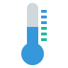

# IoBroker.iqontrol
[](https://weblate.iobroker.net/engage/adapters/?utm_source=widget)

**测试：**

| Linux/Mac/Windows: |跨浏览器检查： |
| --- | --- |

\ **如果您喜欢，请考虑捐赠：**

[](https://www.paypal.com/cgi-bin/webscr?cmd=_s-xclick&hosted_button_id=LDHZMNPXKRX2N&source=url)

****

## IoBroker 的 iqontrol 适配器
用于可视化的快速 Web 应用程序。


\


\


\


\


\


\


\


在任何浏览器中运行。
易于设置，尽管它是完全可定制的且响应迅速。

> **此适配器使用 Sentry 库自动向开发人员报告异常和代码错误。** 有关更多详细信息以及如何禁用错误报告的信息，请参阅 [Sentry-插件文档](https://github.com/ioBroker/plugin-sentry#plugin-sentry)!从 js-controller 3.0 开始使用哨兵报告。

## 视频教程（德语）：
[](https://youtube.com/playlist?list=PL8epyNz8pGEv6-R8dnfXm-m5aBlZFKOBG)

## 添加到主屏幕
您可以在主屏幕上将其另存为 Web 应用程序，它的外观和感觉就像本机应用程序：

＃＃ 你需要...
* Nodejs 10 或更高版本
* Web 适配器，其中一个实例运行与管理适配器相同的协议（http 或 https），socket.IO 设置为“集成”并禁用“强制 Web 套接字”
    * 如果这与其他适配器冲突，只需添加具有上述设置的另一个实例 - iQontrol 将搜索最合适的网络适配器实例并将其用于通信
* 要通过 *iobroker.pro-Cloud* 进行连接，admin- 和 web-adapter 应设置为 http（而不是 https）

* 如果您遇到任何问题，请查看本自述文件末尾的 [疑难解答](#troubleshooting) 部分

## 论坛
访问 [iobroker论坛](https://forum.iobroker.net/topic/22039/neuer-adapter-visualisierung-iqontrol)。

＃＃ 如何使用
**不要害怕您拥有的众多选择。** 大多数东西都是开箱即用的。您*可以*，但您不必使用 iQontrol 提供的所有配置可能性！就这样开始吧：

* 开始创建视图。

您可以将视图视为类似于页面的东西。

* 然后在这些视图上创建设备。

设备有一个角色，它决定了设备的功能，使用了哪些图标等等。
根据该角色，您可以将多个状态链接到设备。这些将为设备提供其功能。
如果您选择“链接到其他视图”作为角色，您可以创建到其他视图的链接。我建议皮肤链接到具有相同背景的其他视图，链接视图具有。
您也可以尝试使用 Autocreate-Function 从 iobroker-object-tree 中选择现有设备。 Autocreate 尝试找出角色并匹配尽可能多的状态。

* 之后您可以创建一个工具栏，显示为页脚。

工具栏条目是视图的链接。
第一个工具栏条目将是您的“主视图”，将在开始时加载。

* 为了给所有东西一个花哨的风格，你可以上传你自己的图片。

您可以将图像用作视图或设备的背景图像。
文件夹“/usericons”中的图像可以用作设备的图标。
免费的内置演示壁纸来自 www.pexels.com。

### 使用自动创建
*您会在“视图”-选项卡中找到一个“自动创建视图”-按钮
* 如果您有维护良好的 ioBroker 枚举（如 Room 或 Functions），您可以使用此函数自动构建包含此枚举中列出的设备的视图
* 请记住，由于 ioBroker-univese 中存在大量不同的适配器和设备，因此自动控制功能无法 100% 正确维护所有设备。您可能需要手动重新设置一些设置以获得最佳结果。但是自动创建为您提供了一个很好的起点，可以在几秒钟内构建自己的可视化。

## URL 参数
* 前端通过``http[s]://<url or ip of iobroker>:<port of web adapter>/iqontrol/index.html``调用
    * ``<网络适配器的端口>`` 通常是 8082
* 要打开指定的实例，您可以添加``namespace=iqontrol.<instance-number>`` 作为 URL 参数
* 要打开指定的视图，您可以添加 ``renderView=<viewID>`` 作为 URL 参数。
    * ``<viewID>`` 需要格式化为 ``iqontrol.<instance-number>.Views.<view-name>``
* 注意：这是区分大小写的！
* 要打开指定的视图作为主页，您可以添加``home=<viewID>`` 作为 URL 参数。这也将更改第一个工具栏条目的链接视图！
    * ``<viewID>`` 需要格式化为 ``iqontrol.<instance-number>.Views.<view-name>``
* 注意：这是区分大小写的！
* 要在加载页面时打开指定的对话框，您可以添加 ``openDialog=<deviceID>`` 作为 URL 参数
    * ``<deviceID>`` 需要格式化为 ``iqontrol.<instance-number>.Views.<view-name>.devices.<device-number>`` where ``<device-number>``从 0 开始（所以视图上的第一个设备是设备号 0）
* 注意：这是区分大小写的！
* 要设置或覆盖时间设置后的返回，请使用以下参数：
* ``returnAfterTimeTreshold=<time in seconds> `` 设置时间，之后调用目标视图。使用 ``0`` 禁用时间后返回功能。
* ``returnAfterTimeDestiationView=<viewID>`` 设置视图，在阈值之后调用。如果未指定，将使用主视图。
* 这些选项很有用，如果您从壁挂式平板电脑调用 iQontrol，使用后应自动返回主页视图
* 要加载没有工具栏的页面，您可以添加``noToolbar=true``
* 要加载没有面板的页面，您可以添加``noPanel=true``
*要加载没有工具栏和面板的页面，禁用滑动，没有加载微调器和透明加载屏幕，您可以添加“isBackgroundView=true”

**例子：**

*``https://192.168.1.1:8082/iqontrol/index.html?namespace=iqontrol.1&home=iqontrol.1.Views.Living-Room``
    * 注意大小写

## 字体
* 您可以将自己的字体文件上传到 Images/Widgets-Tab 文件夹中的 /userfonts
* 在选项选项卡中，您有几个地方可以选择这些字体
* 这取决于您的服务器 MIME 设置，如果字体正确呈现给浏览器 - 对我来说最好的 .ttf 和 .woff（在 raspi 4b 上测试）
    * 这些 mime 设置应该有效：
* .otf: 应用程序/x-font-opentype
* .ttf: application/x-font-ttf 或 application/x-font-truetype
* .woff: 应用程序/font-woff
* .woff2: 应用程序/font-woff2
* .eot：应用程序/vnd.ms-fontobject
* 您可以在 fontsquirrel.com 上的生成器下将字体转换为其他格式
* 请记住 - webfonts 总是有点棘手，并不是每个服务器和每个浏览器的每种字体都可以使用

## 图标和背景图像
*您可以使用内置图像或在图像选项卡或任何您喜欢的免费网址下上传的图像
* 您还可以在 image-url 中使用变量。这可能对例如天气预报很有用。使用这种模式：
    * ``path/to/firstloaded.png|anotherpath/to/{iobrokerstate|fallback}.png``
    * 示例：``./../iqontrol.meta/userimages/demo/bottle.jpg|./../iqontrol.meta/userimages/demo/{javascript.0.myimage|whitestone}.jpg``
* 这会在您打开视图时加载``./../iqontrol.meta/userimages/demo/bottle.jpg``
* 一旦从服务器获取 ``javascript.0.myimage`` 的状态，图像将被替换为 ``./../iqontrol.meta/userimages/demo/XXX.jpg`` 其中 ` `XXX` 是 ``javascript.0.myimage`` 的值
* 如果 ``javascript.0.myimage`` 没有值，将使用后备 ``whitestone`` （使用后备是可选的）

### 进度条
* 可以将 SVG 定义与变量而不是图像文件结合使用来显示进度条
* 集成了一个 vew 模板可供选择，但您也可以创建自己的 SVG


* 更多信息请参见 [Wiki](https://github.com/sbormann/ioBroker.iqontrol/wiki/Progress-Bars)

###图表
* 您可以添加''FLOT Chart-Widget''作为任何设备的BACKGROUND_URL，它会在设备磁贴的背景中自动以图表的形式显示主状态
* 您需要确保状态由 ioBroker 的历史适配器之一记录和记录


## 设备名称
* 就像 image-urls 中的变量一样，您可以在 device-names 中使用变量。语法几乎相同：
    * ``加载时的文本|加载后的文本 {iobrokerstate|fallback}``
* 另外可以将 iobrokerstate 放在方括号中，然后将使用不带单位的普通值：``加载时的文本|加载后的文本 {[iobrokerstate]|fallback}``
    * 示例：``天气正在加载|天气：{javascript.0.weather|未找到天气数据}``
* 当您打开视图时，这会显示“天气正在加载”
* 一旦从服务器获取 ``javascript.0.weather`` 的状态，文本将被替换为 ``Weather: XXX`` 其中 ``XXX`` 是 ``javascript.0 的值.天气``
* 如果 ``javascript.0.weather`` 没有值，则将使用后备 ``No weather data found`` （使用后备是可选的）

## 弹出消息
* 每个实例都会创建状态 ``iqontrol.x.Popup.Message``
* 将值传递到此状态时，将显示弹出消息（或吐司）
* 您可以使用 html-tags 来格式化消息文本
* 有一些额外的状态用于进一步自定义显示的弹出窗口（必须在设置消息数据点之前设置这些状态）：
    * ``Duration``：这是消息显示的时间（以毫秒为单位）；如果设置为 0，则必须确认消息
    * ``ClickedValue`` 和 ``ClickedDestinationState``：如果用户点击了弹出窗口，来自 ``ClickedValue`` 的值将被发送到 ``iqontrol.x.Popup.POPUP_CLICKED`` 并且，如果指定，额外的到“ClickedDestinationState”中的数据点
        * 如果没有指定值，则使用``true``
    * ``ButtonNames``：在这里你可以指定一个逗号分隔的按钮列表，它将显示在弹出窗口的底部（例如“OK,Abort”）
        * ``ButtonValues`` 和 ``ButtonDestinationStates``：这些是将被发送到 ``iqontrol.x.Popup.BUTTON_CLICKED`` 的逗号分隔值列表，如果指定，附加到 ``ButtonDestinationStates` 中的数据点`，如果用户点击了相应的按钮
* 您可以使用命令 ``COMMAND:renderView`` 和 ``COMMAND:openDialog`` 作为 ButtonDestinationState 来渲染视图或打开对话框，而不是数据点
* ButtonValue 然后指定视图 resp。对话框并且需要采用``iqontrol.<instance-number>.Views.<view-name>`` 格式。 ``iqontrol.<instance-number>.Views.<view-name>.devices.<device-number>`` 其中``<device-number>`` 从 0 开始（因此视图上的第一个设备是 device数字 0)
* 如果你只使用一个值（而不是逗号分隔的列表），这个值将用于所有按钮
* 如果您将 ButtonValues 留空，将使用按钮的名称
* 如果你只使用一个目标状态（而不是逗号分隔的列表），这个状态将用于所有按钮
        * ``ButtonClose``：这是一个以逗号分隔的布尔值列表（``true``/``false``），指定是否应关闭弹出窗口，当按下相应的按钮时
* 或者，您可以通过 sendTo 命令使用参数``PopupMessage``、``PopupDuration``、``PopupClickedValue`` 等来设置这些值
    * 示例：``sendTo("iqontrol", "send", {PopupMessage: 'This is my message', PopupDuration: 2500, PopupClickedValue: 'messageConfirmed'});``
* 您也可以使用blockly 向iQontrol 发送消息


##小部件
* 每个 tile 都有一个 BACKGROUND_URL 和一个 BACKGROUND_HTML 数据点
* 在这里你可以定义一个链接（通过BACKGROUND_URL）到一个网站或放置直接的HTML代码（通过BACKGROUND_HTML），这将显示为磁贴的背景
* 这使您可以在磁贴内放置（交互式）内容（如时钟、FLOT 图表、表格、天气预报等）
* 默认情况下，鼠标事件将定向到此内容（因此您不能再单击磁贴本身），但您可以使用选项“将鼠标事件定向到磁贴而不是BACKGROUND_VIEW/URL/HTML 的内容”来禁用此功能”
* iQontrol 提供了一个设备角色“小工具”，它有一些预定义的选项集，主要用于将网站显示为小工具。但是您可以通过正确修改设备选项来获得与任何其他角色相同的结果。


<details><summary>小部件开发（仅限专家）：（<ins>点击打开</ins>)</summary>

### PostMessage-通信
* 从技术上讲，BACKGROUND_VIEW/URL/HTML 的内容被放置在称为 iframe 的 HTML 元素中，这是一个网站中的网站
* 通过启用选项“Allow postMessage-Communication for Background_VIEW/URL/HTML”，您可以启用此 iframe 内的网站和 iQontrol 本身之间的 postMessage-Communication
* 要向 iQontrol 发送命令，您可以使用以下 javascript 命令：``window.parent.postMessage(message, "*");``
    * ``message`` 是一个格式为``{ command: command, stateId: stateId, value: value }`` 的javascript对象
    * 支持以下消息命令：
        * ``{ command: "setWidgetState", stateId: <widgetStateId>, value: <value> }``
* 这会将 ioBroker 状态 ``iqontrol.<instance>.Widgets.<widgetStateId>`` 设置为值 ``<value>`` （``<value>`` 可以是字符串、数字或布尔值或对象像``{ val: <value>, ack: true|false }``)
        * ``{ command: "getWidgetState", stateId: <widgetStateId> }``
* 这将导致 iQontrol 发送 ioBroker 状态的值``iqontrol.<instance>.Widgets.<widgetStateId>``（见下文如何接收应答消息）
        * ``{ 命令：“getWidgetStateSubscribed”，stateId：<widgetStateId> }``
* 这将导致 iQontrol 现在和每次其值更改时发送 ioBroker 状态 ``iqontrol.<instance>.Widgets.<widgetStateId>`` 的值（参见下文如何接收应答消息）
        * ``{ command: "setWidgetDeviceState", stateId: <widgetDeviceState>, value: <value> }``
* 这会将分配给设备 STATE ``<widgetDeviceState>``（例如分配给 LEVEL 的数据点）的 ioBroker 数据点设置为值 ``<value>`` (``<value>` ` 可以是字符串、数字或布尔值或像 ``{ val: <value>, ack: true|false }`` 之类的对象
        * ``{ command: "getWidgetDeviceState", stateId: <widgetDeviceState> }``
* 这将导致 iQontrol 发送 ioBroker 数据点的值，即分配给设备 STATE ``<widgetDeviceState>``（例如，分配给 LEVEL 的数据点；见下文如何接收应答消息）
        * ``{ command: "getWidgetDeviceStateSubscribed", stateId: <widgetDeviceState> }``
* 这将导致 iQontrol 发送 ioBroker 数据点的值，该值分配给设备 STATE ``<widgetDeviceState>``（例如，分配给 LEVEL 的数据点）现在和每次其值更改时（见下文）如何接收应答消息）
        * ``{ command: "setState", stateId: <stateId>, value: <value> }``
* 这会将 ioBroker 状态 ``<stateId>`` 设置为值 ``<value>`` （``<value>`` 可以是字符串、数字或布尔值或类似 ``{ val: < value>, ack: true|false }``)
        * ``{ command: "getState", stateId: <stateId> }``
* 这将导致 iQontrol 发送 ioBroker 状态的值``<stateId>``（见下文如何接收应答消息）
        * ``{ command: "getStateSubscribed", stateId: <stateId> }``
* 这将导致 iQontrol 现在和每次其值更改时发送 ioBroker 状态 ``<stateId>`` 的值（见下文如何接收应答消息）
        * ``{ 命令：“getOptions”}``
* 这将导致 iQontrol 发送用户已配置为对象的用户选项
        * ``{ 命令：“renderView”，值：<viewID> }``
* 这将指示 iQontrol 渲染视图，其中 ``<viewID>`` 需要格式化为 ``iqontrol.<instance-number>.Views.<view-name>`` （区分大小写）
        * ``{ 命令：“openDialog”，值：<deviceID> }``
* 这将指示 iQontrol 打开一个对话框，其中 ``<deviceID>`` 需要格式化为 ``iqontrol.<instance-number>.Views.<view-name>.devices.<device-number>``其中 ``<device-number>`` 从 0 开始（所以视图上的第一个设备是设备号 0）
* 要从 iQontrol 接收消息，您需要使用 javascript 命令 ``window.addEventListener("message", receivePostMessage, false);`` 将事件侦听器注册到“消息”事件
    * 函数 ``receivePostMessage`` 接收对象 ``event``
* ``event.data`` 包含来自 iqontrol 的消息，它将是一个对象，如：
* event.data = ``{ command: "getState", stateId: <stateId>, value: <stateObject> }`` - 这将是 getState-command 或 getStateSubsribed-command 的答案，并为您提供实际的` `<value>``-ioBroker 状态的对象``<stateId>``
* ``<stateObject>`` 本身就是一个像

			````javascript
			event.data.value = {
				val: <value (rounded)>,
				unit: "<unit>",
				valFull: <value (not rounded)>,
				plainText: "<clear text of val, for example taken from valuelist>",
				min: <minimum>,
				max: <maximum>,
				step: <step-width>,
				valuelist: {<object with possible values and corresponding clear text>},
				targetValues: {<target value list>},
				ack: <true|false>,
				readonly: <true|false>,
				custom: {<object with custom settings>},
				id: <id of the iobroker datapoint>,
				from: "<source of state>",
				lc: <timestamp of last change>,
				ts: <timestamp of last actualization>,
				q: <quality of signal>,
				role: "<role of state>",
				type: "<string|number|boolean>"
			}
			````

* 要指示 iQontrol 在 ``iqontrol.<instance>.Widgets`` 下生成小部件状态，您可以在小部件网站的头部部分中使用元标记：
* 语法：``<meta name="widget-datapoint" content="WidgetName.StateName" data-type="string" data-role="text" /> ``
* 您可以使用数据类型（可以设置为字符串、数字或布尔值）、数据角色、数据名称、数据最小值、数据最大值、数据定义和数据单元属性进一步配置数据点
    * 相应的数据点才会被创建，如果widget-website 作为URL 或BACKGROUND_URL 添加到设备
* 相同的概念可用于 URL/HTML-State，用于在设备对话框内显示网站
* 要为您的小部件创建图标，请将与小部件具有相同文件名的 .png 文件放入小部件目录中
* 请参阅下面的示例小部件网站：

<details><summary>显示示例小部件网站以显示为具有 postMessage-communication 的小部件：（<ins>点击打开</ins>)</summary>

* 您可以使用以下 HTML 代码并将其复制到小部件的 Background_HTML-State（然后需要将其配置为“Constant”）
* 作为替代，您可以将此代码作为 html 文件上传到 /userwidgets 子目录并将其引用到 Background_URL-State（然后还需要将其配置为“Constant”）
*激活选项“允许后台_视图/URL/HTML的postMessage-Communication”
* 它将演示如何在网站和 iQontrol 之间进行双向通信

````html
<!doctype html>
<html>
<head>
	<meta http-equiv="Content-Type" content="text/html; charset=UTF-8"/>
	<meta name="widget-datapoint" content="postMessageTest.test" data-type="string" data-role="text" />
	<meta name="widget-description" content="This is a test widget. To get the WidgetDeviceState-Functions working, please set a valid iobroker-datapoint for STATE. (C) by Sebastian Bormann"/>
	<meta name="widget-urlparameters" content="title/postMessageTest/Please enter a title">
	<meta name="widget-options" content="{'noZoomOnHover': 'true', 'hideDeviceName': 'true', 'sizeInactive': 'xwideIfInactive highIfInactive', 'iconNoPointerEventsInactive': 'true', 'hideDeviceNameIfInactive': 'true', 'hideStateIfInactive': 'true', 'sizeActive': 'xwideIfActive highIfActive', 'bigIconActive': 'true', 'iconNoPointerEventsActive': 'true', 'hideDeviceNameIfActive': 'true', 'hideStateIfActive': 'true', 'sizeEnlarged': 'fullWidthIfEnlarged fullHeightIfEnlarged', 'bigIconEnlarged': 'true', 'iconNoPointerEventsEnlarged': 'false', 'noOverlayEnlarged': 'true', 'hideDeviceNameIfEnlarged': 'true', 'hideStateIfEnlarged': 'true', 'popupAllowPostMessage': 'true', 'backgroundURLAllowPostMessage': 'true', 'backgroundURLNoPointerEvents': 'false'}"/>
 	<title>iQontrol postMessageTest</title>
</head>
<body>
	<br><br>
	<h3><span id="title">postMessageTest</span><h3>
	<button onclick="getWidgetState('postMessageTest.test')">getWidgetState postMessageTest.test</button><br>
	<button onclick="getWidgetStateSubscribed('postMessageTest.test')">getWidgetStateSubscribed postMessageTest.test</button><br>
	<button onclick="setWidgetState('postMessageTest.test', 'Hello world')">setWidgetState postMessageTest.test to 'Hello world'</button><br>
  	<br>
	<button onclick="getWidgetDeviceState('STATE')">getWidgetDeviceState STATE</button><br>
	<button onclick="getWidgetDeviceStateSubscribed('STATE')">getWidgetDeviceStateSubscribed STATE</button><br>
	<button onclick="setWidgetDeviceState('STATE', 'Hello world')">setWidgetDeviceState STATE to 'Hello world'</button><br>
  	<br>
	<button onclick="getState('system.adapter.admin.0.cpu')">getState system.adapter.admin.0.cpu</button><br>
	<button onclick="getStateSubscribed('system.adapter.admin.0.uptime')">getStateSubscribed system.adapter.admin.0.uptime</button><br>
	<button onclick="setState('iqontrol.0.Popup.Message', 'Hey, this is a test Message')">setState popup message</button><br>
  	<br>
	<button onclick="renderView('iqontrol.0.Views.Home')">renderView 'Home'</button><br>
	<button onclick="openDialog('iqontrol.0.Views.Home.devices.0')">openDialog 1st device on 'Home'</button><br>
	<br><hr>
	message sent: <span id="messageSent">-</span><br>
	<br><hr>
	message received: <span id="messageReceived">-</span><br>
	<br><hr>
	this means: <span id="thisMeans">-</span><br>
	<br><hr>
    <script type="text/javascript">
		var countSend = 0;
		var countReceived = 0;

		//Set title from UrlParameter
		document.getElementById('title').innerHTML = getUrlParameter('title') || "No Title set";

		//getWidgetState
		function getWidgetState(stateId){
			sendPostMessage("getWidgetState", stateId);
		}

		//getWidgetStateSubscribed (this means, everytime the state changes, an update will be received)
		function getWidgetStateSubscribed(stateId){
			sendPostMessage("getWidgetStateSubscribed", stateId);
		}

		//setWidgetState
		function setWidgetState(stateId, value){
			sendPostMessage("setWidgetState", stateId, value);
		}


		//getWidgetDeviceState
		function getWidgetDeviceState(stateId){
			sendPostMessage("getWidgetDeviceState", stateId);
		}

		//getWidgetDeviceStateSubscribed (this means, everytime the state changes, an update will be received)
		function getWidgetDeviceStateSubscribed(stateId){
			sendPostMessage("getWidgetDeviceStateSubscribed", stateId);
		}

		//setWidgetDeviceState
		function setWidgetDeviceState(stateId, value){
			sendPostMessage("setWidgetDeviceState", stateId, value);
		}


		//getState
		function getState(stateId){
			sendPostMessage("getState", stateId);
		}

		//getStateSubscribed (this means, everytime the state changes, an update will be received)
		function getStateSubscribed(stateId){
			sendPostMessage("getStateSubscribed", stateId);
		}

		//setState
		function setState(stateId, value){
			sendPostMessage("setState", stateId, value);
		}


		//renderView
		function renderView(viewId){
			sendPostMessage("renderView", null, viewId);
		}

		//openDialog
		function openDialog(deviceId){
			sendPostMessage("openDialog", null, deviceId);
		}

		// +++++ Default Functions +++++
		//getUrlParameter
		function getUrlParameter(name) {
			name = name.replace(/[\[]/, '\\[').replace(/[\]]/, '\\]');
			var regex = new RegExp('[\\?&]' + name + '=([^&#]*)');
			var results = regex.exec(location.search);
			return results === null ? null : decodeURIComponent(results[1].replace(/\+/g, ' '));
		};

		//send postMessages
		function sendPostMessage(command, stateId, value){
			countSend++;
			message = { command: command, stateId: stateId, value: value };
			document.getElementById('messageSent').innerHTML = countSend + " - " + JSON.stringify(message);
			window.parent.postMessage(message, "*");
		}

		//receive postMessages
		window.addEventListener("message", receivePostMessage, false);
		function receivePostMessage(event) { //event = {data: message data, origin: url of origin, source: id of sending element}
			countReceived++;
			if(event.data) document.getElementById('messageReceived').innerHTML = countReceived + " - " + JSON.stringify(event.data);
			if(event.data && event.data.command) switch(event.data.command){
				case "getState":
				if(event.data.stateId && event.data.value && event.data.value.val){
					document.getElementById('thisMeans').innerHTML = "Got State " + event.data.stateId + " with value " + event.data.value.val;
				}
				break;
			}
		}
	</script>
</body>
</html>
````

</详情>

###小部件的进一步配置
* 还有额外的元标记，您可以在小部件网站的头部部分中使用来配置小部件的行为：
* '小部件描述'
* 语法：`` <meta name="widget-description" content="Please see www.mywebsite.com for further informations. (C) by me"/> ``
*将窗口小部件作为URL或Background_URL或AutoCreate窗口小部件将窗口小部件介绍时，将显示内容
* 'widget-urlparameters'
* 语法：`` <meta name="widget-urlparameters" content="parameter/default value/description/type;parameter2/default value2/description2/type2"/> ``
* 将小部件选择为 URL 或背景_URL 或自动创建小部件时，将要求用户提供这些参数
* ``type`` 是可选的，可能是 ``text`` （这是 dafault）、``number``、``checkbox``、``color``、``select``、``multipleSelect` `、`combobox`、`historyInstance`、`datapoint`、`icon` 或`section`
* 如果 type 是 ``select``, ``multipleSelect`` 或 ``combobox`` 那么你需要通过添加 ``/<selectOptions>`` 来指定可能的选项，其中 ``<selectOptions>`` 是一个``<value1>,<caption1>/<value2>,<caption2>/...`` 格式的字符串（组合框是一个可以输入自由文本的选择框）
* 如果 type 是 ``number`` 则可以通过添加``/<numberOptions>`` 来指定最小、最大和步长，其中 ``<numberOptions>`` 是格式为 ``<min> 的字符串， <最大>,<步数>``
* 所有这些参数都将通过 url-parameter-string（如 ``widget.html?parameter=value&parameter2=value2``）提供给小部件网站
* 您可以通过使用如下函数请求 url-parameters 来在您的小部件网站中使用这些设置：

			````javascript
			function getUrlParameter(name) {
				name = name.replace(/[\[]/, '\\[').replace(/[\]]/, '\\]');
				var regex = new RegExp('[\\?&]' + name + '=([^&#]*)');
				var results = regex.exec(location.search);
				return results === null ? null : decodeURIComponent(results[1].replace(/\+/g, ' '));
			};
			````

* 如果您使用类型 ``icon`` 作为您的 url 参数，那么您将获得相对于 iqontrol 目录的路径或图像的绝对路径。要创建指向图像的有效链接，您可以使用以下代码：

			    ````javascript
				var iconOn = getUrlParameter('iconOn') || './images/icons/switch_on.png';
				if(iconOn.indexOf('http') != 0) iconOn = '/iqontrol/' + iconOn;
				````

* '小部件选项'
* 语法：``<meta name="widget-options" content="{'noZoomOnHover': 'true', 'hideDeviceName': 'true'}"/> ``
* 有关此元标记可以配置的可能选项，请参阅下面的可扩展部分

<details><summary>显示可以由元标记“widget-options”配置的可能选项：（<ins>点击打开</ins>)</summary>

* 图标：
* ``icon_on``（图标开启）：
* 默认： ””
* ``icon_off``（图标关闭）：
* 默认： ””
* 设备特定选项：
* ``showState``（显示状态）-仅对角色按钮和程序有效：
* 可能的值：“真”|“假”
* 默认值：“假”
* ``buttonCaption``（按钮标题） - 仅对角色按钮有效：
* 默认： ””
* ``returnToOffSetValueAfter``（[ms] 后返回到 'OFF_SET_VALUE'） - 仅对角色 Button 有效：
* 可能的值：从 10 到 60000 的数字
* 默认： ””
* ``alwaysSendTrue``（始终发送“true”（不切换））-仅对角色场景有效：
* 可能的值：“真”|“假”
* 默认值：“假”
* ``closeDialogAfterExecution``（执行后关闭对话框）-仅对角色按钮、程序和场景有效：
* 可能的值：“真”|“假”
* 默认值：“假”
* ``invertCt``（反转 CT（使用 Kelvin 而不是 Mired）） - 仅对角色 Light 有效：
* 可能的值：“真”|“假”
* 默认值：“假”
* ``alternativeColorspace``（ALTERNATIVE_COLORSPACE_VALUE 的颜色空间） - 仅对角色 Light 有效：
* 可能的值：""|"RGB"|"#RGB"|"RGBW"|"#RGBW"|"RGBWWCW"|"#RGBWWCW"|"RGBCWWW"|"#RGBCWWW"|"RGB_HUEONLY"|"#RGB_HUEONLY "|"HUE_MILIGHT"|"HHSSBB_TUYA"
* 默认： ””
* ``linkOverlayActiveColorToHue``（使用灯的颜色作为 OVERLAY_ACTIVE_COLOR） - 仅对角色 Light 有效：
* 可能的值：“真”|“假”
* 默认值：“假”
* ``linkGlowActiveColorToHue``（使用灯的颜色作为 GLOW_ACTIVE_COLOR） - 仅对角色 Light 有效：
* 可能的值：“真”|“假”
* 默认值：“假”
* ``controlModeDisabledValue``（“禁用”的 CONTROL_MODE 值） - 仅对角色恒温器有效：
* 默认： ””
* ``stateClosedValue``（“关闭”的状态值）-仅对角色窗口有效：
* 默认： ””
* ``stateOpenedValue``（'opened'的状态值）-仅对角色窗口有效：
* 默认： ””
* ``stateTiltedValue``（'倾斜'的状态值）-仅对角色窗口有效：
* 默认： ””
* ``invertActuatorLevel`` (Invert LEVEL (0 = open)) - 只对盲人角色有效：
* 可能的值：“真”|“假”
* 默认值：“假”
* ``directionOpeningValue``（'opening' 的 DIRECTION 值） - 仅对角色窗口有效：
* 默认值：“1”
* ``directionOpeningValue``（'opening' 的 DIRECTION 值） - 仅对角色窗口有效：
* 默认值：“2”
* ``directionUncertainValue``（“不确定”的方向值） - 仅对角色窗口有效：
* 默认值：“3”
* ``favoritePositionCaption``（FAVORITE_POSITION的标题）-仅对角色窗口有效：
* 默认值：“最喜欢的位置”
* ``stopCaption``（停止标题） - 仅对角色窗口有效：
* 默认值：“停止”
* ``downCaption`` (Caption for DOWN) - 只对角色窗口有效：
* 默认值：“向下”
* ``controlModeDisarmedValue``（“解除武装”的 CONTROL_MODE 值） - 仅对角色警报有效：
* 默认值：“0”
* ``showStateAndLevelSeparatelyInTile``（在 tile 中分别显示 STATE 和 LEVEL） - 仅对角色值有效：
* 可能的值：""|"devidedByComma"|"devidedByComma preceedCaptions"|"devidedBySemicolon"|"devidedBySemicolon preceedCaptions"|"devidedByHyphen"|"devidedByHyphen preceedCaptions"
* 默认： ””
* ``timeCaption``（时间标题）-仅对角色 DateAndTime 有效：
* 默认： ””
* ``timeFormat``（时间格式（存储在数据点中，请参阅自述文件））-仅对角色 DateAndTime 有效：
* 默认值：“x”
* ``timeDisplayFormat``（时间的显示格式（应该如何显示，请参阅自述文件））-仅对角色 DateAndTime 有效：
* 默认值：“dddd，DD.MM.YYYY HH:mm:ss”
* ``timeDisplayDontShowDistance``（显示距离） - 仅对角色 DateAndTime 有效：
* 可能的值：""|"false"|"true"
* 默认值：“”（这意味着，使用自定义数据点设置）
* ``dateAndTimeTileActiveConditions``（当所有选定的项目都为真时平铺处于活动状态）-仅对角色 DateAndTime 有效：
* 可能的值（数组）：“activeIfStateActive”、“activeIfTimeNotZero”、“activeIfTimeInFuture”、“activeIfTimeInPast”
* 默认值：“activeIfStateActive,activeIfTimeInFuture”
* ``dateAndTimeTileActiveWhenRinging``（当 RINGING 处于活动状态时，Tile 始终处于活动状态）-仅对角色 DateAndTime 有效：
* 默认值：真
* ``dateAndTimeShowInState``（以状态显示）-仅对角色 DateAndTime 有效：
* 可能的值（数组）："showStateIfInactive"、"showStateIfActive"、"showSubjectIfActive"、"showSubjectIfInactive"、"showTimeIfInactiveAndInPast"、"showTimeIfInactiveAndInFuture"、"showTimeIfActiveAndInPast"、"showTimeIfActiveAndInFuture"、"showTimeDistanceIfInactive"、"showTimeDistanceIfInactive"、"ShowTimeIfInactiveAndInPast"、 , "showTimeDistanceIfActiveAndInFuture"
* 默认值：“showStateIfInactive，showSubjectIfActive，showTimeDistanceIfActiveAndInFuture”
* ``coverImageReloadDelay``（延迟重新加载封面图像 [ms]） - 仅对角色 Media 有效：
* 可能的值：从 0 到 5000 的数字
* 默认： ””
* ``statePlayValue``（'play' 的 STATE 值） - 仅对角色 Media 有效：
* 默认值：“播放”
* ``statePauseValue``（“暂停”的状态值）-仅对角色媒体有效：
* 默认值：“暂停”
* ``stateStopValue``（'stop' 的 STATE 值） - 仅对角色 Media 有效：
* 默认值：“停止”
* ``hidePlayOverlay``（隐藏播放图标）-仅对角色媒体有效：
* 可能的值：“真”|“假”
* 默认值：“假”
* ``hidePauseAndStopOverlay``（隐藏暂停和停止图标） - 仅对角色 Media 有效：
* 可能的值：“真”|“假”
* 默认值：“假”
* ``repeatOffValue``（“关闭”的 REPEAT 值） - 仅对角色 Media 有效：
* 默认值：“假”
* ``repeatAllValue``（'repeat all' 的 REPEAT 值） - 仅对角色 Media 有效：
* 默认值：“真”
* ``repeatOneValue``（'repeat one' 的 REPEAT 值） - 仅对角色 Media 有效：
* 默认值：“2”
* ``remoteKeepSectionsOpen``（保持部分打开）-仅对角色媒体有效：
* 可能的值：“真”|“假”
* 默认值：“假”
* ``remoteSectionsStartOpened``（从最初打开的这些部分开始） - 仅对角色 Media 有效：
* 可能的值：包含“REMOTE_PAD”、“REMOTE_CONTROL”、“REMOTE_ADDITIONAL_BUTTONS”、“REMOTE_CHANNELS”、“REMOTE_NUMBERS”和/或“REMOTE_COLORS”的数组
* 默认值：“假”
* ``remoteShowDirectionsInsidePad``（在Pad内显示音量和通道+/-）-仅对角色媒体有效：
* 可能的值：“真”|“假”
* 默认值：“假”
* ``remoteChannelsCaption``（“频道”部分的标题）-仅对角色媒体有效：
* 默认： ””
* ``remoteAdditionalButtonsCaption``（“附加按钮”部分的标题）-仅对角色媒体有效：
* 默认： ””
* ``noVirtualState``（不要为 STATE 使用虚拟数据点（隐藏开关，如果 STATE 为空）） - 仅对角色 Widget 有效：
* 可能的值：“真”|“假”
* 默认值：“假”
* 一般的：
* ``stateCaption``（状态标题）：
* 默认： ””
* ``levelCaption``（LEVEL 的标题）：
* 默认： ””
* ``只读``（只读）：
* 可能的值：“真”|“假”
* 默认值：“假”
* ``renderLinkedViewInParentInstance``（在父实例中打开链接视图，如果此视图用作背景视图）：
* 可能的值：“真”|“假”
* 默认值：“假”
* ``renderLinkedViewInParentInstanceClosesPanel``（在父实例中打开链接视图后，关闭面板（如果它是可关闭的））：
* 可能的值：“真”|“假”
* 默认值：“假”
* 瓷砖行为（一般）：
* ``clickOnIconAction``（点击图标操作）：
* 可能的值："toggle"|"openDialog"|"enlarge"|"openLinkToOtherView"|"openURLExternal"|"false"
* 默认值：“切换”
* ``clickOnTileAction``（点击平铺动作）：
* 可能的值："toggle"|"openDialog"|"enlarge"|"openLinkToOtherView"|"openURLExternal"|"false"
* 默认值：“openDialog”
* ``clickOnIconOpensDialog``（点击图标打开对话框（而不是切换））：
* *已弃用* 因为此选项现在包含在 clickOnIconAction 中
* 可能的值：“真”|“假”
* 默认值：“假”
* ``clickOnTileToggles``（点击平铺切换（而不是打开对话框））：
* *已弃用* 因为此选项现在包含在 clickOnTileAction 中
* 可能的值：“真”|“假”
* 默认值：“假”
* ``clickOnTileOpensDialog``（点击磁贴打开对话框）：
* *已弃用* 因为此选项现在包含在 clickOnTileAction 中
* 可能的值：“真”|“假”
* 默认值：“true”（对于大多数设备）
* ``noZoomOnHover``（在悬停时禁用缩放效果）：
* 可能的值：“真”|“假”
* 默认值：“false”（对于大多数设备）
* ``iconNoZoomOnHover``（禁用图标悬停时的缩放效果）：
* 可能的值：“真”|“假”
* 默认值：“假”
* ``hideDeviceName``（隐藏设备名称）：
* 可能的值：“真”|“假”
* 默认值：“真”
* 活动磁贴的条件：
* ``tileActiveStateId``（状态 ID（将使用空 = STATE/LEVEL））：
* 默认： ””
* ``tileActiveCondition``（条件）：
* 可能的值：""|"at"|"af"|"eqt"|"eqf"|"eq"|"ne"|"gt"|"ge"|"lt"|"le"
* 默认： ””
* ``tileActiveConditionValue``（条件值）：
* 默认： ””
* 如果设备处于非活动状态，则平铺行为：
* ``sizeInactive``（磁贴的大小，如果设备处于非活动状态）：
* 可能的值：""|"narrowIfInactive shortIfInactive"|"narrowIfInactive"|"narrowIfInactive highIfInactive"|"narrowIfInactive xhighIfInactive"|"shortIfInactive"|"shortIfInactive wideIfInactive"|"shortIfInactive xwideIfInactive"|"wideIfInactive"|"xwideIfInactive"| "|"xhighIfInactive"|"wideIfInactive highIfInactive"|"xwideIfInactive highIfInactive"|"wideIfInactive xhighIfInactive"|"xwideIfInactive xhighIfInactive"|"fullWidthIfInactive aspect-1-1IfInactive"|"fullWidthIfInactive aspect-4-3IfInactive"|"fullWidthIfInactive" 2IfInactive"|"fullWidthIfInactive aspect-16-9IfInactive"|"fullWidthIfInactive aspect-21-9IfInactive"|"fullWidthIfInactive fullHeightIfInactive"|"
* 默认值：“xwideIfInactive highIfInactive”
* ``stateHeightAdaptsContentInactive``（如果设备处于非活动状态，则根据其内容调整状态的高度（如果需要，这会覆盖图块大小）：
* 可能的值：“真”|“假”
* 默认值：“假”
* ``stateFillsDeviceInactive``（状态的大小填充整个设备（如果设备处于非活动状态，这可能会干扰其他内容）：
* 可能的值：“真”|“假”
* 默认值：“假”
* ``stateBigFontInactive``（如果设备处于非活动状态，则对状态使用大字体）：
* 可能的值：“真”|“假”
* 默认值：“假”
* ``bigIconInactive``（显示大图标，如果设备处于非活动状态）：
* 可能的值：“真”|“假”
* 默认值：“假”
* ``iconNoPointerEventsInactive``（忽略图标的鼠标事件，如果设备处于非活动状态）：
* 可能的值：“真”|“假”
* 默认值：“假”
* ``transparentIfInactive``（使背景透明，如果设备处于非活动状态）：
* 可能的值：“真”|“假”
* 默认值：“假”
* ``noOverlayInactive``（如果设备处于非活动状态，则移除图块的叠加层）：
* 可能的值：“真”|“假”
* 默认值：“真”
* ``hideBackgroundURLInactive``（如果设备处于非活动状态，则从 Background_VIEW/URL/HTML 隐藏背景）：
* 可能的值：“真”|“假”
* 默认值：“假”
* ``hideDeviceNameIfInactive``（隐藏设备名称，如果设备处于非活动状态）：
* 可能的值：“真”|“假”
* 默认值：“假”
* ``hideInfoAIfInactive``（隐藏 INFO_A，如果设备处于非活动状态）：
* 可能的值：“真”|“假”
* 默认值：“假”
* ``hideInfoBIfInactive``（隐藏 INFO_B，如果设备处于非活动状态）：
* 可能的值：“真”|“假”
* 默认值：“假”
* ``hideStateIfInactive``（隐藏状态，如果设备处于非活动状态）：
* 可能的值：“真”|“假”
* 默认值：“假”
* ``hideDeviceIfInactive``（隐藏设备，如果它处于非活动状态）：
* 可能的值：“真”|“假”
* 默认值：“假” * ``
* 如果设备处于活动状态，则平铺行为：
* ``sizeActive``（磁贴的大小，如果设备处于活动状态）：
* 可能的值：""|"narrowIfActive shortIfActive"|"narrowIfActive"|"narrowIfActive highIfActive"|"narrowIfActive xhighIfActive"|"shortIfActive"|"shortIfActive wideIfActive"|"shortIfActive xwideIfActive"|"wideIfActive"|"xwideIfActive"|"highIfActive "|"xhighIfActive"|"wideIfActive highIfActive"|"xwideIfActive highIfActive"|"wideIfActive xhighIfActive"|"xwideIfActive xhighIfActive"|"fullWidthIfActive aspect-1-1IfActive"|"fullWidthIfActive aspect-4-3IfActive"|"fullWidthIfActive aspect-3- 2IfActive"|"fullWidthIfActive aspect-16-9IfActive"|"fullWidthIfActive aspect-21-9IfActive"|"fullWidthIfActive fullHeightIfActive"|"
* ``stateHeightAdaptsContentActive``（如果设备处于非活动状态，则根据其内容调整状态的高度（如果需要，这会覆盖图块大小）：
* 可能的值：“真”|“假”
* 默认值：“假”
* ``stateFillsDeviceActive``（状态的大小填充整个设备（如果设备处于非活动状态，这可能会干扰其他内容）：
* 可能的值：“真”|“假”
* 默认值：“假”
* ``stateBigFontActive``（如果设备处于活动状态，则对状态使用大字体）：
* 可能的值：“真”|“假”
* 默认值：“假”
* ``bigIconActive``（显示大图标，如果设备处于活动状态）：
* 可能的值：“真”|“假”
* 默认值：“假”
* ``iconNoPointerEventsActive``（忽略图标的鼠标事件，如果设备处于活动状态）：
* 可能的值：“真”|“假”
* 默认值：“假”
* ``transparentIfActive``（使背景透明，如果设备处于活动状态）：
* 可能的值：“真”|“假”
* 默认值：“假”
* ``noOverlayActive``（如果设备处于活动状态，则移除图块的叠加层）：
* 可能的值：“真”|“假”
* 默认值：“真”
* ``hideBackgroundURLActive``（如果设备处于活动状态，则从 Background_VIEW/URL/HTML 隐藏背景）：
* 可能的值：“真”|“假”
* 默认值：“假”
* ``hideDeviceNameIfActive``（隐藏设备名称，如果设备处于活动状态）：
* 可能的值：“真”|“假”
* 默认值：“假”
* ``hideInfoAIfActive``（隐藏 INFO_A，如果设备处于活动状态）：
* 可能的值：“真”|“假”
* 默认值：“假”
* ``hideInfoBIfActive``（隐藏 INFO_B，如果设备处于活动状态）：
* 可能的值：“真”|“假”
* 默认值：“假”
* ``hideStateIfActive``（隐藏状态，如果设备处于活动状态）：
* 可能的值：“真”|“假”
* 默认值：“假”
* ``hideDeviceIfActive``（隐藏设备，如果它是活动的）：
* 可能的值：“真”|“假”
* 默认值：“假”
* 如果设备放大，则平铺行为：
* ``sizeEnlarged``（图块的大小，如果设备被放大）：
* 可能的值：""|"narrowIfEnlarged shortIfEnlarged"|"narrowIfEnlarged"|"narrowIfEnlarged highIfEnlarged"|"narrowIfEnlarged xhighIfEnlarged"|"shortIfEnlarged"|"shortIfEnlarged wideIfEnlarged"|"shortIfEnlarged xwideIfEnlarged"|"widedIfEnlarged"|"widedIfEnlargedIf "|"xhighIfEnlarged"|"wideIfEnlarged highIfEnlarged"|"xwideIfEnlarged highIfEnlarged"|"wideIfEnlarged xhighIfEnlarged"|"xwideIfEnlarged xhighIfEnlarged"|"fullWidthIfEnlarged aspect-1-1IfEnlarged"|"fullWidthIfEnlarged aspect-4"3largeIfEnlarged aspect-4-3larged 2IfEnlarged"|"fullWidthIfEnlarged aspect-16-9IfEnlarged"|"fullWidthIfEnlarged aspect-21-9IfEnlarged"|"fullWidthIfEnlarged fullHeightIfEnlarged"|"
* ``stateHeightAdaptsContentEnlarged``（如果设备处于非活动状态，则根据其内容调整状态的高度（如果需要，这会覆盖图块大小）：
* 可能的值：“真”|“假”
* 默认值：“假”
* ``stateFillsDeviceInactiveEnlarged``（状态的大小填充整个设备（这可能会干扰其他内容），如果设备处于非活动状态）：
* 可能的值：“真”|“假”
* 默认值：“假”
* ``stateBigFontEnlarged``（如果设备被放大，则对状态使用大字体）：
* 可能的值：“真”|“假”
* 默认值：“假”
* ``bigIconEnlarged``（显示大图标，如果设备被放大）：
* 可能的值：“真”|“假”
* 默认值：“真”
* ``iconNoPointerEventsEnlarged``（忽略图标的鼠标事件，如果设备被放大）：
* 可能的值：“真”|“假”
* 默认值：“假”
* ``transparentIfEnlarged``（使背景透明，如果设备被放大）：
* 可能的值：“真”|“假”
* 默认值：“假”
* ``noOverlayEnlarged``（如果设备被放大，则移除图块的叠加层）：
* 可能的值：“真”|“假”
* 默认值：“假”
* ``tileEnlargeStartEnlarged``（瓷砖在开始时被放大）：
* 可能的值：“真”|“假”
* 默认值：“假”
* ``tileEnlargeShowButtonInactive``（显示放大按钮，如果设备处于非活动状态）：
* 可能的值：“真”|“假”
* 默认值：“真”
* ``tileEnlargeShowButtonActive``（显示放大按钮，如果设备处于活动状态）：
* 可能的值：“真”|“假”
* 默认值：“真”
* ``tileEnlargeShowInPressureMenuInactive``（在菜单中显示放大，如果设备处于非活动状态）：
* 可能的值：“真”|“假”
* 默认值：“真”
* ``tileEnlargeShowInPressureMenuActive``（在菜单中显示放大，如果设备处于活动状态）
* 可能的值：“真”|“假”
* 默认值：“真”
* ``visibilityBackgroundURLEnlarged``（背景的可见性来自 Background_VIEW/URL/HTML，如果设备被放大）：
* 可能的值：""|"visibleIfEnlarged"|"hideIfEnlarged"
* 默认： ””
* ``hideDeviceNameIfEnlarged``（隐藏设备名称，如果设备被放大）：
* 可能的值：“真”|“假”
* 默认值：“假”
* ``hideInfoAIfEnlarged``（隐藏 INFO_A，如果设备被放大）：
* 可能的值：“真”|“假”
* 默认值：“假”
* ``hideInfoBIfEnlarged``（隐藏 INFO_B，如果设备被放大）：
* 可能的值：“真”|“假”
* 默认值：“假”
* ``hideStateIfEnlarged``（隐藏状态，如果设备被放大）：
* 可能的值：“真”|“假”
* 默认值：“假”
* ``hideIconEnlarged``（隐藏图标，如果设备被放大）：
* 可能的值：“真”|“假”
* 默认值：“假”
* 时间戳：
* ``addTimestampToState``（向状态添加时间戳）：
* 可能的值：""|"SA"|"ST"|"STA"|"SE"|"SEA"|"SE."|"SE.A"|"Se"|"SeA"|"STE"| "STEA"|"STE."|"STE.A"|"STe"|"STeA"|"T"|"TA"|"TE"|"TEA"|"TE."|"TE.A"| "Te"|"TeA"|"E"|"EA"|"E."|"EA"|"e"|"eA"|"N"
* 默认值：“N”
* ``showTimestamp``（在对话框中显示时间戳）：
* 可能的值：""|"yes"|"no"|"always"|"never"
* 默认： ””
* 电池空图标：
*``batteryActiveCondition``（条件）：
* 可能的值：""|"at"|"af"|"eqt"|"eqf"|"eq"|"ne"|"gt"|"ge"|"lt"|"le"
* 默认： ””
* ``batteryActiveConditionValue``（条件值）：
* 默认： ””
* UNREACH图标：
* ``invertUnreach``（反转UNREACH（使用connected而不是unreach））：
* 可能的值：“真”|“假”
* 默认值：“假”
* ``invertUnreach``（隐藏（忽略）UNREACH，如果设备处于非活动状态）：
* 可能的值：“真”|“假”
* 默认值：“假”
* 错误图标：
* ``invertError``（反转错误（使用 ok 而不是错误））：
* 可能的值：“真”|“假”
* 默认值：“假”
* 背景视图/URL/HTML：
* ``backgroundURLDynamicIframeZoom``（BACKGROUND_VIEW/URL/HTML 的动态缩放（这是所需的以 % 为单位的缩放级别，让内容适合单个 1x1 磁贴））：
* 可能的值：从 0.01 到 200 的数字
* 默认： ””
* ``backgroundURLPadding``（对 Background_VIEW/URL/HTML 应用填充）：
* 可能的值：从 0 到 50 [像素] 的数字
* 默认： ””
* ``backgroundURLAllowPostMessage``（允许用于背景视图/URL/HTML 的 postMessage 通信）：
* 可能的值：“真”|“假”
* 默认值：“假”
* ``backgroundURLNoPointerEvents``（将鼠标事件指向磁贴而不是指向 Background_VIEW/URL/HTML 的内容）：
* 可能的值：“真”|“假”
* 默认值：“假”
* ``overlayAboveBackgroundURL``（背景视图/URL/HTML 上方的位置叠加）：
* 可能的值：“真”|“假”
* 默认值：“假”
* 徽章：
* ``badgeWithoutUnit``（显示没有单位的徽章值）：
* 可能的值：“真”|“假”
* 默认值：“假”
* 发光：
* ``invertGlowHide``（反转 GLOW_HIDE）：
* 可能的值：“真”|“假”
* 默认值：“假”
* 网址/HTML：
* ``popupWidth``（URL/HTML-Box 的宽度 [px]）：
* 默认： ””
* ``popupHeight``（URL/HTML-Box 的高度 [px]）：
* 默认： ””
* ``popupFixed``（固定（不可调整大小））：
* 可能的值：“真”|“假”
* 默认值：“假”
* ``openURLExternal``（在新窗口中打开 URL（而不是在对话框中显示为框））：
* 可能的值：“真”|“假”
* 默认值：“假”
* ``popupAllowPostMessage``（允许 URL/HTML 的 postMessage 通信）：
* 可能的值：“真”|“假”
* 默认值：“假”
* ADDITIONAL_CONTROLS：
* ``additionalControlsSectionType``（ADDITIONAL_CONTROLS 的外观）：
* 可能的值：“无”|“可折叠”|“可折叠打开”
* 默认值：“可折叠”
* ``additionalControlsCaption``（ADDITIONAL_CONTROLS 的标题）：
* 默认值：“附加控件”
* ``additionalControlsHeadingType``（ADDITIONAL_CONTROLS 标题的外观）：
* 可能的值：“无”|“可折叠”|“可折叠打开”
* 默认值：“可折叠”
* 附加信息：
* ``additionalInfoSectionType``（ADDITIONAL_INFO 的外观）：
* 可能的值：“无”|“可折叠”|“可折叠打开”
* 默认值：“可折叠”
* ``additionalInfoCaption``（ADDITIONAL_INFO 的标题）：
* 默认值：“附加信息”

</详情>

<details><summary>显示使用上述设置创建地图的示例小部件网站：（<ins>点击打开</ins>)</summary>

* 您可以将以下 HTML 代码作为 html-file 上传到 /userwidgets 子目录中，并将其引用到 Background_URL-State（然后需要将其配置为“Constant”）
* 添加小部件时会显示说明
* 然后会询问您是否要应用包含的选项
* 创建三个数据点来控制地图的位置：iqontrol.x.Widgets.Map.Posision.latitude、.altitude 和.zoom

````html
<!doctype html>
<html style="width: 100%; height: 100%; margin: 0px;">
<head>
	<meta http-equiv="Content-Type" content="text/html; charset=UTF-8"/>
	<meta name="widget-description" content="This is a map widget, please provide coordinates at iqontrol.x.Widgets.Map.Posision. (C) by Sebastian Bormann"/>
	<meta name="widget-options" content="{'noZoomOnHover': 'true', 'hideDeviceName': 'true', 'sizeInactive': 'xwideIfInactive highIfInactive', 'iconNoPointerEventsInactive': 'true', 'hideDeviceNameIfInactive': 'true', 'hideStateIfInactive': 'true', 'sizeActive': 'fullWidthIfActive fullHeightIfActive', 'bigIconActive': 'true', 'iconNoPointerEventsActive': 'true', 'hideDeviceNameIfActive': 'true', 'hideStateIfActive': 'true', 'sizeEnlarged': 'fullWidthIfEnlarged fullHeightIfEnlarged', 'bigIconEnlarged': 'true', 'iconNoPointerEventsEnlarged': 'false', 'noOverlayEnlarged': 'true', 'hideDeviceNameIfEnlarged': 'true', 'hideStateIfEnlarged': 'true', 'popupAllowPostMessage': 'true', 'backgroundURLAllowPostMessage': 'true', 'backgroundURLNoPointerEvents': 'false'}"/>
	<meta name="widget-datapoint" content="Map.Position.latitude" data-type="number" data-role="value.gps.latitude" />
	<meta name="widget-datapoint" content="Map.Position.longitude" data-type="number" data-role="value.gps.longitude" />
	<meta name="widget-datapoint" content="Map.Position.zoom" data-type="number" data-role="value.zoom" />
	<link rel="stylesheet" href="https://unpkg.com/leaflet@1.7.1/dist/leaflet.css" integrity="sha512-xodZBNTC5n17Xt2atTPuE1HxjVMSvLVW9ocqUKLsCC5CXdbqCmblAshOMAS6/keqq/sMZMZ19scR4PsZChSR7A==" crossorigin=""/>
	<script src="https://unpkg.com/leaflet@1.7.1/dist/leaflet.js" integrity="sha512-XQoYMqMTK8LvdxXYG3nZ448hOEQiglfqkJs1NOQV44cWnUrBc8PkAOcXy20w0vlaXaVUearIOBhiXZ5V3ynxwA==" crossorigin=""></script>
	<title>Simple iQontrol Map Widget</title>
</head>
<body style="width: 100%; height: 100%; margin: 0px;">
	<div id="mapid" style="width: 100%; height: 100%; margin: 0px;"></div>
	<script type="text/javascript">
		//Declarations
		var mapPositionLatitude;
		var mapPositionLongitude;
		var mapPositionZoom;
		var mymap = false;

		//Subscribe to WidgetDatapoints now
		sendPostMessage("getWidgetStateSubscribed", "Map.Position.latitude");
		sendPostMessage("getWidgetStateSubscribed", "Map.Position.longitude");
		sendPostMessage("getWidgetStateSubscribed", "Map.Position.zoom");

		//Initialize map (if all three parameters mapPositionLatitude, mapPositionLongitude and mapPositionZoom were received)
		if(mapPositionLatitude != null && mapPositionLongitude != null && mapPositionZoom != null){
			console.log("Init map: " + mapPositionLatitude + "|" + mapPositionLongitude + "|" + mapPositionZoom);
			mymap = L.map('mapid').setView([mapPositionLatitude, mapPositionLongitude], mapPositionZoom);
			L.tileLayer('https://{s}.tile.openstreetmap.org/{z}/{x}/{y}.png', {
				'attribution':  'Kartendaten &copy; <a href="https://www.openstreetmap.org/copyright">OpenStreetMap</a> Mitwirkende',
				'useCache': true
			}).addTo(mymap);
		};

		//Reposition map
		function repositionMap(){
			console.log("Reposition map: " + mapPositionLatitude + "|" + mapPositionLongitude + "|" + mapPositionZoom);
			if(mymap) mymap.setView([mapPositionLatitude, mapPositionLongitude], mapPositionZoom); else console.log("   Abort, map not initialized yet");
		}

		//send postMessages
		function sendPostMessage(command, stateId, value){
			message = { command: command, stateId: stateId, value: value };
			window.parent.postMessage(message, "*");
		}

		//receive postMessages
		window.addEventListener("message", receivePostMessage, false);
		function receivePostMessage(event){ //event = {data: message data, origin: url of origin, source: id of sending element}
			if(event.data && event.data.command) switch(event.data.command){
				case "getState":
				if(event.data.stateId && event.data.value) switch(event.data.stateId){
					case "Map.Position.latitude":
					console.log("Set latitude to " + event.data.value.val);
					mapPositionLatitude = parseFloat(event.data.value.val) || 0;
					if(mymap) repositionMap();
					break;

					case "Map.Position.longitude":
					console.log("Set longitude to " + event.data.value.val);
					mapPositionLongitude = parseFloat(event.data.value.val) || 0;
					if(mymap) repositionMap();
					break;

					case "Map.Position.zoom":
					console.log("Set zoom to " + event.data.value.val);
					mapPositionZoom = parseFloat(event.data.value.val) || 0;
					if(mymap) repositionMap();
					break;
				}
				break;
			}
		}
	</script>
</body>
</html>
````

</详情>

<details><summary>展示一个更高级的例子：（<ins>点击打开</ins>)</summary>

* 您可以将以下 HTML 代码作为 html-file 上传到 /userwidgets 子目录中，并将其引用到 Background_URL-State（然后需要将其配置为“Constant”）
* 添加小部件时会显示说明
* 询问标题的 url 参数
* 然后会询问您是否要应用包含的选项
* 创建了一堆数据点来控制地图的位置并设置最喜欢的位置

````html
<!doctype html>
<html style="width: 100%; height: 100%; margin: 0px;">
<head>
	<meta http-equiv="Content-Type" content="text/html; charset=UTF-8"/>
	<meta name="widget-description" content="This is a map widget, please provide coordinates at iqontrol.x.Widgets.Map. (C) by Sebastian Bormann"/>
	<meta name="widget-urlparameters" content="title/My Map/Please enter a title for your map">
	<meta name="widget-options" content="{'noZoomOnHover': 'true', 'hideDeviceName': 'true', 'sizeInactive': 'xwideIfInactive highIfInactive', 'iconNoPointerEventsInactive': 'true', 'hideDeviceNameIfInactive': 'true', 'hideStateIfInactive': 'true', 'sizeActive': 'fullWidthIfActive fullHeightIfActive', 'bigIconActive': 'true', 'iconNoPointerEventsActive': 'true', 'hideDeviceNameIfActive': 'true', 'hideStateIfActive': 'true', 'sizeEnlarged': 'fullWidthIfEnlarged fullHeightIfEnlarged', 'bigIconEnlarged': 'true', 'iconNoPointerEventsEnlarged': 'false', 'noOverlayEnlarged': 'true', 'hideDeviceNameIfEnlarged': 'true', 'hideStateIfEnlarged': 'true', 'popupAllowPostMessage': 'true', 'backgroundURLAllowPostMessage': 'true', 'backgroundURLNoPointerEvents': 'false'}"/>

	<meta name="widget-datapoint" content="Map.Position.latitude" data-type="number" data-role="value.gps.latitude" />
	<meta name="widget-datapoint" content="Map.Position.longitude" data-type="number" data-role="value.gps.longitude" />
	<meta name="widget-datapoint" content="Map.Position.zoom" data-type="number" data-role="value.zoom" />

	<meta name="widget-datapoint" content="Map.Favorites.0.Position.latitude" data-type="number" data-role="value.gps.latitude" />
	<meta name="widget-datapoint" content="Map.Favorites.0.Position.longitude" data-type="number" data-role="value.gps.longitude" />
	<meta name="widget-datapoint" content="Map.Favorites.0.name" data-type="string" data-role="text" />
	<meta name="widget-datapoint" content="Map.Favorites.0.icon-url" data-type="string" data-role="url" />

	<meta name="widget-datapoint" content="Map.Favorites.1.Position.latitude" data-type="number" data-role="value.gps.latitude" />
	<meta name="widget-datapoint" content="Map.Favorites.1.Position.longitude" data-type="number" data-role="value.gps.longitude" />
	<meta name="widget-datapoint" content="Map.Favorites.1.name" data-type="string" data-role="text" />
	<meta name="widget-datapoint" content="Map.Favorites.1.icon-url" data-type="string" data-role="url" />

	<meta name="widget-datapoint" content="Map.Favorites.2.Position.latitude" data-type="number" data-role="value.gps.latitude" />
	<meta name="widget-datapoint" content="Map.Favorites.2.Position.longitude" data-type="number" data-role="value.gps.longitude" />
	<meta name="widget-datapoint" content="Map.Favorites.2.name" data-type="string" data-role="text" />
	<meta name="widget-datapoint" content="Map.Favorites.2.icon-url" data-type="string" data-role="url" />

	<meta name="widget-datapoint" content="Map.Favorites.3.Position.latitude" data-type="number" data-role="value.gps.latitude" />
	<meta name="widget-datapoint" content="Map.Favorites.3.Position.longitude" data-type="number" data-role="value.gps.longitude" />
	<meta name="widget-datapoint" content="Map.Favorites.3.name" data-type="string" data-role="text" />
	<meta name="widget-datapoint" content="Map.Favorites.3.icon-url" data-type="string" data-role="url" />

	<meta name="widget-datapoint" content="Map.Favorites.4.Position.latitude" data-type="number" data-role="value.gps.latitude" />
	<meta name="widget-datapoint" content="Map.Favorites.4.Position.longitude" data-type="number" data-role="value.gps.longitude" />
	<meta name="widget-datapoint" content="Map.Favorites.4.name" data-type="string" data-role="text" />
	<meta name="widget-datapoint" content="Map.Favorites.4.icon-url" data-type="string" data-role="url" />

	<meta name="widget-datapoint" content="Map.Favorites.5.Position.latitude" data-type="number" data-role="value.gps.latitude" />
	<meta name="widget-datapoint" content="Map.Favorites.5.Position.longitude" data-type="number" data-role="value.gps.longitude" />
	<meta name="widget-datapoint" content="Map.Favorites.5.name" data-type="string" data-role="text" />
	<meta name="widget-datapoint" content="Map.Favorites.5.icon-url" data-type="string" data-role="url" />

	<meta name="widget-datapoint" content="Map.Favorites.6.Position.latitude" data-type="number" data-role="value.gps.latitude" />
	<meta name="widget-datapoint" content="Map.Favorites.6.Position.longitude" data-type="number" data-role="value.gps.longitude" />
	<meta name="widget-datapoint" content="Map.Favorites.6.name" data-type="string" data-role="text" />
	<meta name="widget-datapoint" content="Map.Favorites.6.icon-url" data-type="string" data-role="url" />

	<meta name="widget-datapoint" content="Map.Favorites.7.Position.latitude" data-type="number" data-role="value.gps.latitude" />
	<meta name="widget-datapoint" content="Map.Favorites.7.Position.longitude" data-type="number" data-role="value.gps.longitude" />
	<meta name="widget-datapoint" content="Map.Favorites.7.name" data-type="string" data-role="text" />
	<meta name="widget-datapoint" content="Map.Favorites.7.icon-url" data-type="string" data-role="url" />

	<meta name="widget-datapoint" content="Map.Favorites.8.Position.latitude" data-type="number" data-role="value.gps.latitude" />
	<meta name="widget-datapoint" content="Map.Favorites.8.Position.longitude" data-type="number" data-role="value.gps.longitude" />
	<meta name="widget-datapoint" content="Map.Favorites.8.name" data-type="string" data-role="text" />
	<meta name="widget-datapoint" content="Map.Favorites.8.icon-url" data-type="string" data-role="url" />

	<meta name="widget-datapoint" content="Map.Favorites.9.Position.latitude" data-type="number" data-role="value.gps.latitude" />
	<meta name="widget-datapoint" content="Map.Favorites.9.Position.longitude" data-type="number" data-role="value.gps.longitude" />
	<meta name="widget-datapoint" content="Map.Favorites.9.name" data-type="string" data-role="text" />
	<meta name="widget-datapoint" content="Map.Favorites.9.icon-url" data-type="string" data-role="url" />
	<link rel="stylesheet" href="https://unpkg.com/leaflet@1.7.1/dist/leaflet.css" integrity="sha512-xodZBNTC5n17Xt2atTPuE1HxjVMSvLVW9ocqUKLsCC5CXdbqCmblAshOMAS6/keqq/sMZMZ19scR4PsZChSR7A==" crossorigin=""/>
	<script src="https://unpkg.com/leaflet@1.7.1/dist/leaflet.js" integrity="sha512-XQoYMqMTK8LvdxXYG3nZ448hOEQiglfqkJs1NOQV44cWnUrBc8PkAOcXy20w0vlaXaVUearIOBhiXZ5V3ynxwA==" crossorigin=""></script>
	<title>iQontrol Map Widget</title>
</head>
<body style="width: 100%; height: 100%; margin: 0px;">
	<div id="mapid" style="width: 100%; height: 100%; margin: 0px;"></div>
	<div id="title" style="position: absolute; top: 3px; right: 15px; z-index: 1000; font-size: smaller; font-family: helvetica; text-shadow: 0px 0px 3px white;"></div>
	<script type="text/javascript">
	//Declarations
	var mapPositionLatitude;
	var mapPositionLongitude;
	var mapPositionZoom;
	var mapFavorites = [];
	var mapMarkers = [];
	var mapMarkerIcons = [];
	var mymap = false;

	//Set title from UrlParameter
	document.getElementById('title').innerHTML = getUrlParameter('title') || "";

	//Subscribe to WidgetDatapoints now
	sendPostMessage("getWidgetStateSubscribed", "Map.Position.latitude");
	sendPostMessage("getWidgetStateSubscribed", "Map.Position.longitude");
	sendPostMessage("getWidgetStateSubscribed", "Map.Position.zoom");
	for(var i=0; i<10; i++){
		mapFavorites[i] = {};
		sendPostMessage("getWidgetStateSubscribed", "Map.Favorites." + i + ".Position.latitude");
		sendPostMessage("getWidgetStateSubscribed", "Map.Favorites." + i + ".Position.longitude");
		sendPostMessage("getWidgetStateSubscribed", "Map.Favorites." + i + ".name");
		sendPostMessage("getWidgetStateSubscribed", "Map.Favorites." + i + ".icon-url");
	}

	//Initialize and Reposition map
	function repositionMap(){
		console.log("Reposition map: " + mapPositionLatitude + "|" + mapPositionLongitude + "|" + mapPositionZoom);
		if(mymap){
			mymap.setView([mapPositionLatitude, mapPositionLongitude], mapPositionZoom);
		} else {
			if(mapPositionLatitude != null && mapPositionLongitude != null && mapPositionZoom != null){
			console.log("Init map: " + mapPositionLatitude + "|" + mapPositionLongitude + "|" + mapPositionZoom);
				mymap = L.map('mapid', {tap: false}).setView([mapPositionLatitude, mapPositionLongitude], mapPositionZoom);
				L.tileLayer('https://{s}.tile.openstreetmap.org/{z}/{x}/{y}.png', {
					'attribution':  'Kartendaten &copy; <a href="https://www.openstreetmap.org/copyright">OpenStreetMap</a>',
					'useCache': true
				}).addTo(mymap);
			}
		}
	}

	//Set Favorites Markers
	function favoritesMarkers(favoritesIndex){
		if(mapMarkers[favoritesIndex]){
			mapMarkers[favoritesIndex].setLatLng([mapFavorites[favoritesIndex].latitude, mapFavorites[favoritesIndex].longitude]);
		} else {
			if(mapFavorites[favoritesIndex].latitude != null && mapFavorites[favoritesIndex].longitude != null && mapFavorites[favoritesIndex].name != null && mapFavorites[favoritesIndex].iconUrl != null){
				if(mapFavorites[favoritesIndex].iconUrl != "") {
					mapMarkers[favoritesIndex] = L.marker([mapFavorites[favoritesIndex].latitude, mapFavorites[favoritesIndex].longitude], {icon: mapMarkerIcons[favoritesIndex]}).addTo(mymap).bindPopup(mapFavorites[favoritesIndex].name);
				} else {
					mapMarkers[favoritesIndex] = L.marker([mapFavorites[favoritesIndex].latitude, mapFavorites[favoritesIndex].longitude]).addTo(mymap).bindPopup(mapFavorites[favoritesIndex].name);
				}
			}
		}
	}

	//Set Favorites Markers Name
	function favoritesMarkersName(favoritesIndex){
		if(mapMarkers[favoritesIndex]) mapMarkers[favoritesIndex].setPopupContent(mapFavorites[favoritesIndex].name); else favoritesMarkers(favoritesIndex);
	}

	 //Set Farovites Markers Icon
	function favoritesMarkersIcon(favoritesIndex){
		if(mapFavorites[favoritesIndex].iconUrl != "") {
			mapMarkerIcons[favoritesIndex] = L.icon({
				iconUrl: mapFavorites[favoritesIndex].iconUrl,
				iconSize:		[32, 32], // size of the icon
				shadowSize:		[32, 32], // size of the shadow
				iconAnchor:		[16, 16], // point of the icon which will correspond to marker's location
				shadowAnchor:	[16, 16], // the same for the shadow
				popupAnchor:	[0, 0]    // point from which the popup should open relative to the iconAnchor
			});
		} else {
			mapMarkerIcons[favoritesIndex] = L.Icon.Default.prototype;
		}
		if(mapMarkers[favoritesIndex]) mapMarkers[favoritesIndex].setIcon(mapMarkerIcons[favoritesIndex]); else favoritesMarkers(favoritesIndex);
	}

	//send postMessages
	function sendPostMessage(command, stateId, value){
		message = { command: command, stateId: stateId, value: value };
		window.parent.postMessage(message, "*");
	}

	//receive postMessages
	window.addEventListener("message", receivePostMessage, false);
	function receivePostMessage(event) { //event = {data: message data, origin: url of origin, source: id of sending element}
		if(event.data && event.data.command) switch(event.data.command){
			case "getState":
				if(event.data.stateId && event.data.value) switch(event.data.stateId){
					case "Map.Position.latitude":
						console.log("Set latitude to " + event.data.value.valFull);
						mapPositionLatitude = parseFloat(event.data.value.valFull) || 0;
						repositionMap();
					break;

					case "Map.Position.longitude":
						console.log("Set longitude to " + event.data.value.valFull);
						mapPositionLongitude = parseFloat(event.data.value.valFull) || 0;
						repositionMap();
					break;

					case "Map.Position.zoom":
						console.log("Set zoom to " + event.data.value.valFull);
						mapPositionZoom = parseFloat(event.data.value.valFull) || 0;
						repositionMap();
					break;

					default:
					if(event.data.stateId.substring(0, 14) == "Map.Favorites."){
						var favoritesIndex = parseInt(event.data.stateId.substring(14,15));
						switch(event.data.stateId.substring(16)){
							case "Position.latitude":
							console.log("Set mapFavorite " + favoritesIndex + " latitude to " + event.data.value.valFull);
							mapFavorites[favoritesIndex].latitude = parseFloat(event.data.value.valFull) || 0;
							favoritesMarkers(favoritesIndex);
							break;

							case "Position.longitude":
							console.log("Set mapFavorite " + favoritesIndex + " longitude to " + event.data.value.valFull);
							mapFavorites[favoritesIndex].longitude = parseFloat(event.data.value.valFull) || 0;
							favoritesMarkers(favoritesIndex);
							break;

							case "name":
							console.log("Set mapFavorite " + favoritesIndex + " name to " + event.data.value.val);
							mapFavorites[favoritesIndex].name = event.data.value.val || null;
							favoritesMarkersName(favoritesIndex);
							break;

							case "icon-url":
							console.log("Set mapFavorite " + favoritesIndex + " iconUrl to " + event.data.value.val);
							mapFavorites[favoritesIndex].iconUrl = event.data.value.val || "";
							favoritesMarkersIcon(favoritesIndex);
							break;
						}
					}
				}
			break;
		}
	}

	//GetUrlParameter
	function getUrlParameter(name) {
		name = name.replace(/[\[]/, '\\[').replace(/[\]]/, '\\]');
		var regex = new RegExp('[\\?&]' + name + '=([^&#]*)');
		var results = regex.exec(location.search);
		return results === null ? null : decodeURIComponent(results[1].replace(/\+/g, ' '));
	};
	</script>
</body>
</html>
````

</详情> </详情>

## 修改数据点配置
您可以通过设备配置对话框或 iobroker 的对象选项卡中数据点后面的扳手图标（或者更确切地说是新 react-ui 中的齿轮图标）来修改数据点的配置。


在这里你可以：

* 设置只读标志
* 设置反转标志
* 设置确认标志（强制用户在将更改写入数据点之前进行确认）
* 设置 PIN 码（强制用户在将更改写入数据点之前输入此 PIN 码 - 但请注意：这只是低安全性，因为在前端检查了 PIN！使用数字显示全屏-pin-pad 如果要求提供代码）
* 修改数据点单位，零、单、复数分开
* 修改数据点的最小值和最大值
* 设置水平滑块增加/减少时采取的步骤
* 修改数据点类型
* 修改数据点的角色
* 设置一个target-value-id，它是一个datapoint id，写入目标值（如果你的实际值和目标值有不同的数据点）
* 设置或修改值列表
    * 可选地向值列表添加一个选项以输入自由文本
* 设置目标值列表：
    * 除了target-value-id之外，还可以为不同的key定义不同的datapoint-id和target-value（key是原始数据点的可能值）
    * 您还可以在键和目标值中使用通配符 ``*``
* 例子：
* 键：``TuneIn-Playlist：*``，目标数据点 ID：``alexa2.0.Echo-Devices.XYZ.Music-Provider.TuneIn-Playlist``，目标值：``*``
* 如果用户输入 ``TuneIn-Playlist: Ambient`` 值 ``Ambient`` 将被写入 ``alexa2.0.Echo-Devices.XYZ.Music-Provider.TuneIn-Playlist``

        

##角色和关联状态的描述
每个设备都有一个角色，它定义了设备的功能。每个角色都会生成一组状态，这些状态可以链接到相应的 iobroker 状态。
如果使用自动创建功能，则可以从 iobroker 对象树中选择现有设备。 Autocreate 尝试找出角色并匹配尽可能多的状态。
这仅适用于已知设备。对于未知设备，并为设备提供高级功能，您可以通过 (+)-按钮手动添加它们或编辑由自动创建创建的设备。
要编辑设备的角色和状态，请单击设备后面的铅笔。您将在下面找到角色和使用状态的简短描述：

### 一般状态：
#### 状态和级别
几乎所有角色都有 **STATE**- 和/或 **LEVEL**- 状态。在大多数情况下，这代表设备的主要功能。您可以为其分配以下类型的 iobroker-states：

* *boolean* - 如果可能，它将被翻译成有意义的文本，如“开/关”、“打开/关闭”或类似内容。如果您单击图块的图标，它会尝试切换布尔值（例如打开或关闭灯）。如果它不是只读的，它将在对话框中生成一个翻转开关
* *number* - 将与其对应的单位一起显示并在对话框中生成一个滑块
* *string* - 要显示的文本
* *value-list* - 将显示选定的值。如果它没有写保护，它将在对话框中生成一个下拉菜单
    * 从技术上讲，*值列表* 是具有相应翻译列表的值，在数据点的“common.custom.iqontrol.<instance>.states”、“native.states”或“common.states”对象中定义：

````
"native": {
    "states": {"true": "Text for true", "false": "Text for false"},
    ...
}
````

    * 您可以通过修改数据点来创建您自己的值列表（新 react-ui 中的扳手图标，或者更确切地说是齿轮图标，位于 iobroker 的对象选项卡中的数据点后面，见上文）
* 在以下情况下，iQontrol 将在对话框中显示已定义的 valueList 作为下拉字段：
* 如果 type 是 'numbers' 并且 valueList 的条目数与数据点的最小值和最大值之间的步长完全相同，或者
* 如果类型是“布尔值”，但角色不是“开关”或
* 如果类型是“字符串”或
* 如果“添加输入自由文本的选项”被激活
* 设备磁贴是否显示为活动或非活动也取决于状态或级别数据点。此外，您可以在“活动磁贴的条件”选项部分中自由自定义行为。您甚至可以设置另一个外部数据点来确定磁贴的状态

但是，并非每种类型对每个角色都有意义。因此，例如，在大多数情况下，开关的状态将是布尔值，以便能够在开和关之间切换。可能会显示一个字符串，但该开关将不起作用。

#### 进一步的一般状态：
* **INFO_A** 和 **INFO_B**: *array* - 数据点和图标的数组，将循环显示在图块的右上角

    

* **ADDITIONAL_CONTROLS**：*array* - 数据点数组，定义将在信息对话框中显示的附加控制元素。您可以在名称和标题中使用变量（使用与普通设备名称相同的语法）
* **ADDITIONAL_INFO**: *array* - 数据点数组，将显示在信息对话框的底部
* **URL**: CONSTANT 或 DATAPOINT *string* - 此 url 将在对话框内作为 iframe 打开
* **HTML**: CONSTANT or DATAPOINT *string* - 如果未指定 URL-Datapoint，此标记将显示在 iframe 内
* **BACKGROUND_URL**: CONSTANT 或 DATAPOINT *string* - 此 URL 将显示为设备图块的背景。它位于背景图像上方，但您可以将其配置为隐藏，如果磁贴处于活动状态或非活动状态。请进一步查看本手册的小部件部分
* **BACKGROUND_HTML**: CONSTANT 或 DATAPOINT *string* - 如果未指定 Background_URL，此标记将显示为设备图块的背景
* **BATTERY**: *boolean* - 当为 true 或 *number* - 当低于 10% 时，会显示一个小电池空图标
    *您可以在选项部分“电池空图标”中进一步自定义电池图标的行为
* **ERROR**: *boolean* - 当为真时，会显示一个小感叹号图标
* **UNREACH**: *boolean* - 当为真时，会显示一个小无线图标
    * 可以在选项的“常规”部分反转行为（使用已连接而不是未到达）
* **ENLARGE_TILE**: *boolean* - 当为真时，图块将被设置为放大。您可以通过单击放大/缩小按钮来覆盖它。但是每次 ENLARGE_TILE 的状态发生变化时，它都会再次接管对瓷砖放大状态的控制。如果ENLARGE_TILE的作用是*button*，那么每次状态改变都会切换放大状态
* **BADGE**：*number* 或 *string* - 如果存在除零/假以外的值，则左上角的徽章将显示为该值
  ***BADGE_COLOR**:* tring* - 任何有效的 html-color-string（如 'green'、'#00FF00'、'rgba(0,255,0,0.5)' 等），代表徽章的颜色.如果不存在或无效的红色，将使用 20% 透明度。

    

* **OVERLAY_INACTIVE_COLOR** 和 **OVERLAY_ACTIVE_COLOR**: *string* - 任何有效的 html-color-string（如 'green'、'#00FF00'、'rgba(0,255,0,0.5)' 等等）表示图块叠加层的颜色（取决于图块是活动还是非活动）。如果没有给出有效的颜色字符串，则使用标准叠加颜色（可以在 iQontrol-Options 中配置）。请记住，iQontrol 选项中有一个选项可以定义叠加层的透明度，这将影响设置的叠加层颜色的外观。
* 对于灯光，您还可以使用“使用灯的颜色作为 OVERLAY_ACTIVE_COLOR”选项，该选项可在设备特定选项中找到。

    

* **GLOW_INACTIVE_COLOR** 和 **GLOW_ACTIVE_COLOR**: *string* - 任何有效的 html-color-string（如 'green'、'#00FF00'、'rgba(0,255,0,0.5)' 等等）代表瓷砖周围发光效果的颜色（取决于瓷砖是活动还是非活动）。如果没有给出有效的颜色字符串，则禁用发光效果。
* **GLOW_HIDE**: *boolean* - 如果为 true，则隐藏发光效果（可以在选项的“常规”部分反转）
* 对于灯，您还可以使用“使用灯的颜色作为 GLOW_ACTIVE_COLOR”选项，该选项可在设备特定选项中找到。

    

### 链接到其他视图：
* 没有进一步的状态
* **linked-view-property** 直接打开

###转变：
* **STATE**: *boolean* - 显示和设置开/关状态
* **POWER**: *number* - 右上角会以小号显示的功耗

###按钮：
* **STATE**: *any* - 任何想要的状态类型
* **SET_VALUE**: CONSTANT *string* - 这是一个常量（不是链接的iobroker-state！），如果按下按钮，它将被分配给状态
* **OFF_SET_VALUE**: CONSTANT *string* - 这是一个常量（不是链接的 iobroker 状态！）。如果定义，STATE 将在选项定义的时间或 100 毫秒后重置为此值

###光：
每盏灯都可能有以下一种或两种状态：

* **STATE**: *boolean* - 显示和设置开/关状态
* **LEVEL**: *number* - 显示和设置灯光的级别

您可以选择定义以下状态：

* 对于彩色 LED（HSB 色彩空间）：
  ***HUE**:* umber* - 0-360° 范围内的灯光颜色（色调格式）
  ***SATURATION**:* umber* - 光的饱和度（从白色到纯色）
  ***COLOR_BRIGHTNESS**:* umber* - 彩色 LED 的亮度（如果您有 LEVEL-State 而没有白色 LED，则忽略此值，因为亮度完全由 LEVEL 控制）
* 对于白光 LED：
  ***CT**:* umber* - 光的色温，如果它有两种白色阴影
  ***WHITE_BRIGHTNESS**:* umber* - 白色 LED 的亮度（如果您有 LEVEL-State 而没有彩色 LED，则忽略此值，因为亮度完全由 LEVEL 控制）
* 替代色彩空间：
  ***ALTERNATIVE_COLORSPACE_VALUE**：*string* 或* umber*（取决于所选颜色空间）- 替代颜色空间的值

    如果您的设备不支持使用 HUE、SATURATION 和 COLOR_BRIGHTNESS（HSB/HSV 色彩空间），您可以使用多种替代色彩空间。在设备选项中，您可以选择以下颜色空间之一：

        * **RGB** / **#RGB**：您可以使用 RGB 格式（十六进制）代替 HUE、SATURATION 和 COLOR_BRIGHTNESS，可选带前导“#”
        * **RGBW** / **#RGBW**：您可以使用 RGBW 格式（十六进制）代替 HUE、SATURATION、COLOR_BRIGHTNESS 和 WHITE_BRIGHTNESS，可选带前导“#”
        * **RGBWWCW** / **#RGBWWCW** / **RGBCWWW** / **#RGBCWWW**：您可以使用 RGBWWCW- 或 RGBCWWW 格式（十六进制）代替 HUE、SATURATION、COLOR_BRIGHTNESS、CT 和 WHITE_BRIGHTNESS , WW = 暖白，CW = 冷白），可选带前导“#”
        * **RGB（仅色调）** / **#RGB（仅色调）**：您可以使用 RGB（仅色调）-格式（十六进制）代替使用色调，可选带前导“#”。在这种特殊情况下，RGB 格式将只接受色调颜色圈的纯饱和颜色。不允许混合白色
    * **Milight 的 Hue** 这是 Milight-Devices (v5) 的 Hue-Value，在色相颜色圈中使用另一个起点：

````
tHue = modulo(66 - (hue / 3.60), 100) * 2.55;
modulo(-3.60 * (MilightHue/2.55 - 66), 360);
on modulo(n, m){ return ((n % m) + m) %m; }
````

        * **HHSSBB for Tuya**：12 位长十六进制字符串，代表色相（HH = 0000-016d [0-365]）、饱和度（SS = 0000-03e8 [0-1000]）和色亮度（BB = 0000-03e8 [0-1000])

请记住：转换到替代色彩空间是由前端完成的，因此只有在某处打开 iQontrol 时它才处于活动状态。因此，您不能将其用作色彩空间的转换器。为了避免对话循环，建议使用原始色彩空间数据点（HUE、SATURATION、COLOR_BRIGHTNESS、CT、WHITE_BRIGHTNESS）*或*替代色彩空间数据点来*替换*这些数据点。

*效果模式：
  ***EFFECT**:* alue-list* - 要播放的效果
* **EFFECT_NEXT**: *boolean* - 如果设置为 true，将播放下一个效果（作为不支持 EFFECT 值列表的设备的替代方案）
* **EFFECT_SPEED_UP** / **EFFECT_SPEED_DOWN**: *boolean* - 如果设置为 true，效果将加速/减速
* 各种各样的：
  ***POWER**:* umber* - 右上角会以小号显示的功耗

###扇子：
* **STATE**: *boolean* - 显示和设置开/关状态
* **LEVEL**: *number* 或 *value-list* - 风扇速度
* **POWER**: *number* - 右上角会以小号显示的功耗

###恒温器：
* **SET_TEMPERATURE**: *number* - 目标温度
* **TEMPERATURE**: *number* - 右上角小数显示的实际温度
* **HUMIDITY**: *number* - 右上角小数显示的实际湿度
* **CONTROL_MODE**: *value-list* - 显示和设置恒温器的模式
* **WINDOW_OPENING_REPORTING**: *boolean* - 如果为 true，则显示一个打开的小窗口
* **VALVE_STATES**：名称和数字数组 - 显示与恒温器关联的阀门的打开情况

### Homematic-恒温器：
除了普通的恒温器，您还可以定义：

* **PARTY_TEMPERATURE**：*string* - 特殊格式的字符串，用于定义家庭恒温器的派对或假期模式
* **BOOST_STATE**: *number* - 显示家用恒温器的剩余升压时间

###温度感应器，湿度传感器，压力传感器：
* **STATE**: *number* - 将显示在设备下部的温度或湿度
* **TEMPERATURE**: *number* - 右上角会以小字显示的温度
* **HUMIDITY**: *number* - 右上角会以小字显示的湿度
* **linked-view-property** 直接打开

###亮度传感器：
* **STATE**: *number* - 将显示在设备下部的亮度
* **BRIGHTNESS**: *number* - 右上角会以小幅显示的亮度
* **linked-view-property** 直接打开

###运动传感器：
* **STATE**: *boolean* - 显示是否检测到运动
* **linked-view-property** 直接打开

###门，窗户：
* **STATE**: *boolean* - 显示门或窗是打开还是关闭
    * 或者，您可以分配一个*值列表*，以显示“倾斜”等其他状态（在窗口选项中，您可以定义哪些文本代表打开、关闭和倾斜以显示正确的图标）
    * 您还可以指定一个 *string* 来显示任何文本，例如“3 个窗口打开”或“全部关闭”或一个 *数字*
* **linked-view-property** 直接打开

###车库门：
* **STATE**: *boolean* - 显示门是打开还是关闭
  *或者，您可以分配一个* alue-list*，以显示其他状态，如“倾斜”
  *您还可以指定一个* tring* 来显示任何文本，例如“3 扇门打开”或“全部关闭”
* **TOGGLE**: *boolean* - 显示“切换”按钮并设置为 true，如果按下

###带锁门：
* **STATE**: *boolean* - 显示门是打开还是关闭（门/窗接触）
* **LOCK_STATE**: *boolean* - 显示和控制门是否被锁定或解锁（控制被禁用，如果 STATE 为真 - 因为你不能锁门，那是打开的）
* **LOCK_STATE_UNCERTAIN**: *boolean* - 如果为 true，则 STATE 将以斜体显示以表示锁的确切位置未知
* **LOCK_OPEN**: *boolean* - 如果设置为 true，门将完全打开

###瞎的：
* **LEVEL**: *number* - 盲人高度百分比
* **DIRECTION**: *value-list* - 可以是停止、向上和向下。可以配置代表 Stop、Up、Down 和 Unknown 的值
* **STOP**: *boolean* - 如果按下停止按钮，则设置为 true。此外，您可以通过 **STOP_SET_VALUE** 数据点定义一个值。如果已定义，则在按下停止按钮时将发送此值而不是 true
* **UP** / **DOWN**：*boolean* - 如果按下向上/向下按钮，则设置为 true（对于使用 UP 和 DOWN 数据点而不是 LEVEL 或除 LEVEL 之外的数据点的设备）。此外，您可以通过 **UP_SET_VALUE** / **DOWN_SET_VALUE** 数据点定义一个值。如果已定义，当按下向上/向下按钮时，将发送此值而不是真值
* **FAVORITE_POSITION**: *boolean* - 可用于调用最喜欢的位置。如果按下“收藏夹”按钮（可以在设备设置中配置按钮标题），则 true 将发送到此数据点。此外，您可以通过 **FAVORITE_POSITION_SET_VALUE** 数据点定义一个值。如果已定义，则在按下收藏夹按钮时将发送此值而不是 true
* **SLATS_LEVEL**: *number* - 板条位置百分比

###火灾传感器：
* **STATE**: *boolean* - 如果为真，传感器将显示为已触发
  *或者，您可以分配一个* alue-list*，以显示其他状态，例如“篡改”
  *您还可以指定一个* tring* 来显示任何文本，例如“楼上的火”
* **linked-view-property** 直接打开

###洪水传感器：
* **STATE**: *boolean* - 如果为真，传感器将显示为已触发
  *或者，您可以分配一个* alue-list*，以显示其他状态，例如“篡改”
  *您还可以指定一个* tring* 来显示任何文本，例如“楼上的洪水”
* **linked-view-property** 直接打开

###警报：
* **STATE**: *boolean* - 如果为真，传感器将显示为已触发
  *或者，您可以分配一个* alue-list*，以显示其他状态，例如“篡改”
  *您还可以指定一个* tring* 来显示任何文本，例如“楼上的火”
* **CONTROL_MODE**: *value-list* - 选择操作模式，如“武装”和“解除武装”
    * 在设备选项中您可以定义代表撤防的值，因此可以显示代表图标

###电池：
* **STATE**：*number* - 电池电量百分比
* **CHARGING**: *boolean* - 如果为真，则显示充电图标
* **POWER**: *number* - 右上角会以小号显示的功耗
* **VOLTAGE**: *number* - 右上角会以小字显示的电压

###日期和时间：
* **STATE**: *boolean* - 如果为真，图块将显示为活动状态
* **SUBJECT**: *string* - 设置描述
* **RINGING**: *boolean* - 如果为真，则显示闹钟
* 请记住：您可以通过 ADDITIONAL_CONTROLS 配置退出和暂停按钮
* **TIME**: *string* - 第一次和第二次带有日期和/或时间或持续时间的字符串（您可以在设备选项中指定格式）

<details><summary>显示可能的时间格式：（<ins>点击打开</ins>)</summary>

* 在任何数据点的自定义部分（新 react-ui 中的扳手图标或齿轮图标）中，您可以配置时间格式和时间显示格式。如果数据点包含时间信息，这两个参数指定时间以何种格式保存在数据点中以及 iQontrols 如何向用户显示时间。
* 对于“日期和时间”-设备，也可以在设备特定部分内的设备选项中进行这两个设置。这些将覆盖在数据点的自定义部分中所做的设置。
* 您可以使用以下令牌：

| | |代币 |示例 |数据点 |显示 |选择器 |
|----------:|-------------------------------:|--------------------|------------------------------------------------------------------------------|-----------|--------------------------------------|-----------------------------|
|时间戳 | Unix 的时间戳 | X | 1410715640.579 | X | --- | --- |
| | Unix 毫秒时间戳 | × | 1410715640579 | X | --- | --- |
|日期 |星期几 | d | 0 1 ... 5 6 | X | --- | --- |
| | |日 |苏沫... 萨神父 | X | X（翻译）| --- |
| | |滴滴|周日 周一 ... 周五 周六 | X | X（翻译）| --- |
| | |滴滴|周日周一...周五周六| X | X（翻译）| --- |
| | |做| 0th 1st ... 5th 6th | X | --- | --- |
| |每月的一天 | D | 1 2 ... 30 31 | X | X | X |
| | | DD | 01 02 ... 30 31 | X | X | X |
| | |做 | 1 日 2 日 ... 30 日 31 日 | X | ---（转换为 D） | ---（转换为 D） |
| |月 |男 | 1 2 ... 11 12 | X | X | X |
| | | MM | 01 02 ... 11 12 | X | X | X |
| | | MMM |一月二月 ... 十一月十二月 | X | X | X |
| | | MMMM |一月 二月 ... 十一月 十二月 | X | X | X |
| | |莫| 1 日 2 日 ... 11 日 12 日 | X | ---（转换为 M） | ---（转换为 M） |
| |年 |是 | 1970 1971 ... 9999 +10000 +10001 | X | X | X |
| | | YY | 70 71 ... 29 30 | X | X | X |
| | | YYYY | 1970 1971 ... 2029 2030 | X | X | X |
| | | YYYYYY | -001970 -001971 ... +001907 +001971 | X | ---（转换为YYYY）| ---（转换为YYYY）|
|时间 |上午/下午 |一个 |上午下午 | X | X | X |
| | | |下午 | X | X | X |
| |小时 | H | 0 1 ... 22 23 | X | X | X |
| | |哈 | 00 01 ... 22 23 | X | X | X |
| | |小时 | 1 2 ... 11 12 | X | X | X |
| | |哈| 01 02 ... 11 12 | X | X | X |
| | | k | 1 2 ... 23 24 | X | ---（转换为H）| ---（转换为H）|
| | | kk | 01 02 ... 23 24 | X | ---（转换为 HH） | ---（转换为 HH） |
| |分钟 |米| 0 1 ... 58 59 | X | X | X |
| | |毫米 | 00 01 ... 58 59 | X | X | X |
| |第二 | | 0 1 ... 58 59 | X | X | X |
| | | ss | 00 01 ... 58 59 | X | X | X |
| |小数秒 | | | 0 1 ... 8 9 | X | --- | --- |
| | | SS | 00 01 ... 98 99 | X | --- | --- |
| | | SSS | 000 001 ... 998 999 | X | --- | --- |
| | | SSSS ... SSSSSSSS | 000[0..] 001[0..] ... 998[0..] 999[0..] | X | --- | --- |
| |时区 | z 或 zz | EST CST ... MST PST | X | --- | --- |
| | | Z | -07:00 -06:00 ... +06:00 +07:00 | X | --- | --- |
| | | ZZ | -0700 -0600 ... +0600 +0700 | X | --- | --- |
|时期 |一年中的一天 |滴滴 | 1 2 ... 364 365 | X | --- | --- |
| | | DDDD | 001 002 ... 364 365 | X | --- | --- |
| | | DDDo |第 1 2 ...... 364 365 | X | --- | --- |
|其他 |星期几（语言环境）|电子 | 0 1 ... 5 6 | X | --- | --- |
| |星期几 (ISO) | E | 1 2 ... 6 7 | X | --- | --- |
| |季度|问 | 1 2 3 4 | X | --- | --- |
| | | Qo | 1 2 3 4 | X | --- | --- |
| |一年中的一周 | | | 1 2 ... 52 53 | X | --- | --- |
| | |我|第 2 次 ... 第 52 次 53 次 | X | --- | --- |
| | | ww | 01 02 ... 52 53 | X | --- | --- |
| |一年中的一周 (ISO) | W | 1 2 ... 52 53 | X | --- | --- |
| | |禾|第 2 次 ... 第 52 次 53 次 | X | --- | --- |
| | | WW | 01 02 ... 52 53 | X | --- | --- |
| |时代年 |是 | 1 2 ... 2020 ... | X | --- | --- |
| | |哟|第 2 届 … 2020 年 … | X | --- | --- |
| |时代 | N, NN, NNN |公元前X | --- | --- |
| | |神经网络 |在基督之前，纪元多米尼 | X | --- | --- |
| | |神经网络 |公元前X | --- | --- |
| |周 年 | GG | 70 71 ... 29 30 | X | --- | --- |
| | |嘎嘎| 1970 1971 ... 2029 2030 | X | --- | --- |
| |周年 (ISO) | GG | 70 71 ... 29 30 | X | --- | --- |
| | | GGGG | 1970 1971 ... 2029 2030 | X | --- | --- |
|时期 |期间 | P |标记一个时期而不是特定时间。可以是以下格式之一： | X | ---（转换为 D [Day(s)], h:m:s） | --- (转换为 D, h:m:s) |
| | | |毫秒（例如 279344）| | | |
| | | |小时：分钟（例如 46:33）| | | |
| | | |时:分:秒（例如 46:33:44 或 28:33:44.5）| | | |
| | | |天时：分.秒（例如 1 22:33:44 或 1 22:33:44.5）| | | |
| | | | days.hours:minutes.seconds (e.g. 1.22:33:44 or 1.22:33:44.5) | | | |
| | | | ISO 8601（例如 P0Y0M1DT22H33M44S 或 P1DT22H33M44S）| | | |
| | |派 |年限| X | --- | --- |
| | |下午 |数月 | X | --- | --- |
| | |密码|周期间 | X | --- | --- |
| | |钯|天数 | X | --- | --- |
| | |博士 |小时数 | X | --- | --- |
| | |下午 |分钟| X | --- | --- |
| | | ps |秒周期 | X | --- | --- |
| | |下午 |毫秒周期 | X | --- | --- |
|旗帜 |将缺失的部分设置为开始 | tb |例如。如果只给出时间，则将日期设置为 1970-01-01 | X | --- | --- |
| |将缺少的部分设置为现在 | tn |例如。将日期设置为现在，如果只给出一个时间 | X | --- | --- |
| |保留旧的缺失部件 |到|例如。如果只给出一个时间，就和以前一样离开日期 | X | --- | --- |
|自由文本 |在括号中标记自由文本 | [] | [这是一个例子，所有标记都被忽略] | X | X | --- |

* 如果datapoint-timeformat 和display-timeformat 使用不同的配置，则使用以下转换规则。
* 您可以使用数据点时间格式中的标志 ``tb``、``tn`` 和 ``to`` 来影响行为。

    

</详情>

###价值：
* **STATE**: *any* - 要显示的任何有效状态（查看一般状态部分）
* **LEVEL**: *number* - 将在对话框中产生一个滑块

###程序：
* **STATE**: *boolean* - 如果设置为 true，程序将启动

###场景：
* **STATE**: *boolean* - 如果场景处于活动状态，则显示。根据场景的配置（虚拟组，设置为 false 启用或禁用的值），切换命令将发送 true、false、min、0、max 或 100。有一个选项可以始终发送 true（禁用切换） .

###媒体播放器/遥控器：
* **STATE**: *string* - "play", "pause" or "stop" or *boolean* - true for play, false for stop
    * 在设备选项中，您可以定义代表播放、暂停和停止的值
* **COVER_URL**: *string* - 封面图片的 url
* **艺术家、专辑、标题**：*字符串* - 自我解释
* **TRACK_NUMBER**：*number* - 自我解释
* **PREV, REWIND, PLAY, PAUSE, STOP, FORWARD, NEXT**: *boolean* - 将被设置为真，如果相应的按钮被按下
* **SHUFFLE, MUTE, PLAY_EVERYWHERE, EJECT, POWER_SWITCH**: *boolean* - 对应函数的状态
* **REPEAT**: *boolean* - 重复功能的状态或 *string* - 3 个状态可以通过相应的选项定义：关闭、重复所有和重复一个的值
* **DURATION, ELAPSED**: *number* - 实际标题的持续时间和经过时间 - 用于显示搜索栏
* **VOLUME**: *number* - 用于音量滑块
* **源，播放列表**：*值列表* - 显示选择菜单以从播放列表中选择源或标题

##### 要显示*通用遥控器*，您可以定义以下状态：
* **REMOTE_NUMBER**: *string* - 显示一个数字键盘并返回相应的数字，如果一个数字被点击
* **REMOTE_VOLUME_UP、REMOTE_VOLUME_UP、REMOTE_CH_UP、REMOTE_CH_DOWN**：*string* - 显示音量增大/减小和频道增大/减小的按钮，并返回“volumeUp”、“volumeDown”、“chUp”或“chDown”，如果相应按钮被按下
* **REMOTE_PAD_DIRECTION、REMOTE_PAD_BACK、REMOTE_PAD_HOME、REMOTE_PAD_MENU**：*string* - 显示用于导航和返回的触控板
    * 'ok' 如果点击垫的中间，
* 'left', 'right', 'up' 或 'down', 如果点击垫的边缘或在相应的方向滑动垫或
* 'back'、'home' 或 'menu*，如果相应的按钮被点击
* 请记住：您可以使用目标值列表（可通过每个数据点的扳手图标或齿轮图标访问）从一个数据点链接到多个数据点，具体取决于返回值（请参阅上面的修改数据点部分）
* **REMOTE_COLOR**: *string* - 显示彩色按钮并返回相应的颜色（“红色”、“绿色”、“黄色”或“蓝色”），如果点击颜色
* **REMOTE_CHANNELS**: *array* - 按钮数组。按钮名称发送到对应的state-id，如果按钮被点击
* **REMOTE_ADDITIONAL_BUTTONS**: *array* - 按钮数组。按钮名称发送到对应的state-id，如果按钮被点击
* **REMOTE_HIDE_REMOTE**: *boolean* - 如果为真，则完整的远程控制部分将被隐藏（例如，如果选择了有效源，则仅显示它）

###弹出：
* **STATE**: *any* - 可用于显示更多信息

###外部链接：
* **STATE**: *any* - 可用于显示更多信息
* **URL**: CONSTANT *string* - 这个 url 将被打开

###小部件：
该设备有一些特殊的预定义大小和显示设置来显示网站，可以通过 **BACKGROUND_URL** 定义为小部件。使用默认选项，右上角会显示一个小的放大按钮。

* **STATE**：*any* - SPECIAL：如果为空，将创建一个虚拟数据点，因此您可以单击图标以激活并因此最大化小部件的大小

###信息文本：
该设备具有一些特殊的预定义大小和显示设置，可以在透明背景上在整个屏幕宽度上显示文本。如果 STATE 为空，则使用标准设置隐藏设备。设备的高度适应状态的大小。

* **STATE**：*any* - 屏幕上显示文本。

****

＃＃ 故障排除
* 确保您已完成本页顶部的“您需要...”部分
* 如果更新后有些东西不像预期的那样工作，请尝试以下步骤：
    * 开始上传适配器：

    \
        

* 清除浏览器缓存
* 重启ioBroker

###如果还有问题，请提供浏览器调试控制台的日志和故障线路截图：
* 使用浏览器打开的调试控制台启动 iQonrol（大多数情况下您需要按<kbd>F12</kbd>才能打开它）
* 切换到控制台窗口并重现错误
* 在控制台窗口中查找消息
* 出现错误时，会列出导致错误的行号
* 请点击此行号并截取故障线路：


****

## Changelog

### 1.9.7 (2021-08-31)
* (sbormann) Added option to close collapsible subheaders, if others open.
* (sbormann) Fixed missing subheaders if new line option was activated.
* (sbormann) Added option to define new section spacing.
* (sbormann) Minor design enhancements to dark mode, ADDITIONAL_INFO and JSON-Table-Widget.
* (sbormann) Added more options to configure cols of JSON-Table-Widget.
* (sbormann) Redesigned CONTROL_MODE of Thermostats to be a fieldset instead of a dropdown.
* (sbormann) Overwrite step for HomematicIP-Temperature sensors with wrong min and max values.
* (sbormann) Added option to send state-values when clicking on play, pause and stop to media.
* (sbormann) Updated dependencies.
* (sbormann) Added sections to widget options.
* (sbormann) Added option to show state and level devided for device type value.

### 1.9.6 (2021-08-21)
* (sbormann) Removed some unnecessary horizontal lines in dialog.
* (sbormann) Added option to edit caption of STATE or LEVEL.
* (sbormann) Enhanced ADDITIONAL_INFO list (you can go back to old style via option) and added optional columns.
* (sbormann) Added some polyfils for older browsers.
* (sbormann) Fixed a bug that prevented certain options from being applied correctly.

### 1.9.5 (2021-08-20)
* (sbormann) Removed prevention of injection for iframes.

### 1.9.4 (2021-08-20)
* (sbormann, sandro_gera) Preventing injection of code into states.
* (sbormann) Sub-Headers can now contain variables.
* (sbormann) Added option to make sub-headers collapsible.
* (sbormann) BACKGROUND_VIEWs are now lightend up in dark-mode.

### 1.9.3 (2021-08-18)
* (sbormann) Fixes for ADDITIONAL_CONTROLS.
* (sbormann) Some minor enhancements for handling of Date and Time.
* (sbormann) Added option to custom to hide period of date and time values.
* (sbormann) Some design adjustments for dark-mode.
* (sbormann) You can now freely configure all colours for dark-mode.
* (sbormann) Added previous and next buttons to views-tab.

### 1.9.2 (2021-08-17)
* (sbormann) Fixed conversion error #199.
* (sbormann) Added option to set ADDITIONAL_CONTROLS to half width.
* (sbormann) Enhanced uploading of font files.
* (sbormann) Added getOptions to postMessage-Communication for widgets.
* (sbormann) Added Dark-Mode to JSON-Table-Widget.

### 1.9.1 (2021-08-15)
* (sbormann) You can now upload own font files.
* (sbormann) Admin tab is now linked to the iqontrol-administration page instead of frontend.
* (sbormann) Fixed mkDir for redis.
* (sbormann) Enhanced enlarge button for large screens.

### 1.9.0 (2021-08-13)
* (sbormann) Added Dark-Mode.
* (sbormann) Added new configuration options for click on tile/icon behaviours - WARNING: Old configuration is automatically converted to the new settings. Its recommendet to create a backup of your config BEFORE doing the update, as the new settings are not backwards-compatible and in case of conversion errors.
* (sbormann) Added option to link color of lamp to OVERLAY_ACTIVE_COLOR.
* (sbormann) Added option to define caption of button for external URLs.

### 1.8.2 (2021-08-06)
* (sbormann) Added JSON-Table Widget (Displays JSON-Data as table).
* (sbormann) Enhanced device copy dialog with option to set new name and to replace datapoints.
* (sbormann) You can now copy devices directly from the device list.
* (sbormann) Entries with empty values in Arrays of INFO_A/B are now hidden.
* (sbormann) Added option to hide UNREACH if device is inactive.
* (sbormann) Fixed missing general options for device link to other view.
* (sbormann) Fixed admin page not working in safari.
* (sbormann) Added option to hide name for buttons in ADDITIONAL_CONTROLS.

### 1.8.1 (2021-07-28)
* (sbormann) Some design-adjustments for react-ui.
* (sbormann) Keep track of ioBroker object changes in admin.
* (sbormann) Fixed crash if active view has no devices.
* (sbormann) Removed old conn.js from admin.
* (Einstein2002, sbormann) Added HomematicIP-Thermostat.
* (sbormann) Enhanced max-height of dialog.
* (sbormann) Fixed up, down and stop button for blinds.
* (sbormann) Changed some log messages.
* (sbormann) Enhanced FLOT-Chart-Widget to set axis options.

### 1.8.0 (2021-04-29)
* (sbormann) Some design-adjustments for react-ui.

### 1.7.3 (2021-04-27)
* (sbormann) Fixed admin-tab for react.

### 1.7.2 (2021-04-27)
* (sbormann) Added compatibility to new react-ui of admin-adapter.
* (sbormann) Fixed uploading of larger files.
* (sbormann) Changed background-images in autocreate views function.
* (sbormann) Internal definition and handling of device options changed.
* (sbormann) The directories /usericons, /usersymbols and /userwidgets are now automatically created, if not existant.
* (sbormann) Some design-adjustments for react-ui.

### 1.7.1 (2021-04-18)
* (sbormann) Fix to work with Admin v5.0.3 (renaming files and folders will only work with the upcoming next admin-update).
* (sbormann) Updated dependencies.
* (sbormann) Added option to show name of INFO_A/B.

### 1.7.0 (2021-04-13)
* (sbormann) Added combobox as possible option type.
* (sbormann) Added Date and Time as new device for dates, times and periods (durations).
* (sbormann) Added time-format and time-display-format to custom settings of datapoints.
* (sbormann) Added time-picker for every STATE datapoint and ADDITIONAL_CONTROLS - of role value.time, value.date, value.datetime, level.timer and level.timer.sleep.
* (sbormann) Enhanced blind to better show opening and closing, even if level is 0 or 100.
* (sbormann) Added STOP_SET_VALUE for blinds.
* (sbormann) You can now use variables in device-names, button-captions and headings of ADDITIONAL_CONTROLS.

### 1.6.6 (2021-03-21)
* (sbormann) Fix for double admin page.

### 1.6.5 (2021-03-20)
* (sbormann) If you change the device-specific option 'Return to OFF_SET_VALUE after [ms]' of buttons to 0, the button toggles now. 
* (sbormann) Fixed noZoomOnHover for device icon on large screens. 
* (sbormann) The options of the change device-options-function are now sorted alphabetically. 
* (sbormann) Added option to configure appereance of VALVE_STATES for thermostats. 
* (sbormann) Fixed recognition of blank icon for device-filling states and added padding, if badge is present. 
* (sbormann) Added option to INFO_A/B to define the number of digits to be rounded to. 
* (sbormann) Added option to customs-dialog to define the number of digits to be rounded to. 
* (sbormann) Now also numerical values are treatet as strings, if common.role is string (before it was converted to level).
* (sbormann) Now empty values on a value-list are not longer ignored.
* (sbormann) Some fine adjustments to panel.
* (sbormann) Updated type-detector.
* (sbormann) Added edit button to views.
* (sbormann) INFO_A/B will be hidden if value is empty.

### 1.6.4 (2021-03-06)
* (sbormann) Added select id dialog to change-device-states function.

### 1.6.3 (2021-03-03)
* (sbormann) Added match-list to change device-options-function.
* (sbormann) Added change device-states-function to options.
* (sbormann) Fixed comparing to 0 for tile active conditions.
* (sbormann) Enhanced speed of admin ui.

### 1.6.2 (2021-02-28)
* (sbormann) Enhanced rendering of badge to avoid color flickering.
* (sbormann) Added option clickOnIconToggles and clickOnIconOpensDialog to all devices. The logic is now: 
    1. If clickOnIconToggles is true => toggle
	2. else if clickOnIconOpensDialog is true => open dialog
	3. else if linked view is given => open link to view
	4. else do nothing
* (sbormann) Fixed slider sometimes not working after swiping.
* (sbormann) Prevent scrolling and flickering of background when dialog is opened.
* (sbormann) Lights without hue but with active option linkGlowActiveColorToHue now glow in a slightly yellow.

### 1.6.1 (2021-02-21)
* (sbormann) Fixed sentry error in main.js.
* (sbormann) Reworked shuffle-process.
* (sbormann) Fixed can't scroll to bottom issue.
* (sbormann) Added possibility to change many icons and options at once (under options, change device-options).

### 1.6.0 (2021-02-19)
* (sbormann) Changed standard badge-color to red, 20% transparency.
* (sbormann) Added optional glow-effect for tiles.
* (sbormann) Fixed edit-dialog of device not opening under some circumstances.
* (sbormann) Added type icon and type datapoint to widget-url-parameters.
* (sbormann) Added OVERLAY_INACTIVE_COLOR and OVERLAY_ACTIVE_COLOR.
* (sbormann) Added option to show badge value without unit.
* (sbormann) Badge has now a maximum-width and uses marquee-effect.
* (sbormann) Added toggle by icon for garage door (after optional confirmation).
* (sbormann) Fixed not to open Dialog if clickOnTileOpensDialog is set to false.
* (sbormann) Added new device: Info-Text, which can be used to display plain Text on views, therefore some new options were created (stateHeightAdaptsContent, stateFillsDevice, stateBigFont).
* (sbormann) Text on transparent tiles is now white (can be configured).
* (sbormann) When converting to bool, "off" is interpreted as false now.
* (sbormann) Added option to center device name and/or state.
* (sbormann) Fixed option font-size for sub-header.
* (sbormann) Moved option, to show toolbar in one single line, into the options-tab.
* (sbormann) Added option, to invert Error Icon.
* (sbormann) Rearranged device options for a better overview.
* (sbormann) Added option noZoomOnHover for Icon (in device-options, section tile-behaviour (general) and, for all devices, in settings, section tile).
* (sbormann) Added delay to visibility of badge to allow color-change happen before it appears.
* (sbormann) Fixed min/max/step for number of url-parameters of widgets (which fixed range for FLOT-Chart).
* (sbormann) Added PANEL_HIDE and the corresponding option Invert PANEL_HIDE to panel.
* (sbormann) Added manifest.json.
* (sbormann) Fixed saving values of color-picker.

### 1.5.7 (2021-01-24)
* (sbormann) Fixed missing info.connection object.
* (sbormann) Fixed INFO_B position for short tiles.
* (siedi) Added option clickOnTileOpensDialog to all devices. The logic is now: 
    1. If clickOnTileToggles is true => toggle
	2. else if clickOnTileOpensDialog is true => open dialog
	3. else if linked view is given => open link to view
	4. else do nothing
* (sbormann) Fixed FLOT for short tiles.

### 1.5.6 (2021-01-21)
* (sbormann) Fixed toolbar hiding issue if popup with additional controls is closed early.
* (sbormann) Fixed ALTERNATIVE_COLORSPACE only working after opening the view a second time.
* (sbormann) Added badge.
* (sbormann) Added predefined wallpapers to dropdown for devices background images.
* (sbormann) Redesigned dropdown for toolbar-icons to show thumbnails and added ability to add custom icons.
* (sbormann) Added option to show toolbar in one singe line.
* (sbormann) Added HHSSBB for Tuya to ALTERNATIVE_COLORSPACEs.
* (sbormann) Added historyInstance to options of FLOT-Chart-Widget.
* (sbormann) Fixed changing commonRole breaks symbolic links.

### 1.5.5 (2021-01-07)
* (sbormann) Added optional headings to ADDITIONAL_CONTROLS, the appereance can be controlled by an option.
* (sbormann) Added "No caption" to the option that controls the appereance of ADDITIONAL_CONTROLS-Section.
* (sbormann) The ADDITIONAL_CONTROLS-Section has been reordered to appear higher up.
* (sbormann) Virtual enlarge-switch from widgets was renamed from switch to enlarge.
* (siedi) Fix for remote control not appearing if REMOTE_CHANNELS was the only used datapoint.
* (sbormann) Reposition popup, if ADDITIONAL_CONTROLS are present.

### 1.5.4 (2020-12-20)
* (sbormann) Added info if demo-view is loaded.
* (sbormann) Enhanced widget FLOT_CHART to be able to use an external datapoint.
* (sbormann) Added homeButton for BACKGROUND_VIEWs, if view has changed to return to home view.
* (sbormann) You can now edit widget-settings by clicking the pencil icon.

### 1.5.3 (2020-12-18)
* (sbormann) Fix for black-colour-options-bug for new instances.
* (sbormann) Added pressure sensor.

### 1.5.2 (2020-12-06)
* (sbormann) Design-Adjustments for iPhones without home button and devices with notch and rounded corners.
* (sbormann) Prevent opening of context menu when closing app.

### 1.5.1 (2020-12-01)
* (sbormann) Added url-paremeter noPanel.
* (sbormann) Changed fetching-method of ioBroker Objects.

<details>
<summary>Older Changelog: (<ins>klick to open</ins>)</summary>

### 1.5.0 (2020-11-24)
* (sbormann) Added Flot-Chart widget.
* (sbormann) Enhanced adding of widgets with a new settings dialog.
* (sbormann) Added some new options for widget-developers (the meta-tag url-datapoints was enhanced for example to ask for a color with a color-picker, postMessage-answeres now contain the id of the original datapoint).
* (sbormann) Removed space when using new-line-option.
* (sbormann) Added role "button" in custom dialog.
* (sbormann) Enhanced timing of repositioning dialogs after loading.
* (sbormann) Added noToolbar to URL-parameters.
* (sbormann) Added BACKGROUND_VIEW, to define a view which will be displayed as background of a tile.
* (sbormann) Added the option 'Open linked view in parent instance, if this view is used as a BACKGROUND_VIEW' and the option 'close panel after opening link' for links to other views. 
* (sbormann) Added a panel which can be placed on left side of the screen and display a BACKGROUND_VIEW/URL/HTML and is widely configurable.
* (sbormann) Added showing of swipe goals (can be hidden via option in options/miscellaneous/swiping).
* (sbormann) Fixed crash when enlarging a hidden tile.
* (sbormann) Reworked some borders and scrolling parameters.
* (sbormann) Fixed comboboxes (selecbox with progressbars in admin).
* (sbormann) Padding bottom is only applied when minimizing a tile to give enough room for scrolling to tiles top.
* (sbormann) Fixed setState to false for postMessage-Communication.
* (sbormann) Added option to define border-radius (rounded corners) of tiles.
* (sbormann) Added option to define text-shadow-color of toolbar.
* (sbormann) Added fallback to loading iframe content for non fitting mime types.

### 1.4.1 (2020-11-01)
* (sbormann) Fixed drag-sorting or tables and usage of comboboxes on mobile (touch) devices.
* (sbormann) Enhanced demo for new instances.
* (sbormann) Enhanced autocreate views function.

### 1.4.0 (2020-10-30)
* (sbormann) Added Autocreate views, which will help you create entire configurations out of ioBroker lists (for example rooms or functions).
* (sbormann) Added state ENLARGE_TILE, which can be used to trigger enlargement of tile via external datapoint.
* (sbormann) Enhanced dynamic zoom for BACKGROUND_VIEW/URL/HTML to be more accurate when resizing the tile.
* (sbormann) Drag-Sort of lists should now work on touch devices too.

### 1.3.6 (2020-10-29)
* (sbormann) Added option for transparent background.
* (sbormann) Enhanced handling of temporary states for color lights.
* (sbormann) Added option for dynamic zoom for BACKGROUND_VIEW/URL/HTML.
* (sbormann) Fixed creating of widget-datapoints.

### 1.3.5 (2020-10-27)
* (sbormann) Fix for line 6034 (capitalze).

### 1.3.4 (2020-10-27)
* (sbormann) Added clock widget.
* (sbormann) Added ability to create symbolic links instead of real copys of devices.
* (sbormann) Added options to hide INFO_A and INFO_B if device is inactive/active/enlarged.
* (sbormann) Added optional delay of cover reload for media.
* (sbormann) Added new size optione for tiles (full width with aspect ratio but limited to screen height).
* (sbormann) Added option to center tiles (options / tiles / general / tiles centered).
* (sbormann) Changed scrollbar layout.
* (sbormann) Fixed scrolling to top when clicking on a large dialog.
* (sbormann) Fixed colour lights if using alterntive_color_space.
* (sbormann) Added blank symbol.
* (sbormann) Removed up/down arrows from lists (because of sort-by-dragging not necessary any more and they broke symbolic links).
* (sbormann) Added option to apply padding to BACKGROUND_VIEW/URL/HTML.
* (sbormann) Enhanced recognition of tilted state for windows.
* (sbormann) Added backup and restore of settings and userfiles (under options / backup and restore).

### 1.3.3 (2020-10-17)
* (sbormann) Fixed applying of widget-options for newly devices that havn't been saved before.
* (sbormann) Enhanced postMessage-Communication to deliver the complete stateObject if a state is requested.
* (sbormann) Added postMessage-Communication commands getWidgetDeviceState, getWidgetDeviceStateSubscribed and setWidgetDeviceState.
* (sbormann) Drop-Down-Menus in admin-page are now bigger.
* (sbormann) Added Autocreate Widget to devices tab.
* (sbormann) Added more meta-tags for widgets.

### 1.3.2 (2020-10-12)
* (sbormann) Added icons to REMOTE_ADDITIONAL_BUTTONS of remote control.
* (sbormann) Added REMOTE_CHANNELS to display channel buttons inside remote control.
* (sbormann) Enhanced positioning of dialog if URL/HTML is set.
* (sbormann) When writing data to an iframe replace encoded cr chars.
* (sbormann) Added option to remove overlay of tile, if device is enlarged.
* (sbormann) Added possibility to add and edit html/css/js files to folder /userwidgets.
* (sbormann) Withdrawn changes to blank icons (now they catch mouse events again) - but for that added an option to optionally ignore mouse events for icons.
* (sbormann) Added option which sections of remote are opened at start.
* (sbormann) Added new postMessage-communication options for widgets and allow widgets to create datapoints unter iqontrol.x.Widgets by using a meta-tag inside html-code.

### 1.3.1 (2020-10-04)
* (sbormann) Breaking change: completely removed presssure detection and replaced it by long clicks to open context menu.
* (sbormann) Blank icons don't catch mouse and touch-events any more.
* (sbormann) Added option to disable virtual datapoint (switch) for widgetes.
* (sbormann) Fixed url-parameter home.
* (sbormann) Added collapsible sections to device options.
* (sbormann) Enhanced channel detector for autocreate devices function.
* (sbormann) Enhanced dropdown-menus on admin-page to work better on mobile devices.

### 1.2.7 (2020-09-30)
* (sbormann) Added ADDITIONAL_CONTROLS as universal datapoint to define an array of additional control items that will be displayed inside dialog.
* (sbormann) Added possibility to renderViews and openDialogs via popup-buttons and postMessage-commands for iframes.
* (sbormann) Changed behaviour of url-parameter home (this will now also change the link of the first toolbar entry) and added new url-parameter renderView.

### 1.2.6 (2020-09-27)
* (sbormann) Scroll to element when deactivating fullScreen.
* (sbormann) Enhanced picture selection drop down and rearranged some images - maybe you need to clear cache to get this working.
* (sbormann) Added INFO_A and INFO_B to display additional informations in the tile.
* (sbormann) Added possibility to hide views name.
* (sbormann) Added possibility to upload html, css and js files and added drop down menu for these files for URL- and BACKGROUND_URL-State.
* (sbormann) Added option to hide icon, if device is enlarged.
* (sbormann) Added option set visibility of BACKGROUND_VIEW/URL/HTML, if device is enlarged.

### 1.2.5 (2020-09-19)
* (sbormann) Fix for iOS 14 touch callout.
* (sbormann) Added option to show big icons if device is inactive, active or enlarged.
* (sbormann) Added forced reload to cover images.
* (sbormann) Added more tile sizes.
* (sbormann) Added options to hide device, name or state if inactive, active or enlarged.
* (sbormann) Added option direct mouse events to the tile instead to the content of BACKGROUND_VIEW/URL/HTML.
* (sbormann) Added postMessage-Communication to allow widget-websites to send commands to iQontrol and receive messages from iQontrol.
* (sbormann) Added option to disable swiping.

### 1.2.4 (2020-09-14)
* (sbormann) Ignore readonly for enlarge.
* (sbormann) Always show enlarge button, if tile is enlarged.
* (sbormann) Enhanced some styles and marquee detection.
* (sbormann) Added url-parameter to open a specified dialog on loading the page.
* (sbormann) Changed the way cover images are loaded.
* (sbormann) Added option to start with new line for devices.
* (sbormann) Tiles with no link to other view now open dialog by default.
* (sbormann) Added mouse cursor styles depending on tile actions (open dialog, toggle, link to view, external link, ...).
* (sbormann) You can now chose caption and appearance (always visible, collapsible closed, collapsible opened) of ADDITIONAL_INFO.

### 1.2.3 (2020-09-07)
* (sbormann) Now it will be automatically scrolled to tile that is switched to Screen Size.
* (sbormann) New options to set tile size for an enlarged state, which can be toggled via a new enlarge-button and via the pressure menu (both needs to be turned on in options).
* (sbormann) Modified the widget-device to use the new enlarge-button and use a blank icon by default.

### 1.2.2 (2020-09-05)
* (sbormann) Enhanced TileActiveConditions to even work, if STATE is not defined.
* (sbormann) Added option to rename section 'Additional Buttons' for remote.
* (sbormann) Arrays like REMOTE_ADDITIONAL_BUTTONS are now sortable.
* (sbormann) Enhanced handling of BACKGROUND_VIEW/URL/HTML.
* (sbormann) Added options to change caption of UP, STOP and DOWN for blinds.
* (sbormann) Disabled scrolling to top by reconnection.
* (sbormann) Added more tile size options (full width with different aspects and full screen).
* (sbormann) Fixed a bug where frontend could crash in endless loop.
* (sbormann) Added Widget to devices.

### 1.2.1 (2020-28-30)
* (sbormann) If STATE in Dialog contains (valid) HTML-Code, it is now rendered as HTML and - if state is not readonly - a HTML-Editor is shown.
* (sbormann) Added option to disable zoom-effect on mouse-over (for HTML-Widgets the zoom-effect may be disturbing).
* (sbormann) Remote is only shown, if one of the remote datapoints are defined.
* (sbormann) Added polyfil for older browsers for Array.from in shuffle.js.

### 1.2.0 (2020-28-29)
* (sbormann) Introducing different tile sizes, they can be configured in options for active and inactive state.
* (sbormann) Added BACKGROUND_URL and BACKGROUND_HTML as universal states to all devices, to display webpages as background of tiles (for FLOT, weather, security-cameras,...).
* (sbormann) Again better animations for shuffle.js.
* (sbormann) Reordered remote control sections.

### 1.1.15 (2020-08-27)
* (sbormann) Bugfixed shuffle.js (better animations, fixed hideIfInactive-Option).

### 1.1.14 (2020-08-24)
* (sbormann) Made HTML/URL-iFrame resizable (can be turned off by option).
* (sbormann) Bugfixing remote control.
* (sbormann) Added option to configure conditions for active battery-empty-icon.
* (sbormann) Dialog is now repositioned and bigger when phone is rotated to horizontal view.
* (sbormann) Breaking Change: Using now shuffle.js to reposition the tiles after resizing or orientation change. For now its only a nice effect, but this opens possibilities for future development with different tile-sizes.

### 1.1.13 (2020-08-23)
* (sbormann) Added option to remote to show vol and ch +/- inside pad.
* (sbormann) Fixed calculation of blind level.
* (sbormann) Fixed opening of external links.

### 1.1.12 (2020-08-21)
* (sbormann) Prevented selection of elements on long click for actual iOS version.
* (sbormann) Bugfixed tile active conditions for media.
* (sbormann) Renamed Media-Player to Media-Player / Remote-Control.
* (bluefox) The compatibility to socket.io 3.0.13 provided
* (sbormann) Prevented accidentally sorting of tables when clicking buttons.

### 1.1.11 (2020-08-21)
* (sbormann) Added option to define explicit conditions for a tile to be active.
* (sbormann) Added wrench icon to edit array dialog.

### 1.1.10 (2020-08-20)
* (sbormann) Added universal remote control including a track-pad to media-device.
* (sbormann) Device-Options are now sorted in categories.
* (sbormann) Collapsibles like additional informations are animated now.
* (sbormann) Added option for the device button to change the caption of the button in the dialog.
* (sbormann) Added option to open URL in new window instead of box inside dialog.
* (sbormann) Made toggeling of a state more fault tolerant if the type is not set correctly (iQontrol presumes now, it is a switch).

### 1.1.9 (2020-08-14)
* (sbormann) Enhanced popup with the ability to add buttons and confirmation messages.
* (sbormann) Fixed crash on some toolbar specifications.

### 1.1.8 (2020-08-02)
* (sbormann) Enhanced rendering of color-lights with alternative colorspace.
* (sbormann) Added rounded corners to iframe.
* (sbormann) Added sans-serif as standard font-family to iframe (may overwrite your settings - you can overwrite this by marking your own font-family css with '!important').
* (sbormann) Added sentry plugin.

### 1.1.7 (2020-07-28)
* (sbormann) Improved long press and forced touch handling.
* (sbormann) Added URL-Parameters returnAfterTimeDestiationView and returnAfterTimeTreshold.

### 1.1.6 (2020-07-24)
* (sbormann) Added some roles to recognize water and fire sensors more reliable.
* (sbormann) Added a block to blockly to send popup messages to iQontrol.
* (sbormann) Set option "Always use time instead of pressure" as standard - if you want to use ForcedTouch, disable this option.
* (sbormann) Updated some dependencies.

### 1.1.5 (2020-07-05)
* (sbormann) Made dialog movable by dragging title.
* (sbormann) Added LEVEL to fan.
* (sbormann) Fixed flickering of SVG-Background change on some devices.

### 1.1.4 (2020-07-03)
* (sbormann) Changed the way popup-iframes are created to allow execution of code inside them.
* (sbormann) Added the possibility to chose progressbars as icons and background-images for devices.
* (sbormann) Added progress-circle of remaining display-time to popup.

### 1.1.3 (2020-06-28)
* (sbormann) Added popup messagen (toast-messagen).
* (sbormann) Enhanced scenes to be able to toggle (added option to always send true, if you need the old behaviour).

### 1.1.2 (2020-06-21)
* (sbormann) Compatibility enhancements for repeat function of Media-Player.
* (sbormann) Made value-list and target-value-list sortable.
* (sbormann) Made sortable lists only draggable in y-axis.
* (sbormann) Added option to enter own value for value-lists.
* (sbormann) Added PLAY_EVERYWHERE to Media-Player.

### 1.1.1 (2020-06-16)
* (sbormann) Some fixes, styling and enhancements for Media-Player.
* (sbormann) Added option to hide play, pause and stop icon for Media-Player.
* (sbormann) Added function repeat one to Media-Player.
* (sbormann) Maquee is only restarting, if the value of a state has really changed.
* (sbormann) Fixed crash when some ids of linked views were missing.
* (sbormann) Added targetValues to custom configuration, which allows to send changes of a state to different target-datapoints.

### 1.1.0 (2020-06-13)
* (sbormann) Added Media-Player.

### 1.0.1 (2020-06-10)
* (sbormann) Fixed month for timestamps.
* (sbormann) You can now chose if values are linked states or constants.
* (sbormann) Added the ability to use variables in device-names.

### 1.0.0 (2020-06-01)
* (sbormann) Added a few captions to admin.
* (sbormann) Prevent pressure menu when scrolling and after opening menu.
* (sbormann) Corrected a few translations.

### 0.4.1 (2020-05-15)
* (sbormann) Added icons for toplight and tilted to window and enhanced window to recognize tilted position.
* (sbormann) Fixed crash when using some thermostats.
* (sbormann) New gulpfile and fixed translations.
* (sbormann) Further improvement of connection speed.
* (sbormann) Disabled context-menu on long/right-click.
* (sbormann) Revised pressure/forced touch and added option to always use time instead of pressure.

### 0.4.0 (2020-05-13)
* (sbormann) Major change using socket.io without conn.js which leads to a much faster initial connection.
* (sbormann) Improved loading and scrolling for popups.

### 0.3.7 (2020-05-06)
* (sbormann) Added more options to timestamp.

### 0.3.6 (2020-05-05)
* (sbormann) Added failback to variables
* (sbormann) Added option to add timestamp to state

### 0.3.5 (2020-04-26)
* (sbormann) Added variables to icons and backgroundimages (see readme)
* (sbormann) It is now possible to remove toolbar (the first view is then the home view)

### 0.3.3 (2020-04-19)
* (sbormann) Fixed device readonly for toggle state.
* (Sebastian Boramnn) Fixed devices with same name.
* (sbormann) Removed some old code from version <0.3.0.

### 0.3.2 (2020-04-19)
* (sbormann) Fixed loading toolbar with no entries on linked view.
* (sbormann) Fixed views with quotes in name.
* (sbormann) Fixed Flood-Sensor.

### 0.3.1 (2020-04-16)
* (sbormann) Breaking change: The complete configuration is no longer stored in ioBroker channels and states, but is fetched as one complete object, thus saving the configuration is much much faster than before.
* (sbormann) Views, devices and toolbar entries are now sortable via drag- and drop in the configuration dialog.
* (sbormann) After saving the configuration the instance ist now yellow until the configuration is completely written.
* (sbormann) Added invert UNREACH to device options.
* (sbormann) Added Flood-Sensor.
* (sbormann) Enhanced autocreation-feature by using ioBroker-Type-Detector by bluefox.
* (sbormann) Enhanced hue-lights when using alternative colorspace without white-values and changing ct.
* (sbormann) Enhanced hue-lights when using alternative colorspace to keep uppercase if needed.

### 0.2.20 (2020-04-08)
* (sbormann) If value for POWER is greater than 100, it is rounded without decimal places.
* (sbormann) Bugfixed invert-function with custom min and max.
* (sbormann) Added reload-link to loading page.
* (sbormann) Updated dependencies.

### 0.2.19 (2020-02-29)
* (sbormann) Updated dependencies.

### 0.2.18 (2020-02-29)
* (sbormann) Updated dependencies.

### 0.2.17 (2020-02-29)
* (sbormann) Added option to open dialog by clicking on tile for View, Window, Door, Fire, Temperatur, Humidity, Brightness and Motion.
* (sbormann) Added option to hide device, if it is inactive (handle with care, as you may not be able to switch it on again).

### 0.2.16 (2020-01-14)
* (sbormann) Fixed custom step for heating control.
* (sbormann) Fixed universal popup which was displayed, even when empty.

### 0.2.15 (2020-01-07)
* (sbormann) Added svg as possible image to upload.
* (sbormann) Made URL and HTML universal for nearly all devices, to display custom html code or content of an url inside the dialog (this could be used e.g. to display FLOT-graphs related to the device inside the dialog).
* (sbormann) Fixed disabled custom values with admin 3.7.6+ and js-controller <2.2.

### 0.2.14 (2019-11-12)
* (sbormann) Fixed icon-switching for thermostats.

### 0.2.13 (2019-10-23)
* (sbormann) Improved the return after time method.
* (Bluefox) Fixed translations in custom-dialog.

### 0.2.12 (2019-10-12)
* (sbormann) Improvement of homematic-thermostat for controler 2.0 compatiility.

### 0.2.11 (2019-10-07)
* (sbormann) Rewritten pincode-section to work with older browsers.
* (sbormann) Pincode now works for buttons as well.
* (sbormann) Modified the return after time function to work with older browsers.
* (sbormann) Fixed missing entrys in long pressure menus in iOS 13.

### 0.2.10 (2019-10-05)
* (Sebatian Bormann) Enhanced PIN-Code to view a num-pad when using an alphanumeric PIN.

### 0.2.9 (2019-10-02)
* (sbormann) Added optional PIN-Code to custom datapoint-configuration dialog (wrench icon).
* (sbormann) Added option to return to a view after a settable time of inactivity to settings.

### 0.2.8 (2019-09-27)
* (sbormann) Further improvement of index.js for controller 2.0 compatibility.

### 0.2.7 (2019-09-27)
* (sbormann) Fixed popup_width and popup_height.
* (sbormann) Further improvement of main.js and index.js for controller 2.0 compatibility.
* (sbormann) Added option showState for Button and Program.

### 0.2.6 (2019-09-24)
* (sbormann) Processing the plain text of values is now done after rounding a number value.
* (sbormann) Removed Icon_on for Button.
* (sbormann) Modified main.js for controler 2.0 compatibility.

### 0.2.5 (2019-09-22)
* (sbormann) Adjusted handling of pressure menu for iOS 13.
* (sbormann) Added Buffer for rendering a view while pressureMenue is beeing created.
* (sbormann) Added POWER and VOLTAGE to battery.

### 0.2.4 (2019-09-15)
* (sbormann) Further enhancement of control-mode handling for homematic-thermostat.
* (sbormann) Minor bugfixes.

### 0.2.3 (2019-09-15)
* (sbormann) Further enhancement of control-mode handling for homematic-thermostat.
* (sbormann) Added handling of alternative states-property-syntax.

### 0.2.2 (2019-09-14)
* (sbormann) Enhanced handling of control-mode for homematic-thermostat for more compatibility.
* (sbormann) Reduced rate of sending when moving slider for blinds and thermostats. 

### 0.2.1 (2019-09-07)
* (sbormann) Fixed crash of Backend (interchanged index_m.html and custom_m.html).

### 0.2.0 (2019-09-06)
* (sbormann) Added slats level to blind.

### 0.1.15 (2019-09-05)
* (sbormann) Added step to custom dialog, which allowes to define the resolution of value-sliders.
* (sbormann) Values with unit % and a range from min to max of 0-1 are now scaled to 0-100.
* (sbormann) Fixed conversion to alternative colorspace for hue lights.

### 0.1.14 (2019-09-01)
* (sbormann) Fixed missing dropdown-menus for images after sorting or adding items to tables.
* (sbormann) Level-Sliders will have a higher resolution for datapoints with small value ranges.

### 0.1.13 (2019-08-28)
* (sbormann) Fixed crash of frontend.
* (sbormann) Security updates.

### 0.1.12 (2019-08-28)
* (sbormann) Added width and height to options for popup.
* (sbormann) Added option to define free CSS-code to modify frontend.
* (sbormann) Infotext-values are now displayed as plain text or rounded if numbers.
* (sbormann) Added 'Close dialog after execution' to device options for scenes, programs and buttons.

### 0.1.11 (2019-08-26)
* (sbormann) Bugfix for chrome opacity transition bug.
* (sbormann) Added placeholder for default values for text inputs on options page.
* (sbormann) Added placeholder for default icon and blank icon to device options.
* (sbormann) Extended thermostat CONTROL_MODE by type switch.
* (sbormann) Fixed crash when using thermostat with setpoint an non homematic-devices.
* (sbormann) Added min and max to custom dialog.
* (sbormann) Now you can set none as a devices background image for active devices (formerly this was copied from inactive devices for backward-compatibility-reasons).
 
### 0.1.10 (2019-08-20)
* (sbormann) You can now define different units if value is zero or if value is one in custom dialog.
* (sbormann) When changing an image via the new drop-down, save button will be activated now.
* (Sebastian Boramnn) Added option, to remove overlay of tile, if device is active or inactive.
* (sbormann) Enhanced conversion function when converting booelan to number.
* (sbormann) Fixed renaming of image files (links to used images are now also correctly renamed).
* (sbormann) Fixed handling of spaces in image filenames.

### 0.1.9 (2019-08-18)
* (sbormann) Modified cache manifest to remove EISDIR-errors from log.
* (sbormann) Fixed toggle-entry in pressure menu.
* (sbormann) Added multiple file upload to images tab.
* (sbormann) Added check for dead links to other views when saving settings.
* (sbormann) You can now assign external urls to background images and icons (for example to add a weather-live-map).
* (sbormann) Removed options clickOnIconOpensDialog and clickOnTileToggles for Values and Programs as they are not switchable.
* (sbormann) Added OFF_SET_VALUE and the option 'Return to OFF_SET_VALUE after [ms]' to button.

### 0.1.8 (2019-08-11)
* (sbormann) Further improvements on connecting over iobroker.pro.
* (sbormann) COLOR_BRIGHTNESS and WHITE_BRIGHTNESS are now displayed, if LEVEL is not defined on hue lights.
* (sbormann) Added thumbnail-previews of fonts.
* (sbormann) Added clickOnIconOpensDialog and clickOnTileToggles to device options.

### 0.1.7 (2019-08-11)
* (sbormann) Added font-family, -size, -weight and -style to options for toolbar, headers, device-name, device-state and device-info-text.
* (sbormann) Added icon-size, icon-background-size and icon-background-corner-size to options for toolbar.

### 0.1.6 (2019-08-08)
* (sbormann) Next try to connect via iobroker.pro

### 0.1.5 (2019-08-06)
* (sbormann) Added validation to options.
* (sbormann) Extended alarm with CONTROL_MODE-datapoint and icons for disarmed, armed and triggered. 
* (sbormann) To save memory, only used states are saved in local memory (before all used AND all updated states were saved).
* (sbormann) Optimized socket-connectionLink to try to connect via iobroker.pro.

### 0.1.4 (2019-08-04)
* (sbormann) Optimized fading of tiles.
* (sbormann) Added toggle-button to blind, if no up/down button is defined.
* (sbormann) Added detection of protocol for socket in admin.
* (sbormann) Added confirm-flag inside custom datapoint configuration dialog to enable asking user to confirm before changing values.
* (sbormann) Added toggle-button to garage door.

### 0.1.3 (2019-08-01)
* (sbormann) Added seperate background image for active devices.
* (sbormann) Fixed background-options (color and opacity) for active and inactive device tiles.
* (sbormann) Added more space to views bottom.
* (sbormann) Fixed invert level for blinds.
* (sbormann) Organized options in collapsible layout.

### 0.1.2 (2019-07-29)
* (sbormann) Added FAVORITE_POSITION (with configurable button caption) and SET_VALUE for UP, DOWN and FAVORITE_POSITION to Blinds.
* (sbormann) Added 'No Icon' as option to icon configuration.
* (sbormann) Addes icon to 'Link to other view'.
* (sbormann) Added a bunch of new standard-icons.

### 0.1.1 (2019-07-28)
* (sbormann) Added usericons.

### 0.1.0 **stable** (2019-07-27)
* (sbormann) First stable release.
* (sbormann) Added show timestamp to device options to chose default behaviour and a small timestamp-icon in the dialog to show and hide timestamps.
* (sbormann) Fixed readonly handling of control mode for Homematic Thermostats.

### 0.0.49 (2019-07-27)
* (sbormann) Added common type and common role to custom dialog.
* (sbormann) Added pressure menu for toolbar.

### 0.0.48 (2019-07-25)
* (sbormann) Datapoint BATTERY can now be a level - the battery-empty-icon will be shown if value is less than 10%.
* (sbormann) Added additional colorspaces for hue lights (RGB, RGBW, RGBWWCW, RGBCWWW, Milight-Hue, RGB Hue Only).
* (sbormann) Added Garage Door.

### 0.0.47 (2019-07-22)
* (sbormann) Added targetValueId inside custom datapoint configuration dialog which allowes to have different datapoints vor actual value and for target value.
* (sbormann) Added invert-flag inside custom datapoint configuration dialog.

### 0.0.46 (2019-07-20)
* (sbormann) Added options to device configuration dialog.
* (sbormann) Added readonly-flag to device options.
* (sbormann) Added invert color temperature flag to device options for lights.
* (sbormann) Added invert flag to device options for blinds.

### 0.0.45 (2019-07-15)
* (sbormann) Devices are now zoomed to fit screen (configurable under options).

### 0.0.44
* (sbormann) Fixed incomplete loading of admin page with some settings.
* (sbormann) Added datapoint-configuration via custom-dialog.

### 0.0.43
* (sbormann) Changed initialization of socket.io to an asynchronous process to wait for connection before trying to use file-operations.
* (sbormann) Added general datapoint ADDITIONAL_INFO to display additional datapoints at the bottom of the info-dialog.
* (sbormann) Fixed value list type conflict.

### 0.0.42
* (sbormann) Adjusted pathes of demo-files.

### 0.0.41
* (sbormann) Major Change: The location of the uploaded userimages has changed, so the images can be accessed by backup-function of iobroker - the images will be moved to the new location automatically - please open admin-page for ALL instances and save the settings to adjust the filenames of used images automatically.
* (sbormann) Inverted colortemperature-scale for hue-lights (now it uses the mired-scale = micro reciprocal degree-scale instead of kelvin).
* (Ansgar Schulte) Added Up and Down Buttons to Blinds.
* (sbormann) When creating a directory it will be entered.
* (sbormann) Added Effect-Section to Light
* (sbormann) If a state is not set yet, a standard value will be used

### 0.0.40
* (sbormann) Appended missing conn.js in admin-folder.

### 0.0.39
* (sbormann) Now file-operations in admin should work (file and directory renaming and deleting).
* (sbormann) Added Image-Popup in admin.
* (sbormann) Renamed demo-images.

### 0.0.38
* (sbormann) Again changes to forced touch for gained compatibility.

### 0.0.37
* (sbormann) Some more little changes to forced touch.
* (sbormann) Added option to open a view via url by adding 'home=<viewId>' to url-parameters.

### 0.0.36
* (sbormann) Added compatibility for some android devices to forced touch.
* (sbormann) Changed the way hue and ct is displayed for better compatibility to some devices.

### 0.0.35
* (sbormann) Fixed crash of frontend, if a device has no role and added info to admin to chose a role.
* (sbormann) Removed filtering of states in select-id-dialog for autocreate.
* (sbormann) Further improvments of forced touch with force-indicator and hopefully a better compatibility with more devices.

### 0.0.34
* (sbormann) Added forced touch menu (press hard or press long on unsupported devices), which will give more room for extended features in future.
* (sbormann) Linked Views can now be set for all roles and are available in the dialog and by a forced touch.
* (sbormann) Added timestamp for Window, Door, Fire, Temperature, Humidity, Brightness and Motion.
* (sbormann) Fixed issure 49 (state for role switch if type is number).

### 0.0.33
* (sbormann) Added WINDOW_OPENING_REPORTING to thermostat and homematic-thermostat.
* (sbormann) Fixed marquee not always starting correctly.

### 0.0.32
* (sbormann) Added Battery.
* (sbormann) Heaters are displayed as inactive, if set-value is at its minimum.
* (sbormann) Added meta.user object to allow backup of user uploaded files via iobroker backup.
* (sbormann) Added check for existance of common.role before rendering view.

### 0.0.31
* (sbormann) Fixed some typos.
* (sbormann) Enhanced color-mixing of light with seperate brightness-datapoints for color and white.
* (sbormann) Rewritten rendering of view as praparation for further enhancements.
* (sbormann) Rewritten rendering of dialog as praparation for further enhancements.
* (sbormann) Added option to colorize Device-Texts.

### 0.0.30
* (sbormann) Fixed io-package.json

### 0.0.29
* (sbormann) changed parts of the code to be backward-compatible to older browsers like ie 11.
* (sbormann) Now its possible to define a value list for a data point under .native.states which will have a greater priority than a value list under .common.states. 
* (sbormann) Updated dependency for axios to 0.0.19 to fix a scurity issue.

### 0.0.28
* (sbormann) Added datapoint POWER to switch, fan and light.
* (sbormann) Fixed marquee for small info texts in the upper right corner at big screen sizes.
* (sbormann) Added more options for configuring header-colors and device-colors (experimental state). Text-color ist not configurable yet.

### 0.0.27
* (sbormann) Added marquee (scrolling text) for long states and device names (can be configured  in options). 
* (sbormann) Added more toolbar-options. 
* (sbormann) Enhanced handling of value lists. 
* (sbormann) Disabled swiping when dialog is opened.

### 0.0.26
* (sbormann) Added brightness to motion-sensor.
* (sbormann) Added options tab. You can now configure colors of toolbar.
* (sbormann) Fixed rendering of constants.
* (sbormann) Resized the demo-wallpapers for faster loading.

### 0.0.25
* (sbormann) Added motion-sensor.
* (sbormann) Added description, how the frontend works: [Operating Principle of Frontend](Operating%20Principle%20of%20Frontend.md).
* (sbormann) Added dialog for editing constants like SET_VALUE, URL or HTML.
* (sbormann) Changed the way arrays are stored.
* (sbormann) Added submit-button for values of type string.
* (sbormann) Added saturation to hue-lights.
* (sbormann) Better icons for color-temperature and brightness-sensor.

### 0.0.24
* (sbormann) Fixed jittering on Safari while scrolling (was related to Pull2Refresh).
* (sbormann) System language of iobroker will be loaded and used.

### 0.0.23
* (sbormann) Rewrote how constant values (instead of linkedStates) are handeled - this is a requirement for further development.
* (sbormann) Fixed Pull2Refresh on android devices / chrome.
* (sbormann) Added external links
* (sbormann) Added popups with iframes

### 0.0.22
* (watcherkb) Improved german translation.
* (BramTown) Improved german translation.
* (sbormann) Short after another coming reconnect-events (<5s) are ignored now.

### 0.0.21
* (sbormann) Added Pull2Refresh on mobile devices - reloads whole page when pulling down on homepage, otherwise only the acual view is reloaded.
* (sbormann) Improved reloading on reconnect (hoepefully to get it finally good working on iOS 12.2).

### 0.0.20
* (sbormann) New trial to get it working in iOS 12.2.

### 0.0.19
* (sbormann) Improved reloading of page in new PWA-Mode of iOS 12.2.

### 0.0.18
* (sbormann) Improved fetching of VALVE_STATES.
* (sbormann) Changed Button Icon.
* (sbormann) Added Loading-Spinner if disconnected.
* (sbormann) Due to new iOS 12.2 PWA-Mode added visibility-check and connectivity-check.
* (sbormann) Added role-icons to role-selectbox in edit device dialog.
* (sbormann) Fixed missing value-list for states of the type string.

### 0.0.17
* (sbormann) Changed description of slider (level/dimmer/value/height).

### 0.0.16
* (sbormann) Role of device is displayed in devices-table.
* (sbormann) VALVE_STATES is now editable via GUI (show opening of valves associated with a thermostat in percentage).
* (sbormann) Added Role 'Button': You can define a constant SET_VALUE which will be written to the ID that is linked with STATE if the button is pressed.
* (sbormann) Rewritten parts of front-end to guarentee better compatibility. Boost-Mode for Homematic-Thermostat should work now.
* (sbormann) Added state BOOST_STATE for Homematic-Thermostat - ability to display remaining boost-time if in boost-mode.
* (sbormann) Added dessription of roles and corresponding states.
* (sbormann) Temperature und Humidity-Sensors can now display a STATE at bottom of device, and both, TEMPERATURE and HUMIDITY, in small in the upper right corner.
* (sbormann) Better handling of Auto-Create of Temperature- und Humidity-Sensors.
* (sbormann) German translation: 'geöffnet' lower case.
* (sbormann) Zigbee humidity and temperature added to auto-creation.
* (sbormann) Fixed not scrollable selectbox at devices tab.

### 0.0.15
* (sbormann) Improved check for value type of states.
* (sbormann) Improved slider-tooltip to lower font-size at large numbers.

### 0.0 14
* (sbormann) If role of state is not further specified, then check for role of parent object.

### 0.0.13
* (sbormann) Doors and Windows now force true/false to be translated to opened/closed.
* (sbormann) Double Entrys on WelcomeScreen/Overview removed.
* (sbormann) States are now set with the correct value type.
* (sbormann) Changed recognition of state types. I hope there are no new bugs now!

### 0.0.12
* (sbormann) Check for unallowed chars in object names.
* (sbormann) Check for duplicates in view names.
* (sbormann) Level fires a slider in dialog - even when it has a state list (HUE again :)).
* (sbormann) Added Blinds (Homematic) - please test it, i don't have one to test.

### 0.0.11
* (sbormann) Added compatibility for edge and firefox. 
* (sbormann) Again Hue bugfixes.
* (sbormann) Removed Tooltip from Toolbar.

### 0.0.10
* (sbormann) Added ColorTemperature. Hoepfully HUE works now? Can't test ist, because i do not own any hue lamp :)

### 0.0.9
* (sbormann) Philips HUE added to autocreate (colortemp is not working yet!).  
* (sbormann) LinkedView now also works on windows, doors and fire-sensor.
* (sbormann) Added translation (thanks ldittmar!).

### 0.0.8
* (sbormann) Added icons to image selectboxes.

### 0.0.7
* (sbormann) Changed order of tabs
* (sbormann) Autocreate for shelly should work now (i hope so, can't test it here)

### 0.0.6
* (sbormann) Improved speed of select id and autocreate
* (sbormann) Set filter to channel on autocreate

### 0.0.5
* (sbormann) Bugfix: creation of many devices schould work now

### 0.0.4
* (sbormann) Bugfix: copy device created just a reference to old object
* (sbormann) Addes Toolbar-Icons

### 0.0.3
* (sbormann) various bugfixes

### 0.0.2
* (sbormann) first partly running version

### 0.0.1
* (sbormann) initial release

</details>

## License
MIT License

Copyright (c) 2021 Sebastian Bormann

Permission is hereby granted, free of charge, to any person obtaining a copy
of this software and associated documentation files (the "Software"), to deal
in the Software without restriction, including without limitation the rights
to use, copy, modify, merge, publish, distribute, sublicense, and/or sell
copies of the Software, and to permit persons to whom the Software is
furnished to do so, subject to the following conditions:

The above copyright notice and this permission notice shall be included in all
copies or substantial portions of the Software.

THE SOFTWARE IS PROVIDED "AS IS", WITHOUT WARRANTY OF ANY KIND, EXPRESS OR
IMPLIED, INCLUDING BUT NOT LIMITED TO THE WARRANTIES OF MERCHANTABILITY,
FITNESS FOR A PARTICULAR PURPOSE AND NONINFRINGEMENT. IN NO EVENT SHALL THE
AUTHORS OR COPYRIGHT HOLDERS BE LIABLE FOR ANY CLAIM, DAMAGES OR OTHER
LIABILITY, WHETHER IN AN ACTION OF CONTRACT, TORT OR OTHERWISE, ARISING FROM,
OUT OF OR IN CONNECTION WITH THE SOFTWARE OR THE USE OR OTHER DEALINGS IN THE
SOFTWARE.