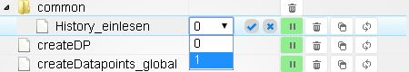

**注意：目前英文版包含更多信息，我们建议阅读它**

javascript适配器用于方便地创建、编辑和管理脚本。

＃＃ 配置
[这里有更多关于它的信息](https://github.com/ioBroker/ioBroker/wiki/ioBroker-Adapter-javascript#konfiguration)

 实际配置包括输入要加载的附加 npm 模块（以逗号分隔）和用于各种计算的地理坐标。例如，要获取坐标，您可以将 _google 地图_ 放大一点，然后单击所需位置。然后显示坐标。保存后，仍需使用红色播放按钮激活适配器。

* * *

＃＃ 服务
在安装过程中，另一个选项卡_Scripts_ 显示在_Admin_ 界面中。此处通过单击工具栏中的 (+)（红色圆圈）创建了一个新文件夹。通过其左侧的“空白表”图标创建一个新脚本。将打开一个窗口，询问文件夹结构中的名称和位置。

### 文件夹和文件列表
可以根据需要创建文件夹结构。存储位置对脚本的功能没有影响。除了树结构之外，还有一个列表视图。搜索字段使再次查找脚本变得更加容易。为了运行脚本，必须通过单击红色的_Play_ 按钮在左侧的文件夹结构中将其激活。要停止，请按绿色的_暂停_按钮。为每个脚本创建一个新对象。它的脚本名称加上 `_enabled`，位于文件夹 `javascript.Instanz.ScriptEnabled` 中。该对象使用 (`true/false`) 来指示脚本是否正在运行。状态也可以设置为打开/关闭脚本。 _global_ 文件夹中保存的脚本是全局脚本。这些在所有其他脚本之前在内部复制，即预先处理。这意味着全局函数可以应用于多个脚本。全局脚本中的变量可以在其他脚本中使用。但要小心：每个脚本都有自己的变量空间。所以不能在全局脚本中使用变量来实现脚本之间的值交换。为此必须使用对象（状态）。

###编辑
创建后，_Javascript_ 的编辑器会在右侧打开。可以在 [这里](http://www.iobroker.net/docu/?page_id=2786&lang=de) 中找到一些示例脚本。

＃＃＃＃ 姓
如果您之前已经分配了一个名称，它将显示在这里并且可以更改。

＃＃＃＃ 地点
所有创建的文件夹都显示在此下拉列表中。目前，它们是按创作时间顺序排列的。

＃＃＃＃ 发动机类型
您可以在此处选择是使用 _javascript_ 还是 _coffeescript_ 引擎。

＃＃＃＃ 日志
右下方是日志窗口，用于输出与所选脚本相关的所有日志。保存/重新启动脚本后会显示日志。

* * *

＃＃ 尖端
###备份
为了能够在有疑问的情况下恢复脚本，建议使用_复制和粘贴_来保存它们。

### 测试实例
通过创建另一个 JavaScript 实例并在该实例中启动脚本来测试新脚本已被证明是有用的。
可以通过下拉菜单将所需的实例设置在脚本名称后面。
如果脚本中存在严重错误，则只会终止这个额外的测试实例，而不是生产实例。

## Changelog
<!--
	### **WORK IN PROGRESS**
-->
### **WORK IN PROGRESS**
* (bluefox) Breaking change: all usages of `jsonata` must be rewritten to use promises.
* (bluefox) Breaking change: all blockly scripts with `jsonata` blocks must de changed (just move some blocks) and saved anew.
* (bluefox) Extended `createState` command with possibility to create aliases. 
* (bluefox) Corrected CRON card in rules 
* (bluefox) Added additional options to show the attributes of object in blockly
* (bluefox) Corrected `existsStateAsync` function
* (bluefox) Added `isDaylightSaving` state to indicate day saving time
* (AlCalzone) Pinned `@types/node` to v14

### 6.2.0 (2023-02-17)
* (Apollon77) Prevented duplicate schedule triggering with inaccurate RTC clocks
* (Apollon77) Fixed sendToAsync and sendToHostAsync
* (Apollon77) Added rename/renameFile(Async) methods
* (Apollon77) Deprecated get/setBinaryState(Async) methods and log a message on usage. Use Files instead!
* (Apollon77) Deprecated usage of own states in javascript.X.scriptEnabled/Problem and log a message on usage. Use own states in 0_userdata.0 instead!
* (bluefox) added axios to pre-installed modules. `request` will be removed in the future

### 6.1.4 (2022-11-14)
* (bluefox) Corrected small error in rules
* (bluefox) Tried to fix debug mode

### 6.1.3 (2022-11-03)
* (Apollon77) Prevent adapter crash when script could not be compiled

### 6.1.2 (2022-11-03)
* (bluefox) Added ukrainian translation

## License
The MIT License (MIT)

Copyright (c) 2014-2023 bluefox <dogafox@gmail.com>,

Copyright (c) 2014      hobbyquaker