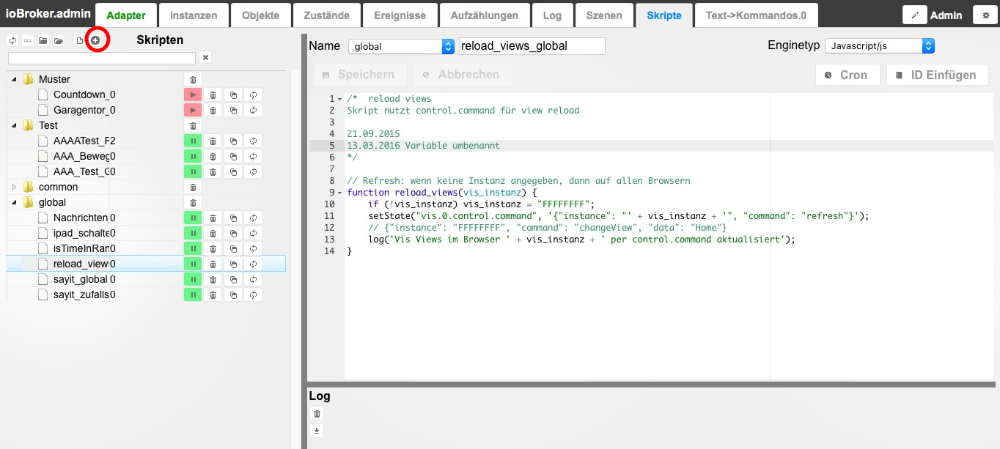

** 注意：目前英文版包含更多信息，我们建议阅读它**

javascript 适配器用于方便地创建、编辑和管理脚本。

＃＃ 配置
[这里有更多关于它的信息](https://github.com/ioBroker/ioBroker/wiki/ioBroker-Adapter-javascript#konfiguration)

 实际配置包括输入要加载的附加 npm 模块（用逗号分隔）和用于各种计算的地理坐标。例如，要获取坐标，您可以放大 _google maps_ 并单击所需位置。然后显示坐标。保存后，仍需使用红色播放按钮激活适配器。

* * *

＃＃ 服务
在安装过程中，_Admin_ 界面中会显示另一个选项卡_Scripts_。在这里，通过单击工具栏（红色圆圈）中的 (+) 来创建一个新文件夹。通过左侧的“空白表”图标创建一个新脚本。将打开一个窗口并询问文件夹结构中的名称和位置。

### 文件夹和文件列表
可以根据需要创建文件夹结构。存储位置对脚本的功能没有影响。除了树形结构外，还有一个列表视图。搜索字段使再次查找脚本变得更加容易。为了让脚本运行，必须通过单击红色的_Play_ 按钮在左侧的文件夹结构中激活它。要停止，请按绿色的_Pause_ 按钮。为每个脚本创建一个新对象。它的脚本名称带有 `_enabled` 并位于文件夹 `javascript.Instanz.ScriptEnabled` 中。该对象使用 (`true/false`) 来指示脚本是否正在运行。还可以设置状态以打开/关闭脚本。保存在 _global_ 文件夹中的脚本是全局脚本。这些在任何其他脚本之前在内部复制，即事先处理。这意味着全局函数可以应用于多个脚本。全局脚本中的变量可以在其他脚本中使用。但要小心：每个脚本都有自己的变量空间。所以不能在全局脚本中使用变量来在脚本之间交换值。为此必须使用对象（状态）。

### 编辑
创建后，_Javascript_ 的编辑器会在右侧打开。一些示例脚本可以在[这里](http://www.iobroker.net/docu/?page_id=2786&lang=de)中找到。

＃＃＃＃ 姓
如果您之前指定了名称，它将显示在此处并且可以更改。

＃＃＃＃ 地点
所有创建的文件夹都显示在此下拉列表中。它们目前按其创作的时间顺序排列。

＃＃＃＃ 引擎种类
在这里您可以选择是使用 _javascript_ 还是 _coffeescript_ 引擎。

＃＃＃＃ 日志
右下角是与所选脚本相关的所有日志输出的日志窗口。保存/重新启动脚本后会显示日志。

* * *

＃＃ 提示
### 备份
为了能够在有疑问时恢复脚本，建议使用_复制和粘贴_来保存它们。

### 测试实例
事实证明，通过创建另一个 JavaScript 实例并在此实例中启动脚本来测试新脚本很有用。
可以通过下拉列表在脚本名称后面设置所需的实例。
如果脚本中存在严重错误，则仅终止此附加测试实例，而不终止生产实例。

## Changelog
<!--
	Placeholder for the next version (at the beginning of the line):
	### **WORK IN PROGRESS**
-->
### 6.0.3 (2022-09-14)
* (AlCalzone) Downgrade Typescript to prevent errors with global typescript scripts

### 6.0.1 (2022-08-19)
* (bluefox) Fixed the wizard schedule
* (bluefox) Done small fixes on GUI

### 6.0.0 (2022-07-18)
* (bluefox) Removed support of coffeescript
* (bluefox) All coffee-scripts will be compiled to javascript permanently

### 5.8.10 (2022-07-15)
* (klein0r) Added variable timeout block
* (klein0r) Added `getInterval` and `getTimeout` blocks
* (klein0r) Added `sendTo` for scripts and message trigger blocks
* (bluefox) Corrected the syntax highlighting

### 5.8.8 (2022-07-13)
* (bluefox) Corrected error by start of GUI

## License
The MIT License (MIT)

Copyright (c) 2014-2022 bluefox <dogafox@gmail.com>,

Copyright (c) 2014      hobbyquaker